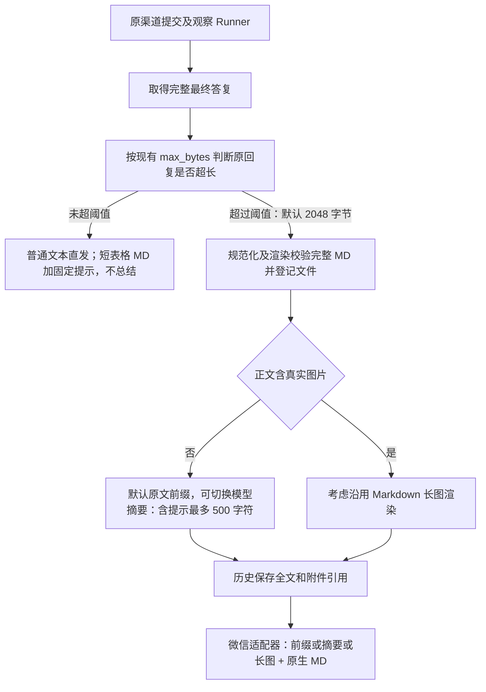

# 企业微信客服接入设计方案

> 版本: v1.0 | 创建: 2026-05-21 | 状态: 待审核

> 2026-10-09 补充：长答复渠道交付见 §十四；本节已完成代码实施，前文历史选型由本节的 KF owner 交付路径更新；尚未部署真机验收。用户最终确认原生全文 MD、纯文本摘要，以及仅正文图片考虑长图。

## 一、业务背景与目标

### 1.1 场景描述

企业微信客服场景：

```
企业员工（企微账号） ←→ 外部客户（微信个人号）
     ↑                        ↑
  企微内部通讯              1:1 单聊 / 群聊
```

企业通过企业微信添加外部客户的微信，建立一对一沟通渠道。在这个场景下，我们需要让 AI Agent **接管指定的企微客服账号**，自动与外部微信客户进行对话，实现 7x24 智能客服。

### 1.2 核心需求

1. **自动接管**：Agent 通过企微 API 自动接收和回复外部客户消息
2. **人工接管**：用户说"人工服务"时，会话转给真人客服
3. **多租户支持**：每个租户绑定自己的企微应用和客服账号
4. **多客服账号**：一个租户可以有多个客服账号，每个绑定不同的子智能体
5. **消息类型支持**：文本、图片、文件、链接等常见消息类型

### 1.3 与现有企微应用的区别

| 维度 | 现有企微应用（内部） | 微信客服（外部） |
|------|---------------------|---------------------|
| 通信对象 | 企业内部员工 | 外部微信用户 |
| 消息通道 | 应用消息 API | 微信客服 API |
| 触发方式 | 员工在工作台点击 | 客户在微信中发消息 |
| 消息收发 | 单向推送+回调 | 双向实时收发 |
| 回复限制 | 无限制 | 48 小时窗口 + 5 条/次 |

---

## 二、技术方案选型

### 2.1 方案对比

企业微信提供了多种与外部微信用户交互的 API：

| 方案 | 消息收发能力 | 合规性 | 适合场景 |
|------|------------|--------|---------|
| **微信客服 API** | 完整双向 | 完全合规 | AI 自动客服（推荐） |
| 客户联系 API | 仅欢迎语/群发模板 | 合规 | 营销触达 |
| 会话存档 API | 只读 | 合规（需付费） | 质检监控 |
| 接管员工账号 | 无官方支持 | 违反协议 | 不推荐 |

### 2.2 选定方案：微信客服 API

**微信客服**是企业微信提供的独立客服系统，支持通过 API 完全接管消息收发，天然适配 AI Agent 场景。

**核心优势**：

1. 官方正规通道，完全合规
2. 完整的双向消息 API（接收回调 + 读取消息 + 发送消息）
3. 内置"智能助手"接待模式，天然适配 AI 场景
4. 支持多场景接入（微信内链接、二维码、视频号、公众号、小程序、网页）
5. 不需要员工企微客户端在线
6. 会话转接机制原生支持（AI → 人工）

**核心限制**：

- 48 小时回复窗口：客户主动发消息后 48 小时内可回复
- 5 条消息限制：每次用户发消息后，企业最多可发 5 条；用户再发消息则刷新额度
- 客户需通过客服链接/二维码主动进入会话，不是在员工聊天窗口直接发消息

---

## 三、系统架构设计

### 3.1 整体架构

```
外部微信用户
    │
    │ 微信消息
    ▼
企业微信服务器
    │
    │ ① 回调推送（POST /t/{tenant_id}/wecom_kf/callback/{config_id}）
    ▼
Our Agent 后端（FastAPI）
    │
    │ ② 解析回调事件
    │ ③ 调用 sync_msg 拉取完整消息内容
    ▼
微信客服适配器（WeComKfAdapter）
    │
    │ ④ 转换为 UnifiedMessage
    ▼
渠道消息处理流程（channel_routes.py 已有逻辑）
    │
    │ ⑤ 路由到对应子智能体
    ▼
Agent 处理 → 生成回复
    │
    │ ⑥ 通过 WeComKfAdapter.send_message() 回复
    ▼
企业微信服务器
    │
    │ 微信消息
    ▼
外部微信用户
```

### 3.2 核心组件

#### 3.2.1 WeComKfAdapter（微信客服适配器）

新增渠道适配器，实现 `ChannelAdapter` 接口：

```
src/channels/wecom_kf/
├── __init__.py
├── adapter.py          # WeComKfAdapter 主类
├── crypto.py           # 复用现有 WeComCrypto（企微回调加密通用）
├── message.py          # 消息格式转换（微信客服消息 ↔ UnifiedMessage）
└── api_client.py       # 微信客服 API 封装（token、sync_msg、send_msg）
```

#### 3.2.2 API Client 核心接口

```python
class WeComKfApiClient:
    """微信客服 API 客户端"""

    async def get_access_token(self) -> str:
        """获取 access_token（带缓存和自动刷新）"""

    async def sync_msg(self, cursor: str = "", limit: int = 1000, voice_format: int = 0) -> dict:
        """拉取消息（POST /cgi-bin/kf/sync_msg）"""

    async def send_msg(self, touser: str, open_kfid: str, msgtype: str, content: dict) -> dict:
        """发送消息（POST /cgi-bin/kf/send_msg）"""

    async def send_welcome(self, code: str, content: dict) -> dict:
        """发送欢迎语（POST /cgi-bin/kf/send_msg_on_event）"""

    async def get_service_state(self, open_kfid: str, external_userid: str) -> dict:
        """获取会话状态"""

    async def trans_service_state(self, open_kfid: str, external_userid: str,
                                   service_state: int, servicer_userid: str = "") -> dict:
        """变更会话状态（接入/转接/结束）"""
```

### 3.3 消息流转设计

#### 3.3.1 接收消息流程

```
企业微信推送回调（含 encrypted XML）
    │
    ▼
1. 验证签名（verify_signature）
2. 解密消息体（WeComCrypto）
3. 解析 XML 获取 event_type
    │
    ├── event_type == "msg_send_fail" → 记录日志，忽略
    ├── event_type == "user_recall_msg" → 记录日志，忽略
    ├── event_type == "enter_session" → 发送欢迎语
    ├── event_type == "session_status_change" → 更新会话状态
    │
    └── event_type 包含消息 → 继续处理
        │
        ▼
4. 调用 sync_msg 拉取完整消息内容（带 cursor 分页）
5. 消息格式转换为 UnifiedMessage
6. 消息去重（MessageDeduplicator）
7. 立即返回 "success" 给企业微信（5秒要求）
8. 后台异步处理（asyncio.create_task）
    │
    ▼
9. 查找/创建 channel session
10. 路由到对应子智能体
11. Agent 生成回复
12. 通过 send_msg 发送回复
```

#### 3.3.2 发送消息流程

```
Agent 生成回复文本
    │
    ▼
1. 文本分割（长消息分段发送）
2. 消息格式检测（markdown vs 纯文本）
3. 调用 send_msg 发送（含重试和 token 刷新）
    │
    ├── 文本消息 → {"msgtype": "text", "text": {"content": "..."}}
    ├── 图片消息 → {"msgtype": "image", "image": {"media_id": "..."}}
    ├── 文件消息 → {"msgtype": "file", "file": {"media_id": "..."}}
    └── 链接消息 → {"msgtype": "link", "link": {"title": "...", "url": "..."}}
```

### 3.4 人工接管机制

#### 3.4.1 AI → 人工转接流程

```
用户发送"人工服务"/"转人工"等关键词
    │
    ▼
1. Agent 检测到人工服务意图
   （通过 system_prompt 指令识别）
    │
    ▼
2. Agent 回复："正在为您转接人工客服，请稍候..."
    │
    ▼
3. 调用 trans_service_state API：
   - service_state = 3（接入人工）
   - servicer_userid = 配置的接待人员
    │
    ▼
4. 后续消息由人工客服在企微端处理
   Agent 不再自动回复
```

#### 3.4.2 人工 → AI 接回流程

```
人工客服在企微端结束接待
    │
    ▼
1. 企业微信推送 session_status_change 回调
   service_state 变为 0（未处理/智能助手接待）
    │
    ▼
2. 后端更新会话状态
3. 后续客户消息重新由 AI Agent 处理
```

### 3.5 回调事件处理矩阵

| 事件类型 | 处理方式 | 说明 |
|---------|---------|------|
| 消息事件（text/image/voice/file/link等） | 转入 Agent 处理 | 核心业务 |
| `enter_session` | 发送欢迎语 | 客户首次进入会话 |
| `session_status_change` | 更新会话状态 | 跟踪 AI/人工切换 |
| `user_recall_msg` | 记录日志 | 用户撤回消息 |
| `msg_send_fail` | 重试或通知 | 消息发送失败 |

---

## 四、数据模型设计

### 4.1 复用现有表

| 表名 | 用途 |
|------|------|
| `tenant_channel_configs` | 存储微信客服配置（channel_type = "wecom_kf"） |
| `channel_sessions` | 微信客服会话管理 |
| `channel_messages` | 消息记录 |
| `channel_message_dedup` | 消息去重 |

### 4.2 微信客服配置格式

存储在 `tenant_channel_configs.config` JSON 中：

```json
{
    "corp_id": "ww1234567890",
    "secret": "客服secret",
    "token": "回调Token",
    "encoding_aes_key": "43位AES密钥",
    "kf_account": [
        {
            "open_kfid": "wkxxxxxx",
            "name": "售前咨询",
            "subagent_type": "sales-consultant",
            "welcome_message": "您好，我是AI智能客服，请问有什么可以帮您？",
            "servicer_userid_list": ["zhangsan", "lisi"],
            "allow_agent_transfer": true
        },
        {
            "open_kfid": "wkyyyyyy",
            "name": "售后服务",
            "subagent_type": "after-sales",
            "welcome_message": "您好，我是售后AI助手，请描述您的问题。",
            "servicer_userid_list": ["wangwu"],
            "allow_agent_transfer": true
        }
    ]
}
```

**字段说明**：

| 字段 | 说明 |
|------|------|
| `corp_id` | 企业微信企业 ID |
| `secret` | 微信客服应用的 Secret |
| `token` | 回调配置的 Token（用于签名验证） |
| `encoding_aes_key` | 回调配置的 EncodingAESKey |
| `kf_account` | 客服账号列表，支持一个配置对应多个客服账号 |
| `kf_account[].open_kfid` | 客服账号 ID（创建客服账号时生成） |
| `kf_account[].subagent_type` | 该客服账号绑定的子智能体类型 |
| `kf_account[].servicer_userid_list` | 可转接的人工客服企微 userid 列表 |
| `kf_account[].allow_agent_transfer` | 是否允许 Agent 主动转人工（默认 true） |
| `kf_account[].human_transfer_keywords` | 【已废弃】触发人工转接的关键词，不再使用 |

### 4.3 会话标识规则

`channel_sessions.session_id` 生成规则：

```
wecom_kf_{open_kfid}_{external_userid}
```

- `open_kfid`：客服账号 ID，区分不同客服入口
- `external_userid`：外部微信用户 ID（以 `wm` 开头）

### 4.4 用户身份管理

#### 4.4.1 企微隐私限制

**企业微信无法获取外部微信用户的手机号**。通过微信客服 API 能获取的客户信息：

| 字段 | 能否获取 | 说明 |
|------|---------|------|
| `external_userid` | 能 | 如 `wmXXXX`，脱敏标识 |
| 昵称 name | 能 | 自建应用可获取 |
| 头像 avatar | 仅自建应用 | 代开发应用不可获取 |
| 性别 gender | 能 | |
| unionid | 能 | 需绑定微信开发者 ID |
| **手机号** | **不能** | 隐私保护，API 不返回 |

#### 4.4.2 用户自动创建策略

微信客服客户首次进入时，系统自动创建用户账号：

```
客户首次进入微信客服会话
    │
    ▼
1. 用 external_userid 调用"获取客户详情"接口 → 获取昵称、头像
    │
    ▼
2. 检查是否已存在该 external_userid 关联的用户
    ├── 已存在 → 直接使用，创建/恢复会话
    │
    └── 不存在 → 自动创建新用户
        │
        ▼
        users 表插入新记录：
        {
            "user_id": "user_{uuid4_hex[:12]}",
            "username": "微信客户_{name}",       # 昵称
            "source": "wecom_kf",
            "phone": null,                        # 无手机号
            "metadata": {
                "external_userid": "wmXXXX",
                "avatar": "头像URL",
                "gender": 1,
                "open_kfid": "wkAAAA"
            }
        }
```

#### 4.4.3 手机号补全与用户合并

```
场景 A：对话中用户主动提供手机号
    │
    ▼
Agent 检测到手机号（或通过专门工具提取）
    │
    ▼
调用用户合并逻辑：
    1. 查找该手机号是否已关联其他用户
        ├── 无 → 更新当前用户的 phone 字段
        └── 有 → 合并用户：
            - 将当前会话的 channel_session 转移到已有用户
            - 保留两个 external_userid 的映射
            - 标记当前 wecom_kf 用户为"已合并"
            - 后续消息直接路由到已有用户

场景 B：通过小程序授权获取手机号（后续扩展）
    │
    ▼
微信客服发送小程序消息引导授权
    │
    ▼
用户点击授权 → 小程序 getPhoneNumber 接口 → 获取手机号
    │
    ▼
回调通知后端 → 触发同上的用户合并逻辑
```

#### 4.4.4 用户来源标识

在 `users` 表（或 `channel_sessions` 表）中通过 `metadata` 记录用户来源：

```json
{
    "source": "wecom_kf",
    "external_userid": "wmAAAA",
    "open_kfid": "wkXXXX",
    "name": "张三",
    "phone_bound": false,
    "merged_from": null
}
```

已合并的用户：
```json
{
    "source": "web",
    "phone": "138xxxx",
    "wecom_kf_bindings": [
        {"external_userid": "wmAAAA", "open_kfid": "wkXXXX", "merged_at": "2026-05-21T10:00:00"}
    ]
}
```

---

## 五、回调路由设计

### 5.1 路由注册

在 `src/saas/api/channel_routes.py` 中新增：

```python
# 微信客服回调
@router.get("/t/{tenant_id}/wecom_kf/callback/{config_id}")
async def wecom_kf_verify(request: Request, tenant_id: str, config_id: str):
    """企业微信验证回调URL有效性"""

@router.post("/t/{tenant_id}/wecom_kf/callback/{config_id}")
async def wecom_kf_callback(request: Request, tenant_id: str, config_id: str):
    """企业微信微信客服消息回调"""
```

### 5.2 ChannelFactory 注册

在 `src/saas/services/channel_factory.py` 中新增：

```python
_ADAPTER_CLASSES = {
    "wecom":    "src.channels.wecom.adapter.WeComAdapter",
    "dingtalk": "src.channels.dingtalk.adapter.DingtalkAdapter",
    "feishu":   "src.channels.feishu.adapter.FeishuAdapter",
    "wecom_kf": "src.channels.wecom_kf.adapter.WeComKfAdapter",  # 新增
}
```

### 5.3 ChannelType 枚举

在 `src/models/message.py` 中新增：

```python
class ChannelType(str, Enum):
    wecom = "wecom"
    dingtalk = "dingtalk"
    feishu = "feishu"
    web = "web"
    wecom_kf = "wecom_kf"  # 新增
```

---

## 六、运营配置设计

### 6.1 配置流程（租户管理员视角）

```
步骤 1：企业微信管理后台配置
    ├── 开启"微信客服"功能
    ├── 创建客服账号（获取 open_kfid）
    ├── 设置"通过 API 管理微信客服账号"
    ├── 创建自建应用，配置回调 URL
    └── 将自建应用设为"可调用接口的应用"

步骤 2：Our Agent 后台配置
    ├── 进入租户设置 → 渠道配置
    ├── 选择"企业微信客服"
    ├── 填写 corp_id、secret、token、encoding_aes_key
    ├── 配置客服账号列表：
    │   ├── 客服账号 ID（open_kfid）
    │   ├── 绑定的子智能体
    │   ├── 欢迎语
    │   └── 人工接待人员列表
    ├── 点击"验证"（触发回调URL验证）
    └── 验证通过后启用

步骤 3：获取客服链接
    ├── 系统自动生成客服链接（或从企微后台获取）
    ├── 配置到公众号菜单、小程序、网页等入口
    └── 客户点击链接即可发起 AI 对话
```

### 6.2 前端配置页面设计

在现有渠道配置页面中新增"企业微信客服"渠道类型，配置表单：

```
┌─────────────────────────────────────────────────────┐
│  渠道配置 > 企业微信客服                            │
├─────────────────────────────────────────────────────┤
│                                                     │
│  企业微信企业ID (corp_id)：                          │
│  ┌─────────────────────────────────────────────┐    │
│  │ ww1234567890                                │    │
│  └─────────────────────────────────────────────┘    │
│                                                     │
│  应用 Secret：                                      │
│  ┌─────────────────────────────────────────────┐    │
│  │ ••••••••••••••••••          [显示] [测试连接] │    │
│  └─────────────────────────────────────────────┘    │
│                                                     │
│  回调 Token：                                       │
│  ┌─────────────────────────────────────────────┐    │
│  │ my_callback_token                           │    │
│  └─────────────────────────────────────────────┘    │
│                                                     │
│  回调 EncodingAESKey：                              │
│  ┌─────────────────────────────────────────────┐    │
│  │ 43位密钥...                                 │    │
│  └─────────────────────────────────────────────┘    │
│                                                     │
│  回调 URL（复制到企微后台）：                        │
│  ┌─────────────────────────────────────────────┐    │
│  │ https://your-domain.com/t/xxx/wecom_kf/...  │ [复制] │
│  └─────────────────────────────────────────────┘    │
│                                                     │
│  ═══ 客服账号配置 ═══                               │
│                                                     │
│  ┌ 客服账号 1 ─────────────────────────────────┐    │
│  │ 客服账号名称：售前咨询                       │    │
│  │ open_kfid：wkAAAA                            │    │
│  │ 绑定子智能体：[下拉选择 ▼]                   │    │
│  │ 欢迎语：您好，我是AI智能客服...              │    │
│  │ 人工接待人员：[zhangsan] [lisi] [+添加]      │    │
│  │ 转人工关键词：人工服务, 转人工 [+添加]       │    │
│  └──────────────────────────────────────────────┘   │
│                                                     │
│  ┌ 客服账号 2 ─────────────────────────────────┐    │
│  │ ...                                         │    │
│  └──────────────────────────────────────────────┘   │
│                                                     │
│  [+ 添加客服账号]                                   │
│                                                     │
│              [验证连接]  [保存]  [取消]              │
│                                                     │
└─────────────────────────────────────────────────────┘
```

### 6.3 子智能体绑定策略

每个客服账号可以绑定一个子智能体，用于处理该客服入口的消息：

| 客服账号 | 绑定子智能体 | 适用场景 |
|---------|------------|---------|
| 售前咨询 | sales-consultant | 产品咨询、报价、方案推荐 |
| 售后服务 | after-sales | 退换货、维修、投诉处理 |
| 技术支持 | tech-support | 技术问题、使用指导 |
| 通用客服 | master-agent | 未指定时的默认处理 |

绑定关系通过 `kf_account[].subagent_type` 字段配置，在消息路由时通过 `agent_router.get_agent(subagent_type, session_id)` 匹配。

---

## 七、system_prompt 设计（人工转接指令）

为了让子智能体正确识别和处理人工转接需求，需要在客服场景的 system_prompt 中注入特殊指令：

```markdown
# 客服模式指令

你正在通过企业微信与外部客户进行实时对话。请遵循以下规则：

## 转人工规则
当客户表达以下意图时，必须触发转人工流程：
- 直接说"人工服务"、"转人工"、"人工客服"、"找真人"
- 表达强烈不满或投诉情绪
- 连续 3 次表示无法解决问题

转人工时：
1. 先回复客户："正在为您转接人工客服，请稍候..."
2. 调用 transfer_to_human 工具

## 回复规范
- 回复简洁明了，避免过长的段落
- 每条消息控制在 500 字以内
- 如果回复内容较长，分段发送
- 使用友好的客服语气
- 不要暴露你是 AI 的技术细节

## 消息限制
- 你每次回复后，客户再发消息你才能继续回复
- 避免一次发送超过 5 条消息
```

### 7.1 转人工工具

新增一个内置工具 `transfer_to_human`，供 Agent 调用。

> **2026-06-23 更新**：详见 [transfer_to_human_optimization.md](./transfer_to_human_optimization.md)。要点：
> - `reason` 字段必填，用于审计与会话元信息记录
> - **渠道隔离完全由 execute 段的 `get_kf_context()` 判断**——LLM 推理时拿不到渠道信息，因此 description/usage_guide 不再约束 LLM "仅在微信客服渠道调用"（这种约束无效）
> - 非微信客服渠道调用时返回友好失败提示 `"当前渠道未提供人工客服"`，LLM 收到后改为直接用文字回复用户
> - **【2026-06-30 更新】移除全部关键词校验**——`human_transfer_keywords` 字段废弃，转人工完全由 Agent 通过 `transfer_to_human` 工具调用处理
> - 新增 `kf_config.allow_agent_transfer` 开关（默认 true），允许租户管理员禁用 Agent 主动转人工
> - 会话 metadata 新增 `transfer_source=agent`，区别于关键词触发的转接

```python
class TransferToHumanInput(BaseModel):
    reason: str = Field(..., description="转人工原因，必填")

class TransferToHumanTool(BaseTool):
    name = "transfer_to_human"
    description = "将会话转接给人工客服。..."  # 描述何时转人工 + 调用后无需回复
    usage_guide = ""  # 渠道由 execute 段兜底，不污染系统提示词

    async def execute(self, **kwargs):
        # 1. get_kf_context() 为 None → 非微信渠道，返回友好失败
        # 2. allow_agent_transfer=false → 返回失败
        # 3. servicer_userid_list 为空 → 返回失败
        # 4. 调用 adapter.transfer_to_human()
        # 5. 更新 channel session metadata（含 transfer_source=agent）
```

---

## 八、关键技术实现

### 8.1 消息同步与 Cursor 管理

微信客服的 `sync_msg` 接口使用 cursor 分页机制：

```python
class CursorManager:
    """管理每个客服账号的消息同步游标"""

    def __init__(self):
        # 存储在 Redis 中，支持多 worker 共享
        # key: wecom_kf_cursor:{open_kfid}
        # value: cursor string
        pass

    async def get_cursor(self, open_kfid: str) -> str:
        """获取上次同步的 cursor"""

    async def set_cursor(self, open_kfid: str, cursor: str):
        """更新 cursor"""
```

**同步策略**：

1. 收到回调通知时，调用 `sync_msg` 拉取消息
2. 使用 cursor 递增拉取，直到 `has_more=0`
3. 每次成功拉取后更新 cursor
4. cursor 存储在 Redis 中（TTL 3 天，与微信客服消息保留期一致）

### 8.2 Token 管理

微信客服使用独立的 access_token，与现有企微应用 token 不同：

```python
class WeComKfApiClient:
    # token 缓存逻辑复用现有 WeComAdapter 的模式
    # key: wecom_kf_token:{corp_id}
    # 过期时间: expires_in - 300s（提前5分钟刷新）
    # 使用 asyncio.Lock 防止并发刷新
```

### 8.3 消息格式转换

```python
# 微信客服消息 → UnifiedMessage
def parse_kf_message(self, msg: dict) -> UnifiedMessage:
    """
    微信客服消息格式：
    {
        "msgid": "xxx",
        "open_kfid": "wkAAAA",
        "external_userid": "wmXXXXXXXX",
        "send_time": 1234567890,
        "origin": 3,  # 3=微信客户发送, 4=接待人员发送
        "servicer_userid": "",  # 接待人员（仅 origin=4 时有）
        "msgtype": "text",
        "text": {"content": "你好"}
    }
    """
    msg_type = msg.get("msgtype", "text")

    if msg_type == "text":
        content = msg.get("text", {}).get("content", "")
        message_type = MessageType.TEXT
    elif msg_type == "image":
        content = {"media_id": msg.get("image", {}).get("media_id", "")}
        message_type = MessageType.IMAGE
    elif msg_type == "voice":
        content = {"media_id": msg.get("voice", {}).get("media_id", "")}
        # 微信客服语音消息可能自带识别文本
        recognition = msg.get("voice", {}).get("Recognition", "")
        if recognition:
            content["text"] = recognition
        message_type = MessageType.TEXT  # 优先使用识别文本
    elif msg_type == "file":
        content = {"media_id": msg.get("file", {}).get("media_id", ""),
                   "file_name": msg.get("file", {}).get("file_name", "")}
        message_type = MessageType.FILE
    elif msg_type == "link":
        content = msg.get("link", {})
        message_type = MessageType.TEXT
    else:
        content = {"raw": str(msg)}
        message_type = MessageType.TEXT

    return UnifiedMessage(
        message_id=msg.get("msgid", ""),
        channel_type=ChannelType.WECOM_KF,
        user_id=msg.get("external_userid", ""),
        user_name="",  # 外部用户名需额外查询
        message_type=message_type,
        content=content,
        timestamp=datetime.fromtimestamp(msg.get("send_time", 0)),
        raw_message=msg
    )
```

### 8.4 发送消息（UnifiedResponse → 微信客服消息）

#### 8.4.1 格式兼容性问题

**微信客服 API 不支持 markdown 格式**（markdown/markdown_v2 是企微应用消息的类型，微信客服不支持）。

| Agent 输出格式 | Web 前端渲染 | 微信客服渲染 | 兼容方案 |
|---------------|-------------|-------------|---------|
| 纯文本 | 正常 | 正常 | 直接发送 |
| Markdown（表格、加粗、列表） | `marked` 渲染 | **纯文本显示，格式丢失** | 剥离 markdown 语法，转为纯文本 |
| DownloadFileCard（文件卡片） | `DownloadFileCard` 组件 | **无法渲染** | 转为 `link` 图文链接消息 |
| 图片（``） | 正常渲染 | **显示为纯文本** | 转为 `image` 消息（需上传 media） |

#### 8.4.2 文件发送方案

Agent 生成文件后，通过 `tool_result` 事件返回结构化的 `downloadableFiles` 数据。微信客服渠道需要将这些文件转为企微支持的消息格式。

**方案 A（初期，推荐）**：使用 `link` 图文链接消息

```json
{
    "msgtype": "link",
    "link": {
        "title": "📄 report.docx",
        "desc": "点击下载文件 (12KB)",
        "url": "https://your-domain.com/api/files/{file_id}/download?token=TEMP_TOKEN",
        "thumb_media_id": "MEDIA_ID"
    }
}
```

- 客户在微信中看到一个可点击的图文卡片
- 点击后跳转到浏览器下载文件
- **前提**：文件下载 API 需要支持临时 token 认证（无需登录即可下载）
- `thumb_media_id` 需要预设一个默认缩略图（上传一次后复用）

**方案 B（后续优化）**：上传为 media 后发送 `file` 类型消息

```json
{
    "msgtype": "file",
    "file": {
        "media_id": "MEDIA_ID"
    }
}
```

- 需要先调上传临时素材接口，把文件从服务器上传到企微 → 获取 media_id
- 客户在微信中直接下载文件，体验更原生
- 限制：media_id 有效期 3 天，大文件上传可能超时
- 需要多一步中转：本地文件 → 上传到企微 → 发送 media_id

#### 8.4.3 Markdown 文本处理

微信客服的 `text` 消息不支持 markdown，需要将 Agent 的 markdown 回复转为纯文本：

```python
import re

def markdown_to_plain_text(md: str) -> str:
    """将 markdown 转为纯文本，适配微信客服 text 消息"""
    # 剥离 HTML 标签
    text = re.sub(r'<[^>]+>', '', md)
    # 表格 → 保留文本内容，用空格分隔
    text = re.sub(r'\|', ' | ', text)
    text = re.sub(r'^[-:]+$', '', text, flags=re.MULTILINE)
    # 加粗/斜体 → 去除标记符
    text = re.sub(r'\*\*(.+?)\*\*', r'\1', text)
    text = re.sub(r'\*(.+?)\*', r'\1', text)
    # 链接 [text](url) → text(url)
    text = re.sub(r'\[(.+?)\]\((.+?)\)', r'\1(\2)', text)
    # 标题标记
    text = re.sub(r'^#{1,6}\s+', '', text, flags=re.MULTILINE)
    # 清理多余空行
    text = re.sub(r'\n{3,}', '\n\n', text)
    return text.strip()
```

#### 8.4.4 完整发送逻辑

```python
async def send_message(self, response: UnifiedResponse) -> bool:
    """发送消息到微信客服"""
    text = response.text
    downloadable_files = getattr(response, 'downloadable_files', [])

    # 1. 发送文本回复（markdown → 纯文本）
    plain_text = markdown_to_plain_text(text)
    parts = self._split_message(plain_text, max_bytes=2048)

    for part in parts:
        result = await self.api_client.send_msg(
            touser=response.reply_to,
            open_kfid=self.open_kfid,
            msgtype="text",
            content={"content": part}
        )
        if result.get("errcode", 0) != 0:
            logger.error(f"发送消息失败: {result}")
            return False

    # 2. 发送文件（如有）
    for file_info in downloadable_files:
        # 方案 A：link 图文链接
        download_url = file_info.get("download_url", "")
        # 确保是完整 URL
        if download_url.startswith("/"):
            download_url = f"{self.base_url}{download_url}"

        result = await self.api_client.send_msg(
            touser=response.reply_to,
            open_kfid=self.open_kfid,
            msgtype="link",
            content={
                "title": f"📄 {file_info.get('file_name', '文件')}",
                "desc": f"点击下载 ({format_size(file_info.get('file_size', 0))})",
                "url": download_url,
                "thumb_media_id": self.default_thumb_media_id,
            }
        )
        if result.get("errcode", 0) != 0:
            logger.error(f"发送文件链接失败: {result}")

    return True
```

#### 8.4.5 临时下载链接机制

现有 `/api/files/{file_id}/download` 接口需要认证。微信客户在浏览器中点击文件链接时无法携带登录态，需要支持临时 token：

```
GET /api/files/{file_id}/download?token=TEMP_TOKEN

TEMP_TOKEN 生成规则：
- 包含 file_id、过期时间（默认 1 小时）
- 使用 HMAC-SHA256 签名
- 无需登录即可下载
- 一次性或短时效，防止链接泄露
```

**涉及文件**：`src/api/files.py`（或对应文件下载路由），新增 `token` 参数验证逻辑。

### 8.5 回调处理核心流程

```python
async def wecom_kf_callback(request: Request, tenant_id: str, config_id: str):
    """微信客服消息回调"""
    # 1. 读取 raw body
    body = await request.body()

    # 2. 解析 XML，提取 Encrypt 字段
    xml_data = parse_xml(body)
    encrypt = xml_data.find("Encrypt").text

    # 3. 创建适配器
    adapter, _, subagent_type = ChannelFactory.create_from_tenant_config(
        tenant_id, "wecom_kf", config_id
    )

    # 4. 验证签名 + 解密
    msg_signature = request.query_params.get("msg_signature")
    timestamp = request.query_params.get("timestamp")
    nonce = request.query_params.get("nonce")

    if not adapter.verify_signature(msg_signature, timestamp, nonce, encrypt):
        return Response(content="invalid signature", status_code=403)

    decrypted = adapter.crypto.decrypt(encrypt)

    # 5. 解析回调事件
    callback_xml = parse_xml(decrypted)
    event_type = callback_xml.find(".//Event")?.text

    if event_type == "change_type":
        change_type = callback_xml.find(".//ChangeType").text

        if change_type == "kf_msg_or_event":
            # 消息事件 → 拉取消息处理
            open_kfid = callback_xml.find(".//OpenKfId").text
            asyncio.create_task(
                _process_kf_messages(tenant_id, config_id, open_kfid, adapter)
            )

        elif change_type == "session_status_change":
            # 会话状态变更 → 更新本地状态
            await _handle_session_status_change(callback_xml, tenant_id)

    # 6. 立即返回 success（5 秒要求）
    return Response(content="success")


async def _process_kf_messages(tenant_id, config_id, open_kfid, adapter):
    """后台拉取并处理微信客服消息"""
    # 1. 查找该 open_kfid 对应的客服账号配置
    kf_config = adapter.get_kf_config(open_kfid)
    if not kf_config:
        logger.warning(f"Unknown open_kfid: {open_kfid}")
        return

    # 2. 拉取消息
    cursor = await cursor_manager.get_cursor(open_kfid)
    has_more = True

    while has_more:
        result = await adapter.api_client.sync_msg(
            cursor=cursor,
            limit=100
        )
        has_more = result.get("has_more", 0) == 1
        cursor = result.get("next_cursor", "")

        for msg in result.get("msg_list", []):
            # 跳过非客户消息（origin=3 是客户，origin=4 是接待人员）
            if msg.get("origin") != 3:
                continue

            # 3. 消息去重
            msg_id = msg.get("msgid", "")
            if await MessageDeduplicator.is_duplicate(msg_id):
                continue

            # 4. 转换为 UnifiedMessage
            unified_msg = adapter.parse_message(msg)

            # 5. 查找/创建会话
            session_id = f"wecom_kf_{open_kfid}_{unified_msg.user_id}"
            session = await channel_session_manager.get_or_create_session(
                channel_type="wecom_kf",
                channel_user_id=unified_msg.user_id,
                channel_chat_id=open_kfid,
                tenant_id=tenant_id,
                context_data={"open_kfid": open_kfid}
            )

            # 6. 保存用户消息
            await channel_session_manager.add_message(
                session_id=session.session_id,
                role="user",
                content=unified_msg.text or str(unified_msg.content),
                metadata={"msgid": msg_id, "msgtype": msg.get("msgtype")}
            )

            # 7. 检查人工转接关键词
            if adapter.should_transfer_to_human(unified_msg.text, kf_config):
                await _transfer_to_human(adapter, session, kf_config)
                continue

            # 8. 路由到子智能体
            subagent_type = kf_config.get("subagent_type", "master")
            agent = agent_router.get_agent(subagent_type, session_id)

            # 9. Agent 处理
            reply = await agent.process_message(
                user_input=unified_msg.text or "[非文本消息]",
                session_id=session_id
            )

            # 10. 发送回复
            response = UnifiedResponse.from_text(
                text=reply,
                reply_to=unified_msg.user_id,
                message_id=str(uuid4())
            )
            await adapter.send_message(response)

            # 11. 保存助手回复
            await channel_session_manager.add_message(
                session_id=session.session_id,
                role="assistant",
                content=reply
            )

        # 更新 cursor
        await cursor_manager.set_cursor(open_kfid, cursor)
```

---

## 九、文件变更规划

### 9.1 新增文件

| 文件 | 说明 |
|------|------|
| `src/channels/wecom_kf/__init__.py` | 模块初始化 |
| `src/channels/wecom_kf/adapter.py` | 微信客服适配器（核心） |
| `src/channels/wecom_kf/api_client.py` | 微信客服 API 客户端 |
| `src/channels/wecom_kf/message.py` | 消息格式转换 |
| `src/channels/wecom_kf/crypto.py` | 复用现有 WeComCrypto 或重新导入 |
| `src/tools/transfer_to_human.py` | 转人工工具 |

### 9.2 修改文件

| 文件 | 改动 |
|------|------|
| `src/models/message.py` | ChannelType 枚举新增 `wecom_kf` |
| `src/saas/services/channel_factory.py` | `_ADAPTER_CLASSES` 新增 `wecom_kf` |
| `src/api/files.py`（或文件下载路由） | 新增临时 token 下载机制 |
| `src/saas/api/channel_routes.py` | 新增微信客服回调路由 |
| `src/core/agent.py` | `AGENT_TOOLS` 新增 `transfer_to_human` |

### 9.3 前端变更

| 文件 | 改动 |
|------|------|
| `frontend/src/api/channel.ts` | 新增微信客服配置 API |
| `frontend/src/components/ChannelConfig.vue` | 新增微信客服渠道配置表单 |

---

## 十、开发计划

### Phase 1: 核心后端（预计 6-8 天）

| 任务 | 涉及文件 | 预计天数 |
|------|----------|---------|
| 1.1 WeComKfApiClient API 封装 | `src/channels/wecom_kf/api_client.py` | 1 天 |
| 1.2 WeComKfAdapter 适配器 | `src/channels/wecom_kf/adapter.py` | 1.5 天 |
| 1.3 回调路由 + 消息处理 | `src/saas/api/channel_routes.py` | 1.5 天 |
| 1.4 Cursor 管理器 | `src/channels/wecom_kf/cursor.py` | 0.5 天 |
| 1.5 转人工工具 | `src/tools/transfer_to_human.py` | 0.5 天 |
| 1.6 ChannelFactory + 枚举注册 | 多文件 | 0.5 天 |
| 1.7 Markdown 转纯文本 + 文件 link 消息 | `src/channels/wecom_kf/adapter.py` | 0.5 天 |
| 1.8 临时下载链接机制 | `src/api/files.py` | 0.5 天 |
| 1.9 单元测试 | `tests/unit/tools/test_wecom_kf.py` | 1 天 |

**验收标准**：
- [ ] 微信客服回调 URL 验证通过
- [ ] 能接收外部微信客户消息并自动回复
- [ ] Markdown 格式的回复在微信中可读（剥离格式标记）
- [ ] Agent 生成的文件以 link 卡片形式发送，客户点击可下载
- [ ] 临时下载链接有效且有时效控制
- [ ] 人工转接功能正常
- [ ] 消息去重和 cursor 管理正常

### Phase 2: 前端配置页面（预计 2-3 天）

| 任务 | 涉及文件 | 预计天数 |
|------|----------|---------|
| 2.1 微信客服配置 API | `src/saas/api/channel_routes.py` | 0.5 天 |
| 2.2 前端配置页面 | `frontend/src/components/ChannelConfig.vue` | 1.5 天 |
| 2.3 配置验证功能 | 前后端 | 0.5 天 |

**验收标准**：
- [ ] 租户管理员可自助配置微信客服
- [ ] 配置验证流程正常
- [ ] 多客服账号配置支持

### Phase 3: 生产优化（预计 2-3 天）

| 任务 | 说明 | 预计天数 |
|------|------|---------|
| 3.1 消息发送限流 | 适配 5 条/次限制 | 0.5 天 |
| 3.2 文件直发（方案 B） | 文件上传为 media_id，发送 file 类型消息，体验更原生 | 1 天 |
| 3.3 接收图片/文件消息 | 客户发送的图片和文件通过 media_id 下载后传入 Agent | 1 天 |
| 3.4 错误恢复与重试 | token 刷新、消息重发 | 0.5 天 |
| 3.5 监控与告警 | 回调异常、发送失败监控 | 0.5 天 |
| 3.6 集成测试 | 端到端测试 | 0.5 天 |

**验收标准**：
- [ ] 消息发送限流合规
- [ ] 文件以原生 file 消息发送，客户直接下载
- [ ] 客户发送的图片和文件 Agent 可识别
- [ ] 异常场景有合理恢复机制

---

## 十一、风险与注意事项

### 11.1 技术风险

| 风险 | 影响 | 缓解措施 |
|------|------|---------|
| 48 小时回复窗口 | 超时无法回复客户 | 监控未回复消息，及时提醒 |
| 5 条消息限制 | 复杂回复受限 | 长文本分段，控制单次回复量 |
| 回调 5 秒响应要求 | 企微重试导致重复处理 | 立即返回 HTTP 200 "success"，Agent 处理放后台 asyncio.Task（见下方说明） |
| Token 并发刷新 | 重复请求 | 使用 asyncio.Lock + 缓存 |
| Cursor 丢失 | 重复拉取消息 | Redis 持久化 + 消息去重 |

#### 11.1.1 "5 秒回调响应"机制详解

这个限制**只影响回调 HTTP 响应，不影响 Agent 处理时间**。

```
企业微信推送回调
    │
    ▼
我们的回调路由处理（必须在 5 秒内）：
    ├── 验证签名 ──→ 几毫秒
    ├── 解密消息 ──→ 几毫秒
    ├── 消息去重检查 ──→ 几毫秒
    ├── 创建后台任务 ──→ 几毫秒
    └── 返回 HTTP 200 "success" ──→ 总计远小于 5 秒
         │
         │  后台 asyncio.Task（不受 5 秒限制）：
         │  ├── Agent 推理 ──→ 可能 10-60 秒
         │  ├── 工具调用 ──→ 可能多次，每次数秒
         │  ├── 生成回复 ──→ 数秒
         │  └── 调用 send_msg API 主动推送给客户
         │
         ▼
客户收到 Agent 回复（通过独立 HTTP 请求推送，与回调无关）
```

关键点：**回调响应和消息回复是两个完全独立的 HTTP 请求**。回调响应只是告诉企微"我收到了"，Agent 回复是通过 `send_msg` API 主动推送。现有企微渠道 (`_process_tenant_wecom_background`) 已经采用这个模式。

### 11.2 运营风险

| 风险 | 影响 | 缓解措施 |
|------|------|---------|
| 转人工不及时 | 客户体验差 | 关键词触发 + 情绪检测 |
| 多客服账号管理混乱 | 配置错误 | 前端校验 + 配置预览 |
| 企业微信 API 变更 | 功能失效 | 关注官方公告，预留适配层 |

### 11.3 合规注意事项

1. **数据隐私**：外部客户的微信消息属于敏感数据，存储需加密，遵守《个人信息保护法》
2. **消息存档**：企微端会话存档为客户自主开通的增值功能；我们系统已通过 `channel_messages` 表存储所有往来消息
3. **客户知情**：建议在欢迎语中告知客户正在与 AI 对话
4. **企业微信审核**：部分 API 能力需要企业微信认证

---

## 十二、与现有系统的集成点

### 12.1 复用的组件

| 组件 | 复用方式 |
|------|---------|
| `WeComCrypto` | 直接复用，加密算法相同 |
| `MessageDeduplicator` | 直接复用，消息去重逻辑通用 |
| `ChannelSessionManager` | 直接复用，channel_type 区分 |
| `ChannelFactory` | 扩展注册，新增 wecom_kf 类型 |
| `agent_router` | 直接复用，按 subagent_type 路由 |

### 12.2 新增的组件

| 组件 | 说明 |
|------|------|
| `WeComKfAdapter` | 微信客服适配器 |
| `WeComKfApiClient` | 微信客服 API 客户端 |
| `CursorManager` | 消息同步游标管理 |
| `TransferToHumanTool` | 转人工工具 |

---

## 十三、待讨论事项

1. **会话存档**：企微端的会话存档是增值付费功能，由客户自行决定是否开通，不影响我们系统。我们系统端的会话存储已通过现有 `channel_sessions` + `channel_messages` 表覆盖，`channel_type = "wecom_kf"` 自然隔离，无需额外设计
2. **图片/文件消息优先级**：已确定初期方案——Agent 回复中的 markdown 转纯文本发送，生成的文件通过 `link` 图文链接卡片发送（Phase 1）；后续优化为 `file` 类型直接发送（Phase 3）；客户发送的图片/文件在 Phase 3 支持
3. **客户身份关联**：已确定方案——企微无法获取外部用户手机号，首次进入时用 `external_userid` 自动创建无手机号用户；对话中用户提供手机号后触发用户合并；后续可扩展小程序授权获取手机号。详见 4.4 节
4. **多 Agent 协作**：已确定——不需要多 Agent 协作，一个客服账号绑定一个子智能体即可
5. **主动消息能力**：已确定——不需要，仅在 48 小时窗口内回复即可
6. **会话评估机制**：已确定——不需要
7. **敏感词过滤**：已确定——不需要
8. **客户画像集成**：已确定——不需要自动回流到 CRM

---

## 十四、2026-10-09 长答复交付调整

关联：[代码调研](../../research/wecom-kf-long-reply-delivery-research.md)、[开发计划](../../plans/plan-wecom-kf-long-reply-delivery.md)、[既有配额方案](reply_quota_control_plan.md)。本节更新既有渠道交付设计，已完成代码与自动化验证，尚未部署真机验收。

### 14.1 用户决策与适用范围

渠道模块负责处理完整 Agent 答复；原任务的 AgentRunner、提示词与工具调用保持现状。用户最终选择：

1. 将需文件交付的完整正文确定性保存为标准 Markdown（MD），作为微信原生文件发送，不只改后缀。
2. 仅当原回复超过现有代码的长度阈值时，渠道默认取原文开头作为纯文本预览，截断时加省略号，并提示查看完整 MD；先观察此算法效果，后续可明确切换为模型摘要。允许分段和列表，禁止表格。500 字是呈现文字输出上限，不是是否处理超长回复的阈值。
3. 只有正文含真实图片才考虑长图；表格在 MD 中保留，不触发长图。正常情况下长图与摘要二选一，不同时发送。

最新要求取代前版 TXT 和“表格即长图”的方案。摘要触发沿代码现有判断：`len(markdown_to_plain_text(text).encode('utf-8')) > adapter._max_bytes`，当前默认阈值为 2048 字节，保留配置覆盖；等于阈值不触发。未超阈值的普通回复直发，不因超过 500 字符而总结。短表格不转图，可用标准 MD 与固定附件提示展示，但不调用摘要模型。独立 ImageRef（例如顾问二维码）继续沿原图片交付逻辑，不因它存在就把普通正文变成长图。

生成后的原文前缀或模型摘要连同省略号及附件提示须不超过 500 字符。这是呈现文字输出约束，不改变原答复的现有触发阈值。500 字计入整条文字的空白、换行、标点、列表符号和附件提示，不只计算汉字。

### 14.2 职责与接入位置



渠道准备模块放在 `src/channels/wecom_kf/`。在 `ChannelSessionManager.process_and_persist` 的成功结果净化后、最终 assistant metadata 与持久化 batch 构造前接入可选准备回调，由 KF 路由提供；其余渠道缺省行为不变。已实现 `prepare_response` 回调与 `prepare_reply` 准备结果，属于渠道进程内部接口，不是 Runner wire 扩展。

准备结果至少区分：规范化全文、发送用前缀/摘要或长图素材、全文 MD 引用与其他附件。不可直接覆盖 `response_text` 为呈现文字：会话历史、后续模型上下文及 recap 应保留完整业务答案。自动文件加入现有 `downloadableFiles` 元数据；若记录呈现文本/方式，使用渠道消息已有 metadata 扩展，明确它与全文是两种投影。

不在 adapter 内隐式创建无法落库的下载附件；adapter 负责微信素材上传与发送。模型摘要是对既有正文的呈现加工，不执行工具、不启动第二个 Agent loop、不接管原任务。不创建 KF 专用 Runner、队列、投递服务、容器或 Runtime 设备调用。

### 14.3 标准 Markdown 文件与进入条件

- 原回复使用现有 `markdown_to_plain_text` 后按 UTF-8 字节数与 `adapter._max_bytes` 比较（默认 2048），不使用 500 字符判断是否超长。生成后的摘要才做字符数上限检查。表格本身不触发模型总结；正文图片独立判定是否考虑长图，不再用合并的 `contains_table_or_image` 决定长图。代码块/行内代码中的示例不当成真实表格或图片。
- MD 内容为完整最终可见正文，按 [GFM 常用子集](https://github.github.com/gfm/#tables-extension)归一化：CommonMark 基础语法与管道表格扩展。保留标题、列表、链接、表格和代码，不能先转换为纯文本再改成 .md，也不能以摘要替代全文。
- 表格有表头、分隔行及数据行；只做不改变业务内容的确定性修复，如必要空行、明确列边界及单元格内竖线转义。验证识别到的表格渲染为真正表格，表头/单元格/数字完整；不能让解析器静默忽略多余列。无法可靠修复时记录格式准备失败，保留原文排查，不发送伪称已规范化的文件。
- 现有 `sanitize_llm_markdown` 仅处理意外引用，不是 Markdown 格式验证器。优先验证已有 Python Markdown 与 tables 扩展可否满足相关规范样例，不将“能解析”或“文件有 .md 后缀”等同结构正确；不要求支持全部 GFM 扩展，也不全局改造其他渠道的清理器。
- 文件由确定性代码写成 UTF-8，后缀 .md、MIME text/markdown，不调用 `write`、`cp` 或另一个模型重写全文；不把整篇放进代码围栏、HTML 文档或 JSON 转义字符串中。纯段落本身合法，不强制添加装饰性标题。
- 无需归一化的正文逐字核对；有格式变换时记录变换并逐表格单元格、链接和代码核对内容完整性。文件不包含 reasoning、工具消息、内部提示或服务端路径。
- Markdown 图片引用必须是标准图片语法；内部 file_id 或本机路径仅通过既有授权资源映射转换，无法交付的图片如实保留说明并考虑长图，不静默丢掉图片。MD 不嵌入图片二进制。
- 文件存放在可信租户 conversation 目录，用业务显示名，例如 `详细答复.md`。复用现有文件注册格式和下载入口；必要时从 cp 提取最小注册原语，显式传 tenant/user/session，不伪造工具事件或工具执行身份。
- 文件引用必须属于本次 owner 与可信租户；共享 adapter 不保存本轮状态。准备重入不能重复加入附件；现有注册 TTL 与文件清理策略沿用，不虚构永久有效的链接。

### 14.4 文字呈现与长图二选一

超过现有长度阈值且未选择长图的正文默认执行 §14.4.1 的原文前缀算法，不调用摘要模型。仅在明确切换为 llm 模式后应用以下模型摘要约定：仅把完整可见正文作为摘要素材，要求保留核心结论、数字和必要限制，不新增答案；正文内指令按数据处理。摘要不提供工具、历史推理或额外任务上下文。摘要是纯文本，可分段和用 `-`、`•`、`1.` 列表符号；禁止管道/HTML 表格、图片、代码围栏和依赖 Markdown 渲染的格式。

摘要须作为原答复的精简版直接回答客户，沿用原答复的语言、称谓、人称、礼貌程度、专业表达和必要的下一步建议，不切换为文档摘要/第三方转述口吻，不使用“原文指出”“摘要如下”等开头，不自行添加新角色或改为机械公告。以完整原回复作为内容与风格范本；如需表达上下文，可提供当前用户问题，不引入新的业务事实或复制 Runner 内部提示词。风格一致不能改变原文结论、弱化风险条件或把不确定性改成确定承诺。

摘要提示约定为“将这份答复压缩为可直接发给同一位客户的回答，保留原语言和语气，直接回应问题；仅压缩内容，不评论原文”。最终仍执行纯文本格式及 500 字符检查，附件提示自然接在回答后，不另造摘要标题。

摘要正文为附件提示预留字符空间。确定性纯文本格式处理后追加“完整内容请查看附件《详细答复.md》”，整条不超过 500 字符。不能把多个 text 分段发送来绕开限制，段落均属于同一条消息；字符数检查在追加提示后进行。其他渠道现有纯文本转换器会保留表格的场景不能直接视为摘要合格。

沿用统一 LLM 网关、现有 provider 配置与用量记录。对话内优先 `chat_no_thinking`，遵循既有[chat_lite 计费错配修复](../../plans/chat-lite-billing-model-mismatch.md)：不能简单把 lite tokens 累加后按主模型计价。若将来采用独立便宜模型，必须先匹配其独立计价，不在本轮顺便改造全部多模型计费。

摘要正常一次调用并设有限超时；输出经格式处理仍有表格/非法呈现格式、超过 500 字符、空白、超时或失败时，使用下述原文前缀算法；不反复调用模型修复长度。极端正文超过模型输入预算或模型不可用时直接走前缀，不发起摘要调用。前缀是原回复的截取预览，不伪称概括了全文；完整 MD 始终保留。只有前缀转换失败或无可读正文时，才使用固定附件说明。

#### 14.4.1 确定性原文前缀算法

该算法不调用大模型，以规范化完整正文为来源，保持原回复开头的语言、称谓、语气和内容顺序。支持渠道单一策略选项 `summary_mode=prefix|llm`，默认 prefix，先观察算法效果；后续效果不佳时再明确切换为 llm，不能自动升级为模型调用或产生额外摘要费用。llm 模式失败仍回退到本算法；不为此新增后台 UI、另一套任务循环或发布流程。两种策略复用同一触发阈值、完整 MD、发送预算及 500 字符输出上限。

1. 仅在原回复按现有 max_bytes 判断超长、且本轮选择文字呈现时执行。原文前缀不因 500 字触发，也不改图片长图的选择；转人工、取消、发送结果未知不触发新的补发。
2. 把原正文按源顺序投影为可读纯文本，保留段落和列表；去掉 Markdown 装饰、代码围栏及图片语法。表格须按表头/单元格转为“字段：值”的顺序文本，不保留管道表格或 HTML 表格，不简单沿用会留下 `|` 的旧纯文本转换结果。代码里的字面竖线不误判为表格；不生成新业务内容。
3. 受控业务文件名为 `详细答复.md`。后缀固定为 `\n\n完整回复请查看发送的文件《详细答复.md》。`，省略标记为 `…`。先预留后缀及省略号的字符预算，前缀最大长度为 `500 - len(后缀) - len(省略标记)`；所有字符计数遵循本文的 Unicode 字符口径，不新增固定截取字数或字节阈值。
4. 取预算内原文前缀，优先在靠后的完整段落、句子或列表项末尾截断；没有合适边界时按完整 Unicode 字符截取，不按 UTF-8 字节硬切。避免把 URL、数字中的点误当句末；有可复用的 Unicode 组合字符边界能力时避免拆开组合字符。
5. 截取导致后文被省略时，输出“前缀 + … + 后缀”。转换后正文全部可放下则不伪造截断，只追加后缀。截取时同时为后缀和省略号预留现有 `max_bytes` 字节预算，逐 Unicode 字符计数；整条再验证纯文本、无表格、不超过 500 字符且满足渠道字节上限；不增加“摘要如下”标题。
6. 前缀为空/转换失败时用固定附件提示作为最后兜底，不转为模型调用；MD 未成功保存/注册时，沿文件准备失败路径处理，不能声称文件存在。前缀展示只改变渠道发送文本，不能覆盖历史全文或 MD 内容。

例如发送效果为：“您可以先确认订单状态，再按以下步骤处理：\n1. ……\n2. ……\n…\n\n完整回复请查看发送的文件《详细答复.md》。”实际前缀来自原答复，不由算法编造这些步骤。

默认 prefix 不产生摘要模型调用/token/费用；若明确切换到 llm 后调用失败再走 prefix，已经实际发生的 LLM 消耗仍按既有要求计费，前缀算法不额外收费。记录实际采用 prefix/llm/固定提示的呈现方式，便于后续比较和切换。

只有正文真实图片才考虑 Markdown 长图渲染，采用独立图片结构判定；表格不成为转图条件，MD 本身保留表格。长图末尾加入查看 MD 的提示，避免额外占一条文字消息。MD 不混入交付提示；长图只用于展示，完整文件始终随需要文件的答复交付。图片不能读取或无法安全引用时沿既有失败规则处理，不擅自扩大文件/网络访问权限。

现有 `_send_full_text_as_image` 混合渲染、上传和发送并统一返回 bool；新路径需能区分准备失败与发送未知。渲染/上传明确失败或渲染功能关闭时按 summary_mode 选择文字呈现（模型摘要或原文前缀）+ MD；已发长图结果未知不盲目再发文字。图片文件类型、大小及渲染失败继续尊重平台限制，不承诺任意长度内容都能渲染为一张合法图片。

### 14.5 原生文件、顺序与预算

准备阶段完成文件注册及展示素材后，原生 MD 由已有 `upload_media(media_type='file')` 获得 media_id，再由 `send_msg(msgtype='file', content={'media_id': ...})` 发送。上传必须使用业务显示名，不暴露 `file_id.md` 物理名或服务端路径。

正常超长交付为两条消息：①原文前缀/模型摘要文字（含附件提示）或长图（含附件提示），②完整 MD。其他独立图片、业务文件使用剩余预算；给自动 MD 设置本轮内部用途标识/优先级，不将所有业务 MD 都改为此策略。

KF owner 级 `WeComKfReplyBudget` 无论 verbose 开关均创建；状态提示预留两次最终交付，不再只预留正文一次。不要依赖 LLM 遵守发送条数。预算不代表平台实际剩余额度；平台会话状态、48 小时窗口与发送失败仍需按实际结果处理。

自动 MD 的优先级高于额外图片/业务文件；保留旧转人工成功后抑制回复的语义。长图已经成功但 MD 失败属于不完整交付，不能当整轮成功或触发成功 recap。部分发送不自动重跑完整答复；沿原渠道发送路径返回实际失败与诊断。

### 14.6 失败、历史与费用

| 情况 | 处理 |
|---|---|
| 保存/注册 MD 失败 | 不声称存在附件，发送有界失败说明，记录全文交付失败 |
| 显式 llm 模式下模型摘要失败、超时、超限或格式不合规 | 原文前缀 + 已保存的全文 MD；前缀不可读时才用固定附件提示 |
| 默认 prefix 策略 | 直接前缀 + MD；前缀不可用时用固定提示，不自动调用模型，无摘要模型费用 |
| 长图渲染/上传明确失败 | 按 summary_mode 选择文字呈现 + MD，不拆原文为无界多条 text |
| MD 上传明确失败 | 若已注册链接可用，明确说明后降级下载链接；无需 `public_base_url` 的原生路径仍优先 |
| 微信发送拒绝或超时 | 区分明确拒绝与结果未知；未知不盲目补发，避免重复及挤占预算 |
| 长图/摘要成功，MD 失败 | 部分交付，保存事实并返回失败；不把接口接受等同客户已看到 |

历史保留全文及附件引用，可记录摘要/长图的交付投影；失败不删除已保存的原答案。摘要模型返回的实际 usage 由渠道现有记录服务保存，设置实际模型/provider，修订 `skip_save` 的 ASR-only 假设。只记录本地摘要与 ASR；Runner 的原任务费用继续由 Runner 结算，不重复导入渠道记录。取消、失败但已有 usage 的摘要调用也记录实际用量，未知 usage 明确标记，不伪造为零。KF 路由在 `finally` 中结束本轮 record，取消继续传播。摘要物理调用前按实际模型核验文本输入/输出单价，缺价或核验失败直接回退前缀，不发起该模型请求。

摘要是明确收费的模型调用，不能仅记日志/token 而不进入计价扣费。记录实际模型/provider、输入/输出及缓存 token 等既有计费字段，通过现有 `SessionRecordService.save` 的计价、chat_records 与租户余额扣减完成结算，关联可信 tenant/user/session 和本轮 owner；只算新增摘要消耗，按项目既有单价、缓存与取整规则收费。摘要未被使用、格式不合格或最终文件发送失败不抹掉已发生的模型消耗；未调用模型的短回复/固定说明不虚构摘要费用。

当前记录服务存在单价缺失按零及保存异常只记日志的既有容错，开发验收必须检查实际计价和余额变化，不能以 `add_llm_usage` 已调用作为“已收费”的证据。单价或账务保存异常明确记录未完成计费，不伪装免费或已结算，不盲目重放可能已发生的扣费；本功能不另建账务系统。

### 14.7 兼容与验证

本次调整作用于 KF 的长文、表格与正文图片交付；普通短回复维持直发，其他渠道、原任务工具能力、Runner 恢复、Runtime 设备授权均不改义。准备回调启用时，以现有 queue lease 覆盖 verbose drain、文件/模型/长图准备、持久化和发送；每 30 秒原子校验 lock token 与 finalizing 标记并同时续期 120 秒，落库与发送前重验。失主中止旧交付，原子 token 释放不清后继 owner；不得复活过期锁。长图准备总超时 60 秒，准备明确失败可退文字，发送未知不重放。

重点验证：原回复默认 2048/2049 字节触发边界及配置覆盖；501 个 ASCII 字符、600 汉字（1800 字节）、2030 字节原回复均不因摘要字符上限而总结；生成后摘要的 500/501 字符校验；标准 MD 的实际表格/列表/代码渲染及内容完整性、短表格不总结/不转图、仅真实正文图片考虑长图、摘要无表格且含提示后字符数合格、长图失败降级、独立图片、原生文件名/编码、metadata 附件、预算优先级、费用不漏记/不双计、发送部分失败及取消/转人工/合并边界。微信打开 MD 支持表格由用户提供本次实测，未独立证明全部客户端兼容；真机验收以目标客户端为准。本轮已实施并通过定向、组合测试及独立 CodeReview；真实微信客户端、外部模型风格及 Redis Lua 实际服务未验收，详情见开发计划。
