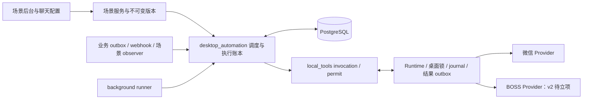

# 桌面 CLI 无人值守自动任务底座

版本 V1.1 · 2026-09-08 · 设计修订，待开发。

关联：[底座实施计划](../../plans/desktop-automation/plan-desktop-cli-automation.md) · [微信首场景与 BOSS 第二场景](../weixin/weixin-marketing-automation-design.md) · [源码就绪度](../../research/weixin-cli/automation-readiness-2026-09-08.md)。本文件是通用能力的权威设计；微信文档不再承载底座协议定义。

## 1. 分层与消费方

| 层 | 规划位置 | 职责 |
|---|---|---|
| 场景 | src/weixin_marketing/ | 固定内容任务、版本、群绑定、内容包、触发配置、微信界面与授权策略 |
| 场景 | src/boss_chat/（待独立立项） | 已打招呼会话、候选人绑定、observer、话术决策、人工接管、招聘通知 |
| 自动任务底座 | src/desktop_automation/（新增） | 事件接纳与时间扫描骨架、occurrence/run/delivery/attempt、额度、审计/outbox；调用场景适配器完成业务校验 |
| 本地操作通道 | src/local_tools/（扩展） | LocalInvocationService、operation/target/permit 契约、write-authorize、设备与 claim 鉴权、回执对账 |
| 本地执行 | clients/agent-tool-runtime/（扩展） | 多 Provider、桌面资源锁、journal、结果 outbox、effect/phase、能力协商 |

依赖方向为场景→底座→本地操作通道；底座不得 import 微信或 BOSS 业务模块。场景通过注册的适配器提供 validate_revision、resolve_target、authorize_operation、compile_operations、aggregate_result；只接受受信代码注册，不允许运行时加载任意脚本。场景决定允许什么，底座负责许可、防重放和记录效果。

微信 executor 为 weixin.fixed_content.v1；BOSS 拟为 boss.chat_reply.v1。第二个消费方用于接口设计校验，不意味着本轮实现。企业微信可在未来接入相同适配接口，本轮不增加其功能范围。

## 2. 架构与独立运行

复用 background_runner 和 APScheduler 唤醒器，PostgreSQL 为权威事实。关闭聊天或浏览器不影响调度；设备离线、休眠、锁屏仍会阻止桌面操作。通用 scheduled-task 的 dry_run 会执行 Agent，不得作为此底座的无发送预检。微信业务内部事件、签名 webhook 和 BOSS observer 是不同事件源，不把网页快照或微信群未读列表宣称可靠实时消息流。

## 3. 中立操作协议

底座只认识 operation、target、effect、phase、permit、resource，不认识群、候选人或话术。场景冻结 payload 并生成受信 target handle；Provider 负责验证对应身份。底座校验 target 版本与授权范围，不解释场景身份字段。

target_ref 为持久绑定引用，target_handle 为本次设备解析的短期句柄，详见底座计划 §2.1。统一操作描述：provider_key、operation、target_ref、target_handle、target_version、payload_ref、payload_hash、request_id、delivery_id、authorization_revision、authorization_epoch、resource_key、deadline_at。租户/属主来自认证上下文或持久任务；操作名只允许已签名 manifest 与服务端白名单的交集。target/payload 引用不可跨租户、设备或版本使用。

| 契约消费方 | operation | 场景输入到中立协议的映射 |
|---|---|---|
| 微信首个消费方 | weixin_message_send_v2 | group binding 经场景核验生成 target_handle；冻结 block 生成 payload_ref/hash |
| BOSS 第二采纳者（仅契约校验） | boss_send_to_v2 | candidate binding 经场景核验生成 target_handle；受限话术渲染结果先持久冻结，再生成 payload_ref/hash |

两者都只能以本地已校验 permit handle 执行受控 operation；不能让 LLM 自填 permit、租户、原始 argv 或任意可执行路径。v2 采用显式 capability/protocol_version，旧 boss_send_to、boss_send_current 与既有 MCP schema、返回字段、BUSY 恢复语义保持原样。

## 4. 效果与恢复不变量

微信 UI / BOSS 页面操作与 DB 不存在原子提交，不承诺 exactly-once。每次业务触发、每个 delivery、每次 attempt 分开记账；已知完成不重复，unknown 不自动重放。发送前授权撤销、版本 epoch、期限和额度统一校验；许可后持久 journal 成功才执行。回执断网只补传结果，不重做 operation。

operation 的 effect/phase 优先于 success/code；只有本次写后证据才可判 applied/verified。异常、取消、进程退出必须保留无法证明未提交的 unknown；人工判定另存，不覆盖机器证据。具体状态、许可时序及恢复表以底座计划为准。

以上新协议仅用于新能力协商通过的 v2 链路。不得在抽取公共代码时把新重试、unknown、quota 或授权规则隐式施加到既有 BOSS 链路；所有底座决策均须通过兼容分支与回归套件。旧 CLI 不支持共享锁时禁止与新任务在同一桌面并发启用，不谎称已获得互斥保障。

## 5. 桌面资源仲裁

resource_key 为受信 device + Windows user + interactive session 的桌面资源标识，不按 Provider 拆锁。同一设备上的微信和 BOSS CLI 排队互斥；多 Runtime 实例共享 OS 锁。云端排队与本地锁配合，DB lease 不能替代 OS 锁。读取会切页或占焦点时也须仲裁。

一个动作链从 open/read 到最后身份复验和 operation 保持同一资源上下文；若等待云端决策释放锁，重新取得后必须复读并比较输入水位与 target version，变化则丢弃旧决策。观察任务低优先级、有界批次，不能饿死已接纳操作；resource 等待超时按未提交处理。用户抢焦点、输入或切换页面时停止在可判定边界，不持续抢回焦点。

旧 BOSS 操作也必须经不改 MCP 契约的 Runtime 仲裁入口才可参与混用；未接入入口的手动 CLI 由启动互斥/运行前检查阻断共用。对未知旧进程不能只靠云端 device 锁保证安全。BUSY 仍按旧链路已有含义返回，新资源排队不伪造旧 BUSY 并触发弹层自愈。

## 6. 发布边界

本次仅文档，不实现底座、CLI、BOSS 授权条款或真实任务。微信 P0、完整图片 MVP、unknown 与真机验收门禁不变。底座先服务微信，同时用 BOSS 契约样例验证通用性；BOSS observer 和自动回复待独立立项，不阻塞微信交付。
