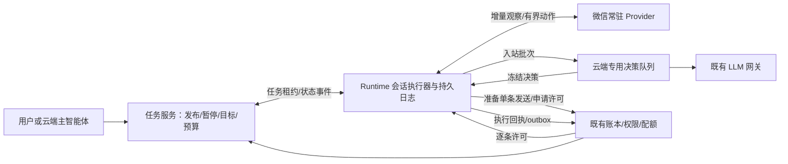

# 端侧会话任务执行设计

版本：V1.1 · 2026-09-12 · 状态：设计交付，待开发智能体按计划实现和独立验证。启动决策和冻结契约补充见 §13，与前文冲突处以 §13 为准。

关联：[开发计划 C0–C5](../../plans/desktop-automation/plan-edge-session-task.md)、[中立执行底座](desktop-cli-automation-design.md)、[微信固定内容及 BOSS 场景](../weixin/weixin-marketing-automation-design.md)、[微信 P0–P5](../../plans/weixin/plan-weixin-marketing-automation.md)。登记入口：[ideas.md](../../ideas.md)。

## 1. 决策、范围和文档优先级

本方案是 P5 之后的新能力，不重做或重新编号 P1–P5。实现“云端下达长期会话目标，客户端在多个会话间观察、等待、恢复、执行，云端汇总结果和计费”。产品可称“微信子智能体”；技术实现为 Runtime 常驻任务执行器、Provider 观察器和云端专用决策服务，不为每个等待中的会话启动完整 Agent 循环。

本文的 MUST/必须为验收要求。正文中的 API、表、能力名是**待实现契约**，不表示仓库已有；实施中如需改契约，先同步本文和计划，不允许代码私自演化。P1–P5 的许可、effect/phase、journal/outbox、未知结果不重派和租户隔离规则继续有效；本文仅对**新会话场景**的循环位置、任务协议和完成语义作扩展。原固定内容营销保持原执行路径。

| 决策 | V1 唯一选择 |
|---|---|
| 首个业务场景 | `weixin.conversation.v1`，Windows、已验证账号、已显式绑定的单聊/群聊；每任务只对应一个会话 |
| 模型位置 | 经现有服务端 LLM 网关调用；端侧不直连模型供应商、不保存供应商密钥 |
| 执行循环 | Runtime 持久状态机调度；本地工具直接调用常驻 Provider；主智能体不逐轮驱动读/发/睡眠 |
| 授权 | 用户发布任务即授予范围内持续执行权；每次真实发送仍申请单条机器许可，不逐条问用户 |
| 离线 | 可恢复本地状态、保存观察、排队同步；不得请求新模型决策或新增发送 |
| 回复内容 | 支持受任务约束的自由文本；V1 仅文字，不发图片/文件/链接卡片，不执行任意工具 |
| 主动消息 | 仅允许任务发布单中明确冻结的一条开场白；默认等待新入站消息，不主动追问未回复者 |
| 完成模式 | 轮数、对方明确确认、证据支持的模型判断，定义见 §5；轮数/费用/时间硬上限始终存在 |
| 设备变更 | 不自动故障转移；必须先完成旧设备停止/未知效果处置，再显式重新分配 |
| BOSS | 复用端侧循环协议；不在本轮实现 BOSS 业务决策或扩大其既有话术/承诺范围 |

V1 不做：离线自主发送、会话级批量写许可、本地大模型、跨设备自动接力、自动找新联系人、任意应用操作、跨多个会话达成一个目标、多智能体自由讨论、自动跟进骚扰、微信官方消息 ID 的假设。

用户本次授权为设计与计划交付，不等于已经授权真机给任何联系人发消息；开发后的实测使用明确授权测试账号/会话。

## 2. 已核对事实与性能边界

事实：现有 `clients/agent-tool-runtime/` 有设备配对、多 Provider、单动作 journal 和结果 outbox；`src/desktop_automation/`/`src/local_tools/` 已有服务端执行账本及逐条许可。它们还不是长期会话任务执行器。

事实：`clients/weixin-cli/src/operations/unreadList.ts` 通过 PrintWindow 与本地 OCR 读取截图中的会话列表；`drivers/ps1/unread-list.ps1` 每次启动 Python，`drivers/py/unread_list.py` 每次构造 RapidOCR，先 OCR 截图再过滤区域。结果无可靠的全量覆盖证明、稳定消息 ID 和持久消息水位。不能把这一接口直接当消息总线。

此前开发助手逐步调用工具、人工等待的耗时，不等同于产品自动执行链路耗时。用户转述的“2–4 分钟/轮”“5–10 秒检测”“1–3 秒推理”“短句 100%”作为待测假设，不能写成验收事实。C0 先测：观察发现、冷/热 OCR、模型、授权往返、桌面排队、发送及验证、客户实际等待。客户等待不计入系统响应性能。

## 3. 分层及职责



云端主智能体负责准备、解释、发布、调整、暂停任务以及回答结果；任务发布后不保持主 Agent 对话轮次或 HTTP 请求来等待客户。云端专用决策 worker 调用模型，不递归调用主 Agent，不让模型选择工具序列或目标。

规划模块：

| 位置 | 所有权 |
|---|---|
| `src/session_tasks/` | 通用任务协议、设备租约、事件接纳、决策队列、状态投影与预算；无微信 UI 细节 |
| `src/weixin_conversation/` | 会话绑定、任务策略校验、模型提示/输出校验、完成规则、`weixin.conversation.v1` 适配器 |
| `clients/agent-tool-runtime/src/sessionTasks/` | 持久任务状态、同步、就绪队列、定时器、单实例保护、调用已有 v2 执行链 |
| `clients/weixin-cli/` | 常驻 OCR/观察、身份验证、增量消息证据、发送与写后证据；无云端账务 |
| `frontend/web/components/sessionTasks/` | 任务工作台；微信入口按当前路由/权限规范接入 |

通用层通过受信注册表调用场景接口，不反向 import 微信实现。既有 Runtime pollLoop 与新会话任务循环共享 Provider 管理器和资源锁，不各自启动一套互相抢焦点的 Provider。

## 4. 标识、权威状态与设备租约

实体 ID 使用 UUID；batch_id 是文本协议键（普通批次使用 UUID 字符串，开场白保留值见 §13.2）。消息原生 ID 若将来获得，另存，不替代本地分配的 message_id。租户/用户/设备身份取认证上下文，客户端、模型及用户正文自报身份一律不采信。

任务固定字段：`task_id, tenant_id, user_id, scenario_key, device_id, account_binding_id, conversation_binding_id, spec_revision, control_epoch, status, created_at, updated_at`。发布版本不可变，含 goal、reply_policy、completion_rule、limits、工作时段和可选 opening_text；修改需暂停→保存新版本→重新发布。暂停先撤新授权，不等待已发送动作撤回。

云端是发布策略、control_epoch、任务终态、计费的权威；端侧是本地观察水位、待同步事件和执行证据的生产者。端侧上报 `done` 只是完成提议，不能直接覆盖云端状态。

任务租约：`assignment_id, task_id, device_id, runtime_instance_id, fence, lease_expires_at`。lease=60 秒、renew=20 秒（配置项，C0 可通过文档修订调整）；续租/重新分配在服务端事务中锁定同一 task subject。每次重新分配递增 fence，设备 token 不替代 fence。决策请求、发送准备、目标领取、新许可必须检查当前 assignment/fence、control_epoch 和租约未过期；设备本地用单调计时保守判断失效。过期停止新副作用，在途回执不因旧 fence 被丢弃。

同一 `(tenant_id, device_id, account_binding_id, conversation_binding_id)` 同时最多一个未终结会话任务（含暂停、转人工、blocked）；新任务返回 409 `CONVERSATION_IN_USE`。关闭旧任务或显式移交才释放占用。不同 Windows 会话/Runtime 实例对同一账户的迁移需要停止确认，不根据心跳消失认定旧设备已停。

状态：

| 云端状态 | 含义及退出 |
|---|---|
| draft | 未授权；发布校验成功→active |
| active | 可被分配、观察和执行；暂停→paused，人工介入→human_required，观察/执行不确定→blocked |
| paused | 禁新授权；显式 resume 复核身份/水位/无未决写动作→active |
| human_required | 已停止自动回复并创建站内接管事项；员工显式恢复或关闭 |
| blocked | 断点不完整、身份/消息覆盖缺口、unknown 等；修复和确认后才可恢复 |
| completed | 通过 §5 完成判定；终态，不可恢复 |
| stopped | 预算/期限/取消终止，结果必须带原因；不表示目标达成 |

端侧 phase 与云端 status 分开：`ready, observing, decision_pending, send_ready, executing, waiting_peer, waiting_schedule, sync_pending, blocked`。`waiting_peer` 是让出资源后的持久状态，不是睡眠占用一条 Agent 执行线程。断网是连接状态，不伪装为任务完成。

## 5. 任务目标、授权单和完成语义

任务发布请求必须包含：

```json
{
  "goal": "确认对方是否愿意在周五下午沟通，并取得明确时间",
  "completion_rule": {
    "mode": "judged",
    "criteria": ["对方明确同意沟通", "对方明确确认具体时间"]
  },
  "reply_policy": {
    "style": "简洁礼貌",
    "allowed_facts": ["可选时段为周五14:00或16:00"],
    "forbidden_commitments": ["价格承诺", "未经授权的个人信息披露"]
  },
  "limits": {
    "max_replies": 10,
    "max_decisions": 20,
    "max_cost_units": 100,
    "expires_at": "2026-09-18T09:00:00Z",
    "peer_wait_timeout_seconds": 86400
  },
  "opening_text": null
}
```

示例 cost_units 是既有计费系统的预算单位，**不是新增价格或人民币金额**。实际字段值由用户确认的预算及既有计费配置决定；不可默认无限费用。所有任务必须有有限 max_replies、max_decisions、max_cost_units、expires_at。建议创建表单初值 max_replies=10、max_decisions=20、期限=24h，费用预算必须展示并由用户确认；最终有效值冻结于发布版本。

一轮定义：一个新的、完整的对方消息批次对应一个 `applied+verified` 的自动回复。对方连发三条合并为一个批次，不算三轮；开场白占 max_replies 和费用预算，但不计“已聊 N 轮”。轮数模式额外必须有 `rounds_target`，并满足 rounds_target≤max_replies。达到 target 才以 `rounds_reached` completed，不声称业务目标达成。

完成模式：

| mode | 裁决 |
|---|---|
| rounds | 服务端计数达到 rounds_target；无未决发送时 completed |
| peer_confirmed | 模型提取对方确认及入站 message_id；服务端校验消息归属、sender、版本、引用存在并执行发布时冻结的字段/枚举规则；成功 completed，reason=peer_confirmed |
| judged | 主决策提出 done + criteria 对应 message_id/理由；独立一次受限完成审核调用核对原消息、全部 criteria、矛盾与未回答问题。审核同意且硬校验通过→completed，reason=goal_judged；否则转 human_required，禁止无限反复审核 |

`goal_judged` 在 UI 显示“AI 根据对话判断已达成”，展示引用证据，不能包装成客户实际履约保证。完成审核也消耗 max_decisions 与费用预算；预算不足时 stopped，不能绕预算执行审核。首次建立基线不拿历史对话宣布完成。

max_replies 用完但目标未达、max_decisions/费用耗尽、expires_at 到期、等待客户超时均 stopped（独立 reason），不得 completed。存在 `may_have_started/unknown` 或未终结 reply delivery 时不得宣布 completed；先 blocked 并核对。V1 等待超时不自动发催促，用户可以创建新授权版本明确开场/跟进。

暂停/取消/接管是确定性控制动作，不经模型同意。用户手动在目标会话发消息时，立即转 human_required，取消旧决策与未开始发送；发送已提交则照实收回执。恢复不自动回复人工接管期间历史积压，员工明确选择恢复基线及待处理消息范围。

## 6. 本地观察、消息水位和输入批次

Provider 新增 `session_observer_v1` 能力；其接口不得只返回 unread 列表。统一结果最小字段：`observation_id, account_identity_version, conversation_binding_id, binding_version, observed_at, coverage, ordered_messages[], window_fingerprint, gap_reason`。消息包含 `sender=peer|self|system|unknown, text, local_message_id, source_evidence_ref`。`coverage=complete_window|gap|unavailable` 仅指与上次水位连续对齐的窗口，不表示全账号全历史完整。

Provider 必须常驻 OCR 引擎，消除每次启动 Python/加载模型；直接识别已验证的会话列表/消息区域。模型初始化失败进入 unavailable，不返回空列表冒充无人回复。截图和文本受控保存，普通日志不含正文、群名或截图。

未读角标、窗口标题数字和画面变化只作候选唤醒信号；不能据此推进消息水位、判定身份或将名称子串匹配用于发送。主窗口可见列表之外、当前已打开会话、手动已读和多条突发都必须有有界复查。活跃等待会话按公平队列复查；未覆盖项显示 last_observed_at/coverage_gap，超过配置的 observation_max_age_seconds=60 后不得自动回复该项，直至连续窗口重新验证。任务多到无法覆盖时拒绝新增激活或排队 admission，不静默漏观察。

默认调度参数（工程初值，不是真机能力承诺）：活跃候选轮询 2 秒；无变化按 2/5/10/30 秒退避；每次最多 1 个目标深读；观察调用超时 15 秒；会话复查频率受桌面资源锁和公平调度约束。C0 必须测量这些设置的实际覆盖能力，C5 不达标则限制 max_active_tasks，默认上限 5。

消息去重按“绑定版本＋发送方＋原始消息序列/相邻窗口＋重复项序号”做连续对齐后分配 ID。禁止仅正文 hash、OCR 行号、未读数或时间戳去重。长句被 OCR 拆行先重建同一气泡；sender 不明、连续重复无法对齐、滚动断层→gap，阻断该会话自动回复，不猜测。

入站消息持久化、cursor 前移、产生待同步事件必须在**同一个本地事务记录**内完成（§8）。新启用只建基线，不回复旧消息；重启先回放日志再验证窗口连续性。

对方消息合批：最后新消息后静默 2 秒形成 batch，最长聚合 10 秒；工作时段外只排队，不请求决策/发送。每 batch 冻结 `batch_id, ordered_message_ids, input_version, observation_id`；之后的新消息生成新 input_version，不往已提交 batch 原地追加。一个 batch 最多一个有效 reply decision；有新消息时旧决策标 superseded，新批次包含尚未回答的连续消息。系统不会自动补发被 superseded 的回复。

## 7. 协作式调度和动作顺序

单 Runtime 实例内执行器一个；按 runtime home/Windows 用户会话使用 OS 级单实例保护，同机器第二实例不能重放同一本地任务日志。

就绪队列按 `next_due_at`→优先级→上次服务时间 FIFO；控制/停止信号优先于新发送，发送高于常规观察；连续服务同任务最多 1 个动作单元即让出，避免饥饿。各 task 最多一个观察/决策流程在飞；云端决策并发默认每租户 2（跨 worker/进程合计），不等于桌面写并发；详细约束见 §13.5。

动作链必须为：

1. 检查任务/租约/工作时段→取得需要的桌面资源锁→定位已绑定目标并观察→持久化观察和批次→释放锁。
2. 同步批次、异步请求专用云端决策，phase=decision_pending；本任务让出，执行其他任务。模型处理不得占桌面锁。
3. reply 结果回来→锁外准备单条发送账本/素材（文字）→进入 send_ready。
4. 取得既有桌面资源锁→重新验证账号/目标、最新窗口、人工回复和 input_version。任何改变先取消未开始的 invocation，旧 decision superseded；不得为了省时间跳过复查。
5. **仍持锁时**调用现有 write-authorize（短超时），通过后按现有 v2 链写 may_have_started journal/fsync→输入/提交→写后验证→持久化结果 outbox→释放锁。不能在等桌面锁前申请许可，也不能持锁等待用户/模型或全量历史扫描。
6. 服务端接纳发送结果，客户端 phase=waiting_peer；轮数与业务进度由真实结果推进，不由“已请求发送”推进。

授权请求超时/失败：释放锁，不发送；下次必须复查目标/窗口并走既有许可重试规则。准备过但未开始的旧 invocation 必须终结后才能为同 batch 形成替代发送；已开始/unknown 不创建替代发送。

Provider 只读也不天然可并行。C0 未证明截图不与前台操作干扰前，共用既有资源锁；后续仅对实测不改焦点/滚动/剪贴板的观察放开只读并发。任何跨微信/BOSS 的写操作继续使用现有共享桌面锁。

## 8. 本地持久化、同步和恢复

V1 不引入新 SQLite/native 包依赖；使用 Runtime 现有 fsync 文件能力实现**单写入者、追加型会话事件日志**。新增 `session-tasks/<assignment_id>/events.jsonl`，与现有单动作 `journal/` 和结果 outbox 分离。

每条记录：`schema_version=1, assignment_id, fence, local_seq, event_id, type, encrypted_payload`。一个记录封装全部相互依赖更新（例如 observation/messages/cursor/sync_event），序号从 1 连续；完整 JSON 行写入且 fsync 成功后，才推进内存状态、ACK 或执行下一步。敏感 payload 复用 Runtime 已有 DPAPI CurrentUser 加密实现（`src/credentials.ts` 所依赖组件），不自行设计加密算法；不得写 device/permit/claim token。解密失败→blocked，禁止空状态启动。

内存状态由日志确定性回放重建；V1 不实现日志压缩或快照替换。仅最后一条未完整落盘的尾记录可作为未提交记录丢弃，恢复前留诊断；中间损坏、序号缺口、身份不符一律 blocked，不跳过继续执行。既有 may_have_started journal 不删改、不当普通尾记录处理。

事件日志同时是本地同步 outbox：云端仅 ACK 已事务提交的连续 local_seq 前缀，重复 event_id 返回原结果，同 ID 异 payload 拒绝。客户端保留未 ACK 记录并按退避重投；不因云端已见终态删除未接纳执行回执。每 assignment 有单调 server_control_seq，旧控制消息不能恢复新暂停状态。

恢复顺序：设备身份与单实例校验→回放本地事件日志→回放既有写 journal/outbox→同步未 ACK 事实→续租/获取最新 task/control_epoch→观察窗口对齐→重新进入 ready。存在 may_have_started 无确定回执时 blocked，继续上报和核对，禁止重新输入/重发。尚未开始的过时决策作废，重新观察后才能决策。

本地存储上限默认每 Runtime 256 MiB（含本模块日志/受控观察资源，不含既有全局 journal），80% 告警、100% 停新观察持久化/新发送并告警，不删除未 ACK 数据。终态且全部 ACK、无未决 journal 的本模块记录保留 7 天后可删；运行中和 unknown 不按年龄清掉。删除流程沿项目文件路径安全规则、限定 Runtime home 内解析后的真实路径。恢复/清理测试必须覆盖崩溃边界。

## 9. 云端 API 与接纳契约

用户 API 根 `/api/session-tasks`；设备 API 根 `/api/local-tools/runtime/session-tasks`。统一沿用项目 envelope/错误码、设备 token、租户 ACL 和幂等实现，下面参数名称为 V1 冻结契约。新写接口必须要求 Idempotency-Key；同 key 同请求返回原资源，同 key 异请求 409。不要用模型生成的随机调用 ID 代替业务幂等键。

| 接口 | 输入/输出及约束 |
|---|---|
| POST 用户根 | 创建 draft；业务场景/设备/绑定/goal/policy/completion/limits；不发送 |
| GET 用户根及 `/{task_id}` | 属主过滤、分页、状态/等待原因/账务/执行证据；列表不带正文 |
| PATCH `/{task_id}/draft` | expected_version CAS，保存草稿；active 不可原地改策略 |
| POST `/{task_id}/publish` | expected_version，校验绑定/P0 能力/预算/唯一会话占用；创建 subject 和不可变 spec |
| POST `/{task_id}/pause`、`resume`、`stop`、`handoff` | expected_version CAS；递增 control_epoch；复用取消/许可撤销语义。stop 终态，handoff 站内接管 |
| POST 设备根 `/claim` | runtime_instance_id、受信 capability；事务分配 ready task，返回 spec/assignment/fence/lease/control_seq；无任务204 |
| POST `/{assignment_id}/renew` | fence、control_epoch、last_control_seq；续租并返回最新控制；过时409 `STALE_ASSIGNMENT`，暂停不可续成可执行 |
| POST `/{assignment_id}/events` | fence、连续 records[local_seq,event_id,type,payload]，每批≤100条且≤256KiB；接纳事实与水位/决策唤醒同事务；返回 ack_seq 和控制消息 |
| POST `/{assignment_id}/decisions` | task/spec/epoch/fence、已接纳 batch_id、input_version；202 decision_id；不等待模型完成 |
| GET `/{assignment_id}/decisions/{decision_id}` | pending/running/ready/superseded/failed；默认1秒查询、错误指数退避至30秒；轮询不是 LLM 调用 |
| POST `/{assignment_id}/decisions/{decision_id}/prepare-send` | 只接受 ready reply；幂等物化单条底座执行单元并返回 invocation_id，禁止修改冻结正文 |
| POST `/{assignment_id}/invocations/{invocation_id}/claim` | 定向领取该 assignment/decision 的 queued invocation；复用 claim token/租约和 v2 校验；不领取任意 invocation |

设备仅上报新消息 batch 和事实，不把完整历史每轮反复上传。云端模型上下文由任务 spec、已接纳增量、受控摘要和未答消息构造；摘要不能删除未回答问题或改写身份/预算。模型看到的对方消息明确标为不可信数据，不得覆盖任务规则或授权。

服务端 worker 用 DB claim/租约处理 decision 队列，后台调度注册受本功能 enabled 门控；使用现有 LLM 网关、调用计费和并发约束。决策唯一键 `(tenant_id, task_id, spec_revision, batch_id, decision_kind)`；decision_kind 为 opening、reply 或 completion_review，opening 的附加约束见 §13.2。模型调用超时不重建新 decision；恢复时同 ID 重试最多一次（仍计实际模型费用），无可验证结果转 human_required。超时重试允许供应商重复算费，不允许生成多个发送单元。

模型结构化输出：`action=reply|wait|handoff|done, reply_text?, evidence_message_ids[], criterion_results[], reason_code`。reply_text 非空且符合当前微信文字上限；V1 不输出任意工具、URL 下载、目标/账号/预算字段。校验失败一次修复调用也计决策和费用上限；之后 human_required。wait 必须有 `wait_for=peer|work_window`，不得由模型要求任意长 sleep 阻塞线程。done 经 §5 二次裁决，handoff 不向客户自动发技术提示。

网络重试不重新产生 batch/decision。新增消息/人工介入/策略变化使旧 input_version 不可发送；同一事务校验当前 input_version 后物化 delivery。准备后变化则 revoke 未开始发送，端侧锁内再复核仍为最后一道防线。

## 10. 复用单条执行底座，禁止第二套发送账本

会话任务是长期聚合对象，不用一个 running run 跨越数天等待。每次 reply/opening 单独创建一组 occurrence/run/delivery/attempt/invocation；**不新增另一套会话 deliveries**。

`task_ref=task_id`，`revision_ref=spec_revision_id`，新场景适配器为 `weixin.conversation.v1`；reply 正文冻结在 decision。payload_ref=`session-reply:<decision_id>`，payload_hash 按冻结最终字节计算。场景 serve_payload 严格核对 decision/task/spec/租户，不能借任意 decision_id 读其他会话。业务 dedupe key=`session:<task_id>:<decision_id>`；底座 trigger_kind 使用现有 manual（程序触发，不表示用户逐条点击），trigger_key 使用该稳定 key。一个 decision 仅一组执行单元，事务写入并建立唯一映射。

Runtime 本地循环发起 prepare-send 仍由**服务端**构建可信 invocation、授权字段及预算，端侧不得自签。为避免既有 pollLoop 抢走循环中的动作，给 `local_tool_invocations` 增 `execution_lane`（NOT NULL DEFAULT 'standard'），仅服务端设置 `session_task`。通用 claim 的 SQL 必须过滤 standard；定向 claim 只接 session_task 且绑定当前 assignment。老客户端无新 capability 不可领此 lane；所有底座业务依赖（取消、结果、清扫、账务）不能按 lane 漏处理。不要只在客户端收到之后才过滤，也不要只用内存映射标记。

`business_ref` 增 task_id/spec_revision/assignment_id/fence/decision_id/batch_id/input_version/execution_lane；均由服务端生成。新场景 capability 必须显式协商 `session_task_v1`、`session_observer_v1` 及现有 v2 写/共享锁/证据能力；缺任一不发布/不分配，不降级到 v1 send。

授权增加检查：实时 enabled/allowlist、task active、当前 spec/control_epoch、唯一有效 fence/设备租约、decision ready 未 superseded、batch/input_version 仍当前、目标/账号版本、任务与底座配额。暂停/迁移/预算修改必须与授权在**同一 task subject 锁**上串行化。通用 permits 仍按既有 subject→run→invocation→delivery→quota 锁序；适配器在持 subject 锁时只读取场景控制行，不另起反向行锁。任务控制写统一 subject→session_task 行；prepare-send 在此后创建新账本行，不先锁已有 invocation 再锁 subject。

预算分两类：模型决策/完成审核成本与实际执行/视觉成本。服务端先原子预留，再实际结算；任务 max_cost_units 覆盖两者，不能分别限额后超总额。每 decision/invocation 使用既有账务唯一键，重复 outbox 不重复扣费；供应商实际发生的不同尝试可各计一次模型费用。客户端上报轮数/费用只作展示缓存，服务端从账本计算。

max_replies 同时计算已确认发送与未决预留；unknown 保留占用，不释放后允许无限新发。未开始且安全取消可按底座已有规则释放。对任何已领取许可，保持现有短 TTL 与写前时序；断网/暂停不保证撤回已在提交中的动作，UI 必须显示“停止新发送，已有动作结果待确认”。

## 11. 服务端数据与前端交付

新增系统表族（通用编排，不存业务专用话术）：

| 表 | 最少字段/唯一约束 |
|---|---|
| session_tasks | §4 字段、version、当前 spec 指针、completion_reason；租户+ID 唯一；占用会话唯一规则见 §4 |
| session_task_specs | task_id、revision、goal/policy/completion/limits、published_at；租户+task+revision 唯一 |
| session_task_assignments | §4 租约字段、acked_local_seq、server_control_seq；每 task 一条当前 assignment，历史保留 |
| session_task_events | assignment_id、local_seq、event_id、payload_digest、受控 payload_ref、received_at；租户+assignment+seq 与租户+event_id 唯一 |
| session_task_messages | task/binding/input_version、message_id、sender、受控 text_ref、evidence_ref；租户+task+message_id 唯一 |
| session_task_batches | task_id、batch_id、消息集合/input_version、状态；租户+task+batch_id 唯一 |
| session_task_decisions | §9 唯一键、状态、模型调用关联、冻结正文引用/hash、输入版本、completion_evidence、lease；租户+decision_id 唯一 |
| session_task_execution_links | decision_id、occurrence/run/delivery/invocation；租户+decision_id 唯一，所有映射同租户约束 |

新增业务表 `bs_weixin_conversation_bindings`：属主、device/account、conversation_type、identity_version、受控身份证据、verified_at/expiry、状态；优先复用既有账号身份验证代码，但不能把群绑定直接当单聊身份。所有关系同租户复合约束，设备与绑定属主校验，查询带租户/属主过滤。完整 DDL、索引、FK及 enum 在 C1 落地；双轨初始化/增量迁移、数据库表和文件用途登记必须同步，不复用 web `chat_messages` 装观察消息。

正文/截图/goal/decision 按项目既有加密与 ACL 方案受控存储；本方案不指定自定义加密。运行中或未知效果的数据不可按年龄清理；终态数据默认保留30天，引用解除、同步全部确认后才可清理。本地/云端清理与新增引用都须有事务/锁测试（复用 P4/P5 已发现的防并发误删经验）。

页面：任务列表显示目标摘要、active/等待/接管/blocked、设备在线、最后观察、轮数/预算/期限；详情时间线显示消息批次、决策摘要/证据、逐条发送状态与费用。提供草稿→校验→发布确认、暂停、恢复、停止、接管。发布确认展示目标/会话/开场白/完成标准/上限，不能仅显示“启动 AI”。纯等待默认不通知；完成、失败、需人工、预算耗尽站内通知一次，按事件唯一键去重。外发通知仅在具体渠道获得授权后开启。

云端工具新增 prepare/publish/manage 三个专用任务工具（能力名在 C1 实现为 `session_task_prepare/session_task_publish/session_task_manage`），主智能体用它们创建/控制/查询任务。prepare 不执行，publish 需要已确认授权单；manage 无任意本地命令入口。工具确认策略区分用户发布范围与逐条机器许可，不让助手再次替代调度器 sleep 轮询。

## 12. 验收、发布与 BOSS 衔接

关键验收：10个连续相同正文不误去重、长句拆行/发送方、当前会话无未读、视口外会话、人工已读、消息突发、身份改变、重启窗口断层；观察/同步/决策/准备/许可/journal/结果各边界崩溃；暂停与授权竞争；两实例抢同会话；超预算；断网；过时 decision；终态误判；微信/BOSS 桌面争用；旧 standard lane 完整回归。

性能必须分解为 `peer_message_visible→detected→batch_ready→decision_ready→lock_acquired→authorized→submitted→verified`，报告 p50/p95/max、失败/unknown/coverage_gap 和模型/OCR调用数。等待客户时间独立列出；禁止只报最快成功样本。工程通过标准：主智能体发布后退出仍能完成任务；无 LLM 轮询；等待期不占桌面锁/模型请求；热路径不逐次加载 OCR；人工等待外的编排开销相对 C0 同条件基线降低至少30%，且正确性指标不退化。不达标先定位瓶颈，不改批量许可绕过安全检查。

真机发布按 C0/P0 能力证据逐目标类型开放，单聊通过不代表群聊通过。未验证的目标类型保持 disabled；全新能力默认关闭；先 fake→授权测试会话→单设备少量任务→测覆盖再扩容。暂停新会话能力不能停旧固定内容账务/迟到回执。回滚保持场景+租户限定，不误取消其他场景。

BOSS 原设计 §11 的观察水位、受限话术、敏感承诺、人工接管与 P0′ 门禁保留；其“观察/等待/就绪调度”未来复用本 Runtime 执行器。旧 BOSS MCP、计费、BUSY/UI_CHANGED 恢复和工作区已有探索不自动合并到本任务。若 BOSS 之后接入，单独更新场景适配器/计划，不把微信自由文本权限套用到招聘对话。

交付终态：C1–C4 fake 验证完成只表示代码可验证；C5 真机/性能通过才表示指定范围可灰度。任何跳过/环境阻塞均单列，不能标“全场景完成”。

## 13. 开发澄清与冻结契约（2026-09-12）

### 13.1 启动与并行边界（A1–A3）

当前选择 **C0 fake 契约基线→C1–C4 fake 开发**。当前 Windows 开发机不自动视为已授权测试设备；微信版本、测试账号、对端配合人和会话清单均未确认。记录 C0 真机 BLOCKED，所有真实观察/发送测试 capability 关闭，不能把 fake 完成写成 C0 真机通过。这是信息不足时的执行决定，不是声称设备不可用。

此前“哈尼”群试发授权不自动延伸到本 conversation 场景，也不覆盖 BOSS 候选人。真机阶段前需要用户明确设备、账号、微信版本、单聊/群聊绑定清单、对端配合方式、测试时段、消息内容范围和最大发送数；清单外不读写。≥30 样本可以先由 fake 对端确定性重放，真机样本另记，不能替代。开发智能体无需等待上述信息才能开始 fake 工作。

BOSS 改动与本任务可以在工作区并存，无需等待 BOSS 提交；不得改写、暂存或清理其文件。`docs/ideas.md` 仅局部更新第78项，修改前重读文件，保留第76项及其他变更；不得整文件覆盖。若另一个智能体正在写同一文件，协调该文件写入时段，其他独立工作继续。提交仍须用户明确授权，届时按任务逐块暂存。

### 13.2 completion_rule 与开场白（B4–B5）

`completion_rule` 为以下三个互斥对象之一，拒绝未知字段；不接受跨模式混用：

```json
{"mode":"rounds","rounds_target":10}
```

rounds_target 为正整数；发布校验 `rounds_target + (opening_text != null ? 1 : 0) <= max_replies`。仅服务端验证成功的回复计轮，不调用完成审核。

```json
{
  "mode":"peer_confirmed",
  "fields":[
    {"key":"willing","question":"是否愿意沟通","allowed_values":["yes","no"],"accepted_values":["yes"]},
    {"key":"slot","question":"确认的时间","allowed_values":["friday_1400","friday_1600","undecided"],"accepted_values":["friday_1400","friday_1600"]}
  ],
  "require_all":true
}
```

fields 长度1–10；key 为唯一 ASCII 标识符（`[a-z][a-z0-9_]{0,63}`）；question 为1–500字符；allowed_values 为1–20个不重复、1–100字符的字符串，accepted_values 为其非空子集；require_all 在 V1 只能为 true。不支持任意表达式、正则、脚本或自由类型字段。

提取放在 `decision_kind=reply` 的结构化结果中，增加 `peer_confirmation={values:[{key,value,message_ids,quotes}],contradicted:boolean}`；每个 quote 对应同位置 message_id 的原文连续片段，message_ids 非空。reply 是决策流程名称，其 action 可为 reply/wait/handoff/done，不表示必发送。只从当前连续输入版本中、发布基线之后的 peer 消息提取；不得从 self、system、摘要或模型自述提取。服务端校验键/枚举、原文片段、消息归属/版本/发送方、全部字段及 contradicted=false 后才接受 done；缺字段继续等待/回复，矛盾或含糊需 handoff。该模式不额外调用 completion_review；UI 明示“AI 提取的对方确认”并展示证据。原文引用校验不等于机器能证明自然语言语义，误判样本必须进入验收。

```json
{"mode":"judged","criteria":["对方明确同意沟通","对方明确确认具体时间"]}
```

criteria 为1–10条不重复、每条1–500字符的非空字符串；reply 的 done 提议为每条 criterion 提供 message_ids/quotes/reason，随后走 §5 独立 completion_review。三个模式均受未决发送、最新输入版本和硬预算门禁约束。

开场白固定 `decision_kind=opening, batch_id="opening"`；普通批次只允许 UUID 字符串，禁止使用该保留值。C1 在 `session_task_batches` 建该任务唯一的合成批次（消息集合为空、标 synthetic=true、input_version=0），只允许 opening 引用；非合成批次不得为空。`session_task_decisions` 除 §9 唯一键外增加部分唯一索引 `(tenant_id, task_id) WHERE decision_kind='opening'`，不含 spec_revision：同 task 跨暂停、恢复、重新发布最多一条 opening 决策。禁止通过删除旧决策重建开场白。

opening 不调用模型，不占 max_decisions，照常预留发送次数/费用并走唯一 execution_links。其正文从首次生成该决策的冻结 spec 取值。未开始而取消也不自动重新产生；需要再次主动开场须关闭旧任务并创建新授权任务。开场前必须先建立目标基线；若已有发布后新入站、人工回复或身份变化，取消 opening，不绕过输入版本检查。prepare-send 接受 ready opening 或 ready reply；opening 使用当前已验证基线作发送前复验，合成 input_version=0 不代表免复验。

### 13.3 受控存储和未验证绑定（B6–B7）

服务端加密明确复用 `src/channels/wecom_personal_rpa/secret_crypto.py` 的 `encrypt_secret/decrypt_secret`（后者返回 bytes，UTF-8 解码）；`src/weixin_marketing/event_sources.py` 已有跨模块调用先例。不得把营销素材引用本身当加密。沿既有主密钥配置，不新增算法/派生方案；缺密钥拒绝本功能发布，解密失败 blocked，不降级明文。模块关闭不能导致整个应用启动失败。

C1 新建 `session_task_texts`：`text_id, tenant_id, task_id, purpose, encrypted_payload, created_at`，复合唯一 `(tenant_id, task_id, text_id)`；purpose 枚举 spec/message/decision/event/summary。payload 为加密 JSON 字符串，存 goal、policy、completion 中自然语言、opening、消息正文、回复及理由。spec/messages/decisions/events 的对应字段存同租户同任务 FK 引用；公开计数/状态/limits 可明文，列表摘要由授权服务端解密后生成，不另存明文副本。text_ref 为 text_id，不是公开 URL 或文件路径。读前统一查 task 租户及属主，后台 worker 仅能读取其已领取任务；设备仅取当前有效 assignment 所需内容。日志/错误不得包含解密值；底座 payload 使用已有鉴权 serve_payload，不复制到普通日志或公开素材库。

V1 不上传原始截图到云端：截图按 §8 在端侧 DPAPI 受控资源保存，云端 evidence_ref 保存不透明证据 ID、摘要和采集元数据；云端详情展示文字引用/证据可用状态，不生成公开截图链接。截图上传/远程查看不属于本期。终态30天清理适用于新增云端文本及引用，运行中/unknown 不清理。

绑定表从 C1 就落完整骨架：UUID id、tenant/user/device/account、conversation_type=direct|group、identity_version（整数，初值0）、verification_status=pending|verified|invalid|expired、encrypted_identity_evidence（沿上述加密实现）、verifier_version、verified_at、expires_at。pending 的后三个验证字段及证据允许 NULL；不得用群名、假时间戳或 fake 证据填成 verified。只有服务端接纳受信 Provider 的真机验证证据后才能写 verified、递增 identity_version 并设置有效期。C0 可以细化证据 JSON schema/version，需新列时增量迁移，不能在 C1 猜测单聊身份算法。

fake 绑定仅存在独立测试库和 fake Provider，测试服务器不得连接真机 Runtime；生产发布/分配要求 verified、版本有效、设备能力通过。当前可建 pending 草稿，不能通过放开生产验证来跑 fake。

### 13.4 积分与余额不足（C8）

`cost_units=积分（credit）`，不是人民币。任务已花费取该任务所有模型尝试、完成审核、视觉和执行的**已结算积分之和**；可用任务额度为 max_cost_units 减已结算减未决预留，不只看已结算。沿 `tenants.credit_balance` 及既有账务精度，LLM 复用 `src/services/session_record.py` 的后台用量计费路径，执行复用 `client_usage_logs`；同一费用源不得在两个入口各扣一次。新增任务费用关联键/预留和幂等结算须在 C1/C3 实现，既有函数并不自动保证这些约束。

worker 调 LLM 前复用 `src/local_tools/proxy_tool.py` 的租户余额预检语义，余额≤0或不足以覆盖本次保守预留→`blocked/INSUFFICIENT_TENANT_CREDIT`，禁止模型调用和新发送，充值后仍需显式 resume 重新校验。仅余额大于0不构成充分许可；跨任务预留须在租户预算锁下原子检查，模型输入及 max_output_tokens 必须有界以计算预留。任务自身预算不足→`stopped/TASK_BUDGET_EXHAUSTED`，不与租户余额阻塞混用。已有实际费用/迟到回执照实入账；unknown 保留预留，不能为继续执行提前释放。

### 13.5 并发、路由与发布授权（C9–C11）

云端配置 `session_tasks.max_decisions_per_tenant=2`：同租户跨 worker/进程最多2个实际在飞调用（含 completion_review 与重试），每 task 最多1个；采用数据库持久槽位/租约，不能用各进程内 Semaphore 冒充租户总量。过期调用未确认停止前不释放槽位启动替代调用，避免超时重试重叠。仍受既有供应商/全局限流的更小上限约束。Runtime 默认本实例最多2个 decision_pending 提交，其余本地排队；不把此客户端限制当服务端保障。

前端挂现有微信营销模块：在 `frontend/web/router/agentRoutes.ts` 的 `weixin-marketing` 子路由新增 `session-tasks`、`session-tasks/:taskId`，路由名 `tenant-weixin-session-tasks`、`tenant-weixin-session-task-detail`，完整路径 `/t/:tenantId/weixin-marketing/session-tasks` 及其详情（租户参数实际名称沿父路由）。模块内增加“会话任务”导航，不新增一级菜单；组件放 `frontend/web/components/sessionTasks/`。沿现有登录/租户路由守卫，后端仍强制属主/设备 ACL。

V1 **发布确认表单/按钮的一次显式点击就是任务授权**，不再加第二次聊天确认。聊天 prepare 生成草稿并返回该授权卡片/表单入口；仅聊天自然语言“开始”或模型传 confirmed=true 不足以调用 publish。确认界面完整展示 §11 授权范围，认证用户点击后服务端生成不可伪造、一次性 `confirmation_id`，绑定 tenant/user/task/spec_revision、规范化发布内容摘要和10分钟有效期；按钮直接调用 publish 或工具携带该 ID 均可，重复请求幂等返回原发布结果。修改任一授权字段、过期或用户不匹配即失效，需重新展示确认。publish 在同事务校验并消费确认记录，工具不能自行创建确认凭据。

C1 新增 `session_task_confirmations`（confirmation_id、tenant/user/task/spec_revision、spec_digest、expires_at、consumed_at、published_revision），仅认证用户交互端点 `POST /api/session-tasks/{task_id}/confirm` 可签发；设备和模型工具身份不得调用。confirm 接收 expected_version，服务端重算摘要；publish 增加 confirmation_id 必填。需沿现有用户会话认证/CSRF规范保护，不能把端点公开给模型执行网络请求。发布后的范围内逐条发送无需用户点击，但仍需机器许可。目标/预算/开场白等范围变更必须重新确认；单纯暂停后同版本恢复沿显式控制流程，不重复发布授权。
