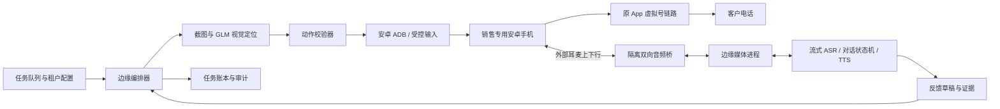
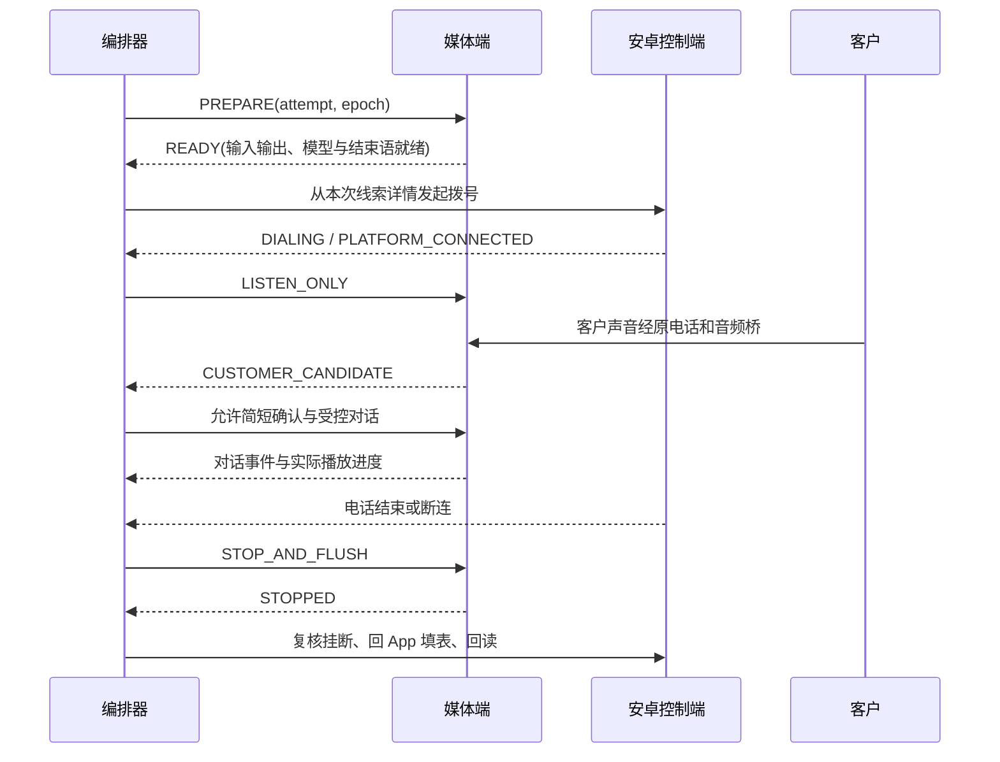

# 营销 App 智能外呼代理详细设计

版本：v0.3，2026-09-05。状态：📋 待开发；方案设计完成，未完成真机可行性验证。

关联：[调研与来源](../research/marketing-call-agent-feasibility.md) · [验证、排期与成本](../plans/marketing-call-agent-plan.md)。

## 1. 已确定范围

- 客户系统疑似“云图”，名称待核实；不假设具体供应商或后台结构。
- 不依赖平台 API、SIP、厂商支持或数据库；全部业务读写由 App 界面完成。
- 我们选定专用安卓机；保留客户授权的销售账号和绑定 SIM，不使用销售日常手机承载无人值守任务。
- 按用户要求采用 GLM-5.3-Flash 从截图定位按钮、字段和页面状态；安卓自带能力执行输入、点击和设备状态读取。
- 保留 App → 系统拨号盘 → 原虚拟号 → 客户的链路；不改成另一个外呼系统直接拨打客户。
- 自动发现线索、发起电话、按流程对话、生成反馈、回填并核实保存；云图录音按原系统黑盒能力处理。

MVP 限定一个 App 版本、一种机型、一张 SIM/一个销售账号、一个话术流程。目标是意向初筛、需求采集、预约人工跟进，不自动承诺价格优惠、签约或处理付款。

## 1.1 前置实验范围：无需云图即可开发

先按[GLM 实验执行手册](../plans/marketing-call-agent-experiment-runbook.md)实现 P0-A。它与云图生产适配分开：

- 视觉轨：模拟器或真机上的替代 App，以 Python＋ADB＋GLM-5.3-Flash 实现截图定位、像素变换、单步动作和新截图验证。没有替代 App 时用系统设置做只读导航；中文表单需要支持该能力的 App，不能用导航成功代替。
- 媒体轨：安卓真机 A 手动拨普通测试电话 B，耳麦桥连接电脑；先固定 WAV 双向收发，再接流式 ASR/LLM/TTS。无需云图、虚拟号或自动拨号，也不以此声称解决客户腿接通判断。
- 首批仅实现 E0/E1，不修改生产启动和数据库。代码隔离在 `experiments/marketing_call_agent/`；后续确认稳定再迁移可复用模块。

隔离三个接口：`DeviceAdapter`（截图/输入）、`VisionLocator`（截图到框）、`AppScenario`（页面目标/后置条件）。云图上线时替换 AppScenario，重新采样页面；不在底层写死替代 App 坐标。`AudioTransport` 独立提供采集/播放/停止，普通号码测试与未来虚拟号共用媒体底层。

实验只支持固定竖屏、全图等比缩放；主设计第 4 节的裁剪/旋转属于后续能力，不扩大第一批实现。所有真实调用、模拟、人工操作分别记账；结果不完整时单项 BLOCKED，不报告整体通过。云图录音仍按黑盒处理。

## 2. 推荐物理结构



边缘电脑负责稳定的 USB 控制、声卡读写、本地故障保护和缓冲；云端复用本项目租户、文本模型、业务配置与审计。无需在第二部手机上运行 AI，也无需边缘电脑部署大型模型权重。AI API 中断时由边缘端执行预置结束语和挂机策略。

**只有软件且不允许外接音频设备时，普通安卓公共接口无法作为已验证的通用双向蜂窝音频方案。**此时必须先验证选定设备提供的合法厂商能力，否则完整目标不能承诺；截图点击不能弥补这个缺口。技术依据见[音频边界调研](../research/marketing-call-agent-feasibility.md#3-安卓权限与音频边界)。

## 3. 设备选择与音频连接

### 3.1 选型标准

先借测两种候选机型，再锁定其中一种：可运行客户 App、可授权 ADB、截图无遮挡、正常长期充电、耳麦双向音频可靠。优先仍在安全维护期且有 3.5 mm 耳麦接口的设备；没有时验证带麦克风输入的 USB-C DAC 与供电/调试组合。不在真机测试前指定采购型号。

固定系统版本、App 版本、竖屏、字体大小、显示缩放、导航模式和默认 SIM。升级先在备用机回归，安全更新不永久禁用。使用受管设备、锁定应用范围、可信调试主机；遇到锁屏或登录验证暂停，不能绕过身份验证。

一部手机同时只承载一通任务；同一销售账号是否允许多机登录必须观察。备用手机不能在主机通话未知时自动接管重拨；SIM/账号迁移需重新验证绑定。

### 3.2 双向有线桥

```text
客户语音 → 原电话网络 → 手机耳机输出 → 隔离/电平适配 → 电脑 ADC → ASR
客户收到 ← 原电话网络 ← 手机耳麦输入 ← 衰减/隔直/匹配 ← 电脑 DAC ← TTS
```

设备清单：安卓手机、电脑、可独立选输入输出的全双工 USB 声卡、手机耳麦接口适配器、隔离/衰减电路或具有相同能力的成品电话音频耦合器、固定线材、稳定电源。具体接线由音频工程验证，严禁把耳机或线路电平未经匹配直接送入手机麦克风端。

手机外部麦克风成为销售说话入口；电脑输入不打开软件直通监听，避免形成反馈环。对电脑播放参考做回声消除，处理手机侧音、远端回声和模拟串音。立体声输出只取正确通道或经电阻混合，不直接短接。检查手机是否偷偷退回内置麦克风，可通过移开设备、轻敲外置输入、远端确认与输入电平对照验证。

USB-C 路线需要测试音频＋PD 充电＋ADB 共存；无法共存则改用有 3.5 mm 接口机型，或在隔离内网使用经授权的无线调试，不能把 ADB 服务暴露公网。

设计前提：正常沿云图 App 的拨号方式完成电话，云图自行承担录音及销售/客户关联。其内部实现不在本项目范围，不设置录音检查、轮询或对账门禁。音频桥只需验证客户与 Agent 能正常双向听说。

## 4. 截图视觉控制

### 4.1 分工

GLM 负责描述当前页面、定位指定语义目标、读取可见字段；确定性程序负责状态跳转、坐标变换、动作白名单与重试。模型不获得任意 shell、不自由规划跨多个页面批量点击。页面里的文字都是待识别数据，不能覆盖系统指令。

主要动作：`capture`、`tap`、`swipe`、`back`、`type_text`、`read_call_state`。底层通过受限 ADB 命令或自研伴随应用执行；安卓通话状态 API 仅作为辅助，权限与 OEM 兼容性以实测为准。原生控件树可提供辅助校验，不替代用户指定的视觉定位主路径。

### 4.2 坐标协议

每张截图携带 `frame_id, captured_at, width, height, rotation, display_id, density, crop_rect, resize_scale, padding, layout_epoch`。模型只允许返回“当前传入图片像素坐标”；不要混用 0–1000 归一化、dp 和物理像素。

```json
{
  "frame_id": "frame-018",
  "page": "lead_detail",
  "target": "call_button",
  "found": true,
  "bbox_px": [742, 1660, 984, 1780],
  "label": "拨打电话",
  "confidence": 0.96,
  "ambiguity": false
}
```

示例仅定义协议，坐标不是目标 App 的真实坐标。模型的自报置信度只参与拒绝策略，不能当作正确概率。

无旋转情况下：模型图点 `(xm,ym)` 先减填充 `(px,py)`，除缩放 `(sx,sy)`，再加原图裁剪起点 `(cx,cy)`，得到原截图点；再经过截图到当前显示输入空间的标定变换 `T`。

`p_device = T × ((xm-px)/sx+cx, (ym-py)/sy+cy, 1)`。

全屏原尺寸截图与输入空间一致时 `T` 是单位变换，此时不应再乘 DPI。DPI 改变布局，须重新截图定位；旋转则更新变换及布局版本，MVP 直接锁定竖屏。状态栏已包含在全屏图里时不能重复加偏移。

### 4.3 单步闭环与危险动作

1. 截图并验证目标 App/系统拨号器在前台。
2. GLM 返回页面和一个目标框；校验框非空、不越界、目标语义匹配。
3. 选择目标框安全内点；新截图确认页面未跳转、目标区域未移动，过期结果作废。
4. 点击一次；等待目标页面条件成立，超时重新观察，不盲目连点。
5. 保存动作前后证据，推进持久化状态。

拨号与反馈提交有更严格校验：线索身份、当前账号、允许时段、设备锁、操作意图必须全部匹配。弹窗遮挡、重复姓名、未识别页面、键盘覆盖、通知弹出时先停止动作。视觉模型请求失败只影响当前业务步，不能阻塞正在进行的语音通话。

中文输入采用受控伴随输入法/已授权输入通道；原始 `adb input text` 不作为完整中文表单方案。粘贴后回读、检查换行与截断，清理剪贴板。操作参数用参数数组传递，不拼接模型产生的 shell 文本。

### 4.4 新线索发现

本机授权的通知监听可作为唤醒提示，App 新线索列表为业务事实来源。无通知时轮询默认 60 秒，可按容量调整至 30–120 秒；扫描工作与拨号/填表共用设备互斥锁。通话期间不操作 App 列表，只记录待扫描标志。

列表扫描包含首屏、翻页/滚动、时间水位及重叠窗口，防止乱序插入遗漏；启动与恢复后做有限范围补扫。通知重复、列表重排只产生一个本地线索。不能只凭姓名或虚拟号去重。

优先读取可见线索编号。没有编号时，用租户、销售账号、页面可见创建时间、来源和其他稳定字段组成本地指纹，保存详情页证据；存在冲突或字段不足则进入人工队列，不能宣称精确识别。App 如果既无稳定身份字段又不能可靠回到同一详情页，是自动回填的停止条件。

## 5. 呼叫与业务状态机

每次拨打生成唯一 `attempt_id`；线索 `lead_id` 与呼叫尝试分离。设备、账号和线索同时加租约锁，租约带递增 `epoch`，旧进程不得继续执行。

```text
DISCOVERED → ELIGIBLE → RESERVED → PREPARING → DIAL_INTENT
→ DIALING → PLATFORM_CONNECTED → CUSTOMER_CONFIRMED → TALKING
→ ENDING → ENDED → FEEDBACK_DRAFT → FEEDBACK_WRITING
→ FEEDBACK_VERIFIED → COMPLETED

旁路：SUPPRESSED / NO_ANSWER / FAILED / UNKNOWN / REVIEW_REQUIRED
```

实际持久化使用两个独立字段 `call_state / feedback_state`。任务完成以通话处理结束、反馈保存回读通过为准，不等待或检查云图录音；Agent 自留参考音轨的保存也不构成云图业务完成条件。

### 5.1 拨号前准备

确认线索仍属于当前销售、未被人工联系或拒绝、未超过重试额度。重新打开详情读取最新上下文，不重用昨日虚拟号码。提前加载话术版本、接通判断规则和结束语，建立媒体与模型连接，验证外部耳麦输入输出，再写入 `DIAL_INTENT`。

点击 App 拨号按钮后观察系统拨号盘；识别当前虚拟目标、分机与选卡框，核对与本次 App 动作一致，再执行系统拨号。需要后拨号时按实测规则处理，不猜 DTMF。看到“拨打中”即记录本地效果证据。

### 5.2 两层接通

手机 `OFFHOOK`、计时开始或拨号器“已接通”，最多证明本机腿进入通话，不能证明客户已接。没有供应商回调时以音频判定为主：平台提示音/回铃基线、提示语结束、非模板人声、符合轮次的响应共同判断。

`PLATFORM_CONNECTED` 时只监听，不立即播放完整销售话术。检测到候选人声后，可播放一句简短、明确身份的确认语，收到合理回应再进入业务对话。语音信箱、“正在为您接通”和真人都可能包含人声，因此分类不确定时标记 `UNKNOWN`，不能凭固定等候秒数或单次“你好”确认客户。

首版默认拨号等待上限 60 秒、平台腿接通后客户确认上限 45 秒、单通总时长上限 8 分钟，均是待调参数。超时结束并记录原因；状态不明不自动重拨。

### 5.3 幂等与恢复

GUI 没有服务端幂等键，系统不能保证外部操作严格 exactly-once。执行前持久化意图，执行后记录截图与通话证据；崩溃后必须先对账，不能因为没有成功回执就重新点击拨号。

例如点击后 ADB 断线：任务进入 `UNKNOWN`，冻结该线索和设备的派发；重连检查电话状态、近期通话界面及 App 记录。无法判定时人工核对。新进程拿到租约也不能覆盖未解决呼叫。仅明确未发起或明确未接通且符合联系政策时允许新 `attempt_id`。

拒绝后本地抑制标记立即提交，独立于 App 回填是否成功；不允许等待反馈保存后才阻止下一通。

## 6. 实时语音与话术执行

### 6.1 处理链

`音频输入 → 重采样/回声消除 → VAD → 流式 ASR → 话术状态机 → 文本生成 → 规则校验 → 流式 TTS → 输出队列 → 耳麦桥`。

首版使用分段式 ASR＋LLM＋TTS，以便控制每个问题、校验输出和记录证据；GLM 视觉调用独立于语音调用。ASR/TTS 采用国内可用的流式服务，通过抽象接口锁定实际模型、编码和区域。Qwen 实时模型可做备选评测，不把当前短音频识别工具直接拼接成实时系统。

边缘内部建议 PCM16、单声道、20 ms 帧；采样率按声卡和服务能力转换，不能把 8 kHz 电话声信号升采样后当成真正宽带音频。每帧标记会话、方向、序号、单调时钟、格式版本。音频实时路径与日志、截图、数据库写入分开队列，存储慢不能卡声音。

使用有界缓冲，初始抖动缓冲目标 60–120 ms；队列积压时告警并结束或降级，不能无限累积几秒钟旧语音。电话端与云端实际音频格式、音量、网络抖动在 P0 确定。

### 6.2 延迟与打断

建议验收目标：客户话音结束至客户听到首个有效回答 p50 ≤1.2 秒、p95 ≤2.0 秒；客户开始打断至客户侧 AI 声音停止 p95 ≤300 ms。均为工程目标，非供应商保证，最终用远端录音测量，不只记录服务端首 token。

参考预算：端点判定 300–500 ms，ASR 稳定文本与传输 100–250 ms，文本首句 150–400 ms，TTS 首包及缓冲 150–300 ms；部分环节可重叠，真实尾延迟可能超标。截图模型不进入该预算。

检测到客户真实插话时：本地立即停止播放和清空 DAC 队列 → 增加 `utterance_epoch` → 取消当前 LLM/TTS → 丢弃旧 epoch 迟到音频 → 保留客户插话 → 按新输入恢复。清空云端响应不足以停止声卡里已排队的音频。

持续监听输入，不能靠关闭麦克风实现防回声。AEC 使用实际播放参考并校准延时；双讲测试区分客户插话、远端回声和 AI 自身串音。记录实际已播放的句子/偏移，被打断后未播放内容不能计入“已告知”或客户已听到的话术。

### 6.3 受控对话图

| 状态 | 要做的事 | 转移规则 |
|---|---|---|
| 身份与来意 | 企业、智能助手身份、联系原因及适用告知 | 对方愿意继续后进入需求确认 |
| 时间确认 | 询问现在是否方便 | 不方便则采集回访时间并结束 |
| 需求确认 | 确认线索所涉服务，不暴露无关个人信息 | 找错人则终止并标记 |
| 核心问题 | 每轮只问一个已配置问题 | 槽位齐全则进入总结 |
| 异议/反问 | 从审核知识回答，不确定则交人工 | 返回原问题或结束 |
| 总结确认 | 简述需求与下一步，纠正识别错误 | 明确确认后登记 |
| 拒绝/人工 | 拒绝即停止；人工需求进入接管/预约 | 结束营销分支 |

每个节点定义 `allowed_intents, required_slots, approved_facts, max_reprompts, exit_conditions, forbidden_claims`。模型返回结构化 `intent, slots, evidence, next_node_candidate, reply_text`，状态机校验候选跳转。关键金额、日期、数量需复述确认；两次听不清后结束或交人工，不循环追问。

开场模板示意：“您好，我是【企业名称】的智能服务助手，就您提交的【服务咨询】联系您。现在方便简单确认一下需求吗？”录音告知按客户已确认的合规口径配置。不得虚构客户提交记录；没有该证据时换为获批的真实来源描述。

### 6.4 人工与异常结束

有现场销售时，用硬件/软件切换到人工耳麦并立即关闭 AI 输出，状态进入 `HUMAN_TAKEOVER`，同一原电话链继续。切换前需要实测不会掉话；不能依靠人工与 AI 同时说话。

无人值守或销售不在设备旁时，记录人工跟进请求并安排后续联系；没有平台能力时不承诺远程无缝转接。若未来做远程人工音频端，是独立媒体接入功能，不是假设手机自带转接。

ASR/模型短时不可用可播放一次本地等待语；持续故障按超时结束，标记技术失败。客户静默先做一次确认，持续静默结束。拒绝、投诉、找错人优先级高于流程完成率。

## 7. 跨设备时序与故障保护

有线方案的“手机控制”和“电脑媒体”仍是异步系统，必须显式握手；双手机备选复用同一协议，不能靠固定 sleep 同步。

所有控制消息含 `tenant_id, attempt_id, device_id, session_epoch, command_id, seq, deadline`。事件还含 `observed_at, received_at, source`；超时用本机单调时钟，跨端使用时间同步辅助审计，不用跨端绝对时间决定音频播放。



初始参数：心跳 2 秒，连续 3 次缺失转故障；实际值由设备测试调整。端点按 `command_id` 去重，只接受当前 epoch；控制消息可重传，音频不可在重连后重放上一通内容。

安全约束：未 READY 不拨；未有客户证据不进入完整话术；挂机立即停止输出；媒体故障时本地结束；ADB 中断时禁止下一通。若 ADB 和媒体控制都失联，软件不能保证远程挂机，因此需要本地看门狗尽可能执行结束、现场异常告警，并在试点验证故障剩余风险。不能把“停止播放”报告成“已挂断”。

本地磁盘加密暂存事件，网络恢复后按序补传，中心任务持久化后确认；磁盘满、时钟异常、设备温度异常或音频路由改变停止接新任务。

## 8. 反馈闭环与录音责任边界

### 8.1 结构化反馈

通话后基于转写与实际播放记录生成：结果（接通/无人接听/找错人/不便/拒绝/技术失败/未知）、意向、需求槽位、回访时间、待人工事项、摘要、证据片段与置信级别。

“没说”记未知，不能记否；沉默或挂机不能自动记拒绝；AI 推测不写成客户承诺。ASR 低置信、日期歧义、关键金额未确认进入复核。明确拒绝可以立即抑制；原 App 的字段映射仍按页面真实选项验证。

反馈模板配置以实际表单为准：枚举映射、必填项、最大长度、日期时区、保存按钮、保存后的可见证据。项目不能预设“云图”有哪些字段。摘要只含必要业务信息，个人敏感字段不出现在普通日志或面向用户的明文报告。

### 8.2 提交协议

`草稿落库 → 重新确认同一线索/本次记录 → 读取已有反馈 → 校验无人修改 → 填写 → 逐字段回读 → 持久化提交意图 → 点击保存一次 → 离开重进 → 读取持久化结果`。

无后台版本号时，用可见原值的指纹作乐观冲突检查，出现人工修改则暂停而非覆盖。只能看到 toast 不足以证明已保存。提交后超时先回读，发现目标内容存在则完成；无法判定则复核，不盲目追加相同反馈。App 无可见回读入口时不能宣称自动写回可靠。

### 8.3 录音责任边界

云图录音是黑盒能力。按用户确认的设计前提，只要正常沿云图 App 发起并完成电话，录音及销售/客户关联由云图自行处理。实际后台实现仍未知，本项目不调查或控制这一过程。

我们负责保持原 App 拨号路径、正确线索和销售账号上下文；不设计云图录音生成、关联、轮询、下载、对账、补传或缺失告警，也不以录音状态阻塞任务完成。

Agent 可保留自己的音轨、转写和实际播放记录，用于反馈生成、问题排查及质检。这些都是独立的非权威参考，不能上传到云图，也不替代或修复云图录音。所有自留音轨标记来源为 Agent 参考记录，不能展示为云图原始录音。

本地接收音轨可能含侧音，发送音轨是实际播放内容，不应宣称是云图的双声道通话录音。保存失败仅按本地诊断策略处理，不触发重新拨号。

## 9. 数据模型与工程边界

拟建立 `marketing-call-agent` 业务模块，具体业务表使用 `bs_marketing_call_agent_` 前缀；所有表含 `tenant_id, user_id, created_at`，SaaS 租户不能为空。以下为设计，尚未建表。

| 表后缀 | 核心字段/用途 |
|---|---|
| leads | local_lead_id、可见外部 ID/指纹、account_id、identity_confidence、来源、抑制状态 |
| attempts | attempt_id、lead_id、通话与反馈状态、device_id、epoch、话术版本、开始结束、关联证据 |
| devices | 安装身份、账号引用、机型版本、音频配置、租约、健康状态 |
| events | 事件 UUID、attempt_id、序号、类型、时间、加密载荷引用 |
| feedbacks | attempt_id、版本、结构化值、证据、审批状态、写回前后指纹 |
| artifacts | Agent 自留参考音轨/截图/转写的来源、加密位置、哈希、保留期限 |
| suppressions | 租户和联系对象稳定键、原因、生效时间、来源 |

手机号如确需保存采用加密字段＋租户内带密钥 HMAC 索引；虚拟号不用于跨线索合并。只知道本地线索身份时抑制覆盖该身份，不能保证不同重复线索都是同一人；身份无法可靠消歧的自动呼叫进入复核。

租约、事件去重、任务状态比较并交换由数据库事务保障；Redis 可做加速，失效时不能失去重复拨号保护。外部 GUI 的结果未知必须保留为未知。

拟新增路径（不是现有实现）：

```text
src/marketing_call_agent/  # 调度、状态机、策略、数据与反馈
clients/marketing-call-edge/  # ADB、视觉定位、坐标校验、媒体、看门狗
services/marketing-call-media/  # 流式 ASR/TTS 与实时会话，可独立部署
tests/.../marketing_call_agent/  # 按现有测试分层规则落位
```

复用 `src/llm/gateway.py` 时补充图像输入能力核验，不能假设当前智谱适配器已支持截图。复用租户配置、scheduler 与计费思路；流式音频不经过主 Agent 多轮工具循环，不长占用普通 HTTP worker。实时媒体进程与 Web API 独立部署，设备 worker 每机串行。

配置与 settings 同步、日志使用 loguru；错误 debug 脱敏；业务表登记遵守数据库规范。电话业务转写存本模块，不混写 Web `chat_messages`；`chat_records` 如用于统一计费只登记聚合用量，来源枚举和计费口径需显式扩展。

## 10. 安全、监控和上线原则

账号凭证在设备或加密凭证库，模型只看到完成当前动作所需的截图区域；截图中不相关客户信息先遮罩。截图/转写/录音均加密存储，普通报告只返回脱敏摘要和授权访问入口。云端密钥不下发给手机模型上下文；边缘用短期身份凭证与服务通信。

权限按租户和销售范围校验，不能仅凭模型返回的 tenant_id 选库。日志不含原号码、完整表单或账号令牌。留存周期、删除与客户原平台副本的责任边界需配置确认，本地删除不能承诺删除原平台记录。

仪表盘关注：待处理/未知任务、拨打与接通分开计数、端到端延迟、打断耗时、错页拦截、反馈回读失败、设备温度/心跳/音频路由、每通视觉调用与费用。低接通率、持续静默或同一设备连续 3 次流程失败触发暂停，阈值经试点调整。

提供全租户、单设备、单账号暂停开关。暂停停止派新任务；紧急停止额外终止现有 AI 输出并尝试挂机，挂机失败必须显式告警。生产期间管理员可以随时取回设备进行人工处理，系统不得与人工抢屏。

详细验收、容量与排期见[实施计划](../plans/marketing-call-agent-plan.md)。
