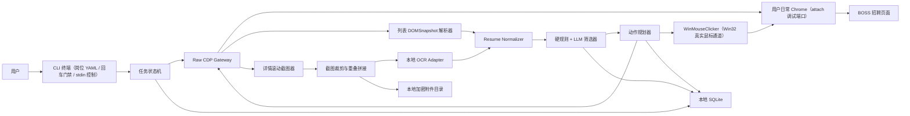

# BOSS 简历筛选助手原生 CDP 设计

> 状态：✅ Phase 0 已通过（按产品确认的最小原生 CDP 门禁）  
> 日期：2026-07-22  
> 类型：Windows CLI 工具（Electron GUI 已随路线收敛删除，见 §16 决策 6）  
> 关联调研：[BOSS 直聘智能招聘 Agent 可行性调研](../../research/boss-recruiting-agent-research.md)  
> 开发计划：[原生 CDP 开发计划](../../plans/recruiting/boss-resume-assistant-native-cdp-dev-plan.md)

## 1. 结论

新建 CLI 工具 `clients/boss-resume-assistant/`，与现有 Agent、租户、渠道、服务端 Browser Runtime 和服务端数据库完全解耦。用户自己用日常 Chrome 带 `--remote-debugging-port=9222` 启动并扫码登录、关闭弹窗、进入推荐牛人页面；CLI attach 调试端点并在终端回车确认后，才通过 Chrome DevTools Protocol 的 browser WebSocket 建立连接（attach-only，程序绝不 spawn/kill 用户 Chrome，见 §16 决策 7）。

浏览器控制必须使用自行实现的原生 CDP 客户端，不得引入 Playwright、Puppeteer、Selenium 或其他会自动初始化页面执行上下文的浏览器自动化框架。详情阶段禁止发送任何 `Runtime.*` 方法，也禁止通过其他域间接创建 isolated world、RemoteObject 或注入页面脚本。详情正文和结构化摘要统一来自截图与本地 OCR；DOMSnapshot 仅用于列表定位和结构辅助。

首版采用以下已经验证可行的详情读取通道：

```text
推荐列表 DOMSnapshot
  → 原生 CDP Input 点击候选人（Phase 0 必须补齐稳定性验证）
  → Page.captureScreenshot 获取详情视口
  → Input.dispatchMouseEvent(mouseWheel) 分段滚动
  → 相邻截图重叠匹配并拼成长图
  → 本地 OCR 生成 ViewedResumeSummary 和正文
  → OCR 正文整理为筛选用 Markdown
  → 硬规则 + LLM 三态筛选
  → 原生 CDP Input 执行打招呼或不合适
  → 本地审计日志
```

## 2. 实验事实与架构约束

### 2.0 Phase 0 工程化进度（2026-07-22）

已在 `spikes/boss-native-cdp/` 建立可重复的原生 WebSocket 工具骨架（该探针工程已完成使命，2026-08-05 随路线收敛删除，结论固化于本文）：请求 ID 与 session 路由、超时/断开处理、CDP method 强制白名单、`Runtime.*` 与脚本注入硬拒绝及脱敏 JSONL 审计。当前命令只允许用户确认页面就绪后采集推荐页 DOMSnapshot、当前视口截图和实际 method 审计，不自动导航、刷新或执行写动作。离线自动化测试覆盖协议安全与清理、Chrome 150 dense array 与标准 sparse `{index,value}` 两种 DOMSnapshot 序列化、嵌套 iframe owner 偏移、各层滚动偏移、`nodeValue`/`contentDocumentIndex` 未知形态 fail-loud、重复文本、零面积点击区和招聘写动作文案拒绝。

2026-07-22 现场真机部分门禁结果：原生 Input 打开详情 2/2 成功；详情滚动 3 次并逐次截图成功；完整 Escape `rawKeyDown`/`keyUp` 2/2 成功；两份详情 DOMSnapshot 正文可读。根据产品决策，不再捕获 WASM `abstractData`，固定摘要探针及相关协议权限已删除。后续摘要门禁只验证分段截图、本地 OCR 与字段归一化链路。

2026-07-22 产品现场最终验收：基于 fresh 页面截图选择当前完整可见卡片，在卡片左侧正文区域使用原生 Input 打开详情成功，详情截图成功，单次完整 Escape 成功返回列表，未触发任何招聘写动作。产品明确以上述“打开详情 → 截图 → Esc 退出 + 无 Runtime/WASM”作为 Phase 0 通过标准；批量稳定性、长图拼接、OCR 和写动作分别留给后续 Phase，不再阻塞 Phase 1。

这只是 Phase 0 工程化与两个真机只读样本基线，不代表真机门禁通过。原生 Input 点击/滚动/Escape 的 20 次稳定性、截图重叠连续性、本地 OCR 摘要完整性及用户确认下的最小写动作仍需逐项验证。现场 DOMSnapshot 和截图含明文候选人 PII，只允许在用户显式确认后写入受保护临时目录，禁止入库/提交并在取证后立即删除；正式客户端必须使用加密附件目录。

### 2.1 已确认的最小刷新触发条件

在同一 Chrome、同一 profile、同一已登录页面上完成的单变量实验结果：

| 操作 | 是否刷新详情 |
|---|---|
| 仅连接 browser WebSocket | 否 |
| `Target.getTargets` | 否 |
| `Target.attachToTarget(flatten=true)` | 否 |
| `Page.enable` | 否 |
| `Network.enable` | 否 |
| `DOMSnapshot.captureSnapshot` | 否 |
| `Page.captureScreenshot` | 否 |
| `Input.dispatchMouseEvent(mouseWheel)` | 否，且能滚动详情正文 |
| `Runtime.enable`，不 evaluate | **是** |
| Playwright/Puppeteer 创建 Page、枚举 pages/frame 或读取详情 | **是或高度相关** |

因此问题不是 `locator.click()` 的选择器写错，也不是普通 CDP 连接本身被检测。最小可复现触发条件是 `Runtime.enable`。Playwright/Puppeteer 在创建 Page 抽象、发现 frame 和建立 execution context 时通常会隐式启用 Runtime；业务代码即使没有显式调用 `evaluate()`，也可能在框架初始化阶段触发详情刷新。

### 2.2 Canvas 与结构化数据事实

- 推荐列表 `/web/frame/recommend` 是普通 DOM，DOMSnapshot 能读取大量文本和布局节点。
- 详情 `/web/frame/c-resume` 的核心是 `DIV → CANVAS`，DOMSnapshot 只有外围节点，无法通过 Turndown、Readability 或 markdownify 得到正文。
- 详情接口 `/wapi/zpjob/view/geek/info/v2` 返回 JSON 外壳，但 `geekDetailInfo=null`；完整载荷位于 `encryptGeekDetailInfo`，由约 2.9 MB 的 WASM 解密并绘制。
- WASM 解密链路仅作为已知页面实现事实记录，不接入产品。为避免脚本注入和 frame 时序不确定性，结构化查看摘要统一由详情截图的本地 OCR 生成；列表 DOMSnapshot 仅提供定位和字段校验辅助。
- 原生 CDP 滚轮已经验证能稳定滚动详情，分段截图可覆盖 Canvas 正文。

## 3. 产品范围

### 3.1 首版目标

1. 用户每次启动后在可见 Chrome 中手动完成登录和页面准备。
2. 读取当前岗位的推荐候选人列表，建立稳定候选人指纹和处理队列。
3. 逐个打开详情；每次成功打开后先完成分段截图、长图拼接、本地 OCR 和字段归一化，再生成并落库 `ViewedResumeSummary` 与筛选用 Markdown。
4. 按岗位知识执行“硬规则 → LLM 证据化判断”。
5. 合格候选人点击“打招呼”；不合格候选人点击“不合适/不感兴趣”并选择原因；不确定候选人不执行页面动作。
6. 每个候选人的查看时间、结构化摘要、输入、结论、原因、证据、页面动作和动作结果写入本地日志。
7. 支持暂停、恢复、去重、人工复核和导出。

### 3.2 不在首版范围

- 自动填写账号、密码、短信验证码、扫码或验证码。
- 无界面后台运行或隐藏浏览器。
- 绕过安全校验、修改浏览器指纹或注入 stealth 脚本。
- 调用未公开接口直接执行打招呼、不合适等写操作。
- 依赖 WASM hook、`abstractData` 或任何页面脚本注入获取正文或摘要。
- 接入现有 Agent 服务端、多租户、聊天渠道或云端任务调度。
- 多招聘平台适配。

## 4. 总体架构



### 4.1 进程职责

| 组件 | 职责 | 禁止事项 |
|---|---|---|
| CLI 入口 | 岗位配置、进度输出、人工复核（HTML 报告）、日志导出 | 不直接访问 CDP 或密钥 |
| 主进程（node） | 状态机、Chrome attach、SQLite、任务编排 | 不解析具体页面选择器 |
| Raw CDP Worker | WebSocket、协议白名单、请求关联、截图和 Input | 禁止 Runtime；禁止任意 method 透传 |
| BOSS Adapter | 列表快照解析、坐标定位、详情状态识别、动作语义 | 不执行 LLM 判断 |
| Capture/OCR Worker | 裁剪、滚动、拼接、OCR、Markdown | 不控制招聘动作 |
| Screening Engine | 硬规则、LLM、证据和三态结论 | 不直接点击页面 |
| Audit Store | 候选人、评估、动作、错误和附件索引 | 不保存账号密码和验证码 |

## 5. Chrome 生命周期

### 5.1 启动（attach-only）

程序**不启动 Chrome**。用户自己用日常 Chrome 带调试端口启动（正常 profile、已有登录态）：

```text
chrome.exe --remote-debugging-port=9222 --user-data-dir="C:\chrome-boss-profile"
```

`--user-data-dir` 用目录联接到真实 User Data（绕过 Chrome 150+ 默认 profile 禁用调试端口的限制）。程序仅通过 `http://127.0.0.1:9222/json/version` 探测端点、解析 `webSocketDebuggerUrl` 后 attach；任何路径不得 spawn/kill 用户 Chrome、不得删除任何 profile（背景见 §16 决策 7：spawn 全新 profile 扫码登录触发 BOSS 风控封号）。

### 5.2 手动登录门禁

1. CLI 探测调试端点但保持 CDP WebSocket 完全断开。
2. 用户扫码登录、进入“推荐牛人”、选择岗位并关闭所有遮挡弹窗。
3. 用户在终端回车确认“登录和页面准备完成”。
4. 应用只调用 `/json/version` 和 `/json/list` 做只读检查。
5. URL、页面目标和截图预检通过后才建立 Raw CDP session。

应用不得通过轮询 DOM 判断扫码是否成功，因为这会过早初始化页面控制链路。

## 6. Raw CDP Gateway

### 6.1 强制白名单

所有协议调用必须经过单一网关；业务模块不能直接发送 CDP method。首版允许的方法：

```text
Target.getTargets
Target.attachToTarget
Target.detachFromTarget
Page.enable
Page.disable
Page.getFrameTree
Page.captureScreenshot
Network.enable
Network.disable
Network.getResponseBody
DOMSnapshot.captureSnapshot
Input.dispatchMouseEvent
Input.dispatchKeyEvent
```

如需新增方法，必须先写单变量真机实验、更新本设计并添加协议审计测试。

### 6.2 硬拒绝列表

```text
Runtime.*
Debugger.*
Page.createIsolatedWorld
DOM.resolveNode
任何返回或操作 RemoteObject 的方法
任何 evaluate/callFunction/binding 方法
任何 script injection
```

`Page.addScriptToEvaluateOnNewDocument` 和 `Page.removeScriptToEvaluateOnNewDocument` 均不在白名单内。网关拒绝业务层传入任何脚本；摘要只走截图、本地 OCR 与归一化链路。

网关遇到拒绝方法必须抛出不可恢复错误、暂停任务并写审计日志，不能静默忽略。

### 6.3 协议审计

每个 session 记录：

- method、时间、sessionId 哈希、参数摘要、耗时、结果状态；
- 禁止记录响应正文、Cookie、securityId 和完整候选人隐私；
- 真机验收导出唯一 method 集合，自动断言不存在 `Runtime.*`；
- CI 扫描依赖树，禁止出现 Playwright、Puppeteer、Selenium。

## 7. 推荐列表读取与候选人定位

### 7.1 数据来源

使用 `DOMSnapshot.captureSnapshot` 读取推荐 frame 的：

- 姓名、年龄、学历、工作年限、活跃状态；
- 期望城市、期望职位、期望薪资；
- 最近公司、职位、经历时间；
- 标签和列表可见摘要；
- 布局节点和候选人卡片边界。

解析器按 frame URL、DOM层级、文本模式和几何邻接共同识别卡片，不依赖单一 CSS 类名。任何卡片无法唯一定位时标记为 `UNLOCATABLE`，不得猜坐标点击。

推荐列表会动态重排并使用虚拟滚动。现场单次验证必须先获取 fresh DOMSnapshot，再选择当前可见且唯一的候选文本；页面变化后重新采集，不复用旧姓名或坐标。自动动态选卡与批量循环不属于当前最小工具范围。

真机发现顶部部分可见卡会被固定 header 遮挡：其 DOMSnapshot 坐标有效，但点击落在 header 上。定位器因此要求候选容器、正文点击点和动作锚点均完整落入 iframe 可见边界及根视口安全内容区，默认顶部 inset 150px、底部 inset 20px；跳过顶部/底部裁切卡并选择下一张完整卡，无完整卡时不发送点击。

Chrome 150 真机快照确认 `DOMSnapshot.layout.bounds` 已是各文档视口相对坐标，即使子文档 `scrollOffsetY` 非零，可见候选人的 bounds 仍直接对应当前截图。坐标换算只累加嵌套 iframe owner 的可见 bounds，不再减 document/owner `scrollOffset`；后者仅作诊断。旧的重复扣减会把滚动后仍可见的候选人算成负坐标并错误拒绝。

### 7.2 候选人指纹

优先使用页面提供的稳定加密候选人 ID；不可用时使用以下字段生成本地 HMAC 指纹：

```text
岗位ID + 姓名 + 最近公司 + 最近职位 + 工作年限 + 教育摘要
```

指纹只用于本地去重，不能作为跨账号全局身份。

### 7.3 打开详情

1. 从 DOMSnapshot 布局得到卡片内部安全点击点。
2. 使用 `Input.dispatchMouseEvent(mousePressed/mouseReleased)` 发送真实坐标点击。
3. 通过 `Page.getFrameTree`、Network 中的 `/web/frame/c-resume/` 或截图视觉状态确认详情出现。
4. 超时后只允许一次重新快照和重新定位；禁止盲目重复点击。
5. Phase 0 必须完成原生 Input 点击稳定性门禁，未通过前不得进入批量开发。

## 8. 详情读取

### 8.1 ViewedResumeSummary 查看日志

每次视觉和frame信号确认详情成功打开后，必须在同一数据库事务中写入一条查看记录。只有摘要已落库，候选人才可以进入筛选和页面动作阶段。

```ts
interface ViewedResumeSummary {
  candidateFingerprint: string;
  jobFingerprint: string;
  viewedAt: string;
  source: 'OCR_NORMALIZED' | 'LIST_DOM_FALLBACK';
  completeness: 'COMPLETE_SUMMARY' | 'PARTIAL_SUMMARY';
  baseInfo: {
    name?: string;
    gender?: string;
    activeTime?: string;
  };
  workExperiences: Array<{
    company?: string;
    position?: string;
    start?: string;
    end?: string;
    duration?: string;
  }>;
  projectExperiences: Array<{
    name?: string;
    role?: string;
    start?: string;
    end?: string;
    duration?: string;
  }>;
  educationExperiences: Array<{
    school?: string;
    degree?: string;
    major?: string;
    start?: string;
    end?: string;
  }>;
}
```

来源优先级：

1. `OCR_NORMALIZED`：从详情截图的本地 OCR 中恢复结构化摘要。
2. `LIST_DOM_FALLBACK`：OCR失败时，至少保存列表可见摘要并标记 `PARTIAL_SUMMARY`，任务暂停等待人工处理，不能继续执行写动作。

查看日志不保存头像URL、userId、securityId、encryptGeekId、encryptJobId、lid 或 `encryptGeekDetailInfo`。Network 捕获到的加密正文只用于诊断，不写业务日志。

### 8.2 滚动截图

详情截图只使用 `Page.captureScreenshot(captureBeyondViewport=false)`。`captureBeyondViewport=true` 不能展开内部 Canvas 滚动容器，不能作为长图方案。

流程：

1. 对详情正文区域连续发送向上滚轮，直到连续两次正文截图相似度超过阈值，确定顶部。
2. 截取顶部视口并裁掉左侧导航、顶部菜单、右侧固定操作栏和悬浮广告。
3. 每次向下滚动正文可视高度的 65%～75%，保留至少 25% 重叠。
4. 等待 Canvas 稳定：连续两次小图差异低于阈值，最长等待 2 秒。
5. 保存分片，使用相邻分片的正文重叠区域计算位移。
6. 裁掉重复部分后纵向拼接为单张 PNG。
7. 连续两次滚动后正文主体不变则判定到底；同时设置最大 20 片硬上限。
8. 拼接完成后做断层检测；失败则保留分片并进入人工复核，不生成伪完整长图。

截图算法不得依赖 `scrollTop`、DOM evaluate 或页面注入。

### 8.3 OCR 与 Markdown

OCR Adapter 输入长图或分片，输出：

```ts
interface OcrBlock {
  text: string;
  confidence: number;
  box: [number, number, number, number];
  pageIndex: number;
}
```

Phase 0 先固定 provider 边界：provider 必须是本机进程内或本机可执行程序，不允许在线 OCR API；未配置、程序不可用、输出字段或坐标非法时必须 fail-loud 并暂停。离线 fixture 只验证 `OcrBlock` 契约，不能作为识别成功或摘要完整性的证据。仓库现有 PaddleOCR 工具调用在线服务，因此不复用于独立桌面应用。

Normalizer 按坐标、字号视觉特征和关键词恢复章节：个人优势、期望职位、工作经历、项目经历、教育经历、技能。列表 DOMSnapshot 中已有的公司、职位、日期优先级高于 OCR；发生冲突时保留两个值并进入人工复核，不静默覆盖。

## 9. 筛选模型

### 9.1 三态结论

```text
QUALIFIED    合格，可计划打招呼
REJECTED     不合格，可计划不合适
UNCERTAIN    信息不足或冲突，不执行动作
```

### 9.2 两阶段判断

1. 硬规则：城市、薪资、学历、工作年限、必须技能、排除行业等确定性条件。
2. LLM：仅分析硬规则未决项，输出结论、逐条证据、缺失信息和置信度。

LLM 输入使用 Markdown，必须包含岗位知识版本和候选人字段来源。LLM 输出通过 JSON Schema 校验；无法引用简历证据的结论降级为 `UNCERTAIN`。

## 10. 页面动作

### 10.1 动作前置条件

- 当前详情候选人指纹与评估记录一致；
- 页面截图显示详情仍打开；
- 按钮只匹配到一个目标区域；
- 结论不是 `UNCERTAIN`；
- 当前 session 未达到用户设置的动作上限；
- 动作未在本地成功记录过。

### 10.2 原生 Input 执行

- `QUALIFIED`：定位“打招呼”按钮，发送 mousePressed/mouseReleased，随后通过截图、Network或列表状态验证结果。
- `REJECTED`：定位“不合适/不感兴趣”，选择映射后的原因，确认结果。
- `UNCERTAIN`：不点击，加入人工复核。
- 关闭详情：使用 `Input.dispatchKeyEvent` 发送 Escape；失败时暂停，不点击不确定的关闭位置。

任何写操作都必须具有 `PLANNED → SENT → CONFIRMED/UNKNOWN/FAILED` 状态。`UNKNOWN` 不自动重试，防止重复打招呼。

### 10.3 双通道点击执行

真机实证（2026-08-05，见 §16 决策 8）：BOSS 反作弊 SDK 对 CDP 合成鼠标事件**选择性拦截**，浏览类操作放行、筛选类控件拦截。因此点击执行分双通道：

- **定位统一走 CDP DOMSnapshot**：元素文本 → 结构化坐标（含 iframe owner 偏移累加），禁止大模型估算坐标。
- **通道 1（默认）CDP `Input.dispatchMouseEvent`**：卡片详情、Escape、滚动等浏览类操作。
- **通道 2 Win32 真实鼠标（`WinMouseClicker`）**：筛选按钮、tab、城市/职位下拉、筛选面板选项、确定按钮等被风控拦截的控件。
- **写动作（打招呼/不合适）**：默认先试通道 1，实证被拦则降级通道 2。

Win32 通道实现要点：

- **坐标换算**：DOMSnapshot layout bounds 即 device px（与截图 PNG 尺寸一致）；点击前 `GetWindowRect(Chrome_RenderWidgetHostHWND)` 实时取渲染视口屏幕矩形，`scale = 视口宽 / 截图宽` 换算屏幕坐标（自动覆盖 150% DPI 缩放），**窗口可变必须每次校准**。
- **落点守卫**：点击前 `WindowFromPoint` 必须归属 `Chrome_RenderWidgetHostHWND`；不是则 `SetWindowPos` 抬窗重试一次，仍失败 fail-loud 进入 `PAUSED`，不盲点。（防「幽灵按钮」：会话终端渲染的截图影像会被误当目标；防遮挡窗口吃点击。）
- **动作**：`SetCursorPos + mouse_event`（不用 SendInput 绝对坐标，多显示器需 VIRTUALDESK 标志有坑）；拟人分步移动（10 步/300ms）→ 悬停 500ms → down/up。
- **用户提示**：Win32 点击借用真实光标（约 1s），执行期间 CLI 必须提示用户手离鼠标。

## 11. 状态机与恢复

```text
IDLE
  → WAITING_MANUAL_LOGIN
  → CONNECTING_CDP
  → READING_LIST
  → OPENING_DETAIL
  → CAPTURING_DETAIL
  → OCR_AND_NORMALIZE
  → SCREENING
  → WAITING_REVIEW | EXECUTING_ACTION
  → CLOSING_DETAIL
  → CHECKPOINT
  → READING_LIST
```

任意阶段出现以下情况立即进入 `PAUSED`：URL异常、详情刷新、DOMSnapshot无法唯一解析、截图拼接失败、CDP方法被拒绝、动作结果未知、Chrome断开。

恢复时重新读取列表并用候选人指纹对齐，不复用旧坐标，不重发 `UNKNOWN` 动作。

## 12. 本地数据与审计

### 12.1 核心表

| 表 | 主要字段 |
|---|---|
| `jobs` | 岗位配置、知识版本、规则版本 |
| `sessions` | Chrome profile、CDP端口哈希、开始/结束、状态 |
| `candidates` | 本地指纹、列表摘要、首次/最近发现时间 |
| `resume_views` | 岗位、候选人、查看时间、摘要来源、完整度、ViewedResumeSummary JSON |
| `captures` | 分片、长图、OCR、Markdown、完整性状态 |
| `evaluations` | 三态结论、原因、证据、模型、Prompt版本 |
| `actions` | 动作、原因、状态、前后截图、错误 |
| `cdp_audit` | method、耗时、状态、脱敏参数摘要 |

### 12.2 隐私处理

- SQLite 使用应用级字段加密，主密钥由 Windows DPAPI 保护。
- 截图和 Markdown 放在本地加密附件目录，默认保留 30 天，可配置立即清理。
- 不保存 Cookie、账号密码、验证码、securityId、完整 CDP 响应正文。
- 日志显示姓名时支持遮罩；导出需用户主动操作。

## 13. 项目结构

```text
clients/boss-resume-assistant/
  src/cli/                     # CLI 入口（唯一产品形态）
    index.ts                   # 子命令分发：run / review / export / audit
    commands/                  # 各子命令实现
    cliRuntime.ts              # 运行时装配（数据目录、attach、状态机接线）
    jobConfig.ts               # 岗位 YAML 配置
  src/main/
    chrome/ChromeAttacher.ts   # 调试端点探测（attach-only，绝不 spawn/kill Chrome）
    cdp/CdpSocket.ts
    cdp/CdpGateway.ts
    cdp/methodPolicy.ts
    input/WinMouseClicker.ts   # Win32 真实鼠标通道（Phase 10 待实现）
    workflow/ScreeningSession.ts
    workflow/candidateEnumerator.ts
    boss/                      # ListSnapshotParser / DetailCapture / ButtonLocator 等
    image/LongScreenshotStitcher.ts
    ocr/                       # OcrProvider / TesseractJsProvider
    normalize/ResumeNormalizer.ts
    screening/                 # ScreeningEngine / DeepSeekLlmProvider
    actions/                   # ActionPlanner / PageActionExecutor / ActionStore
    storage/
  db/                          # SQLite client / schema / migrations
  scripts/                     # 诊断与 Win32 点击落地脚本（win-click.ps1 等）
  tests/                       # node:test 单测 + manual-e2e 真机步骤
```

## 14. 测试策略

### 14.1 自动化测试

- CDP mock server：请求关联、超时、断线、session 路由。
- 方法策略：允许列表逐项通过；所有 `Runtime.*` 和未知方法必须失败。
- 依赖扫描：禁止 Playwright、Puppeteer、Selenium。
- DOMSnapshot fixtures：列表改版、缺字段、重复姓名、懒加载、卡片重排。
- 图像 fixtures：滚动重叠、固定栏、不同缩放、断层、到底检测。
- OCR/Normalizer：字段来源优先级和冲突复核。
- 状态机：崩溃恢复、UNKNOWN不重试、指纹去重。

### 14.2 真机门禁

真机测试必须人工登录并使用测试岗位：

1. 只读连接保持 10 分钟无刷新。
2. 原生 Input 打开详情 20 次，成功率达到 95%，无列表误刷新。
3. 10 份不同长度简历均能从顶部滚动到底部并生成无断层长图。
4. Escape 关闭详情 20 次无误操作。
5. 方法审计中 `Runtime.*` 为 0。
6. 真实写操作只做经用户确认的最小样本，验证幂等和结果确认。

## 15. 验收标准

- 用户可以手动登录并明确控制开始、暂停和停止。
- 详情阶段连续处理 10 份简历不出现因 CDP 初始化导致的刷新。
- 每次成功打开详情都有一条已提交的 `resume_views` 记录；至少包含候选人指纹、岗位、查看时间和结构化摘要。
- 每份进入自动筛选的简历都有长图、OCR/Markdown、三态结论、原因和证据。
- 合格/不合格动作具有可确认结果；未知结果不重试。
- 本地日志可以按岗位、查看日期、候选人、摘要来源、结论和动作查询并导出。
- 代码依赖和 CDP 审计均证明不存在 Playwright/Puppeteer/Selenium 和 `Runtime.*`。

## 16. 关键决策

1. 稳定性优先：宁可使用截图/OCR，也不进入 Runtime 获取更方便的 DOM。
2. 原生 CDP 不是反检测伪装，而是避免已实验确认的 Runtime 刷新触发条件。
3. 结构化摘要统一来自本地 OCR；DOMSnapshot 只做定位、结构辅助和字段交叉校验。
4. 真机 Phase 0 是开发门禁；原生点击和写动作未通过前，不建设大规模业务功能。
5. 任何无法确认页面对象、截图完整性或动作结果的情况都 fail-loud 并暂停。
6. **CLI 优先于桌面 GUI（2026-08-04 产品决策）**：BOSS 操作场景有限、用户输入极简（扫码登录确认、UNCERTAIN 复核、启停），Electron + Vue + IPC 三层壳性价比低。产品形态改为 CLI 入口复用全部主进程模块（CDP/OCR/筛选/动作/状态机均 UI 无关）：
   - 登录门禁：CLI 启动可见 Chrome → 用户扫码 → 终端回车确认 → 才连 CDP（与原设计 §5.1/§11 一致，仅交互载体从按钮换成回车）
   - 岗位配置：YAML/JSON 配置文件，不再依赖 GUI 表单
   - 运行进度：终端实时输出（状态机事件 → 控制台行）
   - 复核队列：生成静态 HTML 复核报告（长图 + 摘要 + 证据 + 结论），改判在 CLI 按编号操作
   - 审计/导出：复用现有 CSV/JSON 导出
   - Electron GUI 工程已随路线收敛**整体删除**（2026-08-05，renderer/main 壳/IPC/preload/打包链路及对应测试），CLI 为唯一产品形态
   - better-sqlite3 升级 v13（N-API 预编译），开发与测试统一使用 node 22
7. **浏览器接入方式：attach 用户日常 Chrome，禁止 spawn 全新 profile（2026-08-04 封号事故后的修正决策）**：原设计 §5.1 ChromeLauncher「独立临时 profile + 程序启动 Chrome」在高风控的招聘者账号场景下致命——全新设备环境（无 Cookie/历史/指纹）+ 调试端口扫码登录，BOSS 风控在登录环节即封号（CDP 连接尚未建立，与自动化操作无关）。修正为：**用户自己用日常 Chrome（正常 profile、已有登录态）加 `--remote-debugging-port=9222` 手动启动，程序仅 attach**（Phase 0/2 已验证此路径安全）；程序任何路径不得 spawn/kill 用户 Chrome、不得删除任何 profile。spawn 模式的 ChromeLauncher 已随路线收敛删除（2026-08-05）。
8. **双通道点击：CDP 合成事件 + Win32 真实鼠标（2026-08-05 真机实证）**：BOSS 页面隐藏 iframe 运行 `parent.__xbc` 反作弊 SDK，对 CDP `Input.dispatchMouseEvent` 合成事件做**选择性拦截**——浏览类操作放行、筛选类交互拦截；OS 级真实输入无法区分，全通。

   | 操作 | CDP 合成点击 | Win32 真实鼠标 |
   |------|------------|---------------|
   | 候选人卡片（开详情）、Escape、滚动 | ✅ | ✅ |
   | 筛选按钮、最新 tab、上海/职位下拉、面板选项 | ❌ 被风控选择性拦截 | ✅ |

   2026-08-05 demo 实证：筛选面板「5-10年 / 本科 / 硕士 / 博士 / 10-20K → 确定」全流程经 DOMSnapshot 定位 + Win32 点击一次通过，列表正确刷新（筛选·5 生效）。写动作通道归属待 Phase 7 真机验证。执行规范见 §10.3。

## 17. 附录：真机踩坑清单

2026-08-05 前后真机联调沉淀，全部已闭环。排查新问题时先对照此表。

| # | 坑 | 结论/解法 |
|---|----|----------|
| 1 | spawn 全新 profile 登录 → 封号 | attach 用户日常 Chrome（§16 决策 7） |
| 2 | Chrome 150 默认 profile 调试端口无效 | 目录联接 `C:\chrome-boss-profile` → 真实 User Data |
| 3 | 候选人误枚举（职位管理/上海等 UI 文本） | 结构信号：左列 x∈[80,700] + 姓名下方同列 `\d+岁` 年龄行 |
| 4 | 付费检测全员误判 | `直豆/首充` 命中左导航常驻文本；修复方向：区域限定 x≥400 + 弹层文案（解锁/购买/商品价格）子串匹配（Phase 10 实施） |
| 5 | mouseWheel -32602 | Chrome 150 要求 deltaX/deltaY 成对 |
| 6 | CDP 合成点击点不动筛选 | 风控 SDK 选择性拦截（§16 决策 8），筛选类控件走 Win32 |
| 7 | 150% DPI 缩放坐标系 | DOMSnapshot bounds = device px（与截图 PNG 同尺寸）；屏幕虚拟 px = device px ÷ 1.5；视口原点用 `GetWindowRect(Chrome_RenderWidgetHostHWND)` 实时取，窗口会变必须每次校准 |
| 8 | 幽灵按钮 | Claude 会话终端会把截图渲染出来，截图里的按钮影像会被误当真按钮（坐标/WindowFromPoint/截图全被带偏）。排查时先 WindowFromPoint 确认归属，别信肉眼截图位置 |
| 9 | 遮挡吃点击 | 会话终端/QQ 等窗口压住目标点时点击被吃掉。点击前 `WindowFromPoint` 必须是 `Chrome_RenderWidgetHostHWND`，否则先 SetWindowPos 抬 BOSS 窗口 |
| 10 | SendInput 多显示器映射错 | 绝对坐标需 `MOUSEEVENTF_VIRTUALDESK` 标志；统一用 `SetCursorPos + mouse_event`（虚拟坐标，无此坑） |
| 11 | PowerShell 中文乱码 | .ps1 必须 UTF-8 with BOM；中文参数勿经 bash 内联传递 |
| 12 | PS 脚本块→C# 委托静默失败 | 窗口枚举等逻辑全部写在 C# Add-Type 里，PowerShell 只做调用 |
| 13 | 用户鼠标干扰 | Win32 点击借用真实光标，点击期间（约 1s）用户手不能碰鼠标；CLI 流程中需明确提示 |
| 14 | Chrome 多 render widget | 一个窗口有多个 `Chrome_RenderWidgetHostHWND`（当前标签可见 + 后台标签隐藏实例），`FindRenderWidget` 必须优先取可见的，否则误判「标签页在后台」或取错窗口矩形 |
| 15 | 筛选面板行锚定两个变体 | ①标签与选项可能分行（选项换行，真机垂直差 57.5px）——行带按「最近其他行标签垂直距离的一半」推导，不用固定行高倍数；②弹层背后候选人卡片的重名文本（如「本科」cx=631）会落进行带——x 条件必须严格在行标签右缘右侧，放松到标签左缘会引入诱饵 |
| 16 | iframe 文档 bounds 是文档绝对坐标 | 推荐列表 iframe（doc2）滚动后按钮 bounds **不变**、`document.scrollOffsetY` 变（实测 0→1200→2400）。可见性/点击坐标必须 `owner偏移 + bounds - scrollOffset`，否则滚动后新露出的按钮永远被当视口外（表现为「不停往下滚但一个都不点」）。另：mouseWheel 实际滚动距离 ≈ deltaY 的 1.5 倍，滚动步长取 min(800, 视口半高) 防小窗口漏人 |
| 17 | 「沟通」页内嵌推荐 iframe 干扰页面判定 | 沟通页的 DOM 里仍挂着推荐 iframe 的全量节点（「筛选」「打招呼」文本都在 strings 里），按文本存在性做的页面前置校验会误通过。greet 前置校验需增强（待做，见开发计划 Phase 10） |
| 18 | 筛选选项是切换式控件，残留状态下 apply 变反选 | 上次运行留下的已选状态（如 筛选·5）下，再点同名选项是**取消**而非选中——同 spec 重复 apply 会把 5 项全点掉（2026-08-06 chat 演示实测翻车）。`FilterSetter.apply` 进面板后先点「清除」再选选项，替换语义保证幂等 |
| 19 | REPL 管道输入冲垮操作 | Node readline 在管道/快速输入下会把已缓冲的行**全部立即派发**（`rl.pause()` 挡不住），且 stdin EOF 立刻触发 `close`——若 close 直接退出，进行中的操作会被 `gw.close()` 半途中断（报「CDP socket is not connected」）。chat REPL 用「输入队列 + 串行处理 + close 置标志等队列排空」 |
