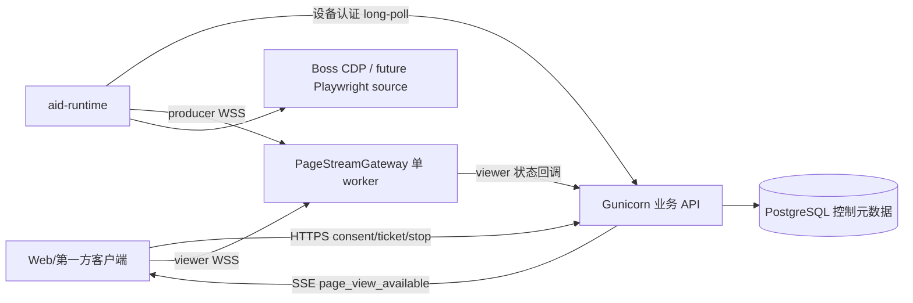

# 网页操作实时视图设计（Boss CDP 首期）

> 版本：v3.2（2026-09-01，开发前代码核查与独立复审修订）
>
> 状态：📋 已冻结，可直接开发
>
> 实验依据：[CDP 页面实时帧实验纪要](../../research/cdp-page-stream-experiment-notes.md)
>
> 开发计划：[网页操作实时视图开发计划](../../plans/recruiting/web-operation-live-view-dev-plan.md)

本文中的路径、状态、字段、超时和错误码均为 v1 实现约束，不留给开发阶段二次选型。除非代码事实与本文冲突，GLM5.3 应按本文实现；发现冲突时必须先更新本文，不能自行换方案。

## 1. 产品边界与固定决策

功能名称统一为 **Page Stream（网页操作实时视图）**。Boss CDP 是首个 producer；以后 Playwright producer 复用协议，不复用 Boss 业务逻辑。

1. v1 只有受信 channel `chat` 创建 offer。产品交付面为 Web；开发态 `desktop.legacy.html` 因复用 Web 入口自然继承。当前独立 `frontend/desktop` 新壳不 import Web ChatContainer，本期不接入；`desktop_remote_gateway` 也不开放。企微、钉钉、飞书及第三方 MCP Host 不创建 offer、ticket 或链接。
2. Agent 只能发出 `page_view_available`，不能替用户同意。只有第一方 UI 的 consent API 能创建 stream 和 start command。
3. v1 只读，只传 viewport/受限 clip JPEG；不传输入、音频、桌面、Cookie、DOM、历史录像。
4. JPEG 仅经过 producer WSS → 单进程 Gateway 内存 → viewer WSS；不进入 PostgreSQL、Redis、磁盘、对象存储、日志或异常上报。
5. API 继续 Gunicorn 多 worker。新增单 worker `PageStreamGateway`，不复用进程内 `BrowserViewHub`。
6. 普通 Boss 操作不等待用户观看；`boss_login_qr` 必须等待用户同意才允许 Runtime 领取 invocation。
7. 一次 Agent execution 内、同一设备上的多个 Boss invocation 复用一个 offer，避免连续工具调用反复点击。execution 结束即关闭该 scope 的 offer/stream。
8. 用户关闭后可在 offer 有效期内再次点击并建立新 stream；每次点击都有独立 consent 审计。

## 2. 关键标识与生命周期归属

| 标识 | 生成者 | 生命周期 | 用途 |
|---|---|---|---|
| `scope_id` | 当前 turn 的 `agent_execution_id`；缺失时入口生成 `ae_<uuid>` | 一次 Agent 执行 | 聚合同一次执行内的多个 Boss invocation |
| `offer_id` | 业务 API | scope 或登录 invocation | 告知可查看，不产生截图 |
| `stream_id` | consent API | 一次观看 | 一次 producer/viewer 中继 |
| `command_id` | consent/stop service | 一次 start/stop | Runtime 独立控制队列 |
| `source_ref` | 云端控制面 | offer/stream | `invocation:<first_invocation_id>` 关联标识，只在受信控制面和 Runtime 内流转，不是 target id |

普通 offer 唯一键为 `tenant_id + user_id + device_id + session_id + scope_id + purpose`，`purpose=observe_operation`。登录使用 `purpose=login_qr`，一条登录 invocation 一个 offer，不与普通 offer 混用。

## 3. 架构与部署拓扑



部署固定为：

- `src/page_stream/gateway_app.py:app` 由独立容器运行：`uvicorn src.page_stream.gateway_app:app --host 0.0.0.0 --port 8010 --workers 1`。
- `docker-compose.prod.yml`、`docker-compose.prod-eas.yml`、`docker-compose.test.yml`、`docker-compose.dev.yml` 均新增 service `aid-page-stream-gateway`；容器名依次为 `aid-page-stream-gateway/aid-page-stream-gateway-eas/aid-page-stream-gateway2/aid-page-stream-gateway3`，宿主机仅绑定 127.0.0.1 的 8010/环境配置端口，与 API 共用 `.env`、Docker 网络和镜像，不挂载 uploads/storage。容器内通过稳定 service hostname `aid-agent-api:8000` 回调本环境 API。
- 四份 Nginx 配置将 `/api/page-stream/v1/` 代理到同环境 Gateway：生产/EAS/内网 8010、测试 8011、在线开发 8014；关闭 buffering，开启 WebSocket upgrade，`proxy_read_timeout 75s`。
- Nginx 使用 `location ^~ /api/page-stream/v1/`，并增加 `location ^~ /internal/ { access_log off; return 404; }`。现有 compose 的 API host port 不是 loopback-only，因此 internal API 的应用层安全边界是独立 bearer token（缺失/错误恒 401/403）；Nginx 不路由是纵深防御，生产/EAS 还必须由宿主防火墙拒绝公网直连 `API_PORT`。
- 对外 WSS 路径固定为 `/api/page-stream/v1/producer/{stream_id}` 和 `/api/page-stream/v1/viewer/{stream_id}`；path 中只有非秘密 UUID，便于未来按 stream 路由。
- API → Gateway 内网接口固定为 `PUT /internal/v1/streams/{stream_id}` 注册/覆盖活动 session、`DELETE /internal/v1/streams/{stream_id}` 终结并关闭 sockets。PUT body 固定为 `{stream_id,tenant_id,user_id,device_id?,producer_kind,source_adapter_key,capture_policy,state,reason_code,expires_at,max_fps,max_frame_bytes,max_edge}`，其中 `state` 只允许 `waiting_for_producer|live`、`reason_code` 必须为 null；`capture_policy` 与 start command 为同一对象且其中 fps/max_frame_bytes/max_edge 必须分别小于等于顶层服务端上限，不含 URL/source_ref。Gateway 要求 hello `adapter_key` 等于 registration，frame `content_scope` 等于 registration policy，帧率/字节/边长不超过 policy；任一错配以 1008 关闭，尤其 `login_qr` registration 不接受 viewport frame。DELETE body 固定为 `{state:"ended|failed|expired",reason_code,changed_at}`；Gateway 必须先向 viewer 发送终态 `viewer_state`，再以 1000 关闭 producer/viewer 并删除内存记录，重复 DELETE 返回 204。只有协议错误或 Gateway 不可恢复内部错误可由 Gateway 直接发 `gateway_error` + `failed` 终态并回调；producer socket close/idle 只回调 `producer_gone` 并向 viewer 发 `waiting_for_producer`，Gateway shutdown 只发 `GATEWAY_SHUTDOWN`、1001 close 和 callback，均等待重连，不能自行判终态。重连耗尽后由 API 以 DELETE `failed` 终结。Gateway 从 `PAGE_STREAM_CONTROL_INTERNAL_URL` 读取本环境 API base（默认 `http://aid-agent-api:8000`）并回调 `/internal/v1/page-stream-events`，禁止代码硬编码容器名。双方使用 `Authorization: Bearer $PAGE_STREAM_INTERNAL_TOKEN`；Nginx 不暴露 `/internal/`。
- Gateway v1 单实例，不实现多 Gateway；超过单机容量先拆环境，不用普通 round-robin。后续扩容必须按 `stream_id` 一致性路由。

## 4. 数据库模型（DDL 约束）

DDL 同步写入 `deploy/init-postgres.sql`（新库基线）和 `deploy/db_update.yaml`（存量库启动时自动增量）。`deploy/db_update.sql` 已封存为运维历史留档，本功能不得修改。YAML 新增一个 datetime 严格递增、SQL 幂等的逻辑块，由 `_db_update_applied` 记录进度。所有表使用 `TIMESTAMPTZ`、UUID 默认 `gen_random_uuid()`；repository 的每个对象查询都包含 `tenant_id`。页面标题、完整 URL、query、fragment、DOM、JPEG 和票据明文不得入库。

### 4.1 `page_view_offers`

```text
id UUID PK
tenant_id VARCHAR NOT NULL; user_id VARCHAR NOT NULL; device_id UUID NOT NULL
session_id VARCHAR NOT NULL; scope_id VARCHAR NOT NULL
purpose VARCHAR NOT NULL CHECK (purpose IN ('observe_operation','login_qr'))
start_policy VARCHAR NOT NULL CHECK (start_policy IN ('continue_without_view','wait_for_consent'))
source_adapter_key VARCHAR NOT NULL; source_ref VARCHAR NOT NULL
capture_backend VARCHAR NOT NULL CHECK (capture_backend IN ('cdp','playwright'))
capture_policy_json JSONB NOT NULL
origin_label VARCHAR NOT NULL; device_label VARCHAR NOT NULL
state VARCHAR NOT NULL DEFAULT 'available' CHECK (state IN ('available','closed','expired'))
version INTEGER NOT NULL DEFAULT 0 CHECK (version >= 0)
first_invocation_id UUID NOT NULL; first_consented_at TIMESTAMPTZ NULL
expires_at TIMESTAMPTZ NOT NULL; closed_at TIMESTAMPTZ NULL; close_reason VARCHAR NULL
created_at/updated_at TIMESTAMPTZ NOT NULL
```

普通可用 offer 在 `(tenant_id,user_id,device_id,session_id,scope_id,purpose) WHERE state='available' AND purpose='observe_operation'` 部分唯一。所有 offer consent TTL 固定 120 秒；scope/invocation 提前结束则立即关闭。

### 4.2 `page_view_offer_invocations`

`offer_id UUID`、`invocation_id UUID UNIQUE`、`tenant_id VARCHAR`、`created_at`，联合主键 `(offer_id,invocation_id)`。它把同一 execution 的连续 Boss 调用纳入一个 offer，并提供确定的审计与终态关联。

### 4.3 `page_stream_sessions`

```text
id UUID PK; offer_id UUID NOT NULL
tenant_id VARCHAR NOT NULL; user_id VARCHAR NOT NULL; device_id UUID NULL
producer_kind VARCHAR NOT NULL CHECK (producer_kind IN ('local_runtime','browser_worker'))
client_request_id UUID NOT NULL
state VARCHAR NOT NULL DEFAULT 'requested' CHECK (state IN ('requested','starting','live','stopping','ended','failed','expired'))
version INTEGER NOT NULL DEFAULT 0; reason_code/error_code/error_message NULL
gateway_registration_state VARCHAR NOT NULL DEFAULT 'pending' CHECK (gateway_registration_state IN ('pending','registered','failed'))
gateway_registration_attempts INTEGER NOT NULL DEFAULT 0
gateway_registered_at TIMESTAMPTZ NULL
producer_lease_token_hash CHAR(64) NULL
producer_lease_issued_at/producer_lease_expires_at TIMESTAMPTZ NULL
consented_by VARCHAR NOT NULL; consented_at TIMESTAMPTZ NOT NULL
producer_connected_at/viewer_connected_at/viewer_disconnected_at/first_frame_at/last_frame_at/ended_at NULL
expires_at TIMESTAMPTZ NOT NULL
frame_count BIGINT NOT NULL DEFAULT 0; bytes_relayed BIGINT NOT NULL DEFAULT 0
created_at/updated_at TIMESTAMPTZ NOT NULL
```

CHECK 要求 `producer_kind='local_runtime'` 时 `device_id IS NOT NULL`，`browser_worker` 时 `device_id IS NULL`。唯一索引 `(tenant_id,user_id,client_request_id)` 保证 consent 重试幂等；部分唯一索引 `(offer_id) WHERE state IN ('requested','starting','live','stopping')` 及本地流 `(tenant_id,user_id,device_id) WHERE state IN (...) AND producer_kind='local_runtime'`。session 默认 10 分钟，绝对上限 30 分钟；延期必须再次 consent 创建新 session。

### 4.4 `page_stream_commands`

```text
id UUID PK; stream_id UUID NOT NULL
tenant_id VARCHAR NOT NULL; device_id UUID NOT NULL
action VARCHAR NOT NULL CHECK (action IN ('start','stop'))
state VARCHAR NOT NULL DEFAULT 'queued' CHECK (state IN ('queued','claimed','acked','failed','expired'))
claim_token_hash CHAR(64) NULL; lease_expires_at/claimed_at/acked_at NULL
attempt_count INTEGER NOT NULL DEFAULT 0 CHECK (attempt_count >= 0); payload_json JSONB NOT NULL DEFAULT '{}'
error_code/error_message NULL; created_at/expires_at TIMESTAMPTZ NOT NULL
```

唯一索引 `(stream_id,action)`；领取使用 `FOR UPDATE SKIP LOCKED`，lease 30 秒，最多 5 次，超过后 session=`failed/control_delivery_failed`。start claim 生成 command token 与 producer lease，分别只存 SHA-256 hash；stop claim 只生成 command token，不生成/轮换 producer lease。producer lease 到 `session.expires_at`，session 终态立即清空失效。stop 只产生一条幂等 command。

### 4.5 `page_stream_gateway_events`

`event_id UUID PK`、`stream_id UUID NOT NULL`、`tenant_id VARCHAR NOT NULL`、`event_type VARCHAR NOT NULL CHECK (event_type IN ('producer_connected','viewer_connected','first_frame','viewer_gone','producer_gone','protocol_error','gateway_shutdown'))`、`occurred_at TIMESTAMPTZ NOT NULL`、`received_at TIMESTAMPTZ NOT NULL DEFAULT NOW()`。callback 先 `INSERT ... ON CONFLICT DO NOTHING`，仅插入成功时迁移 session/写绝对指标。

遵循项目 `database_dev.md`，本功能不创建数据库 FK。repository 必须在同一事务内以 `tenant_id` 校验 device、invocation、offer、session 的存在与归属，再写 link/command/event；删除被引用对象时由应用层 RESTRICT 并留审计测试。保留业务唯一性约束：offers UNIQUE `(id,device_id)`、sessions UNIQUE `(id,device_id)`，以及上述 partial/command/invocation UNIQUE；所有关联列建立 tenant-first 索引。所有 created/updated/received 时间默认 `NOW()`，`version/attempt_count/registration_attempts >= 0`。browser_worker 的 nullable device 同样由 repository 校验，且 v1 不创建生产 session。

## 5. 原子性与状态机

### 5.1 Offer 与 invocation

`local_tools.repository.create_invocation()` 当前自行 commit，不能先调用它再补 offer。新增 `create_invocation_with_page_offer(...)`，在一个连接/事务内完成：创建 invocation、查找或创建 offer、写关联表；无 offer 的第三方渠道仍调用原方法。

`claim_next()` 增加条件：不存在关联的、`start_policy='wait_for_consent' AND first_consented_at IS NULL` 的 offer。登录 offer 到期由 reaper 把 offer 置 expired，同时把仍 queued 的登录 invocation 置 `failed`、`effect='none'`、`error_code='VIEW_CONSENT_TIMEOUT'`，而不是让它越过授权开始执行。

`write_result`、queued cancel、device revoke 在原事务内调用 `on_invocation_terminal(cursor, invocation_id)`：登录立即关闭 offer/session并插入 stop；普通 invocation 只更新 link，普通 stream 由 execution finally 的 `close_scope` 关闭。

### 5.2 Offer

```text
available --scope/invocation结束--> closed
available --expires_at--> expired
```

consent 不把 offer 变终态，严格执行可恢复 saga：

1. Tx1 锁 offer，按 `(tenant,user,client_request_id)` 查询或插入 `requested + registration=pending` session 后 commit。
2. 对 Gateway 执行幂等 PUT register。
3. Tx2 锁 session+offer；仍为 requested/pending 时置 registered、只首次写 `first_consented_at`、插入唯一 start command 后 commit。
4. 重试命中 requested 时必须重跑 2/3；命中 starting/live/stopping 或终态时返回原 session，绝不隐式创建新 session。用户再次点击必须生成新 UUID。
5. register 失败置 `failed/gateway_unavailable`。register 成功但 Tx2 前崩溃：客户端重试可修复；无重试时 reaper 在 session 创建 15 秒后对 stale pending 执行 Gateway DELETE 并置 failed。start command 永远只在 registered 后出现。

用户关闭后可用新 UUID 重新 consent。不可用 offer 返回 `VIEW_OFFER_EXPIRED`。

### 5.3 Stream

```text
requested -> starting -> live -> stopping -> ended
     |           |        |          +----> failed
     +-----------+--------+---------------> expired
```

迁移使用 `WHERE id=? AND tenant_id=? AND version=?` CAS，终态不可逆。reason_code 固定为：`user_closed`、`viewer_gone`、`scope_finished`、`operation_finished`、`source_lost`、`device_offline`、`consent_expired`、`ttl_exceeded`、`policy_denied`、`gateway_unavailable`、`gateway_shutdown`、`control_delivery_failed`、`transport_reconnect_exhausted`、`protocol_error`、`internal_error`。

| 触发 | 迁移 |
|---|---|
| consent 已 register 且 start command 已落库 | 保持 `requested` |
| Runtime claim start | `requested→starting`，生成 command token + producer lease 并落 hash |
| Gateway `first_frame` | `starting→live`；重复事件只更新绝对指标 |
| DELETE/close_scope/viewer_gone/TTL | 活动态→`stopping` 并 upsert stop command |
| start ack success | command→`acked`，session 仍 `starting` |
| stop ack success | command→`acked`，`stopping→ended` |
| 任一 command ack failure | command/session→`failed` 并撤销 Gateway |
| 首帧 10 秒超时、5 次控制投递失败、协议/源错误 | 活动态→`failed` 并 upsert stop |
| session/offer TTL 到期且尚未开始 | →`expired` |

`producer_connected/viewer_connected` 只更新时间，不直接进入 live；没有首帧不能显示 live。`producer_gone` 只记录断线并等待 Runtime 3 次重连，不直接终结；Runtime 报 `transport_reconnect_exhausted` 才 failed。所有终态动作清空 producer lease 并调用 Gateway DELETE。

## 6. Agent 与渠道接入

`src/core/agent.py::_run_local_required_tool()` 注入受信参数（provider/MCP schema 不暴露）：

```text
_trusted_tenant_id, _trusted_user_id, _trusted_session_id,
_trusted_channel, _trusted_stream_scope_id=_turn_execution_id, _progress_queue
```

`proxy_tool._dispatch_and_wait()` 仅当 channel 是 `chat` 且 tool policy 声明 `page_view=true` 时调用原子创建方法，并向 progress queue 放结构化对象：

```json
{"type":"page_view_available","event":{"offer_id":"uuid","purpose":"observe_operation","origin_label":"BOSS直聘","device_label":"招聘电脑","expires_at":"...","read_only":true}}
```

`src/page_stream/policy.py` 使用固定 catalog：所有实际设备执行的 `boss_*`（`ExecutionTarget.LOCAL_REQUIRED`）默认 `observe_operation + continue_without_view`；`boss_login_qr` 覆盖为 `login_qr + wait_for_consent`；`boss_login_status` 为 None。云端/混合工具 `boss_jobs_list`、`boss_interview_notify` 为 None。policy 不接受 LLM/tool args 覆盖。登录 offer 按 `first_invocation_id` 独立创建，一条 invocation 一个 offer，不复用普通 scope offer。

Agent 增加结构化事件透传分支，`src/main.py` 按现有 SSE 序列化发送，不得转换为模型可编辑文本；最终 assistant metadata 同时写 `pageViewOffers`。execution 的 finally 调用 `page_stream_service.close_scope(...)`；单次 invocation 终态只移除关联，execution 结束才关普通 scope。

历史恢复以 DB active-offer API 为事实源，assistant metadata 只作快速渲染。v1 的 Agent SSE 只新增 `page_view_available`；不定义 `page_stream_state_changed` SSE，因为仓库没有跨请求的会话级 SSE 总线，Gateway callback/reaper 不能可靠写入当前 turn。

流状态权威送达固定为：观看中使用 viewer WSS `state/gateway_error/close`；WSS close、重连失败后立即 GET stream status；session 切换、页面刷新、页面重新 visible 时 GET active offers；tray 存在期间每 15 秒重查 active offers。前端按 `offer_id/stream_id` 合并，DB API 结果覆盖 assistant metadata。第三方 channel 即使出现 Agent 文本，也没有可 consent 对象。

## 7. HTTP API（固定请求/响应）

对象越权统一返回 404，避免枚举。

### 7.1 第一方 Web API

```text
GET /api/page-views/offers?session_id={session_id}&state=active
-> {"items":[{"offer_id":"uuid","purpose":"observe_operation","origin_label":"BOSS直聘","device_label":"招聘电脑","read_only":true,"expires_at":"2026-09-01T10:02:00Z","active_stream":{"stream_id":"uuid","state":"live","expires_at":"2026-09-01T10:10:00Z"}}]}

POST /api/page-views/offers/{offer_id}/consent
body {"client_request_id":"uuid"}
-> 201/200 {"stream_id":"uuid","state":"requested","expires_at":"2026-09-01T10:10:00Z"}

POST /api/page-streams/{stream_id}/viewer-ticket
-> {"ws_url":"wss://<same-origin>/api/page-stream/v1/viewer/{stream_id}","ticket":"<opaque>","expires_at":"..."}

GET /api/page-streams/{stream_id}
-> {"stream_id":"uuid","offer_id":"uuid","purpose":"observe_operation","state":"live","reason_code":null,"origin_label":"BOSS直聘","device_label":"招聘电脑","read_only":true,"consented_at":"2026-09-01T10:00:00Z","producer_connected_at":"2026-09-01T10:00:01Z","viewer_connected_at":"2026-09-01T10:00:01Z","first_frame_at":"2026-09-01T10:00:02Z","last_frame_at":"2026-09-01T10:00:03Z","expires_at":"2026-09-01T10:10:00Z","ended_at":null}

DELETE /api/page-streams/{stream_id}
-> 204，重复调用仍为 204
```

`purpose` 枚举 `observe_operation|login_qr`；`active_stream.state` 枚举 `requested|starting|live|stopping`，无活动流时字段值为 JSON `null`。幂等 consent 返回该 session 的真实当前 state。刷新流程固定为：查询 offers；存在 active_stream 时直接取 viewer-ticket，不调用 consent；为 null 才显示同意按钮。consent 不接受 fps、quality、clip、CDP 端口、target id 或 URL；viewer ticket 60 秒、一次性、绑定 user/role/stream。

统一错误体为 `{"detail":{"error_code":"VIEW_OFFER_EXPIRED","message":"观看入口已失效","retryable":false}}`。HTTP 映射固定：401 未认证；404 不存在/越权；409 状态冲突；410 当前 owner 的过期对象；429 容量或速率；503 Gateway 不可用。不得把内部异常、token、source_ref 放 message。

### 7.2 Runtime API

```text
POST /api/local-tools/runtime/stream-control/claim?wait=20
-> 204；start 返回 {command_id,command_token,action:'start',stream_id,producer_lease_token,source_adapter_key,source_ref,capture_policy,gateway_url,lease_expires_at}；stop 返回 {command_id,command_token,action:'stop',stream_id,lease_expires_at}

POST /api/local-tools/runtime/stream-control/{command_id}/ack
body {"command_token":"...","success":true,"error_code":null}
-> 204

POST /api/local-tools/runtime/page-streams/{stream_id}/state
body {"producer_lease_token":"...","state":"starting|live|failed","reason_code":null,"error_code":null,"frame_count":0,"bytes_relayed":0}
-> 204

POST /api/local-tools/runtime/page-streams/{stream_id}/producer-ticket
body {producer_lease_token}
-> {ws_url,ticket,expires_at}
```

沿用设备 bearer 认证；claim 只能取本 tenant/device command。ack 的 `success=true` 要求 `error_code=null`，false 要求固定 error_code。command ack 只接受对应 command token：start success 仅 command→acked、session 仍 starting，start failure则 command/session failed；stop success 为 command→acked、session ended，stop failure 为 command/session failed。producer-ticket 与日常 state/metrics 只接受 producer lease，不能互换凭证；Runtime 上报 starting/live 只更新心跳/绝对指标（live 要求 DB 已由 first_frame 置 live），只有 failed 可驱动终态。

### 7.3 Gateway 内部回调

`POST /internal/v1/page-stream-events` body 为 `{event_id,stream_id,event,occurred_at,frame_count?,bytes_relayed?,error_code?}`，event 枚举与事件表 CHECK 相同，指标必须是累计绝对值。`viewer_gone` 写 disconnected_at；普通流立即 stop，登录流由 reaper 再确认 15 秒。`producer_gone` 只记断线，`gateway_shutdown` 触发 Runtime 重连；只有重连耗尽才 failed。回调超时 3 秒并重试 1/2/4 秒，之后 Gateway 主动关闭 producer。

## 8. WSS 协议 `page-stream/1.0`

票据不得放 URL。浏览器固定连接方式：

```js
new WebSocket(wsUrl, ['page-stream-v1', `ticket.${opaqueTicket}`])
```

Gateway 从 `Sec-WebSocket-Protocol` 提取票据并只回显 `page-stream-v1`。票据格式固定为 `base64url(canonical-json).base64url(HMAC-SHA256(key,第一段))`（无 padding，JSON 按 key 排序且无空白），API/Gateway 共用独立 `PAGE_STREAM_TICKET_SIGNING_KEY`。claims 字段和类型固定为：`v` 是整数常量 `1`；`role` 为 `producer|viewer`；`stream_id/jti` 为 canonical UUID string；`user_id` 为非空 string；`iat/exp` 为整数 Unix 秒，签发时 `exp-iat<=PAGE_STREAM_TICKET_TTL_SECONDS`，验证时要求 `iat<=now+5` 且 `now<exp`。`device_id`：`local_runtime` producer 必须携带 canonical UUID，viewer 必须省略（不能为 null），未来 `browser_worker` producer 也省略；其余未知字段拒绝。Gateway 在单进程内记录已消费 jti 至 exp，防重放；active stream 来自 API internal register，不查业务 DB/Redis。Gateway 重启后，API 每次签 viewer/producer 新票前重新 register。

producer 首条消息固定为：

```json
{"type":"hello","protocol":"page-stream/1.0","stream_id":"uuid","adapter_key":"boss.cdp.v1"}
```

每帧严格发送一条 metadata 后紧跟一条 binary JPEG，两条消息使用同一发送锁：

```json
{"type":"frame","protocol":"page-stream/1.0","stream_id":"uuid","seq":17,"mime":"image/jpeg","width":1278,"height":720,"captured_at":"...","content_scope":"viewport","byte_length":48321}
```

### 8.1 控制消息字段

所有 JSON Schema 均使用 draft 2020-12、`additionalProperties=false`，时间为带时区 RFC3339，UUID 为 canonical string。

`heartbeat`：producer→Gateway 每 10 秒发送；Gateway→viewer 也独立每 10 秒发送，保证静止页面不会被 Nginx 75 秒 idle 关闭。Gateway 不回复 producer heartbeat，viewer 不得发送 heartbeat。

```json
{"type":"heartbeat","protocol":"page-stream/1.0","stream_id":"uuid","sent_at":"2026-09-01T10:00:00.000Z"}
```

`ready`：Gateway 接受 producer hello 后发送一次。

```json
{"type":"ready","protocol":"page-stream/1.0","stream_id":"uuid"}
```

`viewer_state`：viewer 连接后立即收到一次，之后仅在状态变化时发送；终态 state 发出后再 close。

```json
{"type":"state","protocol":"page-stream/1.0","stream_id":"uuid","state":"live","reason_code":null,"changed_at":"2026-09-01T10:00:02.000Z"}
```

`state` 枚举固定为 `waiting_for_producer|live|ended|failed|expired`；非终态 `reason_code=null`，终态必须是设计 §5.3 的 reason_code。

`gateway_error`：仅 WebSocket 已 accept 后、异常关闭前至多发送一次。缺少/未知 subprotocol、ticket 无效或重放、role/stream 不匹配、stream 未注册/已终态、第二个 producer 等均须在 `accept()` 前完成校验并以 HTTP 403 拒绝，不发送 `gateway_error`。

```json
{"type":"gateway_error","protocol":"page-stream/1.0","stream_id":"uuid","error_code":"PROTOCOL_VIOLATION","close_code":1002}
```

| gateway_error.error_code | close code |
|---|---:|
| `PROTOCOL_VIOLATION` | 1002 |
| `FRAME_RATE_EXCEEDED`、`VIEWER_SENT_MESSAGE` | 1008 |
| `FRAME_TOO_LARGE` | 1009 |
| `GATEWAY_SHUTDOWN` | 1001 |
| `GATEWAY_INTERNAL_ERROR` | 1011 |

### 8.2 HTTP stream command 契约

`stream_command.schema.json` 是 Runtime claim HTTP 响应中的 command 对象，不是 WSS 消息，使用 `oneOf` 且以 `action` 判别：

```json
{
  "command_id":"uuid","action":"start","command_token":"opaque",
  "stream_id":"uuid","producer_lease_token":"opaque",
  "source_adapter_key":"boss.cdp.v1","source_ref":"invocation:uuid",
  "capture_policy":{"capture_backend":"cdp","content_scope":"viewport","clip_strategy":null,"fps":1,"quality":70,"max_frame_bytes":524288,"max_edge":1920},
  "gateway_url":"wss://example.com/api/page-stream/v1/producer/uuid",
  "lease_expires_at":"2026-09-01T10:00:30.000Z"
}
```

```json
{"command_id":"uuid","action":"stop","command_token":"opaque","stream_id":"uuid","lease_expires_at":"2026-09-01T10:00:30.000Z"}
```

start 必须包含 producer/source/capture/gateway 字段，stop 必须禁止这些字段。`capture_policy.content_scope` 枚举 `viewport|clip`；viewport 要求 `clip_strategy=null`，登录 clip 要求 `clip_strategy='boss_login_panel_v1'`。fps 取 1–2，quality v1 恒 70，上限字段必须等于服务端注册值。

### 8.3 时序与限制

producer 连接后 5 秒内发 hello。metadata 后 2 秒未收到 binary 即关闭；producer 25 秒无消息关闭。viewer 只接收，不得发送任何消息；一个 session 只允许一个 viewer，新 viewer 关闭旧 viewer。限制：q70、默认 1fps/上限 2fps、单帧 512KiB、边长 1920、JPEG magic/MIME/declared length 一致。

| WebSocket close code | 固定含义 |
|---|---|
| 1000 | 正常 stop/终态 |
| 1001 | idle timeout 或 Gateway shutdown |
| 1002 | hello/frame metadata/binary 次序错误 |
| 1008 | ticket、role、stream、origin、速率等策略违规 |
| 1009 | 单帧或尺寸超限 |
| 1011 | Gateway 内部错误 |

producer 非正常断线且 session 活跃时，Runtime 在 1/2/4 秒后最多 3 次重新 register+取新 producer ticket；viewer 同样在 15 秒 grace 内最多 3 次取新票。超过次数进入 `failed/transport_reconnect_exhausted`。`starting` 10 秒无首帧由 reaper 置 failed 并下发 stop。

Gateway 每 stream 只保存 `latest_frame`；每 viewer queue `maxsize=1`，新帧替换旧帧并增加 drop 指标。viewer 加入立即拿最新帧。最后 viewer 断开后启动 15 秒 grace；重连取消计时，否则回调 `viewer_gone`。Gateway shutdown 先停止接入，通知控制面，再清空内存。

## 9. 帧源接口与 Boss CDP 实现

```ts
interface PageFrameSource {
  probe(ref: SourceRef): Promise<SourceMetadata>;
  start(policy: CapturePolicy, onFrame: (frame: PageFrame) => Promise<void>, signal: AbortSignal): Promise<void>;
  stop(reason: StopReason): Promise<void>;
}
```

在 `clients/boss-resume-assistant/src/main/chrome/BossPageTargetResolver.ts` 实现唯一 resolver，通过 package 子路径 `boss-resume-assistant/page-stream` 稳定导出，Runtime 禁止 deep-import。Boss operation 与 Runtime adapter 都调用它。规则固定：`type='page'`，以 `new URL(url)` 解析，hostname 为 `zhipin.com` 或以 `.zhipin.com` 结尾；0 个报 not-found，1 个返回，>1 个报 ambiguous，明确接受该安全性语义变更。`CdpGateway` 保存 attached target id，`getUrl()` 只查该 id。source 固定为 `adapter_key='boss.cdp.v1', source_ref='invocation:<uuid>'`；source_ref 仅关联审计，实际 tab 始终由唯一 resolver 决定。CDP 固定 `127.0.0.1:9222`。

`BossCdpPageFrameSource` 使用 `Page.captureScreenshot({format:'jpeg',quality:70,fromSurface:true,clip?})`；SHA-256 相同则不发送；每次截图前确认 target origin 仍在 allowlist。禁止 `Runtime.enable`。stop 只 detach session，不关闭 Chrome/tab。

Playwright v1 只交付 fake contract adapter。真实 Playwright owner 后续以 embedded producer 调用同一 WSS client；本期不修改现有 `BrowserViewHub`。

## 10. Boss 登录辅助的确定实现

- 新增 `boss_login_qr` 和 `boss_login_status`。
- `boss_login_qr` 固定 `wait_for_consent`、offer consent TTL 120 秒、operation/session 上限 10 分钟。consent 前 Runtime 不领取。
- 领取后调用 `ensureDebugChrome()` 和共享 resolver，导航固定 `https://www.zhipin.com/web/user/`。所有定位只读 `DOMSnapshot.captureSnapshot`，禁止 querySelector/Runtime/固定坐标。
- 新增 `BossLoginRegionResolver`：主文档可见精确文本“我要招聘”必须恰好 1 个；switch 必须为可见 `DIV` 且 class token 同时含 `btn-sign-switch`、`ewm-switch`，必须恰好 1 个。0 个在 5 秒内每 250ms 重试，超时 `LOGIN_QR_NOT_FOUND`；多个立即 `LOGIN_UI_AMBIGUOUS`。
- 点击统一调用 `CdpGateway.dispatchMouse`，在动态 bounds center 依次发 `mousePressed(left,clickCount=1)`、`mouseReleased(left,clickCount=1)`；这些仅为登录页浏览动作，不走 Win32 click。
- QR 规则：从 switch node 沿 `parentIndex` 向上；第一个含可见方形 IMG 的祖先为 panel。候选 IMG 必须宽高各 160–260px、宽高差≤8px，panel 内必须恰好 1 个；否则 `LOGIN_QR_NOT_FOUND`。clip=IMG bounds 四周 16px 后与 viewport 求交，不得整页降级。
- 每 1 秒检测登录状态；每 5 秒发 progress 保持 invocation lease。刷新只匹配 QR panel 内可见精确文本“点击刷新”，恰好 1 个才用同一 CDP click primitive 点击；0 个继续轮询，多个 `LOGIN_UI_AMBIGUOUS`。URL 离开 `/web/user` 且仍在 hostname allowlist 即成功。
- 成功后在 Boss 包本地复用既有 `OverlayInspector/OverlayDismissExecutor` 的安全候选处理弹层，不调用云端 LLM；无安全候选仍算登录成功并返回 `overlay_dismissed=false`。10 分钟未成功返回 `LOGIN_TIMEOUT`（`effect=none,retryable=true`）；登录 viewer 连续消失 30 秒后停止流并请求取消 invocation，普通流断开不取消业务 invocation。
- `boss_login_status` 只读检测 URL/登录态，不创建 offer、不截图，只返回 `logged_in|logged_out|unknown`。

toolDefs/manifest、Runtime trusted manifest、云端 catalog/proxy、recruiting-operator allowlist 必须同步；stream control 不注册为 MCP tool。

## 11. 前端落地

- `frontend/web/types/index.ts` 新增 `PageViewOffer/StreamState` 和 `ChatMessage.pageViewOffers`；`frontend/web/api/agent.ts` 注册 SSE 类型。
- `useAgent.ts` 维护会话级 `activePageViewOffers`，SSE upsert，`loadSession()` 后调用 active-offer API，不把 offer 塞进某条历史 message。
- 新增 `components/page-stream/PageViewTray.vue`，放在 Chat 消息区底部；显示来源、设备、只读、不保存、有效期。
- 新增 `PageViewConsentCard.vue` 和 `LivePageView.vue`。后者抽取 `BrowserView.vue` 的 meta+binary/object URL 逻辑，但保留原 BrowserView 路径兼容。
- mounted、SSE 重连、历史加载都不 consent。点击时生成并复用一个 `client_request_id`；成功后取 viewer ticket。
- 页面 hidden 30 秒调用 stop；刷新可在 15 秒 grace 内用新 ticket 重连。停止按钮立即 DELETE。
- viewer 不发送消息，不注册输入转发，不显示可复制 URL。Web 为 v1 唯一正式交付端；`desktop.legacy.html` 可继承 Web 能力但不作为验收门禁。独立新 Desktop 壳与 `desktop_remote_gateway` 另立后续设计。

## 12. 安全、容量与降级

- 一用户同设备最多一个 live stream；Gateway 默认 100 streams、100 viewers、producer 入站约 77Mbps、viewer 出站约 77Mbps，超过报 `STREAM_CAPACITY_EXCEEDED`。
- 另一个 tenant/user/device 访问统一 404；producer 票据绑定设备归属。
- 二维码视为短期登录凭证，必须 clip，UI 不提供下载/分享。
- Gateway 不可用：普通 Boss invocation 继续，offer 显示不可用；登录 invocation 返回 `STREAM_GATEWAY_UNAVAILABLE`，不执行登录页面动作。
- operation 业务结果不由画面推断。未知副作用仍用 `EXECUTION_UNKNOWN`，不得据画面自动重试。

固定错误码：`VIEW_SURFACE_UNSUPPORTED`、`VIEW_OFFER_EXPIRED`、`VIEW_CONSENT_REQUIRED`、`VIEW_CONSENT_TIMEOUT`、`STREAM_SOURCE_NOT_FOUND`、`STREAM_SOURCE_AMBIGUOUS`、`STREAM_ORIGIN_DENIED`、`STREAM_DEVICE_OFFLINE`、`STREAM_GATEWAY_UNAVAILABLE`、`STREAM_CAPACITY_EXCEEDED`、`STREAM_FRAME_REJECTED`、`STREAM_TTL_EXCEEDED`、`LOGIN_QR_NOT_FOUND`、`LOGIN_UI_AMBIGUOUS`、`LOGIN_TIMEOUT`。

## 13. 验收标准

1. Web Boss 操作产生一个展示名为“BOSS直聘”的 offer；同 execution 连续 invocation 不重复同意。未点击时无 session、command、capture 或 producer WSS。
2. 点击后 P95 首帧 ≤2 秒；关闭后 producer ≤15 秒停止；offer 有效期内可再次点击。
3. 登录任务 consent 前无法被 `claim_next()` 领取；offer 超时后任务过期，绝不越权执行。
4. 100 个 2fps 变化流持续 10 分钟，无无界内存增长；静止页只发首帧和 heartbeat。
5. API 多 worker 下可观看；帧不出现在 DB、Redis、磁盘、日志和异常追踪。
6. 跨归属、票据重放、role/stream 错配、非法 origin、歧义 target、超帧/超速全部 fail-closed。
7. 登录二维码可显示、过期自动刷新、扫码成功自动结束；二维码/Cookie 不进入结果或日志。
8. Web 刷新恢复 offer 但不自动 consent；第三方渠道不产生 offer/ticket/link。
9. fake CDP 与 fake Playwright producer 通过同一 `page-stream/1.0` golden contract。
10. Web 完成产品验收；独立新 Desktop 壳不显示入口且不创建 offer，desktop build 仅作为回归检查。

## 14. 实现前置检查（不得改变方案）

Phase 0 只验证环境，不再做技术选型：检查 8010/8011/8014 未占用、Nginx 支持 upgrade、Node ≥20、Boss DOM 定位规则在真机仍有效。统一超时：offer consent 120 秒、ticket 60 秒、command lease 30 秒、首帧 10 秒、heartbeat 10 秒、dead 25 秒、viewer grace 15 秒、页面后台 30 秒、session 10 分钟。不得改回 URL ticket、Redis 帧总线、进程内 Hub或未授权自动开流。
