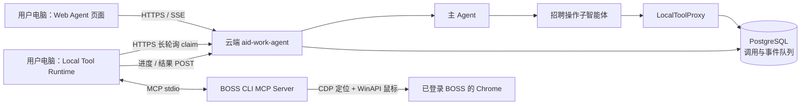
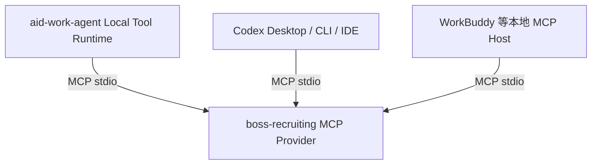

# 云端 Web Agent 调用本地 BOSS CLI：MVP 实现设计

> 状态：✅ MVP 架构与写动作授权规则已敲定
>
> MVP：云端 aid-work-agent 服务端 + 用户 Windows 电脑上的 Local Tool Runtime + 7 个已真机验证的 BOSS 操作
>
> 开发计划：[plan-recruiting-cli-agent-integration.md](../../plans/recruiting/plan-recruiting-cli-agent-integration.md)
>
> 上位规范：[第一方 CLI / MCP Provider 架构与开发规范](../../system/first-party-cli-mcp-provider-standard.md)
>
> MVP 后总体架构：[招聘 CLI 接入 Agent：MVP 后总体架构基线](recruiting-cli-agent-post-mvp-architecture.md)

## 1. 已确认的产品边界

1. Demo 时 aid-work-agent Python 服务端仍在服务器，不部署到用户电脑。
2. 用户通过浏览器使用 Web Agent，同一台用户电脑运行 BOSS CLI 和已登录 BOSS 的 Chrome。
3. 普通网页不能直接启动本机进程，因此必须安装一个轻量 Local Tool Runtime，主动与云端通信。
4. MVP 只接入已经使用 WinAPI 真机验证成功的 7 个操作：筛选、清筛选、页面跳转、打招呼、接收简历、拒绝当前候选人、面试填表演示。
5. 未成功的旧 `run` 以及实验性 `ask/chat/review/export/audit/probe` 从产品 CLI 和代码中删除，不做兼容。
6. MVP 不传画面、不控制远程桌面、不建设 VM。
7. BOSS CLI 同时是独立 MCP Provider，可被 Codex、WorkBuddy 等本地 MCP Host 直接使用，不绑定 aid-work-agent 云端服务。
8. BOSS 是项目级第一方 CLI 规范的首个 reference provider；以后所有第一方 CLI 复用同一架构和契约测试。
9. MVP 中用户当前 PC 就是第一台 Windows 执行节点；后续迁移到内网其他 PC/VM 或公网 Windows 主机时，复用同一 Runtime、CLI 和云端协议，不另建远程 CLI。

## 2. 为什么需要 Local Tool Runtime

“Web Agent”在技术上不是一个进程：

```text
浏览器中的 Web UI
        ↓ HTTPS/SSE
云端 Python Agent（LLM、工具选择、任务编排）
        ↓ 本地工具传输
用户电脑上的 CLI / 文件 / Chrome
```

浏览器安全沙箱不能任意执行 `boss-cli`、读取本地文件或启动 MCP 子进程。让网页调用 localhost 服务还会引入浏览器私网访问限制、CORS、页面关闭中断和恶意网页滥用等问题。因此本地能力由独立 Runtime 承担，浏览器只负责对话和展示状态。

## 3. MVP 总体架构



本地 Runtime 只主动访问云端 HTTPS，不监听公网端口，不要求端口映射。浏览器和 Runtime 不直接通信；它们通过同一个登录用户、租户和设备绑定在云端关联。

## 4. 面向未来客户端的统一工具执行模型

### 4.1 工具执行位置

所有工具增加平台侧元数据，但现有 `BaseTool` 默认保持服务端执行：

```python
class ExecutionTarget(str, Enum):
    SERVER = "server"
    LOCAL_REQUIRED = "local_required"
    EITHER = "either"
```

| 示例 | 执行位置 | 原因 |
|---|---|---|
| 读取用户电脑文件 | `LOCAL_REQUIRED` | 文件只存在本机 |
| 操作用户 Chrome/BOSS | `LOCAL_REQUIRED` | 依赖本机登录态和交互桌面 |
| 解析已经上传到服务器的 PDF | `SERVER` | 数据已在服务端，复用服务端算力和依赖 |
| 调用云端邮箱/API | `SERVER` | 不依赖本机状态 |
| 同时支持本地/服务端的通用工具 | `EITHER` | 必须按数据位置和策略显式选择，禁止失败后静默换位置 |

MVP 不改造全部服务端工具：现有工具默认 `SERVER`；只为 BOSS 创建 `LOCAL_REQUIRED` 的代理工具。这个模型以后可扩展本地文件、第三方 CLI 和 Desktop 能力。

这一分层与 Codex Desktop 的公开产品模式一致：官方文档明确区分仅桌面端可用的 local environment，并说明项目 action 在桌面应用的集成终端中执行。这里借鉴的是“客户端持有本地执行环境”的边界，不复制其私有协议实现。参考：[OpenAI Docs — Local environments](https://learn.chatgpt.com/docs/environments/local-environment)。

### 4.2 三层稳定边界

```text
Agent Tool Contract     稳定名称、schema、结果、权限
Execution Transport     server direct / MVP long-poll / future WSS
Local Provider          BOSS MCP / future third-party MCP / managed adapter
```

- 7 个 BOSS tool contract 不知道网络协议和桌面产品。
- Local Tool Runtime 不包含 Web/Electron UI，可作为独立进程运行。
- 未来 Agent Desktop 由 Electron main 启动同一个 Runtime 或复用其核心包，不重写 BOSS CLI。
- 第三方 CLI 接入不是 MVP，但必须通过 Provider adapter，不允许 Agent 下发任意 shell。

### 4.3 两种正式消费方式



两条链路共用完全相同的 7 个 tool schema：

- **自有生态**：云端 Agent 经 Local Tool Runtime 调用，获得设备绑定、租户权限、持久任务和 Web 进度。
- **外部生态**：Codex/WorkBuddy 直接创建本机 MCP 子进程，不经过云端、不要求注册 aid-work-agent 账号。

Local Tool Runtime 不能成为 BOSS CLI 的必需依赖。商业授权、升级和诊断可以作为外围能力，但 MCP server 在有效授权下必须能被标准 Host 独立启动。

## 5. 为什么 MVP 使用 HTTPS 长轮询而不是 WebSocket

现有项目的 WebSocket 连接注册表是进程内字典，代码已注明 Gunicorn 多 worker 之间不可见。Agent 请求落到 worker A、本地连接落到 worker B 时，直接内存转发会失败。

MVP 选择：

1. 云端先把 invocation 和 event 持久化到 PostgreSQL；
2. Runtime 通过 20 秒 HTTPS 长轮询主动领取；
3. Runtime 用普通 HTTPS POST 回传 started/progress/result；
4. Agent 等待时轮询数据库事件并转为现有 SSE；
5. 任一 HTTP worker 都能处理请求，无连接 owner 路由问题。

优点：不依赖 Redis、任务不因 worker 重启丢失、兼容企业代理、开发面小。Demo 单设备下端到端附加延迟目标 ≤1 秒。

未来需要大量在线客户端或画面流时，实现 `WebSocketLocalTransport` 替换 transport；数据库状态机、Local Provider 和 Agent tool contract 保持不变。本期不实现 WSS。

## 6. 本地设备绑定与认证

### 6.1 配对流程

1. 已登录 Web Agent 的用户在“本地工具”页面点击“添加本机”，服务端生成一次性 8 位配对码，5 分钟有效。
2. 用户在 Runtime 首次启动时输入配对码。
3. Runtime 生成 `device_id` 和 256-bit 随机设备密钥，通过 HTTPS 交换配对码。
4. 服务端把设备绑定到当前 `tenant_id + user_id`，只保存 token hash。
5. Runtime 使用 Windows DPAPI 保存设备 token；Node 侧通过受控 PowerShell/.NET helper 或未来 Desktop `safeStorage` 封装，禁止明文配置文件。

配对码单次使用、服务端只显示一次。设备解绑或 token 轮换后旧 token 立即失效。

### 6.2 授权边界

- 个人设备只能领取同一 `tenant_id + user_id + device_id` 的 invocation。
- 用户必须显式选定当前设备；MVP 一个用户最多一个在线 Runtime、一个活跃 BOSS 调用。
- Runtime 上报的能力不能直接成为 LLM tool schema；云端只接受代码库批准的 manifest 与客户端 capability 的交集。
- Web access token 不发送给 Runtime；设备 token 不能调用聊天、租户管理和其他业务 API。
- 外部写动作还必须满足 §14 的对话授权与单次上限；授权只对当前对话中明确表达的本次动作有效。

## 7. 云端数据模型

按项目数据库规范创建租户隔离表：

### 7.1 `local_tool_devices`

| 字段 | 说明 |
|---|---|
| `id` UUID PK | 设备 ID |
| `tenant_id`, `user_id` | 强制归属 |
| `name`, `platform`, `runtime_version` | 展示和兼容判断 |
| `token_hash`, `machine_fingerprint_hash` | 不保存明文 token/硬件信息 |
| `capabilities_json`, `manifest_digest` | 已安装 Provider 能力 |
| `status` | active/revoked |
| `last_seen_at`, `created_at`, `updated_at` | 在线与审计 |

### 7.2 `local_tool_pairing_tickets`

保存 code hash、tenant/user、过期时间、使用时间；配对成功后不可复用。

### 7.3 `local_tool_invocations`

| 字段 | 说明 |
|---|---|
| `id` UUID PK | 全链路 run_id |
| `tenant_id`, `user_id`, `device_id` | 强制路由边界 |
| `tool_name`, `arguments_json` | 只允许批准 schema |
| `state` | queued/claimed/running/succeeded/failed/cancel_requested/cancelled/unknown/expired |
| `effect` | none/applied/partial/unknown |
| `claim_token_hash`, `lease_expires_at` | 防止重复执行和过期 owner 回写 |
| `result_json`, `error_code`, `error_message` | 结构化终态 |
| `created_at`, `claimed_at`, `started_at`, `finished_at` | 追踪时序 |

### 7.4 `local_tool_events`

`invocation_id + seq` 唯一，保存 stage/current/total/脱敏 message。事件只用于进度展示，最终状态以 invocation 为准。

所有查询和更新必须同时带 `tenant_id`。claim 使用事务与 `FOR UPDATE SKIP LOCKED`，确保同一 invocation 只能被一个 Runtime 获得。

## 8. 云端模块与接口

### 8.1 模块

```text
src/local_tools/
├─ models.py               # Pydantic 协议模型
├─ repository.py           # device/invocation/event 数据访问
├─ pairing.py              # 配对码与设备 token
├─ catalog.py              # 云端受信 tool manifest
├─ router.py               # ExecutionTarget 路由
├─ local_proxy_tool.py     # BaseTool → invocation
├─ transport.py            # LocalExecutionTransport protocol
├─ long_poll_transport.py  # MVP 实现
└─ api.py                  # Web 用户 API + Runtime API
```

### 8.2 Web 用户 API

| API | 用途 |
|---|---|
| `POST /api/local-tools/pairing-tickets` | 创建一次性配对码 |
| `GET /api/local-tools/devices` | 查询当前用户设备和在线状态 |
| `POST /api/local-tools/devices/{id}/select` | 选定当前设备 |
| `DELETE /api/local-tools/devices/{id}` | 撤销设备 token |

### 8.3 Runtime API

| API | 用途 |
|---|---|
| `POST /api/local-tools/runtime/pair` | 配对并取得设备 token |
| `POST /api/local-tools/runtime/heartbeat` | 版本、能力和在线心跳 |
| `POST /api/local-tools/runtime/claim?wait=20` | 长轮询领取 invocation |
| `POST /api/local-tools/runtime/invocations/{id}/started` | 带 claim token 转 running |
| `POST /api/local-tools/runtime/invocations/{id}/progress` | 递增 seq 回传进度，同时取得 cancel 标志 |
| `POST /api/local-tools/runtime/invocations/{id}/result` | 一次性写入终态 |

Runtime API 使用设备 Bearer token；invocation 更新还必须携带一次性 claim token。参数和错误日志必须脱敏。

## 9. Local Tool Runtime

### 9.1 技术与目录

新增 `clients/agent-tool-runtime/`：

- Node.js 22 + TypeScript，与 BOSS CLI 运行时一致；
- 使用原生 `fetch` 调用 HTTPS API；
- 使用官方 MCP TypeScript client 通过 stdio 管理 Provider；
- MVP 以命令行进程随用户登录启动，不做 Windows 服务，因为 WinAPI 自动化必须处于未锁屏的交互用户会话；
- 提供 PowerShell 启动脚本和 doctor，不制作安装器。

```text
clients/agent-tool-runtime/src/
├─ config.ts
├─ credentials.ts         # DPAPI token store
├─ apiClient.ts
├─ pollLoop.ts
├─ invocationRunner.ts
├─ providerManager.ts
├─ manifestVerifier.ts
├─ progress.ts
└─ cli.ts                 # pair / start / doctor / status / unpair
```

### 9.2 Provider 管理

- Runtime 内置并批准 `boss-recruiting` manifest，固定 executable/entry/cwd/args。
- 不使用 shell；云端不能下发 executable、cwd、env 或额外 argv。
- `boss-cli mcp --stdio` 长驻运行，stdout 只承载 MCP；日志走 stderr 并脱敏。
- 同一 Provider 同时只执行一个 invocation。
- Runtime 退出时关闭 MCP stdin，限时回收子进程；不得遗留 Node/PowerShell 进程。

### 9.3 领取、租约与恢复

1. Runtime 心跳并长轮询 claim。
2. claim 返回 invocation、短期 claim token、lease deadline 和云端 manifest digest。
3. Runtime 本地核对工具名/schema/digest，然后标记 started。
4. 执行中每 2 秒或每个业务进度回传一次，服务端续租并返回是否取消。
5. 完成后提交结构化 result；同一 claim token 的重复 result 幂等返回原终态。

Runtime 在写动作开始后断线：本地继续完成当前原子动作和页面校验，恢复网络后回传；租约过期前不得由其他 Runtime 重新执行。无法证明效果时返回 `unknown`，云端禁止自动重试。

## 10. BOSS CLI 重构与清理

### 10.1 删除旧功能

删除 CLI 入口及其专用实现：

- `run`：旧自动筛选主流程未真机成功，写动作仍使用 CDP `Input.dispatchMouseEvent`；
- `ask`：CLI 内部 LLM 一次性实验；
- `chat`：CLI 内部 Agent/REPL 实验；
- `review/export/audit`：只服务于未成功的旧 run 数据链；
- `filter --probe`：调试探针，不属于产品能力。

删除前用 TypeScript import graph 和测试引用做清单；随之删除仅被这些入口使用的 workflow、screening、SQLite store、OCR、旧 CDP action、NL translator、ChatOrchestrator、报告/导出代码和无用依赖。共享于 7 个成功操作的 CDP gateway、DOMSnapshot、WinMouseClicker、FilterSetter 和各 executor 必须保留。

清理完成后 CLI usage、README、package scripts、package dependencies 和测试中不得再出现旧命令。用户工作区中未跟踪的 OCR 数据文件不由本任务删除。

### 10.2 7 个正式操作

| Tool | 作用 | 主要结果 | effect |
|---|---|---|---|
| `boss_filter` | 设置经验/学历/薪资筛选 | `filter_count`, `applied` | applied |
| `boss_clear_filter` | 清空筛选 | `filter_count=0` | applied |
| `boss_goto` | 跳推荐/沟通页 | `target`, `navigated` | none |
| `boss_greet` | 打招呼 | `greeted`, `reached_end` | applied/partial/unknown |
| `boss_accept_resume` | 同意接收附件简历 | `accepted`, `previewed` | applied/partial/unknown |
| `boss_reject_current` | 当前候选人标记不合适 | `rejected` | applied/unknown |
| `boss_interview_demo` | 填备注和日期后取消 | `remark`, `date`, `sent=false` | none |

### 10.3 共享 operation 与 MCP

```text
人工 CLI command ─┐
                  ├→ 结构化 operation → CDP 定位 + WinAPI 点击
MCP tool handler ─┘
```

operation 返回统一 `success/code/message/effect/data/retryable`，不直接 console/process.exit/stdin。人工 CLI renderer 输出文案；MCP 返回 `structuredContent`。MCP server 使用官方 SDK精确锁定版本，stdout 禁止任何日志。

错误码：`INVALID_ARGUMENT/CHROME_UNAVAILABLE/NOT_LOGGED_IN/WRONG_PAGE/BUSY/PAYWALL/UI_CHANGED/CANCELLED/EXECUTION_UNKNOWN/INTERNAL_ERROR`。

### 10.4 外部 MCP Host 兼容契约

发布入口固定为：

```text
boss-recruiting.exe mcp --stdio
boss-recruiting.exe doctor
boss-recruiting.exe <7 个保留的人工命令>
```

MCP 兼容要求：

- 只使用标准 initialize/list_tools/call_tool/progress/cancel，不定义 aid-work-agent 私有 MCP 方法；
- tool 名称、JSON Schema、错误码和 structured result 按语义化版本管理；同一 major 不做破坏性变化；
- server `instructions` 前 512 字符内写明：仅 Windows、必须已登录 BOSS、需要未锁屏交互桌面、操作期间不要使用鼠标、哪些工具有外部副作用和硬上限；
- 正确标注 read-only/destructive/idempotent/open-world 等 MCP tool annotations，但不能假设所有 Host 都会显示确认 UI；
- progress 是可选增强，Host 不处理 progress 时最终结果仍完整；
- stdout 只承载协议，stderr 日志默认脱敏；不输出广告、许可证提示或升级提示到 stdout；
- 无云端 token、数据库和 Local Tool Runtime 依赖；BOSS 登录态只来自用户本机 Chrome；
- manifest 内提供 server/tool version、平台、架构、schema digest 和最小 MCP protocol version。

Codex 可通过以下方式添加本地 Provider：

```powershell
codex mcp add boss-recruiting -- "C:\Program Files\BossRecruiting\boss-recruiting.exe" mcp --stdio
```

WorkBuddy 配置示例：

```json
{
  "mcpServers": {
    "boss-recruiting": {
      "type": "stdio",
      "command": "C:/Program Files/BossRecruiting/boss-recruiting.exe",
      "args": ["mcp", "--stdio"]
    }
  }
}
```

官方依据：Codex 官方文档明确支持由 command 启动的本地 stdio MCP server，并由桌面应用、CLI、IDE 扩展共享配置：[OpenAI Docs — MCP](https://developers.openai.com/codex/mcp)。WorkBuddy 公开文档/资料说明支持自定义本地 MCP server 配置；因其版本仍在快速变化，发布时必须对目标版本做实机 smoke test：[WorkBuddy MCP 配置](https://www.workbuddy.cn/docs/ide/User-guide/MCP)。

### 10.5 分发与商业化边界

MVP 开发包可使用 Node 运行时；对外试用/销售版本应提供签名的 Windows x64 自包含包，使用户无需安装 Node、PowerShell module 或源码。包中包含 MCP server、WinAPI helper、doctor、默认 manifest、许可证和卸载入口。

可形成三种商品形态，但不在本期实现计费系统：

1. 独立 BOSS MCP 工具：按席位/设备授权，面向 Codex、WorkBuddy 等用户；
2. aid-work-agent 招聘能力包：随 Local Tool Runtime 配对使用；
3. 企业版：内网部署、签名升级、审计、适配维护和技术支持。

商业层不得改变标准 MCP tool contract。许可证不可用时应在 initialize/doctor 阶段给出结构化、可读错误，禁止执行到写动作中途才拦截。

## 11. Agent 工具注册与调用

- 新增招聘操作子智能体，`tools.inherit=false`，只允许 7 个 `boss_*` proxy tool 和澄清能力。
- 主 Agent 和其他子智能体不获得 BOSS 工具。
- 工具 schema 来自云端代码库受信 manifest，不依赖设备临时上报。
- 仅当当前用户已绑定 active Windows Runtime，且 capability/digest 匹配时，招聘工具才标记 available。
- 工具执行创建 invocation；`LocalToolProxy` 读取 event 表并转为子智能体 progress；终态转换成普通 tool result。
- Agent 不关心 Runtime 使用长轮询、未来 WSS 还是 Desktop 内嵌进程。

组合规则：

```text
筛选并打招呼：boss_goto(recommend) → boss_filter → boss_greet
接收简历：boss_goto(chat) → boss_accept_resume
拒绝当前人选：boss_goto(chat) → boss_reject_current
面试演示：boss_goto(chat) → boss_interview_demo
```

设备离线、未登录、付费墙、UI 变化、unknown 均必须停止并向用户说明，禁止改用通用 browser tool 绕过。

## 12. 安全、隐私与运行约束

- BOSS 账号密码、验证码和 Cookie 始终只存在用户 Chrome；云端与 Runtime 均不采集。
- Windows 必须保持登录且未锁屏，Chrome 不最小化、不遮挡；演示期间用户不操作鼠标键盘。
- 云端只发送批准工具名和经过 schema 校验的参数，永不发送任意命令。
- 设备 token 使用 DPAPI；服务端只存 hash；全程 HTTPS。
- 进度和日志不上传简历正文、坐标、截图、CDP payload、环境变量、Cookie 或原始 stderr。
- 每次调用审计 `tenant/user/device/run_id/tool/normalized_args/state/effect/duration`。
- 一个设备同时只允许一个 BOSS invocation，第二个请求返回/等待 `BUSY`，不得争抢鼠标。

## 13. MVP 验收

### 13.1 自动化

- 删除旧命令后 TypeScript build、依赖检查和保留功能测试全绿；无死代码/死依赖。
- 7 个 operation 的结构化结果、错误、取消、unknown 和资源关闭测试。
- MCP initialize/list/call/progress/cancel、stdout 零污染测试。
- Codex 本地 stdio MCP 直连 smoke test；WorkBuddy 目标版本 stdio MCP 直连 smoke test。
- 配对码单次/过期、token hash、租户用户隔离、设备撤销测试。
- invocation claim 并发、租约、幂等终态、跨 worker 数据库可见性测试。
- Runtime 断网重连、进程退出、MCP 崩溃和无孤儿进程测试。
- 主 Agent/其他子智能体不可见 BOSS 工具，招聘子智能体能组合 7 个工具。

### 13.2 真机

1. 用户在 Web Agent 创建配对码，本机 Runtime 完成配对并显示在线。
2. “筛选本科以上、5 年以上经验，然后打招呼 3 人”。
3. “去沟通页接收 1 份简历，再把当前候选人标记不合适”。
4. “填写约面试备注并选择明天，但不要发送”。
5. Runtime 离线、Chrome 未启动、未登录、锁屏、BUSY、UI_CHANGED、断网和 unknown 正确停止/恢复。

完成标准：云端 Web Agent → 数据库 invocation → 本地 Runtime → MCP stdio → BOSS CLI → 本机 Chrome 全链路无需终端输入；进度回到 Web；没有旧实验命令、敏感信息泄漏和写动作盲重试。

同时完成外部生态门禁：不启动 aid-work-agent/Local Tool Runtime 时，Codex 和 WorkBuddy 均能独立发现 7 个工具、调用 doctor/只读导航，并在受控账号上完成一条有写动作的真机流程。

## 14. 已确定：写动作授权

用户在当前对话中明确说出动作和数量，即视为本次授权，不重复弹确认；描述模糊则必须澄清。授权不跨对话、不扩大到未明确的其他写动作。产品默认/单次上限：

- `boss_greet`：默认 1，单次最大 3；
- `boss_accept_resume`：默认 1，单次最大 1；
- `boss_reject_current`：每次固定 1；
- `boss_filter/clear_filter`：明确筛选要求即可执行；
- `boss_interview_demo`：不发送，不属于外部写动作。
