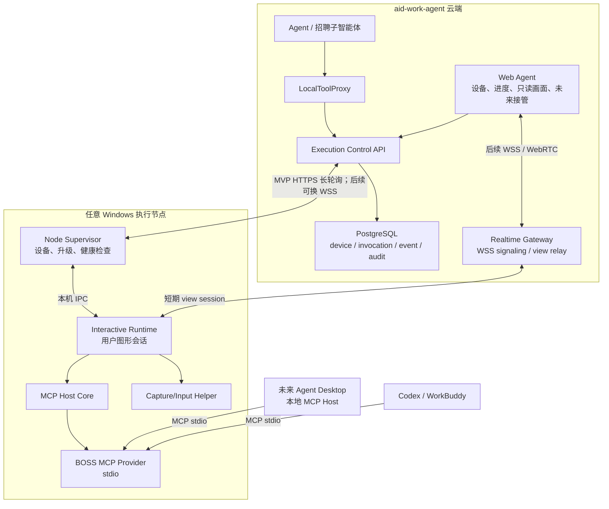

# 招聘 CLI 接入 Agent：MVP 后总体架构基线

> 状态：✅ 总体方向已保留；各后续阶段详细设计待 MVP 验收后展开
>
> 当前实现基线：[云端 Web Agent 调用本地 BOSS CLI：MVP 设计](recruiting-cli-agent-integration-design.md)
>
> Provider 上位规范：[第一方 CLI / MCP Provider 架构与开发规范](../../system/first-party-cli-mcp-provider-standard.md)
>
> 本文不是当前开发计划，不把 MVP 范围扩大到远程桌面、虚拟机或 Agent Desktop。

## 1. 为什么保留本文

MVP 验证的是“云端 Agent 能否通过 Runtime 完整调用安装在用户当前 PC 上的第一方 CLI”。后续不是重新设计一套远程 CLI，而是把 **同一套 Local Tool Runtime + 同一套 BOSS CLI** 安装到另一台 Windows 执行节点：

```text
MVP：云端 Agent → 用户当前 Windows PC → Runtime → BOSS CLI
后续：云端 Agent → 其他 Windows PC/VM → 同一 Runtime → 同一 BOSS CLI
```

执行节点可以位于客户内网或公网，物理机和虚拟机对云端协议没有区别。位置变化后主要补齐节点部署/分配、Windows 图形会话保障和画面回传，而不是改造 CLI 或 Agent Tool。系统还要支持：

- CLI 在用户当前电脑、客户内网专用 PC、客户虚拟化平台、客户云主机或厂商托管 Windows VM 上运行；
- 用户需要时在 Web Agent 中看到执行节点画面；
- 后续允许受控人工接管；
- 未来 Agent Desktop 像 Codex、WorkBuddy 一样直接使用第一方和第三方 MCP Provider；
- BOSS CLI 不因部署位置、通信方式或 Host 改变而重写。

这些方向不能散落在 MVP 的“不做”列表里。本文保留总体架构、边界和待验证问题，MVP 完成后以本文为入口继续深化。

## 2. 已确定的长期决策

1. **MVP 就是第一种远程节点拓扑**：服务端已经在云端，用户当前 PC 就是首台 Windows 执行节点；后续只替换节点所在机器。
2. **部署单元保持不变**：其他 PC/VM 安装与 MVP 相同的 Runtime 和 CLI，使用相同配对、manifest、invocation、result 和升级机制。
3. **Provider 不感知部署位置**：BOSS CLI 始终是本地 MCP stdio Provider，不直接连接 aid-work-agent 云端。
4. **Runtime 是执行节点代理**：负责云端连接、设备身份、任务租约、MCP Host、进度、画面和升级，不实现 BOSS 业务。
5. **Agent 只面向统一工具契约**：本机、内网 PC、云 VM 和 Desktop Host 不得形成不同的 BOSS Tool Schema。
6. **节点主动出站连接**：不要求客户开放入站端口，不要求公网 IP、端口映射或 VPN；内网与公网节点使用同一注册协议。
7. **个人电脑虚拟化不是前提**：不依赖 Hyper-V、Docker Desktop 或 macOS 本地 Windows VM。需要隔离时优先使用客户已有虚拟化平台、专用物理 PC、BYOC 或厂商托管 VM。
8. **Windows 图形会话是硬要求**：WinAPI 真鼠标、窗口截图和 Chrome 登录态必须位于已登录、未锁定的交互式 Windows 用户会话中，不能直接运行在 Windows Service 的 Session 0。
9. **控制面与画面面分离**：任务成功不依赖画面链路；画面断开不得令已授权任务变成重复执行。
10. **先观察、后接管**：先实现低帧率只读画面；远程键鼠和 WebRTC 在安全、审计与真机稳定性验证后再做。
11. **托管执行节点默认单租户隔离**：涉及招聘账号和登录态时，不在同一 Windows 用户会话中混跑多个租户。

## 3. 目标总体架构



云端维护业务状态和审计；执行节点拥有本地登录态、窗口和鼠标；Provider 只处理业务 operation。`LocalExecutionTransport` 隔离 Agent 与传输实现，后续增加 `WebSocketLocalTransport` 时不修改招聘子智能体和七个 Tool Schema。

## 4. 支持的部署形态

下表所有形态运行同一个 Runtime/CLI 发布物和协议；“本地”始终是相对于执行节点而言，不等于相对于使用 Web Agent 的浏览器。

| 形态 | 适用场景 | 节点要求 | 是否要求用户电脑虚拟化 |
|---|---|---|---|
| 用户当前 Windows PC | MVP/demo、个人使用 | 登录 Chrome，运行 Runtime | 否 |
| 客户内网专用 Windows PC | 不影响员工日常电脑 | 固定交互用户、稳定网络和显示会话 | 否 |
| 客户内网 Windows VM | 客户已有 VMware/Hyper-V/PVE 等平台 | VM 内保持可交互 Windows 会话 | 否 |
| 客户 BYOC Windows VM | 客户自有阿里云、腾讯云、Azure 等 | 固定出口、节点主动访问云端 | 否 |
| 厂商托管 Windows VM | 客户接受托管但要求隔离 | 一租户/账号一 VM 或等价强隔离 | 否 |
| Agent Desktop 所在电脑 | 未来客户端本地工具 | Desktop 内置 Host Core | 否 |

macOS 用户可继续使用 Web Agent；BOSS 执行节点可以是内网或云端的 Windows PC/VM，不要求在 Mac 上安装 Windows 虚拟机。

## 5. 四条协议通道

### 5.1 设备与控制通道

沿用 MVP 的配对、`device_id`、设备 token、capability manifest、heartbeat 和 revoke。节点只建立出站 HTTPS；设备身份绑定 `tenant_id + user_id/device assignment`。

### 5.2 工具执行通道

MVP 使用 PostgreSQL 持久 invocation/event 加 HTTPS 长轮询，已经解决了云端服务与一台外部 Windows PC 的网络通信。把 Runtime/CLI 从用户当前 PC 移到内网其他 PC/VM 或公网 Windows 主机时，控制协议不变；只需完成安装、设备配对/分配、网络出站检查和交互会话保障。

大量在线节点、低延迟取消或高频进度出现后，可增加 WSS transport：

- invocation、租约、幂等终态仍以 PostgreSQL 为事实源；
- WSS 只做低延迟通知和数据传输，不把内存连接当任务事实源；
- 多实例 Realtime Gateway 通过 session owner/sticky routing 管理连接；Redis 只保存短期 owner、presence 和通知，不转发大画面帧；
- WSS 失败时，工具控制面可回退 HTTPS claim/progress，不重复不可逆动作。

### 5.3 画面通道

第一阶段采用低帧率观察模式：

- Windows Graphics Capture（WGC）为首选；不支持或捕获失败时以 GDI 截图作为兼容回退；
- 目标为 BOSS Chrome 窗口或指定显示器，不默认采集全部桌面；
- 默认 1 FPS，活动时最高 3 FPS，缩放到最长边不超过 1280，使用 WebP/JPEG；
- 帧带 `view_session_id + seq + timestamp + dimensions`，只保留最新帧，拥塞时丢旧帧；
- 画面通过独立短期 WSS view session 传输，不写 invocation/event 表，不默认录屏；
- 只有用户主动打开画面且具有当前设备权限时才开始捕获。

低帧率方案用于“看见正在做什么”和故障诊断，不承诺流畅远程桌面。

### 5.4 人工输入通道

后续人工接管使用独立的短期 control session：

- 用户明确点击“接管”后，自动化先进入 `PAUSED_HUMAN`；
- Web 坐标按画面尺寸、DPI、窗口偏移和多显示器坐标转换后发送；
- 节点只接受鼠标、键盘和少量窗口控制白名单，不提供远程 shell；
- 每个输入事件带递增序号、短期票据和审计主体；敏感按键内容不进入 LLM 上下文；
- 用户“交还 Agent”后重新校验页面状态，不能盲目从中断的鼠标步骤继续。

当低帧率 WSS 无法满足交互体验时，再升级 WebRTC：Realtime Gateway 只做 signaling，公网复杂网络使用 TURN。WebRTC 是画面/输入 transport 升级，不改变 MCP Provider、invocation 状态机或 Agent Tool Schema。

## 6. Windows 执行节点进程模型

### 6.1 MVP

单个 Node 22 TypeScript Runtime 在当前登录用户会话中前台运行，同时承担云端连接和 MCP Host。

### 6.2 产品化节点

拆为两个进程：

1. **Node Supervisor**：可作为 Windows Service 运行，负责设备注册、更新、心跳、版本和启动用户会话 Worker；不做 UI 自动化。
2. **Interactive Runtime Worker**：运行于绑定的交互式用户会话，负责 MCP stdio、WinAPI、Chrome、截图和输入；与 Supervisor 通过受 ACL 保护的 Named Pipe 通信。

画面模块优先采用独立、签名的 .NET 8/WinRT helper 封装 WGC、DPI 和窗口枚举；Node Runtime 继续负责协议与 MCP Host。是否必须独立 helper，由 R1 技术 Spike 决定，不把捕获实现放入 BOSS Provider。

节点健康检查至少包含：

- 绑定用户是否已登录、会话是否 active/locked/disconnected；
- Chrome/CDP 端点和目标窗口是否存在；
- DPI、分辨率、活动显示器与鼠标占用；
- Provider/Runtime/manifest 版本是否兼容；
- 网络延迟、最后 heartbeat、执行队列和磁盘空间。

锁屏、无交互会话、窗口不可见或 RDP 会话状态异常时返回 `INTERACTIVE_SESSION_UNAVAILABLE`，不得继续盲点。

## 7. 状态、租约与幂等

MVP 的 `local_tool_devices`、pairing ticket、invocation 和 event 是后续事实模型，不因 transport 改写。后续只扩展：

- `node_assignment`：租户/用户/账号到节点的显式分配；
- `runtime_session`：连接实例、交互 Windows session、版本和 presence；
- `view_session`：短期观看/接管票据、观察者和到期时间；
- `node_lease`：节点离线、重启、升级和任务占用；
- `artifact/evidence reference`：仅保存用户授权的诊断截图引用，默认不保存连续画面。

规则保持不变：claim token 单次有效、lease 超时、终态 CAS、`invocation_id + event seq` 去重、unknown effect 不自动重试写动作、每个 BOSS Provider 串行占用鼠标。

## 8. 安全与隐私基线

- 节点 token 使用系统凭据存储；BOSS 账号密码/Cookie 不上传 aid-work-agent 云端；
- 云端只能调用签名 manifest 中批准的工具，不允许把任意命令或 MCP server 参数下发到节点；
- Runtime、Provider、capture helper 分别签名和校验版本；第三方 Provider 进入未来 Desktop 前单独授权；
- 画面票据单次、短 TTL、绑定用户/租户/设备/Origin，节点撤销后立即失效；
- 画面默认不持久化、不进入模型上下文、不用于训练；诊断截图需单独开关、脱敏和保留期限；
- 人工输入与 Agent 自动动作互斥；所有写动作继续执行 MVP 已确定的对话授权和数量上限；
- 厂商托管节点默认一租户一 Windows VM/账号会话，网络出口、磁盘和凭据隔离；
- 不实现验证码破解、风控绕过、登录态导出或跨租户账号复用。

## 9. 与 Agent Desktop 和第三方生态的关系

Agent Desktop 是另一种本地 MCP Host，而不是 BOSS CLI 的新版本：

- Desktop 与 Web Local Tool Runtime 复用 Host Core、manifest、结果、取消、授权和 conformance tests；
- Desktop 本地调用可直接走 stdio，不必绕云端；需要云端 Agent 编排时再使用统一 execution transport；
- 第一方和第三方 Provider 共用 Host 生命周期，差异只在签名、信任、安装和更新来源；
- Codex/WorkBuddy 仍能绕过 aid-work-agent 独立启动 BOSS Provider；
- 任何后续功能不得要求 BOSS operation 再实现一遍 HTTP、Desktop 私有 RPC 或远程专用 Schema。

## 10. MVP 后演进路线

以下仅固定依赖关系，不是当前开发计划：

| 阶段 | 深化主题 | 前置门禁 | 主要产物 |
|---|---|---|---|
| M0 | 当前 Web Agent + 用户 PC + 7 操作 | 已敲定 | 证明 Agent→Runtime→MCP→CLI 全链路 |
| R1 | 将 MVP 执行节点迁移到其他 Windows PC/VM | M0 真机稳定 | 复用同一 Runtime/CLI；补安装/升级、节点分配、会话守护和低帧率只读画面 |
| R2 | 实时通道与人工接管 | R1 画面及安全验收 | WSS Gateway、control session；必要时 WebRTC/TURN |
| R3 | 企业部署 | R1 运维指标稳定 | 客户内网/BYOC/厂商托管、节点池、租户隔离和 SLA |
| D1 | Agent Desktop MCP Host | 第一方 Provider 规范通过 | 第一方/第三方 CLI 的统一 Desktop Host |
| E1 | Provider 商业生态 | BOSS reference provider 稳定 | SDK、模板、签名分发、授权计费、兼容认证 |

R1、D1 可以按业务优先级并行，不能互相绑定；用户不安装 Desktop 也能使用 Web Agent + 独立执行节点。

## 11. MVP 后必须先做的技术 Spike

1. WGC 在物理机、VM、RDP active/disconnected、锁屏、最小化和多显示器下的真实画面矩阵。
2. GDI fallback 在 GPU/Canvas Chrome 窗口下是否黑屏、遮挡或丢帧。
3. DPI 100%/125%/150%、多显示器负坐标下画面坐标到 WinAPI 输入的映射。
4. RDP 断开后 Chrome、WGC 和 WinAPI 是否仍处于可用交互桌面；不同 Windows/云厂商镜像分别验证。
5. WSS 经过现有网关、反向代理和多 Gunicorn worker 时的 session owner、重连与背压。
6. WebRTC 只有在 WSS 低帧率接管体验不足时再做 TURN 成本和企业网络穿透 Spike。
7. Windows 自动登录/会话保活与企业安全策略的冲突，形成客户部署前置检查，而不是默认关闭锁屏安全。
8. BOSS 对云数据中心 IP、VM 环境、异地登录的风控表现；不能把技术可连通等同于账号可稳定使用。
9. 安装包签名、静默更新失败回滚、Runtime 与 Provider 独立版本兼容矩阵。

## 12. 后续深化时仍需决定

| 问题 | 当前默认方向 | 何时敲定 |
|---|---|---|
| R1 是否直接引入 WSS | 控制面继续 HTTPS，画面单独 WSS | M0 延迟和 R1 画面 Spike 后 |
| 截图 helper 技术栈 | .NET 8/WinRT WGC，GDI fallback | WGC Spike 后 |
| 用户能否从 Web 远程输入 | R1 只读，R2 显式接管 | 安全评审与坐标矩阵通过后 |
| 是否使用 WebRTC | WSS 低帧率优先 | R2 体验数据证明需要后 |
| 厂商托管还是客户 BYOC 优先 | 客户内网专用节点/BYOC 优先 | 首批客户合规访谈后 |
| VM 隔离粒度 | 默认一租户一 VM/账号会话 | 成本与账号风控实测后 |
| 画面留存 | 默认零留存 | 客户审计需求明确后 |

## 13. 参考依据

- [Microsoft Learn：Windows.Graphics.Capture 屏幕捕获](https://learn.microsoft.com/en-us/windows/uwp/audio-video-camera/screen-capture)
- [Microsoft Learn：Windows Service 不能直接与用户交互](https://learn.microsoft.com/en-us/windows/win32/services/interactive-services)
- [Microsoft Learn：RDS 会话锁定与断开排查](https://learn.microsoft.com/en-us/troubleshoot/windows-server/remote/troubleshoot-unexpected-rds-session-locks-or-disconnections)
