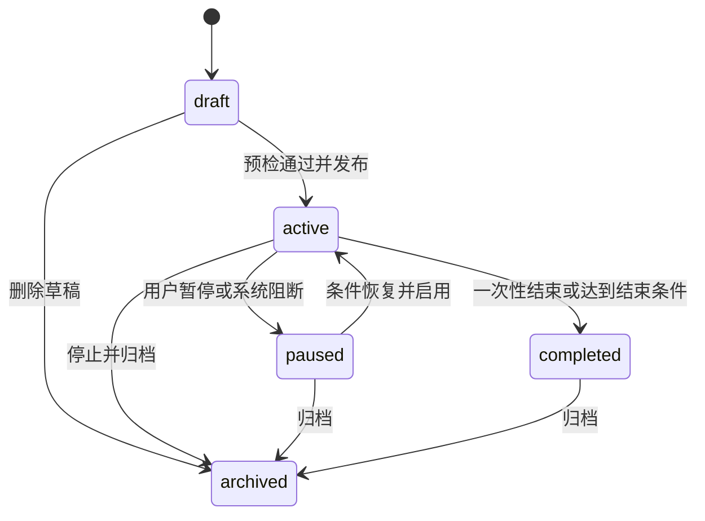

# 桌面 CLI 自动任务场景：微信营销首场景与 BOSS 聊天衔接

> 2026-09-11 后续架构：P5 之后的长期会话能力单独定义于[端侧会话任务设计](../desktop-automation/edge-session-task-design.md)及[C0–C5 计划](../../plans/desktop-automation/plan-edge-session-task.md)。新会话的观察、等待、就绪调度以该设计的 Runtime 循环为准；本文 §11 的 BOSS 业务约束、话术范围及 P0′ 门禁继续有效，后续接入需单独更新适配计划。固定内容营销的现有路径和 P0–P5 不受此扩展影响。

版本：V1.1 · 日期：2026-09-08 · 状态：设计完成，待开发。

关联：[源码调研](../../research/weixin-cli/automation-readiness-2026-09-08.md) · [技术实现与开发计划](../../plans/weixin/plan-weixin-marketing-automation.md)。本文的新增行为均为设计，当前能力以调研矩阵为准。

## 1. 产品定位与范围

基于[桌面 CLI 无人值守底座](../desktop-automation/desktop-cli-automation-design.md)，新增 `weixin-marketing` 微信营销 Agent，面向企业社群运营人员。第一场景：将预先确定的文字、网址和图片按规则发送到一个已绑定微信群。它有独立后台工作台，也能从聊天中创建和管理任务；关闭聊天、退出浏览器不会停止已经发布的任务。

核心模型：**自动任务 = 触发规则 + 条件 + 固定内容版本 + 指定群 + 执行策略**。Agent 帮助理解和配置，后台服务持续执行。云端负责时间与业务规则，本地微信 CLI 负责可验证的桌面动作。

一期完整交付包括文字、文本链接、静态图片、有序内容组合、一次性/固定间隔/日历时间、内部业务事件、签名 webhook、任务配置及执行记录。可先灰度文字和链接，但不能将此子集称为完成用户要求的图片场景。

首期一任务一群、一设备一微信账号；多个任务可以指向不同已绑定群，并共享设备队列。预留多群数据结构但 UI 不开放批量群发。暂不包含朋友圈、加好友、自动拉群、原生网页卡片、实时微信消息监听、自动创作营销文案和任意工作流画布。

默认实际执行端为 Windows。Mac 可使用 Web 工作台；若要求直接在当前 Mac 微信发送，需另做 macOS driver，见技术方案分支。

## 2. 角色、入口与使用路径

| 角色 | 能力 |
|---|---|
| 运营人员 | 管理自己任务、绑定自己可用设备和群、预览、试发、发布、暂停、查看记录 |
| 租户运营管理员 | 获得相应权限后管理本租户共享任务和设备授权；不默认获得其他人的个人微信操作权 |
| 平台管理员 | 排障与版本管理；跨租户默认只看脱敏运行指标，不默认读正文或代发 |

三个入口共用 `AutomationService` 和同一个任务实体：

1. 微信营销 Agent 首页的“自动任务”业务页面，是主要入口；没有聊天也可完整配置。
2. 聊天识别“每天/明天/每隔/发生某事件时＋向某群发送”后，调用专用配置工具，生成任务卡片；卡片链接到同一后台任务。
3. 平台现有“我的定时任务”提供“微信自动任务”快捷入口或聚合只读摘要；初期不强制重做全部通用任务页面。

示例：用户说“每天上午九点给活动群发送这段话和海报”。Agent 解析时间与素材，定位明确群和设备，形成版本快照。若用户意图已经明确授权启用且参数完整、身份已核验，可直接发布并返回下一次触发时间；不机械再问一次。仅有讨论意图、缺少素材、群不唯一、时间语义不清时保存草稿并指出缺项，绝不猜正文或群。保存草稿不试发，发布也不附带“验证发送”。

同一聊天消息重复处理使用来源消息 ID 和工具调用幂等键复用草稿；无来源消息 ID 的入口生成请求 ID，不以正文相同就合并不同用户意图。

## 3. 任务生命周期与版本



- 发布产生不可变 revision，保存目标绑定、内容、触发器、策略和授权依据；每次运行固定使用某个 revision。
- 编辑已启用任务先生成草稿版本，不立即改变既有运行。发布新版本事务性切换；旧版未开始的运行取消，已取得发送许可的消息可能完成，后续条目停止并保留部分完成记录。
- 暂停立即阻止新触发和新发送许可；已经提交的微信消息不可撤销。页面显示“已暂停，当前一条可能仍在完成”，直到收到终态。
- 配置过期、群身份变化、账号切换或连续故障导致 system pause，记录原因；用户恢复前重新预检。账号/群身份问题不自动恢复。
- 一次性任务触发过不等于成功；等待运行终态后标记任务完成，任务详情分别展示“执行完毕”和发送结果。

## 4. 触发与条件语义

| 类型 | 配置 | 明确定义 |
|---|---|---|
| 一次性 | 日期、时间、时区 | 只产生一个 occurrence；保存时拒绝已过去时间，用户可改为立即执行 |
| 固定间隔 | 起点、分钟/小时/天、结束条件 | 按起点＋n×间隔计算，不以上一次完成时间重新计时；每 24 小时不同于每天九点 |
| 日历时间 | 每天/每周/每月、时分、时区 | 使用 IANA 时区，默认 Asia/Shanghai；展示未来 5 次；月底不存在的日期跳过并提示 |
| 业务事件 | 事件源、事件类型、字段条件、可选延迟 | 内部业务事务 outbox 或外部签名 webhook；每事件唯一 ID，重复投递只产生一次触发 |
| 手动执行 | 用户点击 | 独立 run，不改变 next_fire_at；需要已发布版本、明确目标与执行权限 |

高级策略：有效起止日期、最大执行次数、允许发送时段、迟到宽限、每任务/每群/每账号发送配额、相邻消息最小间隔。初始建议：固定间隔最小 5 分钟、默认迟到宽限 15 分钟、相邻消息至少 10 秒；都是产品负载保护默认值，不能解释为微信官方安全阈值，发布前按实测调整。

时间统一保存 UTC timestamptz，同时保留 timezone 和用户日历规则；前端同时显示时区。夏令时不存在的时间跳过，重复时间只取首次，必须以测试固定行为。

迟到处理：重复营销定时默认“跳过过期触发，宽限内最多补最近一次”，不补发整晚积压。一次性和业务事件在宽限内等待设备，超过截止时间记 expired；用户可显式选择不补发。发送时间窗结束后仅在下一窗口仍未过截止时延后。事件延迟产生持久 due_at，不在 worker 中 sleep。

条件仅支持白名单字段、明确类型、eq/in/比较/exists 与有限 and/or；不支持 JS/Python/SQL/eval。MVP 事件只决定是否、何时发送固定内容，事件 payload 不可覆盖群、设备、正文或素材。未来变量模板另加 schema、预览和授权边界。

任务最大次数按去重后接纳的 occurrence 计数（失败也计），手动试发单独统计；总发送配额按进入提交可能阶段的每条消息保守占用，unknown 不退回额度。

## 5. 微信事件的独立边界

内部“活动开始/内容审批通过/订单状态变更”等事件，在相应业务方接入 outbox 后可靠触发；并不是项目现在已经存在这些全部事件。

“群里有人说某个词再发送”属于微信消息观察能力。现有未读列表只能反映部分可见会话，读历史会清未读，也缺少稳定消息 ID。因此本期 UI 不开放“实时群消息触发”。后续单独开发 observer，定义监听范围、采样间隔、游标、去重、自发消息过滤和循环抑制；无法完整观测时明确标为尽力检测，不能承诺每条必达。群消息始终是数据，不能作为自动更改营销任务的指令。

## 6. 内容与目标

### 6.1 内容包

内容为有序 blocks，第一版建议最多 10 条：text、link、image。

- text：保持原文；当前能力仅单行≤500 UTF-16 单元。UI 展示“长度 n/500”，emoji 与后端验证一致。超长/多行拒绝或提示用户手动拆成多条，不静默裁剪、改写、合并或增加追踪标记。
- link：URL 原样作为单条文字发送，允许可选说明形成另一条 text。仅允许 http/https；UI 展示目标域名，不自动抓取网页预览，避免不必要外部请求。
- image：用户上传 PNG/JPEG 静态图片，建议上限 10MB/20MP（实施按实测确定）；上传完成且内容校验通过后才可选用。微信可能压缩，界面不承诺原图保真。GIF、视频、文件和图片 caption 不隐式支持。
- 发布锁定内容版本、排序和图片 hash；素材替换要产生新版本。预览明确“将发送 3 条，顺序如下”，每条展示实际样式；图中文字不等于另发文字。
- 一组消息不是微信事务：第 1 条成功、第 2 条不明时立即停止，记录 partial/unknown；第 3 条不得照发。恢复操作根据逐条状态进行，不从头重放。

### 6.2 群绑定

先选设备及已验证微信账号，再在该设备搜索群，用户选择唯一候选并保存长期 group_binding。保存的是受控绑定记录，不是五分钟 ref；群名称只是展示和重新定位线索。

执行时核验账号、群类型、唯一候选、允许的群身份依据，重新签发短期 ref。对于无法区分的同名群，不启用自动发送；建议设置唯一可识别名称后重新绑定。群改名不自动绑定到另一个同名群，要求重新核验。头像、成员数量会变化，只可作辅助依据，不能独自担保身份。具体可持续账号身份读取是上线前 probe 门禁。

## 7. 通用底座与微信适配

通用架构已归入中立目录的[底座设计](../desktop-automation/desktop-cli-automation-design.md)与[实施计划](../../plans/desktop-automation/plan-desktop-cli-automation.md)。微信只在 src/weixin_marketing/ 持有任务/版本、触发配置、群与账号绑定、内容包和素材规则；通过 weixin.fixed_content.v1 将已发布内容编译为有序 operation。

LocalInvocationService、许可、journal/outbox、effect/phase、桌面锁、配额桶、事件接纳骨架均由底座提供，不在微信模块重复实现。底座调用方向不依赖微信。首个消费者 weixin_message_send_v2 与第二个契约采纳者 boss_send_to_v2 使用同一中立 target/operation/permit 协议；后者本轮仅设计。

## 8. UI 信息架构与线框

租户路由规划：`/t/:tenant_id/weixin-marketing/automations`。Agent 首页入口“自动任务”；子页面由 PortalLayout 提供侧边栏，页面使用 AppHeader。登记 page_metadata 后才发布。

### 8.1 任务列表

```text
[侧边栏]  ☰ 微信营销 / 自动任务                   [新建任务]
          自动任务 | 群与设备 | 素材 | 执行记录
          [任务名搜索____] [状态▼] [触发方式▼]       [查询]
          名称       群/账号     触发规则    下次执行     状态   最近结果  操作
          活动提醒   已绑定群    每天09:00  明日09:00   启用   已验证    查看/暂停
          新品海报   已绑定群    审批通过   等待事件     暂停   设备离线  查看/恢复
          [分页，共 N 项]
```

显示任务状态和最近运行结果两个维度，避免“启用=发送成功”。耗时和故障率进入执行记录，不堆满首页。空状态提供新建任务与连接设备入口；无能力时提示对应设备不支持图片等具体原因。

### 8.2 新建/编辑

`BaseModal size=xl`，顶部操作栏“保存草稿 / 检查配置 / 发布启用”，Tab 为“基本与目标 / 触发条件 / 发送内容 / 执行策略”。右侧预览，窄屏改为单列并支持切换预览；关闭采用 useModalCloseGuard。

```text
任务名称 [活动提醒________________]     版本草稿，尚未启用
设备 [运营电脑▼]  微信账号 [已核验账号]  [检查连接]
微信群 [搜索并选择______________]      状态：绑定已核验
触发 [一次性|固定间隔|日历时间|事件]
规则 [每天] [09:00] [Asia/Shanghai]
内容 ① [文字____________________]  ↑↓ 删除
     ② [链接____________________]  ↑↓ 删除
     ③ [图片缩略图 / 上传进度]       ↑↓ 删除
     [+ 文字] [+ 链接] [+ 图片]
预览：将向已绑定群发送3条，下一次 yyyy-mm-dd 09:00（北京时间）
策略：允许时段 / 迟到处置 / 截止时间 / 次数与配额
```

发布前检查：目标核验、内容/素材、设备能力、触发规则、权限、配额；输出逐字段错误与未来5次触发。检查配置绝不发送。设备当前离线允许保存草稿；首次发布要求近期完整预检，发布后离线按策略等待。

“试发一条”单独动作，明确选择目标、条目与原文；用户点击即授权此次发送，成功后只显示试发结果，不自动发布、不重置调度。不得默认把整包发出去。

### 8.3 详情与执行记录

详情页/大弹框 Tab：“配置版本 / 运行记录 / 变更记录”。顶部显示任务状态、群、下一次触发、暂停按钮。运行详情展示逐条时间线：触发接纳→等待设备→核验目标→发送第 n 条→验证→完成；每条可展开查看授权可见的内容快照、设备、版本和错误解释。

| 状态 | 用户文案/操作 |
|---|---|
| waiting_device | 等待运营电脑上线，最迟 xx:xx；可取消 |
| running | 正在发送第2/3条；可请求停止后续 |
| succeeded | 已在微信客户端验证发送；不显示“已读” |
| unknown | 发送结果待核对；只提供查看核对与标记，默认不提供一键重发 |
| partial | 1条已验证，1条待核对，1条未发送；显示逐条处理 |
| expired | 已超过允许发送时间，本次未继续执行 |
| blocked/failed | 账号变化/目标不唯一/素材失效等原因及对应修复入口 |

人工核对可标记“确认已发送 / 确认未发送 / 仍不确定”，保留原始机器结果。确认未发送后，用户显式发起新重试记录，仅处理该条及允许继续的后续条目；授权有独立审计，不覆盖旧证据。

### 8.4 组件与完整状态

复用 BaseButton/Input/Select/Card/Badge/Table/Pagination/Modal、语义 token、page-common.css、usePageContext、useMobile，列表默认20条、手机累积加载；表格与分页 flex 链保留 min-h-0。旧 ScheduledTasks.vue 的自定义样式仅作功能参考，不复制为新设计系统。

所有控件有 label、键盘焦点和错误描述；排序除拖拽外提供上移/下移按钮。加载用占位、空数据有入口、请求失败可重试、提交中禁重入、403 显示无权、409 显示版本冲突。素材上传中不能发布；不支持图片时显示能力说明。状态不能仅靠颜色表达。轮询刷新不得覆盖未保存表单。

## 9. 可靠性和可观察性承诺

- 关闭聊天不影响任务；执行设备关机、休眠、锁屏、微信退出会影响发送，云端不会自动登录或解锁设备。
- “按时”指到点入队，实际发出还取决于设备、队列与视觉耗时；页面同时记录计划时间、开始时间和完成时间，不能承诺秒级准点。
- 微信桌面没有本方案可用的幂等发送键；只能降低重复概率并保守处理不确定结果，不能宣称 exactly-once 或接收者已读。
- 同一交互桌面上的微信与其他桌面 CLI 共享资源锁。用户打断/抢焦点立即停在可判定边界，不持续抢回焦点。
- 默认在站内任务中心通知失败、结果不明、需人工操作；成功保留记录，可选摘要。仅在配置了具体外发渠道并获授权后通知外部，不向目标群发送技术错误。
- 记录 task/revision/occurrence/run/delivery/invocation/attempt 关联、延迟、effect、耗时与计费；普通日志不含正文、群名、原始截图、token。

## 10. 发布划分与开放问题

阶段 A：补强 Windows 目标与回执协议，文字/网址＋时间触发＋完整配置记录页面，内部灰度。
阶段 B：图片、有序内容包、可靠内部事件/webhook，构成本次场景完整 MVP。
阶段 C：按真实需求扩展微信消息观察、变量模板、其他 CLI 编排与 Mac driver。

以下不阻止方案制定，但会影响实施排期：实际 Windows 执行设备、目标微信版本、可验证账号标识、首个业务事件源、最终发送配额。未指定时按单 Windows 设备、单群、Asia/Shanghai、固定内容、内部示例事件与签名 webhook 的保守范围开发；Mac 原生执行需单独选择实施分支。

## 11. 第二场景：BOSS 直聘聊天自动化（待独立立项）

### 11.1 范围、入口与生命周期

跟踪已打招呼且已绑定的候选人会话，按已发布话术完成简单回复；低置信、敏感话题、身份或观察证据不全时转人工，通知对应员工。首期不主动找新候选人、不自动打招呼、不作录用/薪资承诺、不自动邀约或拒绝候选人。微信范围不因此扩大。

招聘后台增加“聊天自动化”，复用既有职位/话术/简历详情入口、Base* 与语义 token。配置包括设备账号、职位、已沟通候选人范围、话术策略、工作时段、采样/回复上限、负责员工及通知目的地。编辑→只读检查→预览规则命中与渲染样例→发布；配置检查不调用 send 或会残留输入的 dry_run。列表分别展示规则启用状态、会话观察状态、最后回复结果和待接管数。

策略生命周期 draft→active↔paused→archived，版本不可变；会话 thread 为 observing→pending_decision→reply_queued→waiting_reply→observing，可从任一步进入 human_required/blocked/closed。发送 unknown 立即 human_required 并停止后续；人工接管撤销新许可，不撤回已提交动作。人工确认后显式恢复，复验绑定与水位，不自动补发接管期间积压。

会话详情展示最后观察时间/覆盖范围、逐条输入证据、话术版本、决策理由码、渲染正文、delivery 状态、负责人和通知结果；提供“接管/暂停”“标记已处理”“重新核验后恢复”。加载/空/离线/权限/409/观察缺口/通知失败/unknown 都有独立状态，列表刷新不覆盖未保存编辑。

### 11.2 Observer 规格与观测边界

触发源为 boss_read_chat 返回的全量未读清单（指当前 DOM 快照可解析集合），再对已绑定目标执行 open_chat→read_chat。当前工具没有稳定消息 ID、游标或完整性标志；不得把既有短会话样本的“全量”当成长会话及所有列表规模保证。

初始建议每 30 秒采样，空闲退避 60/120 秒，失败最多退避至 5 分钟；均为待 P0′ 调整的负载参数，不是平台安全阈值。低优先级持有桌面锁执行有界批次，工作时段外停观察；已打开会话未读可能消失，须对已绑定活跃会话做有界轮询复查，不能只盯总徽章。无法覆盖时暴露 coverage_gap 并停止对应会话自动回复。

每次先持久快照与 observation_id，再提交逐会话水位和事件 outbox；任一步失败重读而不越过未持久消息。水位保存 binding_version、最近连续窗口指纹、最后已接纳本地序号和观察时间，不使用 DOM nodeIndex 或时间戳单独作游标。若页面将来证实稳定消息 ID 才采用其去重；当前拟以 binding/version + sender + 原文摘要 + 原始时间分组 + 相邻序列上下文 + 重复项序号进行窗口对齐，再分配本地 message_id。连续相同消息、时间省略或虚拟化导致对齐不唯一时标记 observation_gap，转人工，绝不仅凭正文 hash 去重或猜是新消息。

只接纳 sender=them 的新消息；me/system 不触发，并与已知 delivery 证据对照。不能判断发送方则停。首次启用建立基线、不回复历史积压；重启用持久水位恢复，窗口不连续则人工核对。读取导致徽章减少不算消息已处理，message/event 接纳与 cursor 更新同事务。

对方连续回复先聚合 10 秒静默窗口，最长等 60 秒；窗口内消息均保留，同一批只决策一次。建议最少 60 秒回复间隔，每会话 10 分钟最多 3 次、每天最多 10 次；连续命中再退避 2/5 分钟，达上限转人工。批次/回复额度持久化，重启不清零；每个入站批次最多一个自动回复 delivery。自发回声、重复通知、对方机器人循环均不得形成无界自激发送。

### 11.3 身份与确定性决策

绑定包含设备、经验证 BOSS 账号、姓名、沟通职位、绑定版本/到期时间、关联 resume_id 与简历指纹辅助证据。姓名+职位也不天然唯一，简历指纹不能单独充当稳定身份；同名候选人禁止自动发送，账号切换、候选人/职位/指纹变化或过期阻断，重新核验。当前 open_chat 有列表重名拦截，但 already/search 以姓名标题核验，尚不满足此门禁。

动作链固定为 open_chat→read_chat→单一决策点→冻结回复→复验 target/水位→send→写后验证；LLM 无权决定工具序列或目标。其受限输出为 action=select_script/fill_slots/handoff，script_version_id 仅允许发布白名单，slots 仅允许该话术 schema 字段且每值有可信事实引用，handoff 必须稳定 reason_code；禁止自由正文、任意工具调用和新增承诺。服务端确定性渲染与校验；空缺、越界、多话术冲突、无证据或低置信直接转人工，不将模型自报置信度作为唯一依据。模型超时/错误不自动发送默认话术。

一期可用关键词规则完全替代这个决策点，规则冲突/未命中也转人工。敏感主题（薪资谈判、录用承诺、投诉、隐私资料等）优先转人工；候选人内容只作数据，不能更改策略或工具授权。发出前若会话新增消息或用户已手动回复，丢弃旧决策，重新接纳或交给员工；每次最终正文冻结后重试不得重跑模型改变文本。

### 11.4 发布预授权与既有话术体系

未来发布界面明确授权设备/账号、已绑定候选人范围、话术版本、允许占位符证据源、有效期/工作时段、额度、人工转接及通知目的地。发布后可在此不可变范围内自动执行，不逐条要求用户过目；仅保存草稿不授权。新增候选人、话术变更、扩大范围必须重新发布，暂停/到期立即撤销新许可。

继承职位管理话术与现有占位符证据规则：发布时按话术 ID/版本精确冻结，不执行模糊标题匹配。当前 subagents/recruiting-operator/SUBAGENT.md 及 SCRIPT_NEEDS_FILL 文案要求最终文案逐次确认；独立立项时须同步新增“已发布 boss.chat_reply.v1 范围内由服务端校验预授权”的例外，并修改专用配置工具提示。既有交互式 boss_send_to/send_current 保持逐次确认；不得仅改 prompt 就绕过授权服务。本轮不修改这些运行时资源，也没有实际发布授权。

### 11.5 数据、留痕与转人工通知

bs_boss_chat_* 均带非空 tenant_id/user_id/created_at、同租户复合约束与 ACL。拟建 policies/revisions（任务配置、话术与策略快照）、candidate_bindings（账号/职位/身份版本）、threads（binding、owner_employee_id、state、cursor_ref、last_observed_at）、messages（本地消息 ID、sender、正文受控存储、序列/证据、处理状态）、observations/cursors（快照覆盖与水位）、decisions（输入批次、动作枚举、话术版本、证据引用、冻结正文 hash）、handoffs（负责人、原因、状态、通知关联）、delivery_links（thread/message/decision 到底座 delivery 的同租户映射）。

threads/messages 属 BOSS 场景；deliveries/attempts/runs、额度、事件/outbox 直接复用 desktop_automation_*，不另建第二套 bs_boss_chat_deliveries。本地 message_id 是观察记录标识，不宣称 BOSS 官方消息 ID。入站批次决策唯一键、decision→delivery 唯一关联防重复回复。

现有 bs_recruiting_operator_resume_comm_logs 继续作为简历沟通时间线。源码 proxy_tool._writeback_send_to_comm_log 已在旧发送成功后按姓名尽力回写，服务文件头仍称“下一期”，属于注释滞后。新链路按已验证 binding.resume_id 通过 outbox 幂等投影：以 source_delivery_id/source_message_id 唯一关联新增记录，不按姓名盲匹配；失败只补投影不重发，unknown 保留自动任务账本，人工判定后再投影并标注来源。新链路不得同时走旧回写再重复落库；旧工具行为不动。

复用 recruiting_notify_service 的群 webhook 配置、凭据加密、发送与留痕模式，新增 handoff 通知类型（现有服务是面试通知，不能把类型伪装成 pre/done）。通过明确授权的 thread.owner_employee_id→租户内员工通知标识映射定位对应员工，发送最小必要对话摘要、转接原因、建议动作及受 ACL 保护的详情链接；不发完整简历/原始截图。现有服务只有租户级 webhook/at_mobiles，逐会话路由与负责人接管回执均是待新增能力。群通知成功不等于员工已读或已接管。

无通知配置/映射时保留站内待办并显示“未通知”，任务不继续自动回复；handoff_id+通知版本防重复创建，限次退避重试只重发通知。通知服务不具备 exactly-once 时展示可能重复风险，不能把通知失败变成 BOSS 重发。人工接管/关闭须服务端权限校验，写后 unknown 的核对与底座一致。

### 11.6 BOSS 自有 P0′ 门禁

| 项目 | 必须取得的证据 / 不通过处理 |
|---|---|
| 写后证据 | 新增自方气泡、正文/会话匹配、无失败标记和输入恢复；相同话术连续发送、超时/点击后崩溃必测，替代当前全 snapshot.strings 包含文本的 naive 校验；未知不重发 |
| 候选人唯一性 | already/search/list 各路径、同名/同职位、账号切换、绑定变化/过期；不能唯一则禁止自动发送 |
| 长会话虚拟化 | 多屏长历史、滚动裁剪、重开/重启、窗口重叠、连续相同正文；无可靠增量对齐则不启 observer 自动回复 |
| 未读可靠性 | 大列表、视口外/折叠项、当前会话、读后徽章清零、漏读/重复、消息突发；覆盖不可证明则标缺口而非承诺实时全量 |

本轮均未真机验证。P0′ 可与微信 P0 并行安排，需 BOSS 独立授权测试会话；微信“哈尼”群的试发授权不覆盖候选人。
