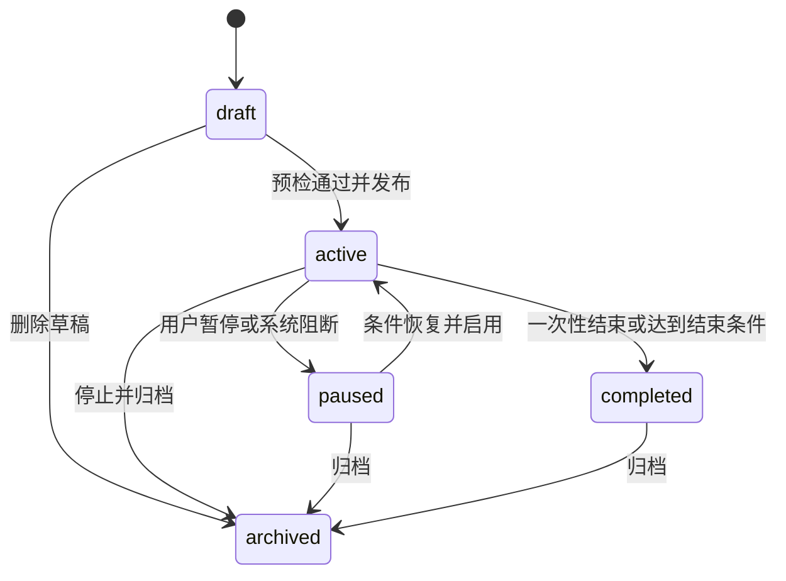
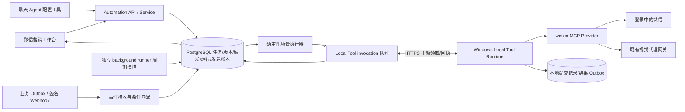

# 微信营销 Agent：后台自动发送产品与架构设计

版本：V1.0 · 日期：2026-09-08 · 状态：设计完成，待开发。

关联：[源码调研](../../research/weixin-cli/automation-readiness-2026-09-08.md) · [技术实现与开发计划](../../plans/weixin/plan-weixin-marketing-automation.md)。本文的新增行为均为设计，当前能力以调研矩阵为准。

## 1. 产品定位与范围

新增 `weixin-marketing` 微信营销 Agent，面向企业社群运营人员。第一场景：将预先确定的文字、网址和图片按规则发送到一个已绑定微信群。它有独立后台工作台，也能从聊天中创建和管理任务；关闭聊天、退出浏览器不会停止已经发布的任务。

核心模型：**自动任务 = 触发规则 + 条件 + 固定内容版本 + 指定群 + 执行策略**。Agent 帮助理解和配置，后台服务持续执行。云端负责时间与业务规则，本地微信 CLI 负责可验证的桌面动作。

一期完整交付包括文字、文本链接、静态图片、有序内容组合、一次性/固定间隔/日历时间、内部业务事件、签名 webhook、任务配置及执行记录。可先灰度文字和链接，但不能将此子集称为完成用户要求的图片场景。

首期一任务一群、一设备一微信账号；多个任务可以指向不同已绑定群，并共享设备队列。预留多群数据结构但 UI 不开放批量群发。暂不包含朋友圈、加好友、自动拉群、原生网页卡片、实时微信消息监听、自动创作营销文案和任意工作流画布。

默认实际执行端为 Windows。Mac 可使用 Web 工作台；若要求直接在当前 Mac 微信发送，需另做 macOS driver，见技术方案分支。

## 2. 角色、入口与使用路径

| 角色 | 能力 |
|---|---|
| 运营人员 | 管理自己任务、绑定自己可用设备和群、预览、试发、发布、暂停、查看记录 |
| 租户运营管理员 | 获得相应权限后管理本租户共享任务和设备授权；不默认获得其他人的个人微信操作权 |
| 平台管理员 | 排障与版本管理；跨租户默认只看脱敏运行指标，不默认读正文或代发 |

三个入口共用 `AutomationService` 和同一个任务实体：

1. 微信营销 Agent 首页的“自动任务”业务页面，是主要入口；没有聊天也可完整配置。
2. 聊天识别“每天/明天/每隔/发生某事件时＋向某群发送”后，调用专用配置工具，生成任务卡片；卡片链接到同一后台任务。
3. 平台现有“我的定时任务”提供“微信自动任务”快捷入口或聚合只读摘要；初期不强制重做全部通用任务页面。

示例：用户说“每天上午九点给活动群发送这段话和海报”。Agent 解析时间与素材，定位明确群和设备，形成版本快照。若用户意图已经明确授权启用且参数完整、身份已核验，可直接发布并返回下一次触发时间；不机械再问一次。仅有讨论意图、缺少素材、群不唯一、时间语义不清时保存草稿并指出缺项，绝不猜正文或群。保存草稿不试发，发布也不附带“验证发送”。

同一聊天消息重复处理使用来源消息 ID 和工具调用幂等键复用草稿；无来源消息 ID 的入口生成请求 ID，不以正文相同就合并不同用户意图。

## 3. 任务生命周期与版本



- 发布产生不可变 revision，保存目标绑定、内容、触发器、策略和授权依据；每次运行固定使用某个 revision。
- 编辑已启用任务先生成草稿版本，不立即改变既有运行。发布新版本事务性切换；旧版未开始的运行取消，已取得发送许可的消息可能完成，后续条目停止并保留部分完成记录。
- 暂停立即阻止新触发和新发送许可；已经提交的微信消息不可撤销。页面显示“已暂停，当前一条可能仍在完成”，直到收到终态。
- 配置过期、群身份变化、账号切换或连续故障导致 system pause，记录原因；用户恢复前重新预检。账号/群身份问题不自动恢复。
- 一次性任务触发过不等于成功；等待运行终态后标记任务完成，任务详情分别展示“执行完毕”和发送结果。

## 4. 触发与条件语义

| 类型 | 配置 | 明确定义 |
|---|---|---|
| 一次性 | 日期、时间、时区 | 只产生一个 occurrence；保存时拒绝已过去时间，用户可改为立即执行 |
| 固定间隔 | 起点、分钟/小时/天、结束条件 | 按起点＋n×间隔计算，不以上一次完成时间重新计时；每 24 小时不同于每天九点 |
| 日历时间 | 每天/每周/每月、时分、时区 | 使用 IANA 时区，默认 Asia/Shanghai；展示未来 5 次；月底不存在的日期跳过并提示 |
| 业务事件 | 事件源、事件类型、字段条件、可选延迟 | 内部业务事务 outbox 或外部签名 webhook；每事件唯一 ID，重复投递只产生一次触发 |
| 手动执行 | 用户点击 | 独立 run，不改变 next_fire_at；需要已发布版本、明确目标与执行权限 |

高级策略：有效起止日期、最大执行次数、允许发送时段、迟到宽限、每任务/每群/每账号发送配额、相邻消息最小间隔。初始建议：固定间隔最小 5 分钟、默认迟到宽限 15 分钟、相邻消息至少 10 秒；都是产品负载保护默认值，不能解释为微信官方安全阈值，发布前按实测调整。

时间统一保存 UTC timestamptz，同时保留 timezone 和用户日历规则；前端同时显示时区。夏令时不存在的时间跳过，重复时间只取首次，必须以测试固定行为。

迟到处理：重复营销定时默认“跳过过期触发，宽限内最多补最近一次”，不补发整晚积压。一次性和业务事件在宽限内等待设备，超过截止时间记 expired；用户可显式选择不补发。发送时间窗结束后仅在下一窗口仍未过截止时延后。事件延迟产生持久 due_at，不在 worker 中 sleep。

条件仅支持白名单字段、明确类型、eq/in/比较/exists 与有限 and/or；不支持 JS/Python/SQL/eval。MVP 事件只决定是否、何时发送固定内容，事件 payload 不可覆盖群、设备、正文或素材。未来变量模板另加 schema、预览和授权边界。

任务最大次数按去重后接纳的 occurrence 计数（失败也计），手动试发单独统计；总发送配额按进入提交可能阶段的每条消息保守占用，unknown 不退回额度。

## 5. 微信事件的独立边界

内部“活动开始/内容审批通过/订单状态变更”等事件，在相应业务方接入 outbox 后可靠触发；并不是项目现在已经存在这些全部事件。

“群里有人说某个词再发送”属于微信消息观察能力。现有未读列表只能反映部分可见会话，读历史会清未读，也缺少稳定消息 ID。因此本期 UI 不开放“实时群消息触发”。后续单独开发 observer，定义监听范围、采样间隔、游标、去重、自发消息过滤和循环抑制；无法完整观测时明确标为尽力检测，不能承诺每条必达。群消息始终是数据，不能作为自动更改营销任务的指令。

## 6. 内容与目标

### 6.1 内容包

内容为有序 blocks，第一版建议最多 10 条：text、link、image。

- text：保持原文；当前能力仅单行≤500 UTF-16 单元。UI 展示“长度 n/500”，emoji 与后端验证一致。超长/多行拒绝或提示用户手动拆成多条，不静默裁剪、改写、合并或增加追踪标记。
- link：URL 原样作为单条文字发送，允许可选说明形成另一条 text。仅允许 http/https；UI 展示目标域名，不自动抓取网页预览，避免不必要外部请求。
- image：用户上传 PNG/JPEG 静态图片，建议上限 10MB/20MP（实施按实测确定）；上传完成且内容校验通过后才可选用。微信可能压缩，界面不承诺原图保真。GIF、视频、文件和图片 caption 不隐式支持。
- 发布锁定内容版本、排序和图片 hash；素材替换要产生新版本。预览明确“将发送 3 条，顺序如下”，每条展示实际样式；图中文字不等于另发文字。
- 一组消息不是微信事务：第 1 条成功、第 2 条不明时立即停止，记录 partial/unknown；第 3 条不得照发。恢复操作根据逐条状态进行，不从头重放。

### 6.2 群绑定

先选设备及已验证微信账号，再在该设备搜索群，用户选择唯一候选并保存长期 group_binding。保存的是受控绑定记录，不是五分钟 ref；群名称只是展示和重新定位线索。

执行时核验账号、群类型、唯一候选、允许的群身份依据，重新签发短期 ref。对于无法区分的同名群，不启用自动发送；建议设置唯一可识别名称后重新绑定。群改名不自动绑定到另一个同名群，要求重新核验。头像、成员数量会变化，只可作辅助依据，不能独自担保身份。具体可持续账号身份读取是上线前 probe 门禁。

## 7. 架构



复用 `background_runner`、APScheduler 作为唤醒器，PostgreSQL 作为权威队列与运行事实，Local Tool Runtime 作为本地执行通道。首期无需 Kafka、Celery 或 Temporal，也不把定时器放浏览器。

新增业务模块 `src/weixin_marketing/`，固定 executor `weixin.fixed_content.v1`。不把自然语言 prompt、任意 CLI 字符串或任意脚本当执行计划。

通用 CLI 仍只承担微信操作；业务时间规则、群配额、授权、计费策略在服务层。Local Runtime 的 Provider 注册与持久回执属于通用底座改造，避免复制一整套微信专属 Runtime。

多 CLI 串联未来采用带类型的 operation 输入输出（例如内容产出→审核→冻结素材→微信发送），每步有 effect、超时和恢复政策；当前先实现一条固定、有序链，不做无界循环、动态 shell 或 LLM 临时决定下一步。

## 8. UI 信息架构与线框

租户路由规划：`/t/:tenant_id/weixin-marketing/automations`。Agent 首页入口“自动任务”；子页面由 PortalLayout 提供侧边栏，页面使用 AppHeader。登记 page_metadata 后才发布。

### 8.1 任务列表

```text
[侧边栏]  ☰ 微信营销 / 自动任务                   [新建任务]
          自动任务 | 群与设备 | 素材 | 执行记录
          [任务名搜索____] [状态▼] [触发方式▼]       [查询]
          名称       群/账号     触发规则    下次执行     状态   最近结果  操作
          活动提醒   已绑定群    每天09:00  明日09:00   启用   已验证    查看/暂停
          新品海报   已绑定群    审批通过   等待事件     暂停   设备离线  查看/恢复
          [分页，共 N 项]
```

显示任务状态和最近运行结果两个维度，避免“启用=发送成功”。耗时和故障率进入执行记录，不堆满首页。空状态提供新建任务与连接设备入口；无能力时提示对应设备不支持图片等具体原因。

### 8.2 新建/编辑

`BaseModal size=xl`，顶部操作栏“保存草稿 / 检查配置 / 发布启用”，Tab 为“基本与目标 / 触发条件 / 发送内容 / 执行策略”。右侧预览，窄屏改为单列并支持切换预览；关闭采用 useModalCloseGuard。

```text
任务名称 [活动提醒________________]     版本草稿，尚未启用
设备 [运营电脑▼]  微信账号 [已核验账号]  [检查连接]
微信群 [搜索并选择______________]      状态：绑定已核验
触发 [一次性|固定间隔|日历时间|事件]
规则 [每天] [09:00] [Asia/Shanghai]
内容 ① [文字____________________]  ↑↓ 删除
     ② [链接____________________]  ↑↓ 删除
     ③ [图片缩略图 / 上传进度]       ↑↓ 删除
     [+ 文字] [+ 链接] [+ 图片]
预览：将向已绑定群发送3条，下一次 yyyy-mm-dd 09:00（北京时间）
策略：允许时段 / 迟到处置 / 截止时间 / 次数与配额
```

发布前检查：目标核验、内容/素材、设备能力、触发规则、权限、配额；输出逐字段错误与未来5次触发。检查配置绝不发送。设备当前离线允许保存草稿；首次发布要求近期完整预检，发布后离线按策略等待。

“试发一条”单独动作，明确选择目标、条目与原文；用户点击即授权此次发送，成功后只显示试发结果，不自动发布、不重置调度。不得默认把整包发出去。

### 8.3 详情与执行记录

详情页/大弹框 Tab：“配置版本 / 运行记录 / 变更记录”。顶部显示任务状态、群、下一次触发、暂停按钮。运行详情展示逐条时间线：触发接纳→等待设备→核验目标→发送第 n 条→验证→完成；每条可展开查看授权可见的内容快照、设备、版本和错误解释。

| 状态 | 用户文案/操作 |
|---|---|
| waiting_device | 等待运营电脑上线，最迟 xx:xx；可取消 |
| running | 正在发送第2/3条；可请求停止后续 |
| succeeded | 已在微信客户端验证发送；不显示“已读” |
| unknown | 发送结果待核对；只提供查看核对与标记，默认不提供一键重发 |
| partial | 1条已验证，1条待核对，1条未发送；显示逐条处理 |
| expired | 已超过允许发送时间，本次未继续执行 |
| blocked/failed | 账号变化/目标不唯一/素材失效等原因及对应修复入口 |

人工核对可标记“确认已发送 / 确认未发送 / 仍不确定”，保留原始机器结果。确认未发送后，用户显式发起新重试记录，仅处理该条及允许继续的后续条目；授权有独立审计，不覆盖旧证据。

### 8.4 组件与完整状态

复用 BaseButton/Input/Select/Card/Badge/Table/Pagination/Modal、语义 token、page-common.css、usePageContext、useMobile，列表默认20条、手机累积加载；表格与分页 flex 链保留 min-h-0。旧 ScheduledTasks.vue 的自定义样式仅作功能参考，不复制为新设计系统。

所有控件有 label、键盘焦点和错误描述；排序除拖拽外提供上移/下移按钮。加载用占位、空数据有入口、请求失败可重试、提交中禁重入、403 显示无权、409 显示版本冲突。素材上传中不能发布；不支持图片时显示能力说明。状态不能仅靠颜色表达。轮询刷新不得覆盖未保存表单。

## 9. 可靠性和可观察性承诺

- 关闭聊天不影响任务；执行设备关机、休眠、锁屏、微信退出会影响发送，云端不会自动登录或解锁设备。
- “按时”指到点入队，实际发出还取决于设备、队列与视觉耗时；页面同时记录计划时间、开始时间和完成时间，不能承诺秒级准点。
- 微信桌面没有本方案可用的幂等发送键；只能降低重复概率并保守处理不确定结果，不能宣称 exactly-once 或接收者已读。
- 同一交互桌面上的微信与其他桌面 CLI 共享资源锁。用户打断/抢焦点立即停在可判定边界，不持续抢回焦点。
- 默认在站内任务中心通知失败、结果不明、需人工操作；成功保留记录，可选摘要。仅在配置了具体外发渠道并获授权后通知外部，不向目标群发送技术错误。
- 记录 task/revision/occurrence/run/delivery/invocation/attempt 关联、延迟、effect、耗时与计费；普通日志不含正文、群名、原始截图、token。

## 10. 发布划分与开放问题

阶段 A：补强 Windows 目标与回执协议，文字/网址＋时间触发＋完整配置记录页面，内部灰度。
阶段 B：图片、有序内容包、可靠内部事件/webhook，构成本次场景完整 MVP。
阶段 C：按真实需求扩展微信消息观察、变量模板、其他 CLI 编排与 Mac driver。

以下不阻止方案制定，但会影响实施排期：实际 Windows 执行设备、目标微信版本、可验证账号标识、首个业务事件源、最终发送配额。未指定时按单 Windows 设备、单群、Asia/Shanghai、固定内容、内部示例事件与签名 webhook 的保守范围开发；Mac 原生执行需单独选择实施分支。
