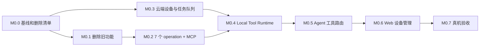

# 云端 Web Agent 调用本地 BOSS CLI：MVP 开发计划

> 关联设计：[recruiting-cli-agent-integration-design.md](../../design/recruiting/recruiting-cli-agent-integration-design.md)
>
> 本期范围：云端 Agent、本地 Tool Runtime、7 个成功 BOSS 操作、旧实验代码删除，以及 Codex/WorkBuddy 标准 MCP 直连验证。
>
> 状态：✅ MVP 技术路线与授权规则已确定，可启动开发
>
> 上位规范：[第一方 CLI / MCP Provider 架构与开发规范](../../system/first-party-cli-mcp-provider-standard.md)
>
> 后续演进仅登记、不在本计划实施：[MVP 后总体架构基线](../../design/recruiting/recruiting-cli-agent-post-mvp-architecture.md)

## 0. 完成定义

```text
云端 Web Agent
  → LocalToolProxy
  → PostgreSQL invocation/event
  → 本地 Tool Runtime 主动 HTTPS 领取
  → MCP stdio
  → 7 个 BOSS operation
  → 用户电脑已登录 Chrome
```

不包含：旧 run/ask/chat/review/export/audit/probe、画面传输、VM、远程桌面、WSS、Redis 路由、正式安装器、Agent Desktop UI、第三方 CLI。包含 BOSS CLI 作为第一方独立 MCP Provider 的外部 Host 兼容验证。

## 1. 实施顺序



每个编码阶段执行 `.claude/rules/dev_workflow.md` 的开发 → 独立测试 → Code Review；不自动提交。

## M0.0 基线与删除清单 ⬜

- 将设计 §14 已确定的写动作授权规则固化为 Agent 路由、参数校验和测试用例。
- 固定受控 BOSS 账号、写动作测试额度、Windows/Node/Chrome 环境。
- 记录 BOSS CLI 和后端当前测试基线。
- 用 TypeScript import graph 列出旧命令的专用模块、测试、依赖和数据文件。
- 标注共享模块，禁止误删 7 个成功操作依赖的 CDP/DOMSnapshot/WinAPI 代码。
- 将项目级第一方 CLI 规范作为 Code Review 检查表；BOSS 是首个 reference provider。

**验收**：形成逐文件删除清单；用户未跟踪文件和无关工作区改动不在删除范围。

## M0.1 删除旧失败流程和实验代码 ⬜

**删除入口**

- `run`
- `ask`
- `chat`
- `review`
- `export`
- `audit`
- `filter --probe`

**级联清理**

- 删除只服务旧 run 的 workflow、screening、SQLite store、OCR、PageActionExecutor、job config、stdin 控制、报告/导出/审计代码。
- 删除只服务 ask/chat 的 NL translator、ChatOrchestrator 和内部 LLM 适配。
- 删除对应测试、文档说明、scripts 和无用 npm dependencies。
- 更新 CLI usage/README，只保留 7 个正式操作和 MCP 入口。

**门禁**

- `rg` 不再发现旧命令入口和旧流程引用。
- TypeScript build、依赖检查、保留测试全绿。
- 7 个成功操作的真机底层实现没有算法性改写。

## M0.2 结构化 operation 与 BOSS MCP ⬜

- 抽取 7 个结构化 operation，加入 progress、AbortSignal、effect 和统一错误码。
- 人工 CLI commands 改为薄 renderer，保持 7 个命令可独立运行。
- 新增 `boss-cli mcp --stdio` 和受信 manifest。
- 固定独立产品入口 `boss-recruiting.exe mcp --stdio`；MVP 开发态可由 Node entry 等价代替，对外发布阶段再制作自包含签名包。
- stdout 只允许 MCP JSON-RPC；日志走 stderr。
- Provider 单飞锁、取消、unknown 和安全关闭。
- server instructions、tool annotations、schema digest、语义化版本和外部 Host 使用文档。
- 抽取可复用 Provider conformance suite，后续第一方 CLI 不从零搭建协议测试。

**测试**

- operation 成功/失败/部分执行/取消/unknown。
- MCP initialize/list/call/progress/cancel 和 schema digest。
- stdout 零污染、并发 BUSY、写动作不自动重放。
- 不启动 aid-work-agent 时，使用 Codex 配置直接发现并调用 7 个工具。
- 使用 WorkBuddy 目标版本 `mcp.json` 直接发现并调用 7 个工具；记录版本和差异。

**验收**：MCP Inspector/官方 client 可调用全部 7 个 fake operation；人工 CLI 回归通过；Codex/WorkBuddy 不依赖自有云端即可直连。

## M0.3 云端本地工具基础设施 ⬜

**数据库**

- 新建 `local_tool_devices`、`local_tool_pairing_tickets`、`local_tool_invocations`、`local_tool_events`。
- 所有表、唯一约束、索引和查询满足 tenant/user 隔离规范。
- claim 使用事务和 `FOR UPDATE SKIP LOCKED`；终态幂等。

**后端模块/API**

- 新建 `src/local_tools/` 的 models/repository/pairing/catalog/router/proxy/transport/API。
- 实现 Web 配对/设备 API 和 Runtime heartbeat/claim/started/progress/result API。
- 设备 token 仅存 hash，claim token 限定单次 invocation。
- MVP transport 为 PostgreSQL + HTTPS 长轮询，不实现 WSS/Redis。

**测试**

- 配对码过期/单次、设备撤销、token 隔离。
- 多 Runtime 并发 claim、租约、断线、取消、重复 result。
- 多进程模拟下任一 worker 都能读取相同任务状态。

## M0.4 Local Tool Runtime ⬜

- 新建 `clients/agent-tool-runtime/`，Node 22 + TypeScript。
- 实现 `pair/start/status/doctor/unpair`。
- 设备 token 使用 Windows DPAPI 保存；日志不得输出 token。
- HTTPS 长轮询领取任务，2 秒 heartbeat/progress 续租，断线指数退避。
- 内置 `boss-recruiting` Provider manifest，使用 MCP stdio 启动 BOSS CLI。
- 禁止 shell和云端自定义 executable/cwd/env/argv。
- 当前登录用户会话运行；检测锁屏/不可交互桌面时拒绝写动作。

**测试**

- fake cloud + fake MCP 的完整协议测试。
- token 存储、manifest mismatch、网络中断、取消、MCP 崩溃、Runtime 退出。
- 进程清理测试确认无遗留 Node/PowerShell 子进程。

**验收**：开发机输入一次配对码后可持续在线并执行 fake tool；重启后无需重新配对。

## M0.5 Agent 工具执行位置与招聘子智能体 ⬜

- 增加 `ExecutionTarget` 元数据；现有工具默认 SERVER。
- 实现 `LocalToolProxy`，7 个 BOSS 工具为 LOCAL_REQUIRED。
- 新增招聘操作子智能体，只允许 7 个工具和澄清。
- 工具 schema 取云端受信 manifest；设备 capability 只决定 available，不定义 schema。
- invocation events 映射到子智能体进度和现有 Web SSE。
- 设备离线、未登录、UI 变化、unknown 时停止，禁止通用 browser tool 绕过。

**测试**

- 服务端工具继续本地执行于服务器，无回归。
- 主 Agent/其他子智能体看不到 BOSS 工具。
- 招聘子智能体能按设计组合三条业务链路。
- Runtime 离线时给出连接本机的明确引导。

## M0.6 Web 本地工具设备管理 ⬜

- 增加最小“本地工具”入口：创建配对码、设备列表、在线/离线、选定、解绑。
- 对话触发本地工具但设备不可用时展示可操作提示。
- 不在网页中调用 localhost、不暴露设备 token、CLI 路径和原始 capability payload。

**验收**：用户只通过 Web 页面和 Runtime CLI 即可完成配对、查看状态和解绑。

## M0.7 真机端到端与交付 ⬜

**成功链路**

1. Web 生成配对码 → 本机 Runtime 配对上线。
2. 筛选本科以上、5 年以上经验 → 打招呼 3 人。
3. 去沟通页 → 接收 1 份简历 → 当前候选人标记不合适。
4. 填写面试备注和明天日期 → 取消，确认未发送。
5. 关闭 aid-work-agent/Local Tool Runtime，Codex 直连 BOSS MCP 完成导航 + 一个受控写动作。
6. WorkBuddy 直连 BOSS MCP 完成工具发现 + 一条受控操作；若产品版本存在兼容差异，修复标准协议问题并记录版本。

**失败与恢复**

- Runtime 离线/解绑；Chrome 未启动/未登录；Windows 锁屏；第二任务 BUSY；UI_CHANGED；执行中断网；写动作 unknown。

**最终门禁**

- 云端 Agent 到本机 Chrome 全链路无需人工输入 CLI 命令。
- 进度实时回到 Web，附加延迟目标 ≤1 秒。
- 写动作数量和页面结果一致，unknown 不重试。
- 旧命令、专用代码和无用依赖已经删除。
- Codex/WorkBuddy 能把 BOSS CLI 当作独立标准 MCP Provider 使用，不依赖自有云端账号。
- 无明文 token、敏感日志、孤儿进程、跨租户/用户领取。
- `docs/ideas.md` 更新为实际状态；只宣布“云端 Web Agent 调本地 CLI MVP 完成”。
