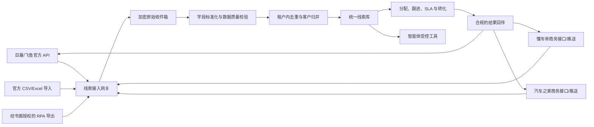

# 懂车帝与汽车之家客户留资统一接入智能体可行性调研

> 调研日期：2026-07-13  
> 调研范围：懂车帝、汽车之家账号下的购车咨询、询价、试驾等客户留资，统一接入企业智能体  
> 文档性质：前期可行性研究，不是接口承诺或最终技术设计  
> 结论有效期建议：3 个月；平台接口、协议和商务政策变化后应重新核验

## 1. 执行摘要

### 1.1 核心结论

1. **不能把“有平台账号”直接等同于“有留资 API 权限”。** 两个平台均有企业或开发者能力，但公开能力、商务私有能力、账号后台能力是三套不同边界。
2. **懂车帝存在一条确定的官方 API 路径，但只适用于特定来源。** 如果相关线索实际进入巨量引擎广告账户或飞鱼 CRM，可通过巨量引擎商业开放平台的“飞鱼线索管理”能力，在完成开发者注册、应用审核、账户授权和权限申请后获取线索列表。该结论不能自动外推到懂车帝卖车通、懂车云店、经销商 CPS 等后台线索。
3. **懂车帝经销商生态线索可能支持商务定向 API 对接，但没有发现面向普通账号公开、自助开通的留资读取文档。** 懂车帝官方商业材料明确提到在线索链路中通过“API 对接、卖车通打通”等方式提升转化，说明官方存在合作对接能力；具体开放对象、数据范围、费用和协议需由账号商务经理确认。
4. **汽车之家公开提供 MCP/API 能力，但当前公开 MCP 工具不包含“读取经销商已有留资”。** 公开工具覆盖车系参配、价格、经销商、试驾预约等；“预约试驾”是产生服务请求，不是查询车商后台的历史或增量线索。
5. **没有找到汽车之家面向普通经销商账号公开、自助申请的留资拉取 API 文档。** 汽车之家的询价隐私政策证明平台会向相关经销商、厂商及集团共享询价所需个人信息，但经销商侧如何系统化接收，公开资料未给出 API 契约。应优先向汽车之家客户经理申请集团/经销商 CRM 对接、线索推送、数据订阅或文件交付能力。
6. **不建议直接爬取或逆向后台接口。** 懂车帝企业开放平台协议明确禁止机器人、蜘蛛、爬虫或其他自动方式访问或登录；汽车之家用户协议也禁止未经授权通过机器人、蜘蛛等程序操作。未经书面许可的 RPA、Cookie 复用、抓包重放和私有接口调用存在封号、数据合规、稳定性和法律风险。

### 1.2 推荐决策

采用“**官方 API / 官方推送优先，官方导出过渡，书面授权 RPA 兜底**”的分阶段策略：

| 优先级 | 获取方式 | 推荐度 | 适用条件 |
|---|---|---:|---|
| P0 | 官方 API、Webhook、SFTP 或厂商 CRM 推送 | 强烈推荐 | 平台书面授权并提供正式文档、测试账号和数据处理条款 |
| P1 | 巨量引擎/飞鱼 Marketing API | 推荐 | 懂车帝相关线索确实落入已授权的广告账户/飞鱼 CRM |
| P1 | 平台后台官方 Excel/CSV 导出后导入 | 推荐作为过渡 | 账号后台存在导出功能且合同允许在自有系统中处理 |
| P2 | 平台官方邮件通知、定时报表或加密文件投递 | 条件推荐 | 通知含完整、稳定的线索标识和必要字段 |
| P3 | 书面授权的浏览器 RPA，仅操作官方导出 | 谨慎兜底 | 无 API、业务必须自动化、平台书面许可、专用账号和风控方案齐备 |
| 禁止 | DOM 爬取、抓包逆向、Cookie/Token 长期复用、调用未公开私有接口 | 不采用 | 高封号、高合规、高维护风险 |

短期最现实的落地组合是：

- 懂车帝广告/飞鱼线索：官方 API 增量同步；
- 懂车帝经销商后台与汽车之家：先确认商务接口；确认期内用官方导出文件进入统一导入通道；
- 智能体只访问统一线索库，不直接持有平台账号密码，也不直接登录两家后台。

## 2. 调研问题与口径

本次“留资”指用户主动提交并由企业账号合法接收的线索，例如：

- 姓名或称呼；
- 手机号或平台保护号码；
- 城市、所在区域；
- 意向品牌、车系、车型；
- 询价、试驾、置换、金融等意向类型；
- 留资时间、来源页面、活动或广告计划；
- 门店、销售顾问、跟进状态和转化结果。

需要先区分以下三种业务场景，因为它们的接口完全不同：

| 场景 | 典型入口 | 数据归属系统 | 本调研判断 |
|---|---|---|---|
| 广告投放线索 | 懂车帝/字节系广告落地页、表单、私信 | 巨量引擎/飞鱼 CRM | 有公开官方 API 路径，但需授权和权限审核 |
| 经销商会员线索 | 懂车帝卖车通、懂车云店、CPS，经销商后台 | 懂车帝经销商业务系统 | 可能有商务私有接口；未发现公开自助文档 |
| 汽车之家询价/试驾线索 | 车商汇、智能展厅、经销商询价页等 | 汽车之家经销商业务系统 | 未发现公开拉取 API；公开 MCP 不解决此问题 |

### 2.1 调研限制

- 本次只核验公开官方资料，没有使用贵司账号登录两家经销商后台，因此不能确认具体账号是否已开通“导出、推送、集团 CRM 对接”等隐藏或合同内功能。
- 商务私有接口通常受保密协议约束，搜索引擎无法覆盖；“公开未找到”不等于“平台内部不存在”。
- 第三方 CRM 宣传可作为市场线索，但不能替代平台官方授权证明，因此不作为本报告确定性结论的主要依据。

## 3. 懂车帝官方能力分析

### 3.1 懂车帝企业开放平台

懂车帝存在[官方企业开放平台](https://open.dongchedi.com/)。[公开服务协议](https://open.dongchedi.com/draft/ies-hotsoon-draft/dcar_open_platform/e2fd2cfd-cf01-4ebc-a483-79fd1024c3c4.html)说明该平台面向经审核的商业用户，提供用户运营、数据看板、数据分析、运营工具和权限设置等能力。但登录前没有公开展示可自助调用的“经销商留资查询 API”目录。

协议中还存在两个对本项目非常关键的限制：

1. 禁止通过机器人、蜘蛛、爬虫或其他自动方式访问或登录企业开放平台；
2. 用户信息仅可在约定目的和授权范围内处理，未经平台书面许可不得将处理分包给第三方，也不得将用户个人信息共享、转让或披露给第三方。

这意味着：若智能体系统由另一法律主体提供 SaaS 服务，或者平台账号主体与智能体运营主体不同，应在接入前完成平台书面许可和个人信息委托处理协议，不能只依赖账号持有人口头授权。

### 3.2 巨量引擎/飞鱼线索 API：确定可行，但有适用边界

[巨量引擎商业开放平台](https://open.oceanengine.com/)公开列出“线索管理：支持获取线索列表、回传有效线索”，[文档能力目录](https://open.oceanengine.com/labels)包含：

- 飞鱼线索管理：获取线索列表；
- 回传有效线索；
- 私信线索转化回传；
- 获取活动记录；
- 本地推线索管理。

[官方 Java SDK](https://github.com/oceanengine/ad_open_sdk_java)也公开了 `GET /open_api/2/tools/clue/get/` 等线索接口封装。该路径通常需要：

1. 注册巨量引擎商业开放平台开发者；
2. 创建应用并通过审核；
3. 申请线索相关权限；
4. 由广告主/飞鱼账号通过 OAuth 授权；
5. 开发者主体与广告主主体满足平台的数据安全要求，或按平台流程完成跨主体授权；
6. 遵守字段脱敏、调用频控、数据保存和转化回传要求。

**边界判断：**只有当贵司所谓“懂车帝留资”在账号后台能够追溯到巨量引擎广告账户或飞鱼 CRM 时，才能优先验证这条公开 API。懂车帝自然流量、经销商会员、卖车通或懂车云店线索是否进入飞鱼，需要在真实账号中逐项确认，不能仅凭“同属字节系”推定互通。

### 3.3 懂车帝经销商/厂商私有对接

[懂车帝官方商业文章](https://www.oceanengine.com/blog/2021-chuizhi-qiche.html)在描述线索后链路时明确提到通过“API 对接、卖车通打通、经销商助力/激励”等手段提升转化效率。由此可以合理推断：懂车帝面向部分车企、经销商集团或合作服务商存在定向的 CRM/线索集成能力。

但公开资料没有回答以下关键问题：

- 普通经销商会员是否可申请；
- 是拉取 API、推送 Webhook、SFTP 文件还是平台指定 CRM；
- 是否只对集团、主机厂或签约 ISV 开放；
- 手机号是明文、脱敏还是保护号码；
- 历史数据可追溯多久；
- 是否收费、是否要求专线或安全测评；
- 是否允许数据进入第三方智能体 SaaS。

因此该路径当前评级为“**商务可行性高，技术可行性待拿到文档后确认**”。

## 4. 汽车之家官方能力分析

### 4.1 汽车之家 MCP 是官方 API，但不是留资读取 API

汽车之家公开了[MCP Server](https://open.autohome.com.cn/)，支持 Streamable HTTP，并通过 Token 鉴权。其[接入指南](https://open.autohome.com.cn/site/guide)列出的公开工具包括：

- 车系参配、价格、销量、优惠、成交价计算、保值率；
- 经销商地址、图片、口碑；
- 预约试驾、加油站、洗车、充电桩、卖车估值。

其中 `autohome_series_test_drive` 可以发起预约试驾，但公开工具列表没有以下能力：

- 查询某经销商账号收到的线索；
- 按时间增量读取询价/试驾留资；
- 获取线索分配、跟进或转化状态；
- 订阅线索 Webhook。

所以汽车之家 MCP 可以作为未来智能体的“车型知识和试驾服务工具”，**不能作为本项目的留资汇总数据源**。

### 4.2 经销商确实是询价个人信息的合法接收方

汽车之家[《隐私政策-询价功能》](https://www.autohome.com.cn/dealer/agreement.html)说明，为向用户提供询价服务，平台可能与相关汽车经销商、厂商及集团共享必要个人信息，并会向用户告知具体合作方、联系方式和共享信息类型。汽车之家公开的[综合隐私政策](https://www.autohome.com.cn/about/falv.html?child=index)还列出了姓名、电话、城市、线索来源、线索分级、意向品牌/车系/车型、所属车商、留资时间、购车周期等业务字段。

这证明经销商在用户授权范围内可以合法接收相关询价线索，但不证明经销商可以任意二次共享，也不证明公开 API 已开放。若把数据同步到智能体平台，应明确智能体服务商属于：

- 账号主体内部系统；
- 受账号主体委托的个人信息处理受托人；或
- 独立决定处理目的和方式的另一处理者。

三种身份对应的告知、协议和责任不同。

### 4.3 当前接口判断

截至调研日，公开官方资料中没有找到面向普通汽车之家经销商账号、自助申请的留资拉取 API 文档。汽车之家可能针对主机厂、经销商集团、认证 CRM/ISV 提供合同内私有接口或文件推送，但必须由汽车之家商务、实施或数据安全团队书面确认。

[汽车之家用户服务协议](https://mobile.app.autohome.com.cn/usereg_v7.4.0/static/register_protocol.html)禁止未经授权通过机器人、蜘蛛等程序进行操作。因此不能以“页面可见”推导出“可以用脚本抓取”。

## 5. 两平台能力对比

| 维度 | 懂车帝 | 汽车之家 |
|---|---|---|
| 官方开放平台 | 懂车帝企业开放平台；巨量引擎商业开放平台 | 汽车之家 MCP 开放平台 |
| 公开留资读取能力 | 巨量/飞鱼广告线索有；经销商生态线索未公开 | 未发现经销商存量留资读取能力 |
| 公开证明的商务对接 | 官方材料提到 API 对接、卖车通打通 | 公开隐私政策证明会向经销商共享询价信息，但未公开交付接口 |
| 现有公开 MCP | 巨量引擎存在营销相关开放能力，但不等同于懂车帝全量线索 | 有车型、价格、服务类 MCP，不含存量线索读取 |
| 后台导出 | 需登录真实账号核验 | 需登录真实账号核验 |
| 未授权 RPA/爬取 | 协议明确禁止 | 协议明确禁止 |
| 首选推进对象 | 懂车帝客户经理 + 巨量引擎开放平台 | 汽车之家经销商客户经理/集团业务/技术实施 |

## 6. 无公开 API 时的可选获取方式

### 6.1 方案 A：申请官方私有接口或数据推送

这是正式生产环境首选。向平台申请的目标不应只写“开放 API”，而应同时询问：

- 拉取 API；
- Webhook 实时推送；
- 平台指定 CRM 同步；
- SFTP/对象存储加密文件；
- 定时邮件报表；
- 集团级数据中台对接。

平台可能只提供其中一种。对智能体而言，数据交付方式不重要，关键是合法、稳定、可增量、可幂等和可审计。

### 6.2 方案 B：官方 CSV/Excel 导出 + 统一导入

适合作为 0 到 1 阶段的过渡方案，也可用于验证统一数据模型。建议：

1. 平台运营人员从官方后台导出；
2. 上传到智能体的“汽车线索导入”入口；
3. 系统识别平台和账号，校验列结构；
4. 原文件加密留存或按策略及时删除；
5. 解析、标准化、去重；
6. 输出导入总数、新增数、重复数、失败数和失败原因；
7. 所有展示默认隐藏手机号中间位。

此方案的不足是时效依赖人工、列格式可能变化、容易重复导入。但它合规边界清晰、开发快，能在商务接口确认前完成业务验证。

### 6.3 方案 C：官方通知邮件或定时报表接入

如果平台能够把新线索发送到企业邮箱，可通过专用收件箱解析邮件或附件。上线前必须验证：

- 邮件是否包含稳定的 `source_lead_id`；
- 手机号是否完整；
- 是否涵盖所有线索类型；
- 通知是否可能延迟、合并或漏发；
- 是否允许自动处理和长期保存；
- 附件是否加密，密钥如何传递。

如果只有短信提醒或邮件只含摘要，不能作为完整数据源。

### 6.4 方案 D：书面授权的 RPA

仅在平台明确书面允许且没有其他交付方式时考虑。RPA 应优先自动点击平台官方“导出”功能，不应解析页面 DOM 批量抓取个人信息，更不应复用浏览器内部接口。

最低控制要求：

- 平台书面许可明确自动化范围；
- 使用专用子账号和最小权限；
- 凭证进入密钥管理系统，禁止写入脚本、数据库明文或日志；
- 固定设备、IP 和运行时段，设置频率上限；
- 登录验证码/人机校验失败立即转人工，不绕过风控；
- 页面结构变化时失败关闭，不猜测字段；
- 保留操作审计、导出文件哈希和导入批次；
- 设置连续失败熔断和账号锁定告警。

即使技术上可实现，没有平台许可也不建议上线。

### 6.5 明确不采用的方式

- 抓取浏览器 Network 请求后重放私有 API；
- 长期保存 Cookie、localStorage Token 或绕过 OAuth；
- 绕过验证码、设备指纹、签名或反爬；
- 从公开网页爬取用户联系方式；
- 购买来源不明的“汽车平台 API”或账号共享服务；
- 使用销售个人账号、个人邮箱或个人网盘中转留资。

这些方式无法提供稳定授权链，也难以满足个人信息处理、删除、审计和事故响应要求。

## 7. 推荐的统一接入架构

### 7.1 架构原则

1. **连接器与智能体解耦。** 每个平台只负责把数据转换为统一事件；智能体不感知平台登录和接口细节。
2. **先落可靠收件箱，再异步处理。** API 回调成功不依赖 LLM 或后续分配，避免慢任务导致平台重试和漏线索。
3. **原始数据与业务数据分离。** 原始 payload 加密、限权和限期保存；日常查询使用标准化字段。
4. **至少一次接收、幂等入库。** 平台重推、轮询重叠、文件重复上传都不得重复创建线索。
5. **LLM 不直接读取全部个人信息。** 工具按任务返回最小字段；手机号默认脱敏，只有获授权的销售动作才能解密。
6. **双向闭环可配置。** 平台允许时回传有效、到店、成交等状态；不允许时只在内部管理，不擅自调用私有接口。

### 7.2 连接器建议

统一连接器至少实现：

- `authorize()`：OAuth、平台签约凭证或文件通道配置；
- `verify()`：验证账号、权限、字段范围和时间偏差；
- `pull(cursor, window)`：增量拉取；
- `handle_webhook(payload, signature)`：验签接收；
- `import_file(file)`：官方导出文件导入；
- `ack_or_feedback()`：平台允许时回传处理结果；
- `health()`：授权到期、延迟、漏数和错误诊断。

不要为两个平台分别构建两套线索业务表，只在连接器层保留差异。

## 8. 统一数据模型建议

### 8.1 核心实体

- `lead_source_account`：平台账号和授权状态；
- `lead_ingest_event`：每次 API、Webhook 或文件原始事件；
- `lead`：一次平台留资或商机；
- `customer_identity`：租户内客户身份；
- `lead_assignment`：门店、团队、销售顾问分配；
- `lead_activity`：联系、到店、试驾、报价、成交、无效等活动；
- `consent_and_restriction`：来源授权、用途、免打扰、删除状态；
- `sync_cursor`：增量同步游标和水位。

### 8.2 统一线索关键字段

| 分类 | 字段示例 | 说明 |
|---|---|---|
| 主键 | `tenant_id`, `source_platform`, `source_account_id`, `source_lead_id` | 四元组唯一，保证平台内幂等 |
| 时间 | `lead_created_at`, `received_at`, `updated_at` | 区分用户留资、平台下发和本系统接收时间 |
| 联系人 | `customer_name_ciphertext`, `mobile_ciphertext` | 字段级加密，不存明文 |
| 去重 | `mobile_hmac`, `platform_user_hash` | 租户隔离的不可逆索引；禁止用裸 SHA-256 手机号 |
| 意向 | `intent_type`, `brand`, `series`, `model`, `purchase_period` | 保留原值并映射标准车型字典 |
| 地域 | `province`, `city`, `district` | 统一行政区代码 |
| 来源 | `campaign_id`, `ad_id`, `landing_page`, `channel_detail` | 仅保存平台合法下发字段 |
| 组织 | `dealer_id`, `store_id`, `assigned_user_id` | 平台门店与内部组织双重映射 |
| 状态 | `status`, `quality_level`, `invalid_reason` | 内部状态与平台状态分开存储 |
| 合规 | `purpose_code`, `consent_scope`, `do_not_contact`, `retention_until` | 支持撤回、免打扰和到期删除 |
| 审计 | `ingest_batch_id`, `raw_event_id`, `schema_version` | 可追溯到原始事件和映射版本 |

### 8.3 去重与归并规则

1. 同平台同账号同 `source_lead_id`：必须幂等更新，不重复创建。
2. 跨平台同手机号：使用租户专属 HMAC 比对，先关联为“疑似同一客户”，不要直接覆盖两条来源线索。
3. 同手机号但意向车型、城市或时间冲突：保留多个商机，交给规则或人工确认。
4. 保护号码、虚拟号、脱敏号：不得与真实手机号自动合并。
5. 同一客户多次留资：保留每次来源、时间和活动归因，客户主档只做身份层聚合。
6. 平台删除或用户撤回授权：传播到统一客户主档、搜索索引、缓存、导出文件和下游任务。

## 9. 智能体能力边界

智能体适合做：

- 汇总“今天新增多少条、来自哪个平台、哪些未分配”；
- 根据车型、城市、来源、时效进行分配建议；
- 识别重复线索、字段缺失和异常数据；
- 生成销售跟进任务和合规话术草稿；
- 汇总联系、到店、试驾和成交漏斗；
- 在权限允许时回传平台要求的有效/无效或转化状态。

智能体不应默认做：

- 在对话中返回完整手机号、身份证或其他敏感数据；
- 未经人工确认自动批量拨号、发短信或加微信；
- 超出用户留资目的做跨业务营销；
- 自动绕过平台登录、验证码或风控；
- 用 LLM 自由决定客户合并、删除或对外共享。

建议将所有个人信息访问封装为受控工具：工具执行租户、角色、用途和字段级权限检查，模型只看到完成任务所需的最少信息。

## 10. 合规与安全要求

### 10.1 法律与合同

[《个人信息保护法》](https://www.npc.gov.cn/npc/c2/c30834/202108/t20210820_313088.html)要求处理个人信息具备合法基础、目的明确、最小必要，并将保存期限限制为实现目的所必要的最短时间。委托处理时，委托方与受托方需要约定处理目的、期限、方式、信息种类、保护措施和双方权利义务，并对受托活动进行监督。

本项目至少要完成：

- 核对用户在平台询价/试驾时同意的数据共享对象和用途；
- 与平台确认能否由智能体服务商作为受托处理者；
- 与使用企业签署个人信息委托处理和安全附件；
- 建立访问、更正、删除、撤回、免打扰和投诉响应流程；
- 明确平台合同终止后数据返还或删除；
- 在新增自动画像、自动分配或自动营销前进行个人信息保护影响评估；
- 不将数据跨租户使用，不将真实留资用于训练通用模型。

### 10.2 技术控制

- 传输全程 TLS；Webhook 强制验签并防重放；
- OAuth Token、AppSecret、账号凭证使用 KMS/密钥管理，不写日志；
- 姓名、电话等字段级加密，备份同样加密；
- 手机号查询使用租户专属 HMAC，密钥轮换并与数据加密密钥分离；
- 前端和智能体回复默认脱敏；导出需二次授权和水印；
- 严格租户隔离、最小权限、销售仅见被分配线索；
- 审计谁在何时因何目的查看、导出、修改或删除；
- 日志只记录平台、账号、线索 ID、批次、状态和错误码，不记录完整个人信息；
- 原始导出文件设置短生命周期，解析成功后按策略删除；
- 建立授权到期、同步延迟、连续失败、数据量异常和重复率异常告警。

## 11. 商务与账号核验清单

向两平台客户经理发送同一份问题清单，要求邮件或合同附件书面回复：

1. 我方账号具体属于广告主、厂商、集团、经销商、门店还是服务商账号？
2. 当前收到的线索分别来自哪些产品：广告/飞鱼、卖车通、懂车云店、车商汇、智能展厅或其他？
3. 是否支持线索拉取 API、Webhook、SFTP、定时文件、官方 CRM 同步或后台导出？
4. 产品名称、申请入口、接口文档、测试环境和技术支持渠道是什么？
5. 开放对象与资质要求是什么？是否限制车企/集团/认证 ISV？
6. 认证方式是 OAuth、AppKey/Secret、IP 白名单、证书还是专线？
7. 能否获取历史数据和实时增量？历史窗口、延迟、频控、SLA 分别是多少？
8. 可下发哪些字段？手机号是否明文、脱敏或保护号？
9. 是否有全局唯一线索 ID、更新时间、删除/撤回事件和免打扰标记？
10. 是否允许把数据交由第三方智能体 SaaS 作为受托处理者？需要签署什么协议或安全评估？
11. 是否允许在自有 CRM 内跨平台去重和统一分配？
12. 是否必须回传联系、有效、到店、成交等结果？接口和时效要求是什么？
13. 接口费用、最低合同额、实施费和变更通知机制是什么？
14. 合同终止、用户撤回或平台发出删除请求时，数据如何处理？
15. 若暂不开放 API，平台是否书面允许自动化操作官方导出功能？

## 12. 建议的验证路径与验收标准

### 阶段 0：账号盘点与样本获取

- 导出两平台最近 7 天各 20 至 50 条脱敏样本；
- 截图记录账号产品名称、线索菜单、导出入口、字段和筛选条件；
- 确认懂车帝线索是否同步到飞鱼 CRM；
- 取得两边客户经理书面答复。

验收：每个平台的“账号类型—线索产品—交付方式—授权主体”关系明确，不再使用笼统的“平台账号”表述。

### 阶段 1：文件导入 PoC

- 建立两种平台模板适配；
- 验证字段映射、加密、脱敏、幂等和跨平台疑似重复识别；
- 生成批次对账报告。

验收：同一文件重复导入不新增线索；失败行有明确原因；原始数量等于新增、更新、重复、失败之和；智能体回复不暴露完整手机号。

### 阶段 2：单平台官方 API PoC

优先选择巨量/飞鱼，因为公开能力最明确。验证：

- OAuth 授权与刷新；
- 最近 7 天全量回补；
- 5 至 10 分钟级增量同步；
- 重叠时间窗下幂等；
- Token 失效、限流、超时和字段缺失处理；
- 平台数据与统一库按天对账。

验收：连续 7 天运行，无静默丢数；每日平台后台总数与本系统成功、跳过、失败可解释地对平；授权失效能告警且不泄露凭证。

### 阶段 3：第二平台接入与业务闭环

- 根据汽车之家商务结果接入私有 API/推送；若暂未开放，继续使用文件导入；
- 完成统一分配、跟进、免打扰和结果回传；
- 形成上线前个人信息保护影响评估和应急预案。

验收：跨平台同客户不会被误覆盖；删除/撤回可传播；权限、审计、导出和备份恢复经过测试。

## 13. 工作量与路线判断

在没有正式接口文档前，不建议给出精确开发工期。可以按三种情形评估：

| 情形 | 预计复杂度 | 主要工作 |
|---|---:|---|
| 两边都有正式 API/Webhook | 中 | 两个连接器、统一模型、去重、安全、监控、对账 |
| 一边 API、一边文件导入 | 中低 | 一个连接器、两个文件模板、统一模型和导入运营流程 |
| 两边都无 API，只能经授权 RPA | 高 | 桌面运行环境、账号风控、页面适配、验证码转人工、对账和高频维护 |

真正的前置阻塞不是编码，而是：

1. 识别线索产品和账号类型；
2. 取得平台数据接入与委托处理授权；
3. 拿到字段样本和正式接口文档；
4. 明确手机号等字段的可见性及保存期限。

## 14. 最终建议

1. **立即联系两平台商务，不要先开发爬虫。** 以“经销商/集团 CRM 线索统一接入、智能体作为受托处理系统”为正式场景申请接口。
2. **先核验懂车帝线索是否已进入飞鱼。** 若是，可直接进入巨量引擎开放平台申请和 PoC，成功概率最高。
3. **同步做官方导出文件 PoC。** 这能快速验证统一模型和智能体业务价值，并避免被商务周期完全阻塞。
4. **汽车之家 MCP 只作为车型知识和试驾服务的补充能力，不纳入留资同步主链路。**
5. **RPA 只保留为书面授权后的最后方案。** 若平台拒绝 API 且不允许自动导出，应接受人工导入，不以技术手段绕过合同边界。
6. **正式开发前另行形成设计文档与开发计划。** 本调研只确定可行路径；接口文档和样本到位后，再锁定连接器契约、数据表、权限、同步 SLA 和测试方案。

## 15. 参考资料

以下均为本次结论直接采用的官方或官方维护来源，访问日期为 2026-07-13：

1. [懂车帝企业开放平台](https://open.dongchedi.com/)
2. [懂车帝企业开放平台用户服务协议](https://open.dongchedi.com/draft/ies-hotsoon-draft/dcar_open_platform/e2fd2cfd-cf01-4ebc-a483-79fd1024c3c4.html)
3. [懂车帝企业开放平台隐私政策](https://open.dongchedi.com/draft/ies-hotsoon-draft/dcar_open_platform/4dd94564-e72b-49bd-a7dd-e3ab78ec1bf0.html)
4. [巨量引擎商业开放平台](https://open.oceanengine.com/)
5. [巨量引擎商业开放平台 API 能力目录](https://open.oceanengine.com/labels)
6. [巨量引擎官方 Java SDK](https://github.com/oceanengine/ad_open_sdk_java)
7. [巨量引擎官方文章：通过 API 对接、卖车通打通提升线索转化](https://www.oceanengine.com/blog/2021-chuizhi-qiche.html)
8. [汽车之家 MCP 服务](https://open.autohome.com.cn/)
9. [汽车之家 MCP 接入指南](https://open.autohome.com.cn/site/guide)
10. [汽车之家隐私政策—询价功能](https://www.autohome.com.cn/dealer/agreement.html)
11. [汽车之家综合隐私政策](https://www.autohome.com.cn/about/falv.html?child=index)
12. [汽车之家用户服务协议](https://mobile.app.autohome.com.cn/usereg_v7.4.0/static/register_protocol.html)
13. [中华人民共和国个人信息保护法—中国人大网](https://www.npc.gov.cn/npc/c2/c30834/202108/t20210820_313088.html)

## 附录 A：结论可信度分级

| 结论 | 可信度 | 依据 |
|---|---:|---|
| 巨量/飞鱼支持官方线索列表 API | 高 | 官方开放平台能力目录和官方 SDK |
| 所有懂车帝线索都可用飞鱼 API 获取 | 不成立 | 不同线索产品归属不同，公开资料无此承诺 |
| 懂车帝存在面向合作方的 API/卖车通打通能力 | 中高 | 懂车帝/巨量官方商业材料 |
| 普通懂车帝经销商账号可自助开通留资 API | 未证实 | 未发现公开文档，需商务确认 |
| 汽车之家 MCP 可读取历史留资 | 不成立 | 公开工具列表不含该能力 |
| 汽车之家会向相关经销商共享询价必要信息 | 高 | 官方询价隐私政策 |
| 汽车之家存在可供当前账号使用的私有线索 API | 未证实 | 需合同和商务文档确认 |
| 未授权爬虫/RPA 存在平台协议风险 | 高 | 两平台官方协议均限制机器人/爬虫操作 |

## 附录 B：需要用户方准备的材料

- 两平台账号主体名称和账号类型；
- 当前购买的产品/会员合同或产品名称；
- 两平台线索后台菜单截图；
- 最近 7 天脱敏导出样本；
- 是否使用巨量引擎广告账户和飞鱼 CRM；
- 平台客户经理联系方式；
- 智能体系统运营主体和部署方式（自建或第三方 SaaS）；
- 预计门店数、账号数、日均线索量和期望同步延迟；
- 当前 CRM、销售分配规则和需要回传的平台状态。
