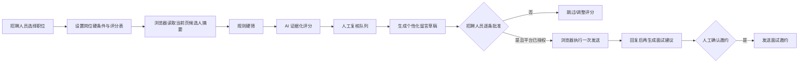

# BOSS 直聘智能招聘 Agent 可行性调研

> 调研日期：2026-07-22  
> 状态：调研完成；2026-07-22 已按独立桌面应用方向完成设计  
> 调研范围：登录后页面结构、候选人筛选与简历分析、沟通/面试流程、项目集成方式、合规与平台风险

## 0. 2026-07-22 产品方向更新

后续设计不再把该能力接入现有 Agent。产品改为 Windows 独立桌面应用：Playwright 每次启动一个可见的系统 Chrome 临时会话，用户手动完成登录，应用直接调用配置的模型，按岗位知识逐份筛选，并在本地记录判断、原因和页面动作。

当前设计与计划见：

- [BOSS 简历筛选助手原生 CDP 设计](../design/recruiting/boss-resume-assistant-native-cdp-design.md)
- [BOSS 简历筛选助手原生 CDP 开发计划](../plans/recruiting/boss-resume-assistant-native-cdp-dev-plan.md)

本调研后续章节保留第一次页面观察和原 Agent 集成评估，作为历史依据；其中“复用现有 Browser/Agent”的建议已被新设计替代。新设计的首版边界为：每次手动登录、不保存登录态、不接入 aid-work-agent 服务端、合格点击打招呼、不合格点击不感兴趣、不确定则不执行动作。

### 登录接管真机实验

2026-07-22 在 Windows + 系统 Chrome 上完成最小实验：Playwright直接启动或在登录前建立 CDP 连接都会导致 BOSS 页面进入 `about:blank`/关闭；改为普通 Chrome 先打开登录页、用户扫码成功后再由 Playwright `connectOverCDP()` 连接，可以稳定读取 `/web/chat/recommend`、页面标题和招聘端导航标志，观察期间未刷新或关闭，断开后 Chrome 继续运行。该结果已回写设计和开发计划，客户端不再采用 Playwright直接启动浏览器。

继续验证候选人详情时，Playwright可唯一定位首张卡片、姓名节点和独立“打招呼”按钮，但点击卡片或姓名后只短暂创建 `/web/frame/c-resume/?source=recommend`，随后详情 iframe、推荐 iframe和顶层推荐页被销毁重建，并反复经历 `jobid=null → 正确 jobid`，最终回到列表。当前结论是“登录后只读可行，候选人详情自动点击不可行/待解决”，不能据此开始完整客户端开发。

补充隔离实验：Playwright断开时，用户用物理鼠标能正常打开候选人详情浮层，顶层 URL保持 `/web/chat/recommend`，页面新增 `c-resume` frame；随后只读连接 Playwright时，该 frame立即不可访问/被拆除，推荐 iframe退回 `jobid=null` 并刷新到列表。这证明问题不只是定位或点击方式，而是候选人详情浮层与当前 CDP/Playwright连接不兼容。

进一步对精确姓名点击做脱敏网络诊断：点击事件成功触发，并发起 `GET /web/frame/c-resume/` 文档请求；观察 10 秒内没有收到该文档的 response，也没有出现 `security-check`、`secCode`、登录页、302、安全校验接口、requestfailed 或 console/page error，最终只留下空详情 frame。现有证据不支持“已经跳到安全校验页”或“wait_for_url 竞态”的判断，更准确的描述是详情文档请求在 Playwright/CDP 连接期间挂起或未完成，原因仍待定位。

## 1. 结论

技术上可以基于本项目已有的 `browser_automation`、Browser RunManager、人工接管和子智能体机制，做出“岗位选择 → 候选人读取 → AI 评分 → 人工复核 → 留言草稿”的招聘辅助 Agent。

但当前不应直接实现“无人值守批量抓取简历、自动打招呼、自动邀约面试”，原因有三点：

1. BOSS 直聘用户协议将蜘蛛、爬虫、拟人程序等非正常浏览手段获取数据定义为“非法获取”；本次公开检索未发现面向普通企业招聘账号的公开招聘 API。
2. 简历包含大量个人信息；把简历发送给云模型分析属于个人信息处理，需落实目的限定、最小必要、告知/授权、供应商数据处理约束、保存期限和删除机制。
3. 本项目浏览器工具的不可逆动作安全策略仍处于开发计划 Phase 5，现有通用编排 Prompt 没有对“发送、打招呼、邀约”进行代码级强制确认。

推荐路线是：先取得 BOSS 直聘书面授权或官方合作接口；在此之前只做本地可见页面的单页辅助分析和人工发送，不做批量采集、反爬绕过、验证码绕过或自动群发。

## 2. 实际页面观察

### 2.1 登录后的信息架构

本次通过用户本人登录的企业招聘账号，只读观察到主导航：

| 模块 | 页面/入口 | 作用 |
|---|---|---|
| 职位管理 | `/web/chat/job/list` | 管理招聘职位，决定候选人推荐上下文 |
| 推荐牛人 | `/web/chat/recommend` | 按当前职位展示推荐候选人 |
| 搜索 | 主导航入口 | 主动搜索候选人 |
| 沟通 | `/web/chat/index` | 处理候选人聊天 |
| 互动 | `/web/chat/interaction` | 处理互动事件 |
| 牛人管理 | `/web/chat/geek/manage_v2` | 管理进入招聘流程的候选人 |
| 面试 | 顶部入口 | 管理面试相关操作 |

`/web/chat/recommend` 的核心业务内容位于 iframe 中。自动化实现必须把 iframe 作为一等场景，不能只扫描顶层 DOM。

### 2.2 推荐候选人页面

页面顶部包含：

- 推荐、精选牛人、新牛人三个候选池；
- 当前职位（本次观察为一个上海职位）及薪资范围；
- 城市和“筛选”入口；
- 候选人卡片列表；
- 每张卡片的“打招呼”按钮。

候选人卡片已经提供较丰富的在线简历摘要：

- 期望薪资、活跃状态；
- 年龄、工作年限、学历、到岗状态；
- 期望城市和岗位；
- 个人优势；
- 工作年限/岗位摘要、专业；
- 技能标签；
- 多段工作经历；
- 教育经历。

因此，首轮 AI 初筛不一定需要下载附件简历。先解析卡片的结构化摘要，只有进入复核队列后才查看详情，可以显著减少个人信息处理量和页面操作次数。

### 2.3 已验证与未验证边界

已验证：

- 推荐页地址、主导航地址；
- 当前职位上下文；
- 推荐池切换、城市、筛选入口存在；
- 卡片包含上述履历摘要；
- 每张卡片存在“打招呼”动作。

未验证：

- “筛选”抽屉中的完整字段、字段枚举和应用后的 URL/请求格式；
- 点击候选人卡片后的完整简历详情结构；
- 附件简历是否可查看/下载及其权限消耗规则；
- 面试邀约表单的必填字段、通知渠道和最终提交确认；
- 账号的每日招呼、查看、沟通额度和风控阈值。

原因：iframe 的定向自动化读取多次超时。没有通过猜测选择器或调用非公开接口继续探测，也没有点击任何“打招呼”、发送或邀约动作。后续真机 PoC 应由招聘人员在可视浏览器中逐步操作，工程侧记录稳定语义元素和状态变化。

## 3. 建议的业务流程

### 3.1 两阶段筛选

第一阶段使用确定性规则，避免让模型在明显不符合条件的候选人上浪费成本：

- 工作地点、可接受城市；
- 岗位方向；
- 必须技能；
- 最低相关经验；
- 学历（仅当岗位确有合法、合理需要）；
- 薪资区间；
- 到岗时间。

第二阶段由模型按岗位评分表分析：

| 维度 | 示例权重 | 要求 |
|---|---:|---|
| 必须技能覆盖 | 30 | 每一分都引用简历证据 |
| 相关项目/行业经验 | 25 | 区分直接经验与可迁移经验 |
| 职责级别匹配 | 15 | 不只看职位名称 |
| 交付结果与复杂度 | 15 | 缺少量化结果时降低置信度 |
| 沟通/协作证据 | 10 | 只使用履历中的行为证据 |
| 到岗与薪资适配 | 5 | 作为业务条件，不做人格推断 |

输出必须包含 `score`、`recommendation`、`evidence[]`、`gaps[]`、`questions[]`、`confidence` 和使用的评分表版本。禁止仅输出一个不可解释的总分。

### 3.2 禁用特征

模型不得使用或推断与岗位无关、可能导致歧视的特征，包括但不限于性别、民族、宗教、婚育、疾病/残障、外貌。年龄只能在法律允许且岗位确有必要的例外场景使用，默认从模型输入中移除。

### 3.3 沟通策略

首条留言应该由模板和候选人证据共同生成：

1. 说明真实公司、真实岗位和联系目的；
2. 引用一项与岗位相关的候选人经历，避免泛化群发话术；
3. 简要说明岗位核心工作和薪资/地点等关键条件；
4. 提出一个便于回复的问题；
5. 不夸大、不承诺录用、不索取与招聘无关的信息。

每条草稿必须展示给招聘人员，批准后才允许执行。面试邀约同样需要逐条确认，并在提交前再次展示候选人、职位、时间、形式和地址/会议链接。

## 4. 平台与法律边界

### 4.1 BOSS 直聘规则

BOSS 直聘官方用户协议说明，采用蜘蛛、爬虫、拟人程序等非真实用户或以非正常浏览方式读取、复制、转存、获得数据，属于“非法获取”。协议也要求招聘账号和授权单位保持真实、有效。来源：[BOSS直聘用户协议](https://www.zhipin.com/web/common/protocol/protocol-2019-09-30.html)。

工程约束：

- 不逆向或直接调用网站未公开接口；
- 不绕过验证码、访问控制、频率限制或付费权益；
- 不模拟批量账号、不做账号共享；
- 不以规避检测为目的随机化操作；
- 上线前取得平台书面授权、正式合作接口或法务确认；
- 平台授权范围不清楚时默认停在人工辅助模式。

### 4.2 个人信息与自动化决策

《个人信息保护法》第二十四条要求自动化决策透明、公平、公正；对个人权益有重大影响的决定，个人有权要求说明并拒绝仅由自动化决策作出。来源：[国家网信办发布的《个人信息保护法》](https://www.cac.gov.cn/2021-08/20/c_1631050028355286.htm?ivk_sa=1024320u)。

《网络招聘服务管理规定》要求网络招聘服务中的个人信息处理遵守个人信息保护规则，不得泄露、篡改、毁损或非法提供年龄、性别、住址、联系方式等信息。来源：[人力资源和社会保障部规章 PDF](https://www.mohrss.gov.cn/xxgk2020/gzk/gz/202112/P020211229518511385731.pdf)。

工程约束：

- AI 只提供辅助排序和理由，不自动作出淘汰/录用决定；
- 模型输入最小化，默认去除姓名、头像、联系方式、年龄等非必要字段；
- 云模型供应商必须满足企业个人信息处理要求；无法确认时使用企业自管模型或本地推理；
- 原始简历、模型输入、评分和沟通记录按租户隔离并加密；
- 设置明确保存期限、访问审计、导出和删除机制；
- 不把候选人数据用于训练通用模型或与招聘无关的用途。

## 5. 项目现状与可复用能力

| 现有能力 | 位置 | 复用方式 |
|---|---|---|
| 通用浏览器任务入口 | `src/tools/browser/automation_tool.py` | 执行登录后页面读取和受控操作 |
| LLM 浏览器编排 | `src/tools/browser/orchestrator.py` | 快照 → 决策 → 操作循环 |
| iframe 语义能力 | `src/tools/browser/semantic/` | 解析推荐页的 iframe 交互元素 |
| 多租户 RunManager | `src/tools/browser/run_manager.py` | 隔离租户、用户与浏览器进程 |
| 人工接管/同上下文续跑 | `src/tools/browser/human_control.py` | 登录、验证码和必须人工完成的提交 |
| 子智能体定义 | `subagents/*/SUBAGENT.md` | 新建招聘助手的角色、工具与行为约束 |
| 数字员工管理 | 现有管理端能力 | 配置租户级岗位、知识和权限 |

主要缺口：

- 通用编排器的 `click` 动作没有领域级风险分类；
- `DECISION_PROMPT` 未强制“发送/邀约/提交”进入人工确认；
- 浏览器执行安全 Phase 5 尚未完成；
- 没有招聘工作流状态机、岗位评分表、候选人评估和审批记录；
- 没有针对简历的字段最小化、脱敏和保存期限策略；
- 没有 BOSS 页面适配器和真实账号回归样本。

## 6. 推荐的落地决策

| 方案 | 可行性 | 风险 | 建议 |
|---|---|---|---|
| 官方 API/合作接口 | 高 | 最低 | 第一选择，先商务/法务确认 |
| 可视浏览器 + 单页读取 + 人工发送 | 高 | 中 | 可作为授权前 PoC，但不批量持久化 |
| 可视浏览器 + 自动逐条发送 | 中 | 高 | 仅在平台授权和不可逆动作门禁完成后 |
| 无头批量抓取 + 自动群发 | 技术可做 | 极高 | 不实施 |
| 逆向私有接口/绕过风控 | 不应实施 | 极高 | 明确禁止 |

最终建议：先建设平台无关的“招聘辅助 Agent”领域层，把 BOSS 直聘作为受控浏览器适配器；适配器默认只读，写操作由功能开关、平台授权状态和人工批准三重门禁控制。

## 7. 下一步验证清单

1. 由业务负责人确认公司是否已有 BOSS 企业合作接口或书面自动化授权。
2. 法务/信息安全确认简历发送给 Qwen/ZhipuAI 的处理基础、数据地域、留存和供应商条款。
3. 在测试招聘职位下，由招聘人员手动打开筛选、完整简历详情和面试邀约，记录字段与状态，不发送真实消息。
4. 验证项目 Browser Phase 3 在真实 Redis、PostgreSQL、双 worker 和真实登录页下的门禁。
5. 在 Browser Phase 5 增加不可逆动作代码级拦截后，才评估受控发送 PoC。

## 8. CDP / Playwright 公开实现补充调研（2026-07-22）

### 8.1 与当前页面结构完全对应的实现

公开项目 [`joohw/boss-cli`](https://github.com/joohw/boss-cli) 是目前找到的最直接参考：它面向 BOSS 招聘端，使用 Puppeteer Core 通过 CDP 驱动本机 Chrome，并实现了推荐候选人读取、打招呼与在线简历预览。

其源码与本机观察到的页面结构一致：

- 顶层页面为 `/web/chat/recommend`；
- 推荐列表位于 `iframe[name="recommendFrame"]`，frame URL 包含 `/web/frame/recommend`；
- 候选人根节点兼容 `.candidate-card-wrap`、`.card-item` 和 `.geek-card`；
- 打招呼直接在推荐 frame 内对 `.button-chat-wrap .btn.btn-greet` 执行 DOM `click()`；
- 打开简历时优先在推荐 frame 内对卡片主体 `.card-inner` 执行 DOM `click()`；
- 点击后不等待顶层 URL 变化，而是在主页面及所有子 frame 内轮询可见的 `iframe[src*="c-resume"]`；
- c-resume frame 出现后，再检查 iframe 尺寸、`document.readyState` 和内容高度；遍历 frame 时允许 detached/context destroyed，并对执行上下文销毁做一次会话级重试。

这说明当前问题更可能是“跨 frame 生命周期与点击方式处理不完整”，不能仅凭列表刷新认定为安全页重定向。现有实验脚本使用 Playwright locator 的鼠标点击，而该公开实现使用 frame 内 DOM click，并把成功条件定义为“任意 frame 中出现可见 c-resume iframe”，两者有实质差异。

### 8.2 其他公开方案

- [`can4hou6joeng4/boss-agent-cli`](https://github.com/can4hou6joeng4/boss-agent-cli) 同时提供 CDP、浏览器扩展 Bridge 和 HTTP 客户端。其扩展仍通过 `chrome.debugger` 发送 CDP 命令，并不是绕开 CDP；项目默认将高风险写操作保持为人工触发。
- [`mucsbr/mcp-bosszp`](https://github.com/mucsbr/mcp-bosszp) 主要在扫码后提取 Cookie/安全参数，再调用未公开 HTTP 接口；它面向求职端，不能作为招聘端推荐简历 UI 的可靠依据，也不建议沿用其私有接口与设备指纹方案。
- [`geekgeekrun/geekgeekrun`](https://github.com/geekgeekrun/geekgeekrun) 使用 Electron + Puppeteer 驱动求职端页面，并明确提示页面 A/B 变化会导致脚本失效，佐证页面适配器必须版本化并 fail-loud。

Playwright 官方文档明确说明 `connectOverCDP` 相比 Playwright 自有连接协议属于“显著较低保真度（significantly lower fidelity）”。这不代表 CDP 不可用，但意味着复杂 iframe、target 生命周期和高级能力不应假定与 Playwright 自启浏览器完全等价。

### 8.3 调整后的验证顺序

1. 先直接安装并只读试跑 `@joohw/boss-cli` 的 `boss login`、`boss recommend` 与 `boss preview <姓名>`，验证其当前版本是否能在同一账号、同一 Chrome 环境打开 c-resume；不执行 `greet`、`send` 或 `action`。
2. 若其 preview 可用，对照移植最小机制：`recommendFrame` 定位、frame 内 `.card-inner.click()`、全 frame 可见 c-resume 轮询、detached 容忍；先写成独立诊断脚本。
3. 若 Puppeteer 可用而 Playwright 仍失败，桌面应用的 BOSS 适配器改用 `puppeteer-core`，不强求统一 Playwright。
4. 若公开实现同样失败，再验证 Chrome 扩展 content script；扩展作为备用路线，不再是第一选择。
5. 任一方案必须以“可见详情稳定渲染、可读取、可关闭且列表不误刷新”为通过条件，不能只以 click promise 成功为依据。

### 8.4 同机真实账号对照实验结果（2026-07-22）

使用 `@joohw/boss-cli@0.6.6` 在同一台 Windows 机器上完成了手动扫码登录和只读验证：

- `boss recommend` 成功读取当前岗位“软件项目经理 _ 上海 12-18K”及推荐卡片，证明 Puppeteer/CDP 能稳定连接已登录招聘端并读取 `recommendFrame`；
- 对首位候选人执行 `boss preview <姓名>` 后，命令等待约 17 秒并失败，原始错误为“点击后未出现在线简历 iframe（c-resume）”；
- 失败后再次运行 `boss recommend` 仍能正常读取列表，但推荐池已经刷新，刚点击的候选人被移动到后部并标记为“看过”；
- 随后对新列表首位候选人“郭伟亚”再次执行 `boss preview`：c-resume 成功打开，完整长截图保存为 `~/.boss-cli/.cache/resume-screenshots/preview-郭伟亚-1784697670858.png`，并在截图后自动关闭详情；命令最终非零退出仅因为环境开启了百度 OCR、但没有配置 OCR 密钥；
- 全程没有执行 `greet`、`send`、`action` 等写操作。

两次结果共同说明 Puppeteer/CDP 路线可行，但 c-resume 打开存在偶发竞态：第一次点击完成“看过”状态更新却没有稳定出现详情，第二次则完成了打开、读取、截图和关闭。该结果推翻“只是 Playwright locator.click 写法有误”以及“CDP 一定被平台拦截”两种单因假设。没有观察到 security-check、登录跳转或明确的服务端拒绝响应，现阶段应按可恢复的 iframe 加载失败处理。

后续优先级据此改为：

1. 将 Puppeteer/CDP 作为第一实现候选，先复制其 frame 内 DOM click、全 frame 可见性检测和截图机制完成独立 PoC；
2. 对“点击已生效但 c-resume 未出现”增加有限重试：重新读取推荐池，按稳定候选人标识重新定位；禁止立即重复点击同一卡片，避免重复消耗查看次数；
3. 把 OCR 设为可选步骤，未配置密钥时仍应以截图成功返回零退出或明确的部分成功状态；
4. Chrome 扩展 content script 保留为备用方案，仅在 Puppeteer/CDP 的真实样本失败率不可接受时再验证。

### 8.5 Playwright 按 Puppeteer 机制优化后的对照实验（2026-07-22）

新增临时诊断脚本 `.tmp/playwright_open_first_resume_no_close.py`，完整移植已验证的关键机制：推荐 frame 内 `.card-inner` DOM click、跨所有 frame 等待可见 c-resume、要求 child URL/readyState/内容高度有效、容忍 frame detached；发现弹框或已有详情时默认 fail-loud，成功后只断开 CDP，不截图、不 OCR、不关闭详情或 Chrome。

离线检查通过后，在用户明确确认已登录、已手动关闭弹框并回到推荐列表后，连接 `http://127.0.0.1:9223` 实测：

- 普通弹框检测结果为 0；
- frame 内 DOM click 已发送给当前第一位候选人“尹捷”；
- 等待 20 秒没有发现可见且加载完成的 c-resume；
- 用户从可见页面确认推荐列表持续刷新，详情未稳定打开；
- 脚本没有关闭页面或继续点击。

因此，单纯把 Playwright locator click 改为 Puppeteer 项目采用的 DOM click + 全 frame 轮询，仍不能解决当前 9223 Chrome 会话的问题。需要注意本次 Playwright 使用的是早期手工启动 profile（`.tmp/boss-login-manual-cdp-profile`），而 Puppeteer 成功样本使用 `boss-cli` 自己启动的 profile（`~/.boss-cli/.cache/browser-data`）；尚未完成“同一 Chrome 实例、同一 profile，仅切换 Puppeteer/Playwright 客户端”的严格变量隔离实验。在完成该实验前，不能把差异完全归因于 Playwright 协议实现。

### 8.6 同一 boss-cli Chrome 的 Playwright/Puppeteer 进一步隔离（2026-07-22）

在 `boss-cli` 启动的同一 Chrome/profile（CDP 53470）上继续实验：

- Playwright 在推荐 frame 内对首卡“川芳”执行 DOM click 后，用户短暂确认详情正常显示；检测脚本因本地 `Locator.content_frame` API 使用错误立即退出，因而没有保持连接；
- 随后重新连接 Playwright做只读详情检测时，详情被拆除并重新进入推荐列表刷新；
- Puppeteer自动点击另一候选人“徐超梁”时，15 秒内没有出现完整 c-resume，未进入正文读取阶段；
- 用户随后用物理鼠标手动打开一份稳定详情，Puppeteer只复用已有 c-resume 并读取一次 `document.body.innerText.length`：结果为 0，1 秒后的复查中 c-resume 已消失；未执行卡片点击、截图、OCR或关闭动作。

这组结果说明：浏览器 profile 不是唯一变量。详情可以在自动点击后、自动化客户端迅速断开时短暂正常显示；重新连接并检查详情 frame 时，Playwright与 Puppeteer都可能触发或伴随详情拆除。当前证据仍不能区分“CDP attach/target 自动发现本身”与“Runtime.evaluate/DOM 读取”哪一个是触发条件。下一步若继续定位，必须做严格的 attach-only 实验：用户手动打开详情后，客户端只建立 CDP 连接并保持固定时间，不枚举/读取 c-resume、不启用额外 DOM/Runtime 检查；与连接后单次 evaluate 分组对照。

attach-only 对照已完成：用户物理鼠标打开详情后，Puppeteer仅 `connect` 到 53470、保持 15 秒并 `disconnect`，期间没有调用 `browser.pages()`、没有枚举 frame、没有 evaluate；用户确认详情全程没有刷新。由此排除“仅建立 CDP WebSocket 连接就触发刷新”。触发范围已缩小到连接后的 target/page/frame 发现、execution context 建立或 Runtime/DOM 访问。后续应逐级增加单一动作（`browser.pages()` → `page.frames()` → 读取 frame URL → `Runtime.evaluate(document.readyState)` → `innerText`），每级都由用户重新手动打开详情并观察，以定位最小触发操作。

第一级 `browser.pages()` 对照随后完成：重新使用物理鼠标打开详情，Puppeteer连接后只调用一次 `browser.pages()` 并记录页面数量（1），不读取 URL、不访问 frame、不 evaluate，保持 15 秒。用户确认详情已经刷新。由于 attach-only 不刷新而 `browser.pages()` 刷新，最小触发范围已缩小到 Puppeteer为现有页面创建/初始化 `Page` 对象时发生的页面 target 附着或相关 CDP domain 初始化；无需继续测试 `page.frames()` 和 DOM 读取，它们发生在更晚阶段。若继续协议级定位，应绕开 Puppeteer Page 抽象，使用原始 browser websocket依次测试 `Target.getTargets`、`Target.attachToTarget(flatten=true)`、`Runtime.enable`、`Page.enable`。

原始 CDP 逐级实验进一步定位了最小触发命令：

- 仅发送 `Target.getTargets` 并保持 15 秒：不刷新；
- `Target.attachToTarget(flatten=true)` 附着顶层 page target、不发送 session 命令并保持 15 秒：不刷新；
- 在同样附着后仅发送 `Runtime.enable`，不 evaluate、不读取 DOM、不启用 Page并保持 15 秒：用户确认详情刷新。

因此，当前可复现的最小触发条件是对页面 session 启用 Chrome DevTools Protocol `Runtime` domain，而不是 CDP WebSocket连接、target枚举、target附着或正文读取本身。Playwright/Puppeteer创建和初始化页面对象时通常会启用 Runtime并接收 execution context 事件，这解释了 `browser.pages()`、Playwright详情检查和 DOM读取路径为何都会触发刷新。下一步应验证不启用 Runtime的 `Page.enable` 与原始 `Page.captureScreenshot` 是否安全；若安全，候选架构为“列表阶段使用页面自动化 → 点击后立即断开 → 原始 CDP Page截图或 Windows Graphics Capture + OCR → 原生输入关闭详情”，避免在详情显示期间启用 Runtime。

后续原始 CDP 验证通过：

- 仅 `Page.enable`、保持 15 秒、`Page.disable`：用户确认详情不刷新；
- `Page.enable` 后调用 `Page.captureScreenshot`（不启用 Runtime、不开 DOM、不读 frame），保存当前可见视口并保持 15 秒：用户确认详情不刷新；
- 截图实际包含清晰的简历详情、工作经历和右侧经历概览，可供 OCR/视觉分析。

至此形成首个稳定可行的详情读取通道：原始 browser websocket → `Target.getTargets` → `Target.attachToTarget` → `Page.enable` → `Page.captureScreenshot`，全程禁止 `Runtime.enable`。由于单张截图仅覆盖当前视口，完整简历需要结合不依赖 Runtime的输入滚动、分段截图与图像拼接/OCR；下一步验证 `Input.dispatchMouseEvent`/滚轮是否同样安全。Playwright/Puppeteer Page 抽象不得用于详情阶段，因为它们会隐式启用 Runtime。

`DOMSnapshot.captureSnapshot` 也已验证不会触发刷新，但揭示了详情实现的关键事实：一次 snapshot 包含 4 个 document；推荐列表 `/web/frame/recommend` 有 4656 个节点和 762 个非空普通文本节点，而详情 `/web/frame/c-resume` 只有 27 个节点，body 核心结构为 `DIV → CANVAS`，普通 nodeValue 仅包含页面标题等 6 项，转换后的 Markdown正文只有“BOSS直聘”。因此详情正文是 Canvas绘制结果，不存在可供 Turndown/Readability/markdownify 转换的 HTML文本；这也解释了公开 `boss-cli` 为什么采用 iframe截图 + OCR。DOMSnapshot可用于列表页，但不能替代详情 OCR。

详情阶段若要避免 OCR，剩余的主要候选是 Network domain：在打开详情前启用 `Network`，监听其 HTML/JSON/字体/二进制数据响应并判断是否存在可解析的结构化简历载荷。Accessibility树对 Canvas通常只能得到整体图形节点，成功概率较低。若 Network同样只返回加密或绘制资源，则“Page分段截图 + OCR”就是首版最稳妥的正文提取方式。

`Network.enable` 对照随后完成：原始 CDP 附着推荐页并只启用 Network 后，用户手动打开详情，页面未出现刷新。监听器成功捕获详情接口 `GET /wapi/zpjob/view/geek/info/v2`，响应约 30 KB；外围为 JSON，但 `zpData.geekDetailInfo` 为 `null`，实际简历位于约 28 KB 的 `encryptGeekDetailInfo` 字符串中。同时页面加载 `wasm_canvas_bg-1.0.2-5097.wasm`（约 2.9 MB）并绘制 Canvas。因此“直接把 Network JSON 转 Markdown”不可行，但 Network domain 本身已验证可作为稳定数据通道。

进一步静态检查公开前端资源 `wasm-resume-container/v197/assets/index-CgN35---.js` 发现：前端把 `encryptGeekDetailInfo` 传给 `WasmModule.start(...)`，渲染后调用 `WasmModule.get_export_geek_detail_info()` 获得结构化对象，并通过 `IFRAME_DONE` 的 `abstractData` 发给父页面。这证明 OCR 不是理论上的唯一方案；下一步可在不启用 Runtime 的前提下，使用 `Page.addScriptToEvaluateOnNewDocument` 在新建详情 iframe 中预先监听父页面的 `IFRAME_DONE` 消息，把 `abstractData` 写入隐藏 DOM，再通过已验证安全的 `DOMSnapshot.captureSnapshot` 读取。该注入路径是否触发风控仍需单变量对照；若触发，则退回分段截图 + OCR。

上述消息拦截实验已成功：`Page.addScriptToEvaluateOnNewDocument(runImmediately=true)` 在当前详情 frame 中安装轻量监听器，没有触发页面刷新；用户关闭并打开另一份详情后，监听器捕获 `IFRAME_DONE.abstractData` 并写入隐藏节点，随后 DOMSnapshot 读取到 5241 字符的结构化 JSON。对象包含候选人基础信息、6 条工作经历、8 条项目经历、1 条教育经历及收藏/感兴趣状态等字段。该对象只包含公司、职位、项目名和日期等摘要，不包含 Canvas 上可见的自我介绍、工作业绩和工作内容长文本，因此可承担结构化初筛和去重，但暂时不能完整替代 OCR。

WASM 导入表同时确认渲染器调用 `CanvasRenderingContext2D.fillText`、`measureText` 和 `drawImage`。因此新增下一条非 OCR 候选路径：同样用 Page 域在详情 frame 渲染前包装 `fillText`，记录文字、坐标、字体和 Canvas 尺寸，经隐藏 DOM + DOMSnapshot 导出，再按纵横坐标重建 Markdown。该方法若能捕获全部绘制文本，将比 OCR 更准确；仍需验证虚拟滚动是否只绘制可见区域，以及原型包装是否会触发页面风控。

Canvas `fillText` 拦截的连续对照结果为“不适合作为主流程”。`runImmediately=true` 能在当前已存在的 `c-resume` 文档中写入就绪标记，且不会刷新；但用户按 Esc 后再次打开详情时，站点有时复用旧 frame、有时销毁并重建 frame。重建场景下，即便监听 session 长期保持 `Page.enable`，顶层 target 的 `Page.addScriptToEvaluateOnNewDocument` 也没有稳定进入新的 `c-resume` 文档，最终快照同时缺少就绪标记和 fillText 记录。只重载 `c-resume` 子 frame 时详情能正常恢复，但同样没有可靠触发拦截器。因此该路线最多保留为后续研究，不进入首版客户端。2026-07-22 产品决策进一步废弃 `IFRAME_DONE`/WASM 摘要探针；首版的详情正文和结构化摘要都统一来自 Page 分段截图与本地 OCR，DOMSnapshot 仅做列表定位和结构辅助。

详情滚动截图通道已验证可行：基线截图显示详情停在底部教育经历和页脚处；原始 CDP 在不启用 Runtime 的前提下，对详情正文中央坐标发送一次 `Input.dispatchMouseEvent(type=mouseWheel, deltaY=-600)`，等待 1.5 秒后再次调用 `Page.captureScreenshot`。第二张图稳定移动到更早的工作经历，右侧经历概览、详情浮层和推荐页保持不变，两张截图哈希不同且内容连续，未出现刷新或退回列表。因此首版可以按固定重叠比例重复发送滚轮、分段截图，并通过相邻图像重叠匹配完成长图拼接；连续截图主体相同可作为到达边界的无 Runtime 停止条件。
