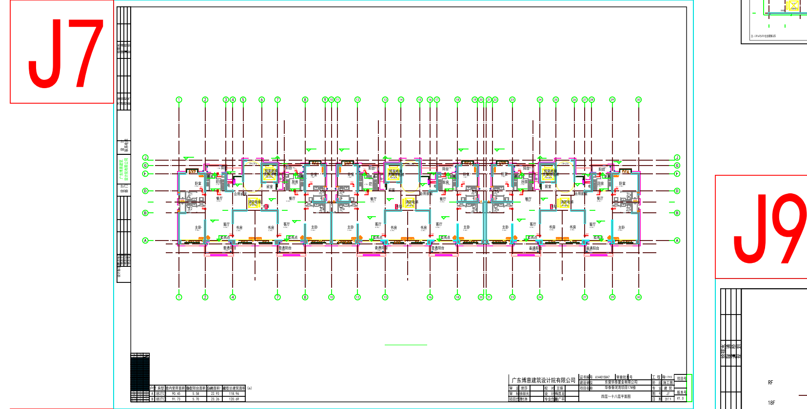
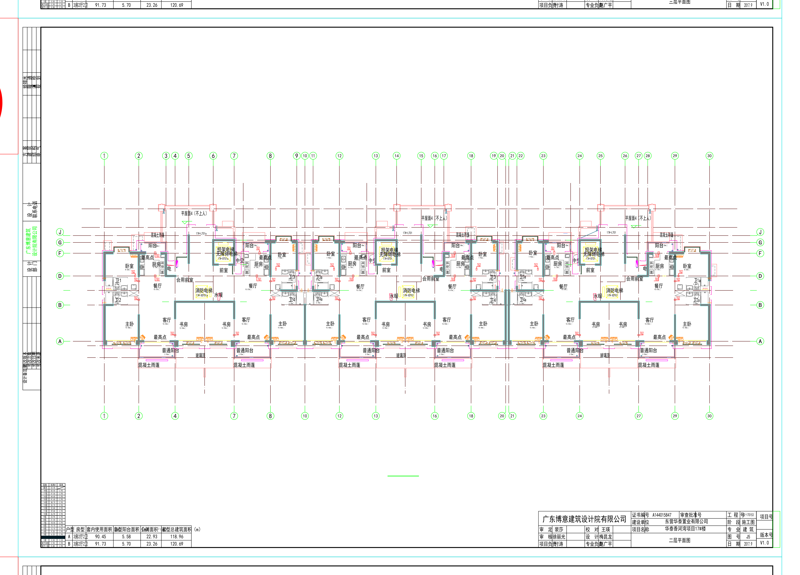
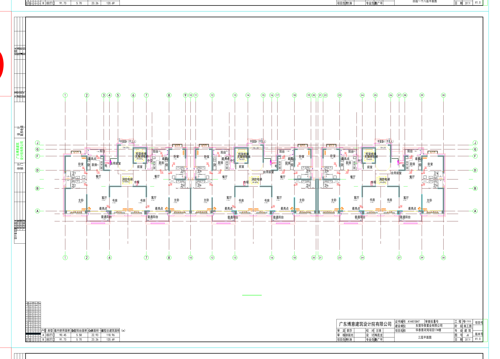
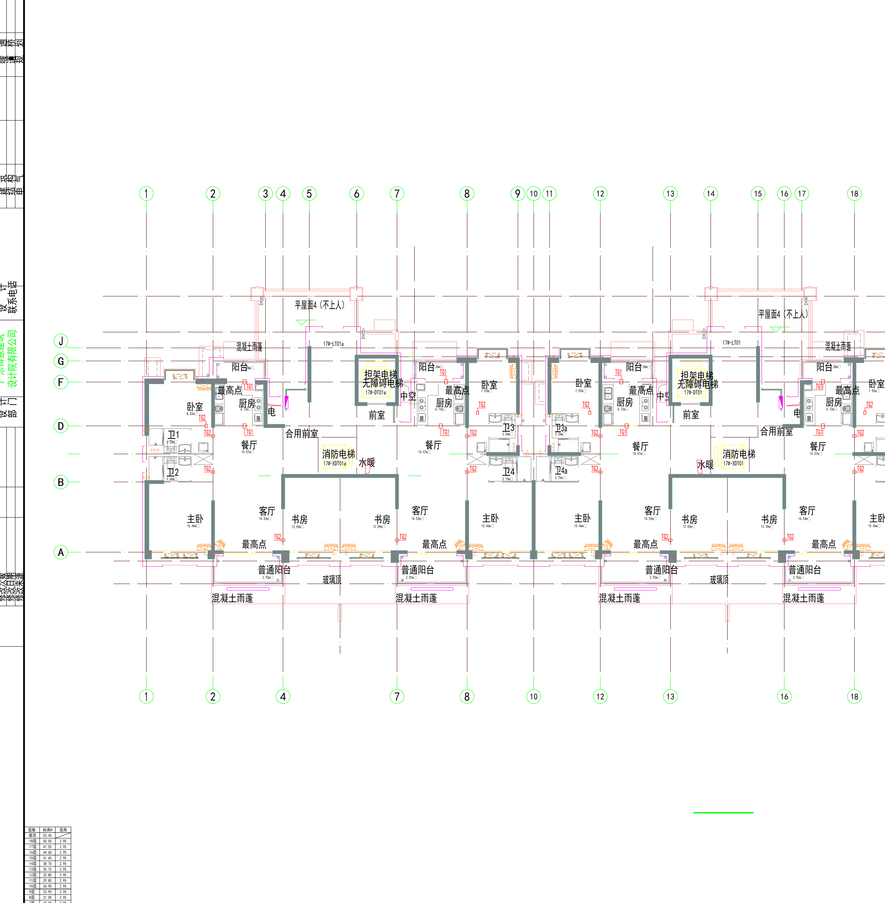
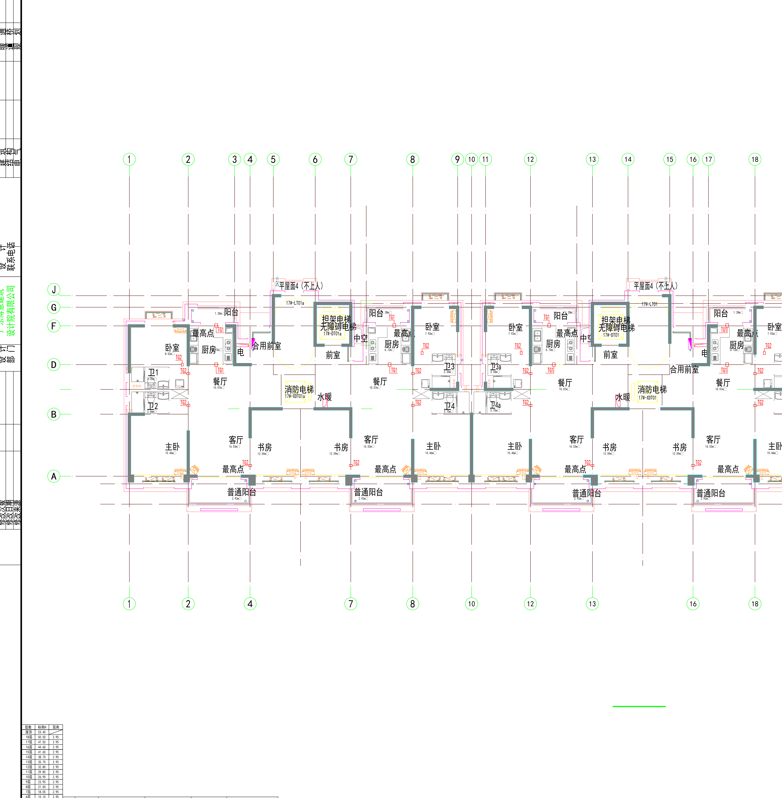

# 竣工图纸对比（转图片 + 多模态模型）测试报告

| 项目 | 内容 |
|------|------|
| 测试日期 | 2026-09-04 |
| 测试目标 | 验证"DWG 图纸渲染为图片后，由 GLM 多模态模型对比图纸差异"这一路线（图纸差异对比方案三）的可行性，实测多模态模型对建筑工程图纸的理解能力边界 |
| 关联文档 | [CAD 处理与多模态图纸对比技术报告](cad-processing-and-multimodal-drawing-comparison-tech-report.md) |
| 模型 | GLM-5.3 Flash（内置多模态视觉能力） |

---

## 1. 测试结论（TL;DR）

1. **多模态模型对比图纸的能力真实可用**：在同类型图幅对比中，模型能正确读出图名、轴网体系、户型布局、电梯编号、面积表，并发现具有工程语义的真实差异（雨篷投影），不是像素级碰运气。
2. **能力有清晰边界**：小号尺寸标注文字处于可读临界、轴线字母存在个别误读风险、**无法保证"不漏差异"**——该路线只能定位为"差异初筛 + 差异语义描述"，不能作为免人工的审计工具。
3. **意外的关键发现（数据质量问题）**：本次提供的两个 DWG 文件**不是同一专业的两个版本**——一个是建筑专业施工图全套，一个是纯结构专业施工图，不存在版本对应关系。这证明自动对比流水线必须前置"图幅切分 → 图名识别 → 专业分类 → 跨套配对"环节，且必须处理真实档案中文件混放的情况。
4. **技术提醒**：本次实验两边都是 DWG（矢量数据齐全），这种场景下 CAD 实体级几何比对（ezdxf 等库直接做）比多模态更精确且零漏报。**多模态路线的不可替代价值在于"竣工图扫描件 PDF"没有矢量数据的场景**。

## 2. 测试样本

样本来自客户项目"华泰香河湾 17#楼"（建设单位：东莞华泰置业有限公司；设计单位：广东博意建筑设计院有限公司）：

| 文件 | 大小 | 修改时间 | 实际内容（经逐幅渲染识别确认） |
|------|------|----------|------------------------------|
| `17#楼(1012)_t6(2).dwg` | 3.1 MB | 2018-08-24 | **建筑专业施工图全套**：总说明（四）、节能设计、J3~J8 各层平面图、J9/J10 立面图、J11 剖面图、楼梯详图、节点大样、门窗统计表及大样、材料示意、机房大样，目录页版本 V1.0（2017.9），图纸阶段标注"施工图" |
| `17号楼 （外审修改版）.dwg` | 4.4 MB | 2017-10-18 | **纯结构专业施工图（外审修改版）**：结构设计总说明、楼梯配筋表、负一层~大屋面各层墙柱定位及配筋图、各层结构布置及板配筋图、各层梁配筋图、LT01/LT02(LT02a) 楼梯详图（一）（二）、节点大样（一）（二）（三） |

两个文件为**同一栋楼的两个不同专业**，均含天正（TArch）对象。DXF 转换后实体统计：

| 文件 | 实体总数 | 主要实体构成 |
|------|---------|-------------|
| 建施（orig） | 24,720 | LINE=7217、**ACAD_PROXY_ENTITY=5079**、TEXT=4828、INSERT=3996、LWPOLYLINE=2655、HATCH=505 |
| 结施（revised） | 29,691 | TEXT=10053、LWPOLYLINE=7355、LINE=5357、**DIMENSION=4620**、HATCH=1147、INSERT=944 |

## 3. 测试环境与工具链

| 组件 | 版本 | 用途 |
|------|------|------|
| ODA File Converter | 25.12.0 | DWG → DXF（ACAD2018）转换，命令行批量模式 |
| Python | 3.12.6 | 脚本环境 |
| ezdxf | 1.4.4 | DXF 解析、实体统计、图幅定位、渲染 |
| matplotlib | 3.10.9 | 矢量渲染后端（ezdxf drawing add-on） |
| 被测模型 | GLM-5.3 Flash | 多模态图纸识别与差异对比 |

## 4. 测试过程

### 4.1 数据准备

1. DWG → DXF 转换（ODA 命令行，audit 开启），得到 20.7 MB / 31.8 MB 的 ASCII DXF
2. 实体统计与坐标范围分析，发现两文件模型空间均包含**整套多图幅图纸**（几十张图并排摆放），且 revised 存在游离实体导致整体渲染比例失真
3. 图幅切分与识别：
   - revised 通过图框块引用（`A2+0.5图幅`×25、`A2+0.25图幅`×6、`A1图幅` 等 INSERT）精确定位 31 个图幅
   - orig 通过大字号"图名"文本 + 目录页（J1-1~J18 图号清单）+ 逐幅渲染确认，定位 J5/J6/J7 平面图、J9/J10 立面图等关键图幅坐标
4. 关键文字渲染修复：将全部文字样式字体替换为 `simhei.ttf`（详见技术报告 §3.3），解决中文 SHX 大字体乱码
5. 渲染参数：A1 图幅整图 5200px 宽、单元级裁切 4200px 宽（保证 250 绘图单位高的文字 ≥20px）

### 4.2 多模态对比测试

**测试 1：跨专业一致性核查（建施 J7 标准层平面图 vs 结施梁配筋图/墙柱定位图）**

模拟图纸会审中"建施与结施核对"场景，验证模型能否识别两张不同专业图纸的对应关系与轴网一致性。

**测试 2：同专业同类图幅找差异（建施 J5 二层平面图 vs J6 三层平面图）**

两张高度相似的标准层平面图，验证模型能否发现真实差异而不产生幻觉差异。对比方式：整图 5200px + 单元级裁切 4200px 两级。

## 5. 测试结果

### 5.1 测试 1 结果：跨专业一致性核查

| 检查项 | 结果 | 说明 |
|--------|------|------|
| 图名/比例/标题栏识别 | ✅ 通过 | 正确读出"四层~十八层平面图 1:100""七~九层梁配筋图 1:100""大屋面层墙柱定位及配筋图"等，识别出广东博意、17# 楼号、图纸阶段 |
| 专业判定 | ✅ 通过 | 正确区分建施（房间家具符号）与结施（梁配筋标注、钢筋说明） |
| 轴网体系对应 | ✅ 基本通过 | 两图横向轴线均为 1~30、三单元对称布局、核心筒位置对应 |
| 轴线字母逐一核对 | ⚠️ 有风险 | 轴线圈内的字母（A~J）约 15px 高，出现 D/E 误读一次，需放大复核 |
| 尺寸链数字读取 | ❌ 不通过 | 轴网尺寸（如 3200/3600）文字过小，无法可靠读数 |

### 5.2 测试 2 结果：J5 vs J6 同类图幅找差异

**一致性项（模型确认两图相同的部分，全部正确）：**

| 检查项 | 结果 |
|--------|------|
| 轴网 | 横向 1~30、竖向 A/B/D/F/G/J，两图完全一致 ✅ |
| 户型布局 | 三单元对称、每单元两户，房间构成一致 ✅ |
| 房间名称 | 主卧、卧室、书房、客厅、餐厅、厨房、卫1~卫4a、阳台、前室、合用前室、中空等全部一致且可读 ✅ |
| 电梯设备编号 | 担架电梯（无障碍电梯）17#-DT01a、消防电梯 17#-DT0101，位置与编号一致 ✅ |
| 套型面积表 | A 户型套内 90.45㎡、B 户型 91.73㎡ 等数值两图完全相同 ✅ |

**差异项（模型发现的差异，经与图纸逻辑核对均为真实差异）：**

| 差异 | J5（二层平面图） | J6（三层平面图） | 工程解释 |
|------|-----------------|-----------------|---------|
| 混凝土雨篷 | 底部 4 处 + 顶部 2 处，有标注文字 | 无 | 首层入口雨篷仅出现在相邻的二层平面投影中 |
| 玻璃顶 | 2 处标注 | 无 | 同上 |

单元级裁切对比示例（左单元，可清晰读出房间名与设备编号）：

**未发现幻觉差异**：模型未在两图相同部分报告虚假差异。

### 5.3 能力边界评估汇总

| 能力项 | 实测结果 | 条件 |
|--------|---------|------|
| 图名/专业/比例/标题栏识别 | ✅ 可靠 | 图幅渲染 ≥4200px 宽 |
| 整体布局、轴网、核心筒级差异 | ✅ 可靠 | 整图即可 |
| 房间名、设备编号等中等文字 | ✅ 可读 | 250 绘图单位高文字需 ≥20px |
| 语义级差异发现与解释 | ✅ 能力具备 | 需单元级裁切辅助 |
| 小号尺寸/标注文字 | ⚠️ 临界 | 不可依赖，需局部放大 |
| 轴线字母个别识别 | ⚠️ 有误读风险 | 需复核机制 |
| 完整性保证（不漏差异） | ❌ 做不到 | 视觉对比本质是抽样，必须人机联审 |

## 6. 结论与建议

1. **路线判定**："转图片 + 多模态对比"路线**可行，但定位为差异初筛与差异语义描述工具**，输出"疑似差异清单 + 位置 + 置信度"，由人工复核确认。
2. **流水线必备前置环节**（本次实测验证）：图幅切分 → 图名识别 → **专业分类**（建筑/结构/水电暖，本次即因缺省该环节而发现样本不可直接对比）→ 跨套图幅配对（按图号+图名）。
3. **矢量数据优先原则**：两边都是 DWG/矢量 PDF 时，直接做 CAD 实体级几何比对（ezdxf 等库）精确且零漏报，成本远低于多模态；多模态路线的不可替代场景是**竣工图纸质扫描件（无矢量数据）**。
4. **后续实验建议**：取真正的"竣工图扫描 PDF vs 原始 DWG"样本测试（含歪斜、噪点、比例失真），那才是该路线的主战场；同时补测 OCR 辅助的文字层对比。

## 附录：测试产物清单

实验工作目录 `C:\Users\PC\Downloads\dwg_compare_exp\`（可复现脚本：`render_regions.py`、`sheets.py`、`titles.py`、`dwg_info.py`），关键截图已归档至本目录 `images/drawing-comparison/`：

| 文件 | 内容 |
|------|------|
| `orig_full.png` | 一套图纸模型空间全貌（多图幅分布示意） |
| `orig_J7_check.png` | 建施 J7 四层~十八层平面图（测试 1 用图） |
| `probe_D_470k_y160k.png` / `probe_A_115k_y201k.png` | 结施梁配筋图 / 墙柱定位配筋图（测试 1 用图） |
| `J5_full_hd.png` / `J6_full_hd.png` | 建施 J5/J6 整图高清渲染（测试 2 用图） |
| `J5_unit1.png` / `J6_unit1.png` / `J5_unit3.png` / `J6_unit3.png` | 单元级裁切对比图（测试 2 用图） |
