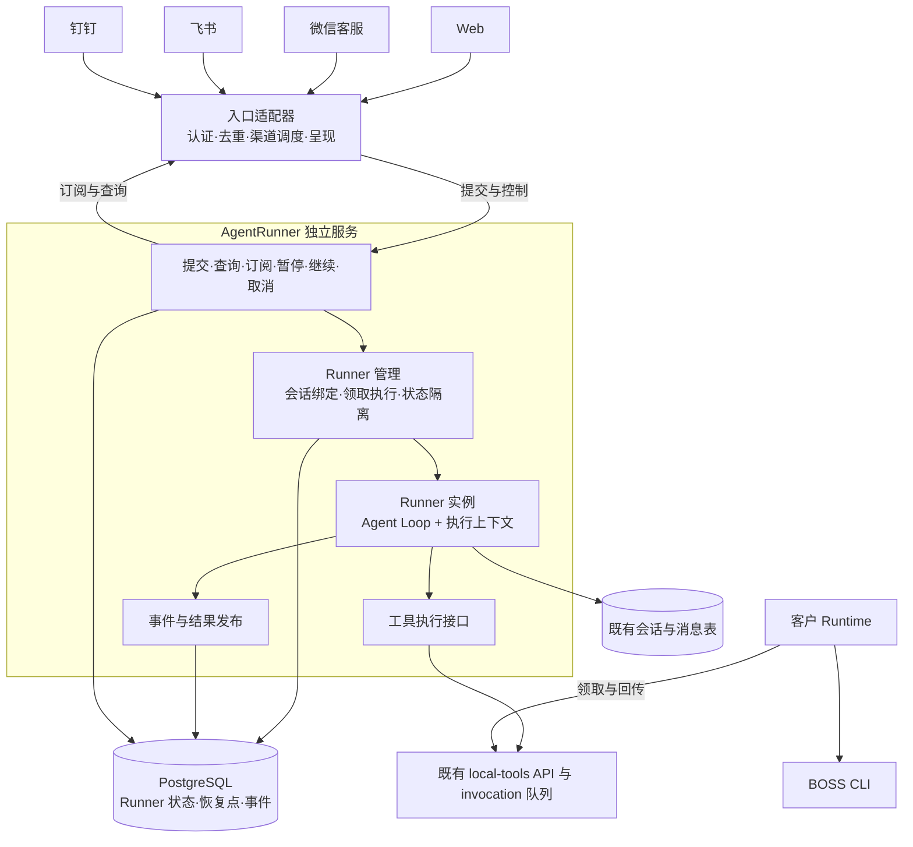

# AgentRunner 服务架构设计（独立执行 + 事件订阅 + 中断续接）

> 日期：2026-10-01
>
> 状态：M0–M5 核心、独立服务、Web恢复及事件订阅分阶段验收完成；M6微信客服文本、AI/人工语音及转人工片已验收，完整收发与其余渠道迁移中；默认迁移与综合验收仍待
>
> 关联：[母体 Agent 收敛原则](agent-kernel-convergence-principles.md)、[运行时安全加固设计](agent-runtime-safety-hardening-design.md)

> 开发计划：[AgentRunner 独立服务开发计划](../plans/plan-agent-runner-service.md)

> 2026-10-04 用户取消剩余 M6a 工作并要求交接：最后独验16通过、2失败，M6a未完成，不再继续修复或复验。后续由接手者决定；原功能等价迁移要求与已撤销错误门槛见开发计划「M6a 最终收尾契约」及[正式交接](../plans/agent-runner-m6a-handoff-2026-10-04.md)。

## 1. 已确认的目标与范围

服务名称为 **AgentRunner**。Web、微信客服、飞书、钉钉共用这套独立服务。入口提交请求后，服务为实际执行的任务分派一个 runner；runner 绑定现有会话，自主执行，保存运行上下文，并发布过程与结果事件。

- runner 是一次任务的逻辑执行实例，不代表为每个请求创建一个操作系统进程。
- 页面只是任务发起者和观察者。刷新、切换或关闭会话页面不取消 runner；重新打开页面能找到该会话中的 runner，继续查询状态和结果，也可重新订阅。
- 采用“持久接单 + 主动查询 + 事件订阅增强”。请求被持久接受后返回成功和 runner_id，仅代表接单成功；执行后来仍可能失败。查询是状态与结果的基础，订阅用于及时提醒变化，订阅不可用时仍可完整使用。
- runner 支持暂停和继续。执行进程异常退出后，也能识别中断并从已保存的恢复点继续；不承诺恢复到任意一行代码或还原内存协程。控制按各入口现有能力适配，微信客服不提供暂停按钮，不将 Web 按钮操作当作其使用流程。
- 同一次执行可以有多个经过授权的订阅者，订阅不再次启动任务，也不自动向全部渠道广播。
- 第一阶段先打通 Web，再逐个接入微信客服、飞书、钉钉。最终验收包含四个入口与现有客户工具链。
- 本次明确重构不合理的核心架构，所有内部接口和文件都可调整。前端界面、操作方式及现有功能保持，允许改传输层、数据同步和服务适配，不新增暂停/继续等用户操作作为迁移条件。
- 客户正在使用的 Runtime + BOSS CLI 是本地工具执行链路，必须保持兼容，不要求客户为此次服务拆分重新安装、配对或修改配置。
- 定时任务、调试 CLI、企微个人 RPA、桌面 D1、Runtime 自动会话决策不迁移，保留原有流程；未来自有客户端预留相同接口。

此次确认的“中断继续”要求真正持久保存上下文。旧设计中的“不新增表”“持久执行以后再做”“断线可能取消执行”不再适用。本次包括主/子 Loop 共用内核、上下文/工具/生命周期分离及四入口迁移，不捆绑通知中心、其他入口服务化或大规模分布式调度。

## 2. 改造起点与迁移前提

下表记录 M0 核对的旧实现，作为迁移基线；当前实施状态与验收证据见开发计划。

| 当前位置 | 已核对的行为 | 迁移要求 |
|----------|--------------|----------|
| Web 流式 `/api/chat/stream` | SSE 输出、取消判断、记录收尾、消息落库（含取消轮次） | 移交执行生命周期；外部 SSE 格式由适配器兼容；页面断线与取消明确分离 |
| Web 同步 `/api/chat` | 调用 `process_message_sync` 后返回 JSON，路由自身没有消息落库逻辑 | runner 的运行记录必须保存；是否补充用户可见聊天消息是单独行为决定，不能当成已有逻辑 |
| `channels/session.py` | 合并窗口、取消重跑、消息批量落库、回复发送、发送成功后 recap | 保留渠道规则和发送收尾边界，不在模型返回时提前释放现有渠道锁 |
| `session_queue` | 合并、排队、取消重跑、锁和租约 | 不是纯锁，不能整套套用到 Web |
| 主 Agent | 路由返回共享实例，仍有 `_init_tenant_id`、`_last_response_images` 等状态 | 包一层服务不会自动解决并发串数据，先做执行隔离 |
| Runtime + BOSS CLI | 云端创建本地工具 invocation，Runtime 领取、执行并回传 | 沿用设备认证、操作协议、结果与工具计费；自动会话决策另有触发流程，本次不合并 |

起点 `agent.py` 为 4026 行，结构守卫基线为 4026。行数仅作为辅助；最终以真正运行路径、职责归属和依赖边界验收，不能只包装旧 Agent 或移动大文件后宣称完成。

## 3. 架构与职责边界

| 部分 | 负责 | 不负责 |
|------|------|--------|
| 入口适配器 | 外部协议、验签、身份映射、平台消息去重、渠道入站合并、补充意图及发送节奏、订阅消费、展示及实际回发 | 持有执行协程、重复关闭执行记录、决定 Loop 如何恢复 |
| AgentRunner 服务接口 | 校验主体和会话归属，创建/查询 runner，订阅，暂停/继续/取消 | 信任终端自报的 tenant/user，把 HTTP 连接寿命当成任务寿命 |
| Runner 管理 | 持久状态、会话绑定、执行领取与占有、并发限额、恢复、单一收尾责任 | 渠道文案、发送 SDK、具体领域判断 |
| Runner / Loop | 根据独立上下文运行模型和工具，在安全点保存恢复点，产生执行事实 | 持有浏览器连接、直接调用渠道发送、在共享实例保存请求身份 |
| 上下文仓储与装配 | 读取历史/记忆，组装模型输入，保存 runner 恢复上下文 | 用聊天历史代替尚未结束的工具执行状态 |
| 事件发布与查询 | 顺序、持久记录、脱敏、权限、补读、最终结果 | 保证平台消息恰好发送一次，直接广播原始内部工具数据 |
| 工具执行接口 | schema、权限、上下文、服务端执行或本地代理、结构化结果 | 让 Loop 判断 BOSS/微信特例 |
| Runtime + Provider | 客户设备上的领取、实际操作、进度及结果回传 | 作为新的聊天入口或持有云端 Agent Loop |

依赖方向为入口 → 服务接口 → Runner 管理 → Loop。独立 bootstrap 初始化配置、数据库、模型和工具，不导入 `src/main.py` 获取全局实例，不启动渠道 SDK、Web UI 或定时任务。

共享对象只保存配置、连接和可安全复用的资源。身份、图片、工具消息、Trace、取消和压缩临时状态属于单次 runner。请求在可信边界复制/冻结；ContextVar 按 token 恢复外层值。数据读取、压缩、记忆写入有副作用，不能将整个上下文模块称为纯函数。

子智能体在父 runner 内有独立子上下文和 Trace，汇总用量，不重复建立顶层会话或获取父执行已持有的锁。主/子共用一个 Loop engine，通过角色策略区分工具权限、轮数和澄清语义，不保留第二套模型循环。

### 3.1 本次核心拆分的验收契约

| 模块 | 输入/输出及责任 | 不允许的耦合 |
|------|-----------------|--------------|
| ExecutionState | 版本化主体/会话/Profile 引用、messages、阶段/迭代、pending calls、加载技能、等待/计划、产物和用量水位 | User 可变实例、连接、共享请求身份或内存协程 |
| Loop Engine | State + 模型/工具/控制/观察接口 → Outcome；仅模型迭代、响应解析、调用配对、pending 推进、安全点与终止判断 | main、channels、具体数据库仓储、计费/SessionRecordManager、领域 SDK |
| ContextAssembler / PromptBuilder | 仓储读取与准备、纯 prompt/messages 格式化分别负责；压缩/记忆写入由应用协作 | 将 IO 伪称纯函数，依赖某个渠道路由 |
| ToolDispatcher | 普通/本地/控制/子任务统一返回结果、上下文变化或等待信号 | 让 Engine 按工具名称处理 BOSS/video/wecom 特例 |
| Lifecycle / Runner 应用层 | 锁与占有、checkpoint、取消/恢复、消息/结果、Trace/计费的单一责任方 | 入口和内核重复落库/收尾，网络订阅持有执行生成器 |
| 旧 Agent API 适配壳 | 旧参数映射 State，使用新 engine，转换旧 event/text 返回格式 | 保留巨类真实运行路径或第二套主/子循环 |

每个 ExecutionState 的模型步骤只属于本 execution，保存响应及应用水位以供原步骤恢复。子执行的模型步骤保存在对应 children checkpoint，不能为汇总用量把子响应复制进父 model_calls。结果展示的子/孙总用量由应用层按稳定 execution/call 去重聚合，计费由实际调用收据负责；旧恢复点按明确归属兼容，缺失活跃子状态不能猜测继续。该边界已在 M4 真实续接中暴露缺陷，作为本期冻结与验收门槛整改。

工具内部的识别、遮挡判断等模型调用同样记录实际收据，但其恢复步骤属于领域适配器，不能塞入 Engine 的主模型步骤。按份业务费用覆盖 token 的许可由应用 owner 绑定原操作、具体项目与冻结模型，普通用途字段不具有免账权限；直接指定模型的调用也必须经过中立物理观察端口。已发生动作的原结果与审计保存、下一动作的派发是不同许可：取消阻止后者，仍有效的原执行可保存前者；失去执行权时不得借新 owner 的身份写恢复点。

以上是最终架构约束，可渐进交付；M1 每个切片也要明确迁出责任和真实调用链。依赖检查必须结合代码审查与真实执行测试，不能只检查新目录的 import。租户和会话引用传至本地工具必须来自 ExecutionState，不能从共享 Agent 的实例字段读取。

## 4. Runner 与会话、请求的关系

- `session_ref = tenant_id + 会话种类 + session_id`：指向现有 Web 或渠道会话，服务端校验归属。不能仅靠客户端传来的字符串或读表 fallback 判断会话来源。
- `runner_id`：一次任务的稳定编号，暂停/继续不变。一个会话可以有多个历史 runner。
- `attempt`：runner 每次取得执行权的尝试编号，恢复后增加；旧尝试不能再写状态或提交新工具操作。
- `client_request_id`：按服务端导出的 tenant/global scope、主体、来源持久去重的创建键。同键同输入返回原 runner，同键不同输入（包括换会话）拒绝。
- 一个会话同一时刻最多有一个推进对话的 runner。暂停/等待的 runner 保留逻辑会话位置，但释放执行资源，不长期持有物理锁。
- 新普通消息默认排队，不偷偷改写正在运行或暂停 runner 的恢复点；澄清回答和工具结果必须明确关联原 runner 的等待标识。切换任务需显式结束/取代原 runner。
- 渠道既有合并策略由适配器维护：接单前多条消息可合并为一个 runner，重复消息或 merged follower 关联 owner，不各自启动、回复或重复计费。接单后的原输入不覆盖；processing期间晚到消息在原Runner安全点保存补充意图并续接、复用已发生事实，发送cutoff后再排下一轮。真正取消/取代时保旧事实及新旧关联，不能用新Runner重演旧合并输入来恢复未知或已完成操作；具体渠道控制接线在M6单独验收。
- runner 自己持久保存运行上下文；现有消息表继续保存面向用户的会话历史。Web 只读写 `chat_messages`，渠道只读写 `channel_messages`，不统一表。

## 5. 自主运行、暂停与恢复

### 5.1 执行状态

持久执行状态包括 queued、running、waiting、paused、interrupted、finalizing、completed、failed、cancelled。暂停请求与已暂停分开；waiting 的原因区分等待用户输入或工具结果，不能把两种等待混为一类恢复。渠道保留合并cutoff与补充意图；真正取代任务才记录新旧关联（M6），不覆盖或重演旧任务事实。状态与原因分别记录，轮数耗尽不能因有文本就标为 completed。

- 暂停：在下一个安全点保存上下文并进入 paused，可继续。正在进行的不可撤销操作不能靠暂停撤回。
- 取消：结束 runner，不提供同编号继续；已发生的操作及用量照实记录。
- 等待输入/工具：保存等待标识并释放执行资源，合法输入到达后继续同一 runner。
- 中断：执行进程退出或丢失执行权，任务未正常结束；经过工具结果核对和重新授权后可继续。
- 服务恢复后扫描 queued 与失去有效执行权的 runner。queued 可领取；中断 runner 标记 interrupted，首期默认由用户/受信业务调用显式继续，不静默重跑工具。

### 5.2 保存什么上下文

恢复点必须是版本化、可序列化的数据，不能保存 Python 协程、回调、连接或内存对象引用。至少包含：

| 内容 | 用途 |
|------|------|
| 已校验的会话/主体引用、AgentProfile 版本及配置引用 | 重新装配并校验恢复权限；不保存密钥或设备令牌 |
| 当前 system/messages、摘要版本、压缩状态、模型参数和迭代位置 | 恢复同一任务的模型上下文，不重建成另一套历史 |
| 模型已返回的 tool_calls、每个调用的阶段/结果与稳定调用标识 | 已完成的不重复执行，尚未完成的逐项核对 |
| 本地 invocation、等待用户/工具的受控引用 | 接续原有 Runtime 或澄清流程 |
| 累计输出、图片/产物引用、usage/record 关联及处理水位 | 最终结果与用量衔接，不重复记账或重复落库 |
| checkpoint schema 版本、revision、attempt 与时间 | 拒绝旧尝试覆盖及不兼容恢复 |

恢复前重新检查租户、会话、智能体和工具权限。配置或工具版本不兼容、文件已失效时返回明确的恢复失败，不能静默改用新配置。大文件保存稳定引用和有效期，不塞进上下文或事件。

普通暂停或中断后的补充要求，沿既有输入框提交给原 Runner 的 resume 控制；澄清回答仍匹配原执行叶的 wait。原接单输入与摘要不改写，补充输入有独立稳定标识。先使用已保存的模型响应并配齐原工具结果、恢复原 owned 子树，再让主执行读取新要求进入下一轮；不能仅把要求写进历史却未交给模型，也不能为继续重置迭代预算或重做已完成操作。空继续与澄清镜像保留原行为。

### 5.3 恢复点与工具副作用

1. 接受输入后保存初始恢复点；读取权威会话历史后冻结本次使用的历史版本。
2. 模型响应完整解析后、工具派发前保存 tool_calls；每个工具调用前登记稳定调用编号和执行意图。
3. 复用已有本地 invocation/工具幂等机制。工具完成后保存其结果，再继续模型；恢复时已有结果直接使用。
4. 工具调用中断且不知道是否已生效时，先按原调用标识查结果。BOSS 发消息/打招呼等不可盲目重发；无法查清则等待核对或人工处理。
5. 单纯重新调用模型通常不产生外部写入，但会增加费用，也可能输出不同内容。中断中的模型请求标明重试原因和已知用量，不宣称精确重放。
6. 不保证恢复尚未收到完整响应的每个 token。已展示的输出用稳定片段标识和替换/重建规则恢复，不能把重试输出直接追加成重复回答；Web 适配器需要单独验收这一新增行为。
7. 暂停点、等待点、压缩后和最终收尾也保存恢复点。最后可恢复位置必须明确，不能展示“已暂停”但实际上没有持久保存。

工具状态确认、取消和写操作许可沿用现有工具/Runtime 机制；不自行另建一套通用加密或操作授权协议。

收到取消请求不等于外部设备已经停止。原本地调用仍为 claimed/running/cancel_requested 时，Runner 只能请求取消并查询原调用；确认可信终态后才能宣布任务取消、释放会话占有和清理资源。原 queued 调用可原子取消且确认没有效果；无法确认效果或期限已过仍无结果时，公开等待核对并保留会话占有，不能放行下一任务或重新派发。每次取消和收尾使用本次执行最初取得的 attempt，读取最新记录不会赋予旧进程新的执行权。

### 5.4 防止两个执行者推进同一 Runner

持久状态与 revision 条件更新、执行领取、有限 lease/续期及 attempt 校验属于恢复能力的必要部分，不是可省略的优化。丢失执行权的旧执行者不能提交状态、结果或新的工具操作；写工具还必须沿用自身许可/幂等约束，数据库 fencing 本身不能撤销已经发出的外部动作。

执行 owner 已在事务中合法提交终态或安全停稳、释放 lease 后，心跳应依据原 attempt 的持久释放事实停止，不能反过来取消尚在提交后收尾的任务。仍在执行/收尾事务中的任务继续续租；真正过期、换 attempt、资源不可核验或数据库故障保持失租中断，不能用统一吞异常代替生命周期判断。

首期一个独立执行 worker，async 并发执行不同会话；服务 API 与订阅可有多个 worker。API 持久写入创建/控制请求，执行 worker 从数据库领取任务并在安全点检查暂停/取消；通知仅加速唤醒，不依赖接口进程持有执行对象。恢复、重复继续、进程重启仍要有数据库领取和条件更新，不能因单 worker 就依赖内存锁。多执行节点自动扩容不是首期目标，但不能未经验证增加 worker 数。

现有渠道的合并、锁及回发边界逐个迁移：保留原发送后释放锁的行为，避免服务再次获取适配器已持有的锁。跨暂停不长期保留旧 lease，恢复时重新协调；渠道后续消息不得绕过会话逻辑占有。具体 handoff 必须在该渠道切换前以并发、取消重跑和发送失败用例验证。

## 6. 查询基础、事件订阅与结果

首个 Web 闭环通过主动查询获得状态、公开进度和结果；活跃页面有限频查询，终态停止，网络错误退避，页面卸载只停止观察。实时 SSE 随后增强，任何通知缺失都通过查询纠正。公开快照包含 revision，消费者对齐累计输出，不能反复追加全文。

### 6.1 一份执行事实，多种呈现

Loop 内部事件与用户可订阅事件分开。工具原始结果、内部提示词和完整 Trace 不直接广播。服务统一发布经过脱敏和可见范围处理的事实，入口负责怎样呈现。

| 信封字段 | 含义 |
|----------|------|
| `version` | 订阅协议版本 |
| `runner_id` | Runner 编号，会话归属从经过授权的查询取得 |
| `attempt` | 本次执行尝试，恢复后变化 |
| `seq` | 同一 runner 内持久递增的序号，恢复不归零 |
| `kind` | created、revision_changed、terminal、settlement_changed |
| `invalidate` | 固定 true，提示读取权威状态 |
| `view_revision` / `control_revision` | 对应已提交的公开状态和控制水位 |
| `status` / `settlement_status` | 执行与结算状态 |

M5采用精简通知：上述字段组成公开事件，不复制完整输出、恢复点或工具数据；服务端时间留在存储行，排序依赖seq。开始、进度、工具摘要、回复、图片/产物、暂停、等待、继续、中断和最终结果仍从原公开快照取得，沿用已有安全展示投影及verbose五字段结构，入口负责呈现或渠道回发。seq分配与事件写入在对应状态事务内进行，不由并发工具各自编号；纯输出通知短时合并，重要状态和终态立即发布。新增渠道只增加适配器，Loop不增加渠道判断。

### 6.2 订阅规则

- 按 runner 订阅，携带 `after_seq`。查询会话 runner 列表后可重新连接；只允许发起主体和明确授权的参与者访问，同租户不自动拥有全部任务权限。
- 一个 runner 可以被多个 Web 页面或受信渠道消费者观察；新增订阅只读事件，不调用模型或工具。
- 创建任务与订阅之间产生的事件必须补读。补读和实时等待使用同一个持久游标，不通过“先查、再连通知”留下漏读窗口。
- 同一 runner 按 seq 顺序读取，恢复不重置。重连允许重复交付，消费者按 `(runner_id, seq)` 去重；不同 runner 不承诺全局顺序。
- 关闭、刷新、切换页面仅断开订阅。取消或暂停必须经独立接口明确提出，其他订阅者不受连接断开的影响。
- 平台限频、订阅断线、慢消费者不阻塞 Loop。连接使用有界缓冲和超时，超限关闭该连接，随后按游标补读。
- 事件保留时间和容量有限；游标过期、超前或存储缺洞明确返回reset及同一读取快照的head/floor。前端查询状态、累计输出和最终结果重建页面，再从reset水位订阅，不重跑任务；实时流超出帧容量时只发有界查询提示，不截断权威正文。
- 多订阅者不意味着重复回发。观察权限、取消权限、实际投递责任分别定义；每个目标渠道只有一个发送 owner，发送与 recap 沿用现有条件。

### 6.3 最终结果不依赖连接

最终结果含 runner 编号、终态和原因、完整回复、图片/产物及必要的等待引用。runner 存储最终结果，独立查询接口始终是恢复页面的依据，不能只存在于某次 SSE 响应。

完成收尾时，runner 最终状态、结果及必要的会话写入在同一数据库事务中提交，避免出现“显示成功但消息未保存”；事件能力启用后，结束事件也在该事务提交。旧用量台账用稳定 runner/调用标识衔接，沿用现有收费规则，恢复尝试不能重复扣同一已记录调用的费用。跨系统外部效果不宣称事务原子性。

Agent 执行结束和平台消息送达是两个事实。平台发送失败不回滚已发生的执行，也不自动重跑工具。平台无法确认是否发送时，沿用既有失败/去重策略，不承诺恰好发送一次。recap 的发送成功条件保持。

## 7. 独立服务接口与存储

### 7.1 服务接口

先提供内部版本化 HTTP 提交、查询与控制接口，随后增加 SSE 实时增强；不把 SSE 作为 Web 首个可用闭环的前置条件。路径建议见开发计划，M0 冻结职责与资源操作，具体字段和数据库 schema 在 M2 实施前细化复核，最终至少提供：

| 动作 | 行为 |
|------|------|
| 创建 runner | 持久接受并返回 runner_id，重复提交返回原实例，执行不依赖请求连接 |
| 按会话查询 runner | 列出活跃及历史实例，供刷新页面恢复展示 |
| 查询 runner/结果 | 状态、最新可见输出、结果、暂停/等待原因及可用操作 |
| 订阅事件 | 按 runner 和 after_seq 补读并持续接收 |
| 暂停 | 请求安全点暂停，响应区分“已请求”与“已保存并暂停” |
| 继续/提交等待输入 | 校验恢复点、等待标识与权限，幂等取得执行权，runner_id 不变 |
| 取消 | 结束任务，重复取消幂等，不撤销已生效工具操作 |

浏览器继续走现有 Web 网关，三个渠道继续使用现有回调入口。网关把身份和协议转换为受信请求，不能让终端任意指定租户、用户、内部扩展提示词或设备许可。SSE 不要求入口 worker 与执行 worker 相同。

### 7.2 最小持久模型

持久模型按阶段建立，字段、索引和迁移以开发计划及实际 DDL 为准：

- `agent_runners`（M2）：tenant、user、会话种类与 session、请求去重键、状态、attempt/lease/revision、最新版本化 checkpoint、可见输出/最终结果、record 关联与时间。
- `agent_runner_session_claims`（M2）：按内部 scope_key/kind/session 唯一，保存逻辑 owner_runner_id 与 revision。scope_key 是认证主体导出的 tenant/global 命名空间，保留真实 nullable tenant；global 仅允许平台管理员自己的全局 Web 会话，渠道必须 tenant-bound。它不等于 worker lease：暂停/等待仍占有会话，渠道执行完成但发送未收尾时也需要保留占有；queued 不占有。取得会话占有与领取执行同事务，Web 结果提交后释放，渠道按既有发送收尾规则释放，不因 TTL 自动让后来任务绕过。
- `agent_runner_usage_receipts`（M2）：稳定调用/用量事实、实际模型/提供者、用途、原始 usage、计价快照及观测/结算状态。计费独立于公开订阅事件；迟到事实在原 record 上幂等补记差额，不授予旧 worker 执行权，不更改已提交结果。
- `agent_runner_controls`（M4）：私有暂停/继续/补充命令、稳定去重键/摘要、目标execution/wait及单次消费事实。与原claim/new attempt/checkpoint提交协作，不承担公开事件或计费；回答与原始附件不直接作为公开命令payload。
- `agent_runner_events`（M5）：tenant、runner、seq、类型、脱敏 payload、时间；按 runner/seq 唯一，对应公开状态变化与事件在同一事务提交。M2–M4 的查询及恢复不依赖事件表。

上下文首期保存最新恢复点，不默认保存每次完整历史副本。事件、上下文、产物及 runner 的保留期/容量上限分别定义；活跃或可继续的 runner 不能被过期任务静默清掉恢复点。无效文件引用、schema 不兼容和过期恢复必须返回明确原因。

数据库是执行与恢复的权威来源。Redis 可作通知/缓存，通知丢失时仍能按数据库游标补读；首期可以有限频数据库等待查询，不将消息中间件、通用 outbox 或通知中心设为上线前置条件。事件持久写入不可用时停止向后推进并报告故障，不静默丢弃恢复事实。

所有读取、更新、领取、订阅、继续都校验当前可信主体、tenant 和会话归属，不能只用 runner_id 查全局数据。创建、执行与继续还检查当前智能体执行权限；读取已有结果与取消本人任务沿用既有历史归属权限，智能体订阅过期不剥夺历史访问。渠道读取/控制按本次可信平台主体与路由授权，不能用待查询记录中的身份自证。新增系统表实施时同步数据库系统表文档及变更记录；M2 三表、实际独立 worker 与事务收尾已验收，Web迁移、恢复、事件及渠道仍须各阶段验收。

### 7.3 运行时兼容与配置

独立 bootstrap 初始化真实模型、工具和历史仓储；服务不读取 `main.py` 全局取消对象。可恢复上下文保存资源引用，启动时重新装配连接与工具，不保存凭据。模型、工具、上下文仓储、事件仓储经明确接口注入。

本地工具继续使用既有 local-tools API 与 invocation 仓储，Runtime 不需要直接订阅聊天事件。独立服务必须能访问既有设备绑定、文件/产物、结果和计费记录。恢复已有 invocation 时查询其结果和状态，不重新下发同一个 BOSS 写操作。

API 与执行 Worker 使用同一个 `AGENT_RUNNER_STORAGE_ROOT` 产物挂载，不能依赖进程 cwd 相同。中性存储 helper 负责显式 owner 目录；可信 NULL tenant 对应匿名目录，与无主体的旧文件交付 URL 区分。所属目录读取、写入和文件注册沿同一根，目录或父级符号链接不得将该 owner 的范围改成另一租户。旧公开 opaque fileId 交付政策保持兼容，Runner 的所属目录查找不借其全租户扫描兜底。

Runtime 自动会话任务、云端决策和未迁移入口维持原有执行流程；共享依赖的变化需兼容回归，不要求统一其状态机。

## 8. 分阶段实施与验收

每一步独立验收和回退，先证明一个入口的完整闭环可用，再增加入口。新路径先新增，旧调用方不提前转调。每切一个入口明确消息、费用、Trace、锁及发送的唯一责任方。

| 阶段 | 内容 | 核心验收 |
|------|------|----------|
| S0 | 固化四入口和 Runtime 的行为基线，细化状态/恢复点/事件契约及最小存储 | 真实字段与权限明确；失败、并发、取消、合并/重跑、工具挂起及计费均有相关基线，不用一条成功快照代替 |
| S1 | 隔离单次执行状态，提供最小 Loop 恢复边界 | 跨租户/会话不串图片与身份；嵌套上下文正确恢复；已有工具结果能继续使用 |
| S2（M2–M4） | 独立服务接单/查询 → Web 提交与轮询 → 暂停/恢复；同步旧接口随后兼容 | 关闭页面继续执行；刷新找回；重复提交不重复执行；授权拒绝正确；进程中断后从恢复点继续；未知工具结果不盲重发；消息和用量不重复 |
| 实时增强（M5） | 持久事件与 SSE，查询作为独立基础和通知故障时的依据 | 多订阅不重复执行；晚订阅/重连可补读；关闭所有订阅仍能运行；慢订阅不阻塞；可按需要后移，不能取消交付 |
| S3a | 只迁移微信客服 | 合并/补充意图、发送锁边界、图片/文件、发送失败与 recap 兼容；已发生操作保留原事实，不取消后从头重演；单独回退 |
| S3b | 只迁移飞书 | 同上，独立验收；微信客服和未迁移入口不受影响 |
| S3c | 只迁移钉钉 | 同上，独立验收 |
| S4 | 四入口与 Runtime + BOSS CLI 联调、容量和故障验收 | 并发不串数据；慢订阅不拖执行；重复继续/重启不双执行；客户无需重配；真实本地工具的领取/进度/结果/取消/恢复/计费正确 |

S2 内先实现真实 Web → runner → 主动查询结果闭环，再补齐暂停及故障恢复验收；不能在只有聊天接口包装时宣布 Web 阶段完成。实时增强不阻塞先用查询验证渠道。新增服务、页面观察/取消分离和恢复是显式行为变化，不再将每个提交笼统称为纯结构调整。

后续按实际需要拆上下文与收敛主/子 Loop，不把全面拆分作为 S2 前置条件。不迁移的入口仍有旧方法调用时，保留兼容路径，不提前删除。

开发、独立测试、CodeReview、提交和部署按项目规则执行。M0–M4 已分阶段验收，M5实时订阅正在实施；三个渠道及默认迁移继续后续验收。各阶段进度与验证范围写在开发计划，未完成阶段不提前切换默认入口；提交和部署分别遵循用户授权。

## 9. 必须验证的失败边界

| 场景 | 要求 |
|------|------|
| 提交成功但响应丢失、客户端重试 | 相同去重键返回原 runner，不再次调用模型或工具 |
| 同时点击继续、旧 worker 恢复响应 | 只有一个 attempt 获得执行权，旧尝试不能覆盖结果或发新操作 |
| 模型返回后、工具派发前崩溃 | 已保存 tool_calls，恢复按原调用标识推进 |
| 写工具生效后、结果入库前崩溃 | 查原操作状态，未知则等待核对，不盲重发 |
| 最终结果入库后、事件通知丢失 | 订阅补读或结果查询可见完成，不重跑任务 |
| 前端关闭、刷新、多个观察者、慢连接 | 执行独立，事件按序补读，身份与可见性隔离 |
| 暂停后出现新消息/渠道重跑 | 不改写恢复点，不让两个 runner 同时推进同一会话 |
| 工具/配置版本变化或产物失效 | 明确拒绝不兼容恢复，不默默换配置或丢失上下文 |
| 容量达到上限、持久存储失败 | 有界拒绝或安全停止，不无限缓存、不丢恢复事实后继续 |
