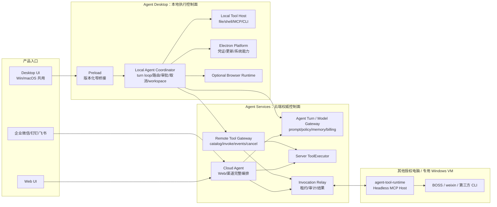

# Agent 跨平台桌面客户端设计 v2.3

> 初版日期：2026-07-14
>
> v2.3 日期：2026-08-12
>
> 状态：🔧 整体架构基线已锁定，分阶段开发中
>
> 适用平台：Windows 10/11 x64、macOS 13+ x64/Apple Silicon
>
> 开发计划：[desktop-agent-client-dev-plan.md](./desktop-agent-client-dev-plan.md)
>
> 构建手册：[desktop-agent-client-build-manual.md](./desktop-agent-client-build-manual.md)
> 关联：[企业 Agent 平台总体架构](enterprise-agent-platform/enterprise-agent-platform-integration-design.md)、[浏览器混合执行与人工接管设计](../tools/browser/browser_visualization_design.md)、[第一方 CLI / MCP Provider 规范](first-party-cli-mcp-provider-standard.md)

## 1. 决策摘要

Agent Desktop 采用 **Electron + 独立 Vue 3 Desktop UI + 本地 Agent Coordinator/Local Tool Host + 云端 Agent Services**。本地 Coordinator 是 Desktop 的执行控制面，不是附加模块；现有 Python Cloud Agent 继续服务 Web/渠道，并向 Desktop 提供模型、策略、记忆、计费和远端工具服务。

1. `frontend/web/` 是已经稳定的 Web 产品，目录、页面和发布链路优先保持稳定。
2. `frontend/desktop/` 新建 Windows/macOS 共用的一套桌面 UI，不再把 `web` 页面外壳直接装入 Electron。
3. `frontend/shared/` 只保存经过验证可复用的业务逻辑、类型、纯组件和设计基础；从 Web 逐模块提取，不进行一次性大搬迁。
4. `clients/agent-desktop/` 长期保留，保存 Electron main/preload、桌面原生 Host、可启用的本机工具执行 Host、系统能力和发布工程，不保存 Vue 页面。
5. Web 与 Desktop 共用服务端 API 和业务契约，但路由、页面外壳、导航、布局、快捷键、更新和本地能力 UI 分开。
6. Windows 与 macOS 共用 Desktop renderer；系统差异封装在 Electron 平台层，不复制两套桌面页面。
7. `/portal/**` 永久属于 Web 平台后台，不进入 Desktop renderer 或安装包。
8. 标准 MCP Provider Host 是正式 Desktop 的核心能力；Browser Runtime 仍是有独立进入门禁的可选能力。Provider 故障不得拖垮聊天等云端 Agent 主链路。
9. Desktop 必须提供受控的通用本地工具执行能力，包括本地命令、文件和系统能力；否则只能称为桌面 UI，不能称为完整 Agent 客户端。
10. Desktop 由本地 Agent Coordinator 驱动 tool-call loop：本机工具直接调用 Local Host；模型/租户策略/长期记忆仍经服务器；服务端工具通过受控 Remote Tool Gateway 调用。Web/渠道继续使用现有 Cloud Agent。
11. `clients/agent-tool-runtime` 长期保留为远端/headless 边缘执行节点；Desktop 与 Runtime 不做 P2P，跨设备任务统一经后台 Invocation Relay 中转。
12. Desktop 创建的 `DEVICE_OWNED` 会话以本地持久化事件流为执行权威。用户消息、Agent 消息和进度摘要可以同步到云端数据库供 Web/移动端查看与接续，但同一会话的 Coordinator、所属设备、workspace 和执行环境不可因接续而改变。

这不是线上 Web 的 BrowserWindow 薄壳。正式客户端加载安装包内静态资源，仅连接配置好的 HTTPS/WSS 服务；禁止加载远程页面后赋予 Electron 权限。

## 2. 目标、非目标与产品范围

### 2.1 产品目标

- 提供适合桌面窗口的信息密度、导航和任务状态体验，而不是手机/Web 响应式布局的放大版。
- Windows、macOS 拥有一致的 Agent 核心体验和明确的平台原生行为。
- Desktop 在本地维护回合循环、工具调度、审批、取消与 workspace 状态，使当前电脑上的文件、命令和 MCP 工具无需绕行服务器执行。
- Web 每个迁移 Phase 都可以独立发布，Desktop 开发失败不得阻塞 Web 上线。
- 登录、对话、后台多会话、文件上传/预览/下载、知识库、数字员工和本地工具形成可交付闭环。
- 凭证、下载、外链、更新、本地进程严格经过窄化平台能力边界。

### 2.2 Desktop 功能分层

| 层级 | 功能 | 首次独立 UI 版本 |
|---|---|---|
| P0 核心 | 登录、对话、流式输出、多会话、附件、错误恢复 | 必须 |
| P1 工作台 | 数字员工、知识库、全部会话、本地工具管理 | 必须或按页面逐项启用 |
| P2 桌面能力 | 更新、下载、外链、设置、诊断、深链、系统菜单 | 必须 |
| P3 业务工作台 | 数据源、内容/视频、跟进、报价等复杂业务页面 | 逐页桌面化，不默认照搬 Web |
| P4 边缘执行 | 本地命令/文件/系统工具、MCP Provider Host、远端 `agent-tool-runtime`、第一方/第三方 CLI | 正式版必须；具体权限按节点启用 |
| P5 浏览器执行 | Browser Runtime、人工接管 | 可选模块，满足服务端门禁后启用 |

P0 对话由 Local Agent Coordinator 驱动；P4 是其本地/远端工具执行面。二者不是两个互不相关的功能包。

Desktop 未实现的 Web 管理功能通过系统浏览器打开稳定 Web 地址，并显示离开应用提示；不得在 Electron 中嵌入远程 Web，也不得静默降级为 Web 页面。

### 2.3 明确非目标

- 不实现离线大模型或把 Python 服务、数据库、模型 Key 打进客户端。
- 不把现有强依赖 Redis/数据库/租户系统的 Python `Agent` 全量复制进安装包；本地化的是协调和执行循环，不是复制服务端基础设施。
- 不封装平台管理员 `/portal`，不提供隐藏入口。
- 不一次性复制全部 Web 页面或全部迁移至 `shared`。
- 不让 `desktop` 直接依赖 `web` 形成长期耦合。
- 不为 Windows/macOS 分叉两套业务 UI。
- 不直接控制用户默认 Chrome Profile。

## 3. 当前基线与差距

### 3.1 已完成事实

- `frontend/src` 已原样迁移为 `frontend/web`；Web typecheck/build、Desktop build 和 artifact 门禁通过。
- Web 与 Desktop 已有独立 HTML/entry/output；Desktop 构建拒绝 Portal-only 模块。
- Electron Windows 壳已实现安全自定义 scheme、单实例、窗口状态、缩放、深链、精确 CSP、导航/权限拦截。
- Desktop CredentialStore 使用 `safeStorage`；下载、外链、API 配置和自动更新均通过窄 IPC。
- Windows x64 unsigned 开发安装包、ASAR 校验、SBOM、audit、license、manifest 和 packaged smoke 已实现。

### 3.2 主要差距

- `frontend/web/main.desktop.ts` 仍复用 `web/App.vue`、`agentRoutes`、`ChatContainer`、`MenuSidebar` 和全局样式；桌面 UI 尚未独立。
- `desktopRoutes = [...agentRoutes]`，Web 路由变化仍能影响 Desktop。
- 尚未实现版本化 Agent Turn Protocol、Local Agent Coordinator 与 Remote Tool Gateway，当前 Desktop 仍由既有云端调用方式驱动。
- 共享逻辑仍分散在 `web/api`、`web/composables`、`web/types`，依赖方向尚未收口。
- 更新 UI 仍嵌在 Web `MenuSidebar`；离线/启动失败 UI 仍由 DOM 内联样式生成。
- macOS 没有 builder target、图标、entitlements、签名、notarization、更新产物或真机证据。
- Windows 正式证书、生产更新源、升级/回滚真机矩阵尚未闭环。
- 托盘/菜单策略、诊断中心和 Desktop MCP Host 尚未形成完整实现；现有 `clients/agent-tool-runtime` 已具备 Windows 配对、心跳、长轮询、Provider 管理和 MCP stdio 调用能力，应抽取复用而不是重写。
- 当前 `LocalToolProxy` 仍按单个 `selected` 设备和静态 BOSS catalog 查找节点，尚不能表达按 Provider/工具选择当前 Desktop 或远端 Runtime，也没有多候选交互。

## 4. 总体架构



这张图是实现和评审的权威主架构。Desktop 与远端 Runtime 不互相直连。当前电脑工具由 Coordinator 直接调用 Local Host；选择其他 Runtime 时，Coordinator 请求后台创建 invocation，由目标节点 claim 并回传进度/结果。Web/渠道不依赖 Desktop 在线，继续由 Cloud Agent 编排。

### 4.1 目录结构

```text
frontend/
  web/                          # 稳定 Web 产品
    main.ts
    App.vue
    router/
    components/
    api/                        # 迁移期保留；逐模块变为 shared 的兼容出口
    composables/                # 同上
    styles/
  desktop/                      # 独立 Desktop renderer
    main.ts
    DesktopApp.vue
    router/
    layouts/
    pages/
    components/
    composables/
    styles/
  shared/                       # 不知道是否共用的代码不提前放入
    contracts/
    api/
    domain/
    composables/
    components/
    styles/
    types/
    utils/
  index.html
  desktop.html
  vite.config.ts
  vite.desktop.config.ts

clients/agent-desktop/
  electron/
    main.ts
    preload.cts
    core/                       # 跨平台主进程能力
    platform/
      windows/
      macos/
  local-tool-host/              # 必备：MCP/CLI 生命周期、权限、调用与诊断
  browser-runtime/              # 独立门禁后的可选能力
  build/
    icons/
    entitlements.mac.plist
    entitlements.mac.inherit.plist
  scripts/
  tests/

clients/agent-tool-runtime/     # Web 用户/无 GUI 节点使用的独立 headless Host
clients/shared/
  agent-coordinator-core/       # Desktop 回合循环/调度/审批/取消；禁止 UI/Electron 依赖
  local-tool-host-core/         # 规划抽取：两个 Host 壳共用，禁止 Electron/UI 依赖
  mcp-conformance/              # 已有 Provider 一致性测试

contracts/desktop-agent/        # 跨 TypeScript/Python 的语言无关协议源
  agent-turn.schema.json
  tool-invocation.schema.json
  file-ref.schema.json
  device-capabilities.schema.json
```

### 4.2 为什么 `clients/agent-desktop` 必须长期存在

`frontend/desktop` 构建出的只是运行在 Chromium renderer 中的静态 UI。它不能安全地完成进程创建、MCP stdio、系统凭证、文件系统、菜单、深链、更新、签名和安装包发布。`clients/agent-desktop` 才是可安装产品的原生 Host 与发布边界，因此 Desktop UI 完成后不删除，反而要承担更明确的职责：

| 目录 | 长期职责 | 明确禁止 |
|---|---|---|
| `frontend/desktop` | 页面、路由、交互、本地工具状态与授权 UI | Node/Electron import、spawn、任意路径/命令 |
| `frontend/shared` | Web/Desktop 共用 DTO、状态机、API 与纯组件 | 平台 API、Web/Desktop 页面假设 |
| `clients/agent-desktop` | Electron Host、本地 Agent Coordinator、执行节点控制台、可选本机 Provider 进程、系统能力、安装/更新/签名 | Vue 页面、模型 Key 和服务端业务实现 |
| `clients/agent-tool-runtime` | Web/Desktop 均可选择的独立执行节点 Host，适合专用电脑、Windows VM 和无 Desktop UI 环境 | Desktop UI、Electron 依赖 |

`agent-tool-runtime` 也不因 Desktop 出现而废弃：它不只是 Web 的配套程序，也是 Desktop 的远端执行节点。BOSS、weixin 等需要抢占鼠标键盘、聚焦窗口的 GUI 自动化，默认推荐部署到另一台专用 Windows 电脑/VM，避免妨碍当前电脑办公；文件、剪贴板、Office 等依赖当前用户数据的工具则可选择 Desktop 内置 Host 本机执行。两者最终共享 `local-tool-host-core`，分别提供 Desktop Host 壳和 CLI Host 壳；Desktop 本机执行不得要求用户另装 `aid-runtime`，远端执行必须安装并配对 `agent-tool-runtime`。

### 4.3 依赖规则

```text
web ────────┐
            ├──> shared
desktop ────┘

shared -X-> web
shared -X-> desktop
desktop -X-> web       # 迁移完成后的硬门禁
web -X-> desktop
renderer -X-> Electron/Node 原生模块

agent-desktop ──> agent-coordinator-core ──> protocol contracts
agent-desktop ──> local-tool-host-core
agent-tool-runtime ──> local-tool-host-core
agent-tool-runtime -X-> agent-coordinator-core
coordinator/host core -X-> renderer/Electron
```

协议以 `contracts/desktop-agent` 的版本化 JSON Schema/OpenAPI 为语言无关源，生成或校验 TypeScript/Pydantic 类型；禁止分别手写两份逐渐漂移的协议。

### 4.4 四条权威执行链路

Desktop 目标形态不是“云端 Agent + 被动 UI”，也不是把现有 Python 服务整体塞进客户端，而是本地 Coordinator 与云端 Agent Services 分工：

| 链路 | 权威路径 | 关键约束 |
|---|---|---|
| 模型回合 | Coordinator → Agent Turn/Model Gateway → 模型/策略/记忆/计费 | 客户端不持有模型 Key，不自报租户权限 |
| 当前电脑工具 | Coordinator → Local Tool Host → file/shell/MCP/CLI | 不创建 cloud invocation；本地审批、取消、进程回收 |
| 服务端工具 | Coordinator → Remote Tool Gateway → Server ToolExecutor | 服务端注入可信身份/secret，统一幂等与审计 |
| 其他电脑工具 | Coordinator → Remote Tool Gateway/Invocation Relay → `agent-tool-runtime` | 固定目标 device，租约/断线/unknown；禁止静默换端 |

Web/渠道走 `Cloud Agent → 模型/Server ToolExecutor/Invocation Relay`，不经过本地 Coordinator；两条 Agent 入口共用协议语义和云端权威服务，但不强迫 Web 改造成 Desktop 的运行方式。

| 部署位置 | 权威职责 |
|---|---|
| Desktop Coordinator | 回合循环、本地能力、审批、取消、workspace、临时执行状态 |
| Agent Turn/Model Gateway | LLM、Prompt、租户/数字员工策略、长期记忆、云端会话权威、设备会话投影、计费 |
| Remote Tool Gateway | 服务端工具 catalog/invoke/events/cancel、可信身份注入、幂等与审计 |
| Cloud Agent | Web、渠道和新建/既有 `CLOUD_OWNED` 场景的完整编排 |

上表中的“不在线 Desktop 场景”仅指新建或原本就是 `CLOUD_OWNED` 的任务。已经存在的 `DEVICE_OWNED` 会话在设备离线、协议不兼容或客户端版本过低时，只能进入 `offline-readable` / `update-required` / 显式失败；若用户希望改由云端继续，必须显式新建 `CLOUD_OWNED` 会话或 fork/handoff，并重新确认 workspace、能力和授权，绝不在原会话上 fallback。

本地 Coordinator 不持有模型供应商 Key，不信任本地自报租户权限。服务器给出签名/版本化的有效 tool catalog 和 turn response；客户端只执行当前策略允许的调用。

当前电脑工具走 Coordinator → Local Host，不进入数据库 invocation/轮询。其他电脑上的 Runtime 仍经后台中转。这样高频文件工具减少中转，而 BOSS/weixin 等远端工具继续获得租约、审计和断线恢复。

迁移期允许 `desktop` 暂时使用少量明确登记的 `web` 叶子组件，但必须有 allowlist、负责人和移除 Phase；不允许引用 Web 页面外壳、路由、全局样式或认证入口。

### 4.5 企业对象与协议封套

Desktop 不另造一套仅以 session/tool-call 为中心的对象模型。`Agent Turn`、本机 Host、Remote Gateway 和 `agent-tool-runtime` 的请求、事件与结果必须携带统一关联字段：

| 对象 | 必要标识 | 权威位置 |
|---|---|---|
| Task / Session | `task_id`、`session_ref`、`session_type`、`owner_device_id` | Task 元数据在服务器；设备会话 journal 在原设备 |
| Execution / Attempt | `execution_id`、`attempt_id`、`release_id`、`protocol_version` | 服务器登记；本机 attempt 先本地持久化再投影 |
| Action / Policy | `action_id`、`invocation_id`、`action_digest`、`policy_decision_id` | 服务器 PDP 决策，执行节点 PEP 强制 |
| Artifact / Evidence | `artifact_id`、`evidence_stream_id`、独立 `evidence_seq`、hash/residency | Artifact 元数据在服务器；本地内容和原始证据按驻留策略保留 |

Task 高于 Session：Desktop 工作台展示目标、完成标准、阻塞、审批、关联会话、执行和成果；这不改变 `DEVICE_OWNED` 会话的设备权威。Session 的事件序号与 Evidence 序号严格分离，聊天投影、诊断 Trace 和企业 Evidence 也不得混为一表。

## 5. UI 与信息架构

### 5.1 Desktop Shell

Desktop 使用独立 `DesktopApp` 和 `DesktopShell`：

```text
┌──────────────────────────────────────────────────────────────┐
│ 平台标题区 / macOS traffic-light safe area / Windows controls │
├──────────────┬───────────────────────────────────────────────┤
│ Workspace    │ 当前任务/会话标题、连接与本地能力状态          │
│ Navigation   ├───────────────────────────────────────────────┤
│              │                                               │
│ Agent        │               内容工作区                       │
│ Sessions     │                                               │
│ Knowledge    │                                               │
│ Local Tools  ├───────────────────────────────────────────────┤
│ Settings     │ 全局任务/上传/更新/人工接管状态区               │
└──────────────┴───────────────────────────────────────────────┘
```

核心原则：

- 720×500 是安全最小窗口，推荐默认 1200×800；内容必须在 100%～200% 缩放可用。
- Desktop 不使用 `useMobile` 决定主导航；窄窗口采用桌面紧凑模式，不模拟手机抽屉。
- 会话、上传、后台任务、更新和本地工具状态保持跨路由可见。
- 导航和页面路由由 Desktop 自己定义，不展开 Web `agentRoutes`。
- 所有主操作具备键盘路径、焦点态、可访问名称和错误恢复。

### 5.2 首版 Desktop 路由

| 路由 | 页面 | 说明 |
|---|---|---|
| `/` | `DesktopLoginPage` 或默认工作台 | 由认证状态决定 |
| `/chat` | `DesktopChatPage` | 主 Agent |
| `/chat/:subagent` | `DesktopChatPage` | 指定数字员工 |
| `/sessions` | `DesktopSessionsPage` | 全部会话与后台状态 |
| `/agents` | `DesktopAgentsPage` | 我的数字员工 |
| `/knowledge` | `DesktopKnowledgePage` | 知识库 |
| `/local-tools` | `DesktopLocalToolsPage` | 多执行节点、Provider、默认路由与运行状态 |
| `/settings` | `DesktopSettingsPage` | 账户、外观、更新、诊断 |

租户 ID 是认证上下文的一部分，不要求用户在桌面地址栏维护 `/t/:tenant_id`。兼容旧 `aidagent://app/t/...` 深链时由 main 校验并转换为 Desktop route + tenant context；新深链优先使用稳定语义，例如 `aidagent://app/chat?...`，敏感票据不得保留在 history 或日志。

### 5.3 Web 与 Desktop 的 UI 复用边界

| 类型 | 默认策略 | 示例 |
|---|---|---|
| 页面外壳/导航 | 分开 | Web `MenuSidebar`、Desktop `DesktopSidebar` |
| 页面/路由 | 分开 | Web `ChatContainer`、Desktop `DesktopChatPage` |
| 业务状态与 API | 共用 | Agent stream、session store、auth contract |
| 纯展示组件 | 验证后共用 | Message content、Markdown、附件元数据 |
| 平台交互组件 | 分开 | 下载、更新、系统权限、诊断 |
| Design tokens | 共用语义，允许桌面密度覆盖 | color/type/spacing tokens |

## 6. Shared 提取策略与 Web 稳定性

### 6.1 提取顺序

1. `types`、枚举、日期/文件等纯函数。
2. API URL、认证头、DTO 和无 UI 的 client。
3. `useAgent`、`useSession` 等业务状态机。
4. Markdown、消息正文、附件卡等纯展示组件。
5. Base 组件和 design tokens；只有双端确实一致才提取。

### 6.2 单模块迁移协议

每次只迁移一个有明确消费者的模块：

1. 在 `shared` 新建真实实现。
2. Web 原路径保留兼容 re-export，现有 `@/` import 不批量改写。
3. Web 与 Desktop 跑同一 contract test。
4. Web build 产物、路由和关键视觉基线通过后，Desktop 才开始消费。
5. 所有 Web 消费者迁移完才删除兼容出口。

禁止用大范围路径替换把稳定 Web 一次搬入 `shared`。`shared` 必须保持无 `window.agentDesktop`、无 Web 路由假设、无 Electron import。

### 6.3 Web 零回归门禁

每个 Phase 必须满足：

- `npm run typecheck`、Web 全量测试、`npm run build`。
- Web 路由集合和关键认证行为没有非预期变化。
- 登录、租户登录、对话/SSE、多会话、附件、知识库、Portal 关键流程回归。
- 关键页面视觉截图在约定视口无非预期差异。
- Web bundle 不包含 preload bridge、Electron、desktop-only routes/styles。
- Desktop 失败时 Web 部署脚本仍只执行 `npm run build` 并成功产出 `frontend/dist`。

## 7. 平台能力与 Bridge

### 7.1 Renderer 可见接口

`window.agentDesktop` 保持冻结、版本化和最小能力：

```ts
interface AgentDesktopBridge {
  version: number
  runtime: {
    target: 'desktop'
    platform: 'win32' | 'darwin'
    arch: string
    apiBaseUrl: string
    appVersion: string
    capabilities: Record<string, boolean>
  }
  credentials: CredentialBridge
  files: FileBridge
  external: ExternalBridge
  updates: UpdateBridge
  diagnostics: DiagnosticsBridge
  localTools: LocalToolsBridge
}
```

接口按 capability 检测，不按平台字符串猜测功能。preload 不暴露 `ipcRenderer`、任意 channel、任意路径、命令、脚本或更新地址。

### 7.2 跨平台 Core 与 Driver

| 能力 | Core | Windows Driver | macOS Driver |
|---|---|---|---|
| 凭证 | schema/白名单/生命周期 | DPAPI-backed safeStorage | Keychain-backed safeStorage |
| 窗口 | bounds/状态机 | close 最后窗口退出 | close 隐藏、Dock 激活恢复 |
| 菜单 | command contract | 窗口/托盘菜单 | 应用菜单、About、Preferences |
| 快捷键 | command registry | Ctrl | Command |
| 更新 | 状态机/策略 | NSIS + Authenticode | DMG/ZIP + Developer ID |
| 协议 | route/ticket validation | 注册表/NSIS | CFBundleURLTypes/LaunchServices |
| 权限 | capability contract | 麦克风/通知系统设置 | usage descriptions/TCC |
| 进程托管 | lifecycle contract | Job Object | process group |

业务 renderer 不包含散落的 `process.platform` 判断；平台差异集中在 Shell、命令显示和 Driver。

## 8. 数据、认证与网络

### 8.1 认证与凭证

- Web 保持现有 localStorage 行为，直到对应模块按 Shared 协议迁移。
- Desktop 使用 `safeStorage` 密文文件，renderer 只持有内存态；禁止明文 Token 落 localStorage。
- 凭证文件增加 `schemaVersion`、原子写入和显式迁移；解密失败 fail-loud，不回退明文。
- Portal Token/管理员凭证命名空间不进入 Desktop。
- 凭证按用途隔离：用户 access/refresh token、owner-device identity、executor credential、Provider secret、workspace grant、策略验签公钥不得复用 token、audience 或撤销域；同一安装 ID 不等于同一安全身份。
- 设备为 Evidence 使用独立 installation signing key；优先采用系统不可导出密钥能力，无法保证时明确记录 attestation level，不把 DPAPI/Keychain 包装夸大为硬件证明。
- 退出登录清除用户会话 token 与 renderer 内存，但不应误删企业托管 Runtime credential；设备撤销、租户移除、卸载和用户登出分别定义。任何清理失败都不得伪装成功。

### 8.2 API 与兼容策略

- 服务端 API 是 Web/Desktop 的业务权威，不为 Desktop 复制业务端点。
- 所有 URL 经过统一 resolver；SSE 可直接 Fetch，但复用认证、base URL 和错误契约。
- Desktop API 地址只接受 HTTPS；localhost 开发例外。地址来源优先级维持环境覆盖 → 用户配置 → 包内默认。
- 服务端新增 `/api/desktop/bootstrap`（建议）返回：最低/推荐版本、feature flags、能力协议版本、Web fallback URL、服务状态；不返回秘密。
- 客户端与服务端采用 `minimum_supported_version` 和 capability negotiation，避免仅凭 UI 隐藏不兼容功能。
- 新增版本化 Agent Turn Protocol：`next` 返回 final/clarification/local tool call/remote tool call，Desktop Coordinator 回传结果继续回合；服务端继续拥有 Prompt、记忆、策略和计费权威。
- 新增 Remote Tool Gateway：Desktop 以 tool/schema version/args/idempotency key 调用服务端工具，服务器注入可信 tenant/user/secret；客户端不得直连内部数据库或微服务。
- 外网首版使用 HTTPS JSON + SSE/WSS。gRPC 仅在内部或后续节点性能数据证明必要时引入，不作为 Desktop 公网协议的默认前提。

### 8.3 会话权威、云端投影与远程接续

会话必须显式区分权威位置，禁止用同一套“云端随处执行”语义覆盖两类会话：

| 会话类型 | 权威执行位置 | 云端数据库 | Web/移动端接续 |
|---|---|---|---|
| `DEVICE_OWNED` | 创建会话的 Desktop Local Agent Coordinator | 保存可配置的用户/Agent 消息投影、进度摘要、设备在线状态和审计索引 | 作为远程控制台，经 Session Relay 把新消息送回原 Desktop 执行 |
| `CLOUD_OWNED` | 现有 Cloud Agent | 保存现有云端会话与业务状态 | 直接由 Cloud Agent 继续，可按策略调用 `agent-tool-runtime` |

`DEVICE_OWNED` 的本地事件库是完整记录和恢复 journal 的唯一执行权威；云端记录是为了让其他端了解既有进展、展示历史并发起接续，不得反向覆盖本地 Coordinator 状态。云端可按租户策略选择完整消息投影、脱敏摘要或仅索引，但“内容经过模型服务”和“云端长期持久化”必须分别定义。

以下字段构成不可静默修改的执行亲和性：`owner_device_id`、`coordinator_session_id`、`workspace_ref` 和 `workspace_fingerprint`。Session Relay 为每次有效连接签发递增 `connection_epoch` / fencing token；重装、旧进程复活或双连接产生的旧 epoch ACK、事件和工具结果一律拒绝，防止 split-brain。

本地事件序号包含消息、工具、审批和恢复事件，不能直接作为 Web 并发版本。协议拆分为：

- `local_event_seq`：设备 append-only journal 的内部单调序号；
- `command_revision`：多端用户输入的单写者队列版本，Web/移动端只提交 `expected_command_revision`；
- `projection_revision`：云端阅读投影的版本和 gap/snapshot 恢复游标；
- `evidence_seq`：独立 Evidence stream 序号，不复用会话事件序号。

Relay 采用至少一次投递：每条输入带稳定 `command_id` / idempotency key，设备 inbox 落盘与命令 ACK 在同一事务边界，ACK 返回 `accepted_local_event_seq`、新 `command_revision` 和 `projection_revision`。ACK 丢失时接续端查询原命令结果，不生成第二条消息；重连按 cursor replay，检测 gap 后请求带 hash 的 snapshot resync。Desktop 本地输入、Web 和移动端输入都进入同一单写者队列，并明确 `turn_busy`、`waiting_input`、`approval_waiting`、排序与取消权限。

设备离线、会话未加载、版本不兼容或 revision 冲突时明确返回 `DEVICE_OFFLINE`/`SESSION_UNAVAILABLE`/`UPDATE_REQUIRED`/`REVISION_CONFLICT`，不得排队后自动执行、改交 Cloud Agent 或换到另一台 Desktop。在线状态至少区分 connected、session-loaded、locked、sleeping、busy、draining 和 version-incompatible，而不是只依赖 heartbeat。

显式调用服务端工具或已选定的远端 `agent-tool-runtime` 不属于改变会话执行环境：回合循环和 workspace 权威仍在原 Desktop，外部节点只是该次工具调用的固定目标。若确需换电脑，必须创建新会话或走显式 fork/handoff，重新选择 workspace、校验文件/版本/能力并重新授权；原会话的执行绑定保持不变。

### 8.4 本地持久化与崩溃一致性

“加密 SQLite”必须落实为可验证方案，不能把 `safeStorage` 当成数据库加密。首选 SQLCipher；若原生依赖评估不通过，则采用经过威胁建模的字段级 envelope encryption。数据库密钥由系统安全存储包装，并定义生成、轮换、租户切换、重装、备份恢复和 cryptographic erase。会话 DB、附件、全文索引、临时预览和本地 Evidence 必须采用一致的驻留与清理策略。

Event Store 固定为单写者、append-only，至少包含 `session_id/event_id/local_event_seq/schema_version/type/turn_id/execution_id/invocation_id/actor/origin/causation_id/correlation_id/payload_hash/created_at`。启用 WAL、明确同步级别、进程锁、事务边界、完整性检查、配额、compact/snapshot 和损坏 safe mode；snapshot 只加速恢复，必须校验 `base_seq/hash`，不能取代事件日志。

每次工具执行遵循 persist-before-effect：先持久化 Intent、Action、`invocation_id/attempt_id/action_digest`，再记录 started，最后将 result/evidence 原子关联。重启恢复按 `not_started/running/result_pending/unknown` 分类；副作用已经可能发生但无法证明结果时进入 `STATUS_UNKNOWN`，禁止自动重放写操作或换节点。部分 assistant stream 标为 interrupted，不拼装成最终回复；审批、上传、Provider 进程和远端 invocation 分别 reconciliation 后才允许接受新的高风险动作。

本地同步使用有界 inbox/outbox。断网时可缓存允许投影的消息摘要和证据封套，但必须有容量、保留期和丢弃优先级；磁盘满、journal 损坏或高风险 Evidence 无法持久化时 fail-closed。云端投影策略按字段定义 `full_messages/redacted_messages/summary_only/index_only`、地域、保留期以及附件/工具输出范围，默认不同步 stdout、绝对路径、文件正文和敏感审批参数。

### 8.5 CORS 与 CSP

- FastAPI 精确允许 `aidagent://app`；禁止 `*` 与 credentials 共用。
- 自定义 scheme 注册为 standard/secure/supportFetchAPI，不启用 `bypassCSP`。
- CSP 的 `connect-src` 只包含配置的 API/WSS origin；图片和媒体按已知来源单独配置。
- 若某平台自定义 Origin 真机不满足要求，只能切换为 main 固定域 transport，不允许关闭 `webSecurity`。

### 8.6 文件、成果与隐私

- 下载只允许 API origin，校验 redirect、文件名和大小，临时文件后原子替换。
- 大文件改为 main 流式写盘，避免 100 MiB 全量进内存。
- 预览文件使用隔离临时目录；退出或过期清理，不跟随任意软链接/重解析点。
- 日志、崩溃和诊断包默认脱敏 Token、验证码、用户正文、文件内容与本地绝对路径。
- Artifact 具有稳定 logical ID、版本、hash、input/output relation 和 residency；本地成果只向云端暴露 opaque handle/摘要，上传必须显式选择。更新、卸载、清理缓存不得误删未同步交付物。
- 本地数据管理 UI 展示占用、保留期、会话导出/删除、云端投影级别和诊断开关；企业策略锁定项必须显示原因。远程 wipe 只能在设备再次上线执行，离线保证依赖密钥吊销/cryptographic erase，不能承诺物理删除。

## 9. 生命周期与用户体验

### 9.1 启动状态机

```text
booting → secure-store-ready → renderer-ready → authenticating
        → online | offline-readable | update-required | fatal-local
```

- API 不可达时可进入离线可浏览态，但发送等写操作必须明确禁用。
- safeStorage、preload 版本或本地产物损坏属于本地致命错误，显示本地恢复/诊断入口。
- 401 进入登录恢复；最低版本不满足进入更新必需页；普通 5xx 不退出应用。

### 9.2 关闭、托盘与后台任务

- 默认不因引入托盘而悄悄常驻；是否“关闭时最小化到托盘/菜单栏”由用户显式开启。
- Windows 默认关闭最后窗口退出；macOS 遵循关闭窗口但应用可保留、点击 Dock 恢复的常见行为。
- macOS 关闭窗口但应用仍运行时，Coordinator 与 Relay 可以继续在线；Dock/菜单栏必须明确显示运行中、等待审批和离线状态，只有显式 Quit 才进入停止流程。
- 退出与更新统一执行 Quiesce：停止接单 → checkpoint/fsync → 安全取消可取消步骤 → reconciliation 不可逆/unknown 动作 → 刷新允许同步的 Evidence/Artifact outbox → 关闭 Host/Provider → 释放 DB/设备租约。任何步骤超时均延后更新，不能把进程消失直接记为 cancelled。
- Quiesce 覆盖 stream、上传下载、pending approval、`WAITING_INPUT`、未同步 journal/evidence、`STATUS_UNKNOWN`、Artifact、browser run、本地/远端 invocation 和 Provider 子进程。
- suspend 前暂停 dispatch 并 checkpoint；wake 后重新认证、刷新时间/网络/策略/租约，先 reconciliation 再接单。禁止自动重放不可逆写操作。

### 9.3 可访问性与快捷键

- 使用语义化区域、可见焦点、键盘完整操作、ARIA live 状态和减少动画偏好。
- Command Registry 是菜单、快捷键和命令面板的单一来源。
- 文案按平台显示 `Ctrl`/`Command`，业务逻辑不重复。

## 10. 本地工具执行、CLI 与 Browser Runtime

### 10.1 服务端与本地工具路由

工具定义继续使用现有 `ExecutionTarget`，执行位置是受信工具元数据和服务端策略，不是 LLM 参数：

| `execution_target` | 执行链路 | 失败策略 |
|---|---|---|
| `SERVER` | Desktop Coordinator → Remote Tool Gateway → 服务端 ToolExecutor；Web/渠道保持 Cloud Agent 直调 | 保持服务端数据与密钥边界 |
| `LOCAL_REQUIRED` | 当前 Desktop：Coordinator → Local Host；其他设备：Coordinator/Cloud Agent → invocation/event → Runtime → Provider | 选定节点不可用时明确失败，不静默改到服务端或其他节点 |
| `EITHER` | 服务端根据数据位置、Provider 能力、租户策略和用户选择确定一端 | 选定后固定，不因失败静默换端或重复写操作 |

这里保留 `LOCAL_REQUIRED` 既有枚举名以兼容代码，但其语义是“必须在授权的用户/企业侧执行节点运行”，并不等于“必须在当前 Desktop 电脑运行”。

其他电脑上的独立 Runtime 沿用当前出站 HTTPS 长轮询协议作为兼容传输，复用设备、配对、claim、progress、cancel、result 和租约状态机；WSS 可作为后续 transport 优化，不能产生第二套工具契约。当前 Desktop 自身的工具由本地 Coordinator 直接调用 Host，不绕行 cloud relay invocation，但仍创建本地 `invocation_id/attempt_id`、Action/Evidence journal 和有界审计 outbox。Desktop 登录凭证、owner-device identity 和执行节点 credential 分离，绑定 tenant/user/device 且使用不同 audience/撤销域。

执行前由服务器 Policy PDP 签发短期 authorization ticket，至少绑定 `tenant/user/task/execution/action_digest/policy_decision_id/policy_revision/device_id/provider/tool/schema_digest/args_digest/expiry`。Desktop Host 和远端 Runtime 是 PEP，必须验签、校验目标和 digest；写动作票据一次消费，变参、换设备、策略或 schema 变化后失效。本地确认只是满足服务器 policy obligation，本地持久规则只能收窄、不能放宽服务器授权。低风险离线操作也只能使用有期限的服务器签名 grant。

Claim token 与 authorization ticket 严格分离：前者只证明某节点取得 Execution Lease/CAS，后者证明企业策略允许该动作；远端执行必须同时满足二者。本机直执行不需要 claim token，但仍必须满足 authorization ticket 或有效离线 grant。

每个 Provider/工具可以配置首选执行节点。选择顺序为：用户本次显式选择 → 该 Provider 的用户默认节点 → 租户批准且能力匹配的唯一在线节点；存在多个候选但没有确定策略时必须让用户选择，禁止随机调度。`DEVICE_OWNED` session 固定 owner/workspace，每个 invocation 固定 target device；多步 GUI workflow 可额外绑定 affinity group。节点离线、租约过期或失败均不得转投另一节点，避免鼠标键盘写动作重复执行。

服务端新增统一 `DeviceRouter`（名称可在实现期调整）负责能力求交和节点选择，替代各 `LocalToolProxy` 自己读取 `selected[0]`。路由偏好至少支持用户级 Provider 默认节点，并为将来 tool 级覆盖保留契约；现有 `selected` 字段迁移期作为通用默认节点兼容，不再作为唯一决策来源。路由结果和理由写入 invocation 审计信息。

节点治理统一复用 Execution Fabric：节点具有 user/department/tenant ownership scope，以及 active、draining、maintenance、quarantined、revoked 状态；调度同时校验 minimum version、effective capability snapshot、Provider slot 和 GUI interactive exclusive slot。Node Lease 只代表节点连通，Execution Lease 代表 attempt 独占，两者由不同控制器管理；容量 reservation 与 claim 原子化，stale execution 由服务器 reaper 处理，不能等待 Runtime 下次 claim 顺带清理。

对于 BOSS、weixin 这类 GUI 自动化，产品默认推荐远端专用 Runtime，并在选择当前电脑时提示会占用鼠标、键盘和目标窗口焦点；对于必须访问当前电脑文件/应用的工具，则明确标记“需要在此电脑执行”。

renderer 只展示能力、状态、授权和结果；隔离 utility/child Host 执行工具，Electron main 仅作为受限 broker。云端/LLM 不能下发或篡改 Provider 的 executable、启动参数、Host 环境变量和安装地址。通用命令工具例外地允许把 `command` 作为经过 schema 校验的工具参数，但只能由固定的本地 Shell Executor 执行。工作目录必须来自用户授权目录引用，不能用模型传入的任意绝对路径；本地文件未经确认不得上传云端。

### 10.2 通用本地工具与命令执行

Desktop Host 的本地能力不能只绑定 BOSS/weixin，应提供统一的 `LocalToolExecutor`，至少覆盖：

| 能力 | 执行方式 | 主要边界 |
|---|---|---|
| 本地命令 | 内置 `local_shell`，Windows 使用受控 PowerShell，macOS 使用受控 zsh | 授权工作目录、审批、超时、输出上限、进程树回收 |
| 本地文件 | 读取、写入、搜索、移动等结构化工具 | 用户选择的目录/文件 handle、路径边界、敏感上传确认 |
| 系统能力 | 剪贴板、通知、打开文件/应用等窄工具 | 独立 capability 与参数白名单，不提供通用 IPC |
| MCP Provider | 标准 MCP stdio，例如 BOSS、weixin 和第三方 CLI | manifest、schema digest、Provider 权限与进程隔离 |

#### 文件工具的双执行器决策

现有 `src/tools/file/read_tool.py`、`write_tool.py`、`edit_tool.py` 继续作为服务端工作区实现；它们服务 Web/渠道上传、云端 skill、后台任务和生成产物。Desktop 同时实现对应的 Local File Executor，处理用户在当前 Desktop 或远端 Runtime 授权目录中的文件。

模型层不长期维护 `server_read/local_read` 两组同义工具，而使用一套 `read/write/edit` 语义和受信 `FileRef`：

| `FileRef.scope` | 标识 | 执行器 |
|---|---|---|
| `server_workspace` | workspace/file ID + relative path + revision | 现有 Python Server File Executor |
| `server_artifact` | tenant-bound `file_id` | 服务端对象/文件存储工具 |
| `device_workspace` | device ID + grant ID + relative path + revision | Desktop/Runtime Local File Executor |

Desktop `FileToolRouter` 根据引用确定执行位置，LLM 不传 `execution_target`。DeviceFileRef 由 Coordinator 直接调用 Local File Executor；ServerFileRef 通过 Remote Tool Gateway 调用现有 Python 工具。Desktop 文件选择器创建授权目录和 opaque grant；模型只能在 grant 下使用相对路径。`edit` 使用 revision/hash 做乐观并发控制，写入采用临时文件原子替换，拒绝软链接/junction/reparse point 越界。

本地文件操作的副作用发生在设备，不代表内容天然不经过云端：当前 Agent/模型在服务器时，`read` 返回片段仍会传给后台和模型。需要上传完整文件或切换服务端处理时必须明确提示；真正“内容不离机”属于未来本地推理能力，不在本设计中伪装实现。

`local_shell` 的 `command` 可以由 Agent 生成并随 invocation 下发，这是工具的正常业务参数；但 shell executable、Host 启动方式、基础 env、可访问根目录和权限策略只能由客户端/管理员配置。命令执行必须满足：

- 默认以当前普通用户权限运行，禁止自动提权、UAC/`sudo` 自动确认和凭证注入。
- 默认逐次展示命令、目标节点、工作目录和风险；用户可对明确的低风险命令/目录授予会话级或持久规则，远端无人值守节点只能执行管理员 allowlist 范围。
- `cwd` 使用本地授权目录 ID 解析，环境变量采用 allowlist，默认不继承 Token、密钥和完整用户环境。
- stdout/stderr 流式返回但有字节上限和脱敏；具备 timeout、cancel、进程树回收和明确 effect/unknown 语义。
- 删除、覆盖、安装软件、修改系统配置、网络发布等高风险命令必须再次确认；拒绝后不得改写命令绕过审批。
- 命令与文件工具同样遵循固定 `device_id`，远端失败不得自动转到当前 Desktop 重跑。

Desktop 本机命令适合操作当前工程和文件；远端 `agent-tool-runtime` 也可托管相同 executor，但必须由该节点策略显式启用。GUI 自动化仍优先使用结构化 Provider，而不是让模型临时拼接鼠标键盘脚本。

详细竞品证据和当前代码审计见：[Agent Desktop 本地与服务端工具执行调研](../research/desktop-agent-local-vs-server-tool-execution-research.md)。

### 10.3 第一方与第三方 CLI / MCP Provider

Agent Desktop 是标准 MCP Host，不为自有 CLI 建私有调用协议。第一方和第三方 CLI 都必须通过 MCP stdio 或受控 adapter 接入同一 Host API：注册、发现、启动、健康、调用、progress、cancel、结果、退出和诊断。

| 类型 | 支持方式 | 默认信任与更新策略 |
|---|---|---|
| 第一方 Provider | 内置受信 catalog、签名 manifest/schema digest；如 BOSS、weixin CLI | 可由组织策略预批准；受控源更新，仍按工具权限执行 |
| 管理员批准的第三方 Provider | 管理员发布 catalog + 本地安装配置 | 默认关闭写权限，显示发布者/版本/来源，升级重新校验 |
| 用户添加的第三方 Provider | 本地显式添加标准 MCP command/config | 默认不信任且禁用；逐 Provider/逐工具授权，不允许云端静默安装 |

三类 Provider 共用协议与进程生命周期，只在信任、签名、默认权限和更新来源上区分。Desktop 不 import Provider 领域代码，也不维护 Desktop-only tool schema；同一 Provider 应能被 Desktop、Web Local Tool Runtime、Codex/WorkBuddy 等标准 Host 使用。

Desktop Agent Turn Service 与 Cloud Agent 实际可见的边缘工具集合都必须是 `服务端租户策略 ∩ 至少一个授权节点的上报能力 ∩ Provider/工具授权`；真正执行时再按已选节点求交集。第一方 schema 来自服务端受信 catalog；第三方 schema 必须先形成带 namespace、发布者和 digest 的服务端注册快照，经过租户管理员批准后才可注入 LLM。仅在某节点添加但未经云端批准的 Provider 可以做 `doctor`/节点本地测试，不得仅凭设备自报 schema 进入模型工具集合。每次 claim 再比对 provider/tool/schema digest，阻止同名替换和批准后漂移。

`DesktopLocalToolsPage` 至少展示所有已配对节点（当前电脑/远端电脑）、在线状态、平台、Provider 能力、默认路由、Provider 来源/版本/签名、工具权限、最近执行、更新和脱敏诊断。用户可为 BOSS/weixin 等 Provider 选择专用节点，但不能把工具路由到未上报对应能力的设备。高风险或不可逆写操作必须在现有云端授权规则之外，再满足节点/组织权限策略；`unknown` 结果禁止自动重试。

### 10.4 Host Core 复用与故障隔离

- 从 `clients/agent-tool-runtime` 渐进抽取无 UI、无 Electron、无 DPAPI 硬编码的 `clients/shared/local-tool-host-core`；保留现有 invocation 与 Provider contract。
- Credential backend、进程监管和日志目录采用接口：headless Windows Runtime 使用 DPAPI，Desktop 使用 Electron `safeStorage`（Windows DPAPI/macOS Keychain）。
- Desktop Host 与 headless Runtime 对同一 provider manifest、invocation、取消和结果运行同一 contract test。
- 正式拓扑固定为 Electron main 只做 broker；Local Host 运行在隔离 utility/child process，Provider 再作为 Host 子进程。不得在 main 内执行本地工具。
- main↔Host IPC 使用版本化 schema、sender/session 绑定、大小/超时限制和 action digest；启停、授权、取消等 renderer user gesture 使用一次性 nonce，main 必须重新鉴权。
- Provider 每次调用有超时、取消、输出大小和并发上限；崩溃只终止该 Provider/调用，不退出 Electron main。
- Host 按有界 backoff 重启。Windows 用 kill-on-job-close 并禁止/检测 breakaway；macOS Provider 禁止 daemonize，以 PID+create-time/child ownership 跟踪，先 graceful cancel 再限时 hard kill，禁止按进程名全局清理。
- Desktop 安装包可捆绑受信第一方 Provider 或安装器，但 Provider 仍是独立标准包；第三方 Provider 不进入主程序自动更新信任链。

### 10.5 Browser Runtime

- 是 Agent Desktop 内置可选模块，不拥有独立安装、认证、托盘或更新器。
- renderer 只显示 run 状态和用户确认；Playwright 在隔离 Worker，main 管理生命周期。
- 登录后用一次性 ticket 换短期 browser session，Agent access token 不交给 Worker。
- Windows 用 Job Object，macOS 用 process group；success/error/cancel/timeout/app quit/断网/update 七类终态进程回基线。
- Browser Runtime 进入开发前必须满足服务端 Browser Phase 3R 的真实 PostgreSQL/双 worker/人工接管门禁。

## 11. Electron 安全基线

- `nodeIntegration=false`、`contextIsolation=true`、`sandbox=true`、`webSecurity=true`。
- 使用当前受支持 Electron 版本并建立定期升级窗口；依赖漏洞不能仅靠开发包 audit。
- 所有 IPC 校验 sender、main frame、参数 schema、大小和 capability。
- 拒绝新窗口、任意导航、WebView、未知权限和未验证 `shell.openExternal`。
- 自定义协议不使用 `file://`，路径解析必须限制在 renderer root。
- 生产包必须签名；更新源、证书 publisher/team identity 和 appId 固定并受测试保护。
- 评估并锁定 Electron Fuses；至少禁用不需要的 Node CLI/inspect/run-as-node 能力，变更后验证 ASAR 与启动。
- Desktop artifact 扫描禁止 Portal-only 模块、portal credential、Web 入口和 Electron 主进程源码泄漏。
- macOS 权限按 capability 映射 Accessibility、Automation/Apple Events、Screen Recording、Files & Folders、麦克风和通知，提供 preflight、用途说明、拒绝/撤销恢复；不要求 Full Disk Access。直接分发的 Shell/Provider 客户端不以 App Store Sandbox 为交付目标，Hardened Runtime 不能被误称为 App Sandbox。
- Windows manifest 固定 `asInvoker`，禁止自动 UAC；明确 UIAutomation/input injection/screen capture 能力，并覆盖 Controlled Folder Access、Defender、AppLocker/WDAC 和企业代理证书的阻断诊断。
- 第一方 helper、native addon 和捆绑 Provider 必须进入 nested signing/notarization 与 release manifest；第三方 Provider 位于独立 Application Support/AppData 目录，校验 owner/ACL、quarantine、exec bit、签名/hash 与 TOCTOU，不写入 app bundle。

## 12. 发布、更新与供应链

### 12.1 Windows

- Windows 10/11 x64，user-scope NSIS；首期不支持 ia32。
- 正式安装包必须 Authenticode `Valid`，publisher identity 与更新策略一致。
- 发布单元：`latest.yml`、签名 EXE、`.blockmap`、release manifest、SBOM、audit、license。
- 真实测试覆盖全新安装、覆盖升级、跳版本、坏签名/损坏包拒绝和回滚修复版本。

### 12.2 macOS

- 首选分别生成 arm64 与 x64 的签名产物；待本地 runtime/native 依赖确认后再决定是否额外提供 universal，避免未经验证的合并假设。
- 直接分发使用 Developer ID Application、Hardened Runtime、notarization 和 stapling；不以用户绕过 Gatekeeper 作为交付方式。
- 同时生成 DMG（安装）和 ZIP（`electron-updater`/Squirrel.Mac 所需），发布 `latest-mac.yml`。
- `appId`、Team ID、entitlements、minimumSystemVersion 和 URL protocol 一经正式发布不得随意变更。
- arm64 和 x64 均需原生/CI 构建证据；最终至少 Apple Silicon 真机，全量发布前补 Intel 真机或受控 Intel runner。

### 12.3 更新策略

- `electron-updater` 使用包内只读 HTTPS Generic Provider；renderer 不能传入 URL。
- 状态固定为 `disabled/idle/checking/available/downloading/downloaded/up-to-date/error`。
- `autoDownload=false`，用户触发下载；下载后在无活跃关键任务时确认重启安装。
- Windows/macOS 分平台、分架构更新目录，metadata 与安装包必须来自同一次构建并原子上传。
- 灰度使用 staged rollout；撤回坏版本必须发布更高 SemVer 修复版本，不能覆盖同版本文件。
- 灰度 cohort 由 installation + tenant 稳定计算；强制安全更新仍必须经过 Quiesce，不得牺牲本地 Evidence/Artifact 一致性。
- 应用更新与 Event Store schema 绑定：迁移前完整性检查和备份点、forward migration marker、post-update health check；迁移失败回到旧 binary 或只读 safe mode。新版本一旦写入旧版本无法理解的事件，禁止直接降级。

### 12.4 CI 与可追溯性

- Windows runner 负责 Windows 签名包；macOS runner 负责 macOS 签名/notarization，不进行不受支持的跨平台正式打包。
- 证书、Apple API Key 和密码只在受保护 CI Secret 中，日志中禁止回显。
- release manifest 记录 commit、dirty、Node/Electron 版本、平台/架构、输入哈希、产物大小/SHA-256、签名/notarization 状态。
- 发布前解包/ASAR 扫描、SBOM、许可证、官方 advisory audit 和 smoke 必须 fail-closed。
- 发布 runbook 覆盖 Authenticode timestamp/证书续期与紧急轮换、macOS Team ID/证书轮换、nested helper/provider 签名和更新验签公钥轮换。

### 12.5 数据保留、卸载与恢复

- 默认卸载不静默删除本地会话和未同步 Artifact；设置页提供“安全擦除本地数据”，分别列出会话、凭证、Evidence、Artifact 和缓存，并在删除失败时 fail-loud。
- 退出登录、租户移除、设备吊销、用户删除/导出、卸载和重装分别建模；旧 session 重装后默认只读。只有导入本地加密备份并重新验证 workspace fingerprint、installation identity 和组织授权，才允许恢复原 Coordinator。
- 诊断包必须让用户预览后导出，采用字段 allowlist、稳定路径 hash、包完整性 hash 和到期清理；默认排除 SQLite、正文、Evidence blob、Artifact、绝对路径及包含进程内存正文/密钥的 crash dump，租户可禁用上传。

## 13. 测试与验收模型

### 13.1 自动化层级

| 层级 | 必测内容 |
|---|---|
| Shared unit/contract | API、credential、Agent/session 状态机、纯组件 |
| Web regression | 全量 tests、production build、关键路由/认证/视觉 |
| Desktop renderer | route、Shell、keyboard、offline、update/local tool status/permission |
| Electron/Host unit | IPC、CSP、scheme、下载、窗口、更新、平台 driver、Provider lifecycle |
| Integration | 真实 renderer + fixture API：SSE、FormData、下载、deep link |
| Package | ASAR、签名、metadata、安装/卸载、升级 |
| True-device E2E | 权限、睡眠唤醒、多显示器、企业网络、系统集成 |
| Recovery/fault injection | ACK 前后断网、重复/乱序、双连接、强杀/断电、磁盘满/DB 损坏、effect 后崩溃、更新迁移失败 |
| Enterprise conformance | Task/Execution/Action/Evidence envelope、authorization ticket、fencing、release/policy 固定、租户隔离 |

### 13.2 支持矩阵

| 平台 | 架构 | 最低版本 | 构建 | 真机 |
|---|---|---|---|---|
| Windows | x64 | Windows 10 | 必须 | Windows 10、11 |
| macOS | arm64 | macOS 13 | 必须 | 必须 |
| macOS | x64 | macOS 13 | 必须 | 正式全量发布前必须 |

### 13.3 完成定义

- Web 零回归门禁通过，部署脚本继续正常产生 `frontend/dist`。
- Desktop 不再依赖 `frontend/web` 的页面、路由和全局样式；临时 allowlist 清零。
- Windows/macOS 签名客户端完成登录、对话、SSE、多会话、附件、知识库、下载和更新。
- Desktop 包不含 Portal-only route/component/credential/admin API。
- 凭证、日志、下载、IPC、更新、深链和本地进程安全门禁通过。
- Desktop MCP Host 在 Windows/macOS 完成第一方和测试第三方 Provider 闭环；与 headless Runtime 的 invocation contract 一致。
- Desktop Local Agent Coordinator 完成版本化 Agent Turn loop，并能严格区分当前电脑、服务端和其他电脑三类工具路径。
- 当前电脑工具直接进入 Local Tool Host，测试证明不创建 cloud invocation；服务端和远端节点分别只走 Remote Tool Gateway/Invocation Relay。
- `DEVICE_OWNED` 会话完成本地持久化、可配置云端消息投影和 Web/移动端双向接续；原设备离线时明确阻断，同一会话的设备/workspace/Coordinator 绑定不可变。
- Relay 至少一次投递、inbox/outbox、command/projection/local/evidence 四类序号、connection fencing 和 split-brain 门禁通过；ACK 丢失与重复输入不产生重复动作。
- Event Store 加密、事务、迁移、配额、损坏 safe mode 与 persist-before-effect 恢复闭环通过；副作用不明时稳定进入 `STATUS_UNKNOWN`。
- Windows/macOS 的 `local_shell` 和授权目录文件工具完成真实命令、流式输出、取消、超时、拒绝、高风险确认和进程树回收闭环。
- 本机、服务端和远端动作均携带 Task/Execution/Action/Evidence 关联；authorization ticket 篡改、重放、过期、换参、换节点及 policy/schema revision 变化均被拒绝。
- Provider 禁用或崩溃时，服务端工具和聊天主链路正常；Browser Runtime 可不启用且不影响正式 Desktop。
- 安装、升级、回滚修复、断网、睡眠、多显示器和服务端滚动升级均有可追溯验收记录。

## 14. 外部依赖与风险

| 风险 | 控制 |
|---|---|
| Shared 提取破坏 Web | 单模块迁移、兼容出口、双端 contract、Web 硬门禁 |
| 本地 Coordinator 与 Cloud Agent 语义漂移 | 语言无关版本化协议、golden contract、能力协商、滚动升级矩阵、版本不兼容 fail-loud |
| 本地回合循环重复副作用 | turn/tool idempotency key、执行 journal、结果重放、unknown 禁止自动重试 |
| 旧连接/双实例同时提交 | connection epoch、fencing token、单写者 DB/命令队列、迟到结果拒绝 |
| 云端投影被误当成执行权威 | 会话类型显式化、不可变执行亲和字段、本地持久化 ACK、离线 fail-closed、禁止静默 fallback |
| Desktop UI 范围失控 | 先 P0/P1，复杂业务页面按使用频率逐页启用 |
| macOS 仅“能编译” | 签名/notarization/Gatekeeper/真机为完成条件 |
| 双平台行为分叉 | 一套 renderer + Platform Driver contract |
| 更新导致任务中断 | 活跃任务门禁、用户确认、修复版本策略 |
| 本地 Host 扩大攻击面 | 隔离进程、短 token、受信 catalog、逐工具权限、进程回收 |
| 通用命令导致越权/破坏 | 固定 Shell Executor、授权目录、逐次/规则审批、普通用户权限、危险操作确认、输出与超时上限 |
| 第三方 CLI 供应链/越权 | 本地显式安装、来源展示、schema 变更重授权、禁止云端下发 Provider 启动命令/可执行路径 |
| Electron 供应链风险 | 锁版本、SBOM、audit、签名、fuses、定期升级 |
| 更新破坏本地数据或 Evidence | schema-aware update、迁移备份、health check、只读 safe mode、Quiesce |

## 15. 官方依据

- [Electron Security](https://www.electronjs.org/docs/latest/tutorial/security)：隔离、sandbox、CSP、IPC sender、导航和自定义协议要求。
- [Electron Code Signing](https://www.electronjs.org/docs/latest/tutorial/code-signing)：Windows/macOS 对外分发签名要求。
- [electron-builder macOS](https://www.electron.build/docs/mac/)：DMG/ZIP、x64/arm64/universal 与 notarization 配置。
- [electron-builder Auto Update](https://www.electron.build/docs/features/auto-update/)：NSIS、macOS ZIP metadata、签名和 staged rollout。

以上链接用于锁定外部平台约束；具体依赖版本仍以仓库 lockfile 和实现期官方文档复核为准。
