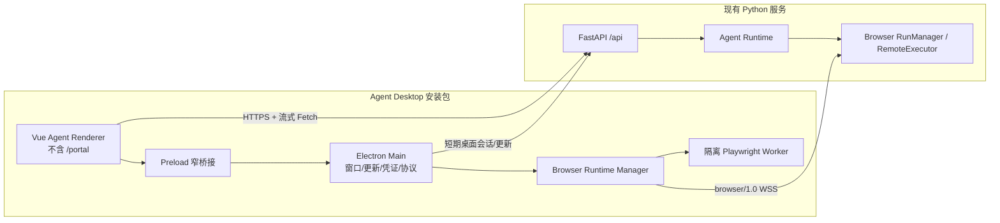

# Agent 跨平台桌面客户端设计

> 日期：2026-07-14
> 状态：🔧 设计完成，分阶段开发中
> 适用平台：Windows 10/11 x64、macOS 13+ x64/Apple Silicon
> 关联：[浏览器混合执行与人工接管设计](../tools/browser/browser_visualization_design.md)
>
> CLI Host 上位规范：[第一方 CLI / MCP Provider 架构与开发规范](first-party-cli-mcp-provider-standard.md)

## 1. 决策摘要

采用 **Electron + Vue 3/Vite + 远程 Python 服务端**。这是以完整 Agent 客户端为第一优先级作出的产品架构决策，不以浏览器工具的既有规划为前提：

- 新建独立桌面工程 `clients/agent-desktop/`，不把 Electron 依赖加入现有 `frontend/package.json`。
- 桌面端复用 Agent 前端源码和 Python API，不在客户端打包或启动 Python 服务。
- Web 构建继续包含全部现有路由；桌面构建只引用 Agent/租户路由，`/portal/**` 的路由和代码块均不进入安装包。
- 桌面端内置可选 browser runtime；Playwright 必须在隔离 Worker 中运行，不进入 Vue renderer。
- 服务端保留统一浏览器 Executor 协议。Web 用户继续使用 server headless/服务端人工接管；桌面用户可在满足升级条件时使用本机浏览器执行。

架构主从关系固定为：**Agent Desktop 主应用 > 通用桌面平台层 > 浏览器可选模块**。浏览器模块必须跟随 Agent 的认证、发布、安全、生命周期和用户体验规范；发生冲突时修改浏览器方案，不修改或牺牲 Agent 主链路。浏览器模块未安装、被禁用、崩溃或版本不兼容时，聊天、文件、知识库、会话和其他工具仍须正常工作。

这不是“把线上 URL 放入 BrowserWindow”的薄壳。桌面 renderer 加载签名安装包内的静态资源，只连接已配置的 HTTPS API；这样发布版本可控，也避免远程页面直接处在 Electron 权限边界内。

## 2. 现状与约束

### 2.1 代码库事实

- `frontend/` 是 Vue 3 + Vite 5 SPA，路由集中在 `frontend/src/main.ts`，使用 `createWebHistory()`。
- Web 与平台管理后台当前共享入口；`/portal/login`、`/portal/**` 和 `/t/:tenant_id/**` 同时注册。
- Agent 对话使用 `POST /api/chat/stream` 的流式 Fetch/SSE；上传、下载、知识库和业务页面也直接调用 Python API。
- API 基址多数使用 `VITE_API_BASE_URL || '/api'`，少数模块使用 `VITE_API_BASE` 或 `window.location.origin`，尚未形成统一运行时解析层。
- 登录 Token 目前主要保存在 `localStorage`；桌面端不能照搬长期明文落盘。
- 生产 Web 由 Nginx 提供 `frontend/dist`，并将 `/api` 代理到 Python；桌面端不能依赖这个同源相对路径。
- 浏览器工具 v2.7 已规划 Agent Desktop 内置 Node Playwright runtime、短期 browser session、RemoteExecutor、Worker 隔离、人工接管和进程回收。

### 2.2 不变能力

- 现有 `npm run build` 的 Web 产物、Nginx 部署和 `/portal` 能力保持不变。
- Python API、Gunicorn 多 worker、多租户隔离和现有渠道能力保持服务端权威。
- 桌面客户端不离线运行 Agent，不持有模型 API Key、数据库凭证或租户管理凭证。
- 首期不封装平台管理员 `/portal`，也不提供隐藏入口或通过手输 URL 绕过。

## 3. 方案比较

| 方案 | 优点 | 主要问题 | 结论 |
|---|---|---|---|
| Electron + 打包本地前端 | 直接复用 TypeScript/Vue；Windows/macOS 都使用可控 Chromium，SPA、SSE、文件预览行为一致；窗口、权限、凭证、托盘和更新能力成熟 | 安装包和内存较大 | **选择** |
| Tauri 2 + 系统 WebView | 安装包较小 | 要新增 Rust；Windows WebView2 与 macOS WKWebView 的 SPA、媒体、预览兼容面不同；现有团队与代码栈迁移成本更高 | 不选 |
| Electron 直接加载线上 Web | 初期代码最少 | 远程代码进入桌面权限边界；无法真正排除 `/portal`；前后端发布强耦合；离线启动页和版本回滚差 | 不选 |
| Python 服务整体打入客户端 | 可本地运行 | 复制部署拓扑、模型配置和数据访问面，升级与安全复杂，违背“不影响服务端”目标 | 不选 |

Electron renderer 必须保持 `nodeIntegration: false`、`contextIsolation: true`、sandbox 开启，并只通过窄化 preload API 访问桌面能力。Electron 官方也明确建议隔离上下文，且禁止给远程内容开启 Node 集成：

- https://www.electronjs.org/docs/latest/tutorial/context-isolation
- https://www.electronjs.org/docs/latest/tutorial/security

## 4. 目标架构



### 4.1 工程边界

建议目录：

```text
frontend/
  src/
    app/bootstrap.ts
    router/agentRoutes.ts
    router/portalRoutes.ts
    platform/runtime.ts
  src/main.ts                 # Web 入口：agent + portal
  src/main.desktop.ts         # Desktop 入口：仅 agent
clients/agent-desktop/
  package.json
  electron/main/
  electron/preload/
  browser-runtime/
  builder.yml
  tests/
```

`frontend` 仍是 UI 的唯一实现；`clients/agent-desktop` 只负责桌面生命周期、原生能力、Playwright runtime 和发布。禁止复制一套 Vue 页面到客户端工程。

## 5. `/portal` 的排除方式

仅靠路由守卫不满足要求，因为动态 import 对应的 Portal chunk 仍可能存在于安装包。必须同时做到构建期排除和运行时拒绝：

1. 将路由拆为 `agentRoutes` 与 `portalRoutes`。
2. Web 入口显式组合两者；桌面入口只 import `agentRoutes`。Portal 组件不得被桌面入口的静态依赖链引用。
3. 桌面 Vite 构建使用独立 HTML/entry 和输出目录，由 Electron 只打包该输出目录。
4. 桌面协议处理器只接受 Agent 路径；访问 `/portal`、`/portal/**` 一律导航到桌面首页并记录不含 Token 的安全事件。
5. CI 解包 `app.asar`，断言不存在 Portal 路由名以及 Portal-only 组件 chunk。

`/t/:tenant_id/**` 是租户 Agent 前台，不属于平台 `/portal`，应保留。根路由继续承担统一登录和租户跳转。

## 6. Web 与桌面的共享适配层

### 6.1 运行时配置

增加 `platform/runtime.ts`，统一暴露：

- `target: 'web' | 'desktop'`
- `apiBaseUrl`
- `openExternal(url)`
- `secureCredentialStore`
- `desktopCapabilities.browserRuntime`

Web adapter 保持相对 `/api`；Desktop adapter 从签名内置的发行渠道配置读取默认 HTTPS API 地址。若未来支持私有化服务器切换，必须做管理员策略、HTTPS 和域名白名单校验，不能接受任意 URL。

所有 `VITE_API_BASE_URL`、`VITE_API_BASE`、相对下载地址和 `window.location.origin` 的 API 拼接逐步收口到一个 URL resolver。流式 Fetch 不经过会缓存响应的通用封装，但必须使用同一个 resolver。

### 6.2 路由协议

桌面端注册安全标准自定义 scheme（例如 `aidagent://app/...`）并将任意合法 Agent 路径回退到本地 `index.html`，继续使用 history 路由。不能改成 Hash history，因为当前租户隔离逻辑大量读取 `window.location.pathname`。

### 6.3 登录凭证

- Web adapter 维持当前 storage 行为，避免 Web 回归。
- Desktop adapter 使用 Electron `safeStorage` 加密落盘；renderer 只在内存中获得当前短期 access token。
- 现有直接读取 `localStorage` 的认证代码迁移到统一 `CredentialStore`。迁移必须逐模块完成并有 Web/desktop contract tests。
- 不在日志、崩溃报告、更新请求、浏览器 runtime 消息中输出 Token、短信验证码或页面正文。

### 6.4 API 跨域

桌面 renderer 与 API 不同源。优先让 FastAPI CORS 精确允许桌面 scheme 的固定 origin，并做 Windows/macOS 真机预检；禁止配置 `*` 与 credentials 共用。若 Chromium 对自定义 scheme 的 Origin 行为不能满足预检，则回退为 Electron main 中的固定域 HTTPS transport，renderer 通过受限 IPC 调用，不能关闭 Chromium Web Security。

## 7. browser runtime 集成边界

浏览器工具是可选能力，不是桌面技术选型的前置条件。本节只规定它如何适配已经确定的 Agent Desktop 架构。

### 7.1 结论

browser runtime 是 Agent Desktop 的内置可选模块，不拥有单独的产品、安装、认证、更新或发布生命周期。该边界不改变服务端浏览器架构：

- 服务端仍通过 `BrowserExecutor`/`browser/1.0` 协议调度，不能直接信任桌面 renderer。
- Agent Desktop main 内置 desktop runtime registry client 和 `BrowserRuntimeManager`。
- Browser runtime 使用独立 feature flag、独立 Worker 和独立更新兼容检查；它不能阻塞 Agent Desktop 启动或登录。
- 每个 run 仍启动独立 Node Playwright Worker；Windows 使用 Job Object，macOS 使用 process group，终态强制回收进程树。
- 可见浏览器和人工操作属于本地 Worker 窗口；状态卡、暂停原因和继续/取消仍显示在 Agent UI。
- 登录后由桌面主进程用一次性 exchange ticket 换取短期 browser session token；Agent access token 不直接交给 Worker。
- server headless 仍是 `auto` 的第一选择；只有设计中定义的本地能力预检失败或高置信升级门才能转桌面执行。
- browser runtime 初始化或执行失败时只终止当前浏览器工具调用，不得导致 renderer、桌面主进程或普通 Agent 会话退出。

### 7.2 Web 用户如何处理

- 没有桌面应用：继续使用 server headless、服务端实时画面和网页人工接管，不受影响。
- 已安装桌面应用但从 Web 发起：Web 可用 `aidagent://browser-launch` 一次性票据拉起同一个 Agent Desktop 的 browser runtime。
- 只交付 Agent Desktop 一个桌面产品和安装包；浏览器能力由 feature flag 控制，不预留第二套 shell、托盘或更新器。

浏览器设计 v2.7 的服务端 RunManager、Executor、ticket、人工接管、路由和安全策略继续有效；Phase 4 的客户端代码、测试和交付状态统一归 Agent Desktop 项目管理。

## 8. Electron 安全基线

- `nodeIntegration: false`、`contextIsolation: true`、`sandbox: true`、禁用 remote module。
- preload 按方法暴露 API，不暴露原始 `ipcRenderer`、文件系统或 shell。
- CSP 默认 `default-src 'self'`；网络仅允许配置的 API/WSS/更新域名；图片/文件预览单独列白名单。
- 拦截 `window.open`、导航、下载和权限请求；外链仅经白名单校验后交给系统浏览器。
- 禁止 renderer 传任意可执行文件路径、命令、Playwright 脚本或任意 IPC channel。
- 浏览器 runtime 使用专用 Profile，不读取用户默认 Chrome Profile；清除 Profile 是显式用户操作。
- 更新包必须验签；生产构建缺签名应失败，不允许静默发布 unsigned 包。

## 9. 发布与更新

- Windows：x64 签名 NSIS；首期不支持 ia32。可评估 Azure Trusted Signing 或标准代码签名证书。
- macOS：分别构建 arm64/x64 并发布 universal DMG；Developer ID 签名、Hardened Runtime、notarization 必须通过。
- Windows 更新：现有包型继续使用 NSIS，并通过 `electron-updater` 对接 HTTPS Generic Provider。发布单元必须同时上传同一次构建生成的 `latest.yml`、签名安装包和 `.blockmap`；客户端不接受 renderer 传入或动态改写更新地址。
- 更新地址由构建变量 `AID_AGENT_UPDATE_BASE_URL` 写入包内只读发布配置；未配置、非 HTTPS、开发环境或 unsigned development 包时，更新器保持 `disabled`，不得连接生产更新源。
- 更新状态固定为 `disabled / idle / checking / available / downloading / downloaded / up-to-date / error`。启动延迟检查并按长周期轮询；`autoDownload=false`，发现版本只在左下角提示，用户点击后才下载；下载完成后再次确认“重启并安装”，不得在 Agent 或 browser run 执行中强制退出。
- preload 只暴露查询状态、订阅状态、检查、下载、重启安装五类窄接口，不暴露 `ipcRenderer`、更新 URL 或任意文件执行能力。Web 构建中 `window.agentDesktop` 不存在，因此更新 UI 和网络请求都不进入 Web 运行链路。
- 每次发布必须递增 SemVer；同版本重新打包不会被客户端识别为升级。Windows 正式更新必须通过 Authenticode 签名校验，证书轮换需要单独演练。
- 后续灰度使用 `electron-updater` staged rollout；主版本不兼容 browser 协议时服务端返回 `DESKTOP_UPDATE_REQUIRED`。浏览器 runtime 只能报告是否有活跃 run 供安装重启延期判断，不能决定 Agent 客户端的版本策略或发布机制。
- CI 使用 Windows runner 构建/签名 Windows，macOS runner 构建/签名/notarize macOS；证书只放 CI Secret。

electron-builder 官方支持 Windows NSIS、macOS DMG/universal、签名与更新；macOS 直接分发必须签名并 notarize：

- https://www.electron.build/docs/
- https://www.electron.build/mac/
- https://www.electron.build/docs/features/code-signing/

## 10. 服务端影响

Python Agent 业务能力不迁入客户端。必要改动限定为：

- 桌面客户端 bootstrap/exchange、短期 token 和版本策略 API。
- 精确 CORS/Origin 配置或固定域 transport 配套端点。
- 浏览器 RemoteExecutor/registry 识别 `client_kind=agent_desktop`。
- 下载接口补齐桌面可安全解析的绝对/规范化 URL 契约。
- 审计记录客户端版本、平台、browser run 状态，不记录敏感正文。

所有新增端点均为增量；现有 Web API 请求和响应契约原则上不改。确需收口 API URL 或 token adapter 时，只改前端调用层，不改变 Python 业务语义。

## 11. 验收标准

### 构建隔离

- 原 `frontend npm run build` 输出与当前部署兼容，`/portal` 和 `/t/**` 均可用。
- Desktop 安装包中找不到 Portal-only 路由、组件 chunk、`portal_token` 管理逻辑。
- Windows/macOS 从安装、登录、对话、流式回复、上传、预览、下载到退出均通过。

### 回归与安全

- Web 现有 frontend test + production build 全绿。
- Python API 相关单元/集成测试与关键 import/启动检查全绿。
- 桌面导航、IPC、CSP、外链、凭证存储、更新签名测试通过。
- API 地址不可被普通 renderer 任意改写；`/portal` 无法通过地址栏、深链或路由 API 进入。

### 浏览器能力

- Desktop browser run 与 server run 通过同一 Executor contract tests。
- success/error/cancel/timeout/app quit/断网/更新七类终态均无残留 Playwright/Chrome 进程。
- 服务端 headless 优先、一次升级、人工接管、同一 run 恢复、不可逆动作不重放全部满足浏览器 v2.5 门禁。
- 纯 Web 用户不安装 Desktop 也能继续使用服务端浏览器能力。

## 12. 明确不做

- 不在首期实现离线 Agent 或本地 Python 服务。
- 不封装 `/portal`，不提供管理员隐藏开关。
- 不直接控制用户默认 Chrome Profile。
- 不把 Node、Electron 或 Playwright 权限暴露给 Vue renderer。
- 不为桌面端复制一套 Python API 或 Vue 页面。
- 不为 browser runtime 创建第二套桌面产品、安装包、托盘、认证或更新体系。

## 13. 本地 CLI Host 兼容边界

未来 Agent Desktop 调用本地 CLI 时，必须遵守项目级第一方 CLI / MCP Provider 规范：

- Desktop 是与 Codex、WorkBuddy 同类的标准本地 MCP Host，不拥有第一方 CLI 私有接口；
- Electron main 或隔离 child runtime 管理 MCP stdio，renderer 不启动进程；
- 第一方与第三方 Provider 共用生命周期、权限、进度和结果接口，区别仅在信任与发布来源；
- Web Agent 的 Local Tool Runtime 与 Desktop 复用 Host core/contract，不能形成两套本地工具体系；
- BOSS 等第一方 CLI 不导入 Desktop 代码，Desktop 也不导入 Provider domain 代码；
- Desktop 开发不得要求修改已发布第一方 CLI 的 tool schema。

本节只锁定兼容边界，不在当前招聘 MVP 中开发 Desktop CLI Host。
