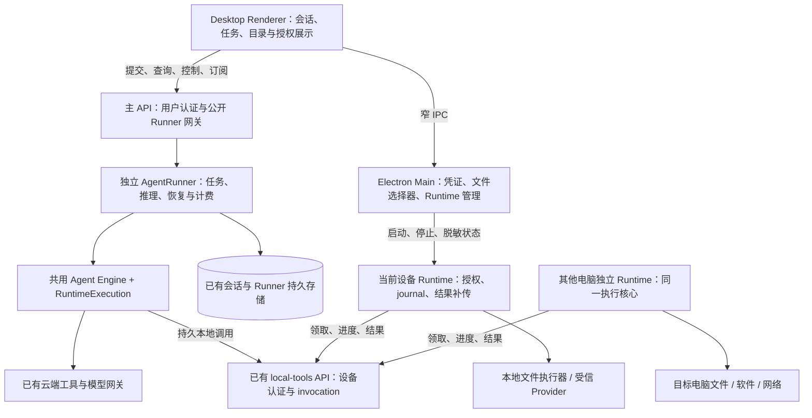

# Agent 桌面客户端设计 v3：接入现有 AgentRunner

> 修订日期：2026-10-09
>
> 状态：共同架构按用户复核修订为契约v2.0，业务实现尚未开始；页面、首场景与具体分期仍可在边界内细化。
>
> 开发计划：[桌面客户端开发计划](../plans/plan-desktop-agent-client.md)
>
> 架构基线：[AgentRunner 服务架构](agent-application-architecture-design.md)、[母体 Agent 收敛原则](agent-kernel-convergence-principles.md)

> 跨会话共同约束：[Runner / Desktop / Runtime 集成契约 v2.0](runner-desktop-runtime-integration-contract.md)、[Runtime插件宿主设计](runtime-plugin-host-architecture-design.md)。本方案接入同一Runtime管理port和执行core，不重复实现插件宿主；公共Electron壳与任务binding由桌面工作流主导共同接线。
>
> 关联：[构建手册](desktop-agent-client-build-manual.md)、[本地与服务端执行调研](../research/desktop-agent-local-vs-server-tool-execution-research.md)

> 开源依据：[Codex、DeepSeek Harness、Hermes 源码调研](../research/desktop-agent-harness-architecture-research.md)；共用执行侧能力：[Runtime 插件宿主设计](runtime-plugin-host-architecture-design.md)。

## 1. 本次重新设计的结论

保留 Electron 和独立 Vue Desktop Shell，把桌面版建设为现有企业 Agent 的任务工作台与设备工具入口。AgentRunner 负责推理和任务生命周期；桌面端发起、观察和控制任务；受信 Runtime 在任务固定电脑执行工具。Runtime 可与桌面同机，也可独立安装在另一台专用电脑，供 Web/Desktop 调度。

旧桌面设计 v2.3 曾采用 Local Agent Coordinator、Agent Turn 和 Remote Tool Gateway，后经 P1 文档整合、取消。本文在原设计路径重建当前方案，不恢复旧路线。旧设计中的独立渲染器、安全 IPC、凭证存储、Provider、文件边界继续复用；本地回合循环、设备拥有聊天执行权和旧 D1 协议不作为新客户端基线。

用户已明确 AgentRunner 是各入口共用的核心，Desktop 也必须接入；本地 Runtime 承担软件操作和工具执行。因此本方案采用云端 loop，设备可直接执行文件、脚本和受控程序，不增加本地自治模型循环。开源项目表明本地 loop 也可以调用并由云端模型服务计费；我们保留云端核心是为了共用已有企业任务、权限、恢复与账本，并非本地 loop 技术上无法计费。

本轮只形成设计和计划，不改变 Runner 已完成状态，不迁移客户 Runtime、不修改业务代码。

## 2. 当前源码事实与缺口

以下为 2026-10-08 静态核对结果，不代表本轮运行或真机验收通过。

| 范围 | 当前事实 | 新设计处理 |
|---|---|---|
| Agent 核心 | `src/core/agent.py` 调用 `RuntimeExecution`；共用 Engine 在 `src/core/agent_engine/` | 复用，桌面不复制 Python Agent，也不增加 TypeScript 模型循环 |
| 执行服务 | `src/services/agent_runner/` 已有持久提交、查询、控制、事件、恢复、用量与本地调用衔接 | 作为唯一聊天任务权威，补缺口在应用适配层完成 |
| Web 网关 | `src/api/agent_runner_web.py` 暴露 `/api/chat/runners`；用户认证转发至独立服务 | 首期复用同一公开契约，不让客户端持有内部 service token |
| 会话与来源 | `SessionRef.kind` 仅 `web/channel`；用户认证要求 `source=chat` | 首期桌面使用既有用户聊天会话，不凭空增加 `desktop` source 或第三类会话表 |
| 桌面壳 | `clients/agent-desktop` 与 `frontend/desktop` 已有独立入口、安全身份、配置、下载、更新和启动 UI | 保留并扩展；首页仍是 Phase C 占位，没有真实对话 |
| 旧共享壳 | `agent-coordinator-core` 只有 `requestTurn` 等接口；`local-tool-host-core` 只有 invoke/shutdown 接口 | 前者停止作为执行设计依据；后者不足以证明 Host 已实现 |
| 旧 D1 | `src/desktop_agent` 仍实现 `/api/desktop/v1/agent/next` 与 tools gateway，按配置挂载 | 保留兼容；新客户端不调用，后续盘点真实消费者后单独退役 |
| 设备执行 | `src/local_tools` + `clients/agent-tool-runtime` 已实现设备身份、claim、Provider、journal、部分 v2 结果 outbox | 复用执行机制；不认定所有 Provider 已支持同等恢复语义 |
| 设备选择 | proxy 与 `device_policy.py` 依赖用户全局 selected、active、在线与能力 | 新桌面任务必须固定设备；不能执行途中追随全局 select |
| 跨平台 | Runtime `PLATFORM` 为 `win32-x64`，设备凭证依赖 DPAPI，CLI 耦合场景与端侧会话任务 | 首个本地能力交付以 Windows 为范围；macOS 需要独立适配与真机验收 |
| 文件工具 | `src/tools/file/*_tool.py` 沿用 BaseTool 默认 SERVER；现有 workspace 是服务端上下文 | 增加明确设备文件引用与本地执行器，不能把本机路径传给服务端读写 |
| 前端复用 | Web `api/runner.ts` 已有 Client，但依赖 Web 类型、环境地址与传入 headers | 逐项提取中性协议/解析/transport，不直接引入 Web 路由或整套 useAgent |

架构依据以当前 `.claude/rules/architecture.md` 与实际 Engine、RuntimeExecution 和 Runner 实现为准。`agent.py` 兼容壳复用同一内核，不能作为新增本地模型循环的依据。

## 3. 产品范围与分期

建议首个使用场景是：用户选择一个本机工作目录，请 Agent 阅读其中的文本资料，生成或修改一份文件；用户可看到任务状态、修改内容和结果位置，重启后能够核对原操作。

| 交付层次 | 具体能力 | 完成含义 |
|---|---|---|
| 第一阶段：云端任务工作台 | 登录、会话、数字员工选择、提交、状态、结果、澄清、暂停/继续/取消、云端附件 | 桌面对话接入完成；此时尚未交付完整本地 Agent 能力 |
| 第二阶段：设备文件闭环 | 同机/异机设备绑定、目标目录授权、文本 list/read/search/write/edit、冲突与结果核对 | 达到首个完整桌面 Agent MVP，异机目录可在目标Runtime预先授权 |
| 第三阶段：受控命令与应用 | Shell 权限/隔离、受信 MCP Provider、既有 BOSS/微信能力按任务接入 | 逐能力验收，不随客户端安装默认开启全部自动化 |
| 后续 | macOS 本地 Host、Office 专用 Provider、浏览器人工接管等 | 不作为 Windows 文本文件 MVP 的前置条件 |

首期沿用独立 Desktop UI 和已有设计基础。知识库及数字员工作为现有云端能力接入，不另建桌面数据库版本；复杂管理页面通过已有安全外链打开。平台 `/portal` 不进入桌面产物。系统托盘、开机常驻、离线推理、多设备自动迁移不纳入首期。

## 4. 架构与权威归属

```mermaid
flowchart TB
  UI[Desktop Renderer：会话、任务、目录与授权展示]
  Main[Electron Main：凭证、文件选择器、Runtime 管理]
  Gateway[主 API：用户认证与公开 Runner 网关]
  Runner[独立 AgentRunner：任务、推理、恢复与计费]
  Engine[共用 Agent Engine + RuntimeExecution]
  DB[(已有会话与 Runner 持久存储)]
  LocalAPI[已有 local-tools API：设备认证与 invocation]
  Host[当前设备 Runtime：授权、journal、结果补传]
  RemoteHost[其他电脑独立 Runtime：同一执行核心]
  Provider[本地文件执行器 / 受信 Provider]
  Cloud[已有云端工具与模型网关]
  UI -->|提交、查询、控制、订阅| Gateway
  UI -->|窄 IPC| Main
  Main -->|启动、停止、脱敏状态| Host
  Gateway --> Runner
  Runner --> Engine
  Runner --> DB
  Engine --> Cloud
  Engine -->|持久本地调用| LocalAPI
  Host -->|领取、进度、结果| LocalAPI
  Host --> Provider
  RemoteHost -->|领取、进度、结果| LocalAPI
  RemoteHost --> RemoteProvider[目标电脑文件 / 软件 / 网络]
```

| 状态 | 唯一权威 | 客户端保存内容 |
|---|---|---|
| 聊天任务、等待、控制、模型/工具用量 | AgentRunner 及现有仓储 | 脱敏投影、游标、未确认提交的请求键与必要草稿 |
| 聊天会话与历史 | 既有 chat_sessions/chat_messages；沿 Runner 历史职责写入 | 查询缓存，不自行再次写终态消息 |
| 设备及 invocation 的云端接纳 | local-tools 既有仓储与可信 owner 绑定 | 原 claim/操作记录，仅受信 Host 可用 |
| 本机副作用发生的证据 | Runtime journal 与 Provider 回执；云端接纳后记录相关事实 | ACK 前保留结果补传，不成为聊天任务的第二份权威 |
| 本机目录授权 | Main/Host 受信 grant registry；服务端保存绑定与有效版本 | 根路径留本机，云端使用 opaque grant_id、标签与授权范围 |

Desktop 不提交“工具执行成功”来推进 Runner；设备事实只能经设备 API 接纳、核对，再由 Runner 的原等待链路续接。普通客户端 controls 仍只用于业务控制，不能借 `reply` 或 `browser_complete` 冒充工具结果。

## 5. 公开 API 与客户端状态

### 5.1 复用现有 Runner 契约

客户端连接配置的 HTTPS 主 API；主 API 再访问独立 Runner。首阶段使用既有 `source=chat`、`session.kind=web` 与相同历史归属。这样 Web 与 Desktop 可以观察同一会话，继续受同一会话 claim 约束。桌面独有 workspace 绑定在第二阶段通过受控扩展接入。

| 操作 | 现有接口 | 桌面要求 |
|---|---|---|
| 能力探测 | `GET /api/chat/runners/capabilities` | 支持版本且入口启用才允许新建；不可达不回退旧 D1 |
| 提交 | `POST /api/chat/runners` | `client_request_id` 在第一次发送前保存；202 表示接单 |
| 找回任务 | `GET /api/chat/sessions/{session_id}/runners` | 分页读取活跃与历史，不能只看本机缓存 |
| 状态/结果 | `GET /api/chat/runners/{id}` | snapshot/result 为展示基础；防止较旧 revision 覆盖新状态 |
| 事件 | `GET /api/chat/runners/{id}/events` | 认证 Fetch SSE，保存 after_seq；按实际事件协议触发快照补读 |
| 取消 | `POST /api/chat/runners/{id}/cancel` | 已请求与已取消分别展示；不承诺撤销外部动作 |
| 控制 | `POST /api/chat/runners/{id}/controls` | pause/resume/reply；控制接收与实际生效分开 |
| 控制结果 | `GET /api/chat/runners/{id}/controls/{control_id}` | 接收、消费、拒绝明确可见 |

会话创建、历史、数字员工权限和云端上传沿既有 API 接入；实现阶段核对具体参数，不创建新的桌面历史管线。源代码当前事件类型为 created/revision_changed/terminal/settlement_changed，不能把订阅当成原始 token/tool-call 流。任务终态与费用 settled 分别处理。

共享 Client 需注入 API resolver、认证 transport 和订阅实现，去除 Web 固定 baseURL 与类型依赖。只提取实际需要且有测试保护的协议、解码及消息投影，Web 保留现有适配入口。旧 `agent-coordinator-core` 不改名后继续承担模型循环；是否移除该空壳由依赖盘点决定。

### 5.2 提交、等待与恢复

1. 初次发送前保存不可变意图与请求键；响应丢失时按原键重试/查询，不自动换键，也不转旧接口。
2. 切会话或隐藏窗口只停止观察，不取消 runner；重新打开先查询活跃任务，再订阅补读。
3. 普通消息排队；真实澄清答案携带原 `wait_id` 与 `target_execution_id` 回复同一 runner，不把所有 waiting 当作可输入澄清。
4. interrupted 按服务端可恢复状态展示，由用户明确继续；不因 Desktop 重启自动 resume。
5. 缓存、请求 outbox 与认证主体/租户/API origin 绑定。退出登录或换账号停止观察并隔离缓存，旧意图不以新主体重发。草稿和结果缓存使用有界保留与既有安全存储能力，凭证不进入 localStorage。
6. 云端历史与 runner 投影按稳定 ID 合并，避免刷新后重复消息；未接单输入与已接受任务状态分别呈现。

## 6. Runtime 集成与本机生命周期

复用 `agent-tool-runtime` 中 API Client、领取、Provider 管理、取消、journal 和对应 outbox 的机制，新增桌面管理适配与通用文件能力。不要直接 import CLI 入口或把全部端侧自动会话调度拉进 Electron Main。

配对、Runtime core 提取、插件安装与生命周期复用[Runtime 插件宿主计划](../plans/plan-runtime-plugin-host.md)成果，不能由本计划再建设一套同名 Host。独立 Runtime 产品可以提供自身管理 UI 与发行配置，完整 Desktop 复用其管理模块；其托盘/常驻选择不自动改变完整 Desktop 的关闭行为。本计划负责聊天任务、固定环境与文件闭环，两个计划在开工前明确共享模块的实现归属。

- Main 管理隔离 Runtime 进程；renderer 只读脱敏设备/执行状态，并通过窄 IPC 选择目录、授权、撤销和查看本机结果。
- 首期 Runtime 仅启用用户选定能力，不自动启动 SessionTaskEngine 或已有无人值守业务。
- 桌面登录凭证与设备 token 分开。配对复用 pairing-ticket 流程，由受信边界保存设备凭证；退出登录停止本机领取，设备撤销须显式操作。恢复领取前重新核对主体、租户与配对归属。
- 客户已有外置 Runtime 保持原配置与设备身份。桌面不能覆盖、抢占或自动重新配对；同一设备进程重复启动需明确拒绝/展示现有状态，不能出现两个领取者。
- 更新、退出前停止领取，等待正在执行操作到安全点并保存未 ACK 结果；仍有未核对副作用时保留 journal，不能用“杀进程”当作取消成功。
- 当前 Windows 关闭最后窗口会退出应用。沿用该行为：纯云端任务可继续；本机 Runtime 随应用退出而不可用，未完成本地操作按原事实核对。切会话/隐藏窗口与退出应用应有不同提示。常驻执行另行立项。
- 上述退出/注销规则只作用于本产品监管的实例。独立 Runtime 客户端的常驻、共享/外置实例的控制按共同契约第6节处理；不能因退出 Desktop 自动停掉外置 Runtime，也不要求完整 Desktop 为此增加托盘。
- 现有 Runtime/Provider 使用 `process.execPath` 启动 Node 脚本；Electron 集成必须验证受控 Node 执行入口、依赖封装、Provider 路径和签名包资源，不能假定 Electron 可执行文件等同 Node。
- macOS 本地能力在凭证、路径、进程监管、权限、打包和真实设备检查通过前不启用；云端工作台也必须有对应平台启动验证后才能声明支持。

### 6.1 Runtime候选0.2的桌面消费约束

本节保留0.2消费记录与继续适用的共同约束；当前格式以候选0.3及第13.5节迁移要求为准，不能继续按数组消费plugins.list。

当前Runtime实施范围按其[第一部分计划](../plans/plan-runtime-plugin-host.md#第一部分runtime-ui与第一方cli插件)：只接入Runtime管理feature/port及BOSS/weixin/wecom第一方离线包安装管理、必要核心与既有执行兼容。第三方skill契约保留，导入、Python/sidecar、AI手册/源码分析和动态登记/脚本执行暂不实施，也不作为H3公共壳接线前置。首期UI仅显示支持的第一方入口，Host在第三方安装/依赖构建/源码上传前返回不支持。H3管理接线无需等待完整Desktop对话、目录或通用Shell；新增H2任务语义仍须独立冻结，旧执行链沿已验证协议兼容。

用户确认的v2.0取代旧插件审批语义；管理回复固定request_id/method/code/error/result，0成功/error为空，非零失败/error非空/result=null。operation有独立status和code/error，不能把查询成功当操作成功。工具内容同样code/error，不再有success；effect/complete及产物归属保留。skill新增entry.description/可选output_schema和code_map，安装分析先手册后必要源码。候选0.1需显式迁移，不可按旧二选一error对象或registration批准状态消费；共同README为格式来源。Desktop已完成候选消费参考复核，未发现新增阻断，真实adapter验收仍待实施。

2026-10-09候选0.2消费参考复核：以[共享schema入口](../../contracts/runtime-host/v1/README.md)作为管理消息、插件展示与工具输出的格式来源。管理请求的`request_id`仅关联连接内响应；变更操作重试保留`request_key`。Main/preload adapter隔离本地连接代次，先协商major/features，再消费状态；未知feature忽略，缺少events使用查询，未知major不回退D1。

状态刷新通知只触发重新查询；真实adapter按实例维护已知revision水位，不能接受低于有效describe/已见通知水位的快照。同一管理通道重新describe到新instance时清理旧快照和实例相关待查询状态，并隔离旧实例响应，不能用旧实例revision拒绝新实例从0开始的状态。订阅建立与初次查询之间须有补查/脏标记机制，避免窗口内变化丢失。候选消费fake的水位及无断连接换实例缺口已修复并由Desktop复核；真实adapter仍须结束失效Promise、补查到水位并完成实际消费验证，详见开发计划第9.1节。

管理operation、Host运行状态与云端Runner任务分别展示，`reconciling`不显示为安全停止。用户安装即插件授权/默认启用，依赖及配置决定ready，无额外registration审批。服务端按可信身份/现有设备使用关系、格式和版本校验接纳描述，仍保留任务binding/workspace边界。产物展示复核固定设备及invocation归属，通过受权接口预览/下载；tool-output不替换原Device结果/ACK。H2绑定/grant/审批、H3启动/单实例、H4摘要规范化与真实资源/图片接线仍按原分工实施，不因候选格式产出提前完成。

## 7. 任务级设备和 workspace 绑定

现有全局 selected 设备继续服务旧工具链。新桌面文件任务使用显式绑定，不能在开始时调用全局 select 后假定设备不变。

建议第二阶段增加版本化 `execution_binding`，名称为待实现的契约提案：包含设备 ID、grant ID/版本、能力摘要引用与策略版本。主 API 按当前可信用户/租户校验设备归属和 grant；经 Runner 请求摘要、持久输入与 ExecutionState 传到 ToolExecutionContext；子执行继承同一授权边界，不能自行换设备。

执行前、恢复前与派发前重新检查有效性。设备归属与 grant 版本由受信服务/Host 核对，LLM 不能通过参数产生权限。禁止把未经校验的绑定藏进自由 `request_data` 或 prompt 以绕过契约。

新的显式绑定调用路径与旧 selected 路径分开校验：前者验证固定设备、active、授权和能力；后者沿原 selected 规则。需要在 proxy、claim 与结果接纳边界一致实现，不能只改模型提示词或前端。任务接受后不改 binding；换设备/目录须创建新任务或在未来另设迁移协议。

设备离线、能力缺失或 grant 撤销时明确失败/等待核对，不自动换服务器、换电脑或重新 select。首期不提供多设备自动迁移。

### 7.1 同机与异机设备的入口和资源

用户已确认：Desktop A 可选择 A 的受管Runtime，也可选择独立电脑B的Runtime；Web同样可使用有权调度的执行设备。A不必启动本机Runtime才能调度B。设备选择来自可信服务端列表，在提交时固定；任务展示目标电脑、连接/忙碌状态与产物归属。

异机操作仅经云端Runner/Device API，A的Host管理IPC只管理A的实例。B的文件、命令、软件与网络访问留在B。B的workspace须在B受信管理交互中授权；A仅选择已允许的grant引用，本机目录选择器不能授权B。A的Main拒绝打开B的文件引用，远端预览/下载经受权产物接口；下载另存A是明确复制。

专用电脑适用于特定网络、软件和BOSS长期占用桌面。A退出或Web关页不停止B；B的Runtime按独立生命周期运行。长GUI流程与后台观察共用真实桌面锁，跨调用占用/续期/释放先依共同契约5.5定稿；不能用单次调用锁声称已支持整段流程独占。锁屏、休眠和断网仍按实际阻断/未知状态展示。

Runtime侧v1.3审阅补充：忙碌投影不等于执行许可；占用过期不能证明旧脚本停止，资源交接需Runtime核对。UI展示实际阻断/核对状态，不能强制解锁；断网许可、调用超时、占用期限和流程期限按共同契约5.5接线，progress不自动续权。具体状态DTO仍由H2/H4共同冻结，本次仅同步文档。

历史审阅：Desktop已核对并接受以上v1.3补充。2026-10-09用户复核后当前基线为v2.0；本次重新消费验证待登记。后续按H1～H4产出具体schema及适配验证；桌面对话和内部模块按原分工推进，长流程资源状态未实现前不声称该能力已经可用。

## 8. 本地文件语义与授权

### 8.1 文件位置明确

云端附件使用现有 file_id；本机文件使用 `DeviceFileRef` 提案：`device_id + grant_id + grant_revision + relative_path + revision`。本机绝对根路径不作为跨网络权限依据。展示名称与内容片段仍可能传输，不能把“不传绝对根路径”理解为没有数据外发。

模型侧维持稳定的 read/write/edit 语义；绑定 workspace 的普通相对路径按可信上下文解析，显式 cloud file_id 使用云端实现。适配在工具/资源路由层完成，不给 Engine 增加按桌面工具名称分支。裸本机绝对路径不能被服务端误处理；不改变现有云端默认行为。

| 能力 | 本机行为与验收 |
|---|---|
| list/search/read | 限于批准目录，限制文件类型、大小、分页与结果量；返回文件 revision |
| write | 默认不覆盖；创建/替换前按权限核对，临时文件原子落盘，记录结果 revision |
| edit | 必须匹配读取时 revision；冲突保留用户修改，不能静默覆盖 |
| 本地结果查看 | Main/Host 由受信文件引用解析；不接受任意 renderer 路径，不自动打开可执行文件 |
| 保存云端产物 | 用户明确选择目的目录后下载/写入；与“读取本地文件”分别授权 |

首期仅普通文本文件；文件后缀不等于安全格式，需检查编码/大小及目标。Office/PDF 解析与批量目录处理后续按独立能力加入，不为一次文本读写复制所有服务端解析器。

### 8.2 授权与副作用恢复

- 用户经原生选择器创建目录 grant；权限区分读、创建、修改，不包含目录外、删除、Shell、外发消息。授权记录绑定主体、设备、规范化根路径与版本，可撤销。
- 同时校验服务端许可与 Host 实际路径边界，包括符号链接、Windows reparse point、UNC/设备路径以及目录替换。校验与打开之间的竞态需要平台实现保障，不能仅凭字符串前缀或一次 resolve 宣称安全。
- 写动作准备阶段持久保存 invocation、目标引用、原/新 revision 与授权摘要。效果发生后保存回执；ACK 前只重传结果，不再次写文件。
- 本地执行事实不明确时进入核对，不自动重试不可撤销操作。结果 outbox、目录权限与恢复证明必须覆盖新增文件 Provider；不能直接套用已有某个 v2 业务写协议就宣称通用写安全。
- 安装插件即使用授权，不默认逐次弹窗。仅现有企业策略明确要求审批的任务使用原持久审批记录，绑定主体、runner、invocation、参数摘要、grant/策略版本和有效期；审批答复与澄清reply分开，复用原许可链，不新建插件批准账本。
- 现有 Runner controls 没有 approve/reject；目录 grant 与审批记录/入口属于新增工作。具体 schema 与等待适配在第二阶段开工前定稿，未知/过期批准不能经普通 reply 转换为执行权。
- 云端负责模型和既有工具计费，Runtime 不自报积分免账或调用 chat 用量结算；新增工具价格在实施时按现有规则登记。

Agent 与模型在云端，因此读取返回的文本片段会经过服务器和模型。首次建立目录授权必须说明这个边界；未经用户选择，不把整个目录或完整文件隐式上传云端。产品不能宣称离线或内容完全不离机。

### 8.3 同一任务环境与本地执行效率

借鉴三家的 execution environment 思路，设备文件、Shell、skill 和应用工具共用任务的固定设备与 workspace。相对路径在对应执行世界解析，不能 read 在本机而 shell 访问云端同名目录；显式云端资源仍使用独立 file_id/空间。

本地执行不限于“一次 read”：支持有界 batch read/search，后续支持本机 CSV/Office 解析、筛选、聚合和受权脚本。一个程序可执行循环、转换和校验，只将必要片段、统计、diff、退出码与产物引用回传 Runner；不先上传全部原文件再在服务器处理。云端模型需要的文字/像素仍须传输。

本地程序循环不是 Agent loop。Runtime 不调用模型决定业务下一步；需要推理、澄清或子智能体时返回同一 Runner。已有完整流程脚本可一次派发，普通 SKILL.md 仍由云端 Agent 分步理解和执行。

原生选目录、用户点击预览与打开受信本机产物可以走 Main 窄 IPC，无需模型时不创建任务；模型发起操作仍走 Runner 受权调用，不能用 UI IPC 绕过工具权限并自报成功。

性能先优化模型轮数、批处理和结果大小，再测 invocation 排队/领取与持久化开销。首版复用现有设备协议；若实测小文件频繁往返成为瓶颈，再在相同授权端口内增加连接复用/读批处理。读链路可以采用可重试、轻量调用语义，仍保存 Runner 工具结果；写/发送/效果未知命令保留持久派发、journal 与结果核对，不机械套用领域写流程到每次 read。

DeepSeek PTC、Hermes execute_code 的程序化组合列为后续优化参考，首期不直接建设完整 PTC/工作流 DSL；批内逐项失败与副作用证据必须可见。

## 9. 命令和应用工具的后续边界

通用 Shell 不属于文本文件 MVP。目录 grant 不能限制任意命令的文件、网络或子进程访问，也不能把 `cwd` 当作沙箱。

第三阶段先明确命令权限模式与 OS 可实施的隔离。没有已验证隔离时，通用命令必须按能触达当前用户系统权限的事实展示并逐次批准；无法提供该产品承诺就不开放通用 Shell。结构化、受信 Provider 的有限操作可独立启用。

命令批准绑定确切 command/args、cwd grant、环境策略、网络/进程权限和超时，不把批准转为“永久任意执行”。管理进程树、输出截断、取消和未知效果核对；Provider 仅继承批准的环境变量，不能原样继承桌面登录凭证。消息发送、删除、安装、系统修改分别建立相应策略，不能只用一项“允许本地工具”。

现有 BOSS、微信与 skill-runner 的业务许可、设备锁、计费与 outbox 分支保持原职责；接入按能力单独验证，不将旧 v1 写无条件等同新增通用文件写的安全保证。

## 10. 工程落点与迁移原则

| 落点 | 建议改动范围 |
|---|---|
| `frontend/desktop` | 对话、会话、任务状态与目录/授权 UI；只保存观察状态 |
| `frontend/shared` | 经验证提取的 Runner DTO、解码、认证 transport 与消息投影 |
| `clients/agent-desktop/electron` | 窄 IPC、目录选择器、Runtime 监管与本机结果操作 |
| `clients/agent-tool-runtime` | 可受管启动边界、通用文件 Provider/执行器、授权与回执；不 import CLI 执行副作用 |
| `clients/shared/local-tool-host-core` | 仅提取 Desktop/独立 Runtime 确实共用的契约，不提前建设通用框架 |
| `src/services/agent_runner` | execution binding、等待/审批与恢复接线；不把领域逻辑放入 Engine |
| `src/local_tools` 与文件工具适配 | 固定设备校验、受信 Provider、文件引用与结果核对；保留旧 selected 路径 |

以客户端能力和服务端配置逐阶段启用。旧 D1 不自动跳转新 Runner；活跃旧任务不转换新状态，历史可沿原归属查询。旧客户端、Web、渠道与客户 Runtime 的兼容回归纳入对应阶段。新增字段缺省保持旧意图摘要与行为，版本不兼容明确拒绝恢复。

如需新表，遵守数据库分类、租户隔离和变更登记规范；不能把新增 grant/审批账本与已有 Runner 事件或费用账本混在一起。实现清单和具体迁移 SQL 在对应阶段设计确认后生成。

## 11. 成功标准

1. 桌面真实请求经过独立 Runner API/worker 和共用 Engine；进度、结果、等待、取消、恢复不由客户端另建业务状态机。
2. 提交响应丢失不重复任务，刷新/重启能找回原 runner，事件失效仍可查询完整结果。
3. 原澄清恢复同一 runner；暂停请求与已暂停不同，取消不声称撤销已发生效果。
4. 文本文件副作用仅发生在任务固定设备的批准目录；换全局 selected 不改变执行位置。
5. 越界、撤权、文件 revision 冲突、旧 claim、未知副作用不能继续写；结果补传不重复执行。
6. 当前电脑、另一电脑与云端结果可区分；本机IPC不能解析远端路径，用户知道云端模型会读取授权内容片段。
7. 旧 Web/渠道/D1 与客户 Runtime 按实际依赖回归，不要求客户重新安装或配对。
8. Windows 安装包真实验证完成才标记 Windows 本地 MVP；macOS、Shell、Office、真实更新源分别记验收范围。

## 12. 待确认与实施前决策

- 已确认核心边界：Desktop 共用云端 AgentRunner，本机 Runtime 执行工具；本地程序化处理不能变成第二套自治模型循环。
- 已确认部署场景：Web/Desktop可调度同机或另一电脑的独立Runtime；任务固定执行设备，目标目录授权和长流程独占遵守共同契约v2.0。
- 首场景：默认文本文件整理/生成；企业应用自动化可以调整排序，但须保留固定设备与许可边界。
- 第二阶段开工前定稿：grant 生命周期与存储、execution_binding DTO、文件路由 schema、审批入口与等待原因、Provider 写协议及未知结果核对。
- 第三阶段开工前定稿：Shell 权限/隔离与允许的命令形态；未经验证不承诺路径沙箱。
- 发行范围：默认先 Windows 本地 MVP；macOS 的优先级与真机资源另行确认。

## 13. H3 首期设计输入：Runtime UI与第一方CLI

2026-10-09交付给Runtime A1～A4的设计输入。本节由Desktop唯一维护，只定义公共壳/平台适配和打包责任；不是已有代码、冻结的管理wire或启动业务开发。共同schema由Runtime另行修订，第三方skill B1/B2继续暂不开发。

### 13.1 已核对缺口与Node基线

本节源码事实为A1交付前的H3设计核对；A1实际资产与变化见第13.6节，不能据旧缺口推断最新core仍未实现。

- Desktop当前锁定Electron 43.1.0，`main.ts`已有窗口/IPC与应用单实例，`credentials.ts`为账户safeStorage；builder目前不包含独立Node和Runtime资源。
- Runtime当前声明Node>=20，weixin/wecom实际要求>=22；Desktop构建脚本要求>=22.12.0。ProviderManager使用`process.execPath`并复制全部Host环境，需要在提取时改用注入的受控路径和按用途构造的环境。
- `sessionTasks/singleInstance.ts`只阻止第二个会话任务引擎，CLI明确仍运行standard lane；`PollLoop.shutdown()`同时中止领取与在途。这不等于通用Host单实例或独立drain已经实现。

首期统一Windows x64，打包Node锁定**22.23.3**，资源目标`resources/runtime/node/win-x64/node.exe`；两产品用同一Node输入，不用机器PATH、Electron可执行文件或安装时下载代替。2026-10-09从[官方固定版本校验清单](https://nodejs.org/dist/v22.23.3/SHASUMS256.txt)核对`node-v22.23.3-win-x64.zip`的SHA-256为`2b0ff57b049cda1bbcea2240eec20467018713c1efe1f7360c2681859b90ed71`。本轮只核对公开元数据，未下载/运行该二进制、未做Provider兼容验收。

H3实施时维护一个公共构建资源清单，锁定version/platform/arch/archive URL/hash及最终Node入口；校验下载字节和包内实物版本/架构，保存来源、许可证与构建证据。不使用latest地址参与可复现构建；以后更新patch时显式更新清单并重跑三CLI回归。首次打包失败或依赖不兼容不能静默回退Node20。

Runtime提供独立受管bootstrap构建产物，打包目标为`resources/runtime/host/managed-entry.js`；该路径为H3打包约定，Runtime交付时确认其模块依赖完整。不import当前CLI副作用入口来假装受管启动。可信组合层向core注入`nodeExecutable`、`runtimeHome`、平台原语及管理transport；Provider仍使用同一Node路径，core不import Electron。现有CLI的入口/参数兼容由Runtime负责。

### 13.2 私有通道与可信选择引用

首期Main使用绝对Node/Host路径、`shell=false`、`windowsHide=true`启动直属child，建立继承的Node IPC；stdin不作任意命令入口，stdout/stderr仅消费为有界脱敏诊断，不能解析日志来执行管理动作。管理请求/响应内容使用Runtime唯一维护的H1 schema，H3只作传输、校验及连接代次适配。Node支持显式子进程IPC，见[官方child_process文档](https://nodejs.org/download/release/v22.23.3/docs/api/child_process.html)；锁定Electron中的实际行为仍须验证。

不开放本机TCP/HTTP管理服务。首期对于同home外置实例，如果不存在已验证的受控管理通道则返回`INSTANCE_CONFLICT`和显式停止旧实例/升级提示，不强杀、不重配对、不启动第二领取者；这采用共同契约允许的冲突分支。外置实例接管/跨产品附着不是已有能力，后续如启用须先验证同用户访问控制与实例身份，不能用一个公开管道名当认证。

Main/preload仅暴露具体管理动作及取消订阅，复用当前trusted sender/main frame校验；不暴露ipcRenderer、任意spawn、文件路径、设备token或secret。Node child和Main的可信平台回调也不对renderer开放。私有平台接口语义如下，实际类型/编码在H3接线批次落地，不另定义H1消息：

| 平台能力 | H3输入/输出语义 | Runtime使用责任 |
|---|---|---|
| Runtime环境 | 固定Node/Host入口、规范化home、Windows用户/交互会话、产品监管来源 | 仅可信bootstrap读取；不能接受renderer指定执行路径 |
| 管理transport | request/response、状态通知、取消订阅及disconnect | core管理facade校验H1；adapter结束失效Promise并隔离旧连接 |
| 包选择 | Main原生选择器产生opaque selection_ref，仅用于第一方包导入 | Host经私有回调读取受控内容并核验来源/签名/manifest，不据引用获得任意路径访问 |
| OS secret存储 | 按home提供管理去重secret的load-or-create；仅Host/可信平台可得明文 | 使用稳定secret及原请求键核对意图；持久操作恢复不因重启生成新secret |
| 实例保护/进程监管 | 获取/释放同home实例lease；启动、停止、等待和实际存活结果 | 在领取前持有lease；业务效果、journal/outbox由Runtime核对 |

selection_ref为不可猜测随机引用，绑定选择它的受信窗口/平台主体、本次Host实例、`plugins.import`用途及选中文件；首期未消费引用有效期10分钟。Main保存文件定位/读取句柄及选择时内容身份，renderer只得到引用和可展示标签。Host首次受理前再次核对对象和包内容；文件被替换或内容改变时返回失效并要求重新选择。受控读取/暂存不运行插件或依赖，第三方包在安装、构建或上传前拒绝。

引用只允许一个管理request_key消费，不能挪给另一请求/实例；Host先查持久幂等记录再要求新引用有效。重发原request_key查回原operation，不因引用过期再次安装；Main/Host重启后旧临时引用失效，已经接单的操作依原持久事实查询/恢复，缺事实则明确失败/核对。管理请求键不代替用户目录grant，也不作为云端任务许可。

### 13.3 凭证、单实例与drain

Windows共享Runtime凭证继续使用既有CurrentUser DPAPI，`credentials.bin`保持CLI格式；Desktop账户safeStorage及hydrate白名单不扩展为设备凭证。管理去重secret由Host侧平台adapter复用既有DPAPI能力，独立存入Runtime home的`management-secret.bin`；随机secret在Host实例保护下首次原子创建，普通重启不轮换。OS保护不可用、文件损坏或用户不符时明确失败，不降级明文、不自动删旧secret；现有operation/journal/outbox仍保留。去重摘要算法与恢复校验由Runtime管理实现负责，本节不另造加密或请求摘要协议。

单实例有三层且用途不同：两产品各自应用锁防重复UI；规范化runtime home/Windows用户范围的Host实例锁覆盖CLI、Runtime App和Desktop的普通领取；原桌面资源锁继续覆盖同交互桌面Provider/后台动作，沿用原锁名。Host锁由core持有至安全退出，不能用Electron产品锁或现有sessionTasks锁替代。旧CLI不支持通用Host锁/管理时，先确认外置占用并显示冲突/迁移状态；无法证明已停止，不开启第二领取者。

受管启动顺序：产品身份/路径 → 实例保护 → 私有管理握手 → 配置/DPAPI → 安装记录及持久事实恢复 → 原结果补传/遗留进程核对 → 就绪能力 → 开放领取。IPC联通不是设备就绪，配对成功不是所有插件ready；恢复原效果/原版本仍走Runtime链。

显式stop、退出和更新先禁止新领取，继续必要progress/许可核验/结果补传，等待在途操作结束；到停止边界才请求停止并核对Provider和相关进程。Main异步退出门等待Host报告及实际child退出；超时/失联返回reconciling或blocked，保留诊断与原事实，不能显示安全停止或仅凭PID/kill返回认定已无后台动作。安全强退/崩溃恢复证据由真实进程监管提供；现有CLI20秒强退不是新drain成功证据，跨调用锁/离线许可仍不在首期承诺中。

完整Desktop关闭最后窗口时依此退出受管实例；独立Runtime关窗口只隐藏至托盘，显式退出才drain。观察外置实例的产品退出不停止该实例。parent异常退出/IPC断开时child停止新领取并进入同一停止/核对链，不能默认留一个失管领取者；更新只在安全停止后替换程序资源，不删除home、未ACK结果或在途release。

### 13.4 产品身份、数据路径与文件写入责任

| 项目 | 完整Desktop | 独立Runtime产品 |
|---|---|---|
| app identity | 保留`cn.aidingyi.agent.desktop` | 新增`cn.aidingyi.agent.runtime` |
| 产品名 | 保留AID Work Agent | AID Work Runtime |
| userData | 保留现有Desktop路径/账户数据 | 独立`%APPDATA%/aidwork-runtime-app`，在应用锁/创建窗口前设置 |
| Runtime home | 共享既有`%APPDATA%/aidwork-tool-runtime`或显式配置home | 同一规则；不隐式复制设备身份 |
| 关闭窗口 | 完整Desktop按原策略退出并drain直属实例 | 隐藏至托盘；显式退出才drain |
| 深链/更新 | 保留aidagent及既有配置 | 首期不抢Desktop深链；独立更新身份/源，未验证源时不启用更新 |

productKind由构建时受控配置确定，不能由renderer或运行时任意env切换产品身份。`AIDWORK_RUNTIME_HOME`兼容原CLI/测试的可信配置来源；Main传给child时使用已验证规范化路径。两产品共享home时互斥监管，不覆盖设备token；卸载保留执行事实及凭证，不随另一个产品userData删除。不同Windows用户的DPAPI数据不直接搬迁。

| 唯一写入者 | 文件/产物范围 | 对方交付 |
|---|---|---|
| Desktop H3 | `clients/agent-desktop/electron/main.ts`、`preload.cts`、公共安全/平台/监管适配；公共Electron入口及前端全局入口接线 | Runtime交管理port、bootstrap、feature模块和所需状态语义 |
| Desktop H3 | `clients/agent-desktop/package.json`及lock、builder配置、`scripts/package-win.mjs`/验证/构建脚本、受控Node资源清单、两产品构建配置 | Runtime交可打包core资产清单，不单独改公共package或再建壳 |
| Runtime | core/CLI、第一方插件安装及包、`frontend/desktop/features/runtime/`独立模块、受管Host bootstrap | 不直接注册全局IPC/改根路由、公共main/preload或全局lock；由H3接线 |

上述路径含现有文件和拟新增职责，实施前登记本批精确文件清单；未创建新文件或修改package。Node/应用签名与第一方发布信任由正式配置提供，不生成临时生产信任根；测试可用测试密钥和隔离目录，不能把测试验证标为可发行。H3验收必须实际验证包内Node、空Host、三CLI、引用失效/替换、实例冲突、drain/更新、DPAPI旧数据和未ACK补传；A3/A4不能仅凭设计输入标为完成。

### 13.5 候选0.3消费与H3迁移约束

2026-10-09只读复核[共享候选0.3](../../contracts/runtime-host/v1/README.md#候选02迁移到03)及[Runtime七项实施决议](runtime-plugin-host-architecture-design.md#12-第一部分开发前实施决议)。本批格式与v2.0职责一致，未发现新增消费阻断；接受为待接线输入，未修改共同schema/fixture/fake，不代为冻结wire。第6.1节及计划第9.2节的0.2结论保留为历史。

| 消费点 | Desktop真实adapter/UI要求 |
|---|---|
| plugins.list解码 | 成功result严格为instance_id/revision/plugins对象；拒绝旧数组。api_major仍为1不表示兼容旧候选，真实adapter按0.3校验 |
| 实例与水位 | describe/getState/plugins.list/state_changed共用同实例最高水位；换实例清状态及列表快照并结束旧实例待查询。Host在一次提交中更新可见插件事实和revision，消费方不能用本地排序补救不一致的producer快照 |
| 查询竞态 | 两类快照分别保留dirty；一个查询推进水位后检查另一快照是否过期，低水位/失效结果不算刷新成功。列表先比较实例/revision，更高revision即使来自先发查询也接受；只有同revision才比较已接受列表的本地查询序号，不能仅因后发查询仍在途而丢弃结果。序号不传wire；旧连接generation的回复/通知均丢弃 |
| 刷新收尾 | 真实adapter处理Promise结束、失败、超时、取消及补查，不能直接将fake当实现。旧快照可作标明未刷新的展示，但不能据此确认启用/就绪或覆盖已知新状态；失败显示诊断并保留刷新需求 |
| version展示 | 只显示Host核验的可选version；缺省显示“版本未知”，不从release_id推算，不把展示字段当授权/执行版本绑定。legacy来源与已验签安装区分 |
| 管理操作 | 保留原request_key查询持久operation，过期/已消费selection_ref的原意图重发返回原操作；同键新意图拒绝。安装/就绪、升级保留enabled、停用/卸载及重配对收尾按Runtime第12节消费，不另造Desktop生命周期 |

Desktop实际运行Python7项（7schema/59fixture）、Node14项，0失败/跳过；补充18项列表schema断言和12项通知/重连/换实例断言通过。静态核对外层envelope＋内层payload摘要避免自引用，第一方依赖在发行端预构建，与H3固定Node和受信选择引用相容；生产trust root、签名实包、OCR/Python可移植性和真实Host/Main接线仍未验收。H2新任务binding/grant/长占用及H4跨端release接纳保持待交付，0.3列表revision不补足这些授权语义。第三方B1/B2继续暂不开发。

候选0.3最终复核（2026-10-09）：Runtime独立测试/CR发现初版fake将先发查询的更高revision误丢弃，P2已修复。本工作流读取最新appliedListQuery实现与第15项回归，再运行Python7/59与Node15，0失败/跳过，并补充11项revision优先/同revision排序断言通过。上表按最终语义修订；初次Node14验证为历史证据，不作为该修复的验收。Runtime独立验证/CR最终完成证据见其计划第8节，真实adapter及wire仍未冻结。

### 13.6 A1实际资产接收与H3落点

2026-10-09接收Runtime A1开发包0.2.14，依据[core资产说明](../../clients/shared/local-tool-host-core/README.md)和[Runtime当前交付记录](../plans/plan-runtime-plugin-host.md#10-最终交付与验证记录)。开发tgz为3060079字节，SHA-256为`b5db68c2677139c75455e8feea4844d4910385f3bfc06348b1d34d5cafc9bccc`；只标识本次临时交接，正式构建须可复现重建并锁定新摘要，不将临时文件登记为发布版本。

H3构建应把完整`dist/src/**`放入`resources/runtime/host/`，保留sessionTasks相对结构，将ESM package元数据及完整bundled node_modules放在同一host目录。不能只复制managed-entry.js、依赖开发机node_modules或在客户机npm install。包内已有core JS/types及SDK/zod运行依赖，无BOSS强依赖和Runtime tests。本次在仓库外按该布局复制，3564个文件逐项摘要一致。

真实消费测试使用Windows/Node24.13.0、隔离home和直属child私有IPC，未配对真实设备、未调用云端或Provider。最终25项断言通过，11条真实管理回复和4条事件全部通过候选0.3 schema；覆盖desktop supervisor、空清单、缺配对start失败、插件变更code3、stop幂等、同home第二实例退出1、父断连退出0，以及重启换instance且DPAPI management secret/原operation保持。验证的是空Host管理和退出，不是有在途软件任务的drain、设备凭证迁移或GUI安全停止。首次探测等待stdio close超时，追加记录确认进程已exit0；最终探测按实际exit核验并单独释放诊断流，不能把stdio close当进程存活或停止效果证据。

| H3接线责任 | 实际消费边界 |
|---|---|
| 可信启动 | 绝对Node/入口、已核对home、继承IPC；完整Desktop传--supervisor=desktop，独立Runtime缺省runtime_app。A1已注入Provider Node入口，但固定22.23.3仍待实测 |
| 能力与安装UI | A1 describe只公告events，plugins mutation返回code3；可诊断空列表，不显示第一方安装已可用。A2管理能力交付后再按features启用入口 |
| 退出门 | stop operation成功且Host stopped后断开IPC，等待实际child exit；parent disconnect也走Runtime停止链，Main处理连接代次/待Promise/诊断流，不加30秒强杀 |
| 启动失败 | 本次同home冲突只观察到通用stderr与exit1，尚无结构化H1 code4。Main显示启动失败/需核对，不从日志或exit1猜定冲突、凭证损坏等具体原因；精确原因传递须与Runtime协调，由其唯一修改入口，共同格式不单方扩展 |
| 身份与历史 | 历史journal/session缺可信结案证据时展示code11及原因，保留原身份恢复，不提供删目录或伪造结案按钮；正常历史身份切换验收仍属A4缺口 |

本批接受开发资产用于H3接线，未修改Runtime/common schema或公共Electron代码。正式Node22、main/preload实际消费与Windows产品包、签名信任/三CLI实包及H2/H4新路由继续待验证；A1内部交付不等于A3/A4或H1共同冻结。

### 13.7 第一部分H3实施批：接口与唯一写入者

2026-10-09已通过read_thread核对Runtime实现会话的人类指示“好啊，等你可以让我人工验收了再找我，否则继续吧”；按既定分工推进第一部分H3至人工验收，B1/B2与完整聊天/H2新任务不扩展。以下私有平台适配不增加H1方法或网络服务；共同类型由Runtime唯一写入，Desktop只消费适配。

1. Runtime中性类型由`clients/shared/local-tool-host-core/src/platform.ts`及`src/index.ts`导出，建议命名`SelectedPackageInput`、`SelectedPackageSnapshot`、`RuntimePlatformRequest`、`RuntimePlatformResponse`。`takeSelectedPackage({selection_ref,request_key,instance_id})`返回`Promise<{staged_path:string,size:number,sha256:string}>`；size为外层完整导入ZIP的字节数，sha256为该外层原始字节摘要，与envelope内层payload摘要分开，不作为签名信任。private request为`{kind:'runtime_platform_request',id,method:'takeSelectedPackage',params}`，response为`{kind:'runtime_platform_response',id,code,error,result}`；0/空error/上述结果成功，失败非零/非空error/result=null。Runtime managed-entry先分流kind，取消/断连收尾，由Runtime实现且唯一修改。
2. Main原生选择器生成10分钟ref，绑定trusted窗口/本Host实例/import用途及request_key，打开选定对象并固定身份/摘要；callback只复制已核对对象至home下受限staging。同键取同一冻结快照，不同键拒绝；Host先查operation、首次调用callback，再核对暂存字节并保存接受事实。renderer只接收ref/标签，不接收路径/回调。Main不删除已转交Host的暂存快照，operation/release清理归Runtime；未交接引用按窗口/实例失效关闭句柄。
3. Runtime在await openRuntimeHost前监听IPC。Main启动后立即发正常describe；成功按H1响应，失败用同request_id/method返回原ManagementError code4/11等脱敏诊断/null，并在lease处理和发送回调完成后退出1。失败先于describe时保存有界启动失败等待首个describe；不发送无主startup消息，不把握手预算当初始化/任务强杀。Desktop仅spawn失败/未收到结构化响应时展示通用启动失败，实际child exit另核对。
4. 两产品构建配置由Desktop的`electron/productConfiguration.ts`及构建生成的受控资源`config/runtime-product.json`定义productKind/profile/node资源/Runtime入口/home用途；profile固定为production或acceptance，不从renderer、env或命令行开启测试根。生产构建没有正式trust root则拒绝；acceptance仅使用Runtime提供的隔离测试根，配置引用受控打包的`runtime/trust-roots.json`，不由Desktop生成生产密钥。人工验收Runtime使用`cn.aidingyi.agent.runtime.acceptance`、AID Work Runtime 验收版、独立userData/home，保持原Desktop生产身份。正式Runtime身份仍按13.4，验收profile不能覆盖生产凭证目录。

Desktop精确写入范围：`clients/agent-desktop/electron/{main.ts,preload.cts,productConfiguration.ts,runtimeSupervisor.ts,runtimeSelection.ts}`、相关`tests/runtime*.test.ts`/`productConfiguration.test.ts`，`package.json/package-lock.json/electron-builder.yml`及`scripts/{prepare-runtime.mjs,package-runtime-win.mjs,verify-runtime-package.mjs}`、受控Node清单；前端仅`desktop/main.ts`、`desktop/RuntimeApp.vue`、`desktop/types/bridge.d.ts`与对应公共入口测试。Runtime唯一写core平台类型/managed-entry/安装器、三CLI包及`frontend/desktop/features/runtime/**`，不并行改公共main/preload或package。公共产品配置/构建与进程/选包adapter可在不重叠文件推进；稳定后独立测试与CR，最终由Desktop整合。

#### 受控资源JSON与基准（H3唯一声明）

`resources/config/runtime-product.json`最小且严格为`{"schemaVersion":1,"productKind":"runtime","profile":"acceptance"}`，productKind仅desktop/runtime、profile仅production/acceptance；不接受文件自带任意执行路径/home/env开关。Main的`resolveProductConfiguration({resourcesPath,isPackaged,appDataPath})`返回固定身份、userData/runtimeHome、nodeExecutable/hostEntry/trustRootsPath等可信组合值。开发资源统一`clients/agent-desktop/build/runtime-resources`，打包统一Electron process.resourcesPath；普通Desktop缺该文件保持旧产品且不启用Runtime，新Runtime验收包必须有文件。

`resources/runtime/trust-roots.json`按Runtime唯一发布者最终交接严格为`{"schemaVersion":1,"profile":"acceptance","roots":[{"key_id":"<发布方key id>","public_key":"<Ed25519 PEM公钥>","providers":["<允许provider id>"],"test_only":true}]}`。roots非空、key id唯一，profile与product一致；发行根项test_only为必填boolean，production任一true即拒绝，没有私钥。H3只原样消费这份wrapped发行输入，不再接受单根/provider_ids/trust_roots_version，不进行格式转换，不凭key id名称或环境猜测测试身份。缺正式批准根不能生成production包。

托管managed-entry按自身模块目录`resources/runtime/host/`上两级定位resources根，读取固定上述文件，再向不依赖Electron的core注入可信对象；不依赖cwd、renderer、env或argv开启测试根。独立CLI/未带受控资源的A1开发入口不因缺配置推定acceptance或打开安装能力，继续原管理/legacy兼容；不由两个入口各猜路径。Main选包/Host验签各负原责任，信任root文件来源及实际Windows产品打包仍须验收。

本地管理等待预算为有界120000ms，覆盖初次正常describe握手及后续H1请求，与Runtime feature一致。依据是三签名包完整刷新在并发/AV压力下超过原15秒；此为客户端等待预算，超时结束当前Promise并保留原key/刷新需求，断连立即收尾，晚到旧响应不得刷新实例。该预算不延长模型/业务调用许可、资源租约或流程期限，不变成初始化/退出强杀。Main的drain核对和实际child exit观察保持独立语义，未确认时保留进程与事实；运行中的原stop operation继续查询，历史terminal核对后才允许新的明确停止意图。

30秒drain值是stop接单后的轮询观察deadline，每次operations.get回复后检查；单次管理RPC仍采用上述120秒预算，不能把30秒宣传为整个退出耗时上限。实际进程exit另有15秒观察，超时保留进程与未确认事实，不加kill。

实际交接资产、独立验证与人工验收进度见[计划9.7](../plans/plan-desktop-agent-client.md#97-第一部分h3实施登记2026-10-09)，Windows验收命令见[构建手册12](desktop-agent-client-build-manual.md#12-独立runtime首期验收包)。后者仅在最终资产摘要与Windows产品检查登记后用于交付，不以候选文件名中的final或-dev推定发行状态或版本。

2026-10-09 H3第一部分开发交付完成：f52b最终验收Host与三包/root固定后，标准NSIS打包/验包、独立测试/CR、真实三包安装恢复和包内EXE启动/退出均通过，产物摘要登记于上述计划和手册。这是独立Runtime执行节点公共壳的验收包，未完成真实NSIS安装、原生dialog人工交互、业务软件登录及服务配对/执行验收，也不等于完整Desktop、共同wire冻结或production发行。原Desktop默认路径启动兼容已核对，验收产品使用独立目录。
