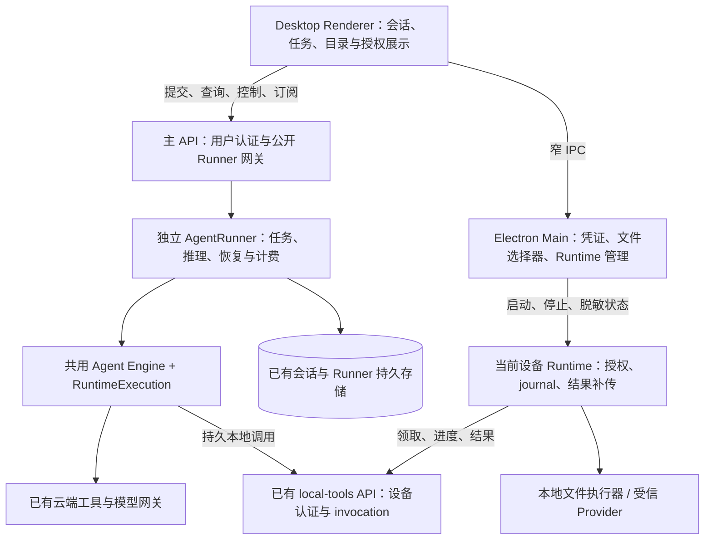

# Agent 桌面客户端设计 v3：接入现有 AgentRunner

> 修订日期：2026-10-08
>
> 状态：方案初稿；用户已明确共用云端 AgentRunner 的核心边界，业务实现尚未开始；首场景与具体分期仍为建议。
>
> 开发计划：[桌面客户端开发计划](../plans/plan-desktop-agent-client.md)
>
> 架构基线：[AgentRunner 服务架构](agent-application-architecture-design.md)、[母体 Agent 收敛原则](agent-kernel-convergence-principles.md)

> 跨会话共同约束：[Runner / Desktop / Runtime 集成契约 v1.1](runner-desktop-runtime-integration-contract.md)、[Runtime插件宿主设计](runtime-plugin-host-architecture-design.md)。本方案接入同一Runtime管理port和执行core，不重复实现插件宿主；公共Electron壳与任务binding由桌面工作流主导共同接线。
>
> 关联：[构建手册](desktop-agent-client-build-manual.md)、[本地与服务端执行调研](../research/desktop-agent-local-vs-server-tool-execution-research.md)

> 开源依据：[Codex、DeepSeek Harness、Hermes 源码调研](../research/desktop-agent-harness-architecture-research.md)；共用执行侧能力：[Runtime 插件宿主设计](runtime-plugin-host-architecture-design.md)。

## 1. 本次重新设计的结论

保留 Electron 和独立 Vue Desktop Shell，把桌面版建设为现有企业 Agent 的任务工作台与本机工具入口。AgentRunner 负责推理和任务生命周期；桌面端发起、观察和控制任务；受信 Runtime 执行本机工具。

旧桌面设计 v2.3 曾采用 Local Agent Coordinator、Agent Turn 和 Remote Tool Gateway，后经 P1 文档整合、取消。本文在原设计路径重建当前方案，不恢复旧路线。旧设计中的独立渲染器、安全 IPC、凭证存储、Provider、文件边界继续复用；本地回合循环、设备拥有聊天执行权和旧 D1 协议不作为新客户端基线。

用户已明确 AgentRunner 是各入口共用的核心，Desktop 也必须接入；本地 Runtime 承担软件操作和工具执行。因此本方案采用云端 loop，设备可直接执行文件、脚本和受控程序，不增加本地自治模型循环。开源项目表明本地 loop 也可以调用并由云端模型服务计费；我们保留云端核心是为了共用已有企业任务、权限、恢复与账本，并非本地 loop 技术上无法计费。

本轮只形成设计和计划，不改变 Runner 已完成状态，不迁移客户 Runtime、不修改业务代码。

## 2. 当前源码事实与缺口

以下为 2026-10-08 静态核对结果，不代表本轮运行或真机验收通过。

| 范围 | 当前事实 | 新设计处理 |
|---|---|---|
| Agent 核心 | `src/core/agent.py` 调用 `RuntimeExecution`；共用 Engine 在 `src/core/agent_engine/` | 复用，桌面不复制 Python Agent，也不增加 TypeScript 模型循环 |
| 执行服务 | `src/services/agent_runner/` 已有持久提交、查询、控制、事件、恢复、用量与本地调用衔接 | 作为唯一聊天任务权威，补缺口在应用适配层完成 |
| Web 网关 | `src/api/agent_runner_web.py` 暴露 `/api/chat/runners`；用户认证转发至独立服务 | 首期复用同一公开契约，不让客户端持有内部 service token |
| 会话与来源 | `SessionRef.kind` 仅 `web/channel`；用户认证要求 `source=chat` | 首期桌面使用既有用户聊天会话，不凭空增加 `desktop` source 或第三类会话表 |
| 桌面壳 | `clients/agent-desktop` 与 `frontend/desktop` 已有独立入口、安全身份、配置、下载、更新和启动 UI | 保留并扩展；首页仍是 Phase C 占位，没有真实对话 |
| 旧共享壳 | `agent-coordinator-core` 只有 `requestTurn` 等接口；`local-tool-host-core` 只有 invoke/shutdown 接口 | 前者停止作为执行设计依据；后者不足以证明 Host 已实现 |
| 旧 D1 | `src/desktop_agent` 仍实现 `/api/desktop/v1/agent/next` 与 tools gateway，按配置挂载 | 保留兼容；新客户端不调用，后续盘点真实消费者后单独退役 |
| 设备执行 | `src/local_tools` + `clients/agent-tool-runtime` 已实现设备身份、claim、Provider、journal、部分 v2 结果 outbox | 复用执行机制；不认定所有 Provider 已支持同等恢复语义 |
| 设备选择 | proxy 与 `device_policy.py` 依赖用户全局 selected、active、在线与能力 | 新桌面任务必须固定设备；不能执行途中追随全局 select |
| 跨平台 | Runtime `PLATFORM` 为 `win32-x64`，设备凭证依赖 DPAPI，CLI 耦合场景与端侧会话任务 | 首个本地能力交付以 Windows 为范围；macOS 需要独立适配与真机验收 |
| 文件工具 | `src/tools/file/*_tool.py` 沿用 BaseTool 默认 SERVER；现有 workspace 是服务端上下文 | 增加明确设备文件引用与本地执行器，不能把本机路径传给服务端读写 |
| 前端复用 | Web `api/runner.ts` 已有 Client，但依赖 Web 类型、环境地址与传入 headers | 逐项提取中性协议/解析/transport，不直接引入 Web 路由或整套 useAgent |

架构依据以当前 `.claude/rules/architecture.md` 与实际 Engine、RuntimeExecution 和 Runner 实现为准。`agent.py` 兼容壳复用同一内核，不能作为新增本地模型循环的依据。

## 3. 产品范围与分期

建议首个使用场景是：用户选择一个本机工作目录，请 Agent 阅读其中的文本资料，生成或修改一份文件；用户可看到任务状态、修改内容和结果位置，重启后能够核对原操作。

| 交付层次 | 具体能力 | 完成含义 |
|---|---|---|
| 第一阶段：云端任务工作台 | 登录、会话、数字员工选择、提交、状态、结果、澄清、暂停/继续/取消、云端附件 | 桌面对话接入完成；此时尚未交付完整本地 Agent 能力 |
| 第二阶段：本地文件闭环 | 当前电脑绑定、目录授权、文本 list/read/search/write/edit、冲突与结果核对 | 达到首个完整桌面 Agent MVP |
| 第三阶段：受控命令与应用 | Shell 权限/隔离、受信 MCP Provider、既有 BOSS/微信能力按任务接入 | 逐能力验收，不随客户端安装默认开启全部自动化 |
| 后续 | macOS 本地 Host、Office 专用 Provider、浏览器人工接管等 | 不作为 Windows 文本文件 MVP 的前置条件 |

首期沿用独立 Desktop UI 和已有设计基础。知识库及数字员工作为现有云端能力接入，不另建桌面数据库版本；复杂管理页面通过已有安全外链打开。平台 `/portal` 不进入桌面产物。系统托盘、开机常驻、离线推理、多设备自动迁移不纳入首期。

## 4. 架构与权威归属

```mermaid
flowchart TB
  UI[Desktop Renderer：会话、任务、目录与授权展示]
  Main[Electron Main：凭证、文件选择器、Runtime 管理]
  Gateway[主 API：用户认证与公开 Runner 网关]
  Runner[独立 AgentRunner：任务、推理、恢复与计费]
  Engine[共用 Agent Engine + RuntimeExecution]
  DB[(已有会话与 Runner 持久存储)]
  LocalAPI[已有 local-tools API：设备认证与 invocation]
  Host[当前设备 Runtime：授权、journal、结果补传]
  Provider[本地文件执行器 / 受信 Provider]
  Cloud[已有云端工具与模型网关]
  UI -->|提交、查询、控制、订阅| Gateway
  UI -->|窄 IPC| Main
  Main -->|启动、停止、脱敏状态| Host
  Gateway --> Runner
  Runner --> Engine
  Runner --> DB
  Engine --> Cloud
  Engine -->|持久本地调用| LocalAPI
  Host -->|领取、进度、结果| LocalAPI
  Host --> Provider
```

| 状态 | 唯一权威 | 客户端保存内容 |
|---|---|---|
| 聊天任务、等待、控制、模型/工具用量 | AgentRunner 及现有仓储 | 脱敏投影、游标、未确认提交的请求键与必要草稿 |
| 聊天会话与历史 | 既有 chat_sessions/chat_messages；沿 Runner 历史职责写入 | 查询缓存，不自行再次写终态消息 |
| 设备及 invocation 的云端接纳 | local-tools 既有仓储与可信 owner 绑定 | 原 claim/操作记录，仅受信 Host 可用 |
| 本机副作用发生的证据 | Runtime journal 与 Provider 回执；云端接纳后记录相关事实 | ACK 前保留结果补传，不成为聊天任务的第二份权威 |
| 本机目录授权 | Main/Host 受信 grant registry；服务端保存绑定与有效版本 | 根路径留本机，云端使用 opaque grant_id、标签与授权范围 |

Desktop 不提交“工具执行成功”来推进 Runner；设备事实只能经设备 API 接纳、核对，再由 Runner 的原等待链路续接。普通客户端 controls 仍只用于业务控制，不能借 `reply` 或 `browser_complete` 冒充工具结果。

## 5. 公开 API 与客户端状态

### 5.1 复用现有 Runner 契约

客户端连接配置的 HTTPS 主 API；主 API 再访问独立 Runner。首阶段使用既有 `source=chat`、`session.kind=web` 与相同历史归属。这样 Web 与 Desktop 可以观察同一会话，继续受同一会话 claim 约束。桌面独有 workspace 绑定在第二阶段通过受控扩展接入。

| 操作 | 现有接口 | 桌面要求 |
|---|---|---|
| 能力探测 | `GET /api/chat/runners/capabilities` | 支持版本且入口启用才允许新建；不可达不回退旧 D1 |
| 提交 | `POST /api/chat/runners` | `client_request_id` 在第一次发送前保存；202 表示接单 |
| 找回任务 | `GET /api/chat/sessions/{session_id}/runners` | 分页读取活跃与历史，不能只看本机缓存 |
| 状态/结果 | `GET /api/chat/runners/{id}` | snapshot/result 为展示基础；防止较旧 revision 覆盖新状态 |
| 事件 | `GET /api/chat/runners/{id}/events` | 认证 Fetch SSE，保存 after_seq；按实际事件协议触发快照补读 |
| 取消 | `POST /api/chat/runners/{id}/cancel` | 已请求与已取消分别展示；不承诺撤销外部动作 |
| 控制 | `POST /api/chat/runners/{id}/controls` | pause/resume/reply；控制接收与实际生效分开 |
| 控制结果 | `GET /api/chat/runners/{id}/controls/{control_id}` | 接收、消费、拒绝明确可见 |

会话创建、历史、数字员工权限和云端上传沿既有 API 接入；实现阶段核对具体参数，不创建新的桌面历史管线。源代码当前事件类型为 created/revision_changed/terminal/settlement_changed，不能把订阅当成原始 token/tool-call 流。任务终态与费用 settled 分别处理。

共享 Client 需注入 API resolver、认证 transport 和订阅实现，去除 Web 固定 baseURL 与类型依赖。只提取实际需要且有测试保护的协议、解码及消息投影，Web 保留现有适配入口。旧 `agent-coordinator-core` 不改名后继续承担模型循环；是否移除该空壳由依赖盘点决定。

### 5.2 提交、等待与恢复

1. 初次发送前保存不可变意图与请求键；响应丢失时按原键重试/查询，不自动换键，也不转旧接口。
2. 切会话或隐藏窗口只停止观察，不取消 runner；重新打开先查询活跃任务，再订阅补读。
3. 普通消息排队；真实澄清答案携带原 `wait_id` 与 `target_execution_id` 回复同一 runner，不把所有 waiting 当作可输入澄清。
4. interrupted 按服务端可恢复状态展示，由用户明确继续；不因 Desktop 重启自动 resume。
5. 缓存、请求 outbox 与认证主体/租户/API origin 绑定。退出登录或换账号停止观察并隔离缓存，旧意图不以新主体重发。草稿和结果缓存使用有界保留与既有安全存储能力，凭证不进入 localStorage。
6. 云端历史与 runner 投影按稳定 ID 合并，避免刷新后重复消息；未接单输入与已接受任务状态分别呈现。

## 6. Runtime 集成与本机生命周期

复用 `agent-tool-runtime` 中 API Client、领取、Provider 管理、取消、journal 和对应 outbox 的机制，新增桌面管理适配与通用文件能力。不要直接 import CLI 入口或把全部端侧自动会话调度拉进 Electron Main。

配对、Runtime core 提取、插件安装与生命周期复用[Runtime 插件宿主计划](../plans/plan-runtime-plugin-host.md)成果，不能由本计划再建设一套同名 Host。独立 Runtime 产品可以提供自身管理 UI 与发行配置，完整 Desktop 复用其管理模块；其托盘/常驻选择不自动改变完整 Desktop 的关闭行为。本计划负责聊天任务、固定环境与文件闭环，两个计划在开工前明确共享模块的实现归属。

- Main 管理隔离 Runtime 进程；renderer 只读脱敏设备/执行状态，并通过窄 IPC 选择目录、授权、撤销和查看本机结果。
- 首期 Runtime 仅启用用户选定能力，不自动启动 SessionTaskEngine 或已有无人值守业务。
- 桌面登录凭证与设备 token 分开。配对复用 pairing-ticket 流程，由受信边界保存设备凭证；退出登录停止本机领取，设备撤销须显式操作。恢复领取前重新核对主体、租户与配对归属。
- 客户已有外置 Runtime 保持原配置与设备身份。桌面不能覆盖、抢占或自动重新配对；同一设备进程重复启动需明确拒绝/展示现有状态，不能出现两个领取者。
- 更新、退出前停止领取，等待正在执行操作到安全点并保存未 ACK 结果；仍有未核对副作用时保留 journal，不能用“杀进程”当作取消成功。
- 当前 Windows 关闭最后窗口会退出应用。沿用该行为：纯云端任务可继续；本机 Runtime 随应用退出而不可用，未完成本地操作按原事实核对。切会话/隐藏窗口与退出应用应有不同提示。常驻执行另行立项。
- 上述退出/注销规则只作用于本产品监管的实例。独立 Runtime 客户端的常驻、共享/外置实例的控制按共同契约第6节处理；不能因退出 Desktop 自动停掉外置 Runtime，也不要求完整 Desktop 为此增加托盘。
- 现有 Runtime/Provider 使用 `process.execPath` 启动 Node 脚本；Electron 集成必须验证受控 Node 执行入口、依赖封装、Provider 路径和签名包资源，不能假定 Electron 可执行文件等同 Node。
- macOS 本地能力在凭证、路径、进程监管、权限、打包和真实设备检查通过前不启用；云端工作台也必须有对应平台启动验证后才能声明支持。

## 7. 任务级设备和 workspace 绑定

现有全局 selected 设备继续服务旧工具链。新桌面文件任务使用显式绑定，不能在开始时调用全局 select 后假定设备不变。

建议第二阶段增加版本化 `execution_binding`，名称为待实现的契约提案：包含设备 ID、grant ID/版本、能力摘要引用与策略版本。主 API 按当前可信用户/租户校验设备归属和 grant；经 Runner 请求摘要、持久输入与 ExecutionState 传到 ToolExecutionContext；子执行继承同一授权边界，不能自行换设备。

执行前、恢复前与派发前重新检查有效性。设备归属与 grant 版本由受信服务/Host 核对，LLM 不能通过参数产生权限。禁止把未经校验的绑定藏进自由 `request_data` 或 prompt 以绕过契约。

新的显式绑定调用路径与旧 selected 路径分开校验：前者验证固定设备、active、授权和能力；后者沿原 selected 规则。需要在 proxy、claim 与结果接纳边界一致实现，不能只改模型提示词或前端。任务接受后不改 binding；换设备/目录须创建新任务或在未来另设迁移协议。

设备离线、能力缺失或 grant 撤销时明确失败/等待核对，不自动换服务器、换电脑或重新 select。首期不提供多设备自动迁移。

## 8. 本地文件语义与授权

### 8.1 文件位置明确

云端附件使用现有 file_id；本机文件使用 `DeviceFileRef` 提案：`device_id + grant_id + grant_revision + relative_path + revision`。本机绝对根路径不作为跨网络权限依据。展示名称与内容片段仍可能传输，不能把“不传绝对根路径”理解为没有数据外发。

模型侧维持稳定的 read/write/edit 语义；绑定 workspace 的普通相对路径按可信上下文解析，显式 cloud file_id 使用云端实现。适配在工具/资源路由层完成，不给 Engine 增加按桌面工具名称分支。裸本机绝对路径不能被服务端误处理；不改变现有云端默认行为。

| 能力 | 本机行为与验收 |
|---|---|
| list/search/read | 限于批准目录，限制文件类型、大小、分页与结果量；返回文件 revision |
| write | 默认不覆盖；创建/替换前按权限核对，临时文件原子落盘，记录结果 revision |
| edit | 必须匹配读取时 revision；冲突保留用户修改，不能静默覆盖 |
| 本地结果查看 | Main/Host 由受信文件引用解析；不接受任意 renderer 路径，不自动打开可执行文件 |
| 保存云端产物 | 用户明确选择目的目录后下载/写入；与“读取本地文件”分别授权 |

首期仅普通文本文件；文件后缀不等于安全格式，需检查编码/大小及目标。Office/PDF 解析与批量目录处理后续按独立能力加入，不为一次文本读写复制所有服务端解析器。

### 8.2 授权与副作用恢复

- 用户经原生选择器创建目录 grant；权限区分读、创建、修改，不包含目录外、删除、Shell、外发消息。授权记录绑定主体、设备、规范化根路径与版本，可撤销。
- 同时校验服务端许可与 Host 实际路径边界，包括符号链接、Windows reparse point、UNC/设备路径以及目录替换。校验与打开之间的竞态需要平台实现保障，不能仅凭字符串前缀或一次 resolve 宣称安全。
- 写动作准备阶段持久保存 invocation、目标引用、原/新 revision 与授权摘要。效果发生后保存回执；ACK 前只重传结果，不再次写文件。
- 本地执行事实不明确时进入核对，不自动重试不可撤销操作。结果 outbox、目录权限与恢复证明必须覆盖新增文件 Provider；不能直接套用已有某个 v2 业务写协议就宣称通用写安全。
- 需要逐次批准的操作采用持久审批记录，绑定主体、runner、invocation、参数摘要、grant/策略版本和有效期。审批答复与澄清 reply 分开，设备领取/执行必须等待许可。
- 现有 Runner controls 没有 approve/reject；目录 grant 与审批记录/入口属于新增工作。具体 schema 与等待适配在第二阶段开工前定稿，未知/过期批准不能经普通 reply 转换为执行权。
- 云端负责模型和既有工具计费，Runtime 不自报积分免账或调用 chat 用量结算；新增工具价格在实施时按现有规则登记。

Agent 与模型在云端，因此读取返回的文本片段会经过服务器和模型。首次建立目录授权必须说明这个边界；未经用户选择，不把整个目录或完整文件隐式上传云端。产品不能宣称离线或内容完全不离机。

### 8.3 同一任务环境与本地执行效率

借鉴三家的 execution environment 思路，设备文件、Shell、skill 和应用工具共用任务的固定设备与 workspace。相对路径在对应执行世界解析，不能 read 在本机而 shell 访问云端同名目录；显式云端资源仍使用独立 file_id/空间。

本地执行不限于“一次 read”：支持有界 batch read/search，后续支持本机 CSV/Office 解析、筛选、聚合和受权脚本。一个程序可执行循环、转换和校验，只将必要片段、统计、diff、退出码与产物引用回传 Runner；不先上传全部原文件再在服务器处理。云端模型需要的文字/像素仍须传输。

本地程序循环不是 Agent loop。Runtime 不调用模型决定业务下一步；需要推理、澄清或子智能体时返回同一 Runner。已有完整流程脚本可一次派发，普通 SKILL.md 仍由云端 Agent 分步理解和执行。

原生选目录、用户点击预览与打开受信本机产物可以走 Main 窄 IPC，无需模型时不创建任务；模型发起操作仍走 Runner 受权调用，不能用 UI IPC 绕过工具权限并自报成功。

性能先优化模型轮数、批处理和结果大小，再测 invocation 排队/领取与持久化开销。首版复用现有设备协议；若实测小文件频繁往返成为瓶颈，再在相同授权端口内增加连接复用/读批处理。读链路可以采用可重试、轻量调用语义，仍保存 Runner 工具结果；写/发送/效果未知命令保留持久派发、journal 与结果核对，不机械套用领域写流程到每次 read。

DeepSeek PTC、Hermes execute_code 的程序化组合列为后续优化参考，首期不直接建设完整 PTC/工作流 DSL；批内逐项失败与副作用证据必须可见。

## 9. 命令和应用工具的后续边界

通用 Shell 不属于文本文件 MVP。目录 grant 不能限制任意命令的文件、网络或子进程访问，也不能把 `cwd` 当作沙箱。

第三阶段先明确命令权限模式与 OS 可实施的隔离。没有已验证隔离时，通用命令必须按能触达当前用户系统权限的事实展示并逐次批准；无法提供该产品承诺就不开放通用 Shell。结构化、受信 Provider 的有限操作可独立启用。

命令批准绑定确切 command/args、cwd grant、环境策略、网络/进程权限和超时，不把批准转为“永久任意执行”。管理进程树、输出截断、取消和未知效果核对；Provider 仅继承批准的环境变量，不能原样继承桌面登录凭证。消息发送、删除、安装、系统修改分别建立相应策略，不能只用一项“允许本地工具”。

现有 BOSS、微信与 skill-runner 的业务许可、设备锁、计费与 outbox 分支保持原职责；接入按能力单独验证，不将旧 v1 写无条件等同新增通用文件写的安全保证。

## 10. 工程落点与迁移原则

| 落点 | 建议改动范围 |
|---|---|
| `frontend/desktop` | 对话、会话、任务状态与目录/授权 UI；只保存观察状态 |
| `frontend/shared` | 经验证提取的 Runner DTO、解码、认证 transport 与消息投影 |
| `clients/agent-desktop/electron` | 窄 IPC、目录选择器、Runtime 监管与本机结果操作 |
| `clients/agent-tool-runtime` | 可受管启动边界、通用文件 Provider/执行器、授权与回执；不 import CLI 执行副作用 |
| `clients/shared/local-tool-host-core` | 仅提取 Desktop/独立 Runtime 确实共用的契约，不提前建设通用框架 |
| `src/services/agent_runner` | execution binding、等待/审批与恢复接线；不把领域逻辑放入 Engine |
| `src/local_tools` 与文件工具适配 | 固定设备校验、受信 Provider、文件引用与结果核对；保留旧 selected 路径 |

以客户端能力和服务端配置逐阶段启用。旧 D1 不自动跳转新 Runner；活跃旧任务不转换新状态，历史可沿原归属查询。旧客户端、Web、渠道与客户 Runtime 的兼容回归纳入对应阶段。新增字段缺省保持旧意图摘要与行为，版本不兼容明确拒绝恢复。

如需新表，遵守数据库分类、租户隔离和变更登记规范；不能把新增 grant/审批账本与已有 Runner 事件或费用账本混在一起。实现清单和具体迁移 SQL 在对应阶段设计确认后生成。

## 11. 成功标准

1. 桌面真实请求经过独立 Runner API/worker 和共用 Engine；进度、结果、等待、取消、恢复不由客户端另建业务状态机。
2. 提交响应丢失不重复任务，刷新/重启能找回原 runner，事件失效仍可查询完整结果。
3. 原澄清恢复同一 runner；暂停请求与已暂停不同，取消不声称撤销已发生效果。
4. 文本文件副作用仅发生在任务固定设备的批准目录；换全局 selected 不改变执行位置。
5. 越界、撤权、文件 revision 冲突、旧 claim、未知副作用不能继续写；结果补传不重复执行。
6. 本机结果与云端下载位置可区分；用户知道云端模型会读取授权内容片段。
7. 旧 Web/渠道/D1 与客户 Runtime 按实际依赖回归，不要求客户重新安装或配对。
8. Windows 安装包真实验证完成才标记 Windows 本地 MVP；macOS、Shell、Office、真实更新源分别记验收范围。

## 12. 待确认与实施前决策

- 已确认核心边界：Desktop 共用云端 AgentRunner，本机 Runtime 执行工具；本地程序化处理不能变成第二套自治模型循环。
- 首场景：默认文本文件整理/生成；企业应用自动化可以调整排序，但须保留固定设备与许可边界。
- 第二阶段开工前定稿：grant 生命周期与存储、execution_binding DTO、文件路由 schema、审批入口与等待原因、Provider 写协议及未知结果核对。
- 第三阶段开工前定稿：Shell 权限/隔离与允许的命令形态；未经验证不承诺路径沙箱。
- 发行范围：默认先 Windows 本地 MVP；macOS 的优先级与真机资源另行确认。
