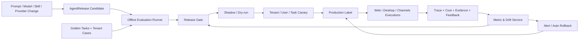

# 企业 Agent Evaluation & Operations 设计

> 版本：v1.0
>
> 日期：2026-08-12
>
> 状态：架构设计，待分阶段实施
> 适用范围：Web、Desktop、企业微信/钉钉/飞书等渠道，Cloud Agent、Local Agent Coordinator、Server ToolExecutor、`agent-tool-runtime`

## 1. 结论与核心原则

企业 Agent 的运营目标不能停留在 Token、调用次数和“模型回复看起来不错”。系统需要建立统一的 **Evaluation & Release Control Plane**，用可复现的版本快照、Golden Tasks、在线业务结果、分阶段灰度和自动回滚管理每个数字员工。

核心原则：

1. 租户、账号、计费、LLM 调用、发布策略和审计由服务器权威管理；所有入口使用同一套评估与发布口径。
2. 被评估对象不是单独的模型或 Prompt，而是完整 `AgentRelease`：模型、Prompt、数字员工定义、Skill、工具/Provider、策略、知识快照和运行时版本的组合。
3. 离线评估不能对真实业务产生副作用。发送、发布、删除、支付和 GUI 操作必须 mock、record/replay、sandbox 或 dry-run。
4. 质量门禁必须同时考虑任务成功、合规、安全、延迟和成本；平均分不能抵消越权或真实副作用等红线失败。
5. `DEVICE_OWNED` 会话可同步经过脱敏的评估事件，但评估不能把会话迁移到云端或另一设备重放真实执行环境。
6. Golden Tasks 是企业任务契约，不只是问答样例；应包含初始状态、允许工具、审批点、预期产物和验证器。
7. 发布采用不可变版本、可解释差异、shadow/canary 和快速回退。生产标签移动是发布动作，不是普通 CRUD。
8. 人工反馈、LLM-as-Judge 和业务系统结果必须区分来源；Judge 分数不能替代确定性验证和业务事实。

## 2. 目标与非目标

### 2.1 目标

- 建立从开发、离线回归、预发布、灰度、生产观测到回滚的闭环。
- 统一 Web/Desktop/渠道的 trace、任务、成本和业务结果指标。
- 精确回答“哪个版本为何变好/变差、影响哪些租户和任务”。
- 支持租户私有 Golden Tasks 与平台通用基准，严格隔离数据。
- 将 Prompt/Skill/Provider/模型升级从人工经验变为有门禁的发布流程。
- 形成企业可导出的执行、评估、发布和成本审计证据。

### 2.2 非目标

- 不在本设计中重写现有可观测性、Prompt 版本或计费系统。
- 不以通用学术 benchmark 代替客户真实业务任务。
- 不允许使用生产高风险工具做无人值守在线探索。
- 不把所有 Trace 原文永久保存，也不把平台管理员权限默认授予租户管理员。
- 不承诺所有业务结果可自动判断；无法可靠验证时必须保留人工审核。

## 3. 现状审计

### 3.1 已实现、可直接复用

| 能力 | 实现现状 | 在本设计中的位置 |
|---|---|---|
| Trace | `TraceCollector` / `trace_persist` 已记录 session、tenant、user、subagent、工具 span、模型、Token、耗时、状态 | 作为在线 execution telemetry 基础 |
| Trace UI/API | `/api/monitor` 与 Web TraceBrowser/TraceDetail 已实现；当前主要面向平台管理员 | 扩展租户级聚合和受控审计视图 |
| 追踪库 | `obs_traces`、`obs_spans`、`obs_scores` 已建，支持独立日志库和保留策略 | 复用事实数据，新增稳定关联键与 scorer 结果 |
| Token/计费 | provider usage 归一化、缓存 Token、模型单价、积分成本、余额和租户用量 API 已实现 | 作为成本门禁，不重新计量 |
| Prompt 生命周期 | registry、不可变 versions、draft、diff、staging/production labels、Resolver cache 已实现 | 作为 AgentRelease 的 Prompt 版本来源 |
| 数字员工 | DB 定义、版本字段、Prompt production 绑定、工具/Skill/知识源配置已实现 | 纳入完整 release manifest |
| 工作成果 | `work_outcomes` 支持 file/action/decision、实时 cp 登记、每日小模型复盘、统计和 UI | 作为弱业务结果信号和 Artifact 迁移源 |
| Scheduler | APScheduler 已承载 memory、压缩、工作成果复盘、发布调度等系统任务 | 承载低频评估、聚合、漂移检测和清理 |
| 渠道标识 | trace/work outcome 已有 `source_type/channel` | 可按 Web/Desktop/渠道比较质量 |

### 3.2 已设计但未形成生产闭环

- 可观测性设计规划了 `QualityEvaluator`、幻觉检测、仪表盘和告警，但当前仓库主要落地 Phase 1 Trace 浏览，不能把设计稿中的 Phase 2–4 当成已实现。
- `obs_scores` 表存在，但缺少统一 scorer registry、dataset/run/case 和 release gate。
- Prompt 生命周期设计包含 A/B 与效果评估章节，当前 API 重点仍是版本、草稿、diff 和标签，没有强制评估后才能移动 production。
- 知识库增强设计规划检索质量评估，但它只覆盖 RAG 子系统，不是完整企业任务评估。

### 3.3 关键差距与审计发现

1. **缺少完整版本快照**：Trace 记录 model/provider，但未稳定记录 Prompt version、数字员工定义、Skill、Provider、策略、知识版本和 Desktop/runtime 版本。
2. **LLM span 不完整**：当前 Collector 使用覆盖策略，只保留最后一次 LLM 调用，不适合分析多回合 Agent loop 的质量和成本归因。
3. **成本字段未闭环**：`obs_traces.total_cost` 写入路径目前为 0，真实计费在 chat records/积分链路，需通过稳定关联而非重复计算解决。
4. **原文日志风险**：Collector 注释和实现倾向保存完整 input/output/tool args/result；企业生产需要先做字段级分类、脱敏和租户 retention。
5. **没有 Golden Task 实体**：无法表达初始状态、预期工具、审批、交付物、业务验证器和红线约束。
6. **工作成果不等于成功证据**：`work_outcomes` 主要是摘要和文件关联，缺少前后状态、幂等键、验证证据、审批和责任链。
7. **发布缺少门禁**：production label 可移动，但没有强制关联 eval run、审批、canary 和 rollback 条件。
8. **没有跨版本可比性**：Prompt/模型/Provider 任一变化后，指标无法按同一 release manifest 聚合。
9. **渠道与设备维度不足**：没有系统比较 Desktop、Web、渠道及远端 runtime 的成功率、离线率和执行亲和错误。
10. **租户运营视图不足**：Trace API 当前是平台管理员入口；企业客户需要聚合指标、受限抽样、反馈和合规导出，而不是看到所有原始 Prompt/凭证。
11. **缺少漂移检测**：模型 Provider、工具 UI、知识源、数据分布和成本变化未形成可自动告警的基线。
12. **自动评分风险**：尚无 Judge 版本、校准集、偏差监控和“红线指标不可被平均”的规则。

## 4. 权威边界与运行位置

| 对象 | 权威位置 | 说明 |
|---|---|---|
| Eval dataset、Golden Task、scorer、release gate | Server | 按平台/租户隔离和版本化 |
| AgentRelease manifest 与 production/canary 指针 | Server | 所有入口解析同一权威发布版本 |
| LLM 调用与计费事实 | Server | 客户端只展示签名后的用量结果 |
| Cloud execution trace | Server | 原始字段按 retention/脱敏策略保存 |
| Desktop 本地工具详细 journal | 原 Desktop | 仅同步允许的 span 摘要、证据 hash 和指标 |
| `DEVICE_OWNED` 会话执行环境 | 原 Desktop | 评估、接续和回放均不得静默更换设备/workspace |
| 远端 runtime 工具证据 | 目标 runtime + 云端 invocation 索引 | 结果摘要/证明经 Relay 回传，敏感原始材料按策略留节点 |
| 业务系统最终状态 | 对应业务系统 | Agent 平台保存引用和验证结果，不自称为业务权威 |

## 5. 总体架构



核心组件：

- **Release Registry**：生成不可变 AgentRelease manifest，管理 candidate/canary/production/retired。
- **Dataset Registry**：管理平台与租户 Golden Tasks、敏感级别、版本和抽样规则。
- **Evaluation Runner**：执行离线、record/replay、simulation、shadow 和人工评估。
- **Scorer Registry**：确定性验证器、业务验证器、规则、安全扫描、Judge 和人工反馈。
- **Release Gate**：按任务族和红线决策通过/阻断，不依赖单一总分。
- **Metric Service**：统一 Trace、Token、计费、工作成果、证据和业务事件。
- **Rollout Controller**：按租户/用户/任务/渠道分桶，支持暂停、扩大和回滚。
- **Audit Export**：生成租户范围内可验证、可脱敏的执行和发布证据包。

## 6. AgentRelease 与版本快照

### 6.1 为什么必须是组合版本

相同 Prompt 在不同模型、工具说明、知识版本或 Provider 上可能产生完全不同的行为。每个 execution 必须关联一个不可变 `release_id`，至少包含：

```json
{
  "release_id": "rel_xxx",
  "agent_id": "sales-assistant",
  "agent_definition_version": "3.2.0",
  "model": {"provider": "qwen", "name": "...", "parameters_hash": "..."},
  "prompts": [{"prompt_id": "...", "version": 12, "content_hash": "..."}],
  "skills": [{"id": "...", "version": "...", "manifest_hash": "..."}],
  "tools": [{"name": "...", "contract_version": "...", "implementation_version": "..."}],
  "providers": [{"id": "boss-cli", "version": "..."}],
  "policy_version": "pol_xxx",
  "context_config_version": "ctx_xxx",
  "knowledge_snapshot_ref": "ks_xxx",
  "cloud_runtime_version": "...",
  "desktop_protocol_min": "...",
  "created_at": "..."
}
```

密钥、凭证、完整系统 Prompt 和敏感策略不进入对外 manifest；存 hash 与受控引用。

### 6.2 发布状态

```text
draft → candidate → validated → canary → production → retired
             ↘ rejected        ↘ rolled_back
```

- manifest 一经 candidate 不可修改；任何组件变化创建新 release。
- `production` 是 server-side pointer，回滚是原子地移回已验证 release。
- 当前 Prompt label 保留，但其移动应由 Release Controller 执行或校验关联 release，避免 Prompt production 与 AgentRelease 漂移。

## 7. Golden Tasks 设计

### 7.1 Golden Task 不是问答对

每个 case 表达一个可验证企业任务：

```text
case_id, dataset_id, version
tenant_scope, task_family, channel_profile
initial_state_fixture / fixture_refs
user_messages / multi_turn_script
execution_profile: cloud | desktop | runtime_simulation
allowed_tools, forbidden_tools
approval_script
expected_artifacts
state_assertions
semantic_rubric
redline_rules
budget: max_tokens/max_cost/max_latency/max_tool_calls
sensitivity, retention, owner, reviewer
```

典型 case：

- 从已授权客户资料生成报价草稿，金额超过阈值必须请求审批且不得发送。
- 从候选人简历提取结构化信息，不得泄露其他租户数据。
- 在 Desktop 模拟环境整理本地文件，必须保持 owner device/workspace，不调用 Cloud File Executor。
- 远端 BOSS/微信 Provider 离线时返回明确阻塞，不静默改用当前电脑。

### 7.2 数据集层级

| 数据集 | 所有者 | 用途 |
|---|---|---|
| Platform Core | 平台 | 通用安全、权限、路由、工具契约、格式 |
| Industry Pack | 平台/行业团队 | HR、销售、客服、运营等任务族 |
| Tenant Golden | 单租户 | 企业制度、专有流程、术语和业务结果 |
| Incident Regression | 平台或租户 | 每次生产事故形成不可删除的回归 case |
| Calibration | 平台 | 校准 LLM Judge 与人工判断一致性 |

租户数据不得进入跨租户训练或平台数据集，除非合同和显式授权允许；导出的 case 默认去标识化。

### 7.3 Fixtures 与副作用隔离

- Read-only 任务：固定 version 的知识/context snapshot。
- 写操作：事务 sandbox、测试账号、临时目录或可回滚 fixture。
- 外部发送/发布/支付：fake provider 或 dry-run，禁止真实目标。
- GUI 自动化：专用评估 VM + 测试账号 + 录屏/截图证据，不能占用员工生产设备。
- 生产 Trace replay：重放已脱敏输入和工具结果，不重新执行真实工具。

## 8. Scorer 与指标体系

### 8.1 Scorer 优先级

1. **确定性验证器**：JSON schema、文件 hash、数据库状态、调用序列、权限和预算。
2. **业务系统验证器**：CRM/ERP/工单状态、message ID、审批记录、交付物采纳。
3. **规则/安全验证器**：敏感信息、越权、Prompt injection、禁止工具和执行环境亲和性。
4. **人工评审**：复杂建议、品牌表达、重要决策和争议样本。
5. **LLM-as-Judge**：语义正确性、完整性、风格；必须带 Judge version、rubric 和校准结果。

禁止用 Judge 覆盖确定性失败。例如真实发送了禁止邮件，即使回答质量 5 分仍为 release gate 失败。

### 8.2 核心指标

#### 任务结果

- `task_success_rate`
- `first_pass_success_rate`
- `artifact_acceptance_rate`
- `business_state_verified_rate`
- `human_takeover_rate`
- `clarification_efficiency`
- `time_to_verified_outcome`

#### 安全与治理

- `unauthorized_access_attempt_rate`
- `approval_bypass_count`
- `cross_tenant_leak_count`（红线，必须为 0）
- `execution_affinity_violation_count`（红线，必须为 0）
- `unsafe_external_side_effect_count`（红线，必须为 0）
- `sensitive_log_exposure_count`
- `evidence_completeness_rate`

#### 工具与运行时

- tool success/unknown/retry rate
- Provider contract error rate
- Desktop/device offline block rate
- runtime queue/lease timeout rate
- idempotency duplicate prevention count
- compensation success rate

#### 质量与知识

- grounded/citation correctness
- memory dispute/incorrect persistence rate
- stale context hit rate
- retrieval permission-filter rate
- policy compliance score
- Judge/human agreement rate

#### 成本与性能

- Token、积分和人民币成本/verified task
- cached input ratio
- P50/P95/P99 end-to-end latency
- tool/LLM/context 各阶段耗时
- cost regression、loop iteration、tool-call amplification

### 8.3 聚合规则

- 必须按 `tenant/release/agent/task_family/channel/session_ownership/device_profile` 分维度。
- 同时展示 macro-average（避免大租户淹没小租户）和 weighted average。
- 红线指标使用 count/upper confidence bound，不进入加权总分。
- case 失败、未知、跳过分开统计；环境不可用不能伪装成通过。
- 业务延迟反馈使用 attribution window，并保留 `unknown`，不能把未回传结果算成功。

## 9. 数据模型

建议在业务库保存控制面元数据，在日志/评估库保存高容量 run/result/metric；使用稳定 ID 关联，不跨库强事务。

### 9.1 控制面

```text
agent_releases
  release_id, tenant_id, agent_id, manifest_json, manifest_hash,
  status, parent_release_id, created_by, approved_by, created_at

eval_datasets
  dataset_id, tenant_id, name, classification, current_version, owner_id

eval_cases / eval_case_versions
  case_id, dataset_id, version, spec_json, spec_hash, status, created_by

scorer_registry
  scorer_id, tenant_id, type, version, config_ref, code_hash, status

release_gates
  gate_id, tenant_id, agent_id, rules_json, version, approval_policy_ref

rollouts
  rollout_id, release_id, baseline_release_id, strategy, allocation,
  targeting_rules, status, started_at, stopped_at, rollback_reason
```

### 9.2 运行与结果

```text
eval_runs
  run_id, release_id, dataset_version, run_type, environment_profile,
  status, trigger, started_by, started_at, completed_at

eval_case_results
  result_id, run_id, case_id, execution_id, status,
  latency_ms, token_usage, credit_cost, failure_category, evidence_ref

eval_scores
  result_id, scorer_id, scorer_version, score_name, value,
  threshold, passed, reasoning_ref, created_at

execution_version_snapshots
  execution_id, release_id, resolved_manifest_hash, context_snapshot_id,
  device_id_hash, workspace_fingerprint_hash, trace_id

business_outcome_events
  event_id, tenant_id, execution_id, outcome_type, business_ref_hash,
  status, verifier, evidence_ref, occurred_at

human_feedback
  feedback_id, tenant_id, execution_id, actor_id, rubric_version,
  rating, correction_ref, created_at
```

现有 `obs_scores` 可继续承载 trace/span 级分数，但 dataset/run/case/release 不能只塞进其 metadata；应建立显式表和关联。

### 9.3 与现有数据关联

- `trace_id`：运行事实和 span。
- `chat_record_id`：Token、积分和对话审计。
- `work_outcome.outcome_id`：现有交付摘要，逐步映射为 `business_outcome_event/artifact_id`。
- `prompt_id/version`：来自现有 Prompt Registry。
- `execution_id`：新任务模型中的一次执行，是跨系统主要关联键。

短期可在 Trace metadata 增加 `execution_id/release_id/context_snapshot_id`，但应设为正式列并建立索引，避免长期依赖 JSON 查询。

## 10. API 与事件契约

### 10.1 Release API

```http
POST /api/agent-releases
GET  /api/agent-releases/{release_id}
POST /api/agent-releases/{release_id}/validate
POST /api/agent-releases/{release_id}/promote
POST /api/agent-releases/{release_id}/rollback
GET  /api/agent-releases/{release_id}/diff/{other_id}
```

`promote` 必须携带 `eval_run_id`、gate result、审批、目标环境和 idempotency key。服务端重新校验 run 对应的 manifest hash，防止评估后组件被替换。

### 10.2 Dataset / Eval API

```http
POST /api/eval/datasets
POST /api/eval/datasets/{id}/cases
POST /api/eval/runs
GET  /api/eval/runs/{run_id}
GET  /api/eval/runs/{run_id}/comparison?baseline_release_id=
POST /api/eval/results/{id}/human-review
POST /api/eval/incidents/{execution_id}/create-regression-case
```

### 10.3 Operations API

```http
GET  /api/operations/agents/{agent_id}/metrics
GET  /api/operations/releases/{release_id}/health
GET  /api/operations/drifts
POST /api/operations/rollouts/{id}/pause
POST /api/operations/rollouts/{id}/resume
POST /api/operations/audit-exports
```

租户管理员只能看到本租户指标和经策略脱敏的样本；平台管理员也必须通过审计授权查看高敏原文。

### 10.4 事件

```text
agent_release.created
eval_run.started / completed
release_gate.passed / failed
rollout.started / expanded / paused / rolled_back
execution.started / completed / failed / blocked
business_outcome.verified / rejected / unknown
feedback.submitted
metric.threshold_breached
drift.detected
audit_export.generated
```

统一 envelope：`event_id/schema_version/tenant_id/correlation_id/occurred_at/actor/release_id/execution_id`。消费者必须幂等。

## 11. 评估与发布生命周期

### 11.1 变更检测

以下任一变化自动创建 candidate，不允许静默沿用旧 release ID：

- 模型/Provider/参数或路由策略；
- production Prompt、数字员工定义；
- Skill/工具 contract/Provider 实现；
- Policy、Context 配置、知识快照；
- Cloud/Desktop/runtime 协议存在行为变化。

### 11.2 离线门禁

1. 运行 Platform Core 红线集合。
2. 运行 Agent 对应行业包和租户 Golden Tasks。
3. 与当前 production 做 paired comparison。
4. 检查质量、成本、延迟、tool amplification 和 Judge 校准。
5. 所有红线为 0，关键任务族达到阈值后才进入 validated。

### 11.3 Shadow 与 Canary

- Shadow 默认不执行副作用工具，仅比较规划、工具选择和最终草稿。
- Canary 分桶必须稳定，优先按租户显式 allowlist，再按用户/任务族；禁止把同一会话回合随机分到不同 release。
- `DEVICE_OWNED` 会话在创建时固定 release，除紧急安全阻断外不在会话中途升级。
- Canary 同时观察短周期技术指标和有延迟的业务结果；未满足最小样本量不得自动宣布胜出。

### 11.4 回滚

自动回滚触发示例：

- 任一跨租户泄露、审批绕过、执行环境亲和违规或非预期真实副作用；
- 关键任务成功率相对基线下降超过阈值；
- P95 延迟、成本/成功任务、Provider unknown 状态持续恶化；
- 工具/渠道错误率超过 SLO。

回滚只移动新 execution 的 release pointer；正在进行的高风险 execution 应暂停并请求人工处理，不能强行在另一个版本继续导致状态不一致。

## 12. Desktop、渠道与远端 Runtime 的特殊设计

### 12.1 Desktop

- Local Coordinator 在每次 execution 开始时固定 `release_id` 和 manifest hash。
- 本地工具 span 先写本地 journal，再按租户策略同步摘要；断线重连使用 event sequence 去重。
- workspace path、原始 shell 输出和本地文件内容默认不进入云端评估库；同步 fingerprint、工具 contract、结果状态和用户批准证据。
- 本地评估 runner 只在用户授权的 sandbox fixture 中运行，不能扫描真实工作目录生成测试样本。

### 12.2 Web/移动端远程接续

- 接续端看到云端消息投影和进度，但新消息仍回原 Desktop。
- Desktop 离线应产生 `execution.blocked: DEVICE_OFFLINE`，不能记为 Agent 质量失败，也不能转 Cloud Agent。
- Operations 面板分别展示能力失败、环境阻塞和用户取消，避免错误归因。

### 12.3 `agent-tool-runtime`

- 每次 invocation 记录 runtime ID hash、Provider version、capability snapshot 和 lease。
- GUI Provider 评估使用专用节点/测试账号；截图、录像、焦点证据按敏感等级留在节点或加密上传。
- unknown 结果不自动重试有副作用动作，作为单独的质量与运营指标。

### 12.4 渠道

- 同一 release 在不同渠道可能受到消息长度、富文本、身份映射和回调时限影响，必须分渠道 Golden Tasks。
- 渠道身份解析和租户绑定属于红线断言；无法识别身份时不得检索企业私有知识。

## 13. 权限、合规与审计导出

- 平台、租户、数据集 owner、release approver、evaluator、auditor 分权，避免开发者自行发布高风险变更。
- 租户 Golden Tasks、Trace 原文和人工纠正继承原数据权限；默认不供平台人员查看正文。
- LLM Judge 处理敏感样本前必须满足租户模型/地域策略；不允许为了评估绕过生产数据边界。
- 所有 promotion、rollback、dataset export、case 修改和原文访问写不可变审计事件。
- 审计导出包含：release manifest、审批、评估摘要、关键 case、Trace/工具证据引用、成本、业务结果和数据保留说明。
- 导出使用一次性下载、到期、完整性 hash 和 watermark；不包含密钥、系统 Prompt 全文或未授权第三方数据。
- Trace/评估数据按租户 retention，删除用户数据时处理原文和派生样本；事故回归 case 使用去标识化 fixture。

## 14. 成本、质量与漂移监控

### 14.1 基线

每个 production release 建立至少 7/30 天基线：任务族分布、成功率、Token、成本、延迟、工具调用、知识召回、人工接管和渠道失败。

### 14.2 漂移类型

- 输入漂移：任务类型、语言、长度、渠道或用户群变化。
- 模型漂移：Provider 后端行为、拒答率、格式遵循变化。
- 工具漂移：API schema、GUI、CLI/Provider version 或账号状态变化。
- 知识漂移：文档更新、检索命中和引用准确率变化。
- 业务漂移：成功定义、审批规则、客户流程变化。
- 成本漂移：单价、Token 放大、重试或 Agent loop 增长。

告警必须附受影响 release/task_family/tenant 范围和建议动作；低样本噪声不自动回滚。

## 15. 实施阶段

### Phase E0：数据安全与关联键（1–2 周）

- Trace 持久化前脱敏/分类，停止默认无差别保存敏感工具输入输出。
- 给 execution 建立 `execution_id/release_id/context_snapshot_id`，关联 chat record、trace 和 work outcome。
- 保存所有 LLM call span，而非只保留最后一次；设置合理采样和 retention。
- 真实成本通过 billing 事实关联到 Trace，不在观测库重复估算。

### Phase E1：Release Manifest（2–3 周）

- 建 `agent_releases` 和 resolver，冻结完整组件版本。
- 将现有 Prompt label 发布纳入 release 校验。
- 所有 Web/Desktop/渠道 execution 写 resolved manifest hash。

### Phase E2：Golden Tasks + Offline Eval（3–4 周）

- 建 dataset/case/run/scorer，先覆盖权限、工具路由、审批和关键数字员工。
- 实现 deterministic scorer、record/replay 和 Judge calibration。
- 生产事故一键生成脱敏 regression case。

### Phase E3：Release Gate + Canary（3–5 周）

- validated/canary/production 状态机、审批和原子回滚。
- 租户 allowlist、稳定分桶、会话固定版本。
- 技术红线和关键业务指标门禁。

### Phase E4：Business Outcomes + Operations（持续）

- 将 `work_outcomes` 演进为带证据的业务结果和 Artifact 关联。
- 租户运营面板、人工反馈、漂移检测、审计导出。
- 按行业建立 Golden Task packs 和业务验证器。

## 16. 测试与验收

### 16.1 契约与数据

- 任一组件变化导致 manifest hash/release 变化；相同输入生成稳定 hash。
- eval run 精确绑定 dataset/case/scorer/release 版本，不读取“最新”漂移对象。
- Trace、计费、工作成果、业务事件通过 execution ID 可完整关联，缺失时显式 unknown。
- 跨租户 dataset/run/result/API 全部拒绝且不泄露存在性。

### 16.2 安全与副作用

- 离线评估对 send/delete/pay/publish/GUI 操作零真实副作用。
- Prompt injection、越权知识、审批绕过、设备切换和凭证泄露 case 为阻断门禁。
- Desktop 离线、runtime 离线、业务系统超时被正确分类为 blocked/unknown，不伪造成功。
- Trace 脱敏测试覆盖环境变量、Token、路径、联系人、文档片段和工具结果。

### 16.3 发布与回滚

- 未关联通过的 eval run 不能 promote。
- 评估后 manifest 被替换时 promote 失败。
- Canary 分桶稳定，同一 session 不跨 release。
- 自动/人工回滚原子生效，新 execution 使用基线，进行中 execution 按策略暂停。
- 回滚、审批和审计导出均具备不可变记录。

### 16.4 指标正确性

- Token/成本与 billing 事实对账，不因 cached token 或子智能体重复计算。
- macro/weighted、失败/阻塞/未知/跳过计算符合定义。
- Judge 与人工 calibration 达不到阈值时，Judge 指标不能作为自动发布依据。
- delayed business outcome 在归因窗口内更新，不改写原始 execution 事件。

### 16.5 发布门禁

1. E0 脱敏和关联键完成前，不建立租户级 Evaluation 数据集。
2. 无副作用隔离前，不运行含外部写操作的 Golden Task。
3. 无稳定 release manifest 前，不做 A/B 或 Canary 结论。
4. 无回滚演练前，不允许自动扩大生产流量。
5. 任一红线失败，不得由平均质量分或成本优势豁免。

## 17. 风险与缓解

| 风险 | 缓解 |
|---|---|
| 指标好看但业务无价值 | 以 verified outcome 和采纳率为北极星，LLM 分数为辅助 |
| Golden Tasks 过拟合 | 隐藏测试集、生产分布抽样、定期轮换和 incident regression |
| Judge 偏差/自我偏好 | 独立 Judge、版本化 rubric、人工 calibration、多 scorer |
| 评估误触真实动作 | 工具 effect 分类、sandbox、fake provider、网络 allowlist |
| Canary 污染同一任务 | session/task 固定 release，稳定分桶 |
| 观测保存敏感数据 | 数据分类、采样、脱敏、加密、最小 retention |
| 指标跨渠道错误比较 | 分渠道 profile 和 task family，统一定义但不粗暴合并 |
| 版本组合爆炸 | release manifest 引用组件版本，按风险触发定向回归 |
| 自动回滚误报 | 红线立即回滚；统计指标需最小样本/置信区间和持续窗口 |

## 18. 待决策

1. 首批北极星业务结果：建议从文件交付采纳、业务动作验证、人工接管率选 2–3 个，而不是一次覆盖全部行业。
2. 租户能否自定义 release gate，建议允许提高门槛，不允许降低平台安全红线。
3. Trace 原文默认 retention 和采样比例，需要结合合同、成本和数据等级确定。
4. 自动回滚的默认范围：建议安全红线全局立即回滚，质量/成本按租户 canary 暂停。
5. LLM Judge 是否使用生产模型之外的独立模型；建议独立且保存 Judge release。
6. `work_outcomes` 是扩表演进还是迁移到统一 Task/Artifact/Evidence 模型；建议兼容读、逐步迁移。
7. Desktop 本地评估是否首期支持 macOS 与 Windows；建议协议统一，先以无副作用 fixtures 覆盖两端。

## 19. 相关现有文档

- `docs/infrastructure/observability-design.md`
- `docs/infrastructure/observability-channel-sessions-design.md`
- `docs/infrastructure/token-logging/token_usage_and_audit_logging_design.md`
- `docs/infrastructure/prompt-lifecycle-design.md`
- `docs/system/work-outcome-record-design.md`
- `docs/system/saas/tenant-credit-billing-design.md`
- `docs/system/knowledge-base/knowledge-base-enhancement-design.md`
- `docs/system/desktop-agent-client-design.md`

本设计负责把上述能力串成“版本—评估—发布—观测—业务结果—回滚”的企业运营闭环，不替代其模块级实现设计。
