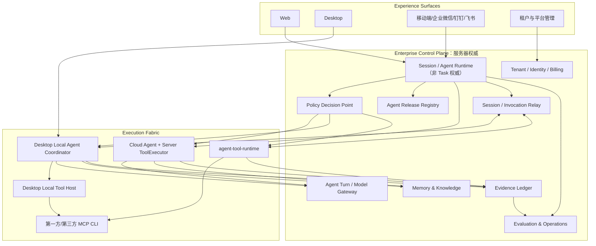

# 企业 Agent 平台总体架构设计 v1.0

> 日期：2026-08-12
>
> 状态：⚠️ 部分失效，Task 相关架构、实施路线和前置关系已暂停
>
> 范围：Web、Desktop、移动/企业渠道、Cloud Agent、Local Agent Coordinator、Server ToolExecutor、`agent-tool-runtime`
>
> **2026-08-28 决策：** 本文中的 Task Plane、统一 Task/Session/Execution/Artifact 模型、Task Service、Task 主实体及以其为前置的实施顺序全部失效，不得作为开发依据。其他能力面需按自身事实对象独立复核。见[暂停与处置报告](../../research/task-plane-suspension-and-disposition-report.md)。

## 1. 决策摘要

本产品定位为面向企业非编程场景的“任务执行操作系统”，不是在现有聊天界面上继续堆叠工具。平台以七个相互约束的能力面组织既有能力：

1. **Task Plane（已停止）**：原统一 Task、Session、Execution、Invocation、Artifact 设想作废，不再作为平台能力面。
2. **Policy Plane**：由服务器统一决定谁能在什么条件下对什么资源执行何种副作用，各执行节点强制落实。
3. **Execution Fabric**：统一 Server、当前 Desktop、其他 Desktop/`agent-tool-runtime` 的能力目录、亲和性、租约和故障语义。
4. **Memory & Knowledge Plane**：组织个人、岗位、团队、租户四层记忆与知识，并继承来源权限和生命周期。
5. **Evidence Plane**：把工具返回值升级为可验证业务证据、产物版本、审批链和补偿记录。
6. **Evaluation & Operations Plane**：以业务完成质量、成本、安全和采用效果持续评估数字员工、模型、Prompt、Skill、Provider 和平台版本。
7. **Agent Collaboration Plane**：管理多智能体责任树、工作分派、成员通信、协作预算和结果综合；不复制 Policy 或 Execution Fabric 的职责，其自身模型需去除 Task 前置后重新审查。

其余能力不能只在 Desktop 实现。Web/渠道继续由 Cloud Agent 编排；Desktop 的 `DEVICE_OWNED` 会话由 Local Agent Coordinator 编排。协作、策略、证据、记忆和评估分别定义契约，不再假定存在统一 Task 语义。多智能体详细设计见[企业多智能体协作架构](enterprise-multi-agent-collaboration-design.md)。

## 2. 产品目标与非目标

### 2.1 产品目标

- 让企业员工通过 Web、Desktop、移动端和企业渠道发起、查看、审批并接续同一业务任务。
- 让数字员工在服务器与企业授权设备上安全执行真实业务动作，而不仅生成建议。
- 让每项高价值或高风险动作具备责任、权限、证据、成本和结果闭环。
- 让租户能够把岗位方法、企业知识、工具和评估标准沉淀为可版本化组织能力。
- 让平台升级模型、Prompt、Skill、Provider 和客户端时有可重复的质量证据与回滚能力。

### 2.2 非目标

- 当前阶段不以编程 Agent、IDE 或代码工作区能力为产品重点。
- 不把所有企业流程都做成固定 BPM；Agent 负责动态规划，平台只固化关键状态、约束和证据。
- 不允许 LLM 直接决定租户权限、执行位置、凭证、审批豁免或计费规则。
- 不以“工具调用没有报错”作为业务任务完成标准。
- 不用一次性重写现有 Agent、会话、调度、记忆、知识库和观测模块来换取架构整齐。

## 3. 现有体系审计摘要

| 现有能力 | 已有基础 | 主要缺口 | 演进方向 |
|---|---|---|---|
| 会话与记录 | `chat_sessions`、`chat_messages`、`chat_records`、渠道会话 | 对话记录与技术运行信息边界仍需治理 | 保持现有职责；不自动映射为业务 Task |
| Agent 计划 | Redis `PlanManager`、计划步骤、进度 | TTL 临时态；是否需要持久业务模型尚不明确 | 保持现状；原 Task Plan/Step 迁移方案已删除，暂无替代方案 |
| 定时任务 | `scheduled_tasks/logs`、独立 background runner | 表达确定的调度和执行记录 | 保持独立模型，加强 tenant/user 隔离，不提升为通用 Task |
| 数字员工 | 子智能体注册、租户订阅、用户授权、Prompt 生命周期 | 缺少可复现版本快照、统一策略和业务评估 | Agent Release 固定模型/Prompt/Skill/Tool/Memory Policy 摘要 |
| 本地工具 | `ExecutionTarget`、设备配对、claim/lease、progress/result、MCP Provider | 单设备选择、策略和节点治理不足 | 纳入 Execution Fabric 与 Policy PEP |
| 记忆与知识库 | 短/中/长期记忆、RAG、知识源 | 层级、来源证据、权限继承、纠正删除不统一 | 建立 Memory/Knowledge 四层权威模型 |
| 执行记录 | `chat_records.execution_details`、Trace、`work_outcomes` | 摘要型、不可证明业务动作前后状态 | 引入 Evidence Ledger，现有记录成为输入/投影 |
| 计费与观测 | token/credit、Trace、会话指标、告警基础 | 质量评估和业务结果闭环尚不完整 | Evaluation Runs + Golden Cases + 成本/质量/安全联合门禁 |

结论：现有系统功能覆盖面较广，缺口主要是跨模块的权威模型和统一契约。实施应采用新增规范化实体、写入适配器和兼容投影的渐进路线。

## 4. 权威边界

### 4.1 服务器永久权威

- 租户、组织、账号、角色、订阅和用户授权。
- 计费、余额、价格、配额和用量规则。
- 模型供应商访问、模型策略、Prompt/数字员工发布版本。
- 企业 Policy、审批规则、连接器服务端凭证和审计保留策略。
- 云端知识、长期组织记忆和合规记录；业务对象由各具体业务系统定义。
- `CLOUD_OWNED` 会话与 Cloud Agent 执行状态。

### 4.2 设备永久权威

- 本地 workspace、绝对路径、文件 revision 和授权 grant。
- 本机环境变量、设备凭证、进程、窗口和 Provider 登录状态。
- `DEVICE_OWNED` 会话完整事件流、Coordinator journal 与实时执行状态。
- 未选择上传的本地产物和详细本地工具日志。

### 4.3 共享但不混淆的状态

- `DEVICE_OWNED` 的用户/Agent 消息、进度和结果可形成云端阅读投影；云端不能据此在其他环境恢复执行。
- 服务器签发的策略决定和 Agent Release 可缓存到设备；设备不能自行扩大权限或修改版本语义。
- 本地执行产生的 Evidence 由设备签名/摘要后上报，服务器校验并形成企业审计记录；本地原始敏感内容是否上传由策略决定。

## 5. 总体架构

## 6. 六个控制面的连接关系

### 6.1 原 Task 业务主线（已删除）

原“所有入口先创建或定位 Task”的规则已作废，不实施，暂无替代方案。现有 Web、渠道、定时任务和 Webhook 保持各自已有边界。

### 6.2 Policy 是每次动作的前置门禁

Agent 只能提出动作意图。服务器 PDP 使用租户、用户、角色、工具 effect、目标资源、数据敏感度、设备状态和预算生成策略决定。Cloud Agent、Desktop Coordinator、Server ToolExecutor 和 Runtime 都必须在调用前再次执行 PEP 校验。

### 6.3 Execution Fabric 负责“在哪里执行”

Fabric 根据工具元数据、数据位置、显式选择、设备能力和策略确定固定执行目标。位置选定后不得因故障静默换端。`DEVICE_OWNED` 会话的 Coordinator/workspace 亲和性不可变；调用远端 Runtime 只是固定的一次工具目标。

### 6.4 Evidence 与业务结果

Evidence 只记录具体副作用动作及其来源。统一业务完成对象和完成状态已暂停，暂无替代方案；任何具体业务是否完成仍由对应业务系统判断，不能仅依赖模型宣称。

### 6.5 Memory 从已验证事实中沉淀

对话内容不能直接成为企业事实。Memory ingestion 必须区分用户偏好、观察、已验证业务事实和正式制度；重要记忆引用 Evidence/知识源并继承权限、有效期和删除状态。

### 6.6 Evaluation 反向控制发布

Evaluation 可使用现有 Trace、用户反馈、成本和故障数据。统一业务对象关联已暂停；模型、Prompt、Skill、Provider 和客户端版本的发布门禁需由 Evaluation 专题重新定义。

## 7. 原统一生命周期（已删除）

原生命周期依赖未定义的 Task 与 Execution 权威对象，已作废且不实施。目前没有统一生命周期替代方案；各现有入口继续使用自身已验证的状态与错误语义。

## 8. 跨模块标识与版本

| 标识 | 作用 | 关键约束 |
|---|---|---|
| `session_id` | 对话上下文 | 明确 `CLOUD_OWNED`/`DEVICE_OWNED` |
| `invocation_id` | 一次工具调用 | 全局幂等、固定 effect/target |
| `evidence_id` | 业务证据 | 不可变、可校验、可关联审批 |
| `policy_decision_id` | 一次策略决定 | 记录输入摘要、结果、有效期和签名 |
| `evaluation_run_id` | 一次评估 | 固定数据集与所有被测版本 |

具体写动作至少携带可信 `tenant_id`、可信主体，以及该工具自身已经定义的调用标识、schema version 和幂等信息。客户端传入的 tenant/user/role 只作为提示，服务器必须从凭证重新解析。统一跨模块关联字段已暂停，暂无替代规范。

## 9. 各入口的一致体验

| 入口 | 编排权威 | 能力 |
|---|---|---|
| Web | Cloud Agent | 使用云端会话、审批和管理远端节点执行；不自动创建业务 Task |
| Desktop | Local Coordinator 或 Cloud Agent（显式会话类型） | 本地 workspace/工具、服务端工具、远端 Runtime、离线浏览和远程接续 |
| 移动/企业渠道 | Cloud Agent 或 Session Relay | 发起对话；查看、审批或接续在线 Desktop 会话 |
| 管理后台 | 企业控制面 | Agent Release、Policy、节点、连接器、评估、审计、成本和 kill switch |

Web/移动端接续 `DEVICE_OWNED` 会话时只能把消息送回原 Desktop。原设备离线则显示离线，不排队自动执行、不换设备、不切 Cloud Agent。查看同步消息不代表执行环境已经同步。

## 10. 渐进实施路线

### Phase 0：契约冻结与兼容层

- 建立六份专题设计和语言无关 schema 目录。
- 固化现有表/API/事件基线和兼容映射。
- 为所有现有工具补齐 effect、execution target、幂等与证据能力清单，不立即改执行路径。

### Phase 1：原 Task 路线（已停止）

- 原计划不再执行，不新增 Task/Execution/Artifact 主实体，不做现有 chat/scheduler/work outcome 双写。
- Agent 版本与基础 PDP/PEP 若有真实需求，必须脱离 Task 另立设计与项目。

### Phase 2：Evidence + Execution Fabric

- 统一 invocation、Evidence、后置验证和 unknown/compensation。
- Desktop、Server、Runtime 接入统一能力目录、节点治理和策略决定。

### Phase 3：Memory/Knowledge 权限化

- 建立四层记忆、来源证据、时效和权限继承。
- 知识库文档级权限、检索日志和纠正删除闭环。

### Phase 4：Evaluation & Operations

- Golden Cases、业务指标、版本对比、灰度、回滚和企业报表。
- 将质量、成本、安全和业务结果共同作为发布门禁。

### Phase 5：行业模板与生态

- 基于已经独立验证的能力扩展数字员工、第一方/第三方 Provider、自动化模板和租户私有市场。
- 行业模板复用 Policy/Evidence/Evaluation 的有效部分，不依赖统一 Task。

## 11. 架构不变量

1. 租户、账号、计费、LLM、Agent Release 和企业策略始终服务器权威。
2. `DEVICE_OWNED` 会话执行环境不可因 Web/移动端接续而变化。
3. LLM 不能指定可信身份、凭证、最终执行位置或审批豁免。
4. 有副作用的调用必须有幂等、明确 effect、策略决定和后置验证。
5. `unknown` 结果不得自动重试或静默换节点。
6. 未经验证的对话内容不得自动提升为租户正式知识。
7. 具体业务结果由对应业务系统的可验证标准和 Evidence 判断，不由模型口头声明。
8. 所有新模块必须同时说明 Web、Desktop、渠道、Server 和 Runtime 行为，禁止端侧私有协议。
9. 现有稳定 Web 和渠道链路采用兼容投影渐进迁移，每个 Phase 有回归与回滚证据。

## 12. 专题设计

- [Task Plane 暂停与处置报告](../../research/task-plane-suspension-and-disposition-report.md)
- [企业统一 Policy Engine](enterprise-policy-engine-design.md)
- [企业 Evidence Ledger](enterprise-evidence-ledger-design.md)
- [Enterprise Execution Fabric](enterprise-execution-fabric-design.md)
- [企业分层 Memory/Knowledge](enterprise-memory-knowledge-design.md)
- [企业 Agent Evaluation & Operations](enterprise-agent-evaluation-operations-design.md)

专题文档负责各自的数据模型、协议和迁移细节；本文负责权威边界、跨模块关系、端到端生命周期和实施顺序。发生冲突时，先按本文的架构不变量判断，再在专题文档中记录例外及原因。

## 13. 平台级验收门禁

### 13.1 契约与多租户

- 所有新实体和事件均携带可信 `tenant_id`，对象读取、列表、变更和导出做复合租户条件测试。
- Policy、Invocation、Evidence、Memory 和 Evaluation 的有效 schema 有版本、兼容矩阵和 golden contract；已作废的 Task schema 不实施。
- Web、Desktop、渠道、Server ToolExecutor 和 Runtime 对同一 effect/status/error 使用相同语义。

### 13.2 跨端与执行环境

- `CLOUD_OWNED` 与 `DEVICE_OWNED` 均完成创建、接续、取消、审批、断网和恢复测试。
- Web/移动端接续设备会话时，新消息只在原 Desktop 本地持久化 ACK 后成功；离线、revision 冲突和身份变化全部 fail-closed。
- 当前 Desktop、服务端和远端 Runtime 三条工具路径有端到端证据；目标节点失败不静默换端，外部写动作 `unknown` 不自动重试。

### 13.3 业务完成与治理

- 高风险工具必须产生可关联的策略决定、审批、执行前后状态、验证和责任主体。
- 具体业务结果由对应业务系统或授权人员确认，模型文本不能直接标记业务完成。
- 记忆/知识召回继承来源权限；纠正、过期和删除能清理正文、索引、向量和缓存。
- Agent Release 在 production 前通过 Golden Cases、成本、安全和业务结果门禁，并有 canary、kill switch 和回滚演练。

### 13.4 兼容与稳定性

- 现有 Web、渠道、计费、Scheduler、知识库和数字员工路径在双写/旁路阶段保持行为兼容。
- 每个 Phase 具备数据迁移 dry-run、对账、回退开关和不可逆点清单。
- 观测与 Evidence 默认脱敏，敏感正文、大型本地日志和本地产物不因新架构被无条件上传。
