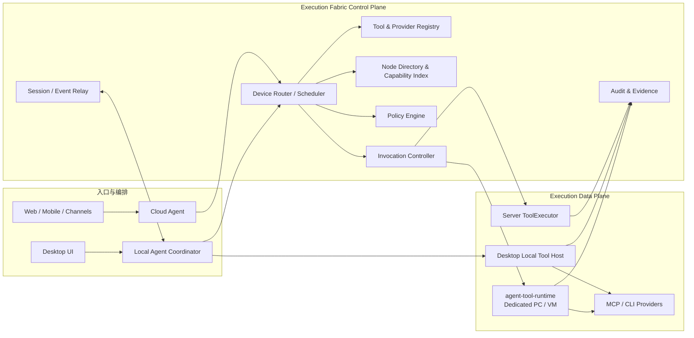

# Enterprise Execution Fabric 设计

> 状态：架构设计稿（待评审）
>
> 日期：2026-08-12
> 适用范围：Server ToolExecutor、Agent Desktop、`agent-tool-runtime`、Web/移动端/企业渠道、Cloud Agent、Local Agent Coordinator

## 1. 决策摘要

Enterprise Execution Fabric 是企业任务在云端、员工电脑和专用执行电脑之间安全运行的统一执行网络。它不迁移 Agent 会话权威，也不让用户手工拼接不同 Runtime；它提供能力发现、节点治理、固定亲和、调度、租约、容量、取消、证据和故障语义。

核心决策：

1. 控制面在服务器：设备注册、租户归属、能力批准、策略、节点选择、invocation 状态、租约和审计均由服务器权威管理。
2. 数据面有三类 Executor：Server ToolExecutor、Desktop Local Tool Host、headless `agent-tool-runtime`。它们共享 Provider/tool/invocation/result 契约，不共享进程实现。
3. `DEVICE_OWNED` 会话始终由原 Desktop Local Agent Coordinator 编排；Web/移动端只通过 Session Relay 接续。远端 Runtime 执行某个工具不等于会话迁移。
4. 当前 Desktop 上的本地工具由 Coordinator 直接调用 Local Host，以本地 journal 记录，不绕行云端 invocation 队列；服务器仍签发策略决策/授权票据并接收必要审计投影。
5. 服务端或其他电脑上的工具走 Remote Tool Gateway。选择目标后固化 `target_kind/target_node_id/affinity_reason`；失败、离线或租约过期不得静默换节点。
6. 借鉴调度系统的 hard constraints、affinity、taint 和 lease 概念，但不建设通用容器平台。首期在现有 `local_tools` 状态机上渐进升级。

## 2. 目标与非目标

### 2.1 目标

- 让 Web、渠道和 Desktop 使用同一套执行位置与 Provider 语义。
- 同时支持当前电脑、企业专用电脑/VM 和服务端工具。
- 设备能力、信任、健康、容量、占用、维护和版本可观测、可治理。
- 对 GUI 自动化提供独占交互桌面、窗口焦点、锁屏和会话状态约束。
- 对每次 invocation 提供固定目标、claim、租约、取消、结果和证据闭环。
- 节点或网络故障时不重复外部副作用，不伪装成功，不静默漂移执行环境。
- Windows 和 macOS Desktop 共用执行核心，平台差异封装在 driver/credential backend。

### 2.2 非目标

- 不做任意代码的无约束远程执行平台。
- 不把 Desktop 变成 Kubernetes worker，也不在首期实现跨机容器编排。
- 不在 Runtime 保存租户账号、计费、LLM Key、完整企业策略或会话权威。
- 不允许 Desktop 与远端 Runtime 建立绕过服务器的 P2P 控制协议。
- 不自动复制 workspace、登录态、secret 或 GUI 会话到另一台设备。
- 暂不将编程 Agent/worktree 作为产品能力；文件/命令工具只服务已授权企业任务。

## 3. 现状审计

### 3.1 已实现基础

| 能力 | 当前实现 | 评价 |
|---|---|---|
| 执行位置 | `ExecutionTarget.SERVER/LOCAL_REQUIRED/EITHER` | 有粗粒度路由语义，缺少节点约束和调度结果模型 |
| 设备配对 | 一次性 8 位 code；设备 token 仅返回一次、DB 只存 hash | 可保留；需扩展企业共享节点、token 轮换和信任等级 |
| 凭证 | Runtime Windows DPAPI；Desktop 规划 safeStorage/Keychain | 正确的本地密钥边界 |
| 能力心跳 | runtime version、capabilities、manifest digest、last_seen | 可作为能力目录原型，但当前自报结构过粗 |
| 在线判断 | 30 秒阈值 | 可升级为 Node Lease/状态机，避免各 API 自算 |
| 用户默认节点 | `selected` 单选 | 仅适合 MVP；不能表达 Provider 默认、共享节点、硬亲和或容量 |
| Invocation | queued → claimed → running → terminal | 可复用，已有 tenant/device 隔离和 `FOR UPDATE SKIP LOCKED` |
| 执行租约 | 60 秒；progress 续租；过期置 unknown | 外部副作用安全方向正确；清理由 claim 顺带触发需改为独立控制器 |
| 取消 | queued 直接 cancelled；running 协作取消 | 可保留；需补取消截止和执行证据 |
| Runtime Provider | MCP stdio、单飞、崩溃回收、锁屏检测 | 是 headless Executor 基线，目前仅 Windows/BOSS 静态 manifest |
| 结果语义 | none/applied/partial/unknown；write crash → unknown | 必须成为 Fabric 统一契约 |
| Desktop | Electron 壳已完成；Coordinator/Local Host 尚未实现 | Fabric 必须纳入其未来本地直执行路径 |

### 3.2 关键缺口

1. 设备当前属于 tenant+user 且单选，尚无租户共享节点、节点池、部门可见性和专用节点治理。
2. capability 只有 provider ID/列表，缺少 OS/架构、工具版本、schema digest、交互桌面、网络区、文件 grant、并发槽位和健康详情。
3. `LocalToolProxyTool` 自己选择 `selected[0]`，没有统一 `DeviceRouter/Scheduler`，也没有候选解释。
4. Provider catalog 静态内置 BOSS；服务端和 Runtime 各维护清单，尚无签名快照及一致性检查。
5. invocation 创建接口本身不强制设备归属/能力，依赖上层闸门；应把 invariant 下沉到事务边界。
6. lease 清扫依赖 Runtime claim 请求顺带执行；无 claim 流量时 stale invocation 不会及时收敛。
7. 设备只有 active/revoked 和 last_seen，缺少 draining/maintenance/quarantined/degraded 等生命周期。
8. 没有容量/队列 SLA、Provider 槽位、GUI 桌面独占和租户公平性。
9. Desktop 本机直执行和远端 Runtime 还没有共享 contract tests/core。
10. 缺少升级合规、最低版本、证书/密钥轮换、远程诊断、节点 kill switch 和企业管理员视图。

## 4. 总体架构



### 4.1 控制面

- Tool & Provider Registry：服务器批准的 manifest/schema/version/digest、执行要求和风险元数据。
- Node Directory：节点身份、tenant/owner、能力、信任、健康、容量、taint、维护和版本。
- Device Router/Scheduler：做 hard filter、策略评估、偏好评分和固定绑定。
- Invocation Controller：持久化状态机、assignment/claim、租约、取消、超时和事件。
- Session Relay：Web/移动端与 DEVICE_OWNED Coordinator 的双向接续，不承担工具调度权威。

### 4.2 数据面

| Executor | 适用场景 | 关键边界 |
|---|---|---|
| Server ToolExecutor | 企业 API、云端文件/知识、持服务端 secret 的工具 | 服务器身份、幂等和审计 |
| Desktop Local Tool Host | 当前电脑文件、命令、应用和本地 Provider | Coordinator 直调；workspace/会话权威不离机 |
| `agent-tool-runtime` | BOSS/weixin 等专用 PC/VM、共享或无人值守节点 | 只出站连接；固定 invocation；不持有会话/LLM 权威 |

## 5. 节点与能力模型

### 5.1 Node 类型和所有权

`node_kind`: `server_pool/desktop/runtime`。`ownership_scope`: `user/department/tenant/platform`。

- Desktop 节点默认 user scope，既是 DEVICE_OWNED 会话 owner，也可作为当前用户本地 Executor。
- Runtime 可为 user 专属，也可由租户管理员登记为 department/tenant 共享节点。
- Server pool 由平台管理，租户仅看到逻辑能力和区域，不看到基础设施 secret。

### 5.2 节点生命周期

```text
pending_pairing → active → draining → maintenance
                    │  ├→ degraded
                    │  ├→ quarantined
                    │  └→ revoked
                    └→ offline（由 lease 派生，可恢复）
```

- `draining` 不接新任务，已运行任务按策略完成。
- `maintenance` 管理员主动停用。
- `quarantined` 因签名、版本、异常行为或 kill switch 隔离，只允许健康/升级接口。
- `revoked` 凭证永久失效；重新使用必须重新配对。
- online/offline 是健康派生状态，不覆盖管理状态。

### 5.3 Capability Snapshot

```json
{
  "snapshot_version": 7,
  "node": {
    "platform": "win32",
    "arch": "x64",
    "runtime_version": "1.2.0",
    "interactive_desktop": true,
    "network_zones": ["corp-cn"],
    "traits": ["dedicated-gui"]
  },
  "providers": [{
    "provider_id": "ai.aidwork.boss-recruiting",
    "version": "1.3.0",
    "manifest_digest": "sha256:...",
    "schema_digest": "sha256:...",
    "health": "ready",
    "slots": 1,
    "tools": ["boss_greet"]
  }],
  "capacity": {
    "general_slots": 2,
    "interactive_slots": 1,
    "running": 0
  }
}
```

设备自报仅是事实候选。服务器必须与批准 registry 求交后形成 `effective_capabilities`。本地 executable/cwd/base env 永远由本地管理员配置，云端不能通过 capability 或 invocation 下发启动命令。

## 6. 路由、亲和与容量

### 6.1 三阶段调度

1. **硬过滤**：tenant/ownership、policy、tool/provider/schema digest、`ExecutionTarget`、OS/架构、信任级、网络区、交互桌面、文件 grant、管理状态、online、最低版本和可用槽位。
2. **偏好评分**：用户本次选择 > 已冻结会话/任务亲和 > Provider 默认 > 部门专用 > 当前 Desktop（仅不干扰用户时）> 队列时延/负载。
3. **固定绑定**：写入 `target_kind/target_node_id/capability_snapshot_version/affinity_reason`，之后节点失效也不静默重调度。

多个同分候选且缺少明确默认时返回候选供用户选择，不随机选择。GUI 工具默认推荐 dedicated runtime，当前电脑执行必须明确提示会抢占鼠标、键盘和窗口焦点。

### 6.2 亲和级别

| 亲和 | 规则 |
|---|---|
| 会话硬亲和 | DEVICE_OWNED owner device/Coordinator/workspace 永久不变 |
| Invocation 硬亲和 | 创建后 target node 不变；重试仍在原节点 |
| Provider 软亲和 | 用户/部门/租户默认节点，可在创建下一条 invocation 时重新选 |
| 数据硬亲和 | 本地 file grant、登录态、网络区要求决定可执行节点 |

远端工具 target 与会话 owner 可不同；这只是一条 invocation 的委派。

### 6.3 Capacity 和公平性

- 节点上报 `general_slots` 和每 Provider/tool 独立 slots；控制面按 lease reservation 占用。
- GUI interactive session 默认全节点独占，即使其他 CPU 槽位空闲也不并发抢焦点。
- ProviderManager 当前单飞行为保留，并由能力明确声明 `slots=1`。
- 队列按 tenant、优先级、创建时间加权公平，防止一个租户耗尽共享节点。
- 共享节点支持 daily schedule、维护窗和最大连续占用；超时不强杀已产生副作用的动作。
- 首期不做复杂抢占；高优先级只影响 queued，不抢占 running。

## 7. Invocation 与租约模型

### 7.1 状态机

```text
created → policy_pending → queued → assigned → claimed → running
   │             │          │          │          │
   └→ rejected   └→ denied  └→ cancelled          ├→ cancel_requested
                                                  └→ succeeded/failed/cancelled/unknown
```

现有 queued/claimed/running 状态可兼容迁移。`assigned` 明确记录目标与 capability snapshot；Policy approval 可在 invocation 创建前完成，也可用 `policy_pending` 表达。

### 7.2 两类 Lease

- **Node lease**：由 heartbeat 续期，表示控制面近期能联系节点，不等于 Provider 健康。
- **Execution lease**：claim 后由 progress/lease-renew 续期，保证一个 attempt 的独占执行权。

建议默认：heartbeat 15～20 秒、offline 阈值 45～60 秒；execution lease 初始 60 秒，可按工具最大静默时间配置。具体值必须服务端下发上限，节点不能无限延长。

### 7.3 过期与重试

- `claimed/running` lease 过期：外部写/GUI/non-idempotent 一律 `unknown`，不重新派发。
- 明确未开始且 `result_effect=none`：可按策略在**同一固定节点**创建新 attempt。
- safe read/idempotent 工具可自动重试，但仍需保留 invocation 和 attempt 链。
- 节点离线不改变 target；用户可等待、取消或显式 fork 新任务。换节点必须是新 invocation/action，并重新授权。
- stale lease 由独立后台 controller 扫描，不能依赖下一个 Runtime 的 claim 请求触发。

### 7.4 幂等与证据

每个 invocation 有稳定 `idempotency_key`，每个执行尝试有 `attempt_id`。Server/Provider 支持时把 key 透传给业务系统。结果至少包含 `success/code/message/result_effect/retryable/evidence_refs`。对 send/publish/pay/delete 等动作，receipt/message_id/before-after/截图等证据决定是否可重试或补偿。

## 8. 数据模型

建议从现有 `local_tool_*` 渐进扩展，而不是另建平行体系：

| 表 | 核心字段 |
|---|---|
| `execution_nodes` | id, tenant_id, kind, ownership_scope/id, status, trust_level, credential_version, node_lease_expires_at |
| `node_capability_snapshots` | node_id, version, reported, effective, registry_revision, digest, created_at |
| `node_routes` | tenant/user/department, provider/tool scope, preferred_node_id, priority |
| `tool_invocations` | tenant/session_ref/invocation_id, tool/provider/schema, target, affinity_reason, policy_decision_id, state, effect |
| `tool_invocation_attempts` | invocation_id, attempt_no, claim_hash, authorization_jti_hash, lease, started/finished, result |
| `tool_invocation_events` | invocation_id, attempt_id, seq, kind, progress, sanitized_payload |
| `node_reservations` | node_id, slot_type, invocation_id, lease_expires_at |
| `execution_evidence` | invocation_id, type, digest, encrypted_object_ref, classification, retention_until |

迁移期可把 `local_tool_devices` 视为 `execution_nodes(kind=runtime)`，`local_tool_invocations/events` 通过兼容 repository 写入新模型。所有表以 tenant 为隔离键；平台 server pool 使用显式 platform scope，不能用空 tenant 混入普通查询。

## 9. 协议与 API

### 9.1 节点控制面

| 方法 | 路径 | 用途 |
|---|---|---|
| POST | `/api/execution/v1/pairing-tickets` | 用户/管理员创建有 scope 的配对票据 |
| POST | `/api/execution/v1/nodes/pair` | 节点换取设备凭证 |
| POST | `/api/execution/v1/nodes/{id}/heartbeat` | 续 node lease、上报摘要和容量 |
| PUT | `/api/execution/v1/nodes/{id}/capabilities` | 上报完整 capability snapshot |
| GET | `/api/execution/v1/nodes` | 按权限查看脱敏节点目录 |
| POST | `/api/execution/v1/nodes/{id}:drain` | 停止接新任务 |
| POST | `/api/execution/v1/nodes/{id}:quarantine` | 隔离节点 |
| DELETE | `/api/execution/v1/nodes/{id}` | 撤销凭证 |

### 9.2 路由和执行

- `POST /api/execution/v1/routes:resolve`：返回候选/拒绝原因/建议节点，不创建副作用。
- `POST /api/execution/v1/invocations`：服务端验证 policy、能力和容量后原子创建并固定 target。
- `POST /api/execution/v1/nodes/{id}/claims:next`：长轮询兼容接口；未来可增加 WSS push，但语义不变。
- `started/progress/lease/result/cancel`：沿用现有接口含义，升级为 versioned attempt contract。
- `GET /api/execution/v1/invocations/{id}/events?after_seq=`：Web/Desktop 统一事件游标。

请求体不接受可信 tenant/user/role；由用户 access token 或 device credential 注入。claim 同时返回 authorization ticket，但 executable/cwd/base env 不能来自云端。

### 9.3 Desktop 本地直执行

Coordinator 调用本地 Host 前：

1. 从服务器获取 policy decision/短期 ticket。
2. 在本地 journal 原子记录 invocation intent 和不可变 action digest。
3. Local Host 验证票据、owner device、workspace grant、provider/schema digest。
4. 执行并把事件写本地 journal；按租户同步策略上传必要审计/证据摘要。

这条路径不创建远端排队 invocation，也不改变 `owner_device_id/coordinator_session_id/workspace_fingerprint`。

## 10. 身份、签名与缓存

- 用户会话 token 与节点 credential 分离；Desktop 同时持有两者时也不得互换用途。
- 节点 credential 本地加密：Windows DPAPI/Electron safeStorage，macOS Keychain；服务端存 hash/credential version。
- 支持 credential rotation、重叠有效窗口和紧急撤销；机器指纹只作风险信号，不作唯一身份凭证。
- Provider manifest/schema 由服务器 registry 签名；节点只激活已安装且 digest 匹配的能力。
- invocation authorization ticket 绑定 tenant、action digest、target node、capability snapshot、policy revision 和过期时间。
- Node Directory 可缓存，但路由创建事务必须复核节点管理状态、lease、capacity revision 和 kill switch。
- WSS/push 只是延迟优化；数据库状态机和 seq cursor 才是恢复权威。

## 11. 故障、安全和恢复

| 故障 | 预期行为 |
|---|---|
| Runtime 断网且未 claim | invocation 保持固定 target 的 queued/assigned；超时后明确失败或等待，不换节点 |
| 执行中断网 | 本地继续只限已获票据动作；回连补传 journal；无法证明外部效果则 unknown |
| Desktop owner 离线 | Web/移动端提示客户端下线；不交给 Cloud Agent，不排队自动执行 |
| Provider 崩溃 | read 可按策略重试；write/gui 依据证据标记 none 或 unknown，默认不重试 |
| 节点被撤销/隔离 | 拒绝新 claim；running 安全取消或转人工核验；不谎报 cancelled |
| 控制面重复投递 | claim token + attempt CAS + Provider idempotency key 防重复；终态写幂等 |
| 事件乱序/重复 | invocation 内 seq；消费者按游标去重，缺口重拉 |
| 节点时钟错误 | lease 以服务器时间为准；票据只允许有限 clock skew |
| 容量信息陈旧 | 创建时原子 reservation；不能只相信 heartbeat 的 running 数 |
| 服务器重启 | DB 恢复状态，controller 重建 lease/timeout；不从内存猜测执行结果 |

安全基线：Runtime 只发起出站 TLS；Provider 进程隔离和回收；普通用户权限运行；禁止云端下发 executable/env；文件 grant 防路径逃逸；日志不含 token/secret；GUI 节点锁屏、错误账号、错误页面均 fail loud。

## 12. 节点治理与运维

- 企业管理员看到节点名称、owner/scope、在线/健康、OS、Runtime/Provider 版本、批准能力、容量、队列、最近错误和策略状态。
- 支持最低版本、强制升级期限、drain 后升级、Provider 独立禁用和节点 quarantine。
- 指标：online ratio、claim latency、queue wait、execution latency、lease expiry、unknown rate、cancel latency、slot utilization、Provider crash、版本分布。
- 告警：unknown 激增、同节点连续崩溃、manifest 漂移、旧版本超期、凭证异常、长时间交互独占。
- 诊断包必须脱敏、用户可预览；远程诊断不能读取未授权文件或 secret。
- GUI 专用节点展示占用人/任务和预计释放时间，但跨部门隐藏业务内容。

## 13. 迁移计划

### Phase F0：统一契约和观测

- 定义 language-neutral node/capability/route/invocation/attempt/result schema。
- 给现有 local tool invocation 增加 trace/decision/affinity/reason 字段。
- 将 `selected` 解释为兼容的 user-level general default，不再视为唯一调度依据。

### Phase F1：DeviceRouter 与节点状态

- 引入统一 DeviceRouter，替代每个 `LocalToolProxyTool` 查询 `selected[0]`。
- 补 Node Lease controller、状态派生、Provider/tool capability snapshot 和候选解释。
- invocation 创建事务内强制 tenant ownership、effective capability 和 active/online 校验。

### Phase F2：容量、租约和治理

- 独立 stale lease controller、attempt、reservation、Provider slots、GUI 独占。
- 增加 drain/maintenance/quarantine、token rotation、最低版本和节点 kill switch。
- 先迁移 BOSS Runtime，保持旧 `/api/local-tools` 兼容适配。

### Phase F3：Desktop Local Host

- 提取 `clients/shared/local-tool-host-core` 和 contract tests。
- Desktop 实现 Local Coordinator → Local Host 直执行、本地 journal、safeStorage/Keychain。
- 同一 BOSS/weixin Provider 分别通过当前 Desktop 与远端 Runtime 完成闭环。

### Phase F4：企业节点池

- 支持 department/tenant shared nodes、节点组、网络区、路由默认和公平队列。
- Windows 专用 GUI 电脑池先落地；macOS Desktop 完成平台签名、权限和真机验收后加入。
- WSS push 可作为长轮询优化，保留同一状态机和恢复协议。

## 14. 测试与验收

### 14.1 自动化

- Router：硬约束、偏好排序、多个候选、无候选解释、固定亲和、禁止静默 fallback。
- Tenant：共享节点 scope、部门可见性、平台池隔离、跨租户 capability/cache/invocation 攻击。
- 并发：`FOR UPDATE SKIP LOCKED`、reservation CAS、slot 超卖、同 invocation 重复 claim/result。
- Lease：无 claim 流量也能过期；续租竞态；server restart；clock skew；网络分区。
- Effect：write crash/timeout → unknown；明确未开始 → none；unknown 不自动重试。
- Security：篡改 target/action/schema digest、撤销 token、旧 capability、云端注入 executable/env 均拒绝。
- Contract：Server/Desktop/Runtime 对 result、cancel、progress、digest 和 error code 一致。
- 回归：现有 BOSS、Web Cloud Agent、渠道和设备配对/撤销链路保持兼容。

### 14.2 真机与故障演练

- Windows Desktop 与 Windows dedicated Runtime：锁屏、切用户、睡眠唤醒、断网重连、Provider 崩溃、进程树回收。
- macOS Desktop：Keychain、TCC、签名/notarization、睡眠唤醒、shell/file grant。
- GUI 独占：运行时用户操作冲突、焦点丢失、错误账号/页面、取消和 unknown 人工核验。
- kill switch：tenant/provider/tool/device 各 scope 在 SLA 内阻止新任务。

### 14.3 完成门禁

- 用户能看懂“为什么选这台设备/为什么不能执行”，且执行后 target 不漂移。
- DEVICE_OWNED 会话从 Web/移动端接续时仍由原 Coordinator/设备/workspace 执行。
- 当前 Desktop 工具不绕行云端队列；远端 Runtime 不获得会话权威。
- 控制面重启、节点断网和重复投递不会导致不可逆动作自动重复。
- 节点容量不超卖，GUI 自动化单节点同一时刻只有一个交互执行。
- 任一 invocation 可追溯 policy decision、target/capability snapshot、attempt、事件和 result effect。

## 15. 风险与待决策

| 风险/决策 | 建议 |
|---|---|
| 过早建设通用调度器 | 先抽象 Router/Lease/Capacity，围绕真实 BOSS/weixin 和本地文件场景验证 |
| 共享 GUI 节点的账号隔离 | 首期一个 OS 用户/业务账号对应一个专用 Runtime；不做同桌面多租户混跑 |
| WSS 与长轮询 | 长轮询作为可靠兼容基线；WSS 仅优化延迟，不能产生第二状态机 |
| Desktop 是否可被他人远程调用 | 默认仅 owner；租户共享需显式管理员策略、用户可见提示和独立授权 |
| 本地工具审计上传范围 | 按租户策略上传消息/摘要/证据，完整 workspace/journal 保留本地 |
| 自动重试 | 仅 safe/idempotent 且证据明确；write/gui 默认人工决定 |
| 节点证明 | 首期签名软件身份 + digest；硬件证明/MDM attestation 作为企业增强 |

待产品确认：企业共享节点计费归属；GUI 节点预约/SLA；跨部门审批；Runtime 支持 macOS 的优先级；企业 MDM/私有网络接入；证据和诊断包保留周期。

## 16. 官方参考

- [Kubernetes Leases：节点心跳与分布式租约](https://kubernetes.io/docs/concepts/architecture/leases/)
- [Kubernetes Taints and Tolerations：硬隔离、专用节点与调度约束](https://kubernetes.io/docs/concepts/scheduling-eviction/taint-and-toleration/)
- [NIST SP 800-162：中央决策与分布式策略执行点](https://nvlpubs.nist.gov/nistpubs/specialpublications/NIST.SP.800-162.pdf)
