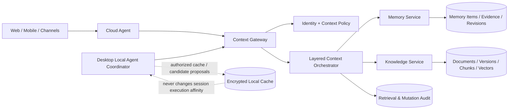

# 企业分层 Memory / Knowledge 设计

> 版本：v1.0
>
> 日期：2026-08-12
>
> 状态：架构设计，待分阶段实施
> 适用范围：Web、Desktop、企业微信/钉钉/飞书等渠道，`CLOUD_OWNED` 与 `DEVICE_OWNED` 会话

## 1. 结论与核心原则

企业 Agent 的记忆不能等同于“把聊天总结长期保存”，知识库也不能只是“租户内所有人共享的 RAG”。本系统应建立统一的 **Enterprise Context Plane**，把个人记忆、岗位方法、团队上下文、租户制度和有来源的企业知识作为不同治理对象，在检索前完成身份、权限、时效和证据校验。

以下原则属于架构约束：

1. 租户、账号、组织关系、权限策略、企业知识、持久化记忆及其版本由服务器权威管理。
2. `DEVICE_OWNED` 会话的完整事件流、workspace 和执行 journal 仍由原 Desktop 权威保存；将消息投影到云端不改变执行环境。
3. Desktop 可以缓存已授权的记忆/知识，也可以产生“候选记忆”，但不能离线形成租户级权威知识或扩大访问范围。
4. 每条持久记忆必须具有来源、提取方式、置信度、有效期和可纠正状态；无法追溯的推断不得升级为企业事实。
5. 原始数据的访问权限必须传递到文档、分块、向量、摘要、记忆和评估样本，派生数据不能绕过原权限。
6. 企业制度、岗位规则和个人偏好不是同一优先级。个人偏好不能覆盖租户强制政策，团队经验不能冒充正式制度。
7. 检索不是单纯的相似度排序，而是 `授权过滤 → 时效过滤 → 证据/可信度过滤 → 语义检索 → 分层编排 → 引用记录`。
8. 用户可查看和纠正与自己相关的记忆；删除必须覆盖正文、索引、向量和缓存，同时保留最小化合规审计记录。

## 2. 目标与非目标

### 2.1 目标

- 提供个人、岗位、团队、租户四层持久上下文。
- 将“对话记忆”和“企业知识”统一治理但分开建模。
- 支持来源证据、版本、有效期、冲突、纠正、删除和审计。
- 在 Web、Desktop 和渠道中提供一致的授权检索结果。
- 为数字员工、Prompt、Task/Session/Execution 提供可复现的上下文快照。
- 兼容现有 Markdown 长期记忆、上下文压缩和知识库，不要求一次性重写。

### 2.2 非目标

- 不把所有原始聊天、工具输出或本地文件自动沉淀为长期记忆。
- 不在本期构建通用知识图谱或替换现有 PostgreSQL/pgvector 检索管线。
- 不允许 Agent 自主修改正式制度、组织主数据或法律/财务规则。
- 不把 Desktop 本地会话 journal 上传后当作云端可独立继续执行的会话。
- 不以“记住更多”为目标；准确、可控、可删除优先于覆盖量。

## 3. 现状审计

### 3.1 已实现、可复用能力

| 能力 | 现状 | 可复用方式 |
|---|---|---|
| 短期记忆 | `MemoryManager` / `ShortTermMemory` 已接入 Agent，会话消息可从数据库和缓存恢复 | 保持为会话上下文层，不并入企业持久记忆表 |
| 中期压缩 | `chat_context_summaries`、版本、租户字段、原子持久化和压缩指标已实现 | 作为 session summary，不直接当作可信企业事实 |
| 个人长期记忆 | `LongTermMemory` 使用 `storage/memory/{tenant_id}/memory_{user_id}.md`，可注入 Prompt；API 支持本人读取/编辑 | 作为迁移源和本地/单机兼容层 |
| 自动总结 | Scheduler 每日调用 `memory_summarizer`，从当天会话提取个人信息、偏好、习惯、联系人等 | 改造成候选记忆生成器，而不是直接覆盖权威内容 |
| 知识库 | 文档上传、解析、分块、Embedding、pgvector + FTS + RRF、分类和 Agent 工具已落地 | 保留内容处理管线，在检索前增加 Context Policy Filter |
| 租户隔离 | `documents`、分类、检索主路径带 `tenant_id`；子智能体可关联知识来源 | 作为最低隔离边界，继续收紧文档级权限 |
| Prompt/数字员工 | Prompt 不可变版本、production/staging 标签、子智能体定义和知识源关联已实现 | Context snapshot 记录实际解析到的版本和知识集合 |
| Trace/审计基础 | `obs_traces` / `obs_spans` 可记录输入、输出、工具和模型调用 | 新增 retrieval/memory 决策摘要，敏感正文按策略处理 |

### 3.2 已设计但尚未完整落地

- 现有知识库增强设计已经规划知识库实体、文档级权限、检索日志、Rerank、质量评估和自动同步；代码仍以租户共享文档为主，不能把规划状态当成已实现。
- 长期记忆 Phase 4 已规划语义检索和跨会话关联，但当前持久层仍是 Markdown 文件。
- Prompt 生命周期已经具备版本和标签，但上下文知识/记忆尚无对应的不可变快照。
- `obs_scores` 表已存在，但尚不能证明每次回答用了哪条知识或哪一版记忆。

### 3.3 关键差距和审计风险

1. **只有个人层**：长期记忆按用户文件存储，没有岗位、团队、租户四层模型。
2. **缺少逐条溯源**：Markdown 条目只有整体更新时间/来源，无法记录原会话、消息、文档、工具结果和提取模型。
3. **直接合并存在误写风险**：自动总结按文本前缀替换条目，缺少候选、审批、置信度、冲突和 revision。
4. **文件存储不适合多实例**：容器扩缩容、备份、并发更新和租户迁移都缺少数据库级一致性。
5. **权限粒度不足**：知识 API/检索说明仍是“同租户所有用户共享”；`user_id` 在检索链路中尚未形成可验证 ACL。
6. **派生数据权限未闭环**：chunk、embedding、摘要和从文档提取的记忆没有统一继承链。
7. **时效性不足**：记忆没有 `valid_from/valid_until`，历史联系人、项目状态或流程规则可能长期污染上下文。
8. **纠正/删除不完整**：个人 API 可覆盖整份 Markdown，但没有逐条纠正、撤销、tombstone、缓存/向量清理证明。
9. **召回不可解释**：Agent 能注入记忆和调用知识检索，但没有统一记录候选、过滤原因、最终引用及权限决策版本。
10. **部分知识 API 需要优先加固**：文档详情、删除、下载等对象级操作必须强制携带租户与文档授权条件，不能只依赖路由上下文。

## 4. 权威边界与多端语义

### 4.1 权威划分

| 数据 | 权威位置 | Desktop 行为 |
|---|---|---|
| 租户、账号、组织、岗位、团队关系 | Server | 只缓存必要声明，不可修改权威关系 |
| 正式制度、SOP、企业知识资产 | Server | 按授权读取/缓存，更新走服务端审批 |
| 个人持久记忆 | Server | 可产生候选或用户编辑请求，服务端持久化和版本化 |
| 会话消息投影 | 依会话类型 | `DEVICE_OWNED` 本地 journal 权威，云端只保存策略允许的投影 |
| session summary | 产生执行环境 + 可选云端投影 | 不自动升级为企业持久记忆 |
| 本地文件内容和工具现场 | 原设备 | 仅将最小必要片段或证据引用送云端 |
| 检索策略、数据保留和审计规则 | Server | 每次请求携带策略版本并在本地强制执行缓存授权 |

### 4.2 两类会话

`CLOUD_OWNED`：Cloud Agent 直接调用 Context Gateway；消息、检索事件和上下文快照在云端生成。

`DEVICE_OWNED`：Local Agent Coordinator 向 Context Gateway 请求授权上下文。Web/移动端远程接续时，消息仍回到原 Desktop 执行。即使消息投影已同步到数据库，服务端也不得使用 Cloud Agent 在另一环境继续同一会话。

Desktop 离线缓存只允许读取“缓存时已授权、仍在有效期内、策略允许离线”的条目。权限、成员关系或敏感级别无法确认时 fail-closed。

## 5. 总体架构



核心组件：

- **Context Gateway**：唯一在线访问入口，注入租户、用户、组织、Agent、会话和执行环境身份。
- **Context Policy**：判定作用域可见性、文档 ACL、字段脱敏、离线缓存、写入/审批权限。
- **Memory Service**：候选提取、确认、版本、冲突、时效、纠正和删除。
- **Knowledge Service**：复用现有解析/向量检索，增加资产版本、ACL、同步和引用。
- **Layered Context Orchestrator**：控制 token 预算、层级优先级和冲突呈现，不让低权威内容覆盖强制政策。
- **Context Audit**：只记录必要的引用、策略和结果；敏感正文按租户策略加密、脱敏或不落日志。

## 6. 领域模型

### 6.1 作用域

| scope | subject | 典型内容 | 默认写入者 |
|---|---|---|---|
| `personal` | `user_id` | 表达偏好、工作习惯、用户明确要求记住的事项 | 用户本人；Agent 仅提候选 |
| `role` | `role_id` / `position_id` | 岗位术语、方法、标准工作步骤 | 岗位管理员/内容管理员 |
| `team` | `team_id` | 客户进展、项目约定、团队决策和协作上下文 | 团队负责人/获授权成员 |
| `tenant` | `tenant_id` | 企业制度、品牌规范、正式 SOP、主数据 | 租户管理员/审批流程 |

作用域与权威等级分开建模。`tenant` 并不意味着所有内容都强制；条目还需 `authority_level = policy | approved | curated | inferred`。硬性政策始终优先于个人偏好。

### 6.2 Memory 与 Knowledge 的边界

| 对象 | 特征 | 示例 |
|---|---|---|
| Memory item | 短小、结构化、与主体相关、可能随时间变化 | “用户希望周报先给结论”“项目 A 当前负责人为李某” |
| Knowledge asset | 有明确原始载体、可分块检索、有文档版本 | 员工手册、报价制度、产品说明、客户合同 |
| Session summary | 为压缩当前会话而生成，不自动跨会话生效 | 最近 50 条消息摘要 |
| Evidence | 支持 memory/knowledge 结论的来源引用 | message ID、document version、tool invocation、人工确认 |

### 6.3 建议数据结构

#### `memory_items`

```text
memory_id, tenant_id
scope_type, scope_id
memory_type, key, value_json, display_text
authority_level, sensitivity
status: proposed | active | disputed | superseded | tombstoned | expired
confidence, valid_from, valid_until
created_by_type, created_by_id
current_revision, policy_version
created_at, updated_at
```

`key` 用于结构化冲突域，例如 `communication.detail_level`、`customer.owner:{customer_id}`；自由文本不得依赖简单字符串前缀覆盖。

#### `memory_revisions`

```text
revision_id, memory_id, revision_no
old_value_hash, value_json, display_text
change_type, change_reason
actor_type, actor_id, approved_by
created_at
```

Revision 不可变。纠正生成新 revision；删除将主记录置为 tombstone，并通过清理任务删除正文/向量。

#### `context_evidence_refs`

```text
evidence_id, tenant_id, target_type, target_id
source_type: message | document_version | tool_invocation | user_confirmation | admin_import
source_ref, source_revision, excerpt_hash
captured_at, sensitivity, inherited_policy_ref
```

除策略允许的短摘录外只保存 hash 和引用，避免复制敏感正文。

#### `knowledge_spaces` 与 `knowledge_assets`

在现有 `knowledge_categories` / `documents` 上渐进演进：

```text
knowledge_spaces: space_id, tenant_id, scope_type, scope_id, name, classification, policy_ref
knowledge_assets: asset_id, space_id, current_version_id, lifecycle_status, owner_id
knowledge_asset_versions: version_id, asset_id, content_hash, source_revision,
                          parser_version, embedding_version, valid_from, valid_until
```

现有 `documents.id` 在迁移期作为 `legacy_document_id`；chunks 和 vectors 绑定 `asset_version_id`，避免原文更新后无法复现历史回答。

#### ACL 与派生关系

ACL 不在每个 chunk 上复制完整规则，只保存 `policy_ref` 和 `derived_from_ref`。检索查询必须先选出调用者可访问的 asset/version，再进入向量/FTS 候选集合。若底层向量能力无法安全预过滤，必须按租户/space 分区或改用可过滤索引，不能先跨权限召回再由应用静默丢弃。

## 7. 写入、检索与冲突生命周期

### 7.1 候选记忆写入

```text
对话/工具事件
  → Candidate Extractor
  → 敏感信息与可记忆性分类
  → 去重/冲突检测
  → proposed
  → 自动确认或人工确认（按 scope/authority）
  → active revision
```

自动确认仅限低风险个人偏好，且必须达到租户阈值。以下内容必须人工或业务系统确认：租户政策、岗位流程、客户关键字段、金额、审批结果、身份关系、健康/财务等敏感数据。

候选提取必须记录 `extractor_model/version`、source refs 和 confidence。LLM 输出只是提议，不能作为自身证据。

### 7.2 分层检索

1. Context Gateway 校验 `tenant_id/user_id/agent_id/session_id/execution_owner`。
2. Policy Engine 解析用户岗位、团队、数据分类和数字员工允许范围。
3. 过滤 tombstone、过期、未批准、无权限或证据失效的条目。
4. 按租户政策、岗位/团队知识、个人偏好分别检索，保留来源标签。
5. 在每层 token budget 内做相关性、时效、权威和多样性排序。
6. 冲突内容不静默融合：优先强制政策；同级冲突标记给 Agent 澄清或选择最新版批准项。
7. 返回 `context_snapshot_id` 和 citation refs；Trace 记录 ID、版本与过滤统计，不默认记录全文。

建议排序特征：

```text
final_score = relevance
            × authority_weight
            × freshness_weight
            × evidence_quality
            × scope_affinity
```

硬性权限和有效期是过滤条件，不参与可被相关性抵消的软评分。

### 7.3 修改、纠正、失效和删除

- 用户纠正本人记忆：创建 correction revision，旧值 superseded。
- 用户争议 Agent 推断：立即置 `disputed`，在复核前不再注入。
- 企业知识更新：创建 asset version，不原地覆盖旧版本。
- 到期：置 `expired`，停止召回；必要时由所有者续期。
- 删除：写入最小化 tombstone，异步清理正文、chunk、vector、缓存和导出副本索引。
- 法规保留：业务内容删除与合规审计分开，审计仅保留 actor、时间、对象 hash、理由和结果。

## 8. API 与事件契约

### 8.1 Context API

```http
POST /api/context/query
POST /api/context/snapshots
GET  /api/context/snapshots/{snapshot_id}
```

`POST /api/context/query` 请求关键字段：

```json
{
  "tenant_id": "t_xxx",
  "user_id": "u_xxx",
  "agent_id": "sales-assistant",
  "session_id": "sess_xxx",
  "session_ownership": "DEVICE_OWNED",
  "owner_device_id": "dev_xxx",
  "query": "客户报价需要什么审批？",
  "scopes": ["tenant", "role", "team", "personal"],
  "max_tokens": 1800
}
```

响应包含 `context_snapshot_id`、分层 items、citations、`policy_version`、有效期和被过滤项统计，不返回调用者无权知道其存在的对象 ID。

### 8.2 Memory API

```http
GET    /api/memories?scope_type=&scope_id=&status=
POST   /api/memories/candidates
POST   /api/memories/{id}/confirm
POST   /api/memories/{id}/dispute
POST   /api/memories/{id}/correct
DELETE /api/memories/{id}
GET    /api/memories/{id}/revisions
GET    /api/memories/export
```

所有 mutation 支持 `Idempotency-Key`、`expected_revision` 和 `reason`，越权对象统一返回不泄露存在性的响应。

### 8.3 Knowledge API 增量

```http
POST /api/knowledge/spaces
POST /api/knowledge/assets
POST /api/knowledge/assets/{id}/versions
PUT  /api/knowledge/assets/{id}/policy
POST /api/knowledge/assets/{id}/expire
GET  /api/knowledge/retrieval-events/{event_id}
```

现有 `/api/knowledge/documents/*` 在兼容期内部映射到 asset/version，并补齐 tenant + object authorization。

### 8.4 领域事件

```text
memory.candidate_created
memory.confirmed
memory.corrected
memory.disputed
memory.expired
memory.deleted
knowledge.asset_version_published
knowledge.policy_changed
context.snapshot_created
context.retrieval_completed
context.cache_revoked
```

事件 envelope 必须包含 `event_id/tenant_id/occurred_at/actor/correlation_id/schema_version`；敏感正文不进入通用事件总线。

## 9. 权限、隐私与合规

- 服务端是 Policy Decision Point；Cloud Agent、Desktop 和 Runtime 是 Enforcement Point。
- 每次请求都使用服务器签发的短期身份声明，禁止信任客户端自报的 role/team。
- 文档下载、删除、chunks 调试和向量检索都执行对象级授权。
- 记忆默认不得保存密码、Token、验证码、私钥、完整银行卡/证件号；检测到时拒绝或仅保存不可逆引用。
- 高敏知识只允许在线检索，不下发 Desktop 缓存；普通缓存使用 OS keychain/加密数据库并带到期时间。
- Trace 中不默认保存完整 Context 正文；记录 snapshot、版本、hash 和策略决策。
- 提供个人数据访问、纠正、删除和导出入口；租户离职/成员移除触发缓存吊销。
- 备份恢复也必须执行 tombstone 清单，避免已删除记忆重新出现。

## 10. 与现有体系的集成

### 10.1 Agent / Prompt

- `_load_long_term_memory()` 逐步改为调用 Context Gateway，不再直接读取 Markdown 作为生产主路径。
- Prompt 只接收分层、带来源标识的 Context Pack，不允许把所有层拼成无法区分权威的纯文本。
- `context_snapshot_id` 写入 Trace、Execution 和后续 Evaluation，支持复现。
- 子智能体只查询定义中允许的 scope/space；现有 `subagent_knowledge_sources` 迁移为明确的 policy binding。

### 10.2 Scheduler

- 现有每日 memory summarizer 改为生成 `proposed` 候选。
- 新增过期扫描、证据失效、删除清理、缓存吊销和知识源同步任务。
- 定时任务按租户限流，失败可重试但 mutation 使用幂等键。

### 10.3 Desktop

- Desktop 本地数据库继续保存完整 `DEVICE_OWNED` session journal。
- 云端持久 Memory 只保存策略允许的候选/确认项，不上传完整本地工具日志。
- Web/移动端远程接续不改变 `owner_device_id/workspace_ref`；Context 查询回到原 Coordinator 的回合中使用。
- 从本地文件生成企业知识必须显式上传/发布，并保留文件 fingerprint 和用户授权，不因模型读取过文件而自动沉淀。

### 10.4 Knowledge Base

- 复用 parser/chunker/embedding/retriever，不另建第二套 RAG。
- 优先完成已有知识库增强设计中的文档级权限与检索日志，再开放岗位/团队作用域。
- Rerank 和 query rewriting 必须在授权后的候选集上运行。

## 11. 迁移方案

### Phase M0：安全基线与契约（1–2 周）

- 给现有文档详情、下载、删除、chunks 和搜索补齐租户/对象授权测试。
- 建立 Context Gateway contract、作用域枚举、证据引用和审计事件。
- 明确敏感数据、默认 retention 和 Desktop cache policy。

### Phase M1：个人记忆结构化（2–3 周）

- 创建 `memory_items/revisions/evidence_refs`。
- 将 Markdown 每条 bullet 迁移为 revision，原文件保留只读回滚期。
- 自动总结改为候选；提供查看、确认、纠正、争议和删除 UI。
- 双读对比后切换 Context Gateway，停止生产写 Markdown。

### Phase M2：知识资产版本与 ACL（3–4 周）

- 落地已有 KB Phase 1：space、文档级权限、检索日志。
- chunks/vector 绑定 asset version 和 policy ref。
- 子智能体知识源映射到 knowledge space policy。

### Phase M3：岗位/团队/租户分层（3–5 周）

- 接入组织岗位与团队关系。
- 建立各层写入/审批流程、有效期和冲突策略。
- Web/Desktop/渠道统一使用 Context Pack 和 snapshot。

### Phase M4：治理与质量优化（持续）

- 缓存吊销、删除证明、知识健康度、召回质量评估和租户导出。
- 灰度启用自动确认，仅限通过 Golden Tasks 验证的低风险 memory type。

迁移期间不改变现有会话执行权威，也不要求 Desktop UI 等待所有企业知识功能完成。

## 12. 测试与验收门禁

### 12.1 功能测试

- 四种 scope 的创建、继承、检索、冲突、过期、纠正和删除。
- Markdown 迁移前后个人记忆语义一致，重复迁移幂等。
- 文档更新后旧 execution 仍能定位旧 version，新请求使用当前有效 version。
- `DEVICE_OWNED` 远程接续仍回原 Desktop，Context 同步不改变 workspace。

### 12.2 安全测试

- 跨租户、跨团队、离职用户、被撤销文档、过期缓存均无法召回/下载。
- 无权用户无法通过 ID 枚举、chunks 调试、搜索计数或错误信息推断对象存在。
- 派生 chunk/vector/summary/memory 的权限不宽于源数据。
- Prompt injection 文档不能修改授权范围、系统策略或记忆确认状态。
- 删除后正文、向量、缓存和备份恢复路径通过证明性测试。

### 12.3 质量与性能

- 所有回答可关联 `context_snapshot_id` 和至少一个有效 citation（无需知识的回答除外）。
- 权限过滤 P99 不因候选规模线性退化；向量检索不得跨未授权全集。
- Context Gateway 故障时 fail-closed，不回退到租户共享的无 ACL 检索。
- 记忆误写率、争议率、过期命中率和无引用事实率进入 Evaluation 指标。

### 12.4 验收门禁

1. 未完成对象级权限，不启用 team/role space。
2. 未完成逐条来源和纠正，不启用自动持久记忆。
3. 未完成 Desktop cache revocation，不缓存敏感企业上下文。
4. 未完成 snapshot，不把新 Context Plane 纳入生产评估或自动发布。

## 13. 风险与缓解

| 风险 | 缓解 |
|---|---|
| 错误记忆长期影响决策 | candidate-first、按类型审批、证据、置信度、争议即停用 |
| 权限变更后缓存泄露 | 短 TTL、revocation event、离线 fail-closed、设备吊销 |
| 多层内容互相冲突 | authority 与 scope 分离、显式冲突域、禁止静默融合 |
| RAG 先召回后过滤泄露侧信道 | 授权预过滤、分区索引、对象级查询测试 |
| 迁移造成上下文变化 | 双读 shadow、snapshot diff、按租户灰度和快速回退 |
| 审计保存过多敏感内容 | hash/ref 优先、字段级加密、独立 retention |
| 组织关系复杂导致维护成本高 | 接入统一组织目录，policy binding 不复制成员列表 |

## 14. 待决策

1. 企业客户是否允许个人记忆默认开启，还是必须由租户管理员显式启用。
2. 哪些 memory type 可自动确认，默认建议只开放低敏个人表达偏好。
3. 团队/岗位关系的权威源是本系统、企业通讯录还是外部 IAM/HR 系统。
4. 高敏知识是否允许 Desktop 加密缓存，默认建议禁止。
5. 删除审计的最小保留字段和期限，由法务/租户合同确定。
6. 知识空间 ACL 首期采用 RBAC + owner，还是同步引入 ABAC；建议接口按 ABAC 预留、首期实现可控子集。

## 15. 相关现有文档

- `docs/infrastructure/memory/memory_design.md`
- `docs/infrastructure/memory/context_compression_design.md`
- `docs/system/knowledge-base/enterprise_knowledge_base.md`
- `docs/system/knowledge-base/knowledge-base-enhancement-design.md`
- `docs/tools/knowledge-base-search-tenant-isolation-design.md`
- `docs/infrastructure/prompt-lifecycle-design.md`
- `docs/system/desktop-agent-client-design.md`

本设计是上述模块之上的企业上下文治理总设计；实现时应更新原专题的状态，不复制第二套 Memory 或 Knowledge 运行时。
