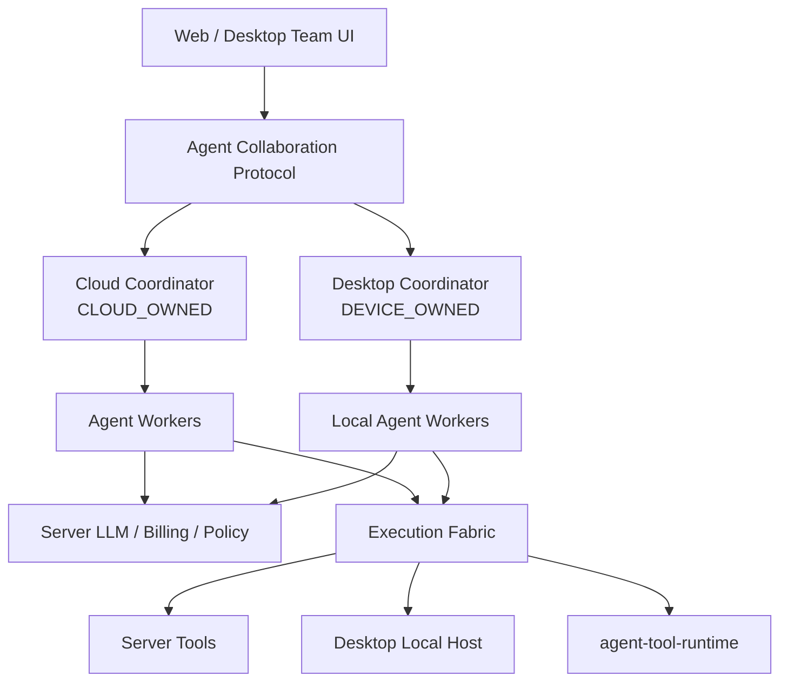

# 企业多智能体协作架构设计 v1.0

> 日期：2026-08-12
>
> 状态：📋 架构基线设计
> 上位设计：[企业 Agent 平台总体架构](enterprise-agent-platform-integration-design.md)

## 1. 核心决策

建立跨 Web 与 Desktop 共用的 **Agent Collaboration Plane**。它管理“谁负责、如何拆解、哪些成员并行、成员如何通信、何时停止、如何综合”，但不复制既有平台职责：

- Policy Plane 决定成员与工具权限；
- Execution Fabric 决定工具在哪里执行；
- Evidence Ledger 证明动作和结果；
- Evaluation 评估团队版本；
- Collaboration Plane 只管理智能体实例、工作分派、通信、预算和综合。

现有 `delegate_to_subagent` 将作为单成员兼容入口，底层迁移到新协议，不再作为长期核心架构。

## 2. 不可破坏的原则

1. **一个 Coordinator**：一次 AgentRun 只有一个权威协调器，`CLOUD_OWNED` 在服务器，`DEVICE_OWNED` 在原 Desktop；接续端不会改变 Coordinator。
2. **团队归属不等于工具执行位置**：成员属于 AgentRun；它调用的每个工具仍可固定到 Server、owner Desktop 或远端 runtime。
3. **树管责任、DAG 管工作**：agent tree 表达创建和管理关系；assignment DAG 表达任务依赖，不能混为一张树。
4. **独立上下文默认**：成员只获得任务所需的 ContextPackage，不复制完整会话；通过消息、Artifact 和 Evidence 共享结果。
5. **权限只收窄**：子级继承上级授权上限且只能缩小；不能因继续 spawn 获得新工具、数据或执行节点权限。
6. **持久状态优先**：数据库/本地 event store 是权威，Redis 仅缓存；进程内 task 不是运行事实。
7. **至少一次传递、业务幂等**：不承诺网络恰好一次；所有 command/message/event 有 ID、序列、ACK 和去重。
8. **最终答复单一责任**：只有 root/leader 对用户最终答复负责；成员输出是建议、产物和证据。
9. **有界自治**：深度、并发、token、积分、时间、工具调用和副作用均有预算。
10. **不滥用多智能体**：协调器必须先判断任务是否值得组队，成本收益不成立时保持单智能体。

## 3. 领域模型

| 实体 | 含义 | 权威 |
|---|---|---|
| `AgentDefinition` | 角色、人设、方法论、能力要求 | Server |
| `AgentRelease` | 冻结 Prompt、模型策略、Skills、Tools、Policy schema 的发布版本 | Server |
| `AgentTeamTemplate` | 负责人、成员角色、协作策略、默认预算和验收规则 | Server |
| `AgentRun` | 一次协调运行，绑定会话引用、owner 与 release | 所属 Coordinator |
| `AgentInstance` | 本次运行中的 root/child 实例，含稳定 path | 所属 Coordinator |
| `WorkAssignment` | 给某成员的目标、约束、输入、成功标准和依赖 | 所属 Coordinator |
| `ContextPackage` | 显式传递的最小上下文及引用 | 所属 Coordinator |
| `AgentMessage` | 成员间持久消息，带 seq、causation、ACK | 所属 Coordinator |
| `TeamBudget` | 并发、深度、成本、token、时间和工具上限 | Server 上限 + Coordinator 消耗 |
| `SynthesisRecord` | root 对成员结论的采纳、拒绝、冲突和证据映射 | 所属 Coordinator |

`AgentInstance.path` 采用稳定层级，如 `/root/research`、`/root/research/source_checker`。路径用于 UI 和通信寻址，数据库主键仍使用不可猜测 UUID。

## 4. 协作原语

首版统一提供七个有审计语义的操作：

| 原语 | 用途 | 关键约束 |
|---|---|---|
| `spawn` | 创建子成员并指派首个工作 | 校验深度、并发、release、权限和预算 |
| `send` | 给运行中成员发送补充信息/纠偏 | 持久 mailbox，需 ACK |
| `follow_up` | 成员完成后追加新 assignment | 复用实例上下文，产生新 assignment |
| `wait` | 等待一个/多个依赖或任一完成 | 非阻塞挂起 root worker |
| `interrupt` | 请求暂停/取消成员当前工作 | 安全点生效；副作用中的 action 先 reconcile |
| `list` | 查询树、状态、预算和依赖 | 按调用者权限裁剪 |
| `publish` | 发布结构化结果、Artifact、Evidence 引用 | schema 校验和内容分级 |

用户澄清不是单一 session 变量，而是 `InputRequest`：绑定 `agent_run_id/instance_id/assignment_id/question_id`，可并存、可取消、可恢复。

## 5. 状态机与恢复

### 5.1 AgentInstance

`CREATED → QUEUED → RUNNING ↔ WAITING_MESSAGE / WAITING_TOOL / WAITING_USER / PAUSED → COMPLETED / FAILED / CANCELLED / LOST`

### 5.2 WorkAssignment

`DRAFT → READY → CLAIMED → RUNNING → BLOCKED / VERIFYING → SUCCEEDED / FAILED / CANCELLED / UNKNOWN`

写副作用发生后无法确认结果时必须为 `UNKNOWN`，不得换成员、换节点或自动重做。Coordinator 重启后根据 journal、Execution Fabric invocation 与 Evidence 对账；旧 worker 通过 lease epoch/fencing token 禁止提交迟到结果。

### 5.3 持久化

服务端至少包含：

- `agent_runs`
- `agent_instances`
- `agent_assignments`
- `agent_messages`
- `agent_run_events`
- `agent_run_budgets`
- `agent_synthesis_records`

每张表必须含 `tenant_id`，运行实体冻结 `agent_release_id/policy_revision/protocol_version`。事件表 append-only，状态表为事件投影；命令与 outbox 同事务提交。

Desktop 使用等价 schema 的加密本地 event store。云端只保存策略允许的投影，不能用投影在其他环境接管 `DEVICE_OWNED` AgentRun。

## 6. ContextPackage

成员上下文必须是有类型的 envelope：

```text
objective, scope, exclusions, success_criteria
session and AgentRun references
input artifact/evidence references
known facts with source and freshness
authority/policy/budget snapshot
parent summary and selected recent turns
expected output schema
```

支持 `none`、`selected`、`recent_n`、`summary_plus_refs` 四种继承策略；禁止默认复制完整主会话。大结果必须发布为 Artifact 或 Evidence，只在消息中传摘要与引用，避免上下文指数膨胀。

## 7. 团队编排策略

首期只提供可解释的策略：

- `single_delegate`：兼容当前行为；
- `parallel_specialists`：独立成员并行，root 汇总；
- `pipeline`：成员按依赖顺序移交 Artifact；
- `maker_checker`：执行者 + 独立复核者；
- `map_reduce`：数据分片并行处理后聚合。

“自由辩论”与无限递归不进入首版。动态组队只能从租户已授权的 AgentRelease 中选择，并受 team policy 限制。团队模板是企业可复用资产，应支持草稿、评测、发布、灰度和回滚。

## 8. 调度、预算与成本

默认团队最大并发为 3、最大深度为 2，租户管理员可在平台上限内收窄或申请提高。调度器同时执行：

- 平台/租户/用户/AgentRun 四级并发限制；
- token、积分、wall time、模型调用和工具调用预算；
- 队列优先级与租户公平性；
- 成员失败预算和退避；
- GUI 独占工具的资源冲突检查。

达到软阈值时 root 必须收敛；达到硬阈值时停止新 spawn，并用已有证据综合。任何成员不得自行绕过计费或使用未授权模型。

## 9. 权限、安全和证据

每个 AgentInstance 获得不可扩大、短期有效的 capability snapshot。spawn 时 PDP 评估：创建者、角色 release、数据范围、工具、目标节点、预算和深度。高风险工具仍需绑定 `action_digest` 的 authorization ticket，智能体团队身份不替代用户/企业审批。

所有成员输出标明来源实例；工具执行沿用 Execution/Action/Evidence envelope。设备签名只能证明某安装实例报告了该事件，不能把主观分析升级为外部事实。

Prompt injection 防护至少包含：外部内容不能创建成员、改变预算、扩大工具权限或向其他成员发送系统级指令；跨成员内容按不可信数据处理，只有 Coordinator 能解释协议命令。

## 10. Web 与 Desktop 架构



前后端共用 contracts、事件名和投影 reducer。Web 不运行 `DEVICE_OWNED` 的协调器，只通过 Session Relay 发命令并查看投影；Desktop 不复制租户、计费、LLM 和 Policy 权威。

## 11. 用户体验

默认界面仍是简单对话。只有启动团队时显示折叠的“协作进度”卡片：成员、当前工作、状态、耗时和预算。展开后提供：

- 责任树与 assignment 依赖；
- 每个成员的摘要、Artifact、Evidence 和失败原因；
- 给成员补充信息、追加任务、暂停、中断或取消；
- 待用户输入/审批的准确归属；
- 已用积分与预计剩余成本；
- root 最终综合中对冲突的处理。

Web 和 Desktop 使用同一信息架构。Desktop 可增加“本机/服务器/远端节点”执行位置标识，但不能把工具节点误显示为智能体成员。

## 12. 可观测性和评测

关键指标：组队触发率、并行加速比、任务成功率、root 采纳率、重复工作率、冲突率、clarification 次数、每成功任务成本、预算中止率、worker 恢复率、迟到结果拒绝数、未知副作用数。

团队评测必须比较单智能体基线，只有质量、时延或业务证据显著改善且成本可接受时才发布。Golden Tasks 覆盖并行研究、maker-checker、成员失败、消息丢失、Coordinator 重启、预算耗尽、恶意成员输出和多租户隔离。

## 13. 架构红线

- 不以进程内 `asyncio.Task` 或 Redis TTL 作为运行权威。
- 不允许成员缺少 tenant、Task、Execution、release 和 policy 标识。
- 不默认给所有成员完整会话和全部工具。
- 不把“并发开多个 LLM”当作团队协作完成。
- 不允许 root 在未声明冲突与证据缺口时拼接成员文本。
- 不因 Desktop 离线而迁移 `DEVICE_OWNED` AgentRun。
- 不对未知副作用自动重试。
