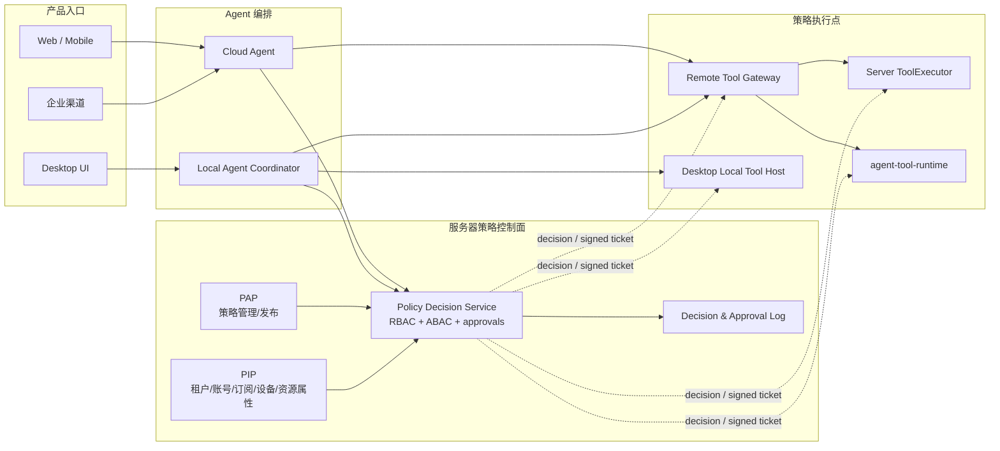

# 企业统一 Policy Engine 设计

> 状态：架构设计稿（待评审）
>
> 日期：2026-08-12
> 适用范围：Web、Desktop、企业微信/钉钉/飞书渠道、Cloud Agent、Local Agent Coordinator、Server ToolExecutor、`agent-tool-runtime`

## 1. 决策摘要

企业统一 Policy Engine 是全产品的授权决策控制面，不是 Desktop 独有功能。服务器始终是租户、账号、组织角色、订阅计费、数字员工授权、LLM/Prompt、企业策略和审计的权威来源；所有真正产生效果的执行端都只能是策略执行点（PEP），不能自行扩大权限。

核心决策：

1. 采用 **PAP + PIP + 中央 PDP + 分布式 PEP**。服务端 Policy Decision Service 统一决策，Cloud Agent、Remote Tool Gateway、Server ToolExecutor、Desktop Local Tool Host 和 `agent-tool-runtime` 分层执行。
2. 用现有 RBAC/订阅授权作为基线，再增加 ABAC。角色回答“通常能做什么”，主体、资源、动作、设备、网络、时间、数据敏感度等属性回答“这一次能不能做”。
3. 工具声明的 `operation_effect` 与运行后报告的 `result_effect` 分离。前者用于执行前授权；后者用于审计、补偿和禁止危险重试。
4. 决策结果不是一个布尔值，而是 `allow/deny/approval_required` 加 obligations：目标节点、数据范围、参数上限、脱敏、审批、证据、超时、网络和重试约束。
5. 高风险动作先形成不可变 `action_digest`，审批和授权票据都绑定该摘要。参数、目标、Provider/schema、设备或策略版本变化后必须重新决策/审批。
6. 默认使用 deny-overrides；缺属性、策略版本不兼容、签名失败、租户或工具 kill switch 激活时 fail closed。聊天展示等非执行能力可降级，写动作不可降级放行。
7. 首期在现有 Python 服务中实现语言无关策略契约和可替换 evaluator，不把是否引入 OPA 作为首期前置条件；接口和 bundle 格式为后续 OPA/其他引擎留出适配层。

## 2. 目标与非目标

### 2.1 目标

- 一个策略语义覆盖所有入口和执行位置，避免 Web、Desktop、渠道分别维护权限判断。
- 租户隔离、订阅、用户授权、设备归属和 Provider 信任在执行前统一求交。
- 支持 RBAC、ABAC、逐次审批、批量审批、双人审批、职责分离和紧急停止。
- 让 LLM 只能选择经过过滤的工具，且 LLM 输出永远不能作为授权依据。
- 每次决策、审批和执行都可关联到 tenant/task/session/execution/invocation 和策略版本。
- 支持策略灰度、模拟评估、差异分析、快速撤销和安全缓存。

### 2.2 非目标

- 不在客户端复制租户账号、计费或组织权限的权威数据库。
- 不允许 Prompt、Skill 或 Provider manifest 直接覆盖企业策略。
- 不用 Policy Engine 取代业务输入校验、数据库租户过滤、操作系统沙箱或 Provider 自身安全。
- 不承诺离线执行需要 LLM 的新任务；本地只可在有效票据和已有明确用户动作范围内完成有限收尾。
- 首期不自研通用策略语言 IDE，也不一次迁移所有历史 API 权限装饰器。

## 3. 现状审计

### 3.1 可直接复用的实现

| 现有能力 | 位置 | 可复用价值 |
|---|---|---|
| `ExecutionTarget.SERVER/LOCAL_REQUIRED/EITHER` | `src/tools/base.py` | 保留为粗粒度执行位置约束，升级为工具 manifest 的一个字段 |
| 租户上下文 | `src/saas/context.py`、`middleware.py` | tenant 必须由认证上下文注入，不能信任模型/请求体自报 |
| 两级数字员工授权 | `src/saas/permissions/checker.py` | “租户有效订阅 ∩ 用户授权”的 RBAC/PIP 基线 |
| 平台/租户管理员角色 | SaaS 认证和权限 API | 可作为角色属性，但平台代管仍必须绑定明确目标租户 |
| 设备 token、撤销和归属 | `src/local_tools/pairing.py`、`api.py` | 设备身份和 PEP 注册基线；token 明文仅一次、服务端只存 hash |
| 受信 Provider catalog | `src/local_tools/catalog.py` | Provider/tool allowlist 基线，可迁移为版本化注册快照 |
| claim token 与租约 | `src/local_tools/security.py`、`repository.py` | 一次执行授权的原型；后续扩展为签名 authorization ticket |
| 副作用终态 | `none/applied/partial/unknown` | 运行后效果记录；`unknown` 禁止自动重试的语义应保留 |
| 工具和 token 审计 | `SessionRecordService`、`chat_records`、JSONL | 可接入统一 decision/invocation/evidence 标识 |
| Desktop v2.2 边界 | Desktop 设计文档 | Local Coordinator 负责本地回合，服务器继续掌握企业策略权威 |

### 3.2 关键缺口

1. 当前权限主要解决“能否使用某个数字员工”，没有统一回答“谁在什么条件下对哪个资源执行哪种动作”。
2. `ExecutionTarget` 只有位置语义，缺少动作效果、资源范围、敏感度、可逆性、幂等性和证据要求。
3. 权限判断散落在 API、Agent、Proxy Tool、静态 catalog 和 Runtime，容易出现入口差异。
4. 本地工具仅校验 selected/active/online/provider；尚无统一 PDP 决策、审批绑定和策略版本票据。
5. 当前 Runtime 的 claim token 证明“领取了这条 invocation”，但没有独立证明 tenant policy 已批准哪些参数和效果。
6. 只有少量业务模块有专用审计/暂停能力，缺少租户、Provider、工具、设备和全局分层 kill switch。
7. 缺少职责分离、审批超时/撤回、策略模拟、决策日志和策略变更影响分析。
8. `UserAgentPermissionDB` 的部分查询只按 `user_id`，依赖 user ID 全局唯一；统一 PIP 必须显式保留 tenant 维度并补契约测试。

## 4. 权威边界和总体架构



### 4.1 组件职责

| 组件 | 职责 |
|---|---|
| PAP | 策略模板、租户覆盖、审批流程、发布/回滚、模拟和变更审计 |
| PIP | 读取可信主体、订阅、组织、资源、设备、Provider、风险和环境属性 |
| PDP | 规范化输入、匹配策略、冲突合并、生成 decision/obligations/ticket |
| Approval Service | 保存审批快照、验证职责分离、收集批准/拒绝、触发重新决策 |
| PEP | 执行前再次验证票据、参数摘要、节点和时效；强制 obligations；回报证据 |
| Audit | 保存决策输入摘要、命中规则、策略版本、审批链和执行关联，不记录明文 secret |

### 4.2 不可变权威原则

- tenant/account/role/subscription/billing/LLM policy 均以服务器为权威。
- `DEVICE_OWNED` 会话的 owner device、Coordinator、workspace 和执行环境不可因 Web/移动端接续而变化。
- 远端 Runtime 只是某次工具调用的目标 PEP；不能取得会话 Coordinator 权威。
- Tool catalog 是 `服务器批准快照 ∩ 节点已证明能力 ∩ 主体授权`，设备自报不能直接进入模型工具集合。

## 5. 策略输入与工具 Effect Contract

### 5.1 决策输入

```json
{
  "schema_version": "1.0",
  "request_id": "req_...",
  "tenant_id": "tenant_...",
  "subject": {
    "user_id": "user_...",
    "roles": ["hr"],
    "department_ids": ["dept_hr"],
    "agent_id": "recruiting",
    "channel": "desktop",
    "auth_strength": "mfa"
  },
  "action": {
    "tool_id": "ai.aidwork.boss-recruiting/boss_greet",
    "provider_digest": "sha256:...",
    "schema_digest": "sha256:...",
    "operation_effect": "send",
    "arguments_digest": "sha256:...",
    "requested_count": 3
  },
  "resource": {
    "type": "candidate",
    "classification": "internal",
    "owner_department_id": "dept_hr"
  },
  "environment": {
    "session_type": "DEVICE_OWNED",
    "owner_device_id": "dev_a",
    "target_device_id": "dev_hr_01",
    "network_zone": "corporate",
    "interactive": true,
    "time": "2026-08-12T12:00:00Z"
  }
}
```

`tenant_id/user_id/roles/subscription` 必须由服务器认证上下文构造；工具参数由 schema 校验后规范化并计算 canonical JSON digest。客户端仅提交事实候选，PIP 再从权威数据源核验。

### 5.2 工具 manifest 必备字段

| 字段 | 含义 |
|---|---|
| `tool_id/version/schema_digest` | 唯一工具身份和契约版本 |
| `execution_target` | `server/local_required/either` 粗粒度位置 |
| `operation_effect` | `read/create/update/delete/send/publish/pay/gui_control/execute` |
| `resource_types` | 可能访问的业务/文件/系统资源 |
| `sensitivity` | `public/internal/confidential/restricted` |
| `reversible` | 是否有可靠撤销/补偿 |
| `idempotency` | `safe/idempotent/non_idempotent/unknown` |
| `external_side_effect` | 是否对组织外部或第三方系统可见 |
| `evidence_capabilities` | preview、before/after、receipt、screenshot、message_id 等 |
| `required_device_traits` | 平台、GUI、网络区、Provider、交互桌面等 |

### 5.3 运行后 Effect

`result_effect` 沿用并规范化为 `none/applied/partial/unknown`。它不能由模型指定，只能由受信 Executor/Provider 回报并由 PEP 补充证据。`partial/unknown` 对非幂等动作一律禁止自动重试，进入人工核验或补偿流程。

## 6. 策略模型与合并算法

### 6.1 策略层级

从高到低：

1. 平台不可覆盖安全基线。
2. 租户全局策略。
3. 部门/岗位策略。
4. 数字员工策略。
5. Provider/工具策略。
6. 用户显式授权和单次审批。

低层只能进一步收紧；需要放宽平台基线必须走平台版本发布，不能由租户覆盖。

### 6.2 RBAC + ABAC

- RBAC：`platform_admin/tenant_admin/user`、企业岗位角色、数字员工订阅和用户授权。
- ABAC：主体部门/身份强度，资源所有者/分类，动作 effect/金额/数量，设备信任/网络区/在线交互状态，时间窗口和风险等级。
- 所有策略先做 tenant scope 隔离，再做角色和属性计算，禁止跨租户关系参与匹配。

### 6.3 决策结果

```json
{
  "decision_id": "pdec_...",
  "decision": "approval_required",
  "policy_revision": "tenant_abc:42",
  "reason_codes": ["EXTERNAL_SEND_REQUIRES_APPROVAL"],
  "obligations": {
    "max_count": 3,
    "target_device_id": "dev_hr_01",
    "require_preview": true,
    "evidence": ["recipient_list", "receipt"],
    "timeout_seconds": 600,
    "retry": "manual_only"
  },
  "approval_request_id": "apr_..."
}
```

合并规则：显式 deny 优先；kill switch 优先于所有 allow；多个 allow 的 obligations 取最严格交集；缺失必要属性视为 deny；策略冲突返回稳定 reason code，不猜测放行。

## 7. 审批与职责分离

### 7.1 审批对象

审批对象不是一段自然语言，而是 `tenant + subject + tool/provider/schema + canonical arguments + resource + target device + policy revision` 的 `action_digest` 快照。审批 UI 展示人类可读预览，同时保存摘要。

### 7.2 流程

```text
evaluate → approval_required → create approval snapshot
→ approver review/approve/reject/expire/revoke
→ re-evaluate current policy and attributes
→ issue short-lived authorization ticket
→ PEP verify and execute once
```

审批后仍重新决策，避免订阅到期、设备撤销、资源敏感度变化或 kill switch 已开启。

### 7.3 职责分离规则

- Agent/LLM 永远不能成为审批人。
- 默认请求人不能审批自己的高风险动作；可按租户策略允许低风险自确认。
- 支持 `N-of-M`、指定角色、不同部门、金额阈值和顺序审批。
- 管理员不能审批自己刚刚发布且立即触发的高风险策略变更，平台紧急操作除外但必须强化审计。
- 代理审批、撤回、超时和替换审批人均产生不可修改审计事件。

## 8. 数据模型

建议新增：

| 表 | 核心字段 |
|---|---|
| `policy_sets` | id, tenant_id, scope_type/id, revision, status, content, content_digest, created_by |
| `policy_releases` | policy_set_id, revision, effective_at, rollback_of, signature, key_id |
| `policy_decisions` | decision_id, tenant_id, subject_id, action_digest, decision, reasons, obligations, policy_revision, expires_at |
| `approval_requests` | id, tenant_id, action_digest, snapshot, required_rule, status, expires_at |
| `approval_actions` | request_id, approver_id, decision, reason, created_at |
| `authorization_tickets` | jti_hash, tenant_id, decision_id, invocation_id, target, expires_at, consumed_at |
| `kill_switches` | scope_type/id, tenant_id, mode, reason, activated_by, activated_at, expires_at |

所有业务表带 `tenant_id` 并建立 tenant 前缀索引；跨表引用查询必须同时限定 tenant。策略/审批事件采用 append-only 语义，敏感参数只保留摘要和按策略脱敏的预览。

## 9. 协议与 API

### 9.1 内部决策 API

| 方法 | 路径 | 用途 |
|---|---|---|
| POST | `/api/internal/policy/v1/evaluate` | Cloud Agent、Coordinator/Gateway 请求决策 |
| POST | `/api/internal/policy/v1/tickets/{id}/consume` | Server PEP 原子消费一次性票据 |
| GET | `/api/policy/v1/bundles/current` | PEP 拉取签名的执行基线/撤销信息 |
| POST | `/api/policy/v1/decisions/{id}/evidence` | PEP 回传执行证据摘要 |

### 9.2 管理与审批 API

- `/api/saas/policies/*`：草稿、validate、simulate、publish、rollback、diff。
- `/api/approvals/*`：列表、详情、approve、reject、revoke。
- `/api/saas/kill-switches/*`：平台/租户管理员在授权范围内启停。

所有变更端点要求幂等键、CSRF/认证保护、操作者身份和 reason；发布/kill switch 不能只依赖前端隐藏按钮。

### 9.3 Authorization Ticket

票据采用服务器非对称签名，至少绑定：`jti, tenant_id, user_id, agent_id, session_id, invocation_id, tool_id, provider/schema digest, arguments_digest, target_kind/id, policy_revision, obligations_digest, iat, exp`。Desktop/Runtime 仅持有内置或安全更新的公钥。一次性写动作还需服务端原子 consume；网络不可用时不得执行尚未开始的写动作。

## 10. 缓存、签名和策略发布

- PDP 可缓存规范化决策，但 key 必须包含 tenant、subject revision、action/resource digest、device revision 和 policy revision。
- deny 缓存短 TTL；allow TTL 不得超过订阅/账号/设备/策略中最早失效时间。
- 审批、kill switch、账号禁用、设备撤销和策略发布主动失效相关缓存。
- PEP 只缓存签名 bundle 和公钥，不能缓存裸 allow。高风险调用必须使用短期票据。
- bundle 使用 canonical 内容摘要、revision、key ID 和签名；新 bundle 验签失败时继续使用最近有效版本，但若版本已超过 `max_staleness` 则停止受控执行。
- kill switch 通过 WSS/事件总线快速推送，同时受短 TTL 票据约束，避免仅依赖长连接。
- 决策日志记录 `decision_id/policy_revision/reason`，不默认记录完整工具参数和凭证。

## 11. Kill Switch 模型

支持以下 scope：`platform`、`tenant`、`agent`、`provider`、`tool`、`device`、`execution_target`。模式：

- `block_new`：禁止创建新执行。
- `cancel_queued`：同时取消未领取任务。
- `stop_safe_running`：通知可安全取消的运行中任务协作停止。
- `quarantine`：隔离节点/Provider，不接受心跳能力更新以外的操作。

对于已经产生外部副作用的动作，kill switch 不能假装回滚；应停止后续步骤并将状态标记为 `partial/unknown`，进入证据核验。所有 kill switch 必须有操作者、原因、作用范围、开始/结束时间和通知记录。

## 12. 故障、安全与降级

| 场景 | 行为 |
|---|---|
| PDP 超时 | 写/发送/删除/支付/GUI 控制 fail closed；纯展示可返回稍后重试 |
| PIP 属性缺失 | deny + `ATTRIBUTE_UNAVAILABLE`，不使用客户端自报补齐 |
| 票据过期/摘要不匹配 | PEP 拒绝，重新决策；不修改参数尝试绕过 |
| 策略发布错误 | 原子激活；失败保持上一 revision；支持一键回滚 |
| PEP 离线 | 不开始新写动作；已开始动作记录本地 journal，恢复后回传，无法证明则 unknown |
| 审批后策略变化 | 票据失效，重新决策；已有审批只作为历史证据 |
| 设备撤销/隔离 | 新任务立即禁止；运行中按 effect 决定安全取消或人工核验 |
| 审计写入失败 | 高风险执行不放行；低风险可进入有界本地 outbox，超限停止执行 |

安全要求：租户过滤必须在数据库层/API 层继续保留；本地 PEP 不以管理员权限运行；secret 不进入策略输入；票据防重放；时钟偏差有界；日志按租户保留策略加密、脱敏和清理。

## 13. 与现有体系的迁移

### Phase P0：契约与观测

- 建立语言无关 policy input/decision/tool manifest schema。
- 把现有权限判断包装为 `LegacyPolicyAdapter`，只记录 shadow decision，不改变执行结果。
- 给工具补齐 `operation_effect/resource/idempotency/evidence` 元数据。

### Phase P1：服务端单点决策

- Web/渠道 Cloud Agent 和 Remote Tool Gateway 接 PDP。
- 先覆盖 BOSS/weixin 和高风险发送/删除工具。
- 建立 decision log、租户/tool kill switch 和 policy simulator。

### Phase P2：审批与票据

- 实现 action digest、审批工作流、SoD 和短期授权票据。
- Server ToolExecutor 和 `agent-tool-runtime` 成为强制 PEP。
- 将当前 claim token 保留为租约凭证，authorization ticket 单独表达授权，二者不混用。

### Phase P3：Desktop PEP

- Local Coordinator 在工具进入模型 catalog 前做 discover/filter。
- Desktop Local Host 执行前验签并强制 workspace、参数、超时和证据 obligations。
- 保证 DEVICE_OWNED 会话接续不改变 owner/workspace/target 约束。

### Phase P4：全面治理

- 策略灰度、差异分析、组织目录/数据分类接入、双人审批、应急演练。
- 评估是否引入 OPA 作为 evaluator；只替换 PDP 内部实现，不改变产品协议。

## 14. 测试与验收

### 14.1 自动化

- 策略单元测试：allow/deny/approval、deny-overrides、obligation 交集、缺属性。
- 租户隔离：相同 user/tool/resource ID 在不同 tenant 下不能串用缓存、审批或票据。
- 契约测试：Python/TypeScript 对 canonical JSON、digest、签名和 reason code 结果一致。
- PEP 测试：篡改参数、替换设备、过期/重放票据、旧 schema/provider digest 均拒绝。
- 审批测试：自批、重复批、审批后变参、审批过期、策略变更、N-of-M、撤回。
- 故障测试：PDP/PIP/审计不可用、时钟漂移、推送丢失、kill switch 与执行竞态。
- 回归测试：现有数字员工订阅/用户授权、Web/渠道主链路和 Runtime claim/result 保持兼容。

### 14.2 完成门禁

- 同一 action 在 Web/Desktop/渠道得到相同决策语义。
- 任意 PEP 都不能只凭 LLM 或设备自报信息执行未批准工具。
- 高风险动作能从执行结果追溯到唯一 decision、policy revision、审批和 ticket。
- kill switch 在目标 SLA 内阻止新执行，且不会把已产生效果误记为取消成功。
- 策略服务故障时无写动作 fail open。

## 15. 风险与待决策

| 项目 | 建议 |
|---|---|
| 首期 evaluator | 先原生实现有限、可测试 DSL；保持适配层，压测/复杂度达到阈值再引入 OPA |
| allow 可用性与 fail closed | 按 effect 分级；高风险必须在线，低风险只允许签名短缓存 |
| 审计数据量 | 参数摘要 + 脱敏预览，证据大对象进入租户隔离对象存储 |
| 策略复杂度 | 提供模板和 simulator，限制嵌套/动态外部调用，发布前静态检查 |
| 客户端旧版本 | 能力协商；不支持所需 obligations 的 PEP 必须拒绝，不得忽略字段 |
| 平台管理员代管 | 强制显式 target tenant、强化审计和短时授权，不提供跨租户通配票据 |

待产品确认：默认需要审批的 effect/阈值；审批人组织来源；证据保留周期；低风险本地只读是否允许短时离线；租户是否可自定义策略 DSL 或仅使用平台模板。

## 16. 官方参考

- [NIST SP 800-162：ABAC、PDP、PEP 和属性模型](https://nvlpubs.nist.gov/nistpubs/specialpublications/NIST.SP.800-162.pdf)
- [Open Policy Agent：Policy Bundle、签名与版本缓存](https://www.openpolicyagent.org/docs/management-bundles)
- [Open Policy Agent：Decision Logs](https://www.openpolicyagent.org/docs/management-decision-logs)
