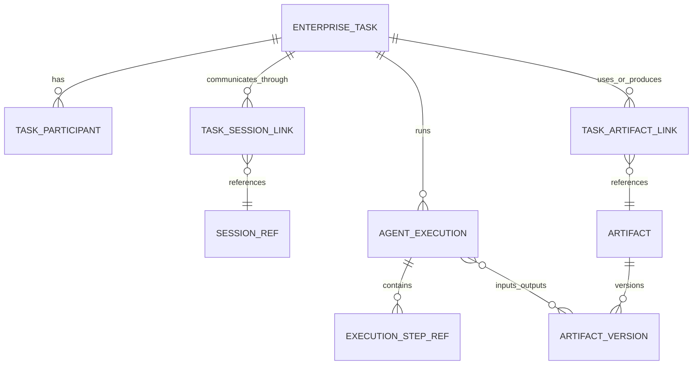

# 企业 Agent Task / Session / Execution / Artifact 模型设计

> 版本：v1.0
>
> 日期：2026-08-12
>
> 状态：架构设计基线，待分阶段实现
>
> 适用范围：Web、Agent Desktop、企业微信、钉钉、飞书、Cloud Agent、Local Agent Coordinator、`agent-tool-runtime`
>
> 关联设计：[Agent Desktop 客户端设计](../desktop-agent-client-design.md)、[工作成果记录](../work-outcome-record-design.md)、[Evidence Ledger](./enterprise-evidence-ledger-design.md)

## 1. 决策摘要

企业 Agent 的一级业务对象应从“会话”提升为 `Task`，并用四个正交对象表达工作：

- `Task`：为什么做、由谁负责、何时算完成的企业工作对象。
- `Session`：人和 Agent 沟通、查看进展和补充信息的交互通道。
- `Execution`：某个执行环境中一次可追踪、可取消、可重试的实际运行。
- `Artifact`：执行读取或产出的、可版本化和可交付的业务对象。

权威原则：

1. 租户、账号、组织权限、计费、LLM、Prompt、数字员工定义、Task 元数据和企业审计索引以服务器为权威。
2. `CLOUD_OWNED` Session 与 Execution 由 Cloud Agent 承载；`DEVICE_OWNED` Session 的完整事件流与 Coordinator journal 以原 Desktop 本地为权威，云端只保存允许同步的消息投影和索引。
3. 执行环境亲和性不可静默变化。Web 或移动端接续 `DEVICE_OWNED` Session 时，消息必须中转回原 Desktop；设备离线就明确阻断。
4. 调用服务器工具或固定的远端 `agent-tool-runtime` 只是 Execution 中一次 Step 的目标，不改变 Coordinator 和主执行环境。
5. 新模型以旁路关联方式接入现有 `chat_sessions`、`channel_sessions`、`chat_records`、`scheduled_tasks` 和 `work_outcomes`，首期不合表、不改现有稳定上下文重建链路。

## 2. 目标与非目标

### 2.1 目标

- 让一个企业任务可以跨 Web、Desktop 和消息渠道被查看、补充、审批和接续。
- 区分“用户看见的一段对话”和“系统真正执行的一次运行”，支持重试、定时触发、后台运行和多执行节点。
- 明确负责人、参与者、完成定义、截止时间、阻塞原因、交付物和执行成本。
- 兼容当前非编程 Agent 场景：办公文档、客户沟通、招聘、合同、数据分析、内容生产、发布和 RPA。
- 为统一策略、Evidence Ledger、企业记忆和业务评估提供稳定主键与关系。

### 2.2 非目标

- 本设计不增加编程 Agent、Git/worktree 或代码审查专用语义。
- 不把聊天消息、工具明细、二进制文件全部塞入 `enterprise_tasks`。
- 不以新模型替换现有计费、LLM 网关、渠道适配器或本地会话存储。
- 不允许通过“任务接续”绕过设备离线、租户策略、用户审批或工具授权。
- 不要求首期把所有历史会话自动推断成高质量 Task。

## 3. 现状审计

### 3.1 已存在且应复用

| 能力 | 当前实现 | 可复用结论 |
|---|---|---|
| Web 会话 | `chat_sessions` + `chat_messages`；`src/api/session.py`、`src/db/models.py` | 保持 Web 上下文权威表；通过映射表挂到 Task，不改读写路径 |
| 渠道会话 | `channel_sessions` + `channel_messages`；`src/channels/session.py` | 已按 `tenant_id + channel + user + subagent` 隔离；继续独立存储 |
| 计费交互记录 | `chat_records`、`SessionRecordService` | 已记录模型、token、积分、工具摘要、时延与状态；可关联 Execution，但不能替代 Execution |
| 同会话串行与多会话并发 | `src/core/session_queue.py`、Web per-session SSE 状态池 | 保持现有并发语义；Task 不应变成新的全局互斥锁 |
| 定时任务 | `scheduled_tasks`、`scheduled_task_logs`、`src/scheduler/*` | 定义和触发日志可保留；每次触发应逐步映射到 Execution |
| 子智能体执行 | `execution_id`、子智能体状态记录 | ID 和进度思想可复用，但当前 Redis/进程内记录不是企业级统一执行账本 |
| 浏览器运行 | `bs_browser_runs`、assistance、resume lease queue | 已有 run、人工接管、lease 和故障恢复，是 Step 级执行的成熟样板 |
| 工作成果 | `work_outcomes`、`WorkOutcomeDB` | 已支持租户过滤、文件/动作/决策分类；后续作为 Artifact/Outcome 投影兼容保留 |
| 社媒发布 | review、publish job、attempt、published content | 已有版本冻结、幂等、状态未知和尝试记录，可关联 Task/Execution/Artifact |
| Desktop 规划 | `DEVICE_OWNED`、Local Coordinator、Session Relay | 直接作为设备会话与本地执行的权威边界 |

### 3.2 已发现的不一致与缺口

1. `chat_sessions` 与 `channel_sessions` 是按入口划分的会话，不表达企业任务、负责人、完成定义或多个会话之间的业务关系。
2. `chat_records` 是“一轮用户输入到 Agent 回复”的计费记录；其 `execution_details` 为截断 JSON 摘要，没有独立 Execution 状态机、幂等键、取消语义和执行环境亲和性。
3. `SessionContext.current_task_id` 只是 Pydantic 内存字段，未形成持久领域模型。
4. `scheduled_tasks` 同时承担任务定义与运行统计，`scheduled_task_logs` 只有成功/失败/超时；当前表没有 `tenant_id`，执行器创建 `cron_{user_id}` 会话时也未写租户，这是后续接入前必须修补的隔离缺口。
5. 定时任务重试通过进程内线程延迟执行，不是持久 lease；服务重启可能丢失重试，且每次运行没有统一 `execution_id`。
6. 子智能体、浏览器 run、社媒 publish job 和定时任务各自定义 Execution/Run，没有共同的父执行、因果关系和状态映射。
7. `work_outcomes` 当前代码和 DDL 已存在，但设计文档状态仍写“待开发”；其记录可被删除、缺少版本和生命周期，不能作为 Artifact 权威表或不可变证据。
8. Web 会话 API 的部分单条读取先按 `session_id` 查询再比 `user_id`，没有在所有 SQL 中同时携带 `tenant_id`；新 Task API 必须从第一天使用复合租户条件。
9. 当前 `chat_messages`、`channel_messages` 严格分表，这是已明确的上下文安全规则；统一任务模型不得通过 fallback 混读两表。
10. 尚无 `DEVICE_OWNED` 会话云端投影、设备 ACK 序号和 Task 级跨端接续实现。

## 4. 领域模型与关系



### 4.1 Task

Task 是企业可管理的工作单元，不等于提示词。核心字段包括：

- 目标：`title`、`objective`、`completion_criteria`。
- 责任：`requester_user_id`、`owner_user_id`、participants、数字员工版本。
- 管理：优先级、截止时间、SLA、标签、业务对象引用。
- 运行：当前状态、当前/最近 Execution、阻塞原因、成本汇总。
- 来源：Web/Desktop/渠道/定时任务/API/人工创建。

一个 Task 可以有多个 Session 和 Execution；Task 完成必须基于完成定义或人工确认，不能因为 Agent 输出了一段自然语言就自动认定。

### 4.2 Session

Session 是交互上下文，继续沿用现有物理存储，并新增统一 `SessionRef`：

```text
SessionRef = tenant_id + session_type + native_session_id
session_type = WEB | CHANNEL | DEVICE
ownership = CLOUD_OWNED | DEVICE_OWNED
```

- `WEB` 指 `chat_sessions`。
- `CHANNEL` 指 `channel_sessions`，同时记录具体 `source_type`。
- `DEVICE` 指 Desktop 本地会话；服务器保存索引与允许同步的投影。

同一 Task 可挂多个 Session，例如 Desktop 主会话、企业微信审批会话、Web 查看会话。多个 Session 不代表多个任务，也不自动共享完整消息上下文。

### 4.3 Execution

Execution 是“一次真正尝试完成 Task 的运行”。常见触发：

- 用户发送一条需要 Agent 工作的新消息。
- 定时任务到期。
- 审批通过后恢复。
- 用户明确重试或从失败检查点恢复。
- 主 Agent 委派子智能体。

Execution 必须记录：`execution_id`、父执行、触发来源、Coordinator 类型、主执行位置、固定环境绑定、状态、开始/结束时间、计费关联和结果摘要。

`chat_record` 可以关联一个 Execution 的一个或多个 LLM turn；一个 Execution 也可能没有 LLM 调用，例如确定性重放、人工取消或纯 API 步骤。

### 4.4 Artifact

Artifact 是有业务身份的输入或交付物，文件只是其中一种：

- 文件：报告、报价单、合同、表格、图片、视频。
- 结构化数据：客户清单、分析表、发布快照。
- 业务对象快照：订单、审批单、内容版本。
- 决策包：建议、风险清单、行动方案。
- 外部引用：第三方系统对象 ID 和可验证链接。

Artifact 元数据由服务器索引；字节内容可以位于服务器对象存储、原 Desktop、远端 Runtime 或第三方系统。位置不等于所有权，读取仍需租户策略和当前节点授权。

## 5. 权威边界和跨端行为

| 对象/数据 | 权威位置 | 说明 |
|---|---|---|
| Tenant、账号、计费、LLM、Prompt、数字员工策略 | Server | 所有入口一致 |
| Task 元数据、责任、状态、参与人、企业审计索引 | Server | 企业协作和治理需要统一视图 |
| `CLOUD_OWNED` Session 完整记录 | Server | Web/渠道 Cloud Agent 继续执行 |
| `DEVICE_OWNED` Session 完整事件与 journal | 原 Desktop | 云端投影不可反向覆盖 |
| `DEVICE_OWNED` Session 消息投影 | Server projection | 供 Web/移动端查看和接续 |
| Execution 企业索引/状态投影 | Server | 本地执行事件由 Desktop ACK 后上报 |
| 本地 Execution 恢复检查点 | 原 Desktop | 不上传路径、凭证、进程句柄等敏感现场 |
| Artifact 元数据、版本和血缘 | Server | 内容位置可为 local/server/external |
| 本地 Artifact 字节 | 授权设备 | 未上传前其他端只能看到占位和可用性 |

### 5.1 Web/移动端接续设备会话

1. 接续端读取 Task 与 Session 投影，知道进展和当前设备。
2. 新消息发到 Session Relay，携带 `expected_event_seq` 和 `idempotency_key`。
3. Relay 只路由到 `owner_device_id`；Desktop 本地持久化后返回 `accepted_event_seq`。
4. 服务器才确认消息并创建/推进对应 Execution 投影。
5. 设备离线、会话未加载或序号冲突时失败关闭，不切 Cloud Agent、不换设备、不自动执行离线队列。

### 5.2 远端工具不是环境迁移

`DEVICE_OWNED` Execution 可以调用服务器 ToolExecutor 或固定 `agent-tool-runtime`。Step 的 `target_node_id` 可不同，但 `coordinator_location`、`owner_device_id` 和 `workspace_fingerprint` 不变。真正换设备必须显式 fork/handoff，产生新 SessionRef 和新 Execution。

## 6. 状态机

### 6.1 Task 状态

```text
DRAFT -> READY -> RUNNING
RUNNING -> WAITING_INPUT | WAITING_APPROVAL | BLOCKED
WAITING_* | BLOCKED -> RUNNING
RUNNING -> COMPLETED | FAILED | CANCELLED
FAILED -> READY                 # 人工修订后重新执行
COMPLETED | FAILED | CANCELLED -> ARCHIVED
```

约束：

- `COMPLETED` 需要完成标准评估记录或授权用户确认。
- Execution 失败不必导致 Task 失败；仍可重试或等待输入。
- `BLOCKED` 必须有结构化 `block_reason_code` 和建议动作。
- 已归档 Task 不再直接运行，恢复时先回到 `READY` 并留下审计事件。

### 6.2 Session 状态

`ACTIVE -> CLOSED -> ARCHIVED`。Device 会话另有 `ONLINE/OFFLINE/UNAVAILABLE` presence，这不是 Session 业务状态。关闭 Session 不自动取消 Task 的其他 Execution。

### 6.3 Execution 状态

```text
CREATED -> QUEUED -> RUNNING
RUNNING -> WAITING_INPUT | WAITING_APPROVAL | SUSPENDED
WAITING_* | SUSPENDED -> RUNNING
RUNNING -> SUCCEEDED | FAILED | CANCELLED | TIMED_OUT | STATUS_UNKNOWN
FAILED | TIMED_OUT -> QUEUED    # 新 attempt，保留原 attempt
STATUS_UNKNOWN -> SUCCEEDED | FAILED | MANUAL_REVIEW_REQUIRED
```

`STATUS_UNKNOWN` 是不可逆外部动作断线后的必要状态；未经回查或人工确认不得自动重试。

### 6.4 Artifact 状态

`DRAFT -> AVAILABLE -> SUPERSEDED | REVOKED`。删除文件内容不删除审计元数据；合规删除通过 tombstone 记录原因和执行人。

## 7. 表结构建议

所有表必须包含 `tenant_id NOT NULL`；业务唯一约束优先使用 `(tenant_id, business_id)`，所有读写 SQL 显式携带租户条件。

### 7.1 核心表

```sql
CREATE TABLE enterprise_tasks (
    task_id TEXT PRIMARY KEY,
    tenant_id TEXT NOT NULL,
    title TEXT NOT NULL,
    objective TEXT NOT NULL,
    completion_criteria JSONB NOT NULL DEFAULT '{}'::jsonb,
    status TEXT NOT NULL,
    priority TEXT NOT NULL DEFAULT 'normal',
    requester_user_id TEXT NOT NULL,
    owner_user_id TEXT,
    agent_instance_id TEXT,
    agent_definition_version TEXT,
    source_type TEXT NOT NULL,
    source_ref JSONB NOT NULL DEFAULT '{}'::jsonb,
    business_refs JSONB NOT NULL DEFAULT '[]'::jsonb,
    due_at TIMESTAMPTZ,
    current_execution_id TEXT,
    block_reason_code TEXT,
    version BIGINT NOT NULL DEFAULT 1,
    created_at TIMESTAMPTZ NOT NULL DEFAULT NOW(),
    updated_at TIMESTAMPTZ NOT NULL DEFAULT NOW(),
    completed_at TIMESTAMPTZ,
    UNIQUE (tenant_id, task_id)
);

CREATE TABLE task_participants (
    tenant_id TEXT NOT NULL,
    task_id TEXT NOT NULL,
    principal_type TEXT NOT NULL,
    principal_id TEXT NOT NULL,
    role TEXT NOT NULL,
    created_at TIMESTAMPTZ NOT NULL DEFAULT NOW(),
    PRIMARY KEY (tenant_id, task_id, principal_type, principal_id, role)
);

CREATE TABLE task_session_links (
    link_id TEXT PRIMARY KEY,
    tenant_id TEXT NOT NULL,
    task_id TEXT NOT NULL,
    session_type TEXT NOT NULL,
    native_session_id TEXT NOT NULL,
    ownership TEXT NOT NULL,
    source_type TEXT NOT NULL,
    owner_device_id TEXT,
    coordinator_session_id TEXT,
    workspace_ref_hash TEXT,
    workspace_fingerprint TEXT,
    projection_policy TEXT,
    last_accepted_event_seq BIGINT,
    linked_at TIMESTAMPTZ NOT NULL DEFAULT NOW(),
    UNIQUE (tenant_id, session_type, native_session_id)
);

CREATE TABLE agent_executions (
    execution_id TEXT PRIMARY KEY,
    tenant_id TEXT NOT NULL,
    task_id TEXT NOT NULL,
    session_link_id TEXT,
    parent_execution_id TEXT,
    trigger_type TEXT NOT NULL,
    trigger_ref TEXT,
    coordinator_type TEXT NOT NULL,
    coordinator_node_id TEXT,
    environment_binding_hash TEXT NOT NULL,
    status TEXT NOT NULL,
    attempt_no INTEGER NOT NULL DEFAULT 1,
    idempotency_key TEXT NOT NULL,
    started_at TIMESTAMPTZ,
    finished_at TIMESTAMPTZ,
    result_summary TEXT,
    failure_code TEXT,
    retry_of_execution_id TEXT,
    created_at TIMESTAMPTZ NOT NULL DEFAULT NOW(),
    UNIQUE (tenant_id, idempotency_key),
    UNIQUE (tenant_id, execution_id)
);
```

### 7.2 Artifact 表

```sql
CREATE TABLE artifacts (
    artifact_id TEXT PRIMARY KEY,
    tenant_id TEXT NOT NULL,
    artifact_type TEXT NOT NULL,
    title TEXT NOT NULL,
    owner_user_id TEXT,
    sensitivity TEXT NOT NULL DEFAULT 'internal',
    status TEXT NOT NULL,
    current_version INTEGER NOT NULL DEFAULT 1,
    created_at TIMESTAMPTZ NOT NULL DEFAULT NOW(),
    updated_at TIMESTAMPTZ NOT NULL DEFAULT NOW(),
    UNIQUE (tenant_id, artifact_id)
);

CREATE TABLE artifact_versions (
    artifact_version_id TEXT PRIMARY KEY,
    tenant_id TEXT NOT NULL,
    artifact_id TEXT NOT NULL,
    version_no INTEGER NOT NULL,
    content_hash TEXT,
    media_type TEXT,
    size_bytes BIGINT,
    storage_kind TEXT NOT NULL,
    storage_ref_encrypted TEXT,
    external_object_ref JSONB,
    created_by_execution_id TEXT,
    created_by_user_id TEXT,
    metadata JSONB NOT NULL DEFAULT '{}'::jsonb,
    created_at TIMESTAMPTZ NOT NULL DEFAULT NOW(),
    UNIQUE (tenant_id, artifact_id, version_no)
);

CREATE TABLE task_artifact_links (
    tenant_id TEXT NOT NULL,
    task_id TEXT NOT NULL,
    artifact_id TEXT NOT NULL,
    relation TEXT NOT NULL,
    execution_id TEXT,
    created_at TIMESTAMPTZ NOT NULL DEFAULT NOW(),
    PRIMARY KEY (tenant_id, task_id, artifact_id, relation)
);
```

`storage_ref_encrypted` 不得向普通 API 返回明文路径、凭证或签名 URL。Local-only Artifact 只保存设备 ID、opaque handle 和 hash，不保存可被服务器直接解释的绝对路径。

### 7.3 兼容映射

- `chat_records` 后续新增可空 `task_id`、`execution_id`；旧数据保持为空。
- `scheduled_tasks` 后续补 `tenant_id`、`task_template_id`；每个 `scheduled_task_logs` 补 `execution_id`。
- `work_outcomes` 后续补 `artifact_id`、`execution_id`、`evidence_bundle_id`，继续服务现有成果列表。
- `bs_browser_runs`、`social_publish_jobs` 不改主键，只在统一 Execution 中以 StepRef 关联。

## 8. API 与事件契约

### 8.1 API

```text
POST   /api/v1/enterprise-tasks
GET    /api/v1/enterprise-tasks/{task_id}
PATCH  /api/v1/enterprise-tasks/{task_id}        # If-Match: task version
POST   /api/v1/enterprise-tasks/{task_id}/sessions/link
POST   /api/v1/enterprise-tasks/{task_id}/executions
POST   /api/v1/executions/{execution_id}/cancel
POST   /api/v1/executions/{execution_id}/retry
GET    /api/v1/executions/{execution_id}
POST   /api/v1/artifacts
POST   /api/v1/artifacts/{artifact_id}/versions
GET    /api/v1/enterprise-tasks/{task_id}/timeline
```

创建/重试/取消都要求 `Idempotency-Key`。状态更新使用 expected version/CAS；冲突返回 `409 VERSION_CONFLICT`，不能最后写覆盖。

### 8.2 事件信封

所有领域事件经事务 outbox 发布：

```json
{
  "event_id": "evt_...",
  "event_type": "execution.status_changed",
  "schema_version": "1.0",
  "tenant_id": "tenant_...",
  "task_id": "task_...",
  "session_ref": {"type": "DEVICE", "id": "..."},
  "execution_id": "exec_...",
  "sequence": 42,
  "occurred_at": "2026-08-12T12:00:00Z",
  "actor": {"type": "agent", "id": "agent_..."},
  "payload": {"from": "RUNNING", "to": "WAITING_APPROVAL"},
  "trace_id": "trace_..."
}
```

关键事件：`task.created/status_changed/assigned`、`session.linked/projection_updated`、`execution.created/started/suspended/status_changed`、`artifact.created/version_added/linked`。消费者按 `event_id` 去重；同一聚合内按 `sequence` 有序，不承诺跨聚合全局顺序。

## 9. 权限、多租户与数据保护

- 创建 Task 必须绑定当前 tenant；禁止客户端提交任意 `tenant_id` 覆盖认证上下文。
- 默认 requester/owner 可读，参与人按 role 获权；管理员只有租户内权限。
- Task 可见不等于 Artifact 内容可读，Artifact 继承源数据 ACL 和敏感级别。
- 渠道身份必须先映射到租户用户或受限 external principal，不能仅凭手机号/昵称取得 Task 权限。
- Desktop/Runtime 使用 installation identity；服务器只接受已绑定租户、用户和设备的签名连接。
- LLM 获得的 Task 上下文必须先做字段级策略过滤；本地路径、密钥、Cookie、表单值默认不进入云端事件。
- 计费仍以服务器 `chat_records`/usage ledger 为权威，客户端上报只能作为关联信息，不能自报扣费金额。

## 10. 故障语义

| 场景 | 语义 |
|---|---|
| Desktop 离线 | `DEVICE_OFFLINE`；Task 可显示阻塞，但不转 Cloud Agent |
| 本地消息已写、ACK 丢失 | 以 idempotency key + event seq 查询确认，不重复执行 |
| 工具超时且确认无副作用 | Execution/Step 可按策略重试 |
| 外部动作可能已发生 | `STATUS_UNKNOWN`，先回查或人工裁定 |
| Worker 崩溃 | lease 过期回收；fencing token 阻止旧 worker 提交 |
| LLM 成功、记录落库失败 | 结果不得伪装为完整成功；进入 reconciliation，并保留本地/临时 journal |
| Artifact 上传失败 | Execution 可成功但 Task 进入 `BLOCKED` 或 `WAITING_INPUT`，不能宣称已交付 |
| Task 状态并发更新 | version/CAS 冲突，调用方重新读取后决定 |
| 渠道重复投递 | 以渠道 message_id + tenant + channel 去重 |

取消是请求，不等于立即终止。不可逆 Step 已提交后，Execution 可转 `STATUS_UNKNOWN` 或“已取消后续步骤”，不能撤销事实。

## 11. 迁移与兼容

### Phase 0：审计与契约锁定

- 修正文档与实现状态差异，建立现有表/状态/ID 的兼容矩阵。
- 明确 SessionRef、Execution envelope、错误码和事件 schema。
- 为 `scheduled_tasks` 租户缺口制定非空回填方案，未修复前不接入统一 Task API。

### Phase 1：旁路 Task/Execution 索引

- 新增表与 outbox，不修改现有 Web/渠道上下文读取。
- 新会话可懒创建 Task；每轮 Cloud Agent 创建 Execution，并把 `chat_record` 关联过去。
- 任一新链路失败时，现有聊天仍可运行，但明确记录“统一索引降级”。

### Phase 2：定时任务与工作成果接入

- 补齐 scheduler `tenant_id`，每次触发创建 Execution。
- 将 `work_outcomes` 映射为 Artifact/Outcome projection，保留旧 API。
- 社媒 publish job、browser run 以 StepRef 关联，不改其成熟状态机。

### Phase 3：Desktop 与远程接续

- 实现 DEVICE SessionRef、本地 event seq、云端投影、Session Relay 和离线 fail-closed。
- Desktop 本地 Execution journal 与服务器投影通过幂等事件同步。
- `agent-tool-runtime` 只承载 Step，不成为 Task/Session 权威。

### Phase 4：企业协作能力

- 负责人、参与者、SLA、审批等待、Task 工作台、Artifact 版本和业务指标。
- 历史会话按需人工“提升为 Task”，不批量用 LLM 猜测业务责任和完成标准。

## 12. 测试与验收

### 12.1 契约和单元测试

- 四类 ID 和父子关系、状态机所有合法/非法转换。
- 每个 repository 的租户过滤与跨租户拒绝。
- idempotency、CAS、outbox 原子性和消费者去重。
- SessionRef 不混读 Web/渠道表。
- Artifact 版本不可覆盖、hash 和 local-only opaque ref。

### 12.2 集成测试

- Web 创建 Task → 多轮 Session → 多 Execution → Artifact → 完成。
- 企业微信发起、Web 查看、原渠道继续，Task 不重复创建。
- 定时任务每次触发独立 Execution，重启后 lease 恢复且不重复执行。
- 社媒发布 `STATUS_UNKNOWN` 不自动重发。
- Desktop 会话在 Web 接续：在线 ACK 执行；离线明确失败；不得切 Cloud Agent。
- Desktop 调用远端 Runtime 后主环境 binding 不变。
- 消息投影延迟/乱序/重复时，Desktop 本地 event seq 仍是执行权威。

### 12.3 验收门禁

- 现有 Web、渠道会话回归测试全部通过。
- 老 API 响应与上下文构建无破坏性变化。
- 所有新增表查询均有 tenant 条件和索引。
- 任一 Execution 都能追到 Task、触发入口、执行环境、计费记录和产物；例外必须有结构化原因。
- `DEVICE_OWNED` 会话在原设备离线时绝不执行。

## 13. 风险与待决策

| 项目 | 风险/待决策 |
|---|---|
| Task 自动创建粒度 | 每条闲聊都建 Task 会产生噪音；建议简单问答保留 Session，检测到持续工作或工具动作时再提升 |
| 一个 Execution 的边界 | 建议以一次用户/调度触发到终态为界；审批恢复保持同 execution，显式重试新建 execution |
| Task 完成裁决 | 首期“确定性规则或用户确认”；LLM 只能提出建议，不能独立关闭高价值任务 |
| 多 Session 上下文 | 默认只同步 Task 摘要和明确 Artifact，不自动拼接所有渠道原文 |
| 本地 Artifact 可用性 | 需定义设备离线占位、上传策略和保留期 |
| 历史数据 | 不应批量猜测负责人/完成标准；仅建立 Legacy Session Task 或按需提升 |
| Scheduler 租户迁移 | 是接入前 P0，需确认旧 `cron_{user_id}` 在跨租户账号体系中的拆分策略 |
| 数据保留 | Task、消息投影、Artifact 和证据保留期不同，需租户级策略与法务确认 |

## 14. 架构红线

1. Task 不替代 Session；Session 不替代 Execution；Artifact 不等于工作成果摘要。
2. 不合并 `chat_messages` 与 `channel_messages`，不使用 fallback 上下文读取。
3. 不因跨端接续改变 `DEVICE_OWNED` 会话的设备、Coordinator 或环境绑定。
4. 不把 `chat_records.execution_details` 当作可靠状态机或不可变证据。
5. 不以客户端上报覆盖服务器租户、账号、权限、计费和 LLM 权威。
6. 不把外部系统“已受理”表述为业务“已完成”；状态未知必须保留。
