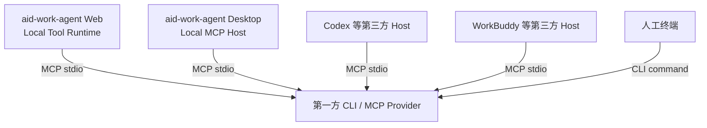

# 第一方 CLI / MCP Provider 架构与开发规范

> 状态：✅ 架构规范已确定
>
> 适用范围：aid-work-agent 以后所有需要被 Agent 调用、可在用户设备或独立节点运行的第一方 CLI
>
> 首个参考实现：[云端 Web Agent 调用本地 BOSS CLI](../design/recruiting/recruiting-cli-agent-integration-design.md)
>
> 关联客户端：[Agent 跨平台桌面客户端设计](desktop-agent-client-design.md)

## 1. 核心决策

第一方 CLI 必须是独立、标准、可分发的 MCP Provider，而不是 aid-work-agent 内部专用脚本。

同一个 Provider 必须能被以下 Host 使用：



因此：

- CLI 业务能力只实现一次；
- aid-work-agent Web、未来 Desktop 和第三方 Agent 只是不同 Host；
- 自有云端通信、租户体系和 UI 不得侵入 Provider 核心；
- 更换 Host 或 transport 不得要求重写第一方 CLI。

## 2. 术语与职责

| 角色 | 职责 | 不负责 |
|---|---|---|
| Provider | 业务 operation、参数校验、实际副作用、结果校验 | 对话、LLM 编排、租户路由 |
| MCP Host | 启停 Provider、工具发现、调用、取消、授权提示 | Provider 内部业务规则 |
| Local Tool Runtime | Web Agent 的本地 Host；连接云端、领取任务、转调 Provider | 重写 CLI 业务 |
| Agent Desktop | 桌面 Host；管理本地 Provider、权限和可视状态 | 把 CLI 代码塞进 renderer |
| 云端 Agent | LLM、子智能体、SERVER/LOCAL 路由、租户/用户权限 | 直接控制用户本机进程 |

## 3. 强制工程分层

每个第一方 CLI 至少遵循：

```text
domain operations           纯业务编排，结构化输入/输出
        ↑            ↑
human CLI adapter    MCP stdio adapter
        ↑            ↑
terminal user        any MCP Host
```

### 3.1 Domain operation

- 不读取 stdin；
- 不调用 `process.exit`；
- 不依赖 console 文本作为结果；
- 接收取消信号和进度 emitter；
- 返回结构化结果与确定的 effect；
- 负责验证真实业务结果，不把“点击已发出”等同于成功。

### 3.2 Human CLI adapter

- 负责 argv 解析、终端提示和退出码；
- 只调用 domain operation；
- 不复制另一套业务流程。

### 3.3 MCP adapter

- 必须提供 `<product> mcp --stdio`；
- 只调用同一 domain operation；
- stdout 只承载 MCP 协议；
- stderr 日志必须脱敏；
- 不定义只对 aid-work-agent 生效的私有 MCP 方法。

## 4. 标准命令面

所有第一方 Provider 必须提供：

```text
<product> mcp --stdio       标准本地 MCP server
<product> doctor            只读环境、依赖、权限与登录态检查
<product> version --json    机器可读版本和 manifest digest
<product> <human-command>   可选的人工调用入口
```

`doctor` 不得产生业务写动作。许可证、依赖或环境不满足时应在 initialize/doctor 阶段 fail-loud，禁止进入写动作中途才拦截。

## 5. Tool contract

### 5.1 命名

- Provider ID：反向域名或组织前缀，例如 `ai.aidwork.boss-recruiting`；
- tool 名：稳定 snake_case，使用清晰业务前缀，例如 `boss_greet`；
- 同一 major 版本不得更名、改变字段语义或收紧已有合法输入；
- 不依赖 Host 自动添加 server namespace 来消除语义歧义。

### 5.2 输入

- 使用 JSON Schema，类型、枚举、范围、默认值和描述完整；
- 禁止 `command/cwd/env/raw_argv/script` 等任意执行参数；
- 文件参数必须使用受控路径/handle 语义，不能默认开放整个文件系统；
- 写动作必须有硬上限，不能只依赖 prompt。

### 5.3 输出

统一结果：

```json
{
  "success": true,
  "code": "OK",
  "message": "面向人的简短结果",
  "effect": "none|applied|partial|unknown",
  "data": {},
  "retryable": false,
  "run_id": "..."
}
```

- 优先返回 MCP structured content，同时提供等价 JSON text 兼容结果；
- 错误必须有稳定 code，不能要求 Host 解析自然语言；
- `unknown` 永不自动重试写动作；
- progress 丢失不影响最终结果完整性。

### 5.4 MCP metadata

- server `instructions` 前 512 字符包含关键前提、工作流、副作用和速率/数量限制；
- 按实际语义标注 read-only/destructive/idempotent/open-world annotations；
- annotations 是 Host 提示，不替代 Provider 自身安全门禁；
- 支持标准 initialize/list_tools/call_tool/progress/cancel；可选能力必须能降级。

## 6. Provider manifest

每个发布包携带只读 manifest：

```json
{
  "provider_id": "ai.aidwork.boss-recruiting",
  "provider_version": "1.0.0",
  "protocol": "mcp",
  "transport": "stdio",
  "platforms": ["win32-x64"],
  "entrypoint": ["boss-recruiting.exe", "mcp", "--stdio"],
  "tools": [],
  "schema_digest": "sha256:...",
  "execution_target": "local_required"
}
```

规则：

- manifest 随签名包发布，运行时不可由云端请求覆盖；
- Host 只取自身批准 catalog 与运行时 capability 的交集；
- 客户端上报的 schema 不直接进入 LLM；
- manifest digest 不一致时禁用整个 Provider并提示升级，不能部分猜测兼容。

## 7. 执行位置与数据边界

平台级执行位置：

- `SERVER`：数据和依赖在云端，例如解析已上传 PDF；
- `LOCAL_REQUIRED`：依赖本地文件、应用、登录态或硬件，例如 BOSS/本地文件；
- `EITHER`：两侧都有正式实现，必须依据数据位置、用户策略和授权显式选择。

Provider manifest 声明执行位置；最终路由由 Host 决定，LLM 不传 `execution_target`。不得因一侧失败而静默把敏感数据或动作切到另一侧。

## 8. aid-work-agent Desktop 的 Host 约束

未来 Desktop 与 Codex/WorkBuddy 一样，是标准本地 MCP Host：

1. Electron main 或其隔离 child Tool Runtime 管理 Provider；renderer 不 spawn 进程。
2. Provider 注册、启停、版本、权限、进度和结果使用统一 Host API。
3. 第一方 Provider 与第三方 Provider 走同一 MCP session/lifecycle；区别只在信任、签名、默认授权和更新来源。
4. Desktop 不导入 BOSS 等 Provider 的 domain 源码，也不调用其内部模块。
5. Desktop 专属 UI 可以展示状态和授权，但不得创造 Desktop-only tool schema。
6. 第一方 CLI 若只能被自有 Desktop 调用，视为架构违规。

Web Agent 使用 Local Tool Runtime 作为 Host；Desktop 未来可内嵌同一 Runtime core。两者 transport 不同，但 Provider 接口相同。

## 9. 安全与生命周期

- Provider 以当前交互用户的最低必要权限运行；
- 凭据进入 OS 安全存储或目标应用自身登录态，不进入 tool result/log；
- 禁止 shell 拼接和远程下发可执行路径；
- 一个受限资源默认单飞，取消采用协作式信号；
- 写动作开始后进程崩溃返回 unknown，不自动重放；
- Host 关闭时先停止新调用，再限时关闭 MCP stdin 和回收子进程；
- 日志记录 tool、规范化参数摘要、run_id、effect、时长和错误码，不记录敏感正文。

## 10. 分发、版本与商业化

- 对外发布提供签名、自包含的目标平台包；不要求用户安装源码或开发运行时；
- Provider、manifest、工具 schema 和 updater 分别版本化；
- major：破坏性 tool contract；minor：向后兼容新增；patch：实现修复；
- 商业授权位于 Provider 外围，不改变标准 MCP；
- 独立产品、自有 Agent 能力包和企业部署使用同一 Provider 二进制；
- 第三方 Host 兼容是发布门禁，不是“社区版”分叉。

## 11. 统一契约测试

项目应维护共享的 Provider conformance suite，至少验证：

1. initialize、list_tools、call_tool、progress、cancel；
2. stdout 零污染和 stderr 脱敏；
3. manifest/schema digest 一致；
4. 参数边界、错误码、effect 和 unknown 不重试；
5. Host 不处理 progress/annotations 时仍可完成；
6. 并发、取消、崩溃、关闭后无孤儿进程；
7. aid-work-agent Local Tool Runtime 直连；
8. aid-work-agent Desktop Host contract test（Desktop 开发时启用）；
9. 至少一个外部 Host 真机 smoke test；对有商业价值的 Provider要求 Codex + 一个国内主流 Host。

## 12. BOSS 参考实现约束

BOSS CLI 是本规范首个 reference provider：

- 只保留 7 个已真机成功的 operation；
- 同时通过自有 Local Tool Runtime、Codex 和 WorkBuddy 调用；
- 任何为自有 Web Agent 增加的功能不得改变 MCP schema；
- 招聘 MVP 完成时必须把可复用 contract tests 抽到共享目录，后续第一方 CLI 从模板起步。

## 13. 禁止事项

- 为每个 Agent 客户端重新写一套 CLI adapter；
- 让 CLI 回调 aid-work-agent 私有业务 API才能工作；
- 解析 stdout 文案判断成功；
- 在 Electron renderer 或网页中直接执行 CLI；
- 由 LLM/用户参数指定 executable、shell、cwd 或 env；
- 第一方和第三方 CLI 使用两套不兼容的 Host 生命周期；
- 以“未来再兼容 MCP”为由先开发私有 invoke 协议。
