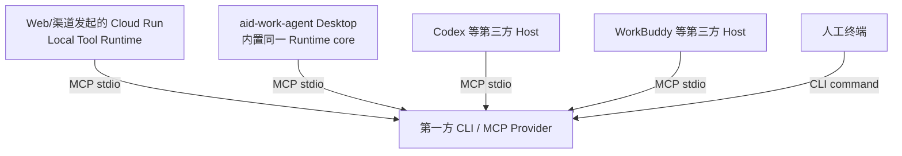

# 第一方 CLI / MCP Provider 架构与开发规范

> 状态：✅ 架构规范已确定
>
> 适用范围：aid-work-agent 以后所有需要被 Agent 调用、可在用户设备或独立节点运行的第一方 CLI
>
> 首个参考实现：[云端 Web Agent 调用本地 BOSS CLI](../design/recruiting/recruiting-cli-agent-integration-design.md)
>
> 第二个落地设计：[weixin-cli 第一方微信操作 CLI / MCP Provider](../design/weixin/weixin-cli-design.md)
>
> 关联架构：[Agent 应用层架构优化设计](agent-application-architecture-design.md)（桌面客户端规划待重写）

> Runtime 按需插件与 UI 落地建议（2026-10-08）：[Runtime 插件宿主设计](runtime-plugin-host-architecture-design.md)及[开发计划](../plans/plan-runtime-plugin-host.md)。复用本规范第 8/10.1 节方向；第三方 skill 本机导入不等于开放第三方云端自动分发，客户端描述仍须经过验证和授权才进入模型。

## 1. 核心决策

第一方 CLI 必须是独立、标准、可分发的 MCP Provider，而不是 aid-work-agent 内部专用脚本。

同一个 Provider 必须能被以下 Host 使用：


```mermaid
flowchart TB
    P["第一方 CLI / MCP Provider"]
    W["Web/渠道发起的 Cloud Run\nLocal Tool Runtime"] -->|"MCP stdio"| P
    D["aid-work-agent Desktop\n内置同一 Runtime core"] -->|"MCP stdio"| P
    C["Codex 等第三方 Host"] -->|"MCP stdio"| P
    B["WorkBuddy 等第三方 Host"] -->|"MCP stdio"| P
    H["人工终端"] -->|"CLI command"| P
```

因此：

- CLI 业务能力只实现一次；
- Web、Desktop 和渠道是云端 Agent 的不同入口；本地执行统一由 Local Tool Runtime Host 完成；
- 自有云端通信、租户体系和 UI 不得侵入 Provider 核心；
- 更换 Host 或 transport 不得要求重写第一方 CLI。

## 2. 术语与职责

| 角色 | 职责 | 不负责 |
|---|---|---|
| Provider | 业务 operation、参数校验、实际副作用、结果校验 | 对话、LLM 编排、租户路由 |
| MCP Host | 启停 Provider、工具发现、调用、取消、授权提示 | Provider 内部业务规则 |
| Local Tool Runtime | Web Agent 的本地 Host；连接云端、领取任务、转调 Provider | 重写 CLI 业务 |
| Agent Desktop | 内置同一 Runtime core，管理执行节点和 Provider 的可视状态 | UI 直调 Provider、建立第二套 Host/业务 Run |
| 云端 Agent | LLM、子智能体、SERVER/LOCAL 路由、租户/用户权限 | 直接控制用户本机进程 |

## 3. 强制工程分层

每个第一方 CLI 至少遵循：

```text
domain operations           纯业务编排，结构化输入/输出
        ↑            ↑
human CLI adapter    MCP stdio adapter
        ↑            ↑
terminal user        any MCP Host
```

### 3.1 Domain operation

- 不读取 stdin；
- 不调用 `process.exit`；
- 不依赖 console 文本作为结果；
- 接收取消信号和进度 emitter；
- 返回结构化结果与确定的 effect；
- 负责验证真实业务结果，不把“点击已发出”等同于成功。

### 3.2 Human CLI adapter

- 负责 argv 解析、终端提示和退出码；
- 只调用 domain operation；
- 不复制另一套业务流程。

### 3.3 MCP adapter

- 必须提供 `<product> mcp --stdio`；
- 只调用同一 domain operation；
- stdout 只承载 MCP 协议；
- stderr 日志必须脱敏；
- 不定义只对 aid-work-agent 生效的私有 MCP 方法。

## 4. 标准命令面

所有第一方 Provider 必须提供：

```text
<product> mcp --stdio       标准本地 MCP server
<product> doctor            只读环境、依赖、权限与登录态检查
<product> version --json    机器可读版本和 manifest digest
<product> <human-command>   可选的人工调用入口
```

`doctor` 不得产生业务写动作。许可证、依赖或环境不满足时应在 initialize/doctor 阶段 fail-loud，禁止进入写动作中途才拦截。

## 5. Tool contract

### 5.1 命名

- Provider ID：反向域名或组织前缀，例如 `ai.aidwork.boss-recruiting`；
- tool 名：稳定 snake_case，使用清晰业务前缀，例如 `boss_greet`；
- 同一 major 版本不得更名、改变字段语义或收紧已有合法输入；
- 不依赖 Host 自动添加 server namespace 来消除语义歧义。

### 5.2 输入

- 使用 JSON Schema，类型、枚举、范围、默认值和描述完整；
- 禁止 `command/cwd/env/raw_argv/script` 等任意执行参数；
- 文件参数必须使用受控路径/handle 语义，不能默认开放整个文件系统；
- 写动作必须有硬上限，不能只依赖 prompt。

### 5.3 输出

统一结果：

```json
{
  "success": true,
  "code": "OK",
  "message": "面向人的简短结果",
  "effect": "none|applied|partial|unknown",
  "data": {},
  "retryable": false,
  "run_id": "..."
}
```

- 优先返回 MCP structured content，同时提供等价 JSON text 兼容结果；
- 错误必须有稳定 code，不能要求 Host 解析自然语言；
- `unknown` 永不自动重试写动作；
- progress 丢失不影响最终结果完整性。

### 5.4 MCP metadata

- server `instructions` 前 512 字符包含关键前提、工作流、副作用和速率/数量限制；
- 按实际语义标注 read-only/destructive/idempotent/open-world annotations；
- annotations 是 Host 提示，不替代 Provider 自身安全门禁；
- 支持标准 initialize/list_tools/call_tool/progress/cancel；可选能力必须能降级。

## 6. Provider runtime manifest 与 package envelope

Provider runtime manifest 描述解包后的业务 Host 契约，不承担下载包身份或签名职责：

```json
{
  "manifest_version": 1,
  "provider_id": "ai.aidwork.boss-recruiting",
  "provider_version": "1.0.0",
  "protocol": "mcp",
  "transport": "stdio",
  "entrypoint": ["boss-recruiting.exe", "mcp", "--stdio"],
  "tools": [],
  "schema_digest": "sha256:...",
  "execution_target": "local_required"
}
```

catalog 中另有不可变 package envelope，描述一次可下载发布：

```json
{
  "envelope_version": 1,
  "provider_release_id": "prvrel_...",
  "provider_id": "ai.aidwork.boss-recruiting",
  "provider_version": "1.0.0",
  "platform": "win32",
  "arch": "x64",
  "package_format": "zip",
  "package_size": 12345678,
  "package_digest": "sha256:...",
  "manifest_digest": "sha256:...",
  "min_runtime_version": "1.0.0",
  "max_runtime_version": null,
  "publisher_key_id": "aid-provider-2026-01",
  "signature_algorithm": "Ed25519",
  "signature": "base64:...",
  "created_at": "2026-09-22T00:00:00Z"
}
```

规则：

- runtime manifest 随签名包发布，运行时不可由云端请求覆盖；entrypoint 必须是包根目录内的相对
  路径，不得含 `..`、绝对路径、shell 或任意环境注入；
- `provider_release_id` 是 package 发布身份，不写入业务 tool contract；同一 release id 一经发布，
  envelope、package digest、manifest digest 和内容全部不可覆盖。修复必须创建新 release id；
- package envelope 使用 RFC 8785 规范化后的无 `signature` 字段内容做Ed25519签名；该内容已含
  package_digest，不另拼接一份未定义的摘要字节。操作系统代码签名不能替代跨平台包签名；
- Runtime 内置平台 trust root/key id allowlist；签名私钥只存在于批准的 release KMS/HSM/离线签名
  边界。轮换使用新旧公钥重叠窗口，紧急撤回进入 catalog denylist 并随 heartbeat/resolve 传播；
- Host 只取自身批准 catalog 与运行时 capability 的交集；
- 客户端上报的 schema 不直接进入 LLM；
- manifest digest 不一致时禁用整个 Provider并提示升级，不能部分猜测兼容。
- 解包前检查 envelope size/format；解包时拒绝绝对路径、`..` 路径穿越、symlink、hardlink、设备文件、
  权限提升位、文件数/单文件/总展开大小/压缩比超限和重复路径。只在完整包验签、digest 与 manifest
  校验、受限目录原子落盘后执行 `version --json`/`doctor`；验证进程仍按最低权限、无业务写权限运行。

## 7. 执行位置与数据边界

平台级执行位置：

- `SERVER`：数据和依赖在云端，例如解析已上传 PDF；
- `LOCAL_REQUIRED`：依赖用户/企业侧设备的文件、应用、登录态或硬件，例如 BOSS/本地文件；“LOCAL”不限定为当前 UI 所在电脑，也可以是已授权的专用电脑或 VM；
- `EITHER`：两侧都有正式实现，必须依据数据位置、用户策略和授权显式选择。

Provider manifest 声明执行位置；最终路由由 aid-work-agent 的服务端策略结合用户选择、设备能力和授权决定，LLM 不传 `execution_target` 或 `device_id`。任务创建后固定执行节点，不得因一侧或一个节点失败而静默把敏感数据或动作切到另一侧/另一节点。

## 8. aid-work-agent Desktop 的 Host 约束

Desktop 安装包内置与独立 `agent-tool-runtime` 相同核心，并通过该 Runtime 充当标准本地 MCP Host：

1. Electron main 管理隔离 child Runtime；Runtime 管理 Provider，renderer 不 spawn 进程。
2. Provider 注册、启停、版本、权限、进度和结果使用统一 Host API。
3. 第一方 Provider 与第三方 Provider 走同一 MCP session/lifecycle；区别只在信任、签名、默认授权和更新来源。
4. Desktop 不导入 BOSS 等 Provider 的 domain 源码，也不调用其内部模块。
5. Desktop 专属 UI 可以展示状态和授权，但不得创造 Desktop-only tool schema。
6. 第一方 CLI 若只能被自有 Desktop 调用，视为架构违规。

Web、Desktop 或渠道发起的任务都由云端 RunService 创建受权 Invocation；Desktop 内置 Runtime 与
独立 `agent-tool-runtime` 使用同一 Device API claim/回传，不建立 Desktop UI→Provider 的本地业务
旁路。Desktop 也必须能通过后台选择另一台运行 Runtime 的授权电脑；两台设备不建立 P2P 私有协议。

Desktop P1 支持同一安装包以完整桌面、仅交互或执行节点模式运行。执行节点模式可以不打开会话 UI，
但仍只处理云端分配的 Invocation，不能变成本地独立 Agent。

## 9. 安全与生命周期

- Provider 以当前交互用户的最低必要权限运行；
- 凭据进入 OS 安全存储或目标应用自身登录态，不进入 tool result/log；
- 禁止 shell 拼接和远程下发可执行路径；
- 一个受限资源默认单飞，取消采用协作式信号；
- 写动作开始后进程崩溃返回 unknown，不自动重放；
- Host 关闭时先停止新调用，再限时关闭 MCP stdin 和回收子进程；
- 日志记录 tool、规范化参数摘要、run_id、effect、时长和错误码，不记录敏感正文。

## 10. 分发、版本与商业化

- 对外发布提供签名、自包含的目标平台包；不要求用户安装源码或开发运行时；
- Provider、manifest、工具 schema 和 updater 分别版本化；
- major：破坏性 tool contract；minor：向后兼容新增；patch：实现修复；
- 商业授权位于 Provider 外围，不改变标准 MCP；
- 独立产品、自有 Agent 能力包和企业部署使用同一 Provider 二进制；
- 第三方 Host 兼容是发布门禁，不是“社区版”分叉。

### 10.1 aid-work-agent 第一方按需交付

- Runtime core 随 Desktop 主安装包交付；BOSS CLI、weixin CLI 等 Provider 使用独立签名包和版本化
  manifest，不要求永久预装进主包；
- 云端 Invocation 只固定 `provider_id`、`provider_release_id` 和 `manifest_digest`。Provider 缺失时，
  Runtime 只从平台受控 catalog 领取短期、单设备、单 release 下载票据；
- Runtime 必须校验发布者签名、SHA-256、平台/架构、最低 Runtime 版本、manifest 和撤回状态，
  通过 staging + 原子切换安装；模型、Renderer 和业务参数不能提供下载 URL、entrypoint 或安装路径；
- 在途调用固定到具体 release，新旧版本可短期并存；升级失败保留旧可用版本，损坏版本进入隔离，
  已发生动作的结果与 outbox 不随包回滚删除；
- P1 自动安装范围仅限平台签名的第一方 Provider。第三方市场、开放上传、第三方信任和审核体系
  另行立项，不得借第一方更新通道提前开放任意代码分发。

最小发布链必须是受权管理用例，而不是开发者直接改 catalog 文件：

```text
reproducible build + tests + SBOM
  → 生成 runtime manifest 与 package envelope
  → 安全扫描/人工或策略审核
  → release signer 对 envelope+digest 签名
  → 上传 immutable object
  → catalog 发布/灰度
  → Runtime resolve/download
  → 必要时停止新下载并紧急撤回
```

catalog 数据与不可变包对象的 owner、存储位置、审核角色、发布审计、撤回 SLA、密钥轮换和灾难恢复
由 Desktop P1 D00 package/signing ADR 冻结。上传成功不等于发布；只有受权 publisher/reviewer 才能
把 release 从 draft 提升为 active。撤回不删除历史审计或已发生 Invocation 的 release 引用。

### 10.2 Runtime首期离线包实施格式

本节为Runtime A2的离线实施约束；10.1的在线catalog/云端release固定仍是后续目标，现有Device claim未携带这些release字段，不以规范描述声称已有实现。

外层`.aidplugin.zip`仅含`envelope.json`与`payload.zip`。envelope使用第6节字段；package_format=zip、package_size为内层payload.zip字节数、package_digest为内层文件原始字节SHA-256，故不把包含签名的外层文件做自引用摘要。签名输入为移除signature后整个envelope的RFC8785 UTF-8字节，signature为`base64:`前缀的签名字节编码；验签公钥仅取Host批准的trust root。外层仍做数量/体积/路径限制，随后验签及核对payload字节，再受限解包。

payload根包含构建机生成的完整`runtime-manifest.json`以及实际运行所需的编译代码、package元数据、node_modules/原生模块、drivers和适用的内部Python/OCR模型等。manifest_digest为完整runtime-manifest.json对象经RFC8785规范化的UTF-8字节SHA-256；provider_id/provider_version须与envelope一致。该完整文件不同于现有CLI静态provider-manifest.json；构建后只读version输出与MCP工具契约需验证一致。schema_digest继续使用各Provider已有契约算法，不在此改写legacy摘要算法；H4设备contract_digest亦不在此冻结。

构建机完成依赖与hook，客户机不运行npm/pip/Git安装、package安装hook或外部下载。Node由H3提供，首期Windows x64/Node22.23.3，包须满足engines/ABI/运行库；内部Python若为支持operation所必需，必须随包交付。搬离仓库且无系统开发工具的端到端验证是A2/A4门禁。

2026-10-09 A2完整manifest发行扩展（Runtime唯一写入，不改变H1管理schema或legacy摘要）：`manifest_version=1`、`display_name`、`description`及`distribution={platform:"win32",arch:"x64",node:{version:"22.23.3",modules_abi:"127"},required_files:[{path,size,sha256}]}`随完整manifest签名。required_files完整列举payload中的普通文件，唯一排除manifest自身；缺失、多余、大小/摘要错误或链接均拒绝。entrypoint固定为包内相对JS入口及`mcp --stdio`，不能提供任意外部可执行路径。只读version核对Provider业务字段与既有schema_digest，不要求CLI输出发行文件清单。开发包Python/OCR版本和下载来源登记于包内asset-provenance及构建资产锁；此证据不能代替正式依赖/许可证/安全发行审核。

trust root须由正式发行配置提供key id、公钥及允许的provider范围；签名私钥留正式签名边界。仓库尚无生产trust root/实包；测试密钥不得进入发行配置。离线只核对内置及已可信取得的撤回数据，不能保证实时撤回，无须为离线首期提前建设catalog服务。

A2/H3信任资产唯一格式：`resources/runtime/trust-roots.json`为`{schemaVersion:1,profile:"production"|"acceptance",roots:[{key_id,public_key,providers,test_only:boolean}]}`，providers仅含命名空间第一方Provider ID，public_key为Ed25519 PEM。test_only必填；正式产品拒绝测试根。固定产品资源`config/runtime-product.json`严格为schemaVersion/productKind/profile，与信任资产profile一致；受管入口按自身资源布局读取，不能从renderer/env/argv指定根或开启测试模式。普通CLI/A1资产无该产品配置时不获得安装能力；已有受管inventory缺批准信任时明确失败，不能让legacy入口复活。Runtime负责根格式与验签，H3负责固定资源构建/身份隔离与消费，不维护第二套格式。

首期运行只保留一个active版本，新调用关闭准入并排空旧执行后原子切换，未ACK/未知事实与旧release恢复引用保留；不要求实现多版本并行管理。启用/就绪、升级去重和旧入口优先级见[Runtime设计第12节](runtime-plugin-host-architecture-design.md#12-第一部分开发前实施决议)。第9节关闭MCP的限时回收只能发生在批准的取消/停止边界并核对实际停止，不能绕过drain或按时间耗尽认定桌面已释放。

## 11. 统一契约测试

项目应维护共享的 Provider conformance suite，至少验证：

1. initialize、list_tools、call_tool、progress、cancel；
2. stdout 零污染和 stderr 脱敏；
3. manifest/schema digest 一致；
4. 参数边界、错误码、effect 和 unknown 不重试；
5. Host 不处理 progress/annotations 时仍可完成；
6. 并发、取消、崩溃、关闭后无孤儿进程；
7. aid-work-agent Local Tool Runtime 直连；
8. aid-work-agent Desktop Host contract test（Desktop 开发时启用）；
9. 至少一个外部 Host 真机 smoke test；对有商业价值的 Provider要求 Codex + 一个国内主流 Host。

## 12. 参考实现约束

### 12.1 BOSS CLI

BOSS CLI 是本规范首个 reference provider：

- 只保留 7 个已真机成功的 operation；
- 同时通过自有 Local Tool Runtime、Codex 和 WorkBuddy 调用；
- 任何为自有 Web Agent 增加的功能不得改变 MCP schema；
- 招聘 MVP 完成时必须把可复用 contract tests 抽到共享目录，后续第一方 CLI 从模板起步。

### 12.2 weixin-cli

`weixin-cli` 是第二个落地实现，用于验证规范能否跨业务复用。它必须直接复用共享 contract tests，
不能从 BOSS CLI 复制出一套仅名称不同的 MCP 生命周期；微信自动化 driver 可以保留平台专属实现，
但 operation、manifest、effect、取消、单飞和 Host 兼容必须遵守本规范。

## 13. 禁止事项

- 为每个 Agent 客户端重新写一套 CLI adapter；
- 让 CLI 回调 aid-work-agent 私有业务 API才能工作；
- 解析 stdout 文案判断成功；
- 在 Electron renderer 或网页中直接执行 CLI；
- 由 LLM/用户参数指定 executable、shell、cwd 或 env；
- 第一方和第三方 CLI 使用两套不兼容的 Host 生命周期；
- 以“未来再兼容 MCP”为由先开发私有 invoke 协议。
