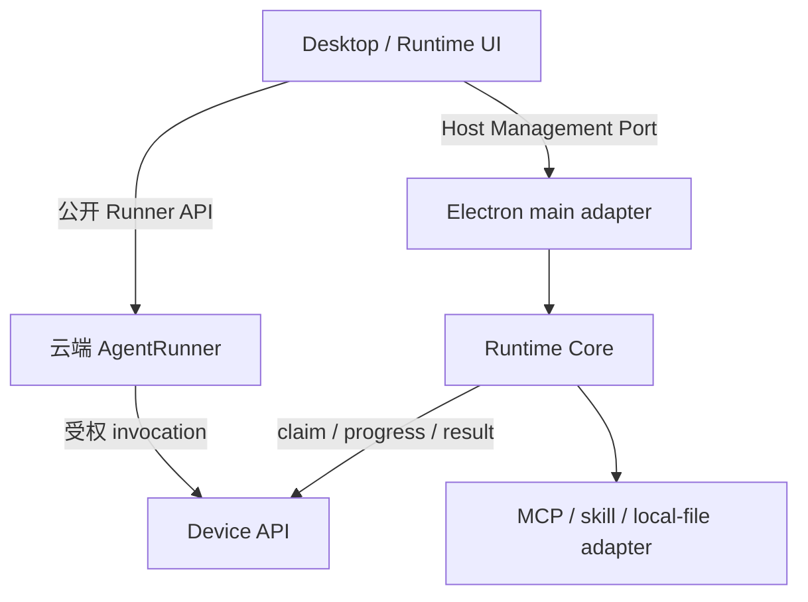

# AgentRunner / Desktop / Runtime 共同集成契约

> 契约 ID：`AID-RUNNER-DESKTOP-RUNTIME`
>
> 版本：`1.1`；日期：2026-10-08
>
> 状态：架构边界约束已建立；现有公开 API 以已核对代码为基线。新增 Host 管理、任务 binding、插件登记的 wire schema 尚未实现，必须按第 8 节先冻结，不得把本文视为接口已上线。
>
> 用户目标：两个会话可分别设计 Desktop 与 Runtime，桌面改版通过适配层接入，不重复开发 Runtime 或 CLI/skill。
>
> Desktop：[设计 v3](desktop-agent-client-design.md)、[开发计划](../plans/plan-desktop-agent-client.md)
>
> Runtime：[插件宿主设计](runtime-plugin-host-architecture-design.md)、[开发计划](../plans/plan-runtime-plugin-host.md)
>
> 上位基线：[已完成 AgentRunner 架构](agent-application-architecture-design.md)、[Provider 规范](first-party-cli-mcp-provider-standard.md)

## 1. 适用范围与约束层级

涉及桌面重设计、Runtime、插件、设备/workspace 授权及相关 Runner 接线的会话，开始工作前必须读取本文与相应设计/计划。该要求同时登记在根 AGENTS.md，不能依赖某个会话的记忆或转述。

系统/会话指令及用户明确要求优先。本文定义两项工程的共同边界；各自设计只细化内部实现，不能单方面改写共同边界。发现当前代码与文档不符，先区分“代码已实现”和“计划扩展”，记录差异，不能用文档假装新 API 已存在，也不能把遗留耦合继续固化为新目标。

本文冻结架构职责和兼容规则，不冻结页面、组件、目录排版或全部技术实现。后续批准的架构调整可以演进，但须带版本、兼容和迁移记录；不承诺未来所有产品变化都零返工。

## 2. 必须稳定的十二项边界

| 编号 | 共同要求 |
|---|---|
| C01 | AgentRunner 是聊天任务、推理、等待/恢复及用量的唯一权威；Desktop/Runtime 不新增本地 Agent loop。 |
| C02 | Desktop 使用主 API 的公开 Runner 网关；Runtime 使用设备 API。客户端不持有内部 Runner service token。 |
| C03 | UI 发起/观察/控制任务；本地业务动作由 Runner 创建受权 invocation，经 Device API 到 Runtime。renderer 和 Host 管理接口不得直接发起插件业务调用。 |
| C04 | 同一 Runtime core 服务 CLI、独立 Runtime 客户端、完整 Agent Desktop；独立 Runtime 客户端复用同一 Electron 工程，是已确认产品形态。 |
| C05 | Runtime core 无 Electron/Vue/页面和具体 BOSS/微信业务依赖；Desktop 不导入 Provider domain 源码。 |
| C06 | 设备 skill 的代码和依赖只在设备安装；云端保存受权手册/必要参考资料、调用契约和不可变摘要。 |
| C07 | MCP CLI 与 skill 共用安装、版本和执行生命周期，调用语义保持不同；普通 SKILL.md 不自动成为可执行任务或授权。 |
| C08 | tenant/user 来自可信认证；执行设备、workspace grant、插件版本来自验证后的绑定。LLM、prompt、自由 request_data 不创造权限。 |
| C09 | 新本地任务固定设备；调用固定 contract/release/digest。换全局 selected、页面、UI 产品或升级不能改变原任务执行位置和代码版本。 |
| C10 | Runner 状态与本机进程状态分别投影；隐藏页面、断开订阅不取消云端任务。退出本机执行进程也不等于副作用已取消。 |
| C11 | 已可能发生写动作的 unknown 不自动重放；ACK 前仅补传原结果。不同 Provider 的 v1/v2 能力按实测登记。 |
| C12 | 修改共同 schema 必须版本化并同时验证生产端/消费端；旧客户机、旧 Web/渠道和已接受任务不能因新版 UI 静默变义。 |

## 3. 三条接口与两个适配层

- **Runner API**：任务提交、查询、观察和控制；不能经其普通 reply 提交伪造的设备结果。
- **Device API**：设备身份、能力、领取与执行事实接纳；只有受信 Host 使用 claim/permit/device token。
- **Host Management Port**：本机配对、安装、启停、状态、workspace grant 管理；不提供 `invokeTool`、任意 shell 或通用文件操作。

Desktop 的 Electron adapter 转换 IPC/凭证/选择器；Runtime 的 platform adapter 提供进程、安全存储、文件和桌面原语。调整 Electron 窗口、路由、IPC transport 或打包细节时，只改变 adapter 与产品组合，不要求 Provider/skill 重写。

现有 `LocalToolHostCore.invoke()` 是预留的内部执行接口，不是 renderer 管理 API；不能把该接口直接暴露来绕过云端 invocation。

### 3.1 已实现的 Runner API 基线

源码依据：`src/api/agent_runner_web.py`、`src/services/agent_runner/{contracts,control_contracts,event_contracts}.py` 和当前 Web client。

| 操作 | 客户端公开入口 |
|---|---|
| 能力 | `GET /api/chat/runners/capabilities` |
| 创建 | `POST /api/chat/runners` |
| 查询 | `GET /api/chat/runners/{runner_id}` |
| 找回会话任务 | `GET /api/chat/sessions/{session_id}/runners` |
| 观察 | `GET /api/chat/runners/{runner_id}/events?after_seq=...` |
| 取消 | `POST /api/chat/runners/{runner_id}/cancel` |
| 控制与结果 | `POST /api/chat/runners/{runner_id}/controls`、对应 GET |

桌面首期沿 `source=chat`、`session.kind=web`，不新造 desktop source/会话表。网关创建字段是 `message/session_id/files/subagent` 等，不是内部 RunnerSubmit 的 `text/session/attachments/profile_id`；两端之间的映射由网关负责。

当前能力响应 `contract_version=1` 是 Runner 公开 API 版本，与本文版本、Electron bridge version、Provider protocol_version 分开。公开 controls 只允许 pause/resume/reply；内部 browser_complete 不开放为普通 Desktop 控制。当前事件是 created/revision_changed/terminal/settlement_changed 等状态通知，不能当原始 token 流。

创建 202 只表示接单；相同请求键绑定不可变意图。事件游标用于补读，snapshot/result 是展示基础。新增 binding 字段尚不在 WebSubmission 中，不能自行塞进 request_data 充当已验证授权。

### 3.2 新 Host 管理接口的最小共同面

下面冻结操作语义，非已有 IPC 方法名；实际 DTO、schema、编码和 IPC channel 由第 8 节第一项产出统一冻结。

| 操作 | 输入与结果的稳定语义 |
|---|---|
| describe | API major、实现版本、支持特性、当前状态 revision；不能把 UI 版本作为 Runtime 协议版本 |
| getState / observe | 当前实例、谁监管它、设备绑定、在线/领取状态、插件就绪摘要；observe 提供取消订阅，断流后可重新查询 |
| pair | 可信 UI 提供服务地址、设备名、一次性码；Host 完成配对并保管 token；响应不含 token |
| start / stop | 管理执行实例；stop 先停止领取并 drain，返回实际停止/等待核对状态；不承诺杀进程等于业务取消 |
| plugins.list | 本机安装、启用、就绪、登记/授权状态；无插件也是合法状态 |
| plugins.import / enable / disable / uninstall | 本机选择器提供受控 selection_ref，返回 operation_id；执行入口与本地授权由 Host 校验 |
| operations.get / observe | 安装、环境检查、停止等管理操作进度；该 operation_id 不冒充 Runner runner_id 或 invocation_id |
| grants.create / revoke / describe | 受信选择器与策略形成 opaque grant_ref；云端授权接线共用同一模型，绝对根路径留本机 |

必须返回机器可判定错误码及可展示消息；凭证、配对码、claim/permit、环境变量和任意设备路径不进入状态投影。UI 展示类型与 wire schema可分离，但必须通过显式 adapter。

安装操作可以是本机管理操作，不必伪造聊天 Run；插件安装成功、云端审批通过、当前设备可执行是不同状态。上述管理 port 不接纳模型直接发来的安装或执行参数。

## 4. 两个会话的责任和文件边界

| 唯一实现责任 | 负责工作流 | 另一侧如何使用 |
|---|---|---|
| Runtime core、CLI薄壳、Device API client、MCP/skill生命周期、插件导入/环境/状态/产物 | Runtime 工作流 | Desktop 经管理 port / Runtime child 使用 |
| 公共 Electron main/preload、安全 IPC 注册、全局 Desktop Shell、构建入口与共享 Node 打包策略 | Desktop 工作流 | Runtime 提交独立模块/port及 Runtime 产品需求，由公共壳接线 |
| 独立 Runtime 管理页面/模块及需求 | Runtime 工作流 | 放入独立 feature 模块；不在共享入口另写一套窗口/凭证/监管实现 |
| 公共 Runner client、桌面对话投影、提交/观察/控制 | Desktop 工作流 | Runtime UI 不复制聊天 client 或模型循环 |
| 固定设备 execution binding 的网关/Runner应用层接线 | Desktop 工作流主导共同边界变更 | Runtime 提供设备验证 adapter；不得另定义第二个 binding |
| 本地目录 grant、文件引用/Provider | Desktop 工作流的文件能力模块 | 接入同一 Runtime adapter registry，不建立第二个 Host；Runtime 提供平台原语 |
| 插件契约登记、授权、skill加载和执行适配 | Runtime 工作流 | 复用上述 binding/grant/Device API，不能另写任务归属和通用审批账本 |

源码建议模块：Runtime core 在 `clients/shared/local-tool-host-core`；公共壳在 `clients/agent-desktop/electron`；Runtime 专属模块在其 `runtime/` 子目录及 `frontend/desktop/features/runtime/`；路径是组织建议，port 才是稳定依赖边界。

开始修改共享入口、binding、Device API公共模型、schema、全局 package/lockfile 前，在两份计划的共同边界登记区指明本批唯一写入者和文件清单。同一批不得双方并行写这些文件；先交模块后接线。登记不是新的提交授权。

上述责任是工程分工，不意味着另一个会话可以向用户声称已协作验收。另一侧尚未读取、实现或验证时，按实际状态记录。

## 5. 任务绑定、资源和版本的共同语义

- **任务 binding**：网关验证设备归属、设备授权和必要 workspace grant后，持久化到原任务意图/ExecutionState，再经 ToolExecutionContext 派发；子执行继承。不能每个步骤重新查全局 selected。
- **旧 selected**：只保留在明确的 legacy路径；新契约拒绝静默回退。纯云端任务不必绑定设备。
- **workspace grant**：可撤销、有 revision 的受权目录引用，不是“知道 grant_id 就授权”。插件状态目录与用户文件 workspace 分开，安装 skill 不自动获得文件 grant。
- **插件选择**：每次 invocation 固定 release和 content/contract digest，不假设一个 runner 只能用一个插件。加载手册与对应调用版本必须一致。
- **资源结果**：本机文件引用、云端 file_id、device artifact_ref 保持有类型的归属；不能互用裸绝对路径。云端 Agent读取本机返回的内容会经过服务端/模型。
- **恢复**：分别检查 Runner attempt/owner、claim/permit、绑定/授权 revision 和本机操作事实。账号改变或旧 owner 失效不能借新身份重传业务意图或执行下一步。

execution_binding、grant与新增审批的精确 DTO 在共享 schema冻结前，双方可以完成内部设计、云端纯聊天、插件本地导入/检查和管理 UI mock。不得分别实现两套 wire协议后再拼接。授权与恢复的共同接口必须先于依赖它的业务代码定稿。

### 5.1 Runtime 作为 Runner 的统一任务执行环境

2026-10-08 用户转交的桌面设计定位与 C01～C12 一致；补充以下语义，不另建调度或授权体系。

Runtime 除插件宿主外，还提供任务执行上下文和文件、进程、应用、产物等能力适配。任务上下文由同一 H2 受信 binding 派生，至少关联原 runner/execution、固定设备、可选 workspace grant及版本、策略引用、取消/执行权和本次 invocation。具体字段由 H2 schema统一冻结，Runtime 不自行定义第二个任务绑定 DTO。

read/edit、受控 command、skill 和软件操作均使用该上下文及相应能力授权；不能 read在客户机而 edit写服务端同名目录，也不能每步重新选设备。云端附件仍有独立 file_id位置语义，不因任务有本地 workspace 而自动变成本机资源。

“同一执行环境”是相同的任务/设备/资源授权语义，不要求每任务启动 VM、每插件共用一个 Python解释器或所有进程使用相同 cwd。插件包目录、任务workspace、可写状态与产物目录用途不同；脚本相对用户文件路径必须通过已验证的 workspace/输入引用解析，不能按插件源码cwd猜测。Plugin adapter可拥有独立venv，但不能借此更换设备或授权主体。

普通本地程序可执行循环、分支、过滤、统计、格式转换和批准的确定性动作链。需要新的模型判断、扩大权限或新的业务决策时，由原 Runner继续；不在 Runtime新建模型循环或把任意代码包装成批准的 batch。

批量能力通过已登记的结构化工具或受信脚本入口提供，先实现 batch search/read和必要本地聚合，完整PTC/任意 execute_code后置。批量中的文件操作仍遵守同一grant和版本检查；部分失败、漏读、截断要返回实际数量和完整性说明。带副作用的批次中断后，不自动从头重跑；只有有证据的动作适配器才可按原操作事实核对。

本次新增语义不代表脚本已有OS隔离：cwd/venv/目录引用不是沙箱。未隔离第三方代码仍可能访问当前用户资源，其运行必须符合明确本机授权和企业策略；要求强隔离的策略不能用一次授权弹窗代替实际隔离。结构化文件能力可约束文件访问，不能据此声称任意Python脚本也已被限制。

### 5.2 审批和计费的边界

Runner/服务端策略保存审批与执行许可权威；Desktop或独立Runtime UI展示批准交互，Host复查执行边界。插件本机安装授权与企业任务审批不同，不分别在两个UI维护相互不认识的业务批准账本；也不能把普通澄清reply转换为许可。

保留云端Runner是为复用企业任务、授权、恢复与账本，不以“本地loop无法计费”为理由。Runtime不另建模型用量账本；必要的执行耗时、资源使用和业务回执由既有服务端计费规则接纳。模型供应商usage仍来自实际模型调用。

性能按领取等待、执行、回传、输出量和模型轮次分别测量；本地batch与脚本优先。后续快路径仅替换通信transport，不改变invocation身份、授权、去重、取消或原结果核对；本版不冻结尚未测量的低延迟承诺。

## 6. 产品生命周期差异由壳配置处理

完整 Desktop 首期保持关闭最后窗口退出；独立 Runtime产品形态关窗口收至托盘。该区别是壳配置，不是两个 Runtime core。

实例明确记录由 Desktop、Runtime App 或 CLI 管理。完整 Desktop 退出/注销仅按其受管实例的策略停止领取、隔离其会话缓存与目录授权；不能自动停掉外置 Runtime App 的独立配对实例。对共享/外置实例的停止须有明确管理操作，不因观察窗口关闭而触发。

同一 runtime home/设备身份只有一个执行实例。遇到已有实例连接受控管理通道或显示冲突，不抢占、覆盖凭证或重新配对。两种产品 app identity/userData 分离，Runtime home及迁移规则共用。安装/更新一个 UI产品不得删除另一产品的设备记录或未 ACK结果。

Provider 的 Node executable、进程监管、凭证后端由平台 adapter注入。Provider 不根据 UI名称判断执行行为，普通 Node core 不 import Electron。windows交互会话是桌面操作前提；无窗口与 Session 0/锁屏操作不能混为一谈。

## 7. 兼容与变更规则

1. 本文小版本允许补充不改变旧语义的要求；移除/改义必须升 major，并在两项设计/计划登记影响与迁移。
2. wire schema采用自己的 api_version/feature协商。仅增加“可选且缺省兼容”的字段也须验证严格解析器是否接受；不能仅凭字段可选就认定兼容。
3. UI改布局、路由和 renderer实现可独立进行；如受控 Node启动或 IPC改变，由 Desktop adapter吸收，Provider和Runtime业务模块不追随改版。
4. wire破坏性变化提供新版本/显式 adapter，保留旧在途调用和恢复数据直到安全排空；不把旧 runner/release静默转换成新版。
5. 不支持的版本/特性返回明确状态；只禁用依赖该能力的功能，云端纯聊天或其他可用插件可继续。权限相关差异不得猜测兼容。
6. 每次共同接口变化必须同时更新 schema、生产/消费fixture及两项计划；未通过兼容门的实现只能留内部，不可宣布已集成。

不要以“另一个会话可能不同意”为理由阻止契约内可独立推进的工作。边界内决定由对应工作流负责；边界变更先形成可审阅差异与迁移方案，必要产品取舍再由用户决定。

## 8. 实现前共同检查点

两份计划共用同一登记项；仅完成本文不代表下列项已完成。

每项实施记录以主导工作流的计划为唯一进度来源，另一计划引用；共同契约记录语义和兼容决议，不复制双方开发日志。

| 检查点 | 唯一主导 | 必须交付的证据 |
|---|---|---|
| H1 管理 port/DTO/错误与事件 | Runtime | 中性 schema/type、producer fixture、consumer fake；Desktop adapter验证；不依赖Electron对象 |
| H2 固定设备 binding/grant/审批 | Desktop | 可信网关与Runner扩展、统一任务执行上下文、Runtime核验模型、缺省legacy兼容；字段进入不可变摘要与恢复链 |
| H3 实例监管与两产品生命周期 | Desktop | 受管/外置实例、Node路径、home/凭证、drain/退出/更新；Runtime conformance验证 |
| H4 插件登记与结果/图片 | Runtime | 受权契约/revision/schema、调用版本、artifact模型接纳；Desktop展示兼容 |

新增中性 wire schema建议落 `contracts/runtime-host/v1/`；在实际实现时再生成/维护类型与fixture。现有 `contracts/desktop-agent/` 属旧 D1，不能仅因名字相似当成新契约继承。测试不只比较 typecheck：必须同时使用真实生产端和真实 adapter检验生命周期与副作用边界。

## 9. 兼容验收矩阵

| 情形 | 共同预期 |
|---|---|
| 新旧 UI适配同一管理 API major | 两边均可读状态，不改变业务 schema |
| UI断订阅/换页/改版 | 已接单云端 runner继续，重连可查询；无重复调用 |
| 新 UI连接外置/旧 CLI Runtime | 不抢占和重配对；明确协商能力或显示需升级 |
| 纯云端桌面会话，无插件 | 仍可正常工作 |
| 安装/升级/停用某插件 | 不替换在途 release；不影响其他插件 |
| selected改变、grant撤销、旧账号/owner | 原任务不得转移；失效执行权不能产生下一动作 |
| 写后崩溃或 ACK丢失 | 保存/核对原事实，只补传结果，不重复业务动作 |
| 未授权客户端伪造管理/设备消息 | 不获得代码执行、跨租户数据或工具结果接纳权限 |
| 新 schema超出支持范围 | 明确拒绝该能力，不静默回退旧 D1、云端执行或任意 shell |
| 本地read/edit/skill访问同名路径 | 使用同一任务环境及受权资源；不得误写服务端目录或按插件cwd猜测用户文件 |
| batch部分失败/输出截断/写后中断 | 返回实际完整性；不能静默跳过，也不能把整个批次从头重跑 |

后续代码开发按项目高风险流程执行，保留独立测试与CodeReview；协议fixture通过不替代最终Windows安装包的真实进程、Provider及结果验收。

## 10. 给新桌面会话的交接文本

> 基于当前已完成的 AgentRunner 重设计尚未开发的桌面能力。开始前读取根 AGENTS.md、`docs/system/runner-desktop-runtime-integration-contract.md`、桌面 v3设计/计划及Runtime插件宿主设计/计划。遵守共同契约v1.1：桌面负责任务工作台与公共Electron适配，Runtime负责统一任务执行环境、设备执行核心和插件生命周期；独立Runtime客户端复用同一工程。先核对C01～C12和H1～H4，不恢复旧本地Agent/D1路线，不复制Runtime，也不单方面定义binding/管理wire协议。可以自由调整页面和交互；共同边界变化须给出版本和兼容方案。只设计未开发内容，已有成果、其他会话改动和旧设备身份保留；未获明确指令不提交或部署。

## 11. 登记记录

| 日期 | 版本 | 内容 | 状态 |
|---|---|---|---|
| 2026-10-08 | 1.0 | 建立职责、接口边界、文件责任与H1～H4共同检查点，登记到双方设计/计划和AGENTS | 文档约束建立；双方实现/契约测试未完成，未向其他会话发送消息 |
| 2026-10-08 | 1.1 | 根据用户转交的桌面定位，补充统一任务执行环境、本地批量计算、审批/计费与性能边界 | 兼容补充；新增wire schema及实现仍待H1～H4冻结，未向其他会话发送消息 |
