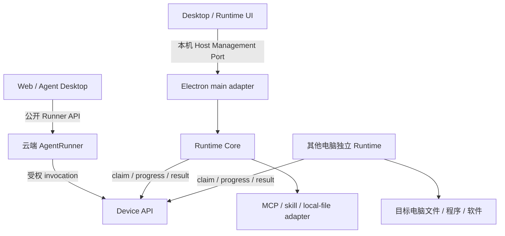

# AgentRunner / Desktop / Runtime 共同集成契约

> 契约 ID：`AID-RUNNER-DESKTOP-RUNTIME`
>
> 版本：`2.0`；日期：2026-10-09
>
> 状态：v2.0按用户逐条复核确定，替代v1.3的插件额外审批语义；候选0.3已有真实Host与Desktop消费验证，Windows隔离验收版已交付，尚未共同登记wire冻结。现有公开API以代码为基线；共享格式见第8.1节，任务binding、授权及资源占用wire仍待主导交付。隔离验收不代表生产发行或真实业务验收通过。
>
> 用户目标：两个会话可分别设计 Desktop 与 Runtime，桌面改版通过适配层接入，不重复开发 Runtime 或 CLI/skill。
>
> Desktop：[设计 v3](desktop-agent-client-design.md)、[开发计划](../plans/plan-desktop-agent-client.md)
>
> Runtime：[插件宿主设计](runtime-plugin-host-architecture-design.md)、[开发计划](../plans/plan-runtime-plugin-host.md)
>
> 上位基线：[已完成 AgentRunner 架构](agent-application-architecture-design.md)、[Provider 规范](first-party-cli-mcp-provider-standard.md)

## 1. 适用范围与约束层级

涉及桌面重设计、Runtime、插件、设备/workspace 授权及相关 Runner 接线的会话，开始工作前必须读取本文与相应设计/计划。该要求同时登记在根 AGENTS.md，不能依赖某个会话的记忆或转述。

系统/会话指令及用户明确要求优先。本文定义两项工程的共同边界；各自设计只细化内部实现，不能单方面改写共同边界。发现当前代码与文档不符，先区分“代码已实现”和“计划扩展”，记录差异，不能用文档假装新 API 已存在，也不能把遗留耦合继续固化为新目标。

本文冻结架构职责和兼容规则，不冻结页面、组件、目录排版或全部技术实现。后续批准的架构调整可以演进，但须带版本、兼容和迁移记录；不承诺未来所有产品变化都零返工。

2026-10-08 定稿结论：Runtime 的 v1.3 补充与 Desktop 的同机/异机设计一致，无需继续增加架构条款。双方以本版本为实施基线，在职责范围内独立推进；内部实现细节和既定检查点的接口产出不要求再次讨论完整架构。后续只有实际改变共同语义或兼容规则时才升级本契约版本，普通审阅、进度登记不升版本。

2026-10-09用户复核决议：安装即本机使用授权，安装成功默认enabled=true，运行条件独立决定ready，不另设插件审批或默认逐次弹窗。账号/配对/设备使用关系、目标workspace及既有任务策略继续复用。允许安装分析调用云端模型：先读SKILL.md，信息不足时才补传必要源码；这不是本地任务Agent loop。日期标为v1.3的记录属于历史基线，冲突处以v2.0及第8.1节当前候选0.3为准。

当前实施范围：第一部分Runtime UI、BOSS/weixin/wecom第一方插件安装管理及必要核心/既有执行兼容已交付隔离验收版，人工与正式发行门见统一Runtime计划。第三方skill安装、AI分析、动态登记/执行为第二部分，契约/schema/fixture保留，暂不开发。当前以候选0.3为格式入口，不因文档收敛改变C01～C12、schema或版本；第一部分不能把保留的skill格式展示为已支持能力。公共壳/H2/H3职责保持。

## 2. 必须稳定的十二项边界

| 编号 | 共同要求 |
|---|---|
| C01 | AgentRunner 是聊天任务、推理、等待/恢复及用量的唯一权威；Desktop/Runtime 不新增本地 Agent loop。 |
| C02 | Desktop 使用主 API 的公开 Runner 网关；Runtime 使用设备 API。客户端不持有内部 Runner service token。 |
| C03 | UI 发起/观察/控制任务；本地业务动作由 Runner 创建受权 invocation，经 Device API 到 Runtime。renderer 和 Host 管理接口不得直接发起插件业务调用。 |
| C04 | 同一 Runtime core 服务 CLI、独立 Runtime 客户端、完整 Agent Desktop；独立 Runtime 客户端复用同一 Electron 工程，是已确认产品形态。 |
| C05 | Runtime core 无 Electron/Vue/页面和具体 BOSS/微信业务依赖；Desktop 不导入 Provider domain 源码。 |
| C06 | 设备skill代码和依赖只在设备安装；云端保存原始手册/必要参考资料、能力入口/代码地图及摘要。安装分析先读手册，必要源码允许发给云端模型，不要求服务端部署代码。 |
| C07 | MCP CLI与skill共用安装、版本和执行生命周期，调用语义不同；用户安装即授权使用，安装成功默认enabled=true，运行条件独立决定ready，无额外插件审批。SKILL.md本身不等于脚本入口，手册型skill不虚构入口。 |
| C08 | tenant/user 来自可信认证；执行设备、workspace grant、插件版本来自验证后的绑定。LLM、prompt、自由 request_data 不创造权限。 |
| C09 | 新本地任务固定设备；调用固定 contract/release/digest。换全局 selected、页面、UI 产品或升级不能改变原任务执行位置和代码版本。 |
| C10 | Runner 状态与本机进程状态分别投影；隐藏页面、断开订阅不取消云端任务。退出本机执行进程也不等于副作用已取消。 |
| C11 | 已可能发生写动作的 unknown 不自动重放；ACK 前仅补传原结果。不同 Provider 的 v1/v2 能力按实测登记。 |
| C12 | 修改共同 schema 必须版本化并同时验证生产端/消费端；旧客户机、旧 Web/渠道和已接受任务不能因新版 UI 静默变义。 |

## 3. 三条接口与两个适配层

- **Runner API**：任务提交、查询、观察和控制；不能经其普通 reply 提交伪造的设备结果。
- **Device API**：设备身份、能力、领取与执行事实接纳；只有受信 Host 使用 claim/permit/device token。
- **Host Management Port**：本机配对、安装、启停、状态、workspace grant 管理；不提供 `invokeTool`、任意 shell 或通用文件操作。

Desktop 的 Electron adapter 转换 IPC/凭证/选择器；Runtime 的 platform adapter 提供进程、安全存储、文件和桌面原语。调整 Electron 窗口、路由、IPC transport 或打包细节时，只改变 adapter 与产品组合，不要求 Provider/skill 重写。

现有 `LocalToolHostCore.invoke()` 是预留的内部执行接口，不是 renderer 管理 API；不能把该接口直接暴露来绕过云端 invocation。

### 3.1 已实现的 Runner API 基线

源码依据：`src/api/agent_runner_web.py`、`src/services/agent_runner/{contracts,control_contracts,event_contracts}.py` 和当前 Web client。

| 操作 | 客户端公开入口 |
|---|---|
| 能力 | `GET /api/chat/runners/capabilities` |
| 创建 | `POST /api/chat/runners` |
| 查询 | `GET /api/chat/runners/{runner_id}` |
| 找回会话任务 | `GET /api/chat/sessions/{session_id}/runners` |
| 观察 | `GET /api/chat/runners/{runner_id}/events?after_seq=...` |
| 取消 | `POST /api/chat/runners/{runner_id}/cancel` |
| 控制与结果 | `POST /api/chat/runners/{runner_id}/controls`、对应 GET |

桌面首期沿 `source=chat`、`session.kind=web`，不新造 desktop source/会话表。网关创建字段是 `message/session_id/files/subagent` 等，不是内部 RunnerSubmit 的 `text/session/attachments/profile_id`；两端之间的映射由网关负责。

当前能力响应 `contract_version=1` 是 Runner 公开 API 版本，与本文版本、Electron bridge version、Provider protocol_version 分开。公开 controls 只允许 pause/resume/reply；内部 browser_complete 不开放为普通 Desktop 控制。当前事件是 created/revision_changed/terminal/settlement_changed 等状态通知，不能当原始 token 流。

创建 202 只表示接单；相同请求键绑定不可变意图。事件游标用于补读，snapshot/result 是展示基础。新增 binding 字段尚不在 WebSubmission 中，不能自行塞进 request_data 充当已验证授权。

### 3.2 新 Host 管理接口的最小共同面

下面冻结操作语义，非已有 IPC 方法名；实际 DTO、schema、编码和 IPC channel 由第 8 节第一项产出统一冻结。

| 操作 | 输入与结果的稳定语义 |
|---|---|
| describe | API major、实现版本、支持特性、当前状态 revision；不能把 UI 版本作为 Runtime 协议版本 |
| getState / observe | 当前实例、谁监管它、设备绑定、在线/领取状态、插件就绪摘要；observe 提供取消订阅，断流后可重新查询 |
| pair | 可信 UI 提供服务地址、设备名、一次性码；Host 完成配对并保管 token；响应不含 token |
| start / stop | 管理执行实例；stop 先停止领取并 drain，返回实际停止/等待核对状态；不承诺杀进程等于业务取消 |
| plugins.list | 本机安装、启用、就绪及诊断；无插件也是合法状态 |
| plugins.import / enable / disable / uninstall | 本机选择器提供受控 selection_ref，返回 operation_id；执行入口与本地授权由 Host 校验 |
| operations.get / observe | 安装、环境检查、停止等管理操作进度；该 operation_id 不冒充 Runner runner_id 或 invocation_id |
| grants.create / revoke / describe | 受信选择器与策略形成 opaque grant_ref；云端授权接线共用同一模型，绝对根路径留本机 |

必须返回机器可判定错误码及可展示消息；凭证、配对码、claim/permit、环境变量和任意设备路径不进入状态投影。UI 展示类型与 wire schema可分离，但必须通过显式 adapter。

安装操作可以是本机管理操作，不必伪造聊天 Run；用户选择安装即本机授权；安装成功默认启用，依赖/配置决定ready。云端登记校验身份、格式和版本，不增加插件批准关口；上报失败应保留同步诊断，不能伪装已对云端可见。上述管理 port 不接纳模型直接发来的安装或执行参数。

## 4. 两个会话的责任和文件边界

| 唯一实现责任 | 负责工作流 | 另一侧如何使用 |
|---|---|---|
| Runtime core、CLI薄壳、Device API client、MCP/skill生命周期、插件导入/环境/状态/产物 | Runtime 工作流 | Desktop 经管理 port / Runtime child 使用 |
| 公共 Electron main/preload、安全 IPC 注册、全局 Desktop Shell、构建入口与共享 Node 打包策略 | Desktop 工作流 | Runtime 提交独立模块/port及 Runtime 产品需求，由公共壳接线 |
| 独立 Runtime 管理页面/模块及需求 | Runtime 工作流 | 放入独立 feature 模块；不在共享入口另写一套窗口/凭证/监管实现 |
| 公共 Runner client、桌面对话投影、提交/观察/控制 | Desktop 工作流 | Runtime UI 不复制聊天 client 或模型循环 |
| 固定设备 execution binding 的网关/Runner应用层接线 | Desktop 工作流主导共同边界变更 | Runtime 提供设备验证 adapter；不得另定义第二个 binding |
| 本地目录 grant、文件引用/Provider | Desktop 工作流的文件能力模块 | 接入同一 Runtime adapter registry，不建立第二个 Host；Runtime 提供平台原语 |
| 插件契约登记、安装状态、skill加载和执行适配 | Runtime 工作流 | 复用上述 binding/grant/Device API，不能另写任务归属和通用审批账本 |

源码建议模块：Runtime core 在 `clients/shared/local-tool-host-core`；公共壳在 `clients/agent-desktop/electron`；Runtime 专属模块在其 `runtime/` 子目录及 `frontend/desktop/features/runtime/`；路径是组织建议，port 才是稳定依赖边界。

开始修改共享入口、binding、Device API公共模型、schema、全局 package/lockfile 前，在两份计划的共同边界登记区指明本批唯一写入者和文件清单。同一批不得双方并行写这些文件；先交模块后接线。登记不是新的提交授权。

上述责任是工程分工，不意味着另一个会话可以向用户声称已协作验收。另一侧尚未读取、实现或验证时，按实际状态记录。

## 5. 任务绑定、资源和版本的共同语义

- **任务 binding**：网关验证设备归属、设备授权和必要 workspace grant后，持久化到原任务意图/ExecutionState，再经 ToolExecutionContext 派发；子执行继承。不能每个步骤重新查全局 selected。
- **旧 selected**：只保留在明确的 legacy路径；新契约拒绝静默回退。纯云端任务不必绑定设备。
- **workspace grant**：可撤销、有 revision 的受权目录引用，不是“知道 grant_id 就授权”。插件状态目录与用户文件 workspace 分开，安装 skill 不自动获得文件 grant。
- **插件选择**：每次 invocation 固定 release和 content/contract digest，不假设一个 runner 只能用一个插件。加载手册与对应调用版本必须一致。
- **资源结果**：本机文件引用、云端 file_id、device artifact_ref 保持有类型的归属；不能互用裸绝对路径。云端 Agent读取本机返回的内容会经过服务端/模型。
- **恢复**：分别检查 Runner attempt/owner、claim/permit、绑定/授权 revision 和本机操作事实。账号改变或旧 owner 失效不能借新身份重传业务意图或执行下一步。

execution_binding、grant与新增审批的精确 DTO 在共享 schema冻结前，双方可以完成内部设计、云端纯聊天、插件本地导入/检查和管理 UI mock。不得分别实现两套 wire协议后再拼接。授权与恢复的共同接口必须先于依赖它的业务代码定稿。

### 5.1 Runtime 作为 Runner 的统一任务执行环境

2026-10-08 用户转交的桌面设计定位与 C01～C12 一致；补充以下语义，不另建调度或授权体系。

Runtime 除插件宿主外，还提供任务执行上下文和文件、进程、应用、产物等能力适配。任务上下文由同一 H2 受信 binding 派生，至少关联原 runner/execution、固定设备、可选 workspace grant及版本、策略引用、取消/执行权和本次 invocation。具体字段由 H2 schema统一冻结，Runtime 不自行定义第二个任务绑定 DTO。

read/edit、受控 command、skill 和软件操作均使用该上下文及相应能力授权；不能 read在客户机而 edit写服务端同名目录，也不能每步重新选设备。云端附件仍有独立 file_id位置语义，不因任务有本地 workspace 而自动变成本机资源。

“同一执行环境”是相同的任务/设备/资源授权语义，不要求每任务启动 VM、每插件共用一个 Python解释器或所有进程使用相同 cwd。插件包目录、任务workspace、可写状态与产物目录用途不同；脚本相对用户文件路径必须通过已验证的 workspace/输入引用解析，不能按插件源码cwd猜测。Plugin adapter可拥有独立venv，但不能借此更换设备或授权主体。

普通本地程序可执行循环、分支、过滤、统计、格式转换和批准的确定性动作链。需要新的模型判断、扩大权限或新的业务决策时，由原 Runner继续；不在 Runtime新建模型循环或把任意代码包装成批准的 batch。

批量能力通过已登记的结构化工具或受信脚本入口提供，先实现 batch search/read和必要本地聚合，完整PTC/任意 execute_code后置。批量中的文件操作仍遵守同一grant和版本检查；部分失败、漏读、截断要返回实际数量和完整性说明。带副作用的批次中断后，不自动从头重跑；只有有证据的动作适配器才可按原操作事实核对。

本次新增语义不代表脚本已有OS隔离：cwd/venv/目录引用不是沙箱。未隔离第三方代码仍可能访问当前用户资源，其运行必须符合明确本机授权和企业策略；要求强隔离的策略不能用一次授权弹窗代替实际隔离。结构化文件能力可约束文件访问，不能据此声称任意Python脚本也已被限制。

### 5.2 审批和计费的边界

Runner/服务端策略保存审批与执行许可权威；Desktop或独立Runtime UI展示批准交互，Host复查执行边界。安装即插件使用授权，不新增插件审批或默认逐次调用弹窗；身份/设备/workspace和确有既有策略要求的任务许可继续共用原体系，不分别建业务批准账本，也不能把普通澄清reply转换为许可。

保留云端Runner是为复用企业任务、授权、恢复与账本，不以“本地loop无法计费”为理由。Runtime不另建模型用量账本；必要的执行耗时、资源使用和业务回执由既有服务端计费规则接纳。模型供应商usage仍来自实际模型调用。

性能按领取等待、执行、回传、输出量和模型轮次分别测量；本地batch与脚本优先。后续快路径仅替换通信transport，不改变invocation身份、授权、去重、取消或原结果核对；本版不冻结尚未测量的低延迟承诺。

### 5.3 操作入口与执行电脑分离

用户已确认两种部署形态：Runtime 与完整 Desktop 同机，作为该电脑的执行入口；Runtime 独立安装在另一台电脑，由 Web 或 Desktop 经云端 Runner 调度。后者适用于特定网络、特定软件以及 BOSS 等长期占用交互桌面的专用电脑。两种形态共用执行核心和 Device API，不因入口位置新增一套 Runner。

| 操作入口 | 固定执行设备 | 共同语义 |
|---|---|---|
| Desktop A | A 上受管 Runtime | Main 可管理本机实例及选择本机目录；业务调用仍经 Runner |
| Desktop A | B 上独立 Runtime | A 不必启用自己的 Runtime；任务的文件、命令、软件与网络访问发生在 B |
| Web | A 或 B 上已配对 Runtime | 浏览器不安装执行核心；通过可信网关选择有权使用的设备 |

目标设备选择、可用能力及忙碌状态通过用户认证的服务端设备接口查询；Host Management Port 仅管理同机实例，不直接暴露为网络远程管理接口，也不把 B 的设备 token 发给 A。具体列表/选择 DTO 与现有接口适配由 H2 冻结。Web 与 Desktop 使用同一 binding 校验，不能让 Web 继续依赖全局 selected 来实现新任务语义。

每个新设备任务在接单时固定目标设备；界面展示执行设备、连接/忙碌状态及资源归属。本轮不扩展为一个任务随意跨多台电脑，后续如需多设备编排另行版本化。目标离线、缺少软件或特定网络不可用时返回等待/失败事实，不迁移到入口电脑或云端。

设备列表、心跳和忙碌投影是选择提示，不是执行许可或预留成功。实际执行前仍由服务端核验授权、Runtime核验能力和资源占用；列表查询后状态改变时返回原设备的等待/拒绝事实，不借“自动选择可用设备”改变已固定任务。

### 5.4 目标设备目录、网络与产物

Desktop A 的本机目录选择器只能建立 A 的 grant，不能据同名路径生成 B 的授权。远端文件任务使用 B 的 Runtime 本机建立、经服务端验证且允许当前用户/Agent 使用的 grant；新建远端 grant 由 B 的受信管理交互完成，首期可预先在 B 配置。Web/远端 Desktop 选择可用 grant 的引用，不获得任意枚举 B 文件系统的权限。

文件引用和产物始终携带固定设备归属。A 的 Main 本机打开接口拒绝 B 的文件引用；查看 B 的产物需经受权内容/产物接口，下载到 A 是显式复制操作，不改变原文件的位置和授权。云端附件继续沿自身 file_id 语义，不能将 B 的裸路径交给 A 或服务端解析。

Runtime 执行的请求使用目标电脑的实际网络、软件安装和登录态；拥有特定网络并不自动授权所有网络资源。网络和凭证能力按策略校验，状态只投影可用性和必要诊断。此契约不增加通用代理、网络隧道或把 B 的网络/凭证复制到 A。

### 5.5 专用电脑、长时间执行与资源独占

独立 Runtime 在其配置的生命周期内持续领取/执行，Web 关页或 Desktop A 退出、注销不停止 B 的执行实例，也不取消已接受任务；显式撤权、取消、租约失效仍按原权威和核对链处理。目标电脑休眠、锁屏、断网和退出 Runtime 分别报告实际状态，无窗口运行不保证 GUI 在锁屏时可操作。

设备在线、Runtime 单实例和桌面资源独占是不同状态。同一电脑交互桌面的锁覆盖全部插件、CLI 与后台观察；纯文件/计算不机械占用桌面锁。Runtime 负责实际资源仲裁，服务端/入口展示等待、占用与阻断，不创建第二套业务调度器，也不凭远端 UI 状态强行解锁。

BOSS 等跨多次 invocation 的连续 GUI 流程若需保持桌面独占，不能假定已有单次 invocation 锁已经满足。H2 与 H4 实施前统一资源范围、原任务 owner、占用期限/续租、跨调用保留及释放/失联核对语义，并验证全部竞争入口。确定性程序可在一次已授权执行内持续持锁；模型思考或等待期间是否保留桌面，必须由流程契约明确，不默认永久锁整台电脑。未知副作用核对与资源占用分别处理，不能无限占锁或自动重放。

现状证据：`clients/agent-tool-runtime/src/desktopLock.ts` 的 `withDesktopLock(fn)` 在回调结束后释放锁，`invocationRunner.ts` 在单次Provider调用外持锁；其锁按本机用户/交互会话派生，不依赖云端device_id。这证明已有同桌面单调用仲裁，不证明跨调用独占已实现。

长任务按其实际支持的协议复用 progress、取消、claim/permit、journal/outbox 与续期机制，记录当前机制不能覆盖的超时/占用边界；不把旧skill v1视为具备完整v2恢复能力。新增字段、状态及超时规则先经 H2/H4 schema 冻结和兼容验证，再承诺长时间无人值守能力。

实施前还须冻结以下四项，均为上文边界的细化，不增加另一套业务调度器：

1. **资源需求来自Host核验登记的契约**。是否操作桌面、是否跨调用保留独占，由登记的工具/流程契约声明并在执行时核验，不能由LLM参数或脚本自报“只读/纯计算”解除锁。未知第三方脚本保留保守桌面占用；经明确核验的文件/计算能力才可免占桌面，不增加插件批准步骤。当前调用链统一持桌面锁，按资源分类并发属于待实现扩展。
2. **占用过期不等于进程停止**。跨调用占用记录关联原任务、执行owner和可核验的占用代次；旧owner不能续租、释放或借重启沿用新的占用。取消、超时、失联、Host崩溃后，确认原进程及相关后台动作停止才能将物理资源交给下一任务；不能仅凭云端租约到期或锁句柄消失认定桌面安全。无法确认时明确阻断冲突调用并进入核对，展示原因和受信本机处置入口。业务effect仍可为unknown，不能因释放资源就将其改成none或重放；反之，已确认动作停止后也不因业务结果unknown永久持锁。
3. **断网执行必须有可验证的许可边界**。只有协议与本机监管明确支持、且仍在有效许可内的已批准确定性执行才可推进；不得凭缓存授权新领任务、新建写动作许可或无限续租。要求在线复查的动作在断网时不得开始；本机撤权/停止及许可到期按预定停止策略处理，确认不了停止则按上一项阻断。云端撤权在离线设备上不能承诺即时生效，H2必须明确许可期限与失联策略，策略不允许离线继续时不得启用该能力。恢复联网仅核对和补传原事实。
4. **调用超时、占用期限与流程期限分开**。progress不自动延长执行许可或超时，资源续租也不自动延长脚本运行时间。当前skill默认900秒、硬上限1800秒，不因采用独立Runtime就获得无限时长。超长流程优先由原Runner按受权调用分段推进，跨调用占用不等于跨调用授权；确需扩大单次时限时先冻结监管、取消及兼容规则，不能用重复启动脚本规避限制。

## 6. 产品生命周期差异由壳配置处理

完整 Desktop 首期保持关闭最后窗口退出；独立 Runtime产品形态关窗口收至托盘。该区别是壳配置，不是两个 Runtime core。

实例明确记录由 Desktop、Runtime App 或 CLI 管理。完整 Desktop 退出/注销仅按其受管实例的策略停止领取、隔离其会话缓存与目录授权；不能自动停掉外置 Runtime App 的独立配对实例。对共享/外置实例的停止须有明确管理操作，不因观察窗口关闭而触发。

同一 runtime home/设备身份只有一个执行实例。遇到已有实例连接受控管理通道或显示冲突，不抢占、覆盖凭证或重新配对。两种产品 app identity/userData 分离，Runtime home及迁移规则共用。安装/更新一个 UI产品不得删除另一产品的设备记录或未 ACK结果。

Provider 的 Node executable、进程监管、凭证后端由平台 adapter注入。Provider 不根据 UI名称判断执行行为，普通 Node core 不 import Electron。windows交互会话是桌面操作前提；无窗口与 Session 0/锁屏操作不能混为一谈。

## 7. 兼容与变更规则

1. 本文小版本允许补充不改变旧语义的要求；移除/改义必须升 major，并在两项设计/计划登记影响与迁移。
2. wire schema采用自己的 api_version/feature协商。仅增加“可选且缺省兼容”的字段也须验证严格解析器是否接受；不能仅凭字段可选就认定兼容。
3. UI改布局、路由和 renderer实现可独立进行；如受控 Node启动或 IPC改变，由 Desktop adapter吸收，Provider和Runtime业务模块不追随改版。
4. wire破坏性变化提供新版本/显式 adapter，保留旧在途调用和恢复数据直到安全排空；不把旧 runner/release静默转换成新版。
5. 不支持的版本/特性返回明确状态；只禁用依赖该能力的功能，云端纯聊天或其他可用插件可继续。权限相关差异不得猜测兼容。
6. 每次共同接口变化必须同时更新 schema、生产/消费fixture及两项计划；未通过兼容门的实现只能留内部，不可宣布已集成。

不要以“另一个会话可能不同意”为理由阻止契约内可独立推进的工作。边界内决定由对应工作流负责；边界变更先形成可审阅差异与迁移方案，必要产品取舍再由用户决定。

## 8. 实现前共同检查点

两份计划共用同一登记项；仅完成本文不代表下列项已完成。

每项实施记录以主导工作流的计划为唯一进度来源，另一计划引用；共同契约记录语义和兼容决议，不复制双方开发日志。

| 检查点 | 唯一主导 | 必须交付的证据 |
|---|---|---|
| H1 管理 port/DTO/错误与事件 | Runtime | 中性 schema/type、producer fixture、consumer fake；Desktop adapter验证；不依赖Electron对象 |
| H2 固定设备 binding/grant/审批 | Desktop | Web/Desktop共用目标设备与grant选择、可信网关与Runner扩展、Runtime核验；身份进入不可变摘要与恢复链；与H4统一长流程资源占用语义 |
| H3 实例监管与两产品生命周期 | Desktop | 受管/外置实例、Node路径、home/凭证、drain/退出/更新；Runtime conformance验证 |
| H4 插件登记与结果/图片 | Runtime | 受权契约/revision/schema、调用版本、设备归属artifact；提供长流程资源需求与真实仲裁证据，Desktop展示兼容 |

新增中性 wire schema建议落 `contracts/runtime-host/v1/`；在实际实现时再生成/维护类型与fixture。现有 `contracts/desktop-agent/` 属旧 D1，不能仅因名字相似当成新契约继承。测试不只比较 typecheck：必须同时使用真实生产端和真实 adapter检验生命周期与副作用边界。

架构定稿与 wire 冻结分别登记。每批接口至少明确请求/响应字段及单位、必填/缺省规则、错误码与状态、版本/能力协商、可信身份与幂等摘要、许可/超时/撤权/恢复时序，并交付生产和消费样例。接口可以先冻结 schema 再实现，但不能以本文定稿声称上述字段已经确定；样例验证也不冒充真实端到端验收。按 H1～H4 的唯一主导分批交付，不要求所有后续能力同时完成才能开发已有公开 Runner 对话或不依赖新增协议的内部模块。

### 8.1 Runtime schema / fixture 交付（候选0.3）

2026-10-09，Runtime依据用户复核更新[共享入口与消费说明](../../contracts/runtime-host/v1/README.md)。Desktop后续接线前读取该入口，不再按设计草案自行另写同名DTO。

开发前细化候选0.3：plugins.list成功result改为{instance_id, revision, plugins}，插件项可选真实version仅用于展示；旧数组需显式迁移，列表与Host状态共用revision水位及实例/旧连接隔离。0.2尚未冻结上线，本批在同目录替代，api_major/schema_version仍为1，架构v2.0及H2/Device协议不变。七项内部实施决议见[Runtime设计第12节](runtime-plugin-host-architecture-design.md#12-第一部分开发前实施决议)；H3设计输入由[Desktop第13节](desktop-agent-client-design.md#13-h3-首期设计输入runtime-ui与第一方cli)维护，设计交付不代表真实接线。候选0.2历史审阅保留，Desktop须重新消费0.3后登记结论。

- H1：[管理请求](../../contracts/runtime-host/v1/schemas/management-request.schema.json)、[响应](../../contracts/runtime-host/v1/schemas/management-response.schema.json)、[状态](../../contracts/runtime-host/v1/schemas/host-state.schema.json)、[通知](../../contracts/runtime-host/v1/schemas/host-event.schema.json)，配套[管理fixture](../../contracts/runtime-host/v1/fixtures/management.json)。
- H4首批内容：[插件契约](../../contracts/runtime-host/v1/schemas/plugin-contract.schema.json)、[安装清单](../../contracts/runtime-host/v1/schemas/plugin-inventory.schema.json)、[输出内容](../../contracts/runtime-host/v1/schemas/tool-output.schema.json)，配套插件、截图/unknown/截断及拒绝fixture。
- 可运行验证：目录内`scripts/check.py`和`tests/consumer.test.mjs`；消费fake仅供Desktop编写真实adapter参考，不是已接线的客户端。

这批有意保持最小格式，不定义H2 binding/grant/claim/许可/长占用，不替代现有Device结果与ACK，不引入另一套模型循环、事件账本或类型生成框架。沿用候选0.2的固定request_id/method/code/error/result；code为非负整数，0且error为空表示请求成功，失败code非零/error非空/result为null。管理operation也固定code/error，查询成功与operation失败分开。工具内容不带success，effect/complete独立保留。plugins.list无registration审批字段；skill有entry.description、可选output_schema及code_map（包内相对path/description），手册型允许空entries/code_map。

候选0.1/0.2未上线或冻结，当前由0.3替代；目录v1、api_major/schema_version=1保持，不能把架构2.0当成API major。旧候选回复需显式迁移/重新验证，严格schema拒绝旧形状；已有生产Device协议不改。首期签名规范化、真实Host/Desktop管理接线、进程监管及隔离验收包已有实现证据，但共同wire尚未登记冻结，H2/H4新登记与产物链仍未完成。当前实现及限制统一见[Runtime架构](runtime-plugin-host-architecture-design.md)和[Runtime计划](../plans/plan-runtime-plugin-host.md)，不沿用历史候选的待开发状态。

## 9. 兼容验收矩阵

| 情形 | 共同预期 |
|---|---|
| 新旧 UI适配同一管理 API major | 两边均可读状态，不改变业务 schema |
| UI断订阅/换页/改版 | 已接单云端 runner继续，重连可查询；无重复调用 |
| 新 UI连接外置/旧 CLI Runtime | 不抢占和重配对；明确协商能力或显示需升级 |
| 纯云端桌面会话，无插件 | 仍可正常工作 |
| 安装/升级/停用某插件 | 不替换在途 release；不影响其他插件 |
| selected改变、grant撤销、旧账号/owner | 原任务不得转移；失效执行权不能产生下一动作 |
| 写后崩溃或 ACK丢失 | 保存/核对原事实，只补传结果，不重复业务动作 |
| 未授权客户端伪造管理/设备消息 | 不获得代码执行、跨租户数据或工具结果接纳权限 |
| 新 schema超出支持范围 | 明确拒绝该能力，不静默回退旧 D1、云端执行或任意 shell |
| 本地read/edit/skill访问同名路径 | 使用同一任务环境及受权资源；不得误写服务端目录或按插件cwd猜测用户文件 |
| batch部分失败/输出截断/写后中断 | 返回实际完整性；不能静默跳过，也不能把整个批次从头重跑 |
| Desktop A / Web选择B，无A本机Runtime | 同一受权任务可在B执行；软件、文件和网络均以B为目标 |
| A选择本机目录，或打开B文件引用 | 不能建立B的grant或在A解析B路径；远端产物经受权接口显式查看/下载 |
| A退出/注销、Web关页，B仍在执行 | B不因观察入口生命周期而停止；显式撤权/取消仍按原任务规则处理 |
| BOSS长流程与其他插件/后台观察竞争 | 按声明的独占范围等待或拒绝；跨调用锁、续期及崩溃释放有实际证据 |
| 占用到期/Host崩溃，旧脚本或后台动作仍在运行 | 冲突调用保持阻断；旧owner不能操作新占用；确认停止后释放资源，业务unknown仍不重放 |
| 自报纯计算、心跳显示空闲或progress持续更新 | 不创造免锁/执行许可，不自动延长调用超时或占用期限 |
| 执行中断网、许可到期或本机撤权 | 按已冻结许可与停止策略处理；不新领或新批写动作，不能确认停止时阻断资源交接 |
| B锁屏/休眠/断网/特定网络失效 | 报告阻断或未知事实；不迁移设备，不将在线等同可交互或自动重放 |

后续代码开发按项目高风险流程执行，保留独立测试与CodeReview；协议fixture通过不替代最终Windows安装包的真实进程、Provider及结果验收。

## 10. 给新桌面会话的交接文本

> 基于当前已完成的 AgentRunner 重设计尚未开发的桌面能力。开始前读取根 AGENTS.md、`docs/system/runner-desktop-runtime-integration-contract.md`、桌面 v3设计/计划及Runtime插件宿主设计/计划。遵守共同契约v2.0（用户复核修订）：桌面负责任务工作台与公共Electron适配，Runtime负责统一任务执行环境、设备执行核心和插件生命周期；独立Runtime客户端复用同一工程。Web/Desktop可调度同机或另一电脑Runtime，目标设备固定，远端目录授权和产物保持设备归属，长GUI流程需明确资源独占；租约到期不代表旧动作已停止，断网许可和三类时限须先冻结。安装即授权/默认启用，先手册后必要源码生成能力说明与代码地图；读取候选0.3的code/error及列表水位/版本格式，旧候选需显式迁移。当前只实施A1～A4，第三方skill B1/B2暂不开发。先核对C01～C12和H1～H4，不恢复旧本地Agent/D1路线，不复制Runtime，也不单方面定义binding/管理wire协议。可以自由调整页面和交互；共同边界变化须给出版本和兼容方案。只设计未开发内容，已有成果、其他会话改动和旧设备身份保留；未获明确指令不提交或部署。

## 11. 登记记录

| 日期 | 版本 | 内容 | 状态 |
|---|---|---|---|
| 2026-10-08 | 1.0 | 建立职责、接口边界、文件责任与H1～H4共同检查点，登记到双方设计/计划和AGENTS | 文档约束建立；双方实现/契约测试未完成，未向其他会话发送消息 |
| 2026-10-08 | 1.1 | 根据用户转交的桌面定位，补充统一任务执行环境、本地批量计算、审批/计费与性能边界 | 兼容补充；新增wire schema及实现仍待H1～H4冻结，未向其他会话发送消息 |
| 2026-10-08 | 1.2 | 用户确认同机/异机Runtime，补充目标设备选择、远端grant/产物、特定网络及长流程独占 | 本批Desktop工作流唯一文档写入者：共同契约、双方设计/计划的引用与交接、ideas桌面索引；无wire/代码变更，Runtime实现未代为验收 |
| 2026-10-08 | 1.3 | Runtime侧审阅并保留v1.2方向，补充批准的资源需求、停止核对、断网许可及三类时限 | 本批Runtime工作流修改共同契约、双方设计/计划引用与交接及Runtime内部细化；仅文档核对，H1～H4实现与双向验收仍待完成 |
| 2026-10-08 | 1.3 定稿审阅 | Desktop工作流接受Runtime补充，无新增架构要求；明确架构定稿与wire冻结分开登记 | 本批Desktop仅修改共同契约、双方设计/计划的定稿状态与交接、桌面索引；版本不变，无schema/代码修改，接口及真实兼容验收待实施 |
| 2026-10-09 | 2.0 用户复核 | 用户逐条确认C01～C12及schema；取消插件额外审批，允许手册优先/必要源码的云端AI分析，统一数字code/error，候选0.2替代0.1 | Runtime唯一写入；用户产品规则确定，Desktop重新消费/真实接线与wire冻结待完成；不改变已上线Device协议 |
| 2026-10-09 | 2.0 / wire候选0.3 | 开发前七项实施决议，列表实例/revision包装与可选真实version；旧数组显式迁移 | Runtime唯一维护共享格式，独立测试/CR证据见Runtime计划第8节；Desktop须重新消费，真实接线与wire冻结未完成 |
