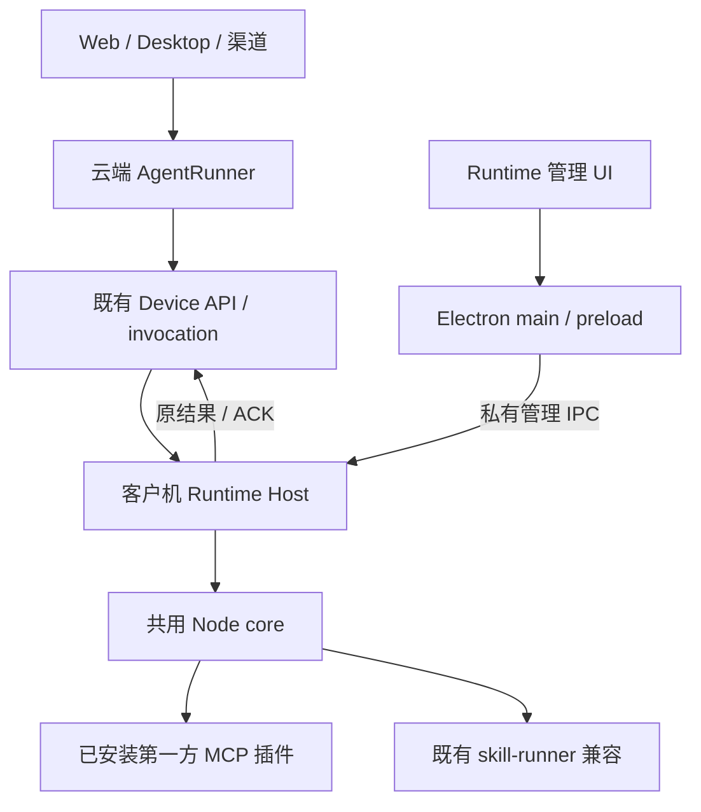

# Runtime 执行环境与插件宿主架构

> 更新：2026-10-09；代码基线：`f1087289`。
>
> 本文是 Runtime 的唯一架构设计；[开发计划](../plans/plan-runtime-plugin-host.md)是唯一进度来源。
> 上位约束：[共同契约 v2.0](runner-desktop-runtime-integration-contract.md)；共享格式：[schema/fixture 候选 0.3](../../contracts/runtime-host/v1/README.md)。
> Provider 包规范见[第一方 CLI / MCP Provider 标准](first-party-cli-mcp-provider-standard.md)，公共壳见[Desktop 设计](desktop-agent-client-design.md#13-h3-首期设计输入runtime-ui与第一方cli)。
>
> 第一部分已交付 Windows 隔离验收版；尚未完成真实业务人工验收、正式发行或共同 wire 冻结。第二部分第三方 Skill **暂不开发**。

## 1. 目标与当前范围

云端 AgentRunner 负责推理、任务生命周期、恢复、权限和费用；客户机 Runtime 执行本机工具并回传事实。Runtime 不新增本地模型循环，Desktop/Runtime UI 不直接发起插件业务动作。

同一 Electron 工程提供独立 Runtime 客户端和完整 Agent Desktop。两种产品复用 Runtime core，但产品身份、目录及入口分别配置。Runtime 可在同机或专用异机运行；新任务固定设备/workspace 的协议仍依赖 H2，不把现有全局 selected device 当作新任务绑定。

第一部分只包含 Runtime UI、BOSS/weixin/wecom 第一方离线插件安装管理及既有 Device 执行兼容。第三方 ZIP 导入、解释器环境管理、AI 分析、设备技能动态登记和新脚本执行链属于第二部分，保留第4～6节设计，当前不实现，也不是第一部分依赖。

安装即本机使用授权；成功安装默认 enabled=true，实际条件另行决定 ready。无额外插件批准或默认逐次弹窗。身份、配对、设备使用关系、既有调用许可、取消及桌面锁继续生效。

## 2. 当前代码与完成边界

以下是仓库实现，不代表线上已部署。

| 位置 | 已实现 | 边界 |
|---|---|---|
| `clients/shared/local-tool-host-core/src/` | 普通 Node core、管理服务、lease、插件校验/store、原执行模块 | 无 Electron/Vue 和 Provider 业务源码依赖 |
| `clients/agent-tool-runtime/src/runtimeHost.ts`、`managed-entry.ts`、`cli.ts` | 组合 core、平台、凭证与既有执行；受管 IPC 和 CLI 共用核心 | 原模块路径保留兼容导出；主包不再强制捆绑 BOSS |
| `clients/agent-tool-runtime/src/productTrust.ts`、`pairingStore.ts`、`sessionTasks/completionProof.ts` | 固定信任输入、配对事务、可信结案检查 | 无生产根；旧历史无证明/unknown 继续阻断身份切换 |
| `clients/runtime-plugin-packaging/` | 三独立签名验收包、实际 Node/Python/OCR/模型/运行库与路径修正 | 不在客户机运行 npm/pip/Git/hook；正式发行资格待核实 |
| `frontend/desktop/features/runtime/` | 管理页、port、实例/revision、去重、断连与握手通知处理 | 仅管理；没有第三方安装入口或聊天 Agent |
| `clients/agent-desktop/electron/`、`clients/agent-desktop/scripts/` | 公共 main/preload、监管、选择快照、DPAPI、固定 Node、产品构建 | 与完整 Desktop 共用工程；完整对话/H2/H4新链路未交付 |
| `src/local_tools/` | 既有设备认证、invocation、proxy/catalog、结果/计费 | 官方静态工具面保留，不因本地 tools/list 动态扩大云端权限 |
| `src/core/skill_plugin_gate.py`、`src/local_tools/skill_runner_proxy.py`、`clients/agent-tool-runtime/src/skillRunner.ts` | 旧 M1/M2 服务端目录/hash/设备脚本路径 | 第9节的 legacy 兼容；不是新第三方安装机制 |

三包真实 manifest 版本为 BOSS 0.3.0、微信/企微 0.1.0；文件名 -dev 只是验收资产名。MCP 包内工具数21/8/10，Host 原受信子集不扩张。验收资产、测试限制和剩余门见计划第10节。

## 3. 架构边界

业务调用只有受信 Device 链能创建；Host 管理 API 不开放 invokeTool、任意 shell 或通用文件操作。内部 invoke 不得暴露给 renderer。客户端不持内部 Runner service token。

不可变包、插件可变状态、invocation 输出和用户 workspace 是不同目录。当前登录用户权限、cwd、venv 或安装即授权都不是 OS 沙箱。文件/命令/Skill 的统一任务环境与批量本地计算依共同契约；不在第一部分顺带实现通用 Shell/PTC、本地文件 adapter 或第二套调度器。

## 4. 第三方 Skill 安装设计（暂不开发）

### 4.1 原包和执行侧清单分离

保留原 AgentSkills 包和 SKILL.md；Host 生成版本化执行侧清单，记录身份、release、环境、已确认入口、文档与精确可变状态路径。metadata.execution/entry/mutable 是旧项目扩展，不是 AgentSkills 标准必填字段。

原 ZIP、不可变内容与调用契约摘要分别记录，不改变 legacy exec_hash 算法。解释器由实际环境选定，模型不得自由指定 executable/cwd/env。手册型 Skill 可没有执行入口。

### 4.2 导入事务

未来流程为选择 ZIP → staging 受限解包 → 确认唯一技能根 → 分析手册/必要源码 → 验证实际入口和依赖 → 提交安装记录 → 登记描述。多技能根不能猜测；未知能力明确报缺口，不开放任意命令。

安装成功默认启用；失败保留旧版本。依赖环境按实际 release/兼容标识选择，不自动共享未知依赖。第三方环境安装与第一方包自包含内部 Python 是不同工作，后者已在第一部分交付。

### 4.3 样本与可变状态

历史 WorkBuddy 样本 jingpian-house-finder v2.0.0 包含 SKILL.md、Python 脚本、UI 缓存和图像资源；坐标探测、截图分析及多步操作需要 Agent 与脚本配合，不能假定一条命令自动完成全部任务。

旧脚本可能写 references/ui-cache.json 等包内路径。未来应明确工作副本/状态映射并检查不可变内容；该适配不是 OS 隔离。原 ZIP 当前没有随仓库保留，具体入口、mutable、解释器与依赖必须拿到实包再核对，不能依据历史调研宣布可运行。

## 5. 云端手册与调用描述（第二部分暂不开发）

### 5.1 登记边界

代码、依赖和登录态只安装在执行设备。云端保存原始手册、必要参考资料、能力描述、入口/参数、代码地图及摘要。新路径不要求服务端再放一套可执行脚本目录。

身份来自可信 tenant/user/device，设备自报名称、readiness 或 schema 不创造权限。官方插件与批准 manifest/catalog 比对；私有 Skill 只进入有权使用该设备者的视图，不能覆盖内置工具或跨租户全局注册。

新设备契约加载源与 legacy 服务端目录开关分开；不伪造服务端脚本目录给 SkillExecutor，不放进全租户共享 registry。新登记端点、DDL、binding/许可和资源 wire 尚未交付，需 H2/H4 冻结后实施，本文不另造字段或业务表。

### 5.2 AI 描述生成

先分析 SKILL.md 是否已说明用途、入口、参数、输出和运行条件；足够就生成描述，不上传源码。信息不足才补传必要源码，用户已允许该用途的云端模型分析。调用既有模型与用量账本，不在 Runtime 建任务 Agent loop。

原手册保持原文。生成 description、entries 和最小 code_map；代码地图只含真实包内相对 path 与简要说明，未知用途明确标注，不能虚构路径/函数。Host 验证文件与入口，未确认入口不暴露为可执行能力；纯手册 entries/code_map 可为空。args_schema 保持既有参数适配，output_schema 可选。

必要源码上传用于分析，不默认成为永久 documents。SKILL.md 引用的 references 文档可按已登记范围提供给模型，不能据相对路径读取客户机任意文件。模型分析、digest 和安装都不等于代码审计或远程可信证明。

## 6. 调用、版本与结果

现有第一方走旧 Device/proxy/许可/计费链。首期只证明本机接单固定 release 与排空切换；现有 claim 没有 release 字段，不能声称已实现云端任务级 release/contract/workspace 绑定。

第二部分沿 use_skill/skill_execute，把允许入口与参数转换成结构化调用，不能下发自由 shell 字符串。手册与执行固定同一契约版本；身份与本机路径从可信绑定/安装记录解析。未装、停用、离线、版本不符时明确拒绝，不自动换电脑、服务端或新版本。

新输出内容使用固定数字 code 和字符串 error：正常为0/空字符串；effect 与 complete 分别说明副作用及完整性。管理失败 result=null，业务输出按共享 schema，不能混用外层旧 Device DTO。已可能发生写动作的 unknown 不重放；只补传原结果。新产物需核对 invocation、设备、workspace 与文件实际存在；截图必须真实进入模型输入，文本路径不能冒充图片。H4 本批只有描述/输出格式，没有新产物服务。

## 7. Runtime UI 与产品壳

独立 Runtime 提供配对、执行实例与第一方插件管理。UI 通过受限 preload port 请求和订阅；凭证、原生选择、文件快照、Node 子进程与监管留在 main/Host。

固定产品输入为 resources/config/runtime-product.json 的 schemaVersion/productKind/profile，信任输入为 resources/runtime/trust-roots.json 的 schemaVersion/profile/roots。每根含 key_id、SPKI PUBLIC KEY PEM、providers、显式 test_only；拒绝私钥及伪 PUBLIC 头，production 拒绝测试根，不能从文件名推断信任。

Node 固定22.23.3 / Windows x64 / ABI127；Host 资源从模块路径解析，不靠 cwd。独立验收产品 cn.aidingyi.agent.runtime.acceptance 使用独立 userData 与 %APPDATA%/aidwork-tool-runtime-acceptance，不覆盖生产目录。验收安装器 NotSigned、生产要求 Valid Windows 签名；无正式证书或信任根不能自动降级。

首期 Host 是 main 的直属 child，用继承的私有 IPC；受管入口先监听再初始化，初始化失败回复原 describe。原生选包给 renderer selection_ref/label，私有 callback 再返回受控外 ZIP 快照；不把绝对路径或任意文件 API 给 renderer。没有受控通道的外置实例报冲突，不强抢或另建 TCP 接管服务。

关窗收至托盘，显式退出等待安全停止和真实 child 退出。断连或超时不等于停止，也不自动重放管理变更。具体构建与人工步骤见[手册第12节](desktop-agent-client-build-manual.md#12-独立runtime首期验收包)。

## 8. 第一方插件与迁移

BOSS/weixin/wecom 是独立按需安装的 MCP 包，空 Host 可配对、联网和诊断。客户机无需 npm/Git/系统 Python；第一方包包含批准工具所需依赖，不将源码仓库/experiments/venv 路径当发行输入。

管理安装记录及停用/卸载墓碑优先于显式 legacy 入口，不能回退手工入口绕过停用。单包坏损/缺失不阻断其他包或空 Host。旧 clients/pack.sh 对新独立布局前置拒绝，使用当前 Desktop 构建链；不拿旧捆绑 BOSS 的发货包证明新机制可用。

Provider 业务、云端特殊代理/计费仍按原实现，不把任意 MCP tools/list 注入 Agent，也不为通过测试扩大静态受信子集。

## 9. 旧 M1/M2 代码的兼容与限制

旧阶段已写代码，不能仍列为待开发，也不能当成当前第三方新架构完成：

| 旧能力 | 当前代码事实 | 与新契约的差异 |
|---|---|---|
| M1 知识层 | skill_plugin_gate/审批 CLI/SkillRegistry/租户合并与缓存已实现，插件 init_script 不执行 | 要求服务端完整目录、平台级审批/hash；不是设备私有描述登记 |
| M2 设备路由 | skill_runner_proxy/evaluator/parser、catalog、SkillExecutor 和本机 skillRunner 已实现 | 仍需服务端审批 entries/exec_hash 与设备执行开关；不是“客户端安装后直接登记” |
| 本机执行 | 配置 skills.dir/python，扫描并计算 hash，结构化 entry/args，路径/参数检查、原桌面锁和结果链 | 无第三方 ZIP 安装器、AI 分析、动态云端登记或新多模态产物闭环 |

旧目录链为 src/skills → skills/ → storage/skills/plugins，内置同名拒绝，平台审批不是租户私有授权。M2 仅放行插件来源、execution=device、当前审批 entries/exec_hash 及开关齐备的情况；version 为展示，对账以 exec_hash 为准。入口不得和 mutable 相交，SKILL.md 不可免检；旧 hash 双端算法不静默变义。

旧原始命令经 shlex 解析为 entry/args，禁止自由 shell；默认参数上限16项、每项500字符、总4000，超时受本机上限约束。旧 stdout/Python 路径不等于新结构化输出/图片协议。

legacy 按原门槛兼容，不在本次文档整理中删除审批代码或放开权限。v2.0 的安装即授权属于新安装路径，迁移这条旧路径须第二部分明确启动并验证。M1 代码已完成；M2 云端/设备代码已完成，WorkBuddy 样本 Windows 真机执行与业务闭环仍未验收。遗留验收保留在统一计划，不再维护独立 M1/M2 任务或文档。

## 10. 文档职责与参考

Runtime 只有本文与一份[计划](../plans/plan-runtime-plugin-host.md)。共同契约定义跨端边界，schema/fixture 定义格式，Provider 标准定义包/工具规范，Desktop 文档定义公共壳与聊天产品，构建手册定义操作步骤；它们职责不同，不是另一份 Runtime 架构。

端侧 sessionTasks、微信/BOSS 自动化仍是独立业务流程，复用本 Host、桌面锁与原服务端决策；它们的领域计划不因此取消，不允许据旧文档新建第二个 Runtime。

## 11. 共用核心与接口实现

稳定执行模块位于 core/src/legacy，原 Runtime 入口兼容导出；core 不直接依赖 Electron 或具体 Provider 业务。Runtime Host 组合 Device connection、invocation、Provider、sessionTasks、journal/outbox 与平台服务，不重建业务 Run。

H1 为最小管理面：describe/getState、pair、start/stop、plugins.list/import/enable/disable/uninstall、operations.get 和 state_changed 刷新通知；实际名称/字段以共享 schema 为准。operation 状态与 Runner 任务状态分开。H1 producer/真实 H3 consumer 已有验收证据，但整体仍候选0.3，未共同登记冻结。

H2 设备/workspace/许可与 H4 新登记/资源/产物由共同契约指定负责人交付；缺输入关闭依赖能力，不能把测试 adapter 或 legacy selected device 用成生产新协议。

## 12. 第一部分开发前实施决议

本节记录已落实的实施规则及保留限制，替代旧开发前草案；不因文档整合改变共同契约或 wire。

### 12.1 第一方离线容器、信任与实际依赖

外 ZIP 仅 envelope.json 与 payload.zip。RFC8785 规范化去签名 envelope 后 Ed25519 验签；签名绑定原始内 payload 字节摘要/大小及完整 manifest，不能形成自引用 hash。完整格式以[Provider规范10.2](first-party-cli-mcp-provider-standard.md#102-runtime首期离线包实施格式)为准。

拒绝路径逃逸、Windows别名/ADS/链接、大小写冲突、未登记文件和展开超限。顺序检查一次仅持有一份完整包，再同步发布快照，避免并行解压峰值。固定根来自产品发行输入；隔离测试根不转换为生产根。离线不能承诺云端撤回即时生效。

### 12.2 安装提交与就绪分开

签名/摘要/manifest/平台/ABI/必要发行依赖失败不提交 active。业务软件、登录态或可交互条件缺失可安装成功、enabled=true/ready=false，并显示诊断。version/doctor 必须只读。基础应用进程存在不证明登录 binding 或新许可已经核验。

### 12.3 同一导入入口升级与收尾

plugins.import 兼升级；相同 release/摘要幂等，同 release 异内容拒绝。同版本异 release 与降级拒绝，只接受更高批准版本。升级保留 enabled，失败保留旧 active。关闭普通领取、session 分配与直接 Provider 新调用准入，排空实际执行后切换；不做多版本并行调度。

停用/卸载记录阻止新动作，原执行按许可/取消规则收尾；journal/outbox/未知事实和仍需旧 release 的恢复引用保留。超时、租约过期或空 outbox 不能证明旧业务停止。

### 12.4 旧入口兼容与能力诚实

管理记录/墓碑优先于 legacy，能力按真实入口、协议及就绪检查上报。v2Send 必须实际协商/许可/journal/桌面条件满足；安装和 Node 版本不足以证明。原 CLI 和 legacy skill-runner 不自动搬迁为新插件记录。

### 12.5 持久去重、列表水位与版本展示

request_id 关联一次回复，request_key 固定变更意图。可信通道/形状检查后先查原 operation，再消费新 selection_ref；同键不同意图拒绝，不用过期 ref 或重选文件重新执行。Host 在持久接单前复制并 fsync 自有冻结外包，operation 绑定快照/摘要。外 ZIP 摘要与签名内 payload 摘要不同。

pair 敏感意图由持久 DPAPI 保护 secret 的 HMAC 摘要去重，不存配对码，secret 损坏报失败/核对。plugins.list 返回 instance_id/revision/plugins；version 取可靠 manifest，不从文件名猜测。

消费方共享 describe、通知、state/list 最高水位；换实例清快照，旧连接代不污染新代。同 revision 的迟到 list 用本地请求序号处理，不增 wire 字段。握手期间按本代缓存至多8实例通知，只合并 describe 对应实例；超界失败、断连清缓存。低水位保持 dirty 补查，不能由旧快照清除刷新需求。

管理查询与初始化等待预算120秒；超时结束 Promise 并保留原意图供查询/手动重试，断连立即取消等待。预算不是停止/许可/租约期限，不触发强杀。

### 12.6 停止与重新配对

stop 先关新准入，继续在途许可核验、进度和原结果补传。30秒收尾观察不是 kill 期限；未证明实际停止则保持 draining/reconciling/blocked，不冒报安全退出。

配对替换/解绑要求 stopped、无在途/未知占用、无旧身份未结案事实。旧 journal 的 may_have_started、session .acked 游标及空 outbox 均不足以证明结案。v2 在原 ACK 后删除 outbox 前持久关联结果/journal 摘要；只对可信一致 none/applied 结案，unknown 拒绝。session 需可信终态、最终连续事件 ACK、引擎排空及 DPAPI 保护的元数据/事件摘要。篡改、部分 ACK 或旧数据无证明均拒绝，不能删目录放行。

同 home OS lease 互斥；旧 Windows node CLI 通过进程/用户核查，无证明时保守报冲突或核对，不 kill。崩溃 marker 不能凭进程 lease 过期自动解除。失败保留原身份及历史事实。

### 12.7 文件责任与剩余门

Runtime 负责 core、Host/CLI/bootstrap、三包构建和 runtime feature；Desktop 负责公共 main/preload、监管/选择 adapter、固定 Node、产品身份与构建/全局入口。共同接口先登记唯一写入者与兼容方案，不能各自实现。

首期隔离产品已完成公共壳接线及包验证。正式 trust root/Windows 证书、Python/CRT安全与许可资格、干净 Windows、NSIS/原生选框、真实配对/业务仍待验收。H2/H4 新 wire 未冻结，B1/B2 暂不开发。当前交付之后停止，下一步只按用户新指令推进。
