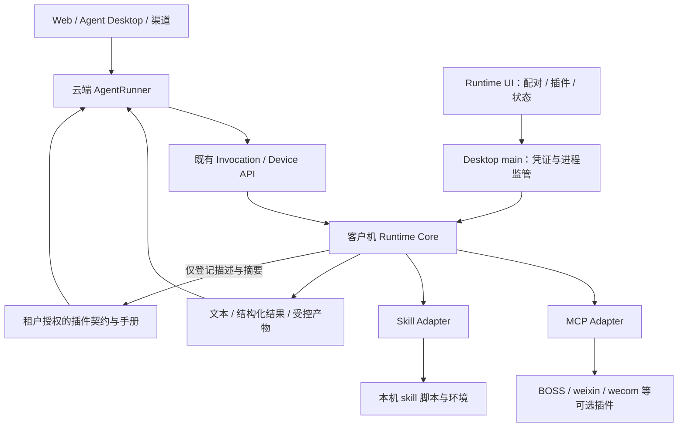

# Runtime 执行环境与插件宿主架构：客户机安装、云端契约、可视化管理

> 日期：2026-10-08
>
> 状态：设计建议，尚未开发；不代表客户端已具备本文能力。
>
> 开发计划：[plan-runtime-plugin-host.md](../plans/plan-runtime-plugin-host.md)
>
> 现状调研：[外部 Skill 接入调研](../research/external-skill-plugin-integration-research.md)（第 8 节为本次修订）
>
> 上位规范：[第一方 CLI / MCP Provider 规范](first-party-cli-mcp-provider-standard.md)、[AgentRunner 架构](agent-application-architecture-design.md)

> 跨会话共同约束：[Runner / Desktop / Runtime 集成契约 v1.1](runner-desktop-runtime-integration-contract.md)。公共壳与任务binding接线由桌面工作流主导；本方案负责Runtime执行环境/核心/插件，独立UI提交为模块，不能另写公共入口或第二套授权协议。

## 1. 目标与决策

设备执行插件的代码、依赖和状态只安装在执行设备。云端 Agent 使用经过授权的调用契约与操作手册，经既有 invocation 队列调度设备。安装 skill 不再要求运维人员同时向服务端部署一份脚本目录。

Runtime 是云端 AgentRunner 的客户机执行环境与通用插件宿主，提供文件、进程、软件操作、插件和结果回执能力；BOSS、weixin、wecom 是可选的 MCP 插件；外部 skill 是手册加资源的插件。Runtime UI 负责配对、安装、启停、环境检查和任务状态，复用现有 Electron 工程与执行核心。

已确认的 UI 选择（2026-10-08）：复用同一 Electron Desktop 工程，提供可独立安装的 Runtime 客户端。Windows 优先、云端仍执行 Agent 推理是本次设计假设；完整 Agent Desktop 可复用管理模块，不作为独立 Runtime 安装前提。

明确选择：

1. **设备安装、云端登记契约**。云端可保存手册、允许模型读取的参考资料和不可变摘要，不必安装或执行插件代码。
2. **共用执行核心**。复用 `clients/shared/local-tool-host-core` 的预留边界，从现有 Runtime 提取实现；不建立第二套调度、配对和桌面执行链。
3. **CLI 与 skill 共用生命周期，保留不同调用语义**。CLI 使用 MCP tool schema；skill 通过 `use_skill` 和脚本执行适配器工作，不强迫每个 skill 变成一个 MCP 项目。
4. **复用云端 AgentRunner 和 Device API**。renderer 不能直接执行插件业务；Web、Desktop 和渠道均可调度用户选定的授权设备。
5. **先本地导入，后受控目录分发**。第一阶段支持用户导入 skill ZIP 和官方离线插件包，不以开放市场为前提。

## 2. 代码现状与差异

以下为 2026-10-08 工作区代码事实；没有据此推断线上已部署。

| 位置 | 当前实现 | 与目标的差异 |
|---|---|---|
| `src/core/skill_plugin_gate.py`、`scripts/approve_skill_plugin.py` | 从服务端完整技能目录计算 hash，生成审批记录 | 服务端注册和代码目录耦合 |
| `src/local_tools/skill_runner_proxy.py` | 查审批入口与 exec_hash，再检查设备技能清单，派发脚本 | 不能只凭设备登记的契约运行 |
| `clients/agent-tool-runtime/src/skillRunner.ts` | 扫描目录、校验入口/hash、用本机 Python spawn，回传文本 | 无 ZIP 导入、环境安装和产物回传接口 |
| `clients/agent-tool-runtime/src/config.ts` | 手工 JSON 配置；BOSS 默认入口恒存在于配置解析结果；Python 文件存在即上报 skill-runner | 零业务插件启动与依赖就绪检查不足 |
| `clients/agent-tool-runtime/package.json` | 依赖且捆绑 BOSS；prepack 构建 BOSS | 主包与业务插件强绑定 |
| `clients/agent-tool-runtime/src/providers.ts`、`src/local_tools/catalog.py` | 双端静态工具面；云端工具还经 proxy/assembly 注册 | 不能把 MCP 的 tools/list 误认为已实现云端动态注册 |
| `clients/agent-tool-runtime/src/providerManager.ts` | 使用 `process.execPath` 启动 Node MCP Provider，未实现工具发现登记 | 进入 Electron 宿主后必须明确真正的 Node 可执行文件 |
| `clients/agent-desktop/electron/main.ts`、`preload.cts` | 已有安全隔离、凭证、下载、更新、renderer；尚未接入 Runtime | UI 壳可复用，Host 管理能力待实现 |
| `clients/shared/local-tool-host-core/src/index.ts` | 只有 invocation/shutdown 接口 | 预留边界，不是已提取的执行引擎 |
| `frontend/web/components/saas/LocalToolDevices.vue` | 配对码、设备列表、选择、撤销 | 有云端管理入口，缺本机配置与插件界面 |

本地 `clients/release/aidwork-recruiting-client-0.2.14.zip` 的内嵌 tgz 经只读检查：无 `skillRunner.js`，其 cli/config/providers 编译产物也无 skill-runner 引用；源码和旧发布物不一致。发布能力必须以包内容和启动验收为准。

现有第一方规范第 8、10.1 节已经要求 Desktop 共用 Runtime 和 CLI 按需交付。沿用该方向；当前捆绑 BOSS 的打包方式作为迁移兼容形态，不扩大为新架构。旧的本地 Agent Coordinator 路线已被 AgentRunner 取代，不因为有接口文件而重新启用。

## 3. 架构边界



| 职责 | 云端 | 客户机 |
|---|---|---|
| 模型推理、任务编排 | AgentRunner | 首期无本地 Agent |
| 调用知识 | 描述、SKILL.md、批准的参考资料、schema | 原始手册及资源 |
| 代码与依赖 | 设备插件不在云端安装 | CLI 文件、脚本、Python/Node 环境、模板 |
| 授权 | 租户/用户/Agent/设备授权，调用策略 | 本机安装与执行授权、路径与资源门禁 |
| 版本 | contract revision、release digest、设备登记 | 实际安装版本、完整性检查、原子切换 |
| 本地业务状态 | 仅必要结果与审计 | 微信登录态、坐标缓存、设备文件、执行工作区 |
| 包存储 | 官方分发服务可存安装包；不等于运行时安装 | 实际安装与执行 |

“服务端无需代码”指无需安装执行目录，不禁止发布系统保存官方包、审核系统保留用户主动提交的代码样本，或模型按明确需要读取受权源文件。后两者均不作为普通技能使用的前提。

### 3.1 Runtime 执行什么

普通 SKILL.md 不是可执行工作流，也不必有单个主入口。它可能要求 Agent 多次执行脚本、阅读参考文档、分析截图、询问用户，再执行下一步。

默认流程是云端 Agent 理解手册并分步下发结构化调用；Runtime 执行对应脚本并返回结果。若包已实现 `flow.py` 这样的确定性完整流程，可一次执行该流程。首期不新增本地 LLM、不新增通用工作流 DSL，不承诺“发一句任务给 Runtime，它自己读手册推理完成”。

### 3.2 统一宿主，不混合工具语义

- **MCP 插件**：本地 Host 连接 stdio Provider，发现 tools/list；对官方插件使用平台批准契约比对，既有云端 proxy、计费和业务编排逐步迁移。首期不删除它们，也不把特殊云端方法机械下发本机。
- **Skill 插件**：本地导入器解析 SKILL.md 和执行侧清单；云端 `use_skill` 读手册，`skill_execute` 适配器生成脚本调用。不会为每个 skill 注册一份编译期 Provider。
- **Runtime 内建能力**：配对、安装、状态、受控资源读取和产物传输属于宿主；不作为任意进程执行的公共通道。

### 3.3 统一任务执行环境与本地计算

本节接纳用户转交的桌面设计定位，具体共同语义以集成契约第5.1/5.2节为准。

任务执行环境基于受信binding，关联固定设备、原runner/execution、可选workspace grant和版本、策略、取消及执行权。文件、受控命令、skill与软件操作共享这一上下文，按各自需要的能力检查；本工作流提供环境及平台原语，桌面文件工作流交付文件adapter，不能各建一套Host/任务上下文。

同一环境不是统一解释器或cwd：不可变插件包、Python依赖环境、用户workspace、插件状态及invocation输出目录保持各自用途。用户文件通过同一受权资源引用解析；插件可以从包目录读取自身模板，但不能把该目录当成用户选定workspace。尚无workspace grant的应用技能可只请求桌面能力；不能为此伪造文件授权。

批量检索/读取、CSV聚合、日志筛选等确定性处理可以一次本地执行后返回统计、必要样本和产物；不需要每个文件/每行返回模型。需要新的模型判断时回到原Runner。先采用结构化batch或受信脚本，不新增完整PTC和任意execute_code入口。

例如CSV分析：Runner选择已授权输入并派发一次统计 → Runtime读取、筛选、聚合 → 返回实际处理/失败数量、统计和必要样本 → Runner分析 → 若需生成文件，再派发获得写权限的生成操作。筛选/循环不新增模型调用，但批量不能扩大grant、忽略revision冲突或隐藏部分失败。

新本地能力限制依平台/adapter实际实现；目录、cwd、venv和授权弹窗不能约束未隔离任意代码的所有系统访问。既有skill runner的cwd/env行为是旧实现，不作为新环境的安全证明。副作用批次未知时核对原操作，不能重新执行整个脚本冒充恢复。

模型费用继续取实际网关调用，企业授权/恢复/账本继续归Runner；保留云端loop的原因是共用这些企业能力，不是本地loop无法使用云端模型计费。效率先量测领取、执行、回传、输出量和模型轮次；设备快路径是后续transport优化，不替代持久invocation和结果核对。

## 4. 本地插件格式与安装

### 4.1 原包和执行侧清单分离

保留 AgentSkills 原包，不要求第三方修改 SKILL.md 的 YAML 格式。导入时在宿主安装记录中生成 AID 执行侧清单，保存 plugin_id、release_id、执行环境、允许入口、文档范围、可变状态路径和所需能力。

现有 `metadata.execution/entry/mutable` 可作为导入提示；缺失时在 UI 明确选择入口和解释器，不由模型自动授权。含无法满足的 Shell、浏览器或文件能力时显示“已导入、尚不兼容”，不自动放开任意命令。

这也是与旧实现的区别：现有 metadata 列表是本项目扩展；标准 AgentSkills 的 metadata 是字符串键值映射，不能声称这些执行字段是标准必选字段。执行侧清单由版本化宿主 schema 约束。

推荐设备目录：

```text
<runtimeHome>/
  plugins/<plugin_id>/releases/<release_id>/package/  # 原始、不可变代码与资源
  plugins/<plugin_id>/active.json                    # 当前启用版本指针
  plugin-state/<tenant>/<device>/<plugin_id>/         # 可写状态
  environments/<environment_id>/                    # Python 等环境
  invocations/<invocation_id>/                       # 输入、输出、诊断
  journal/ result-outbox/                            # 沿用现有持久结果路径
```

原始 ZIP digest、展开后不可变内容 digest、contract_digest 分开记录：分别用于包来源、执行完整性、手册/调用契约一致性。现有 exec_hash 保持 legacy 算法，新版本不静默替换其含义。

### 4.2 导入事务

1. 用户选 ZIP；仅 staging 解包，按既有 Provider 包规范限制路径、链接、展开大小、文件数和重复路径。
2. 识别唯一技能根；多个 SKILL.md 时展示选择，不猜测要执行哪一个。
3. 读取名称、手册、依赖提示；识别不兼容能力，显示来源、入口、所需应用和状态写入。
4. 用户本地授权后创建执行侧清单，构建环境并检查依赖。pip 安装本身可以执行代码，不能先静默安装再询问授权。
5. 计算 digest；提交本地安装记录；向已配对服务端登记描述。云端审批通过后才启用远程调用。
6. 任何失败保持旧版本可用；在途调用绑定旧 release，升级不覆盖文件。停用后阻止新调用，卸载等待在途调用结束或明确取消；保留审计/outbox。

Python 环境按 release/明确的环境兼容标识管理，不首期自动共享未知依赖。官方 CLI 包自包含依赖；正常用户不需要 npm、Git 或源码。第三方依赖无法自动满足时，UI 显示实际缺项并允许选择已有解释器。

### 4.3 坐标缓存与旧脚本

新插件推荐通过宿主提供的状态目录和输出目录工作。jingpian 旧脚本可能写 `references/ui-cache.json` 等固定相对位置；导入器不得未经验证声称只读包可以直接运行。

兼容路径：为该插件创建设备/租户隔离的工作副本，将经本地授权的精确 mutable 文件映射到状态目录；不可变部分执行前检查，未知写入报完整性问题。该方式是兼容适配，不是 OS 沙箱；脚本以当前用户权限运行，不能声称能阻止其读取任意用户文件。

原始 ZIP 本轮不在工作区。具体 mutable、截图输出和环境版本需拿到原包后核对，不凭历史调研替它生成可运行清单。

## 5. 云端只保存调用契约

### 5.1 最小登记内容

首期沿已有 Device API 增加设备自认证的插件登记端点；心跳只传 installed/ready、installation_revision、digest 和 inventory_revision，完整手册仅首次登记或 revision 变化时传送。

登记内容至少包括：

| 内容 | 作用 |
|---|---|
| plugin_id、kind、release_id、display_name、description | 稳定身份、模型发现、UI 展示 |
| package/content/contract digest、协议版本、平台要求 | 固定调用版本与兼容性 |
| SKILL.md 内容及允许提供给模型的文档清单 | 按需加载说明；不含默认上传的代码和二进制资源 |
| 入口标识、argv 约束，或 MCP tools 的 input/output schema | 创建调用契约 |
| 桌面/文件/网络等能力要求 | 策略及就绪检查；不是自动授权 |
| 本地启用状态、检查结果 | 判断当前设备是否实际可执行 |

服务端认证决定 tenant/user/device；请求体不能自报另一个身份。名称不作全局唯一身份：私有 skill 的 identity 包含租户/发布者 namespace。内置 skill 和既有 CLI 名称不得被客户端覆盖；需要时模型看到明确别名，内部仍使用 contract_id。

推荐三类系统数据：`local_tool_plugin_contracts`（不可变版本化描述）、`local_tool_device_plugins`（设备安装绑定与状态）、`local_tool_plugin_grants`（用户/Agent/设备授权）。私有记录均具备 tenant_id 与必要 owner 字段，外键和唯一键带租户边界。具体 DDL 在 Phase 1 冻结并登记到系统表文档，不在设计阶段先建业务表。

官方可下载包的全局 release catalog 属后续分发阶段；第一阶段可继续使用批准的官方静态契约，避免同时开发市场和发布管理系统。

### 5.2 审批和可见性

客户端上报是待验证资料，不直接注入 LLM。进入模型工具面需满足：有效设备身份、schema/大小/文档路径验证、当前内容 revision 的授权、租户/用户/Agent allowed、设备启用且就绪。

官方签名插件与平台批准契约比对。用户导入 skill 默认限定于其租户、用户及安装设备；按既有管理权限由租户授权主体批准契约和远程使用范围。批准后可绑定自己的 Agent，不变成所有租户可见的全局技能。名称白名单不能代替身份和 revision 绑定。

服务端批准契约不等于审查了源代码。无代码上传时，可信依据是用户对本地执行包的授权，及受信设备对内容 digest 的报告；这不是远程证明。平台要求源代码审计的企业可另外提交审核材料，不能用客户端自报 hash 声称实现了代码安全审查。

插件手册作为有来源的任务操作说明处理，不能覆盖身份、平台规则或扩大授权。工具 description、annotations 和 readiness 都不能单方面决定允许写入的范围。

### 5.3 手册与参考资料

SKILL.md 可缓存在服务端契约中，减少每次任务依赖设备在线取手册。按 AgentSkills 的渐进加载思想，仅加载当前任务所需的批准文档。

SKILL.md 引用的 `references/*.md` 等也可能是 Agent 必需知识，不能断言只上传一份 SKILL.md 就够。它们由清单枚举后上传或通过受控资源读取返回；禁止模型据相对路径读取设备任意文件。代码、图片模板仍留本地；需要模型分析的截图走产物接口。

### 5.4 与现有 SkillRegistry 的接缝

保留文件目录加载器供内置和服务端技能使用。新增只读的设备契约加载源，构造对应 Skill metadata/body/resource provider，不能伪造一个本地代码目录给 SkillExecutor。

设备契约只合入本次执行绑定的 tenant/user/Agent/device 视图，不放进进程级全租户共享 registry。缓存键含身份、授权 revision、设备与 inventory revision；撤销和版本门执行时复查，不能只靠 TTL 延迟失效。

新登记协议独立于 `skills.plugins.enabled` 的旧服务端目录开关；用单独的设备契约开关渐进启用。否则目标仍隐含要求服务器打开 legacy 目录注册。

## 6. 调用、版本与结果

### 6.1 结构化调用

沿用 `use_skill` / `skill_execute` 的用户语义；新设备契约路径把命令转换成允许的入口标识加 args。旧 command 字符串作为兼容入口解析，绝不原样下发 shell。

服务端入队时固定 tenant、device、contract_id、release_id、content_digest、contract_digest、installation_revision 和入口标识。上述身份字段由受信 registry/路由生成，不能由 LLM 参数覆盖。Runtime 将入口标识解析为本地安装记录的文件及解释器，云端不传 executable/cwd/env。

调用前检查租户授权和设备就绪；领取后、进入资源锁及真正启动前，再复查本地版本、撤销、取消、参数和入口。重复 request 使用既有去重语义；需要完整 schema 校验，不只限制参数长度。

设备未装/停用/离线或版本变更时返回明确错误，不转到另一台电脑、服务端或新版本。已加载的手册 revision 与执行 revision 不同则要求重新加载；手册和脚本不能各取一个“最新”。

### 6.2 动作效果与恢复

复用 invocation claim、进度、取消、桌面锁和既有结果语义。插件安装管理的生命周期不另建业务任务 Run。

现有 skill-runner 的 Provider manifest 是 protocol v1，不能把它描述成已经获得 v2 的 write-authorize/持久 ACK 保证。新路径应沿用并补齐受控写动作链的门禁、journal/outbox，测试事实确认后才能上报相应协议能力。

任意第三方脚本无法可靠声明逐步骤效果，默认保守处理：执行可能开始后崩溃/超时/断线，返回 unknown，不自动重试或重放；脚本自行报告的 `effect=none` 不是已验证可安全重试的证据。零退出码表明进程成功退出，不等于已证明业务动作成功。

同一桌面互斥域覆盖全部插件和后台观察；不能仅锁 Agent 下发的脚本，而放任微信观察循环同时切窗口。

### 6.3 截图、文件与工作区

结果模型包含文本、结构化数据、effect 和受控 artifact_ref。文件由宿主限制在本次 invocation 授权输出目录，检查文件类型、大小和归属后上传到现有文件/产物存储，通过设备专用授权端点登记。

artifact_ref 绑定 tenant/device/invocation；云端模型或用户读取时继续校验会话授权。不得把客户机绝对路径当云端可访问链接，也不得把插件 stdout 中任意 URL/路径当上传授权。截图内容需送入模型的图片消息或对应多模态输入，单有 evidence_ref 字符串不算“模型看到了图片”。

附件传入客户机是独立的受控输入下载协议，不能复用当前 `${filename}` 云端路径替换。首期找房 sample 无附件输入时不扩大范围实现所有本地文件工具。

## 7. Runtime UI 产品形态

### 7.1 复用 Desktop 工程

在 `clients/agent-desktop` 提供 Runtime 产品构建配置：用户可独立安装，只显示执行节点管理。完整 Agent Desktop 可挂载同一管理模块。共用 Electron 安全配置和凭证接口，复用 Vue Base* 与语义 token，不复制整套业务页面。

安装包内包含固定 Node 执行环境与 Runtime core，默认不预装业务 CLI。Desktop main 监管隔离的 Runtime 子进程；renderer 仅通过版本化的窄 IPC 操作配对、插件与状态。不得提供通用 spawn、任意文件读写或 ipcRenderer。

优先使用固定、随包交付的 Node 子进程以减少现有 Runtime 行为变化。必须向 ProviderManager 注入 Node executable，不再假设 Electron 的 process.execPath 是 Node。Electron utilityProcess 是可选监管实现，需兼容验证后再采用，不作为首期额外改造前提。

### 7.2 用户流程

1. 安装 Runtime 客户端，打开“连接服务”：填写服务地址、设备名、配对码；显示明确的云端身份与连接状态。
2. UI 调用共用 PairService；沿用五分钟、单次消费的 pairing-ticket/device-token 模型，凭证进 OS 安全存储。先复用配对码接口；直接登录自动绑定可后续演进，不把登录 token 和 device token 合并。
3. 进入“插件”：官方包安装 / 导入 skill ZIP；显示授权、依赖、就绪、云端登记状态。
4. 用户启用插件，并在 Web/Agent Desktop 选择执行设备；不会因为安装 UI 就静默切换当前执行设备。
5. “任务”页面显示领取、等待桌面锁、执行、结果和取消；控制仍调用既有 Run/Invocation API。

页面最少四项：连接、本机插件、任务、诊断。包验签、协议字段和哈希不占据默认产品流程；详情页提供可排查的信息。

关闭窗口默认收至托盘并保持用户会话 Runtime；“停止执行节点/退出”明确停止领取任务，按策略处理在途任务。现有 Desktop 在 Windows 关最后窗口即退出，因此此变化只作用于 Runtime 产品形态，不静默改变完整 Desktop 的现有行为。

Windows 桌面自动化运行于登录用户交互会话；自启用现有任务计划思路，不把 GUI 操作进程搬进 Session 0 服务。无窗口运行不等于锁屏仍能操作。相同 runtime home/设备身份只运行一个执行实例，旧 CLI 与 UI 并存时通过单实例锁和明确迁移避免重复消费。

两种 UI 产品使用不同的 Electron app identity/userData，避免安装、卸载和应用更新相互覆盖；Runtime 执行数据及设备凭证通过明确的 Runtime home 管理，沿用或显式迁移旧目录。它们若管理同一个执行节点，连接同一受监管实例，而不是各自启动一个 Runtime。共享数据目录和本机管理 IPC 的访问权限限定到同一登录用户。

## 8. 官方 CLI 可选安装与迁移

首期 BOSS/weixin/wecom 保持既有 MCP 工具名、schema、业务语义和第三方 Host 兼容，改为独立可安装包。客户端“未安装”不能上报 provider 能力；安装就绪后才登记，缺插件不会妨碍配对、心跳或其他插件执行。

云端保留批准的官方契约和必要的业务 proxy。工具可见性逐步改为 Agent 授权与设备安装能力交集，同时给未安装需求提供安装提示。动态 MCP tools/list 与批准契约不符时拒绝启用，不猜测兼容或自动接受客户端 schema。

迁移顺序：

1. legacy M1/M2 注册和执行路径保留；已装旧客户机继续使用旧协议。
2. 新 Runtime 先兼容手工入口和旧技能目录，UI 显示为“已有安装”，通过导入生成新记录；不强制删除 WorkBuddy 原目录。
3. 新设备契约逐个绑定 Agent；同一技能仅选择一种受信加载源，拒绝重名覆盖；用配置按租户启用。
4. 新发行 Runtime 主包去掉 BOSS 依赖、捆绑及默认强制检查；旧 BOSS-only 能力降级在旧协议适配器内保留。
5. 第一方 Provider 的在线按需下载安装沿既有签名 envelope/catalog 规范实施；客户端上报契约不获得分发代码或远程安装权限。

首期不允许 LLM 指定下载 URL、任意 MCP command、环境变量或安装脚本。第三方 ZIP 的本机导入与云端市场自动分发是不同授权范围，后者另行推进。

## 9. 验收标准

- 空插件安装后能完成 UI 配对、心跳、诊断；无 npm/Python/BOSS 前置依赖。
- BOSS、weixin、wecom 可分别安装、启停和卸载；一个缺失不影响其他能力，既有业务调用语义保持。
- 服务端不放 jingpian 的 scripts/requirements 目录，客户机导入后仍可登记、授权、加载手册、执行 status。
- 文档引用、模型看截图、后续动作形成真实闭环；不能用 stdout 输出本地截图路径代替多模态验收。
- 跨租户/用户/设备、同名插件、契约版本变化、篡改、撤销和旧缓存均不能误路由或扩大权限。
- 安装失败/升级失败保留旧版本；升级不改变在途调用；写动作 unknown 不重放。
- 重启、断网、关窗口、取消、锁屏、CLI/UI 并存均有实际 Windows 验证，证据对应同一最终安装包。

验收需在明确授权的 Windows 环境进行；本次仅设计，没有安装、启动客户机任务、部署或执行业务动作。

## 10. 外部依据与使用范围

### 与桌面工作流的依赖

独立 Runtime 管理模块不要求桌面云端聊天或文本文件 MVP 先完成；H1 管理port和H3公共壳接线冻结后即可接入。完整 Desktop 使用同一模块/核心；本地文本文件能力作为独立adapter接入，而非第二套Runtime。新插件任务沿共同H2固定设备binding，旧selected仅用于legacy路径。插件安装状态目录不代替用户workspace grant；图片结果使用H4，不借普通客户端controls推进设备执行。

本计划Phase 4的Electron公共入口、preload和发行接线由桌面工作流唯一写入，本工作流交付管理模块与Runtime产品配置需求。双方阶段编号不同，不表示各自重做同名底层工作。

### 参考来源

- [AgentSkills Specification](https://agentskills.io/specification)：Skill 由手册与可选资源组成，支持逐步加载；为“云端描述/本地执行”提供格式基础，不定义本项目的安装、审批和 RPC 协议。
- [MCP Tools（2025-06-18 版本）](https://modelcontextprotocol.io/specification/2025-06-18/server/tools)：工具有名称、描述和 schema，支持发现与多类型结果；说明 CLI 可提供声明式调用面，不等于设备自报工具已获平台信任。
- [Electron Security](https://www.electronjs.org/docs/latest/tutorial/security)、[utilityProcess](https://www.electronjs.org/docs/latest/api/utility-process)：为 renderer 隔离、窄 IPC 与进程监管的技术依据。具体使用锁定的仓库 Electron 版本验证，不能用最新文档代替本项目兼容测试。

以上均于 2026-10-08 查阅。包格式、租户授权、迁移顺序和默认产品形态是本项目设计建议，非上述标准要求。
