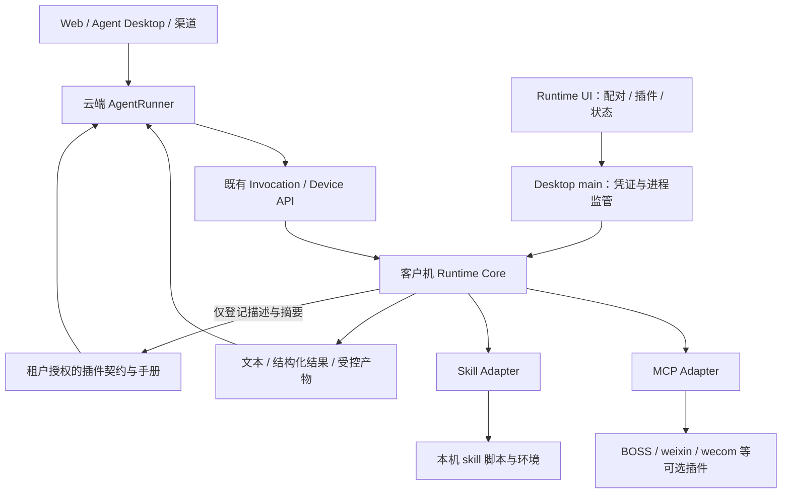

# Runtime 执行环境与插件宿主架构：客户机安装、云端契约、可视化管理

> 日期：2026-10-08
>
> 状态：共同架构契约v2.0；第11～12节细化内部实现与七项开发前决议，当前schema/fixture候选0.3。A1共用核心、CLI与受管bootstrap已实现并验证既有执行链；H3接线/共同冻结和A2～A4尚未完成。第三方skill第二部分暂不开发。
>
> 开发计划：[plan-runtime-plugin-host.md](../plans/plan-runtime-plugin-host.md)
>
> 现状调研：[外部 Skill 接入调研](../research/external-skill-plugin-integration-research.md)（第 8 节为本次修订）
>
> 上位规范：[第一方 CLI / MCP Provider 规范](first-party-cli-mcp-provider-standard.md)、[AgentRunner 架构](agent-application-architecture-design.md)

> 跨会话共同约束：[Runner / Desktop / Runtime 集成契约 v2.0](runner-desktop-runtime-integration-contract.md)。公共壳与任务binding接线由桌面工作流主导；本方案负责Runtime执行环境/核心/插件，独立UI提交为模块，不能另写公共入口或第二套授权协议。

> 2026-10-08用户明确同机/异机部署：Runtime既可服务同机Desktop，也可独立安装在专用电脑，供Web/其他电脑Desktop调度。目标grant、特定网络/软件、远端产物与长GUI独占按共同契约5.3～5.5；此为桌面工作流同步的共同边界，Runtime内部细化和验证由Runtime工作流负责。

## 1. 目标与决策

设备执行插件的代码、依赖和状态只安装在执行设备。云端 Agent 使用经过授权的调用契约与操作手册，经既有 invocation 队列调度设备。安装 skill 不再要求运维人员同时向服务端部署一份脚本目录。

Runtime 是云端 AgentRunner 的客户机执行环境与通用插件宿主，提供文件、进程、软件操作、插件和结果回执能力；BOSS、weixin、wecom 是可选的 MCP 插件；外部 skill 是手册加资源的插件。Runtime UI 负责配对、安装、启停、环境检查和任务状态，复用现有 Electron 工程与执行核心。

已确认的 UI 选择（2026-10-08）：复用同一 Electron Desktop 工程，提供可独立安装的 Runtime 客户端。Windows 优先、云端仍执行 Agent 推理是本次设计假设；完整 Agent Desktop 可复用管理模块，不作为独立 Runtime 安装前提。

明确选择：

1. **设备安装、云端登记契约**。云端可保存手册、允许模型读取的参考资料和不可变摘要，不必安装或执行插件代码。
2. **共用执行核心**。复用 `clients/shared/local-tool-host-core` 的预留边界，从现有 Runtime 提取实现；不建立第二套调度、配对和桌面执行链。
3. **CLI 与 skill 共用生命周期，保留不同调用语义**。CLI 使用 MCP tool schema；skill 通过 `use_skill` 和脚本执行适配器工作，不强迫每个 skill 变成一个 MCP 项目。
4. **复用云端 AgentRunner 和 Device API**。renderer 不能直接执行插件业务；Web、Desktop 和渠道均可调度用户选定的授权设备。
5. **分两部分交付**。第一部分仅Runtime UI及BOSS/weixin/wecom第一方离线插件安装管理；第二部分第三方skill保留契约，暂不实现安装、AI分析或执行接线。在线分发/市场另行推进。

### 1.1 当前实施范围（2026-10-09用户调整）

第一部分交付独立Runtime UI、必要的共用core/管理端、图形化配对、第一方CLI离线包安装/版本/启停/升级/卸载/就绪诊断，并验证原有云端到客户机执行链。公共Electron壳按H3接线，不复制完整Agent Desktop。

第二部分保留第三方skill ZIP、sidecar/依赖环境、手册优先AI分析、入口/代码地图、云端设备skill登记及样本执行的全部契约；当前不开发，也不作为第一部分前置。下文第4～6节的第三方skill流程和5.3.1为第二部分设计，不能据这些规则在第一部分提前实现导入器或源码上传。

plugins.import首期仅接纳支持的第一方离线包；第三方包在安装/依赖执行/源码上传前返回明确不支持。UI只展示可用第一方入口，保留schema对skill的定义不等于已实现。现有legacy skill-runner保持，不删除或重写其稳定代码；不借“兼容旧技能目录”补开发新的第三方管理链。

第一部分验收以[计划A1～A4](../plans/plan-runtime-plugin-host.md#第一部分runtime-ui与第一方cli插件)为准，第三方截图/新产物协议/jingpian样本不作为首期阻塞。通用文件、Shell、完整PTC与官方在线分发仍不并入本次首期。

## 2. 代码现状与差异

以下为 2026-10-08 工作区代码事实；没有据此推断线上已部署。

| 位置 | 当前实现 | 与目标的差异 |
|---|---|---|
| `src/core/skill_plugin_gate.py`、`scripts/approve_skill_plugin.py` | 从服务端完整技能目录计算 hash，生成审批记录 | 服务端注册和代码目录耦合 |
| `src/local_tools/skill_runner_proxy.py` | 查审批入口与 exec_hash，再检查设备技能清单，派发脚本 | 不能只凭设备登记的契约运行 |
| `clients/agent-tool-runtime/src/skillRunner.ts` | 扫描目录、校验入口/hash、用本机 Python spawn，回传文本 | 无 ZIP 导入、环境安装和产物回传接口 |
| `clients/agent-tool-runtime/src/config.ts` | 手工 JSON 配置；BOSS 默认入口恒存在于配置解析结果；Python 文件存在即上报 skill-runner | 零业务插件启动与依赖就绪检查不足 |
| `clients/agent-tool-runtime/package.json` | 依赖且捆绑 BOSS；prepack 构建 BOSS | 主包与业务插件强绑定 |
| `clients/agent-tool-runtime/src/providers.ts`、`src/local_tools/catalog.py` | 双端静态工具面；云端工具还经 proxy/assembly 注册 | 不能把 MCP 的 tools/list 误认为已实现云端动态注册 |
| `clients/agent-tool-runtime/src/providerManager.ts` | 使用 `process.execPath` 启动 Node MCP Provider，未实现工具发现登记 | 进入 Electron 宿主后必须明确真正的 Node 可执行文件 |
| `clients/agent-desktop/electron/main.ts`、`preload.cts` | 已有安全隔离、凭证、下载、更新、renderer；尚未接入 Runtime | UI 壳可复用，Host 管理能力待实现 |
| `clients/shared/local-tool-host-core/src/index.ts` | 只有 invocation/shutdown 接口 | 预留边界，不是已提取的执行引擎 |
| `frontend/web/components/saas/LocalToolDevices.vue` | 配对码、设备列表、选择、撤销 | 有云端管理入口，缺本机配置与插件界面 |

本地 `clients/release/aidwork-recruiting-client-0.2.14.zip` 的内嵌 tgz 经只读检查：无 `skillRunner.js`，其 cli/config/providers 编译产物也无 skill-runner 引用；源码和旧发布物不一致。发布能力必须以包内容和启动验收为准。

现有第一方规范第 8、10.1 节已经要求 Desktop 共用 Runtime 和 CLI 按需交付。沿用该方向；当前捆绑 BOSS 的打包方式作为迁移兼容形态，不扩大为新架构。旧的本地 Agent Coordinator 路线已被 AgentRunner 取代，不因为有接口文件而重新启用。

## 3. 架构边界



| 职责 | 云端 | 客户机 |
|---|---|---|
| 模型推理、任务编排 | AgentRunner | 首期无本地 Agent |
| 调用知识 | 描述、原始SKILL.md、必要参考资料、schema/代码地图 | 原始手册及资源 |
| 代码与依赖 | 设备插件不在云端安装 | CLI 文件、脚本、Python/Node 环境、模板 |
| 授权 | 租户/用户/Agent/设备授权，调用策略 | 本机安装与执行授权、路径与资源门禁 |
| 版本 | contract revision、release digest、设备登记 | 实际安装版本、完整性检查、原子切换 |
| 本地业务状态 | 仅必要结果与审计 | 微信登录态、坐标缓存、设备文件、执行工作区 |
| 包存储 | 官方分发服务可存安装包；不等于运行时安装 | 实际安装与执行 |

“服务端无需代码”指无需安装执行目录，不禁止发布系统保存官方包、审核系统保留用户主动提交的代码样本，或模型按明确需要读取受权源文件。后两者均不作为普通技能使用的前提。

### 3.1 Runtime 执行什么

普通 SKILL.md 不是可执行工作流，也不必有单个主入口。它可能要求 Agent 多次执行脚本、阅读参考文档、分析截图、询问用户，再执行下一步。

默认流程是云端 Agent 理解手册并分步下发结构化调用；Runtime 执行对应脚本并返回结果。若包已实现 `flow.py` 这样的确定性完整流程，可一次执行该流程。首期不新增本地 LLM、不新增通用工作流 DSL，不承诺“发一句任务给 Runtime，它自己读手册推理完成”。

### 3.2 统一宿主，不混合工具语义

- **MCP 插件**：本地 Host 连接 stdio Provider，发现 tools/list；对官方插件使用平台批准契约比对，既有云端 proxy、计费和业务编排逐步迁移。首期不删除它们，也不把特殊云端方法机械下发本机。
- **Skill 插件**：本地导入器解析 SKILL.md 和执行侧清单；云端 `use_skill` 读手册，`skill_execute` 适配器生成脚本调用。不会为每个 skill 注册一份编译期 Provider。
- **Runtime 内建能力**：配对、安装、状态、受控资源读取和产物传输属于宿主；不作为任意进程执行的公共通道。

### 3.3 统一任务执行环境与本地计算

本节接纳用户转交的桌面设计定位，具体共同语义以集成契约第5.1/5.2节为准。

任务执行环境基于受信binding，关联固定设备、原runner/execution、可选workspace grant和版本、策略、取消及执行权。文件、受控命令、skill与软件操作共享这一上下文，按各自需要的能力检查；本工作流提供环境及平台原语，桌面文件工作流交付文件adapter，不能各建一套Host/任务上下文。

同一环境不是统一解释器或cwd：不可变插件包、Python依赖环境、用户workspace、插件状态及invocation输出目录保持各自用途。用户文件通过同一受权资源引用解析；插件可以从包目录读取自身模板，但不能把该目录当成用户选定workspace。尚无workspace grant的应用技能可只请求桌面能力；不能为此伪造文件授权。

批量检索/读取、CSV聚合、日志筛选等确定性处理可以一次本地执行后返回统计、必要样本和产物；不需要每个文件/每行返回模型。需要新的模型判断时回到原Runner。先采用结构化batch或受信脚本，不新增完整PTC和任意execute_code入口。

例如CSV分析：Runner选择已授权输入并派发一次统计 → Runtime读取、筛选、聚合 → 返回实际处理/失败数量、统计和必要样本 → Runner分析 → 若需生成文件，再派发获得写权限的生成操作。筛选/循环不新增模型调用，但批量不能扩大grant、忽略revision冲突或隐藏部分失败。

新本地能力限制依平台/adapter实际实现；目录、cwd、venv和授权弹窗不能约束未隔离任意代码的所有系统访问。既有skill runner的cwd/env行为是旧实现，不作为新环境的安全证明。副作用批次未知时核对原操作，不能重新执行整个脚本冒充恢复。

模型费用继续取实际网关调用，企业授权/恢复/账本继续归Runner；保留云端loop的原因是共用这些企业能力，不是本地loop无法使用云端模型计费。效率先量测领取、执行、回传、输出量和模型轮次；设备快路径是后续transport优化，不替代持久invocation和结果核对。

## 4. 本地插件格式与安装

### 4.1 原包和执行侧清单分离

保留 AgentSkills 原包，不要求第三方修改 SKILL.md 的 YAML 格式。导入时在宿主安装记录中生成 AID 执行侧清单，保存 plugin_id、release_id、执行环境、允许入口、文档范围、可变状态路径和所需能力。

现有`metadata.execution/entry/mutable`可作为导入提示；缺失时先由AI分析SKILL.md，必要时补读相关源码，生成入口说明/参数及代码地图。Host验证实际文件、入口与可验证的参数约束；未确认内容标注缺口，不虚构执行入口。解释器按实际兼容环境选择，不能由模型自由指定执行程序。含无法满足的 Shell、浏览器或文件能力时显示“已导入、尚不兼容”，不自动放开任意命令。

这也是与旧实现的区别：现有 metadata 列表是本项目扩展；标准 AgentSkills 的 metadata 是字符串键值映射，不能声称这些执行字段是标准必选字段。执行侧清单由版本化宿主 schema 约束。

推荐设备目录：

```text
<runtimeHome>/
  plugins/<plugin_id>/releases/<release_id>/package/  # 原始、不可变代码与资源
  plugins/<plugin_id>/active.json                    # 当前启用版本指针
  plugin-state/<tenant>/<device>/<plugin_id>/         # 可写状态
  environments/<environment_id>/                    # Python 等环境
  invocations/<invocation_id>/                       # 输入、输出、诊断
  journal/ result-outbox/                            # 沿用现有持久结果路径
```

原始 ZIP digest、展开后不可变内容 digest、contract_digest 分开记录：分别用于包来源、执行完整性、手册/调用契约一致性。现有 exec_hash 保持 legacy 算法，新版本不静默替换其含义。

### 4.2 导入事务

1. 用户选 ZIP；仅 staging 解包，按既有 Provider 包规范限制路径、链接、展开大小、文件数和重复路径。
2. 识别唯一技能根；多个 SKILL.md 时展示选择，不猜测要执行哪一个。
3. 读取名称、手册、依赖提示；识别不兼容能力，显示来源、入口、所需应用和状态写入。
4. 用户选择安装即授权本次插件安装及使用，不重复请求插件批准。创建执行侧清单、构建环境并检查依赖；检查失败保留具体诊断。
5. 计算digest、提交安装记录，成功安装默认enabled=true，运行条件满足时ready=true；向已配对服务端登记原始手册/描述。服务端验证身份、格式与版本后提供给该设备的有权使用者，不设额外插件审批或默认逐次调用弹窗。
6. 任何失败保持旧版本可用；在途调用绑定旧 release，升级不覆盖文件。停用后阻止新调用，卸载等待在途调用结束或明确取消；保留审计/outbox。

Python 环境按 release/明确的环境兼容标识管理，不首期自动共享未知依赖。官方 CLI 包自包含依赖；正常用户不需要 npm、Git 或源码。第三方依赖无法自动满足时，UI 显示实际缺项并允许选择已有解释器。

### 4.3 坐标缓存与旧脚本

新插件推荐通过宿主提供的状态目录和输出目录工作。jingpian 旧脚本可能写 `references/ui-cache.json` 等固定相对位置；导入器不得未经验证声称只读包可以直接运行。

兼容路径：为该插件创建设备/租户隔离的工作副本，将经本地授权的精确 mutable 文件映射到状态目录；不可变部分执行前检查，未知写入报完整性问题。该方式是兼容适配，不是 OS 沙箱；脚本以当前用户权限运行，不能声称能阻止其读取任意用户文件。

原始 ZIP 本轮不在工作区。具体 mutable、截图输出和环境版本需拿到原包后核对，不凭历史调研替它生成可运行清单。

## 5. 云端只保存调用契约

本节第三方skill的动态登记/AI分析/SkillRegistry扩展属于第二部分，当前暂不实施；第一部分第一方CLI沿受信官方描述和既有设备执行链接线，只实现实际需要的安装能力投影。

### 5.1 最小登记内容

首期沿已有 Device API 增加设备自认证的插件登记端点；心跳只传 installed/ready、installation_revision、digest 和 inventory_revision，完整手册仅首次登记或 revision 变化时传送。

登记内容至少包括：

| 内容 | 作用 |
|---|---|
| plugin_id、kind、release_id、display_name、description | 稳定身份、模型发现、UI 展示 |
| package/content/contract digest、协议版本、平台要求 | 固定调用版本与兼容性 |
| SKILL.md 内容及允许提供给模型的文档清单 | 按需加载说明；不含默认上传的代码和二进制资源 |
| 入口标识、argv 约束，或 MCP tools 的 input/output schema | 创建调用契约 |
| 桌面/文件/网络等能力要求 | 策略及就绪检查；不是自动授权 |
| 本地启用状态、检查结果 | 判断当前设备是否实际可执行 |

服务端认证决定 tenant/user/device；请求体不能自报另一个身份。名称不作全局唯一身份：私有 skill 的 identity 包含租户/发布者 namespace。内置 skill 和既有 CLI 名称不得被客户端覆盖；需要时模型看到明确别名，内部仍使用 contract_id。

第二部分只规划`local_tool_plugin_contracts`（不可变版本化描述）与`local_tool_device_plugins`（设备安装绑定/就绪/同步诊断）；不新增逐插件grant或批准账本，用户/Agent能使用哪台设备沿用现有身份/配对/设备关系。私有记录均具备 tenant_id 与必要 owner 字段，外键和唯一键带租户边界。第二部分需要新增登记存储时再冻结DDL并登记系统表文档，不在设计阶段先建业务表。

官方可下载包的全局 release catalog 属后续分发阶段；第一阶段可继续使用批准的官方静态契约，避免同时开发市场和发布管理系统。

### 5.2 登记校验与可见性

客户端描述经有效设备身份、schema/大小/文档路径及版本校验后，进入本设备有权使用者的模型工具面；执行需enabled/ready。服务端的自动接纳校验不变成人工批准或另一项插件授权。身份与设备使用关系保持可信来源。

官方插件核对受信manifest/catalog和签名；用户导入skill默认属于安装设备的身份范围，沿已有设备使用关系提供给Agent，不进入跨租户全局工具。无额外逐插件批准/Agent绑定步骤，名称不能代替身份及revision绑定。

安装是本机使用授权，AI生成描述与内容digest不是源代码安全审计或远程证明。必要源码允许用于云端模型分析；分析结果仍需Host做可验证检查，不能把模型判断当作已实施的沙箱或审计。

插件手册作为有来源的任务操作说明处理，不能覆盖身份、平台规则或扩大授权。工具 description、annotations 和 readiness 都不能单方面决定允许写入的范围。

### 5.3 手册与参考资料

SKILL.md 可缓存在服务端契约中，减少每次任务依赖设备在线取手册。按 AgentSkills 的渐进加载思想，仅加载当前任务所需的已登记文档。

SKILL.md 引用的 `references/*.md` 等也可能是 Agent 必需知识，不能断言只上传一份 SKILL.md 就够。它们由清单枚举后上传或通过受控资源读取返回；禁止模型据相对路径读取设备任意文件。代码和图片模板仍仅在本机安装；必要源码可按下述安装分析流程发给云端模型，不默认把源码作为永久documents保存。需要模型分析的截图走产物接口。

### 5.3.1 安装时的AI描述生成（用户确认）

先分析原始SKILL.md是否足以说明用途、实际入口、参数、输出及运行条件；足够则生成描述，不上传源码。不足时只补传相关源码，确需分析依赖关系再补必要文件。用户已允许此用途的云端源码分析；调用现有模型服务，仍使用实际usage/原账本，不在Runtime新建任务Agent循环。

原始手册保留在documents；生成内容是能力description、entries及code_map。code_map只含包内相对path和description，覆盖实际文件并标注“用途待确认”，不制造未知函数/路径。Host验证文件存在、入口映射和实际可验证的参数/平台/依赖约束；未确认入口不暴露为可执行能力。手册类skill可有空entries/code_map，作为知识说明使用。源码补传只用于分析，不默认加入永久文档或要求服务端安装代码。

entry保留argv的args_schema以兼容现有执行适配，新增description和可选output_schema；不提前扩展成任意shell或通用脚本运行服务。能力描述变更产生新的contract_digest。AI生成、云端登记、默认启用均不代表已实现OS隔离。

### 5.4 与现有 SkillRegistry 的接缝

保留文件目录加载器供内置和服务端技能使用。新增只读的设备契约加载源，构造对应 Skill metadata/body/resource provider，不能伪造一个本地代码目录给 SkillExecutor。

设备契约只合入本次执行绑定的 tenant/user/Agent/device 视图，不放进进程级全租户共享 registry。缓存键含身份、授权 revision、设备与 inventory revision；撤销和版本门执行时复查，不能只靠 TTL 延迟失效。

新登记协议独立于 `skills.plugins.enabled` 的旧服务端目录开关；用单独的设备契约开关渐进启用。否则目标仍隐含要求服务器打开 legacy 目录注册。

## 6. 调用、版本与结果

### 6.1 结构化调用

沿用 `use_skill` / `skill_execute` 的用户语义；新设备契约路径把命令转换成允许的入口标识加 args。旧 command 字符串作为兼容入口解析，绝不原样下发 shell。

服务端入队时固定 tenant、device、contract_id、release_id、content_digest、contract_digest、installation_revision 和入口标识。上述身份字段由受信 registry/路由生成，不能由 LLM 参数覆盖。Runtime 将入口标识解析为本地安装记录的文件及解释器，云端不传 executable/cwd/env。

调用前检查租户授权和设备就绪；领取后、进入资源锁及真正启动前，再复查本地版本、撤销、取消、参数和入口。重复 request 使用既有去重语义；需要完整 schema 校验，不只限制参数长度。

设备未装/停用/离线或版本变更时返回明确错误，不转到另一台电脑、服务端或新版本。已加载的手册 revision 与执行 revision 不同则要求重新加载；手册和脚本不能各取一个“最新”。

### 6.2 动作效果与恢复

复用 invocation claim、进度、取消、桌面锁和既有结果语义。插件安装管理的生命周期不另建业务任务 Run。

现有 skill-runner 的 Provider manifest 是 protocol v1，不能把它描述成已经获得 v2 的 write-authorize/持久 ACK 保证。新路径应沿用并补齐受控写动作链的门禁、journal/outbox，测试事实确认后才能上报相应协议能力。

任意第三方脚本无法可靠声明逐步骤效果，默认保守处理：执行可能开始后崩溃/超时/断线，返回 unknown，不自动重试或重放；脚本自行报告的 `effect=none` 不是已验证可安全重试的证据。零退出码表明进程成功退出，不等于已证明业务动作成功。

同一桌面互斥域覆盖全部插件和后台观察；不能仅锁 Agent 下发的脚本，而放任微信观察循环同时切窗口。

专用设备的跨调用桌面占用遵守共同契约5.5：经Host核验登记的资源需求决定是否持锁，不能相信脚本自报纯计算。占用记录与执行owner/代次及受监管进程关联，旧owner不得操作新占用；Host崩溃、许可到期或超时后，确认原进程/后台动作停止才能交接桌面，不能以云端租约或本机锁句柄消失代替确认。无法确认时阻断冲突调用并提示受信本机核对；释放物理资源不改变业务unknown。

断网时只支持协议明确允许且许可仍有效的确定性执行，要求在线复查的动作停止进入；云端撤权在离线设备上不承诺即时送达。本机停止/撤权按冻结策略处理，恢复仅核对原事实。调用超时、资源占用期限、Runner流程期限分别约束；现有skill默认900秒、硬上限1800秒，progress及资源续租不自动延长脚本时限。长流程由原Runner分段推进，扩大单次时限另经协议和监管兼容验收。

### 6.3 截图、文件与工作区

结果模型包含文本、结构化数据、effect 和受控 artifact_ref。文件由宿主限制在本次 invocation 授权输出目录，检查文件类型、大小和归属后上传到现有文件/产物存储，通过设备专用授权端点登记。

artifact_ref 绑定 tenant/device/invocation；云端模型或用户读取时继续校验会话授权。不得把客户机绝对路径当云端可访问链接，也不得把插件 stdout 中任意 URL/路径当上传授权。截图内容需送入模型的图片消息或对应多模态输入，单有 evidence_ref 字符串不算“模型看到了图片”。

附件传入客户机是独立的受控输入下载协议，不能复用当前 `${filename}` 云端路径替换。首期找房 sample 无附件输入时不扩大范围实现所有本地文件工具。

## 7. Runtime UI 产品形态

### 7.1 复用 Desktop 工程

在 `clients/agent-desktop` 提供 Runtime 产品构建配置：用户可独立安装，只显示执行节点管理。完整 Agent Desktop 可挂载同一管理模块。共用 Electron 安全配置和凭证接口，复用 Vue Base* 与语义 token，不复制整套业务页面。

安装包内包含固定 Node 执行环境与 Runtime core，默认不预装业务 CLI。Desktop main 监管隔离的 Runtime 子进程；renderer 仅通过版本化的窄 IPC 操作配对、插件与状态。不得提供通用 spawn、任意文件读写或 ipcRenderer。

优先使用固定、随包交付的 Node 子进程以减少现有 Runtime 行为变化。必须向 ProviderManager 注入 Node executable，不再假设 Electron 的 process.execPath 是 Node。Electron utilityProcess 是可选监管实现，需兼容验证后再采用，不作为首期额外改造前提。

### 7.2 用户流程

1. 安装 Runtime 客户端，打开“连接服务”：填写服务地址、设备名、配对码；显示明确的云端身份与连接状态。
2. UI 调用共用 PairService；沿用五分钟、单次消费的 pairing-ticket/device-token 模型，凭证进 OS 安全存储。先复用配对码接口；直接登录自动绑定可后续演进，不把登录 token 和 device token 合并。
3. 第一部分进入“插件”安装我们自己的CLI离线包，显示版本、启用、就绪与诊断；第三方skill导入入口待第二部分启用，无待审批步骤。
4. 安装成功默认启用；用户可停用，并在Web/Agent Desktop选择执行设备。安装UI不静默切换任务的执行设备。
5. “任务”页面显示领取、等待桌面锁、执行、结果和取消；控制仍调用既有 Run/Invocation API。

页面最少四项：连接、本机插件、任务、诊断。包验签、协议字段和哈希不占据默认产品流程；详情页提供可排查的信息。

关闭窗口默认收至托盘并保持用户会话 Runtime；“停止执行节点/退出”明确停止领取任务，按策略处理在途任务。现有 Desktop 在 Windows 关最后窗口即退出，因此此变化只作用于 Runtime 产品形态，不静默改变完整 Desktop 的现有行为。

Windows 桌面自动化运行于登录用户交互会话；自启用现有任务计划思路，不把 GUI 操作进程搬进 Session 0 服务。无窗口运行不等于锁屏仍能操作。相同 runtime home/设备身份只运行一个执行实例，旧 CLI 与 UI 并存时通过单实例锁和明确迁移避免重复消费。

两种 UI 产品使用不同的 Electron app identity/userData，避免安装、卸载和应用更新相互覆盖；Runtime 执行数据及设备凭证通过明确的 Runtime home 管理，沿用或显式迁移旧目录。它们若管理同一个执行节点，连接同一受监管实例，而不是各自启动一个 Runtime。共享数据目录和本机管理 IPC 的访问权限限定到同一登录用户。

## 8. 官方 CLI 可选安装与迁移

首期 BOSS/weixin/wecom 保持既有 MCP 工具名、schema、业务语义和第三方 Host 兼容，改为独立可安装包。客户端“未安装”不能上报 provider 能力；安装就绪后才登记，缺插件不会妨碍配对、心跳或其他插件执行。

云端保留受信官方契约和必要的业务proxy。工具可见性逐步改为已有设备使用关系与本机安装能力交集，无新增逐插件Agent授权；未安装时提供安装提示。动态MCP tools/list与受信契约不符时报告版本/兼容问题，不猜测兼容。

迁移顺序：

1. legacy M1/M2 注册和执行路径保留；已装旧客户机继续使用旧协议。
2. 第一部分保留第一方CLI手工入口及已安装记录；旧第三方skill目录仅保留原执行路径，不在UI自动导入或生成新安装记录。第二部分再按契约适配，不删除WorkBuddy原目录。
3. 第二部分第三方skill按既有设备使用关系形成请求级视图，不加逐插件Agent绑定；同一技能只选一种受信加载源，拒绝重名覆盖。
4. 新发行 Runtime 主包去掉 BOSS 依赖、捆绑及默认强制检查；旧 BOSS-only 能力降级在旧协议适配器内保留。
5. 第一方 Provider 的在线按需下载安装沿既有签名 envelope/catalog 规范实施；客户端上报契约不获得分发代码或远程安装权限。

首期不允许 LLM 指定下载 URL、任意 MCP command、环境变量或安装脚本。第三方 ZIP 的本机导入与云端市场自动分发是不同授权范围，后者另行推进。

## 9. 验收标准

- 空插件安装后能完成 UI 配对、心跳、诊断；无 npm/Python/BOSS 前置依赖。
- BOSS、weixin、wecom 可分别安装、启停和卸载；一个缺失不影响其他能力，既有业务调用语义保持。
- 第二部分：服务端不放jingpian脚本/依赖目录，客户机导入后可登记、加载手册并执行，安装即授权；当前不作为第一部分验收要求。
- 第二部分新第三方链路的文档/截图/下一步需真实闭环；第一部分保留并回归既有CLI产物能力，不新开发第三方截图协议。
- 跨租户/用户/设备、同名插件、契约版本变化、篡改、撤销和旧缓存均不能误路由或扩大权限。
- 安装失败/升级失败保留旧版本；升级不改变在途调用；写动作 unknown 不重放。
- 重启、断网、关窗口、取消、锁屏、CLI/UI 并存均有实际 Windows 验证，证据对应同一最终安装包。

验收需在明确授权的 Windows 环境进行；本次仅设计，没有安装、启动客户机任务、部署或执行业务动作。

## 10. 外部依据与使用范围

### 与桌面工作流的依赖

独立 Runtime 管理模块不要求桌面云端聊天或文本文件 MVP 先完成；H1 管理port和H3公共壳接线冻结后即可接入。完整 Desktop 使用同一模块/核心；本地文本文件能力作为独立adapter接入，而非第二套Runtime。新插件任务沿共同H2固定设备binding，旧selected仅用于legacy路径。插件安装状态目录不代替用户workspace grant；图片结果使用H4，不借普通客户端controls推进设备执行。

计划第一部分A3的Electron公共入口、preload和发行接线由桌面工作流唯一写入，本工作流交付管理模块与Runtime产品配置需求。双方阶段编号不同，不表示各自重做同名底层工作。

### 参考来源

- [AgentSkills Specification](https://agentskills.io/specification)：Skill 由手册与可选资源组成，支持逐步加载；为“云端描述/本地执行”提供格式基础，不定义本项目的安装、审批和 RPC 协议。
- [MCP Tools（2025-06-18 版本）](https://modelcontextprotocol.io/specification/2025-06-18/server/tools)：工具有名称、描述和 schema，支持发现与多类型结果；说明 CLI 可提供声明式调用面，不等于设备自报工具已获平台信任。
- [Electron Security](https://www.electronjs.org/docs/latest/tutorial/security)、[utilityProcess](https://www.electronjs.org/docs/latest/api/utility-process)：为 renderer 隔离、窄 IPC 与进程监管的技术依据。具体使用锁定的仓库 Electron 版本验证，不能用最新文档代替本项目兼容测试。

以上均于 2026-10-08 查阅。包格式、租户授权、迁移顺序和默认产品形态是本项目设计建议，非上述标准要求。

## 11. v1.3 基线下的 Runtime 实现设计

本节最初按v1.3细化，现按用户复核后的v2.0更新；保留标题以兼容原文档锚点。H1/H4格式以[共享schema与fixture候选0.3](../../contracts/runtime-host/v1/README.md)为准；未覆盖字段仍为内部设计，不自动追加wire。H2/H3输入只说明所需语义，不自行定义binding/grant/许可协议或公共Electron接口。内部组织可先推进，共同接口经生产/消费验证后才能冻结。

### 11.1 共用核心及提取顺序

`clients/shared/local-tool-host-core`承载普通Node执行核心；`clients/agent-tool-runtime`保留CLI参数解析与启动组合。公共Electron main/preload由Desktop工作流接线，Runtime交付管理模块，不从renderer import执行实现。

| 模块 | 内容与现有来源 | 稳定边界 |
|---|---|---|
| Host lifecycle / management | 从`cli.ts`提取组装、配对、启动、状态与停止 | 管理port只调管理服务，不提供业务invoke |
| Device connection | `apiClient.ts`、`pollLoop.ts` | 保留Device API及协议适配；心跳、领取、执行停止信号分开 |
| Invocation executor | `invocationRunner.ts`、`writeAuthorize.ts` | 接收验证后的设备调用；复用许可/取消/效果链，不实现模型循环 |
| Provider adapters | `providerManager.ts`、`skillRunner.ts`、`providers.ts` | MCP与脚本分别实现；由已安装且核验的记录解析本地入口 |
| Plugin installation / inventory | 新增导入、安装记录、环境检查与登记服务 | 安装即授权；就绪/同步独立，不把未校验的MCP发现直接注入云端 |
| Resource / process supervision | `desktopLock.ts`、`desktopCheck.ts`及新增监管 | 同桌面互斥域、进程身份与停止证据；平台实现可替换 |
| Recovery / artifacts | `journal.ts`、`resultOutbox.ts`与新增受控产物适配 | 事实持久化/补传；只接纳本次调用批准的输出 |

先提取现有逻辑并保持行为，再引入安装记录和新协议；不同时重写CLI、Provider与云端恢复。已有`sessionTasks/`是可选的端侧确定性任务机制，继续复用原Provider/锁与服务端决策链；不能另启一套Host或把它改成本地Agent。其自有状态与领取入口也须纳入停止/单实例回归。

平台依赖限于Runtime home、受控Node/Python启动、凭证存储、桌面状态、资源锁、选择引用解析和必要文件原语；按实际调用注入，不建立通用插件SDK或泛化服务容器。现有`LocalToolHostCore.invoke()`只留内部执行用途，管理facade与其明确分开。

### 11.2 H1 管理接口草案

管理协议采用独立major与feature协商。建议schema目录为共同契约约定的`contracts/runtime-host/v1/`；当前不复用旧D1的agent-turn schema。JSON字段建议统一snake_case，UI展示模型由adapter转换；最终字段以H1冻结产物为准。

| DTO草案 | 最小内容 | 接线要求 |
|---|---|---|
| HostDescription | `api_major`、`host_version`、`features`、`instance_id`、`revision` | UI版本不参与执行能力判断；未知major明确拒绝；revision为当前状态水位 |
| HostState | 实例监管来源、执行状态、连接状态、脱敏设备摘要、资源阻断、revision | 分维度展示，插件另用plugins.list；不把“进程存在”合并成“在线且可执行” |
| ManagementOperation | `operation_id`、操作种类、状态、数字code/error及可选诊断message | 首批不增加分阶段事件和operation revision；状态可查询 |
| PluginState | 插件/release身份、安装、启用、环境就绪及诊断 | 安装即授权/默认启用，依赖检查决定ready，无registration审批字段 |
| ManagementReply | 固定request_id/method/code/error/result | code=0/error为空表示请求正常；非零/error非空/result=null；operation实际状态独立 |

建议执行状态为`stopped / starting / running / draining / reconciling / blocked`；连接状态独立为`unpaired / connecting / online / offline / revoked`。插件只区分启用和就绪，安装成功默认启用，缺依赖显示具体原因。尚未配对仍可导入和检查本地插件，云端登记在配对后进行。

管理方法沿共同契约3.2，不新增业务执行接口。`pair`的配对码只经可信管理通道一次传入；`plugins.import`与`grants.create`接收选择引用，不接收renderer任意路径。选择引用由main/platform的受信选择器生成，限定操作、实例、期限与使用次数；文件实际打开时再次验证身份和来源，不能只凭一个字符串放行。

操作请求须能区分重发与新意图：重复安装/停用使用同一管理请求键查回已有operation，不再安装或运行依赖脚本；同键不同意图返回冲突。安装确认绑定已检查的包摘要和本地授权范围，选择后文件改变则重新检查，不沿用旧确认。

observe仅发送有界状态变更通知，不无限缓存日志或原始stdout。以`instance_id + revision`标记状态来源；订阅建立时给出当前基线，重启/游标缺口时通知重新读取snapshot，旧实例事件不得覆盖新状态。页面关闭解除订阅，不停止Host。安装operation持久化实际阶段；Host重启后检查staging/提交记录，不伪造成功或自动重跑依赖安装。

2026-10-09桌面消费审阅后的参考实现修正：同实例记录有效describe/通知/已接受快照的最高revision，低于水位的getState结果不结束刷新；同管理连接describe到新实例时清旧快照、重置水位并让旧实例在途响应失效。消费fake以本地请求实例标记及connection generation实现隔离，不增加schema字段。生产adapter另需结束失效查询并以补查/dirty标记收敛竞态，不能直接导入fake或将其当作完整请求生命周期实现。

管理错误使用非负整数：0成功，1～11映射见共享README；未知非零码展示error。查询请求正常与operation失败分开，两层code/error均明确。已有业务错误如`DESKTOP_RESOURCE_BUSY`、版本不符和`EXECUTION_UNKNOWN`保持现有协议映射，不能在H1另改它们的业务语义。

### 11.3 本机通信、凭证与停止

受管child使用main与固定Node子进程之间的私有管理通道。连接已有外置实例时，由main/platform adapter使用同用户受控本机通道；Windows优先评估带访问控制的命名管道，不开放TCP/HTTP远程管理端口。实例发现记录只含连接定位与版本，不含token；连接后验证实例/home与协商能力，遇到不支持管理的旧CLI显示明确冲突/迁移提示，不强杀、不抢配对。

Runtime设备凭证由Host凭证adapter保管；现有Windows DPAPI作为CLI兼容基线，Electron账户safeStorage不直接替换旧`credentials.bin`格式。Desktop登录凭证与device token分别管理，renderer只看到配对身份摘要。token不写入启动argv或插件env；Provider环境按批准的本机配置构造，保留必要软件兼容项，不能继续无差别复制Host全部环境并声称凭证已隔离。

当前`PollLoop.shutdown()`同时停止领取并中止在途调用，不具备独立drain；提取时拆分“停止领取”“继续进度/回执”“请求在途停止”三个控制。默认stop先停止领取、保留必要心跳/许可检查与结果补传，再等待在途结束；到达已配置的停止边界时走批准的取消/进程监管规则。无法核对旧进程则返回`reconciling/blocked`，不能返回已安全退出。关闭UI按H3产品策略处理；外置Runtime不随观察入口退出。

启动顺序为：实例保护 → 配置/凭证检查 → 安装清单和持久事实恢复 → 遗留进程/桌面阻断核对 → 按实际协议补传结果 → 就绪能力发布 → 开放领取。某桌面资源核对未完成可阻断冲突GUI调用，是否允许独立文件能力须有Host核验登记的资源声明；首轮不顺带扩展现有一设备串行领取为全新并发调度。

### 11.4 安装记录、环境与原子提交

原始包、宿主执行侧清单、设备安装记录分别保存。执行侧清单描述不可变入口/参数/文档范围、依赖与资源需求；本机绝对解释器路径、启用状态、本地授权记录和登记结果属于安装记录，不上传为执行参数。普通SKILL.md无需增加项目专有字段。

| 数据 | 建议内容 | 版本行为 |
|---|---|---|
| Package / release | 原包摘要、不可变展开内容摘要、来源 | 不原地覆盖；原包与展开摘要不同义 |
| Execution sidecar | schema版本、kind、入口标识及argv约束、文档清单、mutable、资源与输出声明 | 同一release变更执行清单需产生新contract摘要 |
| Installation | installation身份/revision、release引用、environment引用、启用/就绪及本地授权 | 状态变化更新安装revision；旧在途按批准策略核验，不查active“最新”执行 |
| Registration | 云端contract引用、同步/校验失败原因 | 非批准记录；配对身份变化重新登记到正确身份视图 |

导入按`selected → inspected → environment_checked → committed`记录内部管理进度，用户的安装操作即本机授权，不增加consented阶段。云端同步是提交后的步骤。第一方包的完整性、签名、平台及必要发行依赖检查失败不更新active；业务软件/登录态未就绪允许提交，默认enabled=true、ready=false并保留诊断，详见第12节。release文件与安装元数据持久完成后再原子更新active指针；重启检查残留，不自动执行pip/npm动作。

首期第一方包须自包含其实际需要的依赖，包括内部Python/OCR；客户机无需另装Python。第三方skill的解释器/独立venv方案保留至第二部分，当前不开发通用Python环境管理器。检查不只看文件存在，需验证解释器版本、依赖导入、平台/软件要求；会产生业务动作的probe须经对应任务许可，安装检查不能偷偷发消息或控制软件。

mutable兼容以第4.3节工作副本方案为准；状态写入串行并与release明确关联，不能让升级迁移在旧调用读写时覆盖其缓存。未知包写入记录为完整性异常。停用先阻止新调用；在途是否停止依本机撤权策略处理。卸载只在无在途引用、无需要恢复的release后回收代码/环境，journal/outbox及待核对事实保留；启动/回滚不删除旧调用证据。

### 11.5 H4 登记与执行接缝草案

登记分不可变契约与可变inventory。不可变契约包含插件/release身份、摘要、调用schema、允许的手册/参考资料和经Host核验登记的资源声明；inventory包含installation revision、启用/就绪状态及契约引用。传输身份由Device API认证取得，不允许payload另指定租户或安装到别的设备。

服务端只保存被允许作为Agent知识的文档和调用描述。完整代码、venv、登录态、坐标缓存与图片模板留本机；不同namespace/租户/设备的同名skill不得互相覆盖。官方CLI继续比对受信manifest/catalog，第三方skill通过身份/格式/版本校验后按设备使用关系注册，不加插件批准关口，不注册跨租户全局工具。

| 接缝 | Runtime交付 | 外部依赖 |
|---|---|---|
| 登记与inventory | 版本化契约草案、验证规则、增量摘要与错误映射 | H2身份/设备使用权、服务端登记校验与Agent可见性 |
| 调用解析 | 本地固定release/digest/入口与参数验证，资源需求核验 | H2可信binding、grant、claim/permit及owner语义；直接复用其类型 |
| 资源占用 | 本机实际仲裁、占用代次、监管/核对结果 | H2跨调用占用请求的身份、期限与恢复策略 |
| 结果与产物 | effect/完整性、输出校验、受权上传、原事实补传 | 既有Device结果接纳与产物存储，Desktop/Runner图片消费适配 |

执行顺序固定为：验证调用身份/版本 → 固定并引用本地release → 等待资源 → 复查取消/版本/授权 → 按支持的协议取得执行许可 → 持久化必要事实 → 受监管启动 → 保存实际结果/产物 → 核对停止与释放资源 → 补传并等待原结果ACK。等锁期间不能提前取得短时写许可；现有v2的锁内复验和write-authorize顺序保持。未知脚本不以自报none成为可重试调用。

输出限于授权目录中的普通文件，按真实路径、文件身份、类型/大小和调用归属核验；拒绝链接越界、特殊文件和stdout任意路径。上传前再次核对所读取文件与检查对象一致，失败时返回产物不完整，已发生业务效果不能被改写成none。云端返回的artifact引用用于原任务，不能伪造成A本机文件；截图送到模型实际图片输入的验收由H4与Runner/桌面共同完成。

H4 producer/consumer fixture至少包含：空inventory、同名私有skill、手册与调用版本不符、停用/撤权、伪造身份、未知effect、产物缺失/超限及图片结果。不借fixture自行制造H2字段；H2未冻结时只使用明确的测试adapter，不能让mock协议进入生产。

### 11.6 桌面占用与崩溃恢复实现约束

首轮单次调用继续使用现有机器/用户/交互会话派生的桌面锁，legacy CLI不换锁名。跨调用独占在同一实际互斥域内保留物理锁与本机占用记录，不能只写一个“云端busy”。单调用执行器在已有合法占用下由Host内部持锁上下文进入，不重复获取同一非重入锁；该上下文不来自LLM参数或Provider自报，跨owner仍须等待/拒绝。

本机占用记录至少能核对原任务owner、代次、资源域、许可/占用期限、关联的Provider或脚本进程及启动身份。PID不足以标识重启后的原进程。Windows优先使用可验证的进程组/Job监管方案，并在最终包验证子进程创建、后台进程存活和终止结果；不能将一次taskkill调用视作全部进程已停止的证明。Job监管方案未验证前不得上报跨调用/崩溃安全释放能力。

Host崩溃后先核对记录与遗留进程，再开放冲突调用；确认停止才交接资源。与后台观察、独立CLI及多Host的竞争必须有共同门禁证据。旧客户端只持瞬时OS锁、无法识别恢复阻断时，不能承诺其与新版长占用能力安全并存；此能力启用前升级所有竞争入口或明确隔离其运行，不把兼容承诺降为“理论上共用锁”。

跨调用占用续期不授权下一调用，仍按H2校验；暂停/等待用户时是否保留、何时释放由批准流程约束。断网/许可到期执行停止策略，持续progress不延期。恢复只报告原事实和资源核对结论，不让旧owner获得新permit继续原业务。

### 11.7 交付顺序与完成标准

1. 第一部分A1交付H1真实管理端/消费验证及H3需求，提取第一方CLI所需共用核心，完成空Host及旧执行链回归。
2. 第一部分A2交付第一方离线包安装管理，保留原业务调用、版本/资源/取消与结果语义；所需H2/H3输入使用主导方产物，不另造协议。
3. 第一部分A3由Runtime交管理UI模块、Desktop接公共壳；A4验收独立Windows包的配对、三CLI安装管理和既有执行闭环，不等第三方skill。
4. 第二部分B1/B2未来独立启动第三方导入、AI分析、动态登记、脚本执行及样本/新产物链路；契约/schema/fixture保留，当前不开发。

本节完成表示实现设计已细化，不表示H1/H4 wire已冻结、第三方ZIP已适配或业务已开发。具体剩余项与唯一进度来源见开发计划；共同契约当前为用户复核后的v2.0。

首批接口裁剪记录：只用7份schema表达管理、状态、插件描述/清单与输出；observe是snapshot刷新通知，operation用查询获取结果，不引入事件补读账本。省略操作阶段revision、重试/恢复DSL、安装环境绝对路径、binding/许可和长占用字段。H4这批只交描述与输出内容，不冒充完整Device接纳协议；具体示例/检查命令和Desktop消费要求见共享README。

2026-10-09用户复核修订：v2.0/候选0.2取消插件额外批准，安装成功默认启用；手册优先AI生成描述/代码地图，必要源码可用于云端分析。管理及工具内容统一数字code/error，工具不再带success；effect/complete和原Device外层协议保留。第11节旧v1.3标题为保留链接的历史锚点，当前语义以上述修订及共享README为准，真实Host/云端登记/AI生成器仍待实现。

2026-10-09实施拆分：用户限定当前开发第一部分Runtime UI＋第一方CLI插件安装；第二部分第三方skill契约与样例保留，暂不实现。共同契约v2.0与候选0.2不升版本，本次仅调整计划和实施范围。

## 12. 第一部分开发前实施决议

2026-10-09，Runtime唯一维护本节与候选0.3。以下七项供开发智能体直接实施；这是设计交付，不是实际安装器或运行核心已经完成。第三方skill B1/B2仍暂不开发，第一部分结束即停止。

### 12.1 第一方离线容器、信任与实际依赖

采用[Provider规范10.2](first-party-cli-mcp-provider-standard.md#102-runtime首期离线包实施格式)：外层ZIP仅含envelope.json和payload.zip；签名绑定内层payload字节摘要，无自引用哈希。构建机生成完整runtime-manifest.json、编译代码及所需依赖；客户机只验证与解包，不运行npm/pip/Git安装或包安装hook。provider-manifest.json的旧静态身份文件可以保留，不能冒充完整发行manifest。

正式发布公钥、允许的发布者/provider映射与签名流程由正式发行配置提供；目前仓库未交付生产trust root和真实签名离线包。测试密钥只用于隔离测试，包自带公钥、文件名和自算摘要不能建立信任。离线仅能核对内置信任与已可信取得的撤回记录，不能承诺实时知道云端撤回；首期不因此增加在线市场/更新器。

统一Node>=22，精确打包输入采用[Desktop H3设计第13节](desktop-agent-client-design.md#13-h3-首期设计输入runtime-ui与第一方cli)：22.23.3/Windows x64，路径与资源校验由H3维护。包还须满足实际engines、原生模块ABI和所需运行库；不能因为Runtime原来写>=20就判定三CLI可运行。

weixin已有部分OCR路径优先使用ocr-python，但unread-list/history探测仍有仓库venv依赖，historyRead还有experiments路径；wecom部分PowerShell同样依赖仓库venv。A2须把批准支持的operation所需Python、模块/模型、脚本和原生依赖随第一方包交付，统一从包内受控路径解析，在移走仓库且无系统Python/npm/Git的环境验证。缺少必要发行文件属于包失败，不能将这些既有功能悄悄从可用工具中抹去。“无需用户安装Python”不等于CLI内部不使用Python；这项属于A2，不属于第三方venv管理。

### 12.2 安装提交与就绪分开

验签/摘要/manifest不一致、平台/Node或ABI不兼容、必要发行依赖缺失为致命安装失败：不提交新active，不损坏旧安装。通过这些检查但未安装目标业务软件、未登录、锁屏等可恢复条件，安装operation可成功，记录enabled=true、ready=false及具体reason。以后重新诊断恢复ready；无额外插件批准。升级保留原enabled值，不把已停用插件重新打开。

version/doctor仅在包验证落盘后以最低权限运行，必须只读且无发消息/点击等业务动作。安装与启用不能冒充设备连接或桌面可交互；ready变化纳入同实例revision。

### 12.3 同一导入入口升级与收尾

升级仍用plugins.import，不新增upgrade方法。相同provider/release且payload、manifest摘要相同，返回已有安装事实，不重装或重新启用；相同release内容不同拒绝PACKAGE_INVALID。首期按签名provider_version比较正式版本，仅接受更高版本；同版本不同release及降级明确拒绝，不增加手动回退功能。失败恢复旧active与enabled状态，不回滚已经发生的业务动作。

每次本地接单在执行前固定release引用，不从active反复取“最新”。切换前关闭新调用准入，现有领取不能按provider过滤时先暂停Host新领取；普通invocation、sessionTasks领取及nameBridge直接Provider调用共用该入口门。旧执行/已分配会话任务仍引用旧release，完成或通过原控制链取消并确认停止后才切active，不实施多版本并行调度。超时或进程身份不明转核对，不能凭租约消失就切换。

停用先持久enabled=false并拒绝新动作；当前在途按原取消/许可规则收尾，不把插件停用自动解释成强杀。卸载先写禁止准入的记录，再等执行和恢复引用清除才回收包；journal/outbox与待核对事实不删。已持久结果可独立补传，升级不必仅因网络未ACK而等待，但旧身份、release及原结果引用必须保留；还依赖包恢复的引用阻止回收。

现有Device claim不含release字段，首期只能证明本机准入与切换期间固定版本，不能声称云端已绑定release。新的跨端版本/绑定语义须等H2/H4交付；原结果/ACK不改格式、不重放unknown。

### 12.4 旧入口兼容与能力诚实

优先级为受管理安装记录/停用卸载记录 → 明确配置的legacy入口。受管理插件被停用或卸载后不得回退同名手工入口绕过管理。新UI空Host不自动推导BOSS路径或强制安装BOSS；旧CLI显式bossCliEntry/providers配置和原skill-runner路径保留为legacy兼容，按实际文件、启动与就绪能力检查，一个缺失不导致整个Host退出。

legacy记录不能伪装为已验签第一方包，不自动搬迁第三方目录或生成新skill安装。遗留模式如使用随旧包交付的BOSS入口，必须实际验证且显式区分，不沿用“有字符串就宣称可用”。v2Send只有协议协商和既有许可/journal/桌面条件实际满足才公布；静态标志、Node版本或成功安装均不足以证明。

### 12.5 持久去重、列表水位与版本展示

可信通道及请求形状检查后，变更请求先按request_key查询持久operation，再核验尚未使用的selection_ref。相同method/意图重发查回原operation，即使选包引用已消费或过期；同键不同意图返回MANAGEMENT_REQUEST_CONFLICT。request_id不进入意图摘要。首次接单安全暂存并固定已核验包摘要与文件身份，再持久接单事实；重发不重新读取已经冻结的文件或再次解包。换selection_ref属于新意图，应使用新键。

配对码和完整pair参数不得持久或记日志。敏感意图用稳定Host去重secret的HMAC-SHA256摘要核对；secret由H3所约定的既有DPAPI adapter保护并按home持久，不能每次启动重置，也不复用发布签名密钥。secret丢失/损坏明确失败或核对，保留原操作事实。

候选0.3的plugins.list.result为{instance_id, revision, plugins}；插件项可选version来自核验签名provider_version，可靠legacy版本可展示，未知则省略并显示“版本未知”，不能从release_id猜版本。此字段只展示，不参与授权。Host/plugin的可见状态变化在同一提交中增加Host revision，列表与getState各自读取一致快照。消费方共享describe/通知/已接受state/list最高水位，换实例清两种快照，旧连接隔离；本地查询序号处理同revision的迟到列表，不加wire字段。低水位、失效查询或状态/列表互相推进水位后保留dirty并补查；fake只演示投影，不替代真实adapter的Promise/超时收尾。

### 12.6 停止与重新配对

stop先关普通领取、sessionTasks分配/观察/新决策和直接Provider新动作准入；继续必要在途许可核验、进度和原结果补传。默认观察收尾30秒只是管理等待预算，不是自动kill期限，也不延长执行许可。仍可确认在运行时保持draining/operation.running，不能确认实际停止时reconciling或blocked；用户可查询进度，无需制造第二次stop执行。沿原调用取消/超时边界协作停止并核对相关子进程，不改原桌面锁名。

执行进程确认停止且结果事实持久后可为stopped，connection和旧outbox另行展示，stopped不承诺全部ACK。已有配对替换须stopped、无在途/未知桌面占用、无旧身份待ACK，未满足时拒绝重配对；空Host首次配对不受旧身份条件限制。新token不能补传旧结果，配对失败保留原token/配置，凭证与非敏感配置采用可恢复提交。原CLI配对入口也须走同一检查，不能直接覆盖身份。

H3退出门等待安全停止及实际child退出；窗口隐藏不等于stop，parent失联停止新领取并进入核对链。30秒耗尽不强杀、不宣称安全退出或更新。该监管是待实现的H3输入，现有shutdown中止/强退不能当验收证据。

2026-10-09 A1降级限制（设计者只读核对接受）：旧journal只有may_have_started，原outbox收到2xx后删除；“有journal而空outbox”无法区分已ACK与journal之后/outbox之前崩溃。session的.acked只是同步游标，不是可信终态或进程停止证明。本批遇到journal/session历史记录、pending/gave_up/损坏outbox或事实读取失败时，以既有code11拒绝pair及CLI unpair；诊断明确“历史执行事实缺少结案证明”，不推定一定运行或未ACK。保留原token/配置/事实，不凭年龄、空outbox、lease过期或云端completed放行，不提供删目录/手改JSON绕过。限制只针对身份替换/移除，不阻断原身份下的正常恢复、诊断与原结果补传。

成功操作也可能永久保留历史journal，因此A1不能登记正常身份切换闭环完成，A4必须解决可信结案证据。后续最小方向是在删除outbox前原子持久原协议ACK证据，关联原server/device、invocation/request/permit及结果摘要；真实进程/桌面停止另行核验，ACK unknown不证明效果已查明。session须有可信终态、覆盖最终事件序号的ACK且无未决执行/journal；旧数据不能凭缺文件补造结案，无可信核对路径继续拒绝。不新建通用恢复状态机/H2 wire或renderer“已解决”开关。

A1新CLI与受管Host由同home OS lease互斥；Windows标准node.exe旧CLI入口另外通过CIM/实际用户SID检测，发现未核验start实例报code4，查询失败报code11，绝不kill。无法证明旧进程home/version时保守要求停止，包括其他home的旧实例；改名Node/自定义包装不在该识别范围，须H3迁移核验。崩溃host-running marker尚无可信自动核对路径时保持reconciling，不重放业务。

### 12.7 分期依赖与文件责任

A1先交可实际构建并导出JS/types的core、CLI薄入口和受管bootstrap；现有core仅接口、noEmit且无build，不能以typecheck/fake通过登记提取完成。A1需落真实package exports/build与CLI本地包依赖，用编译后产物验证启动/管理/停止，bootstrap供H3打包为resources/runtime/host/managed-entry.js。A2可在平台测试adapter下验证离线导入，不要求全部H2/H4先开发。

A3/A4必须消费Desktop H3第13节的固定Node、继承IPC、受信选择引用、DPAPI、同home单实例和退出门，并完成真实接线/安装包验收。首期没有受控通道的外置实例只报INSTANCE_CONFLICT，不强抢；不新增TCP服务或外置接管框架。

第一方现有云端调用按明确legacy模式、旧Device/proxy/许可链验收；新Desktop本地文件/新任务binding/跨调用占用与断网许可不能据此宣称完成，依赖H2/H4正式输入。缺输入只关闭依赖能力，不能降低现有安全门。

| 唯一写入者 | 实施范围 | 必须交付 |
|---|---|---|
| Runtime A1/A2 | clients/shared/local-tool-host-core、agent-tool-runtime的core/CLI/bootstrap适配，三CLI离线包构建与必要路径修正、现有clients/pack.sh受影响Runtime部分 | 可运行core/包与conformance、真实依赖清单；每批先登记精确文件 |
| Runtime A3 | frontend/desktop/features/runtime独立管理模块 | 管理feature与受控port消费，不改全局路由/IPC |
| Desktop H3 | 公共main/preload、安全/监管adapter、agent-desktop package/lock、builder/Node资源清单/两产品入口及全局前端接线 | Runtime资产打包与实际平台接线；Runtime不同时改公共壳 |

外部门：正式trust root/签名流程与三份自包含实包仍未交付；H3设计输入已给出但实现/兼容实测未完成；H2新路由未冻结。以上据实保留在计划，不阻塞本节与候选0.3内部交付，不生成生产密钥、不启动业务开发。

### 12.8 A2～A4实施细化（2026-10-09）

首期安装器使用已维护的ZIP库顺序受限读取，先核外层仅envelope/payload、批准发布者Ed25519签名和内层字节摘要，再解包完整manifest及发行清单。拒绝Windows路径别名/逃逸/ADS/链接、大小写冲突、未登记文件和体积超限。客户机不执行安装hook。完整manifest发行字段及固定信任资源格式以[Provider规范10.2](first-party-cli-mcp-provider-standard.md#102-runtime首期离线包实施格式)为唯一来源。

真实Host开放`first_party_plugins` feature及既有plugins管理方法；未配固定产品信任资源的CLI/A1资产保持不开放安装。插件mutation先关所有执行准入、排空实际Provider，再提交active；保留旧release与原outbox，失败保留旧可用版本。新import在持久接单前将受信Main选择快照复制并fsync到Host自有目录，operation绑定快照UUID/整个外包摘要，后续只读取该冻结副本；原request_key或并发重发先查已接单/正在接受的意图，不重新消费已过期ref，不从renderer接受路径。选包私有callback/帧仅在Main与直属Node child间使用，类型由core/src/platform.ts唯一提供，不扩H1。插件事实提交在同一同步段提升共享revision；用户刷新清单或启动时重做只读就绪诊断，然后同步读取列表与revision。应用进程存在只能证明当前基础运行条件，不能冒充H2登录binding/跨调用授权完成。UI断连保留同实例原意图，重连查询已接受operation或允许手动重试原键；不同实例清理旧意图，不自动重放敏感mutation。

新结案证据补足12.6的A1限制：v2原operation-result ACK返回后、删除outbox前，fsync保存原server/device、invocation/request/permit、结果摘要和journal字节摘要；仅本地reported effect及ACK accepted effect一致且为none/applied才结案，unknown仍拒绝。session仅在引擎排空后，以已接受completed/stopped控制、最终连续事件ACK、无未决执行/决策及未阻断事实生成CurrentUser DPAPI保护的结案记录，绑定meta/events摘要；读取失败或后续事实变化继续拒绝。真实Provider停止仍由原drain单独核验。旧数据不补造证明，历史无证据限制继续保留；同一home已结案历史保留供审计，不用删目录允许配对切换。本批实现与独立验证仍进行中，以上不登记A4已验收。
