# AID Work Agent 系统设计文档

## 1. 概述

### 1.1 项目背景
AID Work Agent 是一个专用于处理企业员工日常工作的智能代理系统，能够理解用户需求、规划实现路径、调用系统工具和技能来完成任务。

### 1.2 目标用户
- 企业员工（规模：100-500人）
- 主要工作场景：办公自动化、文档处理、数据分析、信息检索

### 1.3 核心能力
- 需求理解：解析用户自然语言输入，提取意图和关键信息
- 规划调度：根据需求制定执行计划，协调工具和技能
- 工具执行：调用各类工具完成具体任务
- 多轮对话：支持上下文记忆和连续交互
- 多渠道接入：支持企业微信、钉钉、飞书等多种办公聊天软件

### 1.4 设计原则
- **渠道无关性**：核心引擎与具体聊天平台解耦，通过适配器模式支持多渠道
- **可扩展性**：工具系统支持内置工具和Skill文件扩展两种方式
- **安全性**：支持企业级权限控制和数据安全要求

---

## 2. 系统整体架构

### 2.1 架构概览图

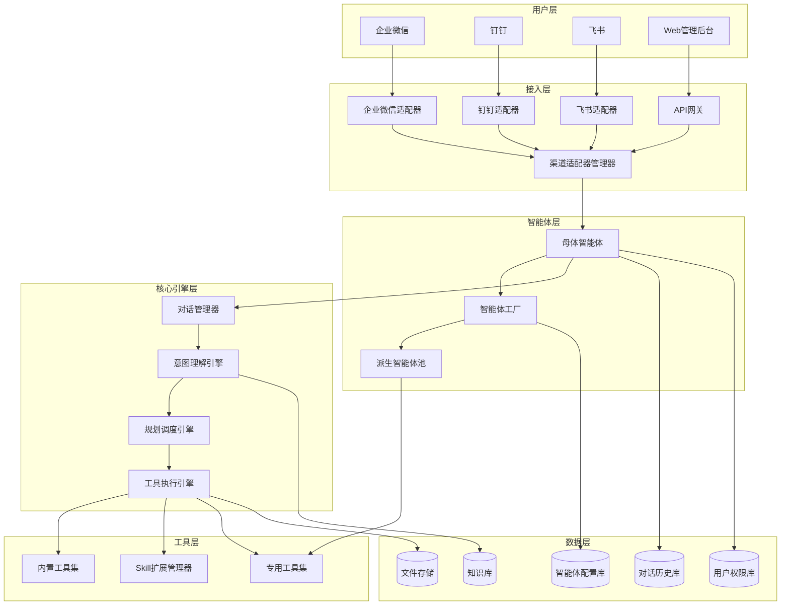
```mermaid
graph TB
    subgraph 用户层
        A[企业微信]
        B[钉钉]
        C[飞书]
        D[Web管理后台]
    end
    
    subgraph 接入层
        E[渠道适配器管理器]
        F[企业微信适配器]
        G[钉钉适配器]
        H[飞书适配器]
        I[API网关]
    end
    
    subgraph 智能体层
        J[母体智能体]
        K[智能体工厂]
        L[派生智能体池]
    end
    
    subgraph 核心引擎层
        M[对话管理器]
        N[意图理解引擎]
        O[规划调度引擎]
        P[工具执行引擎]
    end
    
    subgraph 工具层
        Q[内置工具集]
        R[Skill扩展管理器]
        S[专用工具集]
    end
    
    subgraph 数据层
        T[(对话历史库)]
        U[(知识库)]
        V[(用户权限库)]
        W[(文件存储)]
        X[(智能体配置库)]
    end
    
    A --> F
    B --> G
    C --> H
    D --> I
    F --> E
    G --> E
    H --> E
    I --> E
    E --> J
    J --> K
    K --> L
    J --> M
    M --> N
    N --> O
    O --> P
    P --> Q
    P --> R
    P --> S
    L --> S
    J --> T
    N --> U
    J --> V
    P --> W
    K --> X
```

### 2.2 架构分层说明

| 层级 | 组件 | 职责 |
|------|------|------|
| 用户层 | 企业微信、钉钉、飞书、Web管理后台 | 多渠道用户交互入口 |
| 接入层 | 渠道适配器管理器、各平台适配器、API网关 | 协议转换、消息标准化、请求路由、认证鉴权 |
| 智能体层 | 母体智能体、智能体工厂、派生智能体池 | 智能体管理与协作，任务分解与委派 |
| 核心引擎层 | 对话管理器、意图理解引擎、规划调度引擎、工具执行引擎 | 核心业务逻辑处理，与渠道无关 |
| 工具层 | 内置工具集、Skill扩展管理器、专用工具集 | 具体任务执行能力，支持动态扩展 |
| 数据层 | 各类存储 | 数据持久化，包括智能体配置和记忆存储 |

### 2.3 多渠道适配架构

系统采用**适配器模式**实现多渠道接入，核心设计原则：

1. **统一消息模型**：所有渠道消息转换为统一的消息格式
2. **适配器抽象层**：定义标准接口，各渠道实现具体适配逻辑
3. **渠道特性隔离**：渠道特有功能通过扩展接口实现

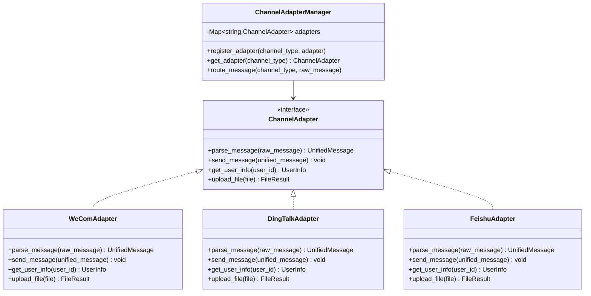
```mermaid
classDiagram
    class ChannelAdapter {
        <<interface>>
        +parse_message(raw_message) UnifiedMessage
        +send_message(unified_message) void
        +get_user_info(user_id) UserInfo
        +upload_file(file) FileResult
    }
    
    class WeComAdapter {
        +parse_message(raw_message) UnifiedMessage
        +send_message(unified_message) void
        +get_user_info(user_id) UserInfo
        +upload_file(file) FileResult
    }
    
    class DingTalkAdapter {
        +parse_message(raw_message) UnifiedMessage
        +send_message(unified_message) void
        +get_user_info(user_id) UserInfo
        +upload_file(file) FileResult
    }
    
    class FeishuAdapter {
        +parse_message(raw_message) UnifiedMessage
        +send_message(unified_message) void
        +get_user_info(user_id) UserInfo
        +upload_file(file) FileResult
    }
    
    class ChannelAdapterManager {
        -Map~string,ChannelAdapter~ adapters
        +register_adapter(channel_type, adapter)
        +get_adapter(channel_type) ChannelAdapter
        +route_message(channel_type, raw_message)
    }
    
    ChannelAdapter <|.. WeComAdapter
    ChannelAdapter <|.. DingTalkAdapter
    ChannelAdapter <|.. FeishuAdapter
    ChannelAdapterManager --> ChannelAdapter
```

**统一消息模型**：

```json
{
  "unified_message": {
    "message_id": "string",
    "channel_type": "wecom|dingtalk|feishu|web",
    "user_id": "string",
    "user_name": "string",
    "department_id": "string",
    "message_type": "text|image|file|event",
    "content": {
      "text": "string",
      "attachments": []
    },
    "timestamp": "timestamp",
    "raw_message": {}
  }
}
```

---

## 3. 核心模块设计

### 3.1 对话管理器（Dialog Manager）

**职责**：
- 管理多轮对话上下文
- 维护会话状态
- 处理对话流程控制

**核心流程**：

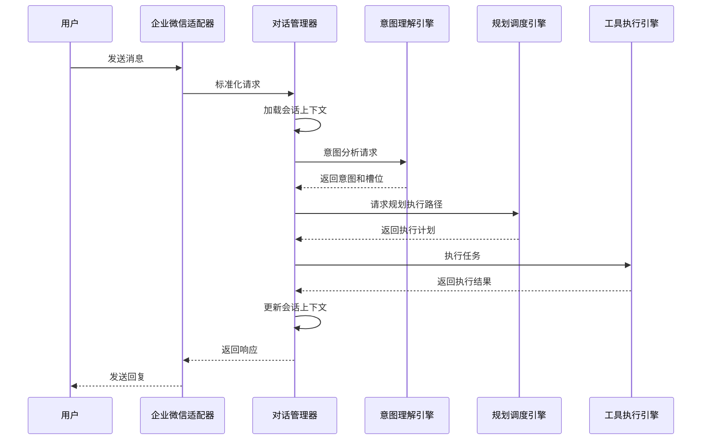
```mermaid
sequenceDiagram
    participant User as 用户
    participant Adapter as 企业微信适配器
    participant DM as 对话管理器
    participant NLU as 意图理解引擎
    participant Planner as 规划调度引擎
    participant Executor as 工具执行引擎
    
    User->>Adapter: 发送消息
    Adapter->>DM: 标准化请求
    DM->>DM: 加载会话上下文
    DM->>NLU: 意图分析请求
    NLU-->>DM: 返回意图和槽位
    DM->>Planner: 请求规划执行路径
    Planner-->>DM: 返回执行计划
    DM->>Executor: 执行任务
    Executor-->>DM: 返回执行结果
    DM->>DM: 更新会话上下文
    DM-->>Adapter: 返回响应
    Adapter-->>User: 发送回复
```

**关键数据结构**：

```json
{
  "session": {
    "session_id": "string",
    "user_id": "string",
    "created_at": "timestamp",
    "updated_at": "timestamp",
    "context": {
      "current_intent": "string",
      "slots": {},
      "history": [],
      "state": "string"
    }
  }
}
```

---

### 3.2 意图理解引擎（Intent Understanding Engine）

**职责**：
- 解析用户输入的自然语言
- 识别用户意图
- 提取关键实体和参数

**设计思路**：
- 基于大语言模型（LLM）进行意图识别
- 支持预定义意图模板和动态意图发现
- 实体抽取与槽位填充

**意图分类体系**：

| 意图类别 | 具体意图 | 示例 |
|----------|----------|------|
| 文档处理 | doc_create, doc_edit, doc_summarize, doc_translate | "帮我写一份周报" |
| 数据分析 | data_query, data_visualize, data_export, data_analysis | "分析上个月的销售数据" |
| 信息检索 | info_search, info_extract, info_compare | "查找关于XX的政策文件" |
| 系统交互 | help, feedback, settings | "你能做什么" |

**核心流程**：

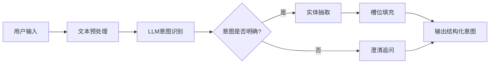
```mermaid
flowchart LR
    A[用户输入] --> B[文本预处理]
    B --> C[LLM意图识别]
    C --> D{意图是否明确?}
    D -->|是| E[实体抽取]
    D -->|否| F[澄清追问]
    E --> G[槽位填充]
    G --> H[输出结构化意图]
    F --> H
```

---

### 3.3 规划调度引擎（Planning & Scheduling Engine）

**职责**：
- 根据意图生成执行计划
- 分解复杂任务为子任务
- 协调多个工具和智能体的执行顺序
- 处理任务依赖关系
- 管理派生智能体的创建和调度
- 任务进度跟踪与约束管理

**规划策略**：

1. **单步任务**：直接映射到对应工具
2. **多步任务**：分解为有依赖关系的子任务序列
3. **多智能体协作**：复杂任务委派给专业派生智能体
4. **动态规划**：根据执行反馈动态调整计划

#### 3.3.0 TodoManager（任务管理器）

**设计理念**：

借鉴开源实现，引入任务管理器来跟踪多步骤工作，确保任务执行的有序性和可追踪性。

**核心约束**：

- **单一焦点原则**：同一时刻只能有一个任务处于`in_progress`状态
- **任务数量限制**：最多同时跟踪20个任务
- **状态约束**：任务状态只能是`pending`、`in_progress`、`completed`

**TodoManager设计**：

```python
class TodoManager:
    """任务列表管理器，带约束"""
    
    def __init__(self):
        self.items = []
        self.max_items = 20
    
    def update(self, items: list) -> str:
        """更新任务列表"""
        validated = []
        in_progress_count = 0
        
        for i, item in enumerate(items):
            content = str(item.get("content", "")).strip()
            status = str(item.get("status", "pending")).lower()
            active_form = str(item.get("activeForm", "")).strip()
            
            # 验证必填字段
            if not content or not active_form:
                raise ValueError(f"任务{i}: content和activeForm必填")
            
            # 验证状态值
            if status not in ("pending", "in_progress", "completed"):
                raise ValueError(f"任务{i}: 无效状态 '{status}'")
            
            # 约束：只能有一个in_progress
            if status == "in_progress":
                in_progress_count += 1
                if in_progress_count > 1:
                    raise ValueError("只能有一个任务处于in_progress状态")
            
            validated.append({
                "content": content,
                "status": status,
                "activeForm": active_form
            })
        
        # 限制任务数量
        self.items = validated[:self.max_items]
        return self.render()
    
    def render(self) -> str:
        """渲染任务列表"""
        if not self.items:
            return "暂无任务。"
        
        lines = []
        for t in self.items:
            if t["status"] == "completed":
                mark = "[x]"
            elif t["status"] == "in_progress":
                mark = "[>]"
            else:
                mark = "[ ]"
            lines.append(f"{mark} {t['content']}")
        
        done = sum(1 for t in self.items if t["status"] == "completed")
        return "\n".join(lines) + f"\n(完成: {done}/{len(self.items)})"
```

**TodoWrite工具定义**：

```json
{
  "name": "TodoWrite",
  "description": "更新任务列表。用于跟踪多步骤工作的进度。",
  "input_schema": {
    "type": "object",
    "properties": {
      "items": {
        "type": "array",
        "items": {
          "type": "object",
          "properties": {
            "content": {
              "type": "string",
              "description": "任务内容描述"
            },
            "status": {
              "type": "string",
              "enum": ["pending", "in_progress", "completed"],
              "description": "任务状态"
            },
            "activeForm": {
              "type": "string",
              "description": "进行中的简短描述，如'正在分析代码'"
            }
          },
          "required": ["content", "status", "activeForm"]
        }
      }
    },
    "required": ["items"]
  }
}
```

**任务列表示例**：

```
[ ] 分析用户需求
[>] 设计数据库架构
[ ] 实现API接口
[ ] 编写单元测试
[ ] 部署上线
(完成: 0/5)
```

#### 3.3.1 多智能体协作架构

**核心概念**：

系统采用**母体智能体 + 派生智能体**的架构，母体智能体负责整体规划和调度，派生智能体专注于特定领域的任务执行。

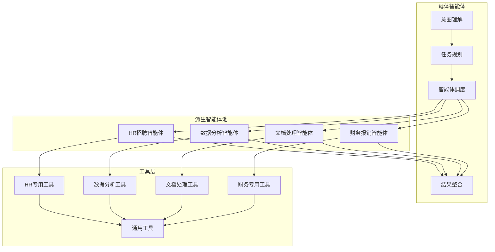
```mermaid
graph TB
    subgraph 母体智能体
        A[意图理解]
        B[任务规划]
        C[智能体调度]
        D[结果整合]
    end
    
    subgraph 派生智能体池
        E[HR招聘智能体]
        F[数据分析智能体]
        G[文档处理智能体]
        H[财务报销智能体]
    end
    
    subgraph 工具层
        I[通用工具]
        J[HR专用工具]
        K[数据分析工具]
        L[文档处理工具]
        M[财务专用工具]
    end
    
    A --> B
    B --> C
    C --> E
    C --> F
    C --> G
    C --> H
    E --> D
    F --> D
    G --> D
    H --> D
    E --> J
    F --> K
    G --> L
    H --> M
    J --> I
    K --> I
    L --> I
    M --> I
```

#### 3.3.2 派生智能体设计

**派生智能体定义**：

派生智能体是从母体智能体派生的专业化智能体，继承母体的核心能力，同时具备特定领域的约束、工具和上下文。

**派生智能体配置文件**：

```yaml
# agents/hr_recruitment_agent.yaml
agent:
  id: hr_recruitment_agent
  name: HR招聘智能体
  parent: master_agent
  version: 1.0.0
  
  # 继承的能力
  inherits:
    - planning_capability
    - memory_capability
    - dialog_capability
  
  # 领域约束
  constraints:
    domain: HR招聘
    scope:
      - 职位发布
      - 简历筛选
      - 面试安排
      - offer管理
    restrictions:
      - 不处理薪资谈判
      - 不处理员工入职后事务
  
  # 专用上下文Prompt
  context_prompt: |
    你是一个专业的HR招聘智能体，专注于人才招聘工作。
    
    你的职责包括：
    1. 发布职位信息到各招聘平台
    2. 筛选和评估候选人简历
    3. 协调面试安排
    4. 跟踪招聘进度
    
    在处理任务时，请遵循以下原则：
    - 公平公正地评估每位候选人
    - 保护候选人隐私信息
    - 及时更新招聘状态
    
    当前招聘需求：{{current_requirements}}
    已安排面试：{{scheduled_interviews}}
  
  # 专用工具集
  tools:
    - job_post_publisher      # 职位发布工具
    - resume_parser          # 简历解析工具
    - interview_scheduler    # 面试安排工具
    - candidate_tracker      # 候选人跟踪工具
    
  # 专用Skills
  skills:
    - skills/hr/resume_screening.md
    - skills/hr/interview_evaluation.md
    - skills/hr/offer_generation.md
    
  # 专用记忆
  memory:
    type: file
    path: memory/agents/hr_recruitment/
    includes:
      - candidate_profiles.md
      - position_requirements.md
      - interview_records.md
```

**派生智能体模板结构**：

```
agents/
├── master_agent.yaml           # 母体智能体配置
├── hr_recruitment_agent.yaml   # HR招聘智能体
├── data_analysis_agent.yaml    # 数据分析智能体
├── document_agent.yaml         # 文档处理智能体
├── finance_agent.yaml          # 财务报销智能体
└── templates/
    └── agent_template.yaml     # 智能体配置模板
```

#### 3.3.3 智能体派生机制

**派生流程**：

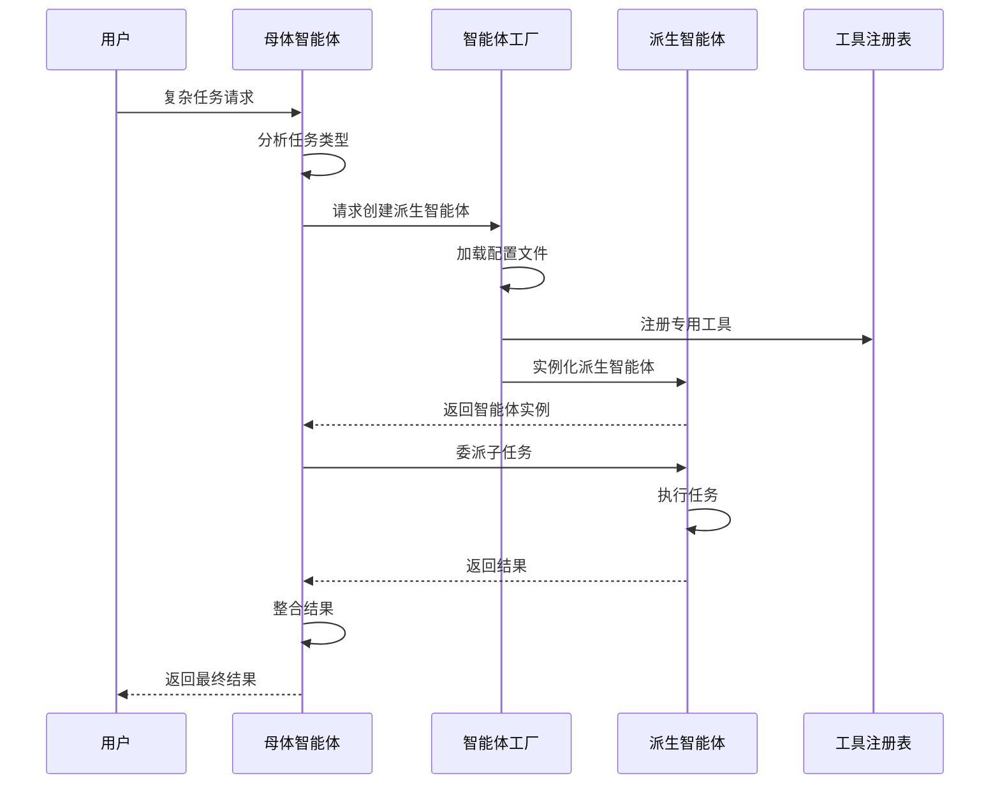
```mermaid
sequenceDiagram
    participant User as 用户
    participant Master as 母体智能体
    participant Factory as 智能体工厂
    participant Derived as 派生智能体
    participant Tools as 工具注册表
    
    User->>Master: 复杂任务请求
    Master->>Master: 分析任务类型
    Master->>Factory: 请求创建派生智能体
    Factory->>Factory: 加载配置文件
    Factory->>Tools: 注册专用工具
    Factory->>Derived: 实例化派生智能体
    Derived-->>Master: 返回智能体实例
    Master->>Derived: 委派子任务
    Derived->>Derived: 执行任务
    Derived-->>Master: 返回结果
    Master->>Master: 整合结果
    Master-->>User: 返回最终结果
```

**智能体工厂设计**：

```python
class AgentFactory:
    """智能体工厂，负责创建和管理派生智能体"""
    
    def __init__(self, master_agent):
        self.master = master_agent
        self.agent_pool = {}  # 智能体实例池
        self.config_loader = ConfigLoader()
        
    def create_agent(self, agent_type: str, context: dict) -> DerivedAgent:
        """创建派生智能体"""
        # 加载配置
        config = self.config_loader.load(f"agents/{agent_type}.yaml")
        
        # 创建智能体实例
        agent = DerivedAgent(
            agent_id=config.id,
            parent=self.master,
            constraints=config.constraints,
            context_prompt=self._render_prompt(config.context_prompt, context),
            tools=self._load_tools(config.tools),
            skills=self._load_skills(config.skills),
            memory=self._init_memory(config.memory)
        )
        
        # 注册到池中
        self.agent_pool[agent.agent_id] = agent
        
        return agent
    
    def get_or_create(self, agent_type: str, context: dict) -> DerivedAgent:
        """获取或创建派生智能体"""
        if agent_type in self.agent_pool:
            return self.agent_pool[agent_type]
        return self.create_agent(agent_type, context)
```

#### 3.3.4 任务分解与委派

**任务分解策略**：

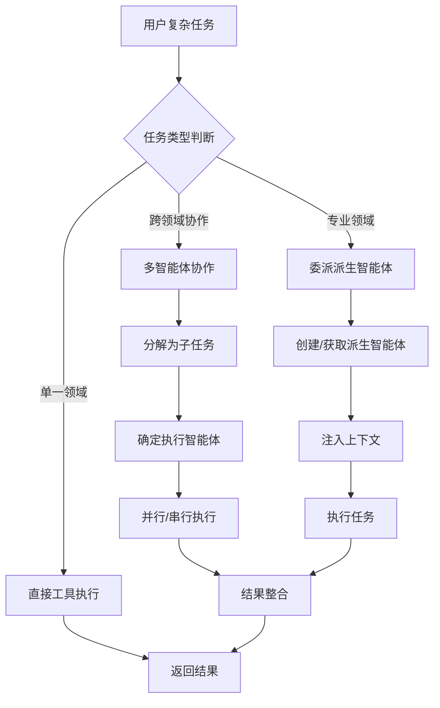
```mermaid
flowchart TB
    A[用户复杂任务] --> B{任务类型判断}
    
    B -->|单一领域| C[直接工具执行]
    B -->|跨领域协作| D[多智能体协作]
    B -->|专业领域| E[委派派生智能体]
    
    D --> F[分解为子任务]
    F --> G[确定执行智能体]
    G --> H[并行/串行执行]
    H --> I[结果整合]
    
    E --> J[创建/获取派生智能体]
    J --> K[注入上下文]
    K --> L[执行任务]
    L --> I
    
    C --> M[返回结果]
    I --> M
```

**任务分解示例**：

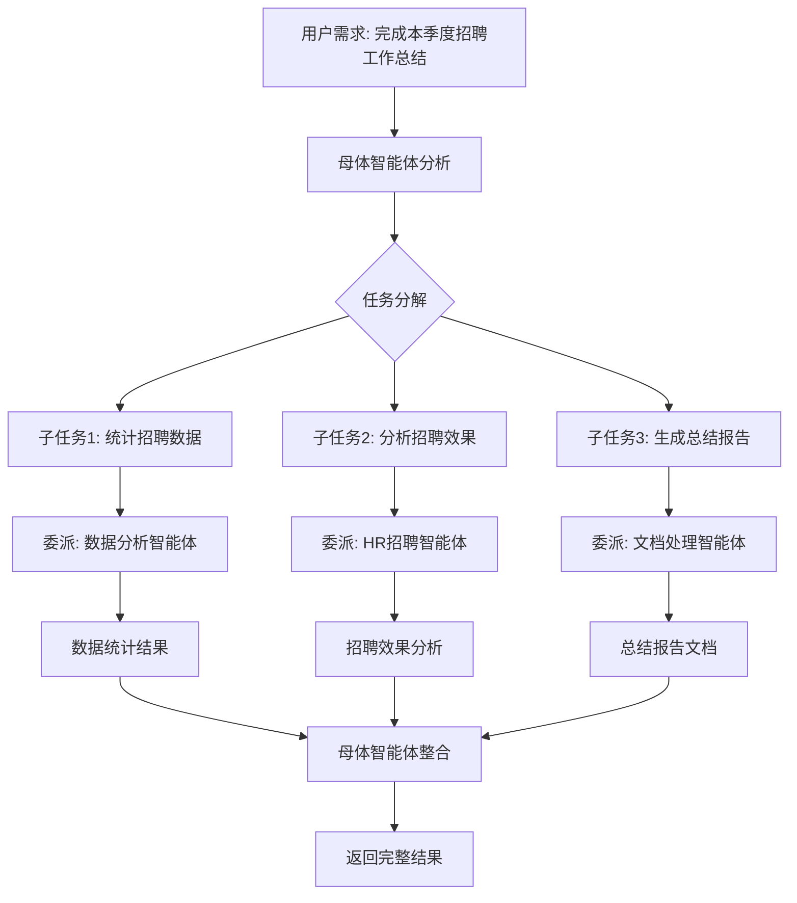
```mermaid
graph TD
    A[用户需求: 完成本季度招聘工作总结] --> B[母体智能体分析]
    
    B --> C{任务分解}
    
    C --> D[子任务1: 统计招聘数据]
    C --> E[子任务2: 分析招聘效果]
    C --> F[子任务3: 生成总结报告]
    
    D --> G[委派: 数据分析智能体]
    E --> H[委派: HR招聘智能体]
    F --> I[委派: 文档处理智能体]
    
    G --> J[数据统计结果]
    H --> K[招聘效果分析]
    I --> L[总结报告文档]
    
    J --> M[母体智能体整合]
    K --> M
    L --> M
    
    M --> N[返回完整结果]
```

**执行计划数据结构（增强版）**：

```json
{
  "plan": {
    "plan_id": "string",
    "intent": "string",
    "created_at": "timestamp",
    "execution_mode": "sequential|parallel|hybrid",
    "tasks": [
      {
        "task_id": "string",
        "task_type": "tool|agent",
        "executor": {
          "type": "tool|derived_agent",
          "name": "hr_recruitment_agent",
          "context_override": {}
        },
        "parameters": {},
        "dependencies": ["task_id_1"],
        "status": "pending|running|completed|failed",
        "result": {}
      }
    ]
  }
}
```

#### 3.3.5 智能体间协作模式

**协作模式**：

| 模式 | 描述 | 适用场景 |
|------|------|----------|
| **委派模式** | 母体委派任务给派生智能体 | 专业领域任务 |
| **协作模式** | 多个派生智能体并行协作 | 跨领域复杂任务 |
| **层级模式** | 派生智能体再委派给子智能体 | 超复杂任务 |
| **回退模式** | 派生智能体回退到母体处理 | 超出范围的任务 |

**协作通信机制**：

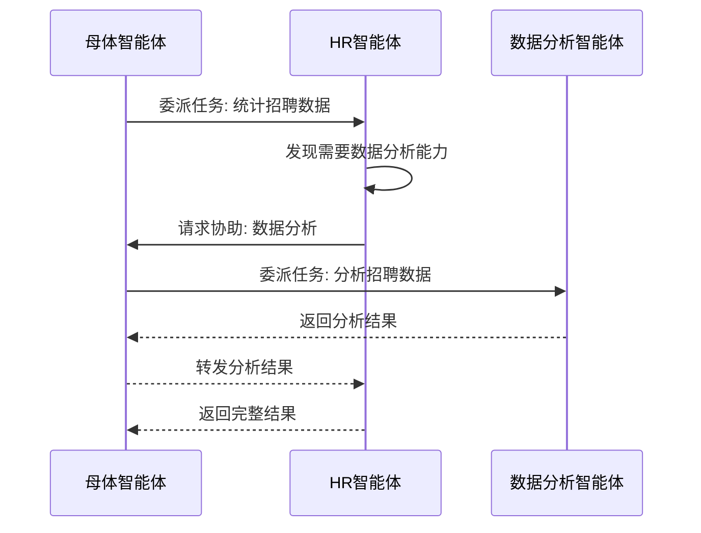
```mermaid
sequenceDiagram
    participant M as 母体智能体
    participant A as HR智能体
    participant B as 数据分析智能体
    
    M->>A: 委派任务: 统计招聘数据
    A->>A: 发现需要数据分析能力
    A->>M: 请求协助: 数据分析
    M->>B: 委派任务: 分析招聘数据
    B-->>M: 返回分析结果
    M-->>A: 转发分析结果
    A-->>M: 返回完整结果
```

**智能体间消息格式**：

```json
{
  "agent_message": {
    "message_id": "uuid",
    "from_agent": "hr_recruitment_agent",
    "to_agent": "master_agent",
    "message_type": "task_result|assistance_request|delegation",
    "content": {
      "task_id": "string",
      "status": "completed|need_assistance",
      "result": {},
      "assistance_needed": {
        "capability": "data_analysis",
        "context": {}
      }
    },
    "timestamp": "datetime"
  }
}
```

---

### 3.4 工具执行引擎（Tool Execution Engine）

**职责**：
- 管理工具注册和发现
- 执行具体工具调用
- 处理工具执行结果
- 异常处理和重试
- 支持Skill文件动态扩展

**工具来源架构**：

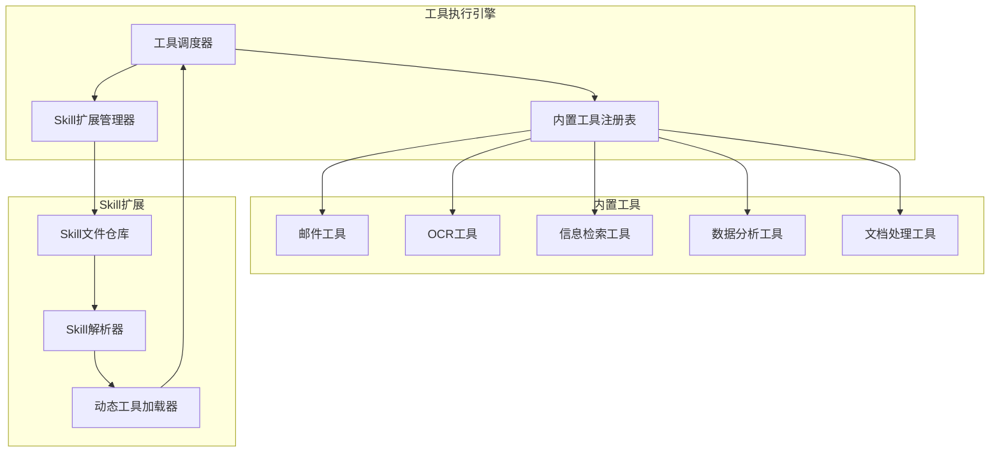
```mermaid
graph TB
    subgraph 工具执行引擎
        A[工具调度器]
        B[内置工具注册表]
        C[Skill扩展管理器]
    end
    
    subgraph 内置工具
        D[邮件工具]
        E[OCR工具]
        F[信息检索工具]
        G[数据分析工具]
        H[文档处理工具]
    end
    
    subgraph Skill扩展
        I[Skill文件仓库]
        J[Skill解析器]
        K[动态工具加载器]
    end
    
    A --> B
    A --> C
    B --> D
    B --> E
    B --> F
    B --> G
    B --> H
    C --> I
    I --> J
    J --> K
    K --> A
```

**工具抽象模型**：

```json
{
  "tool": {
    "name": "string",
    "description": "string",
    "source": "builtin|skill",
    "category": "email|ocr|search|data|document|office",
    "parameters": {
      "type": "object",
      "properties": {},
      "required": []
    },
    "returns": {
      "type": "object",
      "properties": {}
    },
    "permissions": ["permission_1", "permission_2"],
    "skill_file": "path/to/skill.md"
  }
}
```

**内置工具分类设计（办公场景）**：

| 类别 | 工具名称 | 功能描述 | 优先级 |
|------|----------|----------|--------|
| 邮件处理 | email_send | 发送邮件 | P0 |
| 邮件处理 | email_read | 读取邮件列表 | P0 |
| 邮件处理 | email_search | 搜索邮件 | P1 |
| OCR识别 | ocr_image | 图片文字识别 | P0 |
| OCR识别 | ocr_pdf | PDF文档识别 | P1 |
| OCR识别 | ocr_handwriting | 手写文字识别 | P2 |
| 信息检索 | web_search | 网络搜索 | P0 |
| 信息检索 | kb_search | 知识中心搜索 | P0 |
| 信息检索 | doc_search | 文档检索 | P1 |
| 数据分析 | sql_query | 数据库查询 | P0 |
| 数据分析 | chart_generator | 图表生成 | P0 |
| 数据分析 | data_export | 数据导出 | P1 |
| 数据分析 | report_generator | 报告生成 | P1 |
| 文档处理 | doc_writer | 文档撰写 | P0 |
| 文档处理 | doc_summarizer | 文档摘要 | P0 |
| 文档处理 | doc_translator | 文档翻译 | P1 |
| 文档处理 | doc_format | 文档格式转换 | P1 |

---

### 3.5 Skill扩展机制

**设计理念**：

核心思想是**知识外化**（Knowledge Externalization）：

> **传统AI**：知识锁定在模型参数中
> - 教授新技能：收集数据 → 训练 → 部署
> - 成本：$10K-$1M+，时间：数周
> - 需要ML专业知识、GPU集群
>
> **Skills**：知识存储在可编辑文件中
> - 教授新技能：编写SKILL.md文件
> - 成本：免费，时间：分钟级
> - 任何人都可以做

**工具vs技能区分**：

| 概念 | 定义 | 示例 |
|------|------|------|
| **Tool** | 模型能做什么（能力） | bash, read_file, email_send, sql_query |
| **Skill** | 模型知道如何做（知识） | PDF处理技巧, MCP开发规范, HR招聘流程 |

**渐进式披露机制**：

为保持上下文精简同时支持任意深度，采用三层渐进式披露：

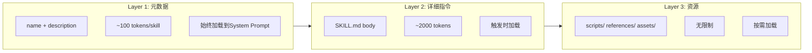
```mermaid
graph LR
    subgraph Layer1[Layer 1: 元数据]
        A[name + description]
        B[~100 tokens/skill]
        C[始终加载到System Prompt]
    end
    
    subgraph Layer2[Layer 2: 详细指令]
        D[SKILL.md body]
        E[~2000 tokens]
        F[触发时加载]
    end
    
    subgraph Layer3[Layer 3: 资源]
        G[scripts/ references/ assets/]
        H[无限制]
        I[按需加载]
    end
    
    Layer1 --> Layer2 --> Layer3
```

**Skill文件标准格式**：

```markdown
---
name: pdf_processing
description: 处理PDF文件。用于读取、创建、合并PDF文档。
version: 1.0.0
author: system
category: document
tags: [pdf, document, ocr]
trigger_keywords: [pdf, PDF, 文档识别]
---

# PDF处理技能

## 概述
本技能提供PDF文档的完整处理能力，包括读取、创建、合并等操作。

## 最佳实践

### 读取PDF
- 快速提取：使用pdftotext
  ```bash
  pdftotext input.pdf -
  ```
- 高质量提取：使用PyMuPDF
  ```python
  import fitz  # PyMuPDF
  doc = fitz.open("input.pdf")
  for page in doc:
      text = page.get_text()
  ```

### 创建PDF
- 从Markdown：使用pandoc
  ```bash
  pandoc input.md -o output.pdf
  ```

## 注意事项
- 大文件处理时注意内存使用
- OCR识别需要额外配置

## 相关工具
- pdftotext
- PyMuPDF
- pandoc
```

**Skill仓库结构**：

```
skills/
├── pdf/
│   ├── SKILL.md              # 必需：技能定义
│   ├── scripts/              # 可选：辅助脚本
│   │   ├── extract.sh
│   │   └── merge.py
│   ├── references/           # 可选：参考文档
│   │   └── pdf_spec.md
│   └── assets/               # 可选：模板文件
│       └── template.pdf
├── hr-recruitment/
│   ├── SKILL.md
│   ├── scripts/
│   │   └── resume_parser.py
│   └── assets/
│       └── offer_template.docx
├── data-analysis/
│   └── SKILL.md
└── code-review/
    └── SKILL.md
```

**缓存保持注入机制**：

关键洞察：Skill内容应放入tool_result（用户消息），而非system prompt。

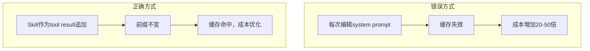
```mermaid
graph TB
    subgraph 错误方式
        A1[每次编辑system prompt] --> B1[缓存失效]
        B1 --> C1[成本增加20-50倍]
    end
    
    subgraph 正确方式
        A2[Skill作为tool result追加] --> B2[前缀不变]
        B2 --> C2[缓存命中，成本优化]
    end
```

**Skill加载流程**：

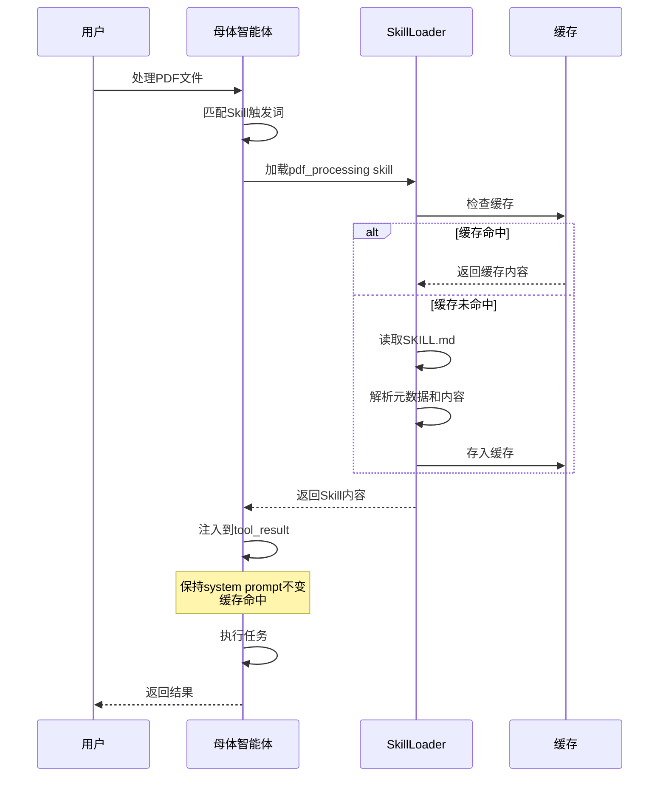
```mermaid
sequenceDiagram
    participant User as 用户
    participant Agent as 母体智能体
    participant Loader as SkillLoader
    participant Cache as 缓存
    
    User->>Agent: 处理PDF文件
    Agent->>Agent: 匹配Skill触发词
    Agent->>Loader: 加载pdf_processing skill
    Loader->>Cache: 检查缓存
    
    alt 缓存命中
        Cache-->>Loader: 返回缓存内容
    else 缓存未命中
        Loader->>Loader: 读取SKILL.md
        Loader->>Loader: 解析元数据和内容
        Loader->>Cache: 存入缓存
    end
    
    Loader-->>Agent: 返回Skill内容
    Agent->>Agent: 注入到tool_result
    Note over Agent: 保持system prompt不变<br/>缓存命中
    Agent->>Agent: 执行任务
    Agent-->>User: 返回结果
```

**SkillLoader核心实现**：

```python
class SkillLoader:
    """技能加载器，管理技能的加载和缓存"""
    
    def __init__(self, skills_dir: Path):
        self.skills_dir = skills_dir
        self.skills = {}  # 技能注册表（仅元数据）
        self.cache = {}   # 内容缓存
        self.load_skill_metadata()  # 启动时仅加载元数据
    
    def load_skill_metadata(self):
        """启动时仅加载元数据（Layer 1）"""
        for skill_dir in self.skills_dir.iterdir():
            skill_md = skill_dir / "SKILL.md"
            if skill_md.exists():
                metadata = self.parse_frontmatter(skill_md)
                self.skills[metadata["name"]] = {
                    "description": metadata["description"],
                    "path": skill_md,
                    "dir": skill_dir,
                    "loaded": False
                }
    
    def get_skill_descriptions(self) -> str:
        """生成技能描述用于system prompt（Layer 1）"""
        return "\n".join(
            f"- {name}: {skill['description']}"
            for name, skill in self.skills.items()
        )
    
    def load_skill_content(self, name: str) -> str:
        """按需加载完整技能内容（Layer 2+3）"""
        if name not in self.skills:
            return None
        
        # 检查缓存
        if name in self.cache:
            return self.cache[name]
        
        # 加载内容
        skill = self.skills[name]
        content = self.parse_skill_body(skill["path"])
        
        # 添加资源提示（Layer 3）
        resources = self.list_resources(skill["dir"])
        if resources:
            content += f"\n\n**可用资源:**\n{resources}"
        
        # 缓存并返回
        self.cache[name] = content
        return content
    
    def list_resources(self, skill_dir: Path) -> str:
        """列出技能目录下的资源"""
        resources = []
        for folder, label in [
            ("scripts", "脚本"),
            ("references", "参考文档"),
            ("assets", "资源文件")
        ]:
            folder_path = skill_dir / folder
            if folder_path.exists():
                files = list(folder_path.glob("*"))
                if files:
                    resources.append(f"{label}: {', '.join(f.name for f in files)}")
        return "\n".join(f"- {r}" for r in resources)
```

**Skill工具定义**：

```json
{
  "name": "Skill",
  "description": "加载技能以获取专业知识。当任务匹配技能描述时立即调用。\n\n可用技能:\n- pdf_processing: 处理PDF文件\n- hr_recruitment: HR招聘流程\n- data_analysis: 数据分析\n\n何时使用:\n- 当用户任务匹配技能描述时立即调用\n- 在尝试领域特定工作之前调用",
  "input_schema": {
    "type": "object",
    "properties": {
      "skill": {
        "type": "string",
        "description": "要加载的技能名称"
      }
    },
    "required": ["skill"]
  }
}
```

**Skill工具执行**：

```python
def run_skill(skill_name: str) -> str:
    """加载技能并注入到对话中"""
    content = SKILLS.load_skill_content(skill_name)
    
    if content is None:
        available = ", ".join(SKILLS.list_skills()) or "none"
        return f"错误: 未知技能 '{skill_name}'。可用技能: {available}"
    
    # 包装在标签中，让模型知道这是技能内容
    return f"""<skill-loaded name="{skill_name}">
{content}
</skill-loaded>

请按照上述技能说明完成用户任务。"""
```

---

### 3.6 多渠道适配模块

**职责**：
- 统一管理各聊天平台适配器
- 消息格式标准化
- 平台特性适配

**适配器架构**：

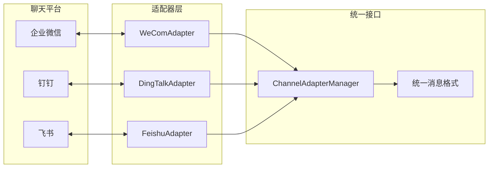
```mermaid
graph LR
    subgraph 聊天平台
        A[企业微信]
        B[钉钉]
        C[飞书]
    end
    
    subgraph 适配器层
        D[WeComAdapter]
        E[DingTalkAdapter]
        F[FeishuAdapter]
    end
    
    subgraph 统一接口
        G[ChannelAdapterManager]
        H[统一消息格式]
    end
    
    A <--> D
    B <--> E
    C <--> F
    D --> G
    E --> G
    F --> G
    G --> H
```

**各平台特性对比**：

| 特性 | 企业微信 | 钉钉 | 飞书 |
|------|----------|------|------|
| 消息类型 | 文本/图片/文件/卡片 | 文本/图片/文件/卡片 | 文本/图片/文件/卡片 |
| 认证方式 | OAuth2.0 | OAuth2.0 | OAuth2.0 |
| 回调机制 | HTTP回调 | HTTP回调/Stream | HTTP回调/长连接 |
| 文件上传 | 临时素材/永久素材 | 媒体文件 | 文件Token |
| 特有功能 | 企业支付 | 审批流程 | 多维表格 |

**适配器接口定义**：

```python
class ChannelAdapter(ABC):
    """渠道适配器抽象基类"""
    
    @abstractmethod
    async def parse_message(self, raw_message: dict) -> UnifiedMessage:
        """解析原始消息为统一格式"""
        pass
    
    @abstractmethod
    async def send_message(self, message: UnifiedMessage) -> bool:
        """发送统一格式消息"""
        pass
    
    @abstractmethod
    async def get_user_info(self, user_id: str) -> UserInfo:
        """获取用户信息"""
        pass
    
    @abstractmethod
    async def upload_file(self, file: bytes, filename: str) -> FileResult:
        """上传文件"""
        pass
    
    @abstractmethod
    def get_channel_type(self) -> ChannelType:
        """获取渠道类型"""
        pass
```

---

## 4. 安全与权限控制方案

### 4.1 多渠道统一认证机制

系统支持企业微信、钉钉、飞书等多渠道接入，采用统一的认证流程：

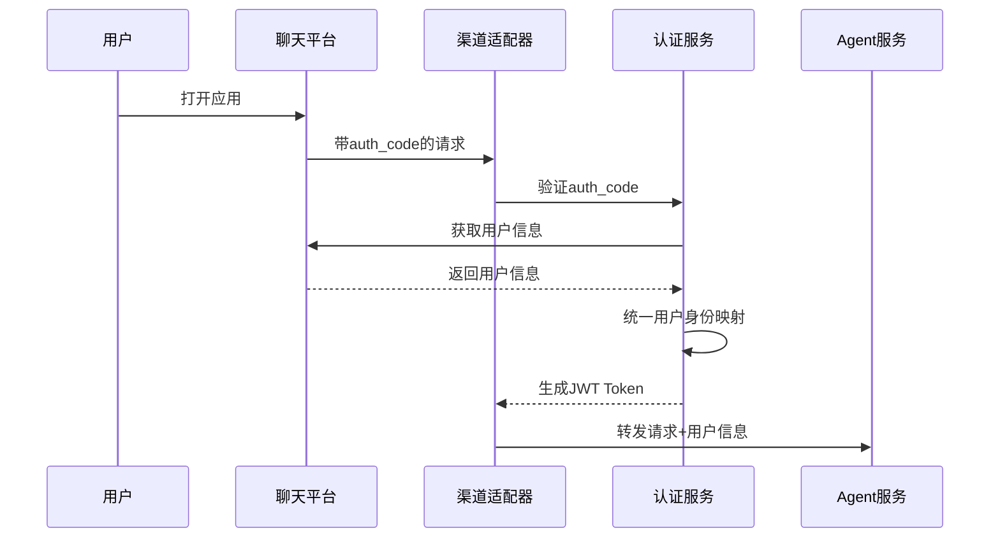
```mermaid
sequenceDiagram
    participant User as 用户
    participant Channel as 聊天平台
    participant Adapter as 渠道适配器
    participant Auth as 认证服务
    participant Agent as Agent服务
    
    User->>Channel: 打开应用
    Channel->>Adapter: 带auth_code的请求
    Adapter->>Auth: 验证auth_code
    Auth->>Channel: 获取用户信息
    Channel-->>Auth: 返回用户信息
    Auth->>Auth: 统一用户身份映射
    Auth-->>Adapter: 生成JWT Token
    Adapter->>Agent: 转发请求+用户信息
```

**统一用户身份模型**：

```json
{
  "unified_user": {
    "user_id": "uuid",
    "channel_user_id": "string",
    "channel_type": "wecom|dingtalk|feishu",
    "name": "string",
    "avatar": "string",
    "department_id": "string",
    "department_path": ["一级部门", "二级部门"],
    "role": "string",
    "permissions": ["permission_1", "permission_2"]
  }
}
```

**各平台认证配置**：

| 平台 | 认证方式 | 配置项 |
|------|----------|--------|
| 企业微信 | OAuth2.0 | CorpId, AgentId, Secret |
| 钉钉 | OAuth2.0 | AppKey, AppSecret |
| 飞书 | OAuth2.0 | AppId, AppSecret |

### 4.2 权限控制模型

采用RBAC（基于角色的访问控制）模型：

| 角色 | 权限范围 |
|------|----------|
| 普通员工 | 基础文档处理、个人数据分析、公开信息检索 |
| 部门管理员 | 部门级数据分析、部门文档管理 |
| 系统管理员 | 系统配置、工具管理、用户管理 |

### 4.3 数据安全措施

1. **传输安全**：全链路HTTPS加密
2. **存储安全**：敏感数据加密存储
3. **访问审计**：操作日志记录
4. **数据隔离**：租户级数据隔离

---

## 5. 数据存储方案

### 5.1 存储架构

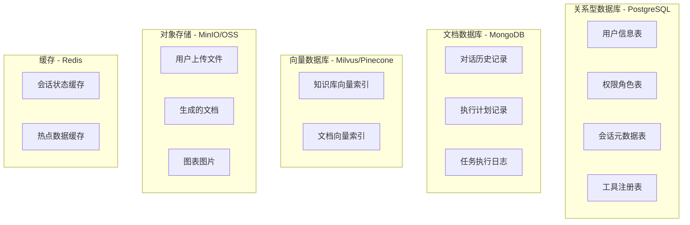
```mermaid
graph TB
    subgraph 关系型数据库 - PostgreSQL
        A[用户信息表]
        B[权限角色表]
        C[会话元数据表]
        D[工具注册表]
    end
    
    subgraph 文档数据库 - MongoDB
        E[对话历史记录]
        F[执行计划记录]
        G[任务执行日志]
    end
    
    subgraph 向量数据库 - Milvus/Pinecone
        H[知识库向量索引]
        I[文档向量索引]
    end
    
    subgraph 对象存储 - MinIO/OSS
        J[用户上传文件]
        K[生成的文档]
        L[图表图片]
    end
    
    subgraph 缓存 - Redis
        M[会话状态缓存]
        N[热点数据缓存]
    end
```

### 5.2 核心数据表设计

**用户信息表（users）**：

| 字段 | 类型 | 说明 |
|------|------|------|
| id | UUID | 主键 |
| wecom_userid | VARCHAR(64) | 企业微信用户ID |
| name | VARCHAR(100) | 用户姓名 |
| department_id | VARCHAR(64) | 部门ID |
| role | VARCHAR(20) | 角色 |
| created_at | TIMESTAMP | 创建时间 |
| updated_at | TIMESTAMP | 更新时间 |

**会话表（sessions）**：

| 字段 | 类型 | 说明 |
|------|------|------|
| id | UUID | 主键 |
| user_id | UUID | 用户ID |
| status | VARCHAR(20) | 状态 |
| context | JSONB | 会话上下文 |
| created_at | TIMESTAMP | 创建时间 |
| updated_at | TIMESTAMP | 更新时间 |

---

## 6. 技术选型建议

### 6.1 技术栈推荐

| 层级 | 技术选型 | 说明 |
|------|----------|------|
| 开发语言 | Python 3.11+ | 丰富的AI生态 |
| Web框架 | FastAPI | 高性能异步框架 |
| LLM框架 | LangChain / LlamaIndex | Agent开发框架 |
| 消息队列 | RabbitMQ / Redis | 异步任务处理 |
| 数据库 | PostgreSQL + MongoDB | 关系+文档混合 |
| 向量库 | Milvus | 知识库检索 |
| 缓存 | Redis | 会话和热点缓存 |
| 对象存储 | MinIO / 阿里云OSS | 文件存储 |
| 容器化 | Docker + Kubernetes | 云原生部署 |

### 6.2 LLM选型（国产大模型）

基于企业数据安全合规要求，推荐使用国产大模型：

| 模型 | 提供商 | 特点 | 推荐场景 |
|------|--------|------|----------|
| 通义千问 | 阿里云 | 能力均衡、API稳定、价格适中 | 通用场景首选 |
| 文心一言 | 百度智能云 | 中文能力强、企业服务成熟 | 政府、国企场景 |
| 智谱GLM | 智谱AI | 开源可私有化、性价比高 | 对成本敏感场景 |
| 讯飞星火 | 科大讯飞 | 语音能力强、教育领域优势 | 教育行业场景 |
| 百川大模型 | 百川智能 | 开源可商用、部署灵活 | 私有化部署场景 |

**推荐方案**：
- **主选方案**：通义千问（阿里云）- API调用方式，平衡能力与成本
- **备选方案**：智谱GLM - 可私有化部署，满足更高安全要求

**国产大模型接入架构**：

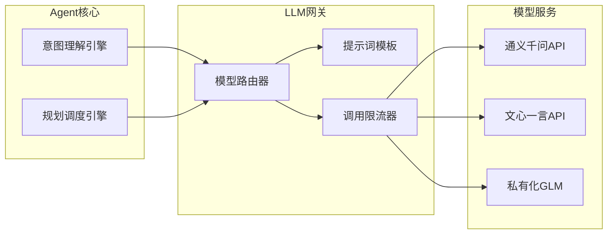
```mermaid
graph LR
    subgraph Agent核心
        A[意图理解引擎]
        B[规划调度引擎]
    end
    
    subgraph LLM网关
        C[模型路由器]
        D[提示词模板]
        E[调用限流器]
    end
    
    subgraph 模型服务
        F[通义千问API]
        G[文心一言API]
        H[私有化GLM]
    end
    
    A --> C
    B --> C
    C --> D
    C --> E
    E --> F
    E --> G
    E --> H
```

---

## 7. 部署架构

### 7.1 云端部署架构

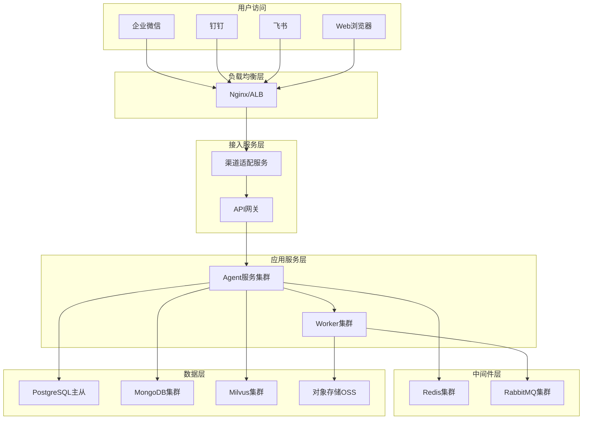
```mermaid
graph TB
    subgraph 用户访问
        A[企业微信]
        B[钉钉]
        C[飞书]
        D[Web浏览器]
    end
    
    subgraph 负载均衡层
        E[Nginx/ALB]
    end
    
    subgraph 接入服务层
        F[渠道适配服务]
        G[API网关]
    end
    
    subgraph 应用服务层
        H[Agent服务集群]
        I[Worker集群]
    end
    
    subgraph 中间件层
        J[Redis集群]
        K[RabbitMQ集群]
    end
    
    subgraph 数据层
        L[PostgreSQL主从]
        M[MongoDB集群]
        N[Milvus集群]
        O[对象存储OSS]
    end
    
    A --> E
    B --> E
    C --> E
    D --> E
    E --> F
    F --> G
    G --> H
    H --> I
    H --> J
    I --> K
    H --> L
    H --> M
    H --> N
    I --> O
```

---

## 8. 记忆系统设计

### 8.1 记忆系统概述

记忆系统是Agent实现个性化服务和持续学习的核心组件，支持存储和检索用户交互过程中的各类信息，使Agent能够"记住"用户偏好、历史行为和上下文信息。

### 8.2 记忆层次架构

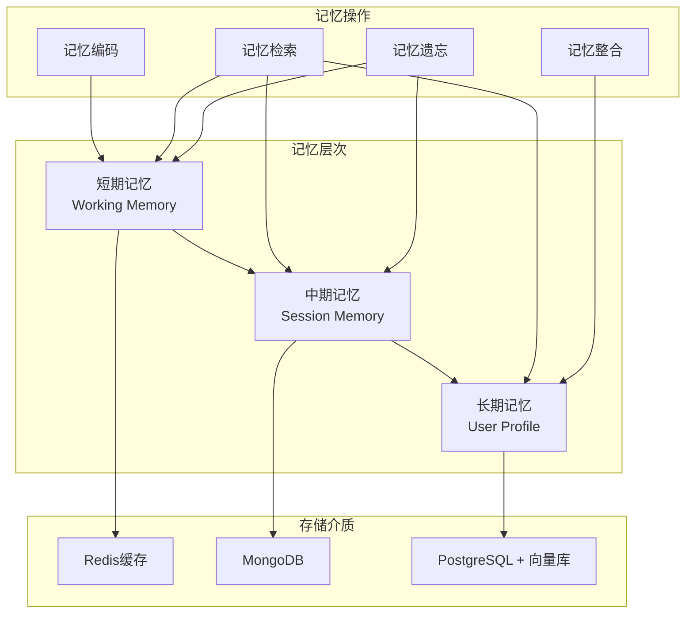
```mermaid
graph TB
    subgraph 记忆层次
        A[短期记忆<br/>Working Memory]
        B[中期记忆<br/>Session Memory]
        C[长期记忆<br/>User Profile]
    end
    
    subgraph 存储介质
        D[Redis缓存]
        E[MongoDB]
        F[PostgreSQL + 向量库]
    end
    
    subgraph 记忆操作
        G[记忆编码]
        H[记忆检索]
        I[记忆遗忘]
        J[记忆整合]
    end
    
    A --> D
    B --> E
    C --> F
    G --> A
    A --> B
    B --> C
    H --> A
    H --> B
    H --> C
    I --> A
    I --> B
    J --> C
```

### 8.3 三层记忆模型

#### 8.3.1 短期记忆（Working Memory）

**定义**：当前对话轮次内的临时上下文信息，类似于人类的工作记忆。

**特点**：
- 容量有限（最近N轮对话）
- 存储在内存/Redis中
- 生命周期：单次会话内有效
- 实时读写，毫秒级响应

**存储内容**：

```json
{
  "working_memory": {
    "session_id": "uuid",
    "user_id": "uuid",
    "current_intent": "string",
    "active_slots": {
      "slot_name": "value"
    },
    "recent_messages": [
      {
        "role": "user|assistant",
        "content": "string",
        "timestamp": "datetime"
      }
    ],
    "temp_entities": {
      "mentioned_person": "张三",
      "mentioned_date": "明天"
    },
    "focus_context": {
      "current_task": "string",
      "pending_actions": []
    }
  }
}
```

**管理策略**：
- **容量限制**：保留最近10轮对话
- **滑动窗口**：新消息进入，旧消息移出
- **重要性加权**：关键信息（意图、实体）优先保留

#### 8.3.2 中期记忆（Session Memory）

**定义**：跨对话轮次的会话级记忆，记录一次完整会话中的关键信息。

**特点**：
- 容量适中（一次会话的关键信息）
- 存储在MongoDB中
- 生命周期：会话结束后保留一段时间（如7天）
- 支持会话恢复和上下文延续

**存储内容**：

```json
{
  "session_memory": {
    "session_id": "uuid",
    "user_id": "uuid",
    "channel_type": "wecom|dingtalk|feishu",
    "created_at": "datetime",
    "updated_at": "datetime",
    "status": "active|closed",
    
    "session_summary": {
      "main_topic": "string",
      "tasks_completed": ["task1", "task2"],
      "tasks_pending": ["task3"],
      "outcome": "success|partial|failed"
    },
    
    "key_entities": {
      "people": ["张三", "李四"],
      "dates": ["2026-02-25"],
      "documents": ["周报.docx"],
      "projects": ["项目A"]
    },
    
    "user_preferences_session": {
      "response_style": "detailed|concise",
      "language": "zh-CN",
      "format_preference": "text|markdown"
    },
    
    "interaction_stats": {
      "total_turns": 15,
      "tools_used": ["email_send", "doc_writer"],
      "avg_response_time": 2.5
    },
    
    "conversation_highlights": [
      {
        "turn": 5,
        "type": "preference_expressed",
        "content": "用户喜欢简洁的回复风格"
      },
      {
        "turn": 8,
        "type": "task_completed",
        "content": "成功发送邮件给张三"
      }
    ]
  }
}
```

**管理策略**：
- **会话总结**：会话结束时生成摘要
- **关键信息提取**：使用LLM提取重要实体和偏好
- **定期归档**：超过保留期的会话记忆归档到长期记忆

#### 8.3.3 长期记忆（Long-term Memory）

**定义**：跨会话的持久化用户画像，记录用户的长期偏好、行为模式和关键信息，使用文件系统存储，结合向量库实现语义检索。

**特点**：
- 容量大（长期积累）
- 存储在文件系统（MD文件）+ 向量数据库
- 生命周期：永久保存
- 支持语义检索和相似性匹配
- 易于查看、编辑和管理

**文件系统存储架构**：

```
memory/
├── users/
│   ├── user_001/
│   │   ├── profile.md           # 用户基本信息
│   │   ├── preferences.md       # 用户偏好设置
│   │   ├── work_patterns.md     # 工作模式
│   │   ├── knowledge.md         # 知识积累
│   │   └── memories/
│   │       ├── 2026/
│   │       │   ├── 02/
│   │       │   │   ├── memory_20260224_001.md
│   │       │   │   └── memory_20260224_002.md
│   │       │   └── ...
│   │       └── ...
│   ├── user_002/
│   │   └── ...
│   └── ...
└── shared/
    └── templates/
        └── memory_template.md
```

**用户画像文件（profile.md）**：

```markdown
---
user_id: user_001
name: 张三
department: 研发部
role: 高级工程师
join_date: 2023-03-15
last_updated: 2026-02-24
---

# 用户画像

## 基本信息

- 姓名：张三
- 部门：研发部
- 职位：高级工程师
- 入职日期：2023-03-15

## 统计数据

- 总会话数：150
- 完成任务数：500
- 满意度评分：4.5
- 最后活跃：2026-02-24 14:30
```

**用户偏好文件（preferences.md）**：

```markdown
---
user_id: user_001
last_updated: 2026-02-24
---

# 用户偏好

## 沟通风格

- 正式程度：casual（随意）
- 详细程度：medium（中等）
- 首选语言：zh-CN

## 工作习惯

- 常用任务：
  - 写周报
  - 数据分析
  - 代码审查

- 常用联系人：
  - 李四（产品经理）
  - 王五（设计师）

- 工作时间：09:00-18:00

## 工具偏好

- 常用工具：
  - doc_writer（文档撰写）
  - chart_generator（图表生成）
  - sql_query（数据查询）

- 使用频率：
  - doc_writer: 45次/月
  - chart_generator: 30次/月
  - sql_query: 25次/月
```

**工作模式文件（work_patterns.md）**：

```markdown
---
user_id: user_001
last_updated: 2026-02-24
---

# 工作模式

## 周期性任务

### 周报撰写
- 触发时间：每周五 15:00-17:00
- 内容模板：项目进度、本周完成、下周计划
- 置信度：0.95
- 最近执行：2026-02-21

### 数据分析
- 触发时间：每月1日
- 内容：上月销售数据汇总
- 置信度：0.85
- 最近执行：2026-02-01

## 行为模式

### 邮件处理
- 平均每日处理邮件：15封
- 常用收件人：李四、王五
- 常用主题格式：[项目名] 主题

### 文档处理
- 偏好格式：Markdown
- 常用模板：技术方案、周报、会议纪要
```

**记忆片段文件（memory_20260224_001.md）**：

```markdown
---
memory_id: mem_20260224_001
user_id: user_001
created_at: 2026-02-24 14:30
memory_type: event
importance: 0.8
tags: [项目A, 需求讨论]
source_session: session_123
---

# 记忆：项目A需求讨论

## 摘要
用户参与了项目A的需求讨论会议，确定了核心功能模块。

## 详细内容

### 会议信息
- 时间：2026-02-24 14:00
- 参与人：张三、李四、王五
- 主题：项目A需求评审

### 关键决策
1. 优先实现用户管理模块
2. 数据分析模块延后到二期
3. 技术选型：Python + FastAPI

### 用户关注点
- 对性能要求较高
- 希望有完善的日志系统
- 倾向于使用国产数据库

## 相关实体
- 项目：项目A
- 人员：李四、王五
- 技术：Python、FastAPI
```

**向量索引结构**：

长期记忆的MD文件内容会被切片并向量化，存入向量库：

```json
{
  "vector_record": {
    "id": "vec_001",
    "user_id": "user_001",
    "memory_file": "memory/users/user_001/memories/2026/02/memory_20260224_001.md",
    "chunk_index": 0,
    "chunk_content": "用户参与了项目A的需求讨论会议，确定了核心功能模块。优先实现用户管理模块...",
    "embedding": [0.1, 0.2, ...],
    "metadata": {
      "memory_type": "event",
      "importance": 0.8,
      "created_at": "2026-02-24T14:30:00Z",
      "tags": ["项目A", "需求讨论"],
      "source_session": "session_123"
    }
  }
}
```

### 8.4 记忆操作流程

#### 8.4.1 记忆编码流程

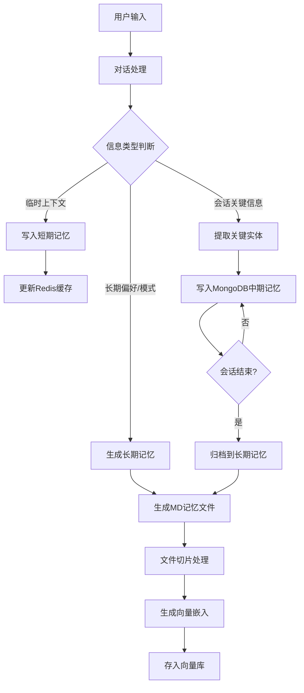
```mermaid
flowchart TB
    A[用户输入] --> B[对话处理]
    B --> C{信息类型判断}
    
    C -->|临时上下文| D[写入短期记忆]
    C -->|会话关键信息| E[提取关键实体]
    C -->|长期偏好/模式| F[生成长期记忆]
    
    D --> G[更新Redis缓存]
    E --> H[写入MongoDB中期记忆]
    F --> I[生成MD记忆文件]
    
    I --> J[文件切片处理]
    J --> K[生成向量嵌入]
    K --> L[存入向量库]
    
    H --> M{会话结束?}
    M -->|是| N[归档到长期记忆]
    M -->|否| H
    N --> I
```

#### 8.4.2 记忆检索流程

```mermaid
flowchart TB
    A[用户查询] --> B[意图理解]
    B --> C[记忆检索策略]
    
    C --> D[检索短期记忆]
    C --> E[检索中期记忆]
    C --> F[检索长期记忆]
    
    D --> G[获取当前上下文<br/>Redis]
    E --> H[获取会话相关记忆<br/>MongoDB]
    F --> I[向量相似性检索<br/>向量库]
    
    I --> J[获取匹配的记忆片段]
    J --> K[读取MD文件完整内容]
    
    G --> L[记忆融合]
    H --> L
    K --> L
    
    L --> M[生成增强上下文]
    M --> N[输入LLM生成回复]
```

#### 8.4.3 长期记忆文件管理

**文件写入流程**：

```mermaid
sequenceDiagram
    participant Session as 会话结束
    participant Memory as 记忆管理器
    participant FS as 文件系统
    participant Chunker as 文本切片器
    participant Embedding as 嵌入服务
    participant Vector as 向量库
    
    Session->>Memory: 提交会话记忆
    Memory->>Memory: 生成记忆摘要
    Memory->>FS: 写入MD文件
    FS-->>Memory: 返回文件路径
    Memory->>Chunker: 请求文件切片
    Chunker-->>Memory: 返回文本片段
    Memory->>Embedding: 生成向量嵌入
    Embedding-->>Memory: 返回向量
    Memory->>Vector: 存储向量索引
    Vector-->>Memory: 确认存储成功
```

**文件更新策略**：

| 更新类型 | 触发条件 | 操作方式 |
|----------|----------|----------|
| 追加更新 | 新增记忆片段 | 创建新MD文件，更新向量索引 |
| 合并更新 | 同类记忆累积 | 合并到现有文件，重建向量索引 |
| 覆盖更新 | 偏好/模式变更 | 覆盖现有文件，重建向量索引 |
| 删除更新 | 遗忘/用户删除 | 删除文件，清除向量索引 |

#### 8.4.4 记忆遗忘机制

**遗忘策略**：

| 记忆类型 | 遗忘条件 | 遗忘方式 |
|----------|----------|----------|
| 短期记忆 | 超出窗口容量 | FIFO滑动窗口 |
| 中期记忆 | 会话结束7天后 | 归档到长期记忆或删除 |
| 长期记忆文件 | 低重要性+长期未访问 | 移动到归档目录，降低向量权重 |

**文件归档结构**：

```
memory/
├── users/
│   └── user_001/
│       ├── memories/           # 活跃记忆
│       └── archived/           # 归档记忆
│           └── 2025/
│               └── 12/
│                   └── archived_memory_001.md
```

**重要性衰减公式**：

```
importance_score = base_importance * decay_factor^(days_since_last_access)

其中:
- base_importance: 初始重要性分数 (0-1)
- decay_factor: 衰减因子 (如0.95)
- days_since_last_access: 距上次访问的天数
```

**向量权重调整**：

```json
{
  "vector_update": {
    "memory_id": "vec_001",
    "operation": "decay_weight",
    "new_weight": 0.6,
    "reason": "90天未访问，权重衰减"
  }
}
```

### 8.5 持续学习机制

#### 8.5.1 学习流程

```mermaid
flowchart LR
    A[用户交互] --> B[记忆存储]
    B --> C[模式识别]
    C --> D{发现新模式?}
    D -->|是| E[更新用户画像]
    D -->|否| F[强化现有模式]
    E --> G[个性化服务优化]
    F --> G
```

#### 8.5.2 学习内容

1. **偏好学习**：
   - 回复风格偏好
   - 工具使用偏好
   - 工作时间习惯

2. **行为模式学习**：
   - 周期性任务识别
   - 常用联系人识别
   - 高频操作识别

3. **知识积累**：
   - 用户专业领域知识
   - 项目背景信息
   - 常用文档模板

#### 8.5.3 学习反馈循环

```mermaid
sequenceDiagram
    participant User as 用户
    participant Agent as Agent
    participant Memory as 记忆系统
    participant Learner as 学习引擎
    
    User->>Agent: 发起请求
    Agent->>Memory: 检索相关记忆
    Memory-->>Agent: 返回上下文
    Agent->>Agent: 生成个性化回复
    Agent-->>User: 返回结果
    User->>Agent: 反馈（显式/隐式）
    Agent->>Learner: 提交学习样本
    Learner->>Memory: 更新记忆模型
```

### 8.6 记忆系统架构

```mermaid
graph TB
    subgraph 应用层
        A[对话管理器]
        B[意图理解引擎]
        C[规划调度引擎]
    end
    
    subgraph 记忆服务层
        D[记忆管理器]
        E[记忆编码器]
        F[记忆检索器]
        G[学习引擎]
        H[文件管理器]
    end
    
    subgraph 存储层
        I[Redis<br/>短期记忆]
        J[MongoDB<br/>中期记忆]
        K[文件系统<br/>长期记忆MD文件]
        L[向量库<br/>语义索引]
    end
    
    A --> D
    B --> F
    C --> F
    D --> E
    D --> F
    D --> G
    D --> H
    E --> I
    E --> J
    E --> K
    H --> K
    H --> L
    F --> I
    F --> J
    F --> L
    L --> K
    G --> K
    G --> L
```

### 8.7 记忆系统数据表设计

**用户记忆索引表（user_memory_index）**：

用于管理用户的长期记忆文件索引：

| 字段 | 类型 | 说明 |
|------|------|------|
| id | UUID | 主键 |
| user_id | UUID | 用户ID |
| file_path | VARCHAR(255) | MD文件路径 |
| file_type | VARCHAR(20) | 文件类型（profile/preferences/patterns/memory） |
| created_at | TIMESTAMP | 创建时间 |
| updated_at | TIMESTAMP | 更新时间 |
| is_archived | BOOLEAN | 是否已归档 |

**记忆向量表（memory_vectors）**：

用于向量检索，指向MD文件内容：

| 字段 | 类型 | 说明 |
|------|------|------|
| id | UUID | 主键 |
| user_id | UUID | 用户ID |
| memory_file | VARCHAR(255) | 对应的MD文件路径 |
| chunk_index | INT | 文件切片索引 |
| chunk_content | TEXT | 切片内容 |
| embedding | VECTOR(1024) | 向量嵌入 |
| memory_type | VARCHAR(20) | 记忆类型 |
| importance | FLOAT | 重要性分数 |
| access_count | INT | 访问次数 |
| last_accessed | TIMESTAMP | 最后访问时间 |
| created_at | TIMESTAMP | 创建时间 |

**会话记忆表（session_memories）**：

| 字段 | 类型 | 说明 |
|------|------|------|
| id | UUID | 主键 |
| session_id | UUID | 会话ID |
| user_id | UUID | 用户ID |
| session_summary | JSONB | 会话摘要 |
| key_entities | JSONB | 关键实体 |
| conversation_highlights | JSONB | 对话亮点 |
| created_at | TIMESTAMP | 创建时间 |
| expires_at | TIMESTAMP | 过期时间 |
| archived_to_file | VARCHAR(255) | 归档后的MD文件路径 |

---

## 9. 待讨论问题

1. **Skill文件管理**：Skill文件的版本管理、审核机制、权限控制
2. **知识库建设**：企业内部知识如何接入、知识更新机制
3. **监控告警**：系统监控和运维方案
4. **成本控制**：LLM调用成本优化策略
5. **邮件系统集成**：企业邮件系统对接方案（Exchange/企业邮箱）
6. **记忆系统优化**：记忆重要性评估算法、隐私保护策略
7. **派生智能体管理**：智能体配置热更新、版本管理、权限控制

---

## 10. 版本规划建议

### V1.0 MVP版本
- 基础对话能力（基于国产大模型）
- 企业微信单渠道接入
- 核心工具集：邮件收发、OCR识别、文档摘要、信息检索
- 基础权限控制
- Skill文件解析和加载
- 短期记忆（会话上下文管理）
- 母体智能体基础规划能力

### V1.5 增强版本
- 钉钉、飞书渠道接入
- 扩展工具集：数据分析、图表生成、报告生成
- 知识库检索
- 多轮复杂任务处理
- Skill文件管理界面
- 中期记忆（会话记忆存储与检索）
- 派生智能体框架（支持创建专业化智能体）

### V2.0 完整版本
- 自定义Skill上传和管理
- 多租户支持
- 高级分析能力
- 管理后台
- 完善的监控运维体系
- 长期记忆（用户画像与持续学习）
- 多智能体协作（母体+派生智能体完整协作）

### V2.5 智能化版本
- 记忆系统优化（智能遗忘、重要性评估）
- 主动服务能力（基于记忆的主动提醒）
- 个性化服务增强
- 行为模式预测
- 智能体自动派生（根据任务自动创建专用智能体）

---

*文档版本：v1.0*
*创建日期：2026-02-24*
*更新日期：2026-02-24*
*状态：已确认*
*更新内容：*
*- v0.2: 增加多渠道适配架构、Skill扩展机制、国产大模型选型*
*- v0.3: 增加记忆系统设计（短期、中期、长期记忆）*
*- v0.4: 优化长期记忆设计，使用MD文件存储+向量库召回*
*- v0.5: 增加多智能体协作架构（母体智能体+派生智能体）*
*- v0.6: 借鉴开源实现优化设计：Skill渐进式披露、缓存保持注入、TodoManager约束机制*
*- v1.0: 最终设计文档确认*
