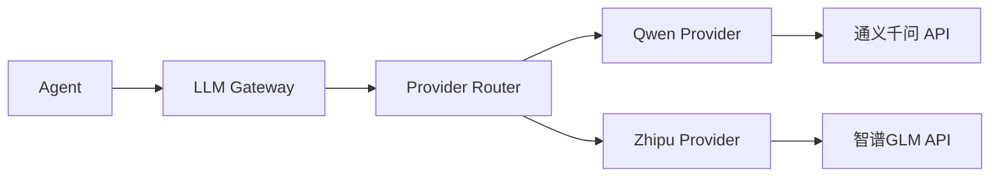
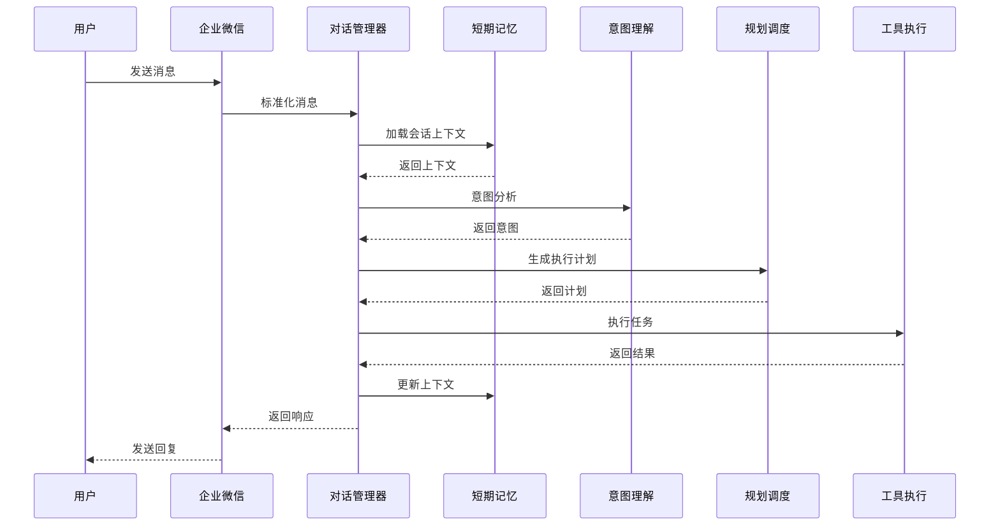
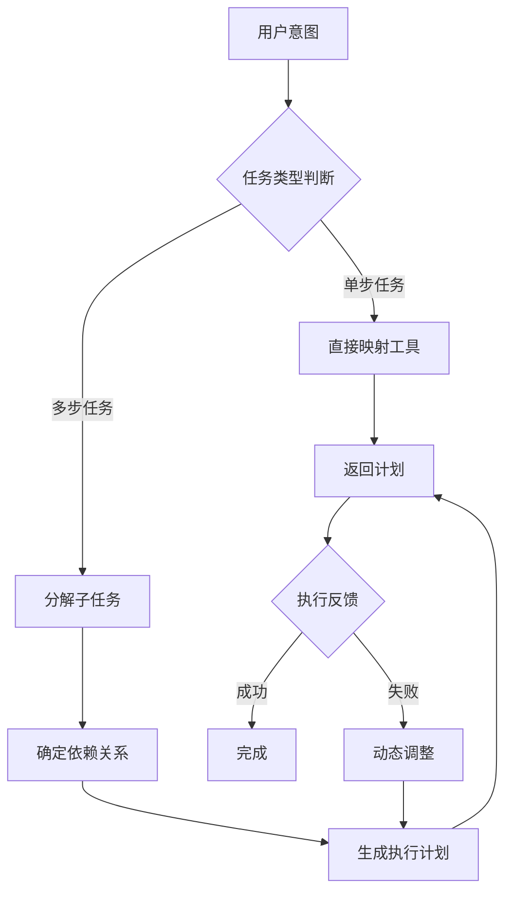
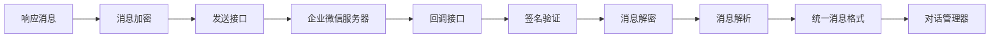
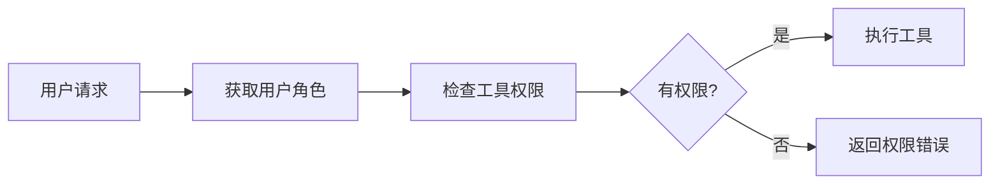

# AID Work Agent V1.0 MVP 实现计划

## 1. 概述

本文档基于 `aid-work-agent-design.md` 设计文档，详细规划 V1.0 MVP 版本的实现步骤。

### 1.1 MVP版本目标

根据设计文档第10节版本规划，V1.0 MVP版本需要实现：

| 功能模块 | 描述 | 优先级 |
|---------|------|--------|
| 基础对话能力 | 基于国产大模型的对话交互 | P0 |
| 企业微信单渠道接入 | 企业微信适配器实现 | P0 |
| 核心工具集 | 邮件收发、OCR识别、文档摘要、信息检索 | P0 |
| 基础权限控制 | RBAC权限模型基础实现 | P1 |
| Skill文件解析和加载 | 已有基础，需完善 | P0 |
| 短期记忆 | 会话上下文管理 | P0 |
| 母体智能体基础规划能力 | 任务分解与执行 | P0 |

### 1.2 现有基础

项目中已有 `v4_skills_agent.py`，已实现：

- [`SkillLoader`](v4_skills_agent.py:114) - Skill文件解析和加载
- [`TodoManager`](v4_skills_agent.py:300) - 任务列表管理
- 基础工具定义（bash, read_file, write_file, edit_file）
- Task工具（子智能体）
- Skill工具

## 2. 项目目录结构

```
aid-work-agent/
├── src/
│   ├── __init__.py
│   ├── main.py                    # 应用入口
│   ├── config/
│   │   ├── __init__.py
│   │   ├── settings.py            # 配置管理
│   │   └── logging.py             # 日志配置
│   │
│   ├── core/
│   │   ├── __init__.py
│   │   ├── agent.py               # 母体智能体
│   │   ├── dialog_manager.py      # 对话管理器
│   │   ├── intent_engine.py       # 意图理解引擎
│   │   ├── planner.py             # 规划调度引擎
│   │   └── executor.py            # 工具执行引擎
│   │
│   ├── llm/
│   │   ├── __init__.py
│   │   ├── gateway.py             # LLM网关
│   │   ├── providers/
│   │   │   ├── __init__.py
│   │   │   ├── base.py            # 基类
│   │   │   ├── qwen.py            # 通义千问
│   │   │   └── zhipu.py           # 智谱GLM
│   │   └── prompts/
│   │       ├── __init__.py
│   │       ├── system.py          # 系统提示词
│   │       └── templates.py       # 提示词模板
│   │
│   ├── channels/
│   │   ├── __init__.py
│   │   ├── base.py                # 适配器基类
│   │   ├── manager.py             # 适配器管理器
│   │   └── wecom/
│   │       ├── __init__.py
│   │       ├── adapter.py         # 企业微信适配器
│   │       ├── auth.py            # 认证处理
│   │       └── message.py         # 消息处理
│   │
│   ├── tools/
│   │   ├── __init__.py
│   │   ├── registry.py            # 工具注册表
│   │   ├── base.py                # 工具基类
│   │   ├── email/
│   │   │   ├── __init__.py
│   │   │   └── email_tool.py      # 邮件工具
│   │   ├── ocr/
│   │   │   ├── __init__.py
│   │   │   └── ocr_tool.py        # OCR工具
│   │   ├── document/
│   │   │   ├── __init__.py
│   │   │   └── doc_tool.py        # 文档摘要工具
│   │   └── search/
│   │       ├── __init__.py
│   │       └── search_tool.py     # 信息检索工具
│   │
│   ├── memory/
│   │   ├── __init__.py
│   │   ├── manager.py             # 记忆管理器
│   │   ├── short_term.py          # 短期记忆
│   │   └── models.py              # 数据模型
│   │
│   ├── skills/
│   │   ├── __init__.py
│   │   ├── loader.py              # Skill加载器（迁移自v4）
│   │   └── registry.py            # Skill注册表
│   │
│   ├── auth/
│   │   ├── __init__.py
│   │   ├── rbac.py                # RBAC权限控制
│   │   └── models.py              # 用户/角色模型
│   │
│   └── models/
│       ├── __init__.py
│       ├── message.py             # 消息模型
│       ├── session.py             # 会话模型
│       └── user.py                # 用户模型
│
├── skills/                        # Skill文件目录
│   ├── pdf/
│   │   └── SKILL.md
│   ├── email/
│   │   └── SKILL.md
│   └── document/
│       └── SKILL.md
│
├── tests/
│   ├── __init__.py
│   ├── test_agent.py
│   ├── test_dialog.py
│   ├── test_tools.py
│   └── test_channels.py
│
├── configs/
│   ├── config.yaml                # 主配置文件
│   ├── tools.yaml                 # 工具配置
│   └── prompts.yaml               # 提示词配置
│
├── requirements.txt
├── pyproject.toml
├── Dockerfile
├── docker-compose.yaml
└── README.md
```

## 3. 核心模块实现计划

### 3.1 配置管理模块

**文件**: `src/config/settings.py`

**功能**:
- 加载环境变量和YAML配置文件
- 提供统一的配置访问接口
- 支持多环境配置（开发/测试/生产）

**关键配置项**:
```yaml
# configs/config.yaml
app:
  name: aid-work-agent
  version: 1.0.0
  debug: false

llm:
  provider: qwen  # qwen | zhipu
  qwen:
    api_key: ${QWEN_API_KEY}
    model: qwen-plus
  zhipu:
    api_key: ${ZHIPU_API_KEY}
    model: glm-4

channels:
  wecom:
    corp_id: ${WECOM_CORP_ID}
    agent_id: ${WECOM_AGENT_ID}
    secret: ${WECOM_SECRET}
    token: ${WECOM_TOKEN}
    encoding_aes_key: ${WECOM_ENCODING_AES_KEY}

tools:
  email:
    smtp_server: ${SMTP_SERVER}
    smtp_port: 465
    imap_server: ${IMAP_SERVER}
  ocr:
    provider: baidu  # baidu | tencent | ali

memory:
  short_term:
    max_messages: 10
    ttl: 3600

auth:
  enabled: true
  default_role: employee
```

### 3.2 LLM网关层

**文件**: `src/llm/gateway.py`, `src/llm/providers/`

**架构图**:



**接口设计**:

```python
# src/llm/providers/base.py
from abc import ABC, abstractmethod
from typing import AsyncGenerator, List, Dict, Any

class BaseLLMProvider(ABC):
    """LLM提供者基类"""
    
    @abstractmethod
    async def chat(
        self,
        messages: List[Dict[str, Any]],
        tools: List[Dict[str, Any]] = None,
        **kwargs
    ) -> Dict[str, Any]:
        """发送对话请求"""
        pass
    
    @abstractmethod
    async def stream_chat(
        self,
        messages: List[Dict[str, Any]],
        tools: List[Dict[str, Any]] = None,
        **kwargs
    ) -> AsyncGenerator[str, None]:
        """流式对话"""
        pass
```

**实现要点**:
1. 统一消息格式（兼容OpenAI格式）
2. 工具调用支持（Function Calling）
3. 流式输出支持
4. 错误处理和重试机制

### 3.3 对话管理器

**文件**: `src/core/dialog_manager.py`

**职责**:
- 管理多轮对话上下文
- 维护会话状态
- 协调各引擎工作

**核心流程**:



**数据结构**:

```python
# src/models/session.py
from pydantic import BaseModel
from typing import Dict, List, Optional
from datetime import datetime

class SessionContext(BaseModel):
    """会话上下文"""
    current_intent: Optional[str] = None
    slots: Dict[str, Any] = {}
    history: List[Dict[str, str]] = []
    state: str = "idle"

class Session(BaseModel):
    """会话模型"""
    session_id: str
    user_id: str
    channel_type: str
    created_at: datetime
    updated_at: datetime
    context: SessionContext
```

### 3.4 意图理解引擎

**文件**: `src/core/intent_engine.py`

**职责**:
- 解析用户自然语言输入
- 识别用户意图
- 提取关键实体和参数

**意图分类**:

| 意图类别 | 具体意图 | 示例 |
|---------|---------|------|
| 邮件处理 | email_send, email_read, email_search | "发邮件给张三" |
| 文档处理 | doc_summarize, doc_translate | "总结这份文档" |
| 信息检索 | web_search, kb_search | "搜索关于XX的资料" |
| OCR识别 | ocr_image, ocr_pdf | "识别这张图片的文字" |
| 系统交互 | help, settings | "你能做什么" |

**实现方式**:
- 基于LLM的意图识别
- 使用Prompt Engineering引导模型输出结构化结果

```python
# src/llm/prompts/intent.py
INTENT_RECOGNITION_PROMPT = """你是一个意图识别助手。请分析用户输入，识别意图和关键实体。

## 可识别的意图
{intent_list}

## 输出格式
请以JSON格式输出：
{
    "intent": "意图名称",
    "confidence": 0.95,
    "entities": {
        "entity_name": "entity_value"
    },
    "need_clarification": false,
    "clarification_question": ""
}

## 用户输入
{user_input}
"""
```

### 3.5 规划调度引擎

**文件**: `src/core/planner.py`

**职责**:
- 根据意图生成执行计划
- 分解复杂任务为子任务
- 管理任务执行顺序

**规划策略**:



**执行计划结构**:

```python
# src/models/plan.py
from pydantic import BaseModel
from typing import List, Optional
from enum import Enum

class TaskStatus(str, Enum):
    PENDING = "pending"
    RUNNING = "running"
    COMPLETED = "completed"
    FAILED = "failed"

class Task(BaseModel):
    """任务模型"""
    task_id: str
    tool_name: str
    parameters: Dict[str, Any]
    dependencies: List[str] = []
    status: TaskStatus = TaskStatus.PENDING
    result: Optional[Dict[str, Any]] = None

class ExecutionPlan(BaseModel):
    """执行计划"""
    plan_id: str
    intent: str
    tasks: List[Task]
    execution_mode: str = "sequential"  # sequential | parallel
```

### 3.6 工具执行引擎

**文件**: `src/core/executor.py`, `src/tools/`

**职责**:
- 管理工具注册和发现
- 执行具体工具调用
- 处理执行结果和异常

**工具抽象模型**:

```python
# src/tools/base.py
from abc import ABC, abstractmethod
from typing import Dict, Any

class BaseTool(ABC):
    """工具基类"""
    
    name: str
    description: str
    parameters_schema: Dict[str, Any]
    
    @abstractmethod
    async def execute(self, **kwargs) -> Dict[str, Any]:
        """执行工具"""
        pass
    
    def to_tool_definition(self) -> Dict[str, Any]:
        """转换为LLM工具定义格式"""
        return {
            "name": self.name,
            "description": self.description,
            "input_schema": self.parameters_schema
        }
```

**核心工具实现**:

| 工具名称 | 功能描述 | 实现方式 |
|---------|---------|---------|
| email_send | 发送邮件 | SMTP协议 |
| email_read | 读取邮件列表 | IMAP协议 |
| ocr_image | 图片文字识别 | 百度OCR API |
| doc_summarize | 文档摘要 | LLM摘要 |
| web_search | 网络搜索 | 搜索引擎API |

### 3.7 企业微信适配器

**文件**: `src/channels/wecom/`

**架构**:



**统一消息格式**:

```python
# src/models/message.py
from pydantic import BaseModel
from typing import Optional, List
from datetime import datetime

class Attachment(BaseModel):
    """附件模型"""
    type: str  # image, file, etc.
    url: str
    name: Optional[str] = None

class UnifiedMessage(BaseModel):
    """统一消息格式"""
    message_id: str
    channel_type: str  # wecom
    user_id: str
    user_name: Optional[str] = None
    department_id: Optional[str] = None
    message_type: str  # text, image, file, event
    content: Dict[str, Any]
    attachments: List[Attachment] = []
    timestamp: datetime
    raw_message: Dict[str, Any]
```

### 3.8 短期记忆系统

**文件**: `src/memory/short_term.py`

**职责**:
- 存储当前会话的对话历史
- 管理滑动窗口
- 提供上下文检索

**实现方案**:
- 使用Redis存储（可选内存存储）
- 滑动窗口策略（保留最近10轮对话）
- TTL过期机制

```python
# src/memory/short_term.py
from typing import List, Dict, Any
from collections import deque

class ShortTermMemory:
    """短期记忆管理器"""
    
    def __init__(self, max_messages: int = 10):
        self.max_messages = max_messages
        self._cache: Dict[str, deque] = {}
    
    def add_message(self, session_id: str, message: Dict[str, Any]):
        """添加消息到记忆"""
        if session_id not in self._cache:
            self._cache[session_id] = deque(maxlen=self.max_messages)
        self._cache[session_id].append(message)
    
    def get_context(self, session_id: str) -> List[Dict[str, Any]]:
        """获取会话上下文"""
        if session_id not in self._cache:
            return []
        return list(self._cache[session_id])
    
    def clear(self, session_id: str):
        """清除会话记忆"""
        if session_id in self._cache:
            del self._cache[session_id]
```

### 3.9 基础权限控制

**文件**: `src/auth/rbac.py`

**RBAC模型**:

| 角色 | 权限范围 |
|------|---------|
| employee | 基础文档处理、个人邮件、公开信息检索 |
| manager | 部门级数据分析、部门文档管理 |
| admin | 系统配置、工具管理、用户管理 |

**权限检查流程**:



## 4. 依赖项

```txt
# requirements.txt

# Web框架
fastapi>=0.104.0
uvicorn>=0.24.0

# LLM SDK
dashscope>=1.14.0  # 通义千问
zhipuai>=2.0.0     # 智谱GLM

# 企业微信
wechatpy>=1.8.18

# 数据验证
pydantic>=2.5.0

# 配置管理
pyyaml>=6.0
python-dotenv>=1.0.0

# HTTP客户端
httpx>=0.25.0
aiohttp>=3.9.0

# 异步支持
asyncio-pool>=0.6.0

# 缓存（可选）
redis>=5.0.0

# OCR（可选）
# baidu-aip>=4.16.0

# 测试
pytest>=7.4.0
pytest-asyncio>=0.21.0

# 日志
loguru>=0.7.0
```

## 5. 实现步骤详解

### 步骤1: 项目初始化

**任务清单**:
- [ ] 创建项目目录结构
- [ ] 初始化 pyproject.toml 和 requirements.txt
- [ ] 创建配置文件模板
- [ ] 设置日志配置

### 步骤2: 实现配置管理

**任务清单**:
- [ ] 实现 settings.py 配置加载
- [ ] 实现环境变量支持
- [ ] 创建配置验证逻辑

### 步骤3: 实现LLM网关层

**任务清单**:
- [ ] 实现 BaseLLMProvider 基类
- [ ] 实现通义千问 Provider
- [ ] 实现智谱GLM Provider
- [ ] 实现 LLM Gateway 路由
- [ ] 实现工具调用支持

### 步骤4: 实现数据模型

**任务清单**:
- [ ] 实现消息模型 (UnifiedMessage)
- [ ] 实现会话模型 (Session)
- [ ] 实现用户模型 (User)
- [ ] 实现执行计划模型 (ExecutionPlan)

### 步骤5: 实现短期记忆系统

**任务清单**:
- [ ] 实现 ShortTermMemory 类
- [ ] 实现滑动窗口策略
- [ ] 实现上下文检索接口

### 步骤6: 实现Skill系统迁移

**任务清单**:
- [ ] 迁移 SkillLoader 到 src/skills/
- [ ] 完善 Skill 注册机制
- [ ] 创建基础 Skill 文件

### 步骤7: 实现工具系统

**任务清单**:
- [ ] 实现 BaseTool 基类
- [ ] 实现工具注册表
- [ ] 实现邮件工具
- [ ] 实现OCR工具
- [ ] 实现文档摘要工具
- [ ] 实现信息检索工具

### 步骤8: 实现意图理解引擎

**任务清单**:
- [ ] 实现意图识别 Prompt 模板
- [ ] 实现意图解析逻辑
- [ ] 实现实体提取

### 步骤9: 实现规划调度引擎

**任务清单**:
- [ ] 实现任务分解逻辑
- [ ] 实现执行计划生成
- [ ] 集成 TodoManager

### 步骤10: 实现工具执行引擎

**任务清单**:
- [ ] 实现工具调度器
- [ ] 实现执行结果处理
- [ ] 实现异常处理和重试

### 步骤11: 实现对话管理器

**任务清单**:
- [ ] 实现会话管理
- [ ] 实现对话流程协调
- [ ] 集成各引擎组件

### 步骤12: 实现企业微信适配器

**任务清单**:
- [ ] 实现消息回调接口
- [ ] 实现消息加解密
- [ ] 实现消息格式转换
- [ ] 实现用户信息获取

### 步骤13: 实现基础权限控制

**任务清单**:
- [ ] 实现用户/角色模型
- [ ] 实现 RBAC 权限检查
- [ ] 集成到工具执行流程

### 步骤14: 实现母体智能体

**任务清单**:
- [ ] 实现 Agent 主循环
- [ ] 集成所有组件
- [ ] 实现系统提示词

### 步骤15: 创建API接口

**任务清单**:
- [ ] 实现企业微信回调接口
- [ ] 实现健康检查接口
- [ ] 实现管理接口

### 步骤16: 编写测试

**任务清单**:
- [ ] 编写单元测试
- [ ] 编写集成测试
- [ ] 编写端到端测试

### 步骤17: 部署准备

**任务清单**:
- [ ] 编写 Dockerfile
- [ ] 编写 docker-compose.yaml
- [ ] 编写部署文档

## 6. 技术要点

### 6.1 国产大模型接入

**通义千问示例**:

```python
# src/llm/providers/qwen.py
import dashscope
from dashscope import Generation

class QwenProvider(BaseLLMProvider):
    def __init__(self, api_key: str, model: str = "qwen-plus"):
        dashscope.api_key = api_key
        self.model = model
    
    async def chat(self, messages, tools=None, **kwargs):
        response = Generation.call(
            model=self.model,
            messages=messages,
            tools=tools,
            result_format='message'
        )
        return response.output
```

### 6.2 企业微信消息加解密

使用 `wechatpy` 库处理消息加解密：

```python
# src/channels/wecom/message.py
from wechatpy.crypto import WeChatCrypto

class WecomMessageHandler:
    def __init__(self, token, encoding_aes_key, corp_id):
        self.crypto = WeChatCrypto(token, encoding_aes_key, corp_id)
    
    def decrypt_message(self, encrypted_msg, signature, timestamp, nonce):
        return self.crypto.decrypt_message(encrypted_msg, signature, timestamp, nonce)
    
    def encrypt_message(self, message, nonce, timestamp):
        return self.crypto.encrypt_message(message, nonce, timestamp)
```

### 6.3 工具调用实现

```python
# src/core/executor.py
class ToolExecutor:
    async def execute_tool(self, tool_name: str, parameters: dict) -> dict:
        tool = self.registry.get_tool(tool_name)
        if not tool:
            raise ToolNotFoundError(f"Tool {tool_name} not found")
        
        # 权限检查
        if not self.auth.check_permission(self.user, tool_name):
            raise PermissionDeniedError(f"No permission to use {tool_name}")
        
        # 执行工具
        try:
            result = await tool.execute(**parameters)
            return {"success": True, "data": result}
        except Exception as e:
            return {"success": False, "error": str(e)}
```

## 7. 验收标准

### 7.1 功能验收

- [ ] 用户可以通过企业微信与Agent对话
- [ ] Agent能够识别用户意图并正确响应
- [ ] 邮件工具能够正常收发邮件
- [ ] OCR工具能够正确识别图片文字
- [ ] 文档摘要工具能够生成摘要
- [ ] 信息检索工具能够返回搜索结果
- [ ] 多轮对话上下文能够正确保持
- [ ] Skill文件能够正确加载和使用

### 7.2 性能验收

- [ ] 对话响应时间 < 5秒（不含LLM生成时间）
- [ ] 工具执行超时处理正常
- [ ] 并发请求处理正常

### 7.3 安全验收

- [ ] 企业微信消息签名验证正常
- [ ] 权限控制生效
- [ ] 敏感配置不在代码中硬编码

## 8. 风险与缓解

| 风险 | 影响 | 缓解措施 |
|-----|------|---------|
| 国产大模型API不稳定 | 高 | 实现多Provider切换，增加重试机制 |
| 企业微信接口变更 | 中 | 封装适配层，便于维护更新 |
| OCR服务依赖 | 中 | 支持多OCR Provider切换 |
| 并发性能问题 | 中 | 使用异步架构，合理设置连接池 |

---

*文档版本: v1.0*
*创建日期: 2026-02-24*
*状态: 待确认*
